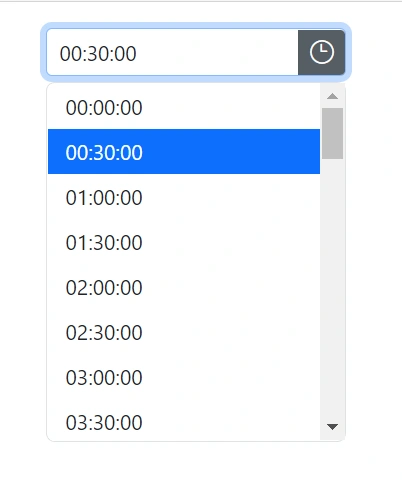

# Time Format in Blazor TimePicker

## Display Format

The display format controls how the time value is shown in the `TimePicker` control.

By default, the Blazor TimePicker's format follows the culture. You can override this by setting your own [Custom Format](https://learn.microsoft.com/en-us/dotnet/standard/base-types/custom-date-and-time-format-strings) or [Standard Format](https://learn.microsoft.com/en-us/dotnet/standard/base-types/standard-date-and-time-format-strings) through the [Format](https://help.syncfusion.com/cr/blazor/Syncfusion.Blazor.Calendars.SfTimePicker-1.html#Syncfusion_Blazor_Calendars_SfTimePicker_1_Format) property.

> Once the `Format` property is set, it is applied consistently to all cultures, regardless of their conventions for representing the time value. The format you specify becomes the standard way the time value is displayed and entered in your application.







## Input Formats

The input format controls how the time value is entered in the `TimePicker` control.

The [InputFormats](https://help.syncfusion.com/cr/blazor/Syncfusion.Blazor.Calendars.SfTimePicker-1.html#Syncfusion_Blazor_Calendars_SfTimePicker_1_InputFormats) property defines the string formats the Blazor TimePicker accepts from the user. When the user types a time in any of the specified input formats, the value is automatically converted to the display format after pressing **Enter**, the **Tab** key, or when the input loses focus. This allows intuitive data entry through multiple accepted formats. Use the `InputFormats` property to specify one or more [Custom Format](https://learn.microsoft.com/en-us/dotnet/standard/base-types/custom-date-and-time-format-strings) or [Standard Format](https://learn.microsoft.com/en-us/dotnet/standard/base-types/standard-date-and-time-format-strings) strings as an array.







## See also

* [Mask Support in Blazor TimePicker](mask-support)
* [TimeOnly Support in Blazor TimePicker](timeonly-support)
* [Globalization in Blazor TimePicker](globalization)