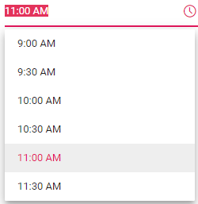
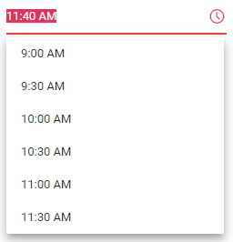

# Time Range in Blazor TimePicker Component

TimePicker provides an option to select a time value within a specified range by using the [Min](https://help.syncfusion.com/cr/blazor/Syncfusion.Blazor.Calendars.SfTimePicker-1.html#Syncfusion_Blazor_Calendars_SfTimePicker_1_Min) and [Max](https://help.syncfusion.com/cr/blazor/Syncfusion.Blazor.Calendars.SfTimePicker-1.html#Syncfusion_Blazor_Calendars_SfTimePicker_1_Max) properties. The Min value must be less than the Max value. The behavior of the `Value` property with respect to the Min/Max range depends on the [StrictMode](https://help.syncfusion.com/cr/blazor/Syncfusion.Blazor.Calendars.SfTimePicker-1.html#Syncfusion_Blazor_Calendars_SfTimePicker_1_StrictMode) property.

The following code enables selecting a time value within a range of `9:00 AM` to `11:30 AM`. For more information about StrictMode, refer to the [Strict Mode](./strict-mode) section.

```cshtml
@using Syncfusion.Blazor.Calendars

<SfTimePicker TValue="DateTime?" Value='@TimeValue' Min='@MinVal' Max='@MaxVal'></SfTimePicker>

@code{
    public DateTime MinVal { get; set; } = new DateTime(DateTime.Now.Year, DateTime.Now.Month, 15, 09, 00, 00);
    public DateTime MaxVal { get; set; } = new DateTime(DateTime.Now.Year, DateTime.Now.Month, 15, 11, 30, 00);
    public DateTime? TimeValue { get; set; } = new DateTime(DateTime.Now.Year, DateTime.Now.Month, 15, 11, 00, 00);
}

```



When the `Min` and `Max` properties are configured and the selected time value is out-of-range or invalid, then the model value will be set to `out of range` time value or `null` respectively with highlighted `error` class to indicate that the time is out of range or invalid.

```cshtml
@using Syncfusion.Blazor.Calendars

<SfTimePicker TValue="DateTime?" Value='@TimeValue' Min='@MinVal' Max='@MaxVal'></SfTimePicker>

@code{
    public DateTime MinVal { get; set; } = new DateTime(DateTime.Now.Year, DateTime.Now.Month, 15, 09, 00, 00);
    public DateTime MaxVal { get; set; } = new DateTime(DateTime.Now.Year, DateTime.Now.Month, 15, 11, 30, 00);
    public DateTime? TimeValue { get; set; } = new DateTime(DateTime.Now.Year, DateTime.Now.Month, 15, 11, 40, 00);
}
```



N> If the value of the `Min` or `Max` property is changed in code-behind, update the `Value` property so that it remains within the new range.