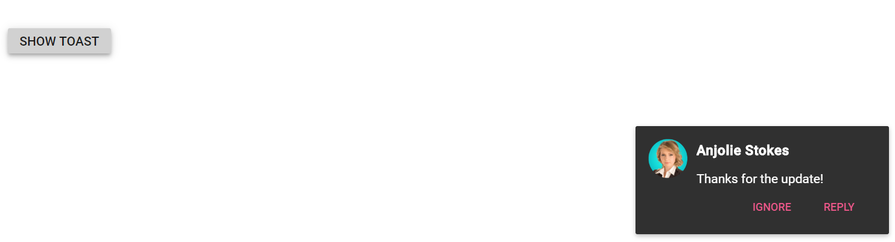

# Action Buttons in Blazor Toast Component

Add action buttons to the Blazor Toast component by defining the **ToastButtons** collection with one or more **ToastButton** items. Each button can include its own **OnClick** callback to perform actions such as dismissing the toast or triggering custom logic.

For more details, see:
- Blazor Toast overview: https://blazor.syncfusion.com/documentation/toast/
- Toast events: https://blazor.syncfusion.com/documentation/toast/events/

```cshtml
@using Syncfusion.Blazor.Buttons
@using Syncfusion.Blazor.Notifications

<SfToast @ref="ToastObj" Title="Anjolie Stokes" Width="280" Height="120" Icon="e-laura" Content="@ToastContent">
    <ToastPosition X="Right" Y="Bottom"></ToastPosition>
    <ToastButtons>
        <ToastButton Content="Ignore" OnClick="@(args => HideToast())"></ToastButton>
        <ToastButton Content="Reply"  OnClick="@(args => HideToast())"></ToastButton>
    </ToastButtons>
</SfToast>

<div class="col-lg-12 col-sm-12 col-md-12 center">
    <div id="toastBtnDefault" style="margin: auto; text-align: center">
        <SfButton OnClick="@(args => ShowToast())">Show Toast</SfButton>
    </div>
</div>

<style>
    .e-toast-icon.e-laura.e-icons {
        border-radius: 50%;
        background-repeat: no-repeat;
        background-size: cover;
        background-image: url(https://blazor.syncfusion.com/demos/images/toast/laura.png);
        height: 44px !important;
        margin: 0 10px 0 0;
        width: 60px;
    }
</style>

@code {
    private SfToast ToastObj;

    private string ToastContent { get; set; } = "Thanks for the update!";

    private async Task ShowToast()
    {
        await ToastObj.ShowAsync();
    }

    private async Task HideToast()
    {
        await ToastObj.HideAsync();
    }
}
```



## See Also

- [Configuring options](./config)