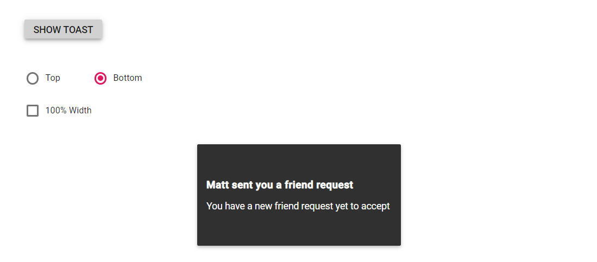

# Configuring options in Blazor Toast Component

This section describes how to customize the appearance and behavior of the Blazor Toast component using built-in APIs.

For reference:
- Blazor Toast overview: https://blazor.syncfusion.com/documentation/toast/
- SfToast API: https://help.syncfusion.com/cr/blazor/Syncfusion.Blazor.Notifications.SfToast.html
- Toast events: https://blazor.syncfusion.com/documentation/toast/events/
- Positioning: https://blazor.syncfusion.com/documentation/toast/position

## Title and content template

Create a toast with a notification message that includes a title and content. These values adapt to different screen sizes.

N> Title and Content can be provided as plain text or HTML markup via string parameters. For richer layouts, use toast templates (for example, **ToastTemplates** or **ContentTemplate**) to define custom content.

```cshtml
@using Syncfusion.Blazor.Buttons
@using Syncfusion.Blazor.Notifications

<SfToast @ref="ToastObj" Title="Adaptive Tiles Meeting" Content="@ToastContent">
    <ToastPosition X="Center"></ToastPosition>
</SfToast>

<div class="col-lg-12 col-sm-12 col-md-12 center">
    <div style="margin: auto; text-align: center">
        <SfButton OnClick="@ShowToast">Show Toast</SfButton>
    </div>
</div>

@code {
    private SfToast ToastObj;

    private string ToastContent = "Conference Room 01 / Building 135 — 10:00 AM–10:30 AM";

    private async Task ShowToast()
    {
        await ToastObj.ShowAsync();
    }
}
```


## Specifying custom target

By default, the toast is rendered in the document body. The target container can be changed using the **Target** property. Based on the target, the **ToastPosition** will be applied relative to that container.

- Target property: https://help.syncfusion.com/cr/blazor/Syncfusion.Blazor.Notifications.SfToast.html#Syncfusion_Blazor_Notifications_SfToast_Target
- Position docs: https://blazor.syncfusion.com/documentation/toast/position

## Close button

By default, the **ShowCloseButton** property is disabled. Enable it to display a close button that dismisses the toast before it expires.

- ShowCloseButton API: https://help.syncfusion.com/cr/blazor/Syncfusion.Blazor.Notifications.SfToast.html#Syncfusion_Blazor_Notifications_SfToast_ShowCloseButton

## Progress bar

By default, the **ShowProgressBar** property is disabled. When enabled, it visually indicates the remaining time until the toast expires, based on the **Timeout** property.

- ShowProgressBar API: https://help.syncfusion.com/cr/blazor/Syncfusion.Blazor.Notifications.SfToast.html#Syncfusion_Blazor_Notifications_SfToast_ShowProgressBar
- Timeout API: https://help.syncfusion.com/cr/blazor/Syncfusion.Blazor.Notifications.SfToast.html#Syncfusion_Blazor_Notifications_SfToast_Timeout

### Progress bar direction

By default, **ProgressDirection** is "Rtl" and appears from right to left. Set **ProgressDirection** to "Ltr" to display from left to right.

- ProgressDirection API: https://help.syncfusion.com/cr/blazor/Syncfusion.Blazor.Notifications.SfToast.html#Syncfusion_Blazor_Notifications_SfToast_ProgressDirection

## Newest on top

By default, newly created toasts are appended after existing toasts. Enable **NewestOnTop** to insert new toasts before existing toasts.

- NewestOnTop API: https://help.syncfusion.com/cr/blazor/Syncfusion.Blazor.Notifications.SfToast.html#Syncfusion_Blazor_Notifications_SfToast_NewestOnTop

The following sample demonstrates the combination of **Target**, **ShowCloseButton**, **ShowProgressBar**, and **NewestOnTop** properties.

```cshtml
@using Syncfusion.Blazor.Buttons
@using Syncfusion.Blazor.Notifications

<div class="control-section toast-default-section">
    <SfToast @ref="ToastObj"
             Title="File Downloading"
             Content="@ToastContent"
             ShowCloseButton="true"
             ProgressDirection="Ltr"
             Target="#toast_target"
             NewestOnTop="true"
             ShowProgressBar="true">
        <ToastPosition X="Center"></ToastPosition>
    </SfToast>

    <div class="col-lg-12 col-sm-12 col-md-12 center">
        <div style="margin: auto; text-align: center">
            <SfButton OnClick="@ShowToast">Show Toast</SfButton>
        </div>
    </div>

    <br /><br />
    <div id="toast_target"></div>
</div>

@code {
    private SfToast ToastObj;

    private string ToastContent = "<div class='progress'><span style='width: 80%'></span></div>";

    private async Task ShowToast()
    {
        await ToastObj.ShowAsync();
    }
}

<style>
    .progress {
        height: 20px;
        position: relative;
        margin: 20px 0;
        background: #555;
        border-radius: 25px;
        box-shadow: inset 0 -1px 1px rgba(255, 255, 255, 0.3);
    }

    .progress span {
        background-color: #f0a3a3;
        background-image: -webkit-gradient(linear, left top, left bottom, color-stop(0, #f0a3a3), color-stop(1, #f42323));
        display: block;
        height: 100%;
        border-radius: 10px;
        width: 50%;
        position: relative;
        overflow: hidden;
    }

    .progress span::after {
        background-image: -webkit-gradient(
            linear,
            0 0,
            100% 100%,
            color-stop(.25, rgba(255, 255, 255, .2)),
            color-stop(.25, transparent),
            color-stop(.5, transparent),
            color-stop(.5, rgba(255, 255, 255, .2)),
            color-stop(.75, rgba(255, 255, 255, .2)),
            color-stop(.75, transparent),
            to(transparent)
        );
        content: "";
        position: absolute;
        inset: 0;
        background-size: 50px 50px;
        -webkit-animation: moveAnimate 2s linear infinite;
        overflow: hidden;
    }

    @@-webkit-keyframes moveAnimate {
        0% { background-position: 0 0; }
        100% { background-position: 50px 50px; }
    }
</style>
```


## Width and height

Set toast dimensions using the **Width** and **Height** properties. Each toast can have custom dimensions. By default, the toast is rendered with 300px width and auto height.

N> On mobile devices, the default toast width is 100% of the page. When **Width** is set to 100%, the toast occupies the full width of the viewport and is displayed at the top or bottom based on the **ToastPosition** Y setting.

Both **Width** and **Height** accept pixel values, percentages, or numbers. A numeric value is interpreted as pixels.

- Width API: https://help.syncfusion.com/cr/blazor/Syncfusion.Blazor.Notifications.SfToast.html#Syncfusion_Blazor_Notifications_SfToast_Width
- Height API: https://help.syncfusion.com/cr/blazor/Syncfusion.Blazor.Notifications.SfToast.html#Syncfusion_Blazor_Notifications_SfToast_Height

```cshtml
@using Syncfusion.Blazor.Buttons
@using Syncfusion.Blazor.Notifications

<div class="control-section toast-default-section">
    <SfToast @ref="ToastObj"
             Title="@Title"
             Width="@Width"
             Height="@Height"
             Content="@ToastContent">
        <ToastPosition X="Center" Y="@PositionY"></ToastPosition>
    </SfToast>

    <div class="col-lg-12 col-sm-12 col-md-12 center">
        <div style="margin: auto; text-align: center">
            <SfButton OnClick="@ShowToast">Show Toast</SfButton>
        </div>
    </div>

    <div class="row" style="padding-top: 20px" id="toast_pos_target">
        <table style="margin-left: 200px">
            <tr>
                <td>
                    <div style="padding:25px 0 0 0;">
                        <SfRadioButton TValue="string"
                                       Name="toast"
                                       Label="Top"
                                       Value="Top"
                                       Change="@RadioButtonChange"
                                       Checked="true">
                        </SfRadioButton>
                    </div>
                </td>
                <td>
                    <div style="padding:25px 0 0 0;">
                        <SfRadioButton TValue="string"
                                       Name="toast"
                                       Label="Bottom"
                                       Value="Bottom"
                                       Change="@RadioButtonChange">
                        </SfRadioButton>
                    </div>
                </td>
            </tr>
            <tr>
                <td>
                    <div style="padding:25px 0 0 0;">
                        <SfCheckBox TChecked="bool"
                                    Label="100% Width"
                                    Change="@CheckBoxChange">
                        </SfCheckBox>
                    </div>
                </td>
            </tr>
        </table>
    </div>

    <br /><br />
    <div id="result"></div>
</div>

@code {
    private SfToast ToastObj;

    private string Width { get; set; } = "400";
    private string Height { get; set; } = "120";
    private string PositionY { get; set; } = "Bottom";

    private string Title { get; set; } = "Notification received";
    private string ToastContent { get; set; } = "A new item is pending review.";

    private async Task ShowToast()
    {
        await ToastObj.ShowAsync();
    }

    private async Task CheckBoxChange(Syncfusion.Blazor.Buttons.ChangeEventArgs<bool> e)
    {
        await ToastObj.HideAsync();

        if (e.Checked)
        {
            Width = "100%";
            Title = string.Empty;
            ToastContent = "<div class='e-custom'>Explore the next generation <b>JavaScript</b> library. <a href='https://blazor.syncfusion.com/home/index.html' target='_blank' rel='noopener'>Learn more</a></div>";
        }
        else
        {
            Width = "300";
            Title = "Notification received";
            ToastContent = "A new item is pending review.";
        }

        StateHasChanged();
    }

    private async Task RadioButtonChange(Syncfusion.Blazor.Buttons.ChangeArgs<string> e)
    {
        PositionY = e.Value == "Top" ? "Top" : "Bottom";
        await ToastObj.HideAsync();
        StateHasChanged();
    }
}
```



## Show or hide toast using service

Initialize a single toast instance and reuse it across an application by creating a service. The following steps show how to create a service to display toast notifications from any page.

- Creating a toast service (DI): https://learn.microsoft.com/aspnet/core/blazor/fundamentals/dependency-injection

**Step 1**: Create a toast service to inject into pages to show toast messages from anywhere. In this example, Title and Content are passed to display the toast message.

```csharp
public class ToastOption
{
    public string Title { get; set; }
    public string Content { get; set; }
}

public class ToastService
{
    public event Action<ToastOption> ShowToastTrigger;

    public void ShowToast(ToastOption options)
    {
        // Invoke ToastComponent to update and show the toast with messages
        ShowToastTrigger?.Invoke(options);
    }
}
``` 

**Step 2**: Add the ToastService to the services collection in Program.cs.



using BlazorApp.Data;
using Microsoft.AspNetCore.Components;
using Microsoft.AspNetCore.Components.Web;
using Syncfusion.Blazor;
using BlazorApp.Components;

var builder = WebApplication.CreateBuilder(args);

// Add services to the container.
builder.Services.AddRazorPages();
builder.Services.AddServerSideBlazor();
builder.Services.AddSingleton<WeatherForecastService>();
builder.Services.AddSingleton<ToastService>();
builder.Services.AddSyncfusionBlazor();

var app = builder.Build();

// Configure the HTTP request pipeline.
if (!app.Environment.IsDevelopment())
{
    app.UseExceptionHandler("/Error");
    app.UseHsts();
}

app.UseHttpsRedirection();

app.UseStaticFiles();

app.UseRouting();

app.MapBlazorHub();
app.MapFallbackToPage("/_Host");

app.Run();


    
**Step 3**: Create ToastComponent, which shows SfToast based on ToastService notifications.
        


@using Syncfusion.Blazor.Notifications
@inject ToastService ToastService

<SfToast @ref="Toast" Timeout="2000">
    <ToastTemplates>
        <Title>@Options.Title</Title>
        <Content>@Options.Content</Content>
    </ToastTemplates>
    <ToastPosition X="Right"></ToastPosition>
</SfToast>

@code {
    private SfToast Toast;

    private ToastOption Options = new ToastOption();

    protected override void OnInitialized()
    {
        ToastService.ShowToastTrigger += (ToastOption options) =>
        {
            InvokeAsync(async () =>
            {
                Options.Title = options.Title;
                Options.Content = options.Content;
                StateHasChanged();
                await Toast.ShowAsync();
            });
        };
        base.OnInitialized();
    }
}


    
**Step 4**: Add the ToastComponent created in the above step to MainLayout.razor.



@inherits LayoutComponentBase
@using BlazorApp.Components;

<PageTitle>BlazorApp</PageTitle>

<div class="page">
    <div class="sidebar">
        <NavMenu />
    </div>

    <main>
        <div class="top-row px-4">
            <a href="https://docs.microsoft.com/aspnet/" target="_blank" rel="noopener">About</a>
        </div>

        <article class="content px-4">
            @Body
        </article>
    </main>
</div>

<ToastComponent />


    
**Step 5**: Inject ToastService in any page and call ToastService.ShowToast to display toast notifications.



@page "/"
@using BlazorApp.Components
@inject ToastService ToastService

<button class="e-btn" @onclick="@ShowToast">Show Toast</button>

@code {
    private void ShowToast()
    {
        ToastService.ShowToast(new ToastOption
        {
            Title = "Toast Title",
            Content = "Toast content"
        });
    }
}


    
N> [View the sample in GitHub](https://github.com/SyncfusionExamples/Show-or-hide-toast-using-service-in-Blazor)