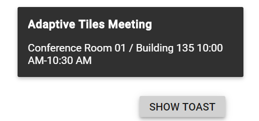
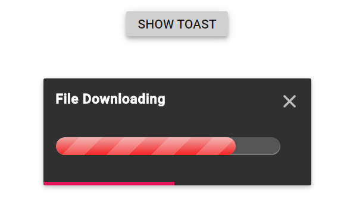

# Configuring options in Blazor Toast Component

This section explains the steps required to customize the appearance of the toast using built-in APIs.

## Title and content template

Toast can be created with the notification message. The message contains `Title` and content of the toasts. The title and contents are adaptable in any resolution.

> The Title or `Content` property can be given as HTML Element/element ID to a string that can be displayed as a toast.

```cshtml

@using Syncfusion.Blazor.Buttons
@using Syncfusion.Blazor.Notifications

<SfToast ID="toast_default" @ref="ToastObj" Title="Adaptive Tiles Meeting" Content="@ToastContent">
    <ToastPosition X="Center"></ToastPosition>
</SfToast>

<div class="col-lg-12 col-sm-12 col-md-12 center">
    <div id="toastBtnDefault" style="margin: auto;text-align: center">
        <SfButton @onclick="@ShowToast"> Show Toast </SfButton>
    </div>
</div>

<style>
    #toast_default .e-meeting::before {
        content: "\e705";
        font-size: 17px;
    }
</style>

@code {
    SfToast ToastObj;

    private string ToastContent = "Conference Room 01 / Building 135 10:00 AM-10:30 AM";

    private async Task ShowToast()
    {
       await this.ToastObj.ShowAsync();
    }
}

```



## Specifying custom target

By default, the toast can be rendered in the document body. The target position can be changed for the toast rendering using the `Target` property. Based on the target, the `Position` will be updated.

## Close button

By default, the `ShowCloseButton` is not enabled. It can be enabled by setting the true value. Before expiring the toast, use this button to close or destroy toasts manually.

## Progress bar

By default, the `ShowProgressBar` is not enabled. If it is enabled, it can visually indicate how long it gets for the toast to expire. Based on the `Timeout` property, progress bar will appear.

### Progress bar direction

By default, the `ProgressDirection` is set to "Rtl" and it will appear from right to left direction. The progressDirection can be changed to "Ltr" to make it appear from left to right direction.

## Newest on top

By default, the newly created toasts will append next with existing toasts. The sequence can be changed like inserting before the toast by enabling the `NewestOnTop`.

Here, the following sample demonstrates the combination of the `Target`, `ShowCloseButton`, `ShowProgressBar` and `NewestOnTop` properties in toast.

```cshtml

@using Syncfusion.Blazor.Buttons
@using Syncfusion.Blazor.Notifications

<div class="control-section toast-default-section">
    <SfToast ID="toast_default" @ref="ToastObj" Title="File Downloading" Content="@ToastContent"
             ShowCloseButton="true" ProgressDirection="Ltr" Target="#toast_target" NewestOnTop="true" ShowProgressBar="true">
        <ToastPosition X="Center"></ToastPosition>
    </SfToast>

    <div class="col-lg-12 col-sm-12 col-md-12 center">
        <div id="toastBtnDefault" style="margin: auto; text-align: center">
            <SfButton @onclick="@ShowToast"> Show Toast </SfButton>
        </div>
    </div>
    <br /><br />
    <div id='toast_target'></div>
</div>

@code {
    SfToast ToastObj;

    private string ToastContent = "<div class='progress'><span style='width: 80%'></span></div>";

    private async Task ShowToast()
    {
       await this.ToastObj.ShowAsync();
    }
}

<style>
    #toast_default .e-meeting::before {
        content: "\e705";
        font-size: 17px;
    }

    .progress {
        height: 20px;
        position: relative;
        margin: 20px 0 20px 0;
        background: #555;
        -moz-border-radius: 25px;
        -webkit-border-radius: 25px;
        border-radius: 25px;
        box-shadow: inset 0 -1px 1px rgba(255, 255, 255, 0.3);
    }

    .progress span {
        background-color: #f0a3a3;
        background-image: -webkit-gradient(linear, left top, left bottom, color-stop(0, #f0a3a3), color-stop(1, #f42323));
        display: block;
        height: 100%;
        border-radius: 10px;
        width: 50%;
        position: relative;
        overflow: hidden;
    }

    .progress span::after {
        background-image: -webkit-gradient(linear, 0 0, 100% 100%, color-stop(.25, rgba(255, 255, 255, .2)), color-stop(.25, transparent), color-stop(.5, transparent), color-stop(.5, rgba(255, 255, 255, .2)), color-stop(.75, rgba(255, 255, 255, .2)), color-stop(.75, transparent), to(transparent));
        content: "";
        position: absolute;
        top: 0;
        left: 0;
        bottom: 0;
        right: 0;
        background-size: 50px 50px;
        -webkit-animation: moveAnimate 2s linear infinite;
        overflow: hidden;
    }

    @@-webkit-keyframes moveAnimate {
        0% {
            background-position: 0 0;
        }

        100% {
            background-position: 50px 50px;
        }
    }
</style>

```



## Width and height

The dimensions of the toast can be set using the `Width` and `Height` properties. This will individually set all toasts. Different custom dimension toasts can be created.

By default, the toast can be rendered with `300px` width with `auto` height.

> In mobile devices, the default width of the toast gets '100%' width of the page. When the toast width is set as '100%', the toast occupies full width and will be displayed at the top or bottom based on the position `Y` property.

Both the width and height properties allow setting pixels/numbers/percentage. The number value is considered as pixels.

```cshtml

@using Syncfusion.Blazor.Buttons
@using Syncfusion.Blazor.Notifications

<div class="control-section toast-default-section">
    <SfToast @ref="ToastObj" Title="@Title" Width="@Width" Height="@Height" Content="@ToastContent">
        <ToastPosition X="Center" Y="@PositionY"></ToastPosition>
    </SfToast>

    <div class="col-lg-12 col-sm-12 col-md-12 center">
        <div id="toastBtnDefault" style="margin: auto; text-align: center">
            <SfButton @onclick="@ShowToast"> Show Toast </SfButton>
        </div>
    </div>

    <div class='row' style="padding-top: 20px" id="toast_pos_target">
        <table style="margin-left: 200px">
            <tr>
                <td>
                    <div style='padding:25px 0 0 0;'>
                        <SfRadioButton Name="toast" Label="Top" Value="Target"  TChecked="string" @bind-Checked="@RadioTopChecked" ValueChange="@RadioButtonChange"></SfRadioButton>
                    </div>
                </td>
                <td>
                    <div style='padding:25px 0 0 0;'>
                        <SfRadioButton Name="toast" Label="Bottom" Value="Global" TChecked="string" ValueChange="@RadioButtonChange" @bind-Checked="@RadioBottomChecked"></SfRadioButton>
                    </div>
                </td>
            </tr>
            <tr>
                <td>
                    <div style='padding:25px 0 0 0;'>
                        <SfCheckBox Label="100% Width" TChecked="bool" ValueChange="@CheckBoxChange"></SfCheckBox>
                    </div>
                </td>
            </tr>
        </table>
    </div>
    <br /><br />
    <div id='result'></div>
</div>

@code {
    SfToast ToastObj;

    private string Width { get; set; } = "400";
    private string Height { get; set; } = "120";
    private string PositionY { get; set; } = "Bottom";
    private string RadioBottomChecked { get; set; } = "Global";
    private string RadioTopChecked { get; set; } = "Target";

    private string Title { get; set; } = "Matt sent you a friend request";
    private string ToastContent { get; set; } = "You have a new friend request yet to accept";

    private async Task ShowToast()
    {
        await this.ToastObj.ShowAsync();
    }

    private async Task CheckBoxChange(Syncfusion.Blazor.Buttons.ChangeEventArgs<bool> e)
    {
        if (e.Checked)
        {
            await ToastObj.HideAsync();
            this.Width = "100%";
            this.Title = "";
            this.ToastContent = "<div class='e-custom'>Take a look at our next generation <b>Javascript</b> <a href='https://blazor.syncfusion.com/home/index.html' target='_blank'>LEARN MORE</a></div>";
            StateHasChanged();
        }
        else
        {
            await ToastObj.HideAsync();
            this.Width = "300";
            this.Title = "Matt sent you a friend request";
            this.ToastContent = "You have a new friend request yet to accept";
            StateHasChanged();
        }
    }

    private async Task RadioButtonChange(Syncfusion.Blazor.Buttons.ChangeArgs<string> e)
    {
        if (e.Value == "Target")
        {
            this.PositionY = "Top";
            await ToastObj.HideAsync();
            StateHasChanged();
        }
        else if (e.Value == "Global")
        {
            this.PositionY = "Bottom";
            await ToastObj.HideAsync();
            StateHasChanged();
        }
    }
}

```

