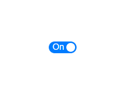

<!-- markdownlint-disable MD024 -->

# Getting Started with Blazor Toggle Switch Button Component

This section briefly explains about how to include Toggle Switch Button Component in the Blazor server-side  application. Refer [Getting Started with Syncfusion Blazor for Server-side in Visual Studio](https://blazor.syncfusion.com/documentation/getting-started/blazor-server-side-visual-studio/) page for the introduction and configuring the common specifications.

To get start quickly with Toggle Switch Button Component using Blazor, check on this video:



## Importing Syncfusion Blazor component in the application

1. Install the **Syncfusion.Blazor** NuGet package to the application by using the `NuGet Package Manager`.

2. Add the client-side style resources through [CDN](https://blazor.syncfusion.com/documentation/appearance/themes#cdn-reference) or from [NuGet](https://blazor.syncfusion.com/documentation/appearance/themes#static-web-assets) package in the `<head>` element of the `~/Pages/_Host.cshtml` page.

> Please ensure to check the **Include prerelease** option.

```html
<head>
    <link href="_content/Syncfusion.Blazor/styles/bootstrap4.css" rel="stylesheet" />
    @*<link href="https://cdn.syncfusion.com/blazor/{{ site.blazorversion }}/styles/bootstrap4.css" rel="stylesheet" />*@
</head>
```

For Internet Explorer 11 kindly refer the polyfills. Refer the [documentation](https://blazor.syncfusion.com/documentation/common/how-to/render-blazor-server-app-in-ie/) for more information.

```html
<head>
    <link href="_content/Syncfusion.Blazor/styles/bootstrap4.css" rel="stylesheet" />
    <script src="https://github.com/Daddoon/Blazor.Polyfill/releases/download/3.0.1/blazor.polyfill.min.js"></script>
</head>
```

## Adding component package to the application

Open `/_Imports.razor file` and import the **Syncfusion.Blazor.Buttons** package.

```csharp

@using Syncfusion.Blazor.Buttons

```

## Add SyncfusionBlazor service in Startup.cs

Open the **Startup.cs** file and add services required by Syncfusion components.
Add **services.AddSyncfusionBlazor()** method in the ConfigureServices function as follows.

```csharp
namespace BlazorApplication
{
    public class Startup
    {
        ....
        ....
        public void ConfigureServices(IServiceCollection services)
        {
            ....
            ....
            services.AddSyncfusionBlazor();
        }
    }
}
```

> To enable custom client side resource loading from CRG or CDN. Resource loading has to be disabled by **AddSyncfusionBlazor(true)** and load the scripts in the HEAD element of the **~/Pages/_Host.cshtml** page.

```cshtml
<head>
    <environment include="Development">
        <script src="https://cdn.syncfusion.com/blazor/{{ site.blazorversion }}/syncfusion-blazor.min.js">
        </script>
    </environment>
</head>
```

## Adding Toggle Switch Button component to the application

Now, add the Syncfusion Blazor Toggle Switch Button component in `razor` page in the `Pages` folder. For example the Toggle Switch Button component is added in the `~/Pages/Index.razor` page.

```cshtml
<label for="checked" style="padding: 10px 10px 10px 0">USB Tethering</label>

<SfSwitch @bind-Checked="isChecked"></SfSwitch>

@code {
    private bool isChecked = true;
}
```

## Run the application

After successful compilation of the application, simply press F5 to run the application. The Blazor Toggle Switch Button component will render in the web browser as shown below.


## Set text on Switch

This section explains how to set `OnLabel` and `OffLabel` texts on Switch. In the following example, `onLabel` is set as `ON` and `offLabel` is set as `OFF`.

```cshtml
<SfSwitch @bind-Checked="isChecked" OnLabel="On" OffLabel="Off"></SfSwitch>

@code {
    private bool isChecked = true;
}
```

> Switch does not have text support for material themes, and does not support long custom text.



## See Also

* [Getting Started with Syncfusion Blazor for Client-Side in .NET Core CLI](https://blazor.syncfusion.com/documentation/getting-started/blazor-webassembly-dotnet-cli/)
* [Getting Started with Syncfusion Blazor for Server-Side in Visual Studio](https://blazor.syncfusion.com/documentation/getting-started/blazor-server-side-visual-studio/)
* [Getting Started with Syncfusion Blazor for Server-Side in .NET Core CLI](https://blazor.syncfusion.com/documentation/getting-started/blazor-server-side-dotnet-cli/)