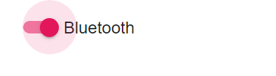

# Enable Ripple for Toggle Switch Button Label

By default, label with ripple effect is not available in Toggle Switch Button. You can achieve this using `IJSRuntime` method. The following example illustrates how to enable ripple effect for labels in Toggle Switch Button component.

```csharp

@using Syncfusion.Blazor.Buttons

<SfSwitch>Bluetooth</SfSwitch>

@code {
    [Inject]
    private IJSRuntime jsRuntime { get; set; }

    protected override void OnAfterRender()
    {
        this.jsRuntime.Sf().EnableRipple(true);
    }
}

```

Output be like

