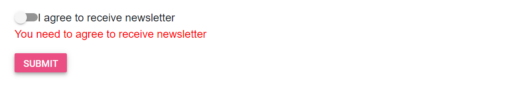

# Model binding in Blazor Toggle Switch Button Component

This section demonstrates the strongly typed extension support in Toggle Switch Button. The view that can bind with any model is called as strongly typed view. You can bind any class as model to view. The model properties can be accessed on that view. The data associated with model can be used to render the component.

In this sample, first check the option and click the submit button to post the selected value in the Toggle Switch Button. When value is not checked, validation error message will be shown below the Toggle Switch Button.

```cshtml

@using Syncfusion.Blazor.Buttons
@using System.ComponentModel.DataAnnotations

<EditForm Model="Annotate">
    <DataAnnotationsValidator></DataAnnotationsValidator>
    <div class="form-group">
        <SfSwitch @bind-Checked="@Annotate.Check">I agree to receive newsletter</SfSwitch>
        <ValidationMessage For="@(() => Annotate.Check)" />
    </div>
    <SfButton HtmlAttributes="@Submit" Content="Submit" IsPrimary="true"></SfButton>
</EditForm>

@code {

    public Annotation Annotate = new Annotation();

    public class Annotation
    {
        [Range(typeof(bool), "true", "true", ErrorMessage = "You need to agree to receive newsletter")]
        public bool Check { get; set; }
    }
    public Dictionary<string, object> Submit = new Dictionary<string, object>()
    {
        { "type", "submit"}
    };
}

```

