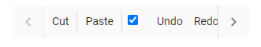

# Set item-wise custom template

The Toolbar supports adding template commands using the  `Template` property. Template property can be given as the `HTML element` or `RenderFragment`.

```csharp

@using Syncfusion.Blazor.Navigations

<SfToolbar Width="300">
    <ToolbarItems>
        <ToolbarItem Text="Cut" TooltipText="Cut"></ToolbarItem>
        <ToolbarItem Type="ItemType.Separator"></ToolbarItem>
        <ToolbarItem Text="Paste"></ToolbarItem>
        <ToolbarItem Type="ItemType.Separator"></ToolbarItem>
        <ToolbarItem>
            <Template>
                <div><input type='checkbox' title="Accept" checked/>
                </div>
            </Template>
        </ToolbarItem>
        <ToolbarItem Text="Undo"></ToolbarItem>
        <ToolbarItem Text="Redo"></ToolbarItem>
        <ToolbarItem>
            <Template>
                <button id="template" class="e-btn">Template</button>
            </Template>
        </ToolbarItem>
    </ToolbarItems>
</SfToolbar>

```

Output be like the below.

