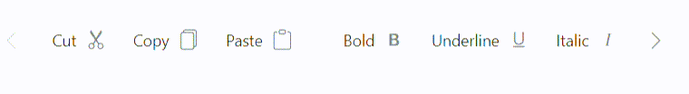

# Tab key navigation Toolbar item in Blazor Toolbar Component

The `TabIndex`(https://help.syncfusion.com/cr/blazor/Syncfusion.Blazor.Navigations.ToolbarItem.html#Syncfusion_Blazor_Navigations_ToolbarItem_TabIndex) property of a Toolbar item is used to enable tab key navigation for the item. By default, the user can switch between items using the arrow keys, but the `TabIndex` property allows you to switch between items using the Tab and Shift+Tab keys as well.

To use the `TabIndex`(https://help.syncfusion.com/cr/blazor/Syncfusion.Blazor.Navigations.ToolbarItem.html#Syncfusion_Blazor_Navigations_ToolbarItem_TabIndex) property, you need to set it for each Toolbar item that you want to enable tab key navigation. The `TabIndex` property should be set to a positive integer value. A value of 0 or a negative value will disable tab key navigation for the item.

```csharp

@using Syncfusion.Blazor.Navigations

<SfToolbar Width="600">
    <ToolbarItems>
        <ToolbarItem SuffixIcon="e-icons e-cut" Text="Cut" TabIndex=0 ></ToolbarItem>
        <ToolbarItem SuffixIcon="e-icons e-copy" Text="Copy" TabIndex=0 ></ToolbarItem>
        <ToolbarItem SuffixIcon="e-icons e-paste" Text="Paste" TabIndex=0></ToolbarItem>
        <ToolbarItem Type="ItemType.Separator"></ToolbarItem>
        <ToolbarItem SuffixIcon="e-icons e-bold" Text="Bold" TabIndex=0 ></ToolbarItem>
        <ToolbarItem SuffixIcon="e-icons e-underline" Text="Underline" TabIndex=0 ></ToolbarItem>
        <ToolbarItem SuffixIcon="e-icons e-italic" Text="Italic" TabIndex=0 ></ToolbarItem>
        <ToolbarItem SuffixIcon="e-icons e-paint-bucket" Text="Color-Picker" TabIndex=0 ></ToolbarItem>
        <ToolbarItem Type="ItemType.Separator"></ToolbarItem>
        <ToolbarItem SuffixIcon="e-icons e-list-unordered" Text="Bullets" TabIndex=0 ></ToolbarItem>
        <ToolbarItem SuffixIcon="e-icons e-list-ordered" Text="Numbering" TabIndex=0 ></ToolbarItem>
        <ToolbarItem Type="ItemType.Separator"></ToolbarItem>
        <ToolbarItem SuffixIcon="e-icons e-sort-ascending" Text="Sort A - Z" TabIndex=0 ></ToolbarItem>
        <ToolbarItem SuffixIcon="e-icons e-sort-descending" Text="Sort Z - A" TabIndex=0 ></ToolbarItem>
        <ToolbarItem Type="ItemType.Separator"></ToolbarItem>
        <ToolbarItem SuffixIcon="e-icons e-upload-1" Text="Upload" TabIndex=0 ></ToolbarItem>
        <ToolbarItem SuffixIcon="e-icons e-download" Text="Download" TabIndex=0 ></ToolbarItem>
        <ToolbarItem Type="ItemType.Separator"></ToolbarItem>
        <ToolbarItem SuffixIcon="e-icons e-increase-indent" Text="Text Indent" TabIndex=0 ></ToolbarItem>
        <ToolbarItem SuffixIcon="e-icons e-decrease-indent" Text="Text Outdent" TabIndex=0 ></ToolbarItem>
        <ToolbarItem Type="ItemType.Separator"></ToolbarItem>
        <ToolbarItem SuffixIcon="e-icons e-erase" Text="Clear" TabIndex=0 ></ToolbarItem>
        <ToolbarItem SuffixIcon="e-icons e-refresh" Text="Reload" TabIndex=0 ></ToolbarItem>
        <ToolbarItem SuffixIcon="e-icons e-export" Text="Export" TabIndex=0 ></ToolbarItem>
    </ToolbarItems>
</SfToolbar>
```

