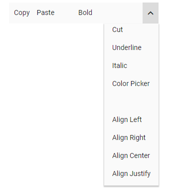
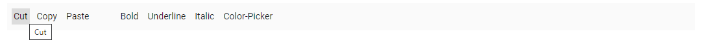

# Item Configuration in Blazor Toolbar Component

The Toolbar can be rendered by defining a list of items. Items can be constructed with the following built-in command types or item template.

* Align
* CssClass
* Disabled
* HtmlAttributes
* Id
* Overflow
* PrefixIcon
* ShowAlwaysInPopup
* ShowTextOn
* SuffixIcon
* Template
* Text
* TooltipText
* Type
* Visible
* Width

## Align

It specifies the location for aligning Toolbar items on the Toolbar. Each command will be aligned according to the `Align` property. The possible values are:

1. **Left**: To align commands to the left side of the Toolbar.

2. **Center**: To align commands at the center of the Toolbar.

3. **Right**: To align commands to the right side of the Toolbar.

```cshtml

@using Syncfusion.Blazor.Navigations

<SfToolbar>
    <ToolbarItems>
        <ToolbarItem Text="Home" Align="ItemAlign.Left"></ToolbarItem>
        <ToolbarItem Text="My Home Page" Align="ItemAlign.Center"></ToolbarItem>
        <ToolbarItem Text="Search" Align="ItemAlign.Right"></ToolbarItem>
        <ToolbarItem Text="Settings" Align="ItemAlign.Right"></ToolbarItem>
    </ToolbarItems>
</SfToolbar>

```

Output be like the below.


## CssClass

Single or multiple CSS classes can be added to the Toolbar commands using the Toolbar item `CssClass` property. You can refer [Set command customization](https://blazor.syncfusion.com/documentation/toolbar/how-to/set-command-customization/) for snippet and output.

## Disabled

It specifies whether an item should be disabled or not. You can refer [Enable/Disable Toolbar item](https://blazor.syncfusion.com/documentation/toolbar/how-to/enable-or-disable-toolbar-item/) for snippet and output.

## HtmlAttributes

It is used to add custom attributes to Toolbar command. Supports HTML attributes such as style, class, etc. You can refer [Set command customization](https://blazor.syncfusion.com/documentation/toolbar/how-to/set-command-customization/) for snippet and output.

## Id

It specifies the unique ID to be used with button or input element of Toolbar items.

```cshtml

@using Syncfusion.Blazor.Navigations

<SfToolbar>
    <ToolbarItems>
        <ToolbarItem Id="Home" Text="Home" Align="ItemAlign.Left"></ToolbarItem>
        <ToolbarItem Text="My Home Page" Align="ItemAlign.Center"></ToolbarItem>
        <ToolbarItem Text="Search" Align="ItemAlign.Right"></ToolbarItem>
        <ToolbarItem Text="Settings" Align="ItemAlign.Right"></ToolbarItem>
    </ToolbarItems>
</SfToolbar>

```

Output be like the below.


## Overflow

It Specifies the Toolbar command display area when an element’s content is too large to fit available space. This is applicable only to `Popup` mode. The possible values are:

1. **Show**: Always shows the item as the primary priority on the Toolbar.

2. **Hide**: Always shows the item as the secondary priority on the popup.

3. **None**: No priority for display, and as per normal order moves to popup when content exceeds.

You can refer [Responsive Mode](https://blazor.syncfusion.com/documentation/toolbar/responsive-mode/#text-mode-for-buttons) for snippet and output.

## PrefixIcon

It defines single/multiple classes separated by space used to specify an icon for the button. The icon will be positioned before the text content if text is available, otherwise the icon alone will be rendered. You can refer [Customize the Scrolling distance](https://blazor.syncfusion.com/documentation/toolbar/how-to/customize-the-scrolling-distance/) for snippet and output.

## ShowAlwaysInPopup

It defines the priority of items to display it in popup always. It allows to maintain toolbar item on popup always but it does not work for toolbar priority items.

```cshtml

@using Syncfusion.Blazor.Navigations

<SfToolbar Width="300px" OverflowMode="OverflowMode.Popup">
    <ToolbarItems>
        <ToolbarItem Text="Cut" ShowAlwaysInPopup=true TooltipText="Cut"></ToolbarItem>
        <ToolbarItem Text="Copy" TooltipText="Copy"></ToolbarItem>
        <ToolbarItem Text="Paste" TooltipText="Paste"></ToolbarItem>
        <ToolbarItem></ToolbarItem>
        <ToolbarItem Text="Bold" TooltipText="Bold"></ToolbarItem>
        <ToolbarItem Text="Underline" TooltipText="Underline"></ToolbarItem>
        <ToolbarItem Text="Italic" TooltipText="Italic"></ToolbarItem>
        <ToolbarItem Text="Color Picker" TooltipText="Color-Picker"></ToolbarItem>
        <ToolbarItem></ToolbarItem>
        <ToolbarItem Text="Align Left" TooltipText="Align-Left"></ToolbarItem>
        <ToolbarItem Text="Align Right" TooltipText="Align-Right"></ToolbarItem>
        <ToolbarItem Text="Align Center" TooltipText="Align-Center"></ToolbarItem>
        <ToolbarItem Text="Align Justify" TooltipText="Align-Justify"></ToolbarItem>
    </ToolbarItems>
</SfToolbar>

```

Output be like the below.



## ShowTextOn

It specifies where the button text will be displayed on popup mode of the Toolbar. The possible values are:

1. **Toolbar**: Text will be displayed on Toolbar only.

2. **Overflow**: Text will be displayed only when content overflows to popup.

3. **Both**: Text will be displayed on popup and Toolbar.

You can refer [Responsive Mode](https://blazor.syncfusion.com/documentation/toolbar/responsive-mode/#text-mode-for-buttons) for snippet and output.

## SuffixIcon

It defines single/multiple classes separated by space used to specify an icon for the button. The icon will be positioned after the text content if text is available.

```cshtml

@using Syncfusion.Blazor.Navigations

<SfToolbar Width="600">
    <ToolbarItems>
        <ToolbarItem SuffixIcon="e-cut-icon tb-icons" Text="Cut"></ToolbarItem>
        <ToolbarItem SuffixIcon="e-copy-icon tb-icons" Text="Copy"></ToolbarItem>
        <ToolbarItem SuffixIcon="e-paste-icon tb-icons" Text="Paste"></ToolbarItem>
        <ToolbarItem Type="ItemType.Separator"></ToolbarItem>
        <ToolbarItem SuffixIcon="e-bold-icon tb-icons" Text="Bold"></ToolbarItem>
        <ToolbarItem SuffixIcon="e-underline-icon tb-icons" Text="Underline"></ToolbarItem>
        <ToolbarItem SuffixIcon="e-italic-icon tb-icons" Text="Italic"></ToolbarItem>
        <ToolbarItem SuffixIcon="e-color-icon tb-icons" Text="Color-Picker"></ToolbarItem>
        <ToolbarItem Type="ItemType.Separator"></ToolbarItem>
        <ToolbarItem SuffixIcon="e-bullets-icon tb-icons" Text="Bullets"></ToolbarItem>
        <ToolbarItem SuffixIcon="e-numbering-icon tb-icons" Text="Numbering"></ToolbarItem>
        <ToolbarItem Type="ItemType.Separator"></ToolbarItem>
        <ToolbarItem SuffixIcon="e-ascending-icon tb-icons" Text="Sort A - Z"></ToolbarItem>
        <ToolbarItem SuffixIcon="e-descending-icon tb-icons" Text="Sort Z - A"></ToolbarItem>
        <ToolbarItem Type="ItemType.Separator"></ToolbarItem>
        <ToolbarItem SuffixIcon="e-upload-icon tb-icons" Text="Upload"></ToolbarItem>
        <ToolbarItem SuffixIcon="e-download-icon tb-icons" Text="Download"></ToolbarItem>
        <ToolbarItem Type="ItemType.Separator"></ToolbarItem>
        <ToolbarItem SuffixIcon="e-indent-icon tb-icons" Text="Text Indent"></ToolbarItem>
        <ToolbarItem SuffixIcon="e-outdent-icon tb-icons" Text="Text Outdent"></ToolbarItem>
        <ToolbarItem Type="ItemType.Separator"></ToolbarItem>
        <ToolbarItem SuffixIcon="e-clear-icon tb-icons" Text="Clear"></ToolbarItem>
        <ToolbarItem SuffixIcon="e-reload-icon tb-icons" Text="Reload"></ToolbarItem>
        <ToolbarItem SuffixIcon="e-export-icon tb-icons" Text="Export"></ToolbarItem>
    </ToolbarItems>
</SfToolbar>

<style>
    @@font-face {
        font-family: 'Material_toolbar';
        src: url(data:application/x-font-ttf;charset=utf-8;base64,AAEAAAAKAIAAAwAgT1MvMj1tShMAAAEoAAAAVmNtYXDoMOjqAAACDAAAAHhnbHlmIuy19QAAAswAACNMaGVhZA6okZMAAADQAAAANmhoZWEIUQQkAAAArAAAACRobXR4jAAAAAAAAYAAAACMbG9jYYc0kUIAAAKEAAAASG1heHABOwG8AAABCAAAACBuYW1lx/RZbQAAJhgAAAKRcG9zdJZeEVUAACisAAACGAABAAAEAAAAAFwEAAAAAAAD9AABAAAAAAAAAAAAAAAAAAAAIwABAAAAAQAAAQsu/F8PPPUACwQAAAAAANXLJlEAAAAA1csmUQAAAAAD9AP0AAAACAACAAAAAAAAAAEAAAAjAbAADgAAAAAAAgAAAAoACgAAAP8AAAAAAAAAAQQAAZAABQAAAokCzAAAAI8CiQLMAAAB6wAyAQgAAAIABQMAAAAAAAAAAAAAAAAAAAAAAAAAAAAAUGZFZABA5wDnIQQAAAAAXAQAAAAAAAABAAAAAAAABAAAAAQAAAAEAAAABAAAAAQAAAAEAAAABAAAAAQAAAAEAAAABAAAAAQAAAAEAAAABAAAAAQAAAAEAAAABAAAAAQAAAAEAAAABAAAAAQAAAAEAAAABAAAAAQAAAAEAAAABAAAAAQAAAAEAAAABAAAAAQAAAAEAAAABAAAAAQAAAAEAAAABAAAAAQAAAAAAAACAAAAAwAAABQAAwABAAAAFAAEAGQAAAAEAAQAAQAA5yH//wAA5wD//wAAAAEABAAAAAEAAgADAAQABQAGAAcACAAJAAoACwAMAA0ADgAPABAAEQASABMAFAAVABYAFwAYABkAGgAbABwAHQAeAB8AIAAhACIAAAAAADIAjgFwAfgCIAKYAxIDSAO2BRYFMAVcBnIGugb2ByoHQgguCNYJRgn6CiQKiAquCsgMFgzADOYNzg7WDvAQyBEyEaYABwAAAAAD9APzAAMABwAKAA4AEgAVABkAADchNSElITUhJTkBBSE1ITUhNSEFFxEnITUhDAPo/BgBtgIy/c7+SgG2AjL9zgIy/c7+Svr6A+j8GAxefV67Pl19Xvr6AfScXgAAAAIAAAAAA/QD9AAEAEgAACUhNxc3AREfDyE/DxEvDyEPDgOF/PbDisP9gQEBAwQEBgYICAgJCgoLCwsDCgsLCwoKCQgICAYGBAQDAQEBAQMEBAYGCAgICQoKCwsL/PYLCwsKCgkICAgGBgQEAwGz+qf6AYX89gsLCwoKCQgICAYGBAQDAQEBAQMEBAYGCAgICQoKCwsLAwoLCwsKCgkICAgGBgQEAwEBAQEDBAQGBggICAkKCgsLAAACAAAAAAPzA/QAQAC/AAABFQ8PLw8/Dx8OAQ8ELwErAQ8FFR8FBxcPAxUfBzsBNx8LOwI/Cx8BOwE/Bj0BLwQ/Aic/BC8HKwEHLwsrAg8FArIBAgUGBwkKDAwODxAQERITEhIREQ8PDgwMCgkHBgUCAQECBQYHCQoMDA4PDxEREhITEhEQEA8ODAwKCQcGBQL+zxUWFhUWfwUFBAUDBANqAgEBAgIDbgMDbwMCAQEBAmkDBAQEBQSEFBYWFxQCAgIDBAQEBcwFBAQEAwICAhQXFRYVgAQFBQQEAwNoAgEBAgIDcAEBAQNvAgIBAQEBA2gDBAQFBAWDFBYWFxIBAgMDAwQFBcwFBAQDBAICAgAJCRIQEBAODgwLCgkHBgQDAQEDBAYHCQoLDA4OEBAQEhISEhAQEA4ODAsKCQcGBAMBAQMEBgcJCgsMDg4QEBASAc6ECwwNDjIBAQICA7QEBQQFBAMEUjIyVgMEBAQFBAWwAwICATMODQwLhAQEBAMCAgECAgIDBAMEhAsMDQ4yAQECAgOwBAQFBAUEAwRSDAwaMlYDBAQEBQQFsAMCAgEzDg0MC4QEAwQDAgICAgICAwQDAAAAAAMAAAAAA/MD2AAyADUAaQAAJRUfDTsBPw41LwgPBwMhAScXAQ8GHQEfBQEfBjsBPwYBPwYvBwEDFgIDBAQGBgcICQkKCgsLCwsLCwoKCQgICAYGBAQDAQEDBAcMCQoLFCMtFQoJCQcFBHv96gEL04X+4gYFBAQCAgICAgIEBAUBNwcHBwgHCAcIBwgHCAgHBwYBOAUEAwMCAQEBAQIDAwQFBv4PlwsLCwoKCQkIBwYGBAQDAgIDBAQGBgcICQkKCgsLCwcPEBAYEBAPHCk3HRAQEBAQEAEIAQrThf7iBgcIBwgHCAgICAgHBwcH/skGBQQEAwIBAQIDBAQFBgE3BwcHBwgICAgHCAgHCAcGAfEABQAAAAAD9APzAAMABwALAA8AEwAANyE1ITchNSEnITUhNyE1ISchNSEMA+j8GN4CLP3U3gPo/BjeAiz91N4D6PwYDF6AW5xefVqAXgAAAAAEAAAAAAP0A/QACQATABcAWwAAAQcVMzcXMzUjLwEjFTMbATM1IwElESERBxEfDyE/DxEvDyEPDgFro8ObnnROxOp0nZvqTij+8AGW/NReAQEDBAQGBggICAkKCgsLCwMKCwsLCgoJCAgIBgYEBAMBAQEBAwQEBgYICAgJCgoLCwv89gsLCwoKCQgICAYGBAQDAQENAyOWliO4BSUBK/7VJQFSffzUAywR/PYLCwsKCgkICAgGBgQEAwEBAQEDBAQGBggICAkKCgsLCwMKCwsLCgoJCAgIBgYEBAMBAQEBAwQEBgYICAgJCgoLCwAAAAACAAAAAAOWA/QAAwBpAAA3ITUhExUfHTsBPx01ESMRDw8vDxEjagMs/NRKAgIDAwUFBgcHCAkJCgsLCwwNDQ0ODw4PEA8QERAREREREBEQDxAPDg8ODQ0NDAsLCwoJCQgHBwYFBQMDAgKLAQMFBggKCwwODxARERMTFBQTExEREA8ODAsFCQcGBAKLDH0BsBEREREQEA8QDg8ODg0MDQsLCwoJCQgHBwYFBQQDAgEBAgMEBQUGBggICQkKCgsMDAwNDg4ODw8PEBAQERERAb7+RRQTEhIREA8NDQsKCAYFAwEBAwUGCAoLDQ0PCBASEhMTAcUABQAAAAAD9APXAAIABQANABcAGgAAJTcjASM3ATM3MxczAyMFIQEVITUhATUhJTMnAgJx4wG/vl/+/Fot+i1a3FD9RgEg/t4Bov7UAST+aAF/6XQobQET//47eHgCM07+XD5NAaQ/UHMAAAAAAQAAAAAD9ALoAF8AABMhJz8PHxo3Lx8PDycMAbWyDQ0ODg8PDxAQEBERERIREhAQEBAQDw8PDw4ODg0NDQwMFxYTEhAHBgYGBXUHBwgJCQoLCwwNDQ0PDg8QEBERERITEhMUExQVFBUVFRgYFxcXFhYVFhQUFBMTEhGwARi6CwsJCggICAYGBgQEAwIBAQEBAgIDBAQFBQYHBwgICQkKFRYYGhsODg8PDygUFBMTEhISERARDw8PDg0NDAsLCgoICAgGBgQEAwMBAQECAwQFBgcJCQoLDA0ODg+6AAYAAAAAA/MD9AA/AGsAqwDrAO8BMwAAARUfDTsBPw09AS8ODw4lHwk7AT8IPQEvByMnByMPByUfDz8PLw8PDiUfDz8OPQEvDSsBDw0lESERBxEfDyE/DxEvDyEPDgHhAgMFBQYHCAkKCgsLDA0NDA0MCwsKCgkIBwYFBQMCAgMFBQYHCAkKCgsLDA0MDQ0MCwsKCgkIBwYFBQMC/scBAQEFBwgKCwYGBwYGBgwKCAcFAQEBAQUHCAoMBgYGBwYGCwoIBwUBAQHzAQECBAQEBgYGCAcICQkJCgoJCQgJBwgGBgYEBAMDAQEBAQMDBAQGBgYIBwkICQkKCgkJCQgHCAYGBgQEBAIB/qgBAQMEBAYGBwgICQoKCgsLCwsLCgkJCQcHBwUFAwMCAgMDBQUHBwcJCQkKCwsLCwsKCgoJCAgHBgYEBAMBAlD81F4BAQMDBAUGBgcHCAkJCQkKAyYKCQkJCQgHBwYGBQQEAgEBAQECBAQFBgYHBwgJCQkJCvzaCgkJCQkIBwcGBgUEAwMBAWQNDAwMCwoKCQgHBgUFAwICAwUFBgcICQoKCwwMDA0NDAwLCwsJCQgHBwUEAwIBAQIDBAUHBwgJCQsLCwwMMQYGBgsKCQcEAgEBAgQHCQoLBgYGBwYGCwoJBgUCAQECBQYJCgsGBvMJCgkICAgHBwYFBQQDAwEBAQEDAwQFBQYHBwgICAkKCQoJCQkICAcGBwUFBAMCAQEBAQIDBAUFBwYHCAgJCQkGCwsKCgoJCAgHBgYEBAMBAQEBAwQEBgYHCAgJCgoKCwsLCwsKCQkJBwcHBQUDAwICAwMFBQcHBwkJCQoLC9/81AMsA/zaCgkJCQkIBwcGBgUEBAIBAQEBAgQEBQUHBwcICQkJCQoDJgoJCQkJCAcHBwUFBAQCAQEBAQIEBAUFBwcHCAkJCQkAAAAAAgAAAAADtQP0AAMACgAANyE1IQEjCQEjESFKA2z8lAEG7AGcAZzs/qAMfQIK/mQBnAFhAAYAAAAAA/QD8wADAAcACwAPABIAFgAANyE1ISUhNSE1ITUhNSE1KQERNwMhNSEMA+j8GAG2AjL9zgIy/c4CMv3O/kr6+gPo/BgMXn1efV19Xv4M+gGWXgAFAAAAAAPzA/MAJQBpAKgArADwAAABFT8bIw8GBR8PNSMvDT8CJw8OHw8TByMPDBc/AzsBHwUzHwYzLxcjJREhEQcRHw8hPw8RLw8hDw4CKg8QDw8ODg4NDQwMDAwKCwoKCQgJDw0KCQQDAgLxBAUGBggJC/7WDQ0NDg4PDw8PEA8QEBAQEAoKCQkJCQgIBgQEBAUDAQEDBKsKCQgIBwYGBQUDAwMBAQEBAQEDAwQEBQYHBwgICgoL9g4OHA4ODQ4NDg0NDQwNDKkLDA8HCAkJCAgICA4DEAUFBQMEAu4EBwkKDQ8REwoKCwsMDAwNDQ4ODg4PDy8KAZP81F4BAQMDBAUGBgcHCAkJCQkKAyYKCQkJCQgHBwYGBQQEAgEBAQECBAQFBgYHBwgJCQkJCvzaCgkJCQkIBwcGBgUEAwMBAZz0AgMDBAQFBQYHBwgICQkJCgsLCwsYGhsbDw4PDwoKCQgIBwaUDAsLCgkIBwcGBQQEAgIBAfEBAwMEBQYIBQcGBw8PEA8ODa0NDQ0ODg4ODw8PDw8PEA8PEA8PEA8ODw8ODg0ODQ0MAj8BBAMDBAQFBgcHBwkJCqoGBQQBAQICBAMJEAcHCAgJCh0dHRsaGRcXCgoKCQgICAcGBgYEBQMDBj781AMsA/zaCgkJCQkIBwcGBgUEAwMBAQEBAgQEBQYGBwcICQkJCQoDJgoJCQkJCAcHBgYFBAQCAQEBAQIEBAUFBwcHCAkJCQkAAgAAAAAD8wPrAB8AMwAAEw8HHww/BBUhNSEBNwkBPwcvCDYKCAcGBQMCAQECAwUGBwgKrwgJCgoKCgkINQKQ/Xv+20EBPAGOCgkHBgUDAgEBAgMFBgcJCtMBoQsMDQ0NDg4ODg0ODQ0NDAuvBgUDAQECBAY0I14BJEH+xAGRCwwMDQ0ODg4ODg4NDQwMC9QABgAAAAAD9AP0AAMADwATAB0AIQAnAAAlITUhIzMVIxUzFSMVMzUjNyE1ISMzBxUzNSM3NSM3ITUhJzMVMzUjAQYC7v0S+n0/P328vPoC7v0S+nh4vHh4vPoC7v0S+j4/fWpeID4gPvrbXXw/P3w/u14gvPoAAAAABQAAAAAD9APbAAIABQANABcAGgAAJTcjAyM3ATM3MxczAyMFIQEVITUhATUhJzMnAgJx4x6+Xv76Wi39LF3fTwFlAST+3AGk/tIBJP5mw+l0JXMBGP/+N3h4AjRQ/lo+TQGpPk5zAAABAAAAAAOsA/QACwAAATMDIxUhNSMTMzUhAXGd88gCPJ3zyP3EAx79xNbWAjzWAAAGAAAAAAP0A9QAAwBDAEcAhwCLAMsAACUhNSEHFR8OPw49AS8ODw4TITUhBxUfDTsBPw09AS8ODw4TITUhBxUfDj8OPQEvDg8OAQYC7v0S+gIBAwMEBQUFBgcGCAcICAgICAcHBgYGBQQEAwMCAQECAwMEBAUGBgYHBwgICAgIBwgGBwYFBQUEAwMBAvoC7v0S+gIBAwMEBQUFBgcGCAcICAgICAcHBgYGBQQEAwMCAQECAwMEBAUGBgYHBwgICAgIBwgGBwYFBQUEAwMBAvoC7v0S+gIBAwMEBQUFBgcGCAcICAgICAcHBgYGBQQEAwMCAQECAwMEBAUGBgYHBwgICAgIBwgGBwYFBQUEAwMBAkpeLwgIBwcHBwYFBQUDBAICAQEBAQICBAMFBQUGBwcHBwgICAgIBwcGBgYFBAQDAwIBAQEBAgMDBAQFBgYGBwcICAFgXS4ICAgHBwYGBgUEBAMDAgEBAgMDBAQFBgYGBwcICAgICAcHBwcGBQUFAwQCAgEBAQECAgQDBQUFBgcHBwcIAUBdLggICAcHBgYGBQQEAwMCAQEBAQIDAwQEBQYGBgcHCAgICAgHBwcHBgUFBQMEAgIBAQEBAgIEAwUFBQYHBwcHCAAAAwAAAAADmQP0AAcAKACNAAABFSE1MxEhESUHFQ8GLwc/Bx8GJysBDw0VERUfDTMhMz8NNRE1Lw0rAS8OKwEPDQEdAcZb/YQBbAEDBAYHBwkJCQkHBwYEAwEBAwQGBwcJCQkJBwcGBAOsvwkJCQgICAcGBgYEBAMCAgICAwQEBgYGBwgICAkJCQJ8CQkJCAgIBwYGBgQEAwICAgIDBAQGBgYHCAgICQkJvwMFBQYGBwgICQkJCgoKCwsLCwoKCgkJCQgIBwYGBQUDPoiI/SkC1y4FBQgIBwUEAwEBAwQFBwgICgkICAcFBQIBAQIFBQcICCQCAgMEBAYGBgcICAgJCQn9KQkJCQgICAcGBgUFBAMCAgICAwQFBQYGBwgICAkJCQLXCQkJCAgIBwYGBgQEAwICCgkJCAgIBwYGBQQEAwICAgIDBAQFBgYHCAgICQkAAQAAAAAD9ALoAGAAAAExLw8PHxc/Gh8PByERA0QREhMTFBQUFRYWFhcXFxgYFRUVFBUUExQTEhMSEREREBAPDg8NDQ0MCwsKCQkIBwd1BQYGBgcQEhMWFwwMDQ0NDg4ODw8PDxAQEBAQEhESEREQERAQDw8PDg4NDbIBtQIuDw4ODQwLCgkJBwYFBAMCAQEBAwMEBAYGCAgICgoLCwwNDQ4PDw8REBESEhITExQUKA8PDw4OGxoYFhUKCQkICAcHBgUFBAQDAgIBAQEBAgMEBAYGBggICAoJCwu6AdAAAAAOAAAAAAP0A/MAAgAFAAgACwAQABQAFwAbAB4AIQApAC0AMQB1AAABETclFzUXNyMFNyETFQUhEQEhJRMlMycFMSEnBzcnBxcRBRMDBSUDEy0BEQMlIwUDEQcRHw8hPw8RLw8hDw4CGcj+ZaG3MJb+wM7+4jQBCv6EAy7+ggEKdP1S3JkBCwEjWemWlvrIATJ0dP7n/up3dwEWAZhy/vQ0/vZyXgEBAwQEBgYICAgJCgoLCwsDCgsLCwoKCQgICAYGBAQDAQEBAQMEBAYGCAgICQoKCwsL/PYLCwsKCgkICAgGBgQEAwEBxv7fWSQ730Bky8v+9QNxAYH+f28BHx2ZmcukmTgJywEeP/7n/ud3dwEZARl3Bv5xAR1ycv7yAYAR/PYLCwsKCgkICAcHBQUEAwEBAQEDBAUFBwcICAkKCgsLCwMKCwsLCgoJCAgHBwUFBAMBAQEBAwQEBgYIBwkJCgoLCwAAAAAFAAAAAAP0A/MAAwAHAAsADwATAAA3ITUhJSE1ISUhNSElITUhJSE1IQwD6PwYAVgCkP1w/qgD6PwYAVgCkP1w/qgD6PwYDF6AW5xefV19XgAAAAAKAAAAAAP0A/MAAwAHAAsADwATABcAGwAfACMARwAAARUjNSMVIzUjFSM1ARUjNSMVIzUjFSM1JRUjNSMVIzUjFSM1JxEfByE/BxEvByEPBgOW+j7bP9oDLPo+2z/aAyz6Pts/2l4BAwUGAwgJCgOJCgkJBwYDBAIBAwUGAwgJCvx3CgkJBwYFAwElvb27u7u7ARrb29vb29v6vLy8vLy8hvyCCwoJBwQGBAIBAwUHBwUJCgOECwoJBwQGBAIBAwUGCAkKAAAAAAUAAAAAA/QD8wADAAcACwAPABMAADchNSE1ITUhNSE1ITUhNSE1ITUhDAPo/BgCkP1wA+j8GAKQ/XAD6PwYDF6BV59efVqAXgAAAAADAAAAAAP0A00AAwAHAAsAADchNSE1ITUhNSE1IQwD6PwYA+j8GAPo/Bizb6Zwpm8AAAAABQAAAAAD9AP0AD8AXwCfAKQBIgAAJQ8PLw8/Dx8OExUPBSsBLwU9AT8FOwEfBQMPDy8PPw8fEAE1IwUVHw8zPwMXBy8FDw8fDz8PNS8DNwEzNQE/BS8PDw4BOAEBAwMEBQYGBwgICQkKCgoKCgoJCQgIBwYGBQQDAwEBAQEDAwQFBgYHCAgJCQoKCgoKCgkJCAgHBgYFBAMDAeICAgMDBQUFBQUFAwMCAgICAwMFBQUFBQUDAwIC4QEBAwMEBQYGBwgICQkKCgoKCgoJCQgIBwYGBQQDAwEBAQEDAwQFBgYHCAgJCQoKCgoKCgkJCAgHBgYFBAMDAftkAV6W/K4BAwUHCAoMDQ4PERETExQUCwsVFBN2dgkKCgoVFhQUExMREQ8ODQwKCAcFAwEBAwUHCAoMDQ4PERETExQUFBQTExERDw4NDAoIBwUDAQEEBgd2AV6W/ZYFBAMCAwEBAwUHCAoMDQ4PERETExQUFBQTExERDw4NDAoIBwUD1AoKCgkJCAgHBgYFBAMDAQEBAQMDBAUGBgcICAkJCgoKCgoKCQkICAcGBgUEAwMBAQEBAwMEBQYGBwgICQkKCgEiBQUFAwMCAgICAwMFBQUFBQUDAwICAgIDAwUFAScKCgoJCQgIBwYGBQQDAwEBAQEDAwQFBgYHCAgJCQoKCgoKCgkJCAgHBgYFBAMDAQEBAQMDBAUGBgcICAkJCgqgZAFeMpYKChQTExERDw4NDAoIBwUDAQEEBgd2dgUEAwIDAQEDBQcICgwNDg8RERMTFBQUFBMTEREPDg0MCggHBQMBAQMFBwgKDA0ODxERExMUFAsLFRQTdv6iMgJqCQoKChUWFBQTExERDw4NDAoIBwUDAQEDBQcICgwNDg8RERMTFAADAAAAAANXA7UAIgBFAJMAAAEzHw4PDisBNRMzHw4PDisBNQMhPxEvDz8PLxghAkgKCgkJCAgHBwYGBAQEAgEBAQEDAwQFBgYHBwgJCAkKCeDACgoJCQgIBwcGBgQEBAIBAQEBAgQEBAYGBwcICAkJCgrAwAHDDQwMDBcWFRMSEQ8NDAoHBgQBAQIDBAYHBwkKCgsNDA4ODwsLCgoKCAgIBgYFBQMDAQEBAQECAwQEBAUGDA8QEhQVFgwMDA0NDQ0N/nABogICAwQEBgYGBwgICQkKCQoKCQgJBwgGBgUFBAMCArsBdwICAwQEBgYGCAcICQkKCQoKCQkIBwgGBgYEBAMCArv9MQEBAQIGCAoMDg8REhQUFhcYGBERERAQEA4ODgwMDAoJCQcICQkKCgoLDAsMDAwMDQwNDQwNDQwMCwwLCxQUERAODQoFAwQDAgEBAQAABQAAAAAD9APzAAMABwALAA8AEwAANyE1ITUhNSE1ITUhNSE1ITUhNSEMA+j8GAPo/BgD6PwYA+j8GAPo/BgMXn1enF59XX1eAAAAAAEAAAAAA9QD1ADUAAATHx8/DxcRIRcPDy8fPx8fDzMvHw8eKwECAwQFBggICQoMDA0ODhAQERISExQUFRUWFhcXGBgYGBgXFxcWFhUVFBQTEhIREIr+ZrsMDA0ODg4PEBAQEBESERISEhIREhEQEQ8QDw8ODg0NDAwLCgoJCQgHBgYEBAQCAQEBAQIEBAQGBgcICQkKCgsMDA0NDg4PDxAPERAREhESEhwcGxoaGBgWFRQSEQ8OCwp7BQYHCAgJCQoLCwwNDQ4ODg8QEBERERISEhMTFBMUFRQYGBgXFxYWFRUUFBMSEhEQEA4ODQwMCgkICAYFBAMCAgAYGBcXFxYWFRUUFBMSEhEQEA4ODQ0LCgoICAYFBAMCAQECAwQFBggICgoLDQ0ODhCKAZq7DAsLCgkJCAcHBQUEAwMBAQEBAgQEBAYGBwgICgkLCwwMDQ0ODg8PDxAREBESERISEhIREhEQERAPDw8ODg0NDAwLCwkKCAgHBgYEBAQCAQECAwUICQsNDxASExUWFxgaExITERIREBAQDw8ODg0NDAsLCgoJCAcHBgYEBAMCAQEBAgMEBQYICAoKCw0NDg4QEBESEhMUFBUVFhYXFxcYAAAAAgAAAAAD8gP0AGcA7gAAARUPGC8YPQE/FzsBHxcFHx8/DxcVATcBIyc/Dj0BLx0rAQ8dAoABAgIDAwQFBQUNDxATExYLCwwMDAwNDQ0NDQ0NDQwNDAsMCxUUEhAPDQUFBQQDAwMBAQEBAwMDBAUFBQ0PEBIUFQsMCwwNDA0NDQ0NDQ0NDAwMDAsLFhMTEA8NBQUFBAMDAgIB/Y0BAQMDBAUGBggICQkLCwsNDA4ODg8QEBARERISEhMTExEREBEQEBAQDw8ODg4ODA0OAR1W/uMuDgoKCQkIBwYGBgQEAwMCAQICAwQFBgcHCAkKCgsMDA0NDg8PDxAREREREhMSExMTExMSEhIRERAQEA8ODg4MDQsLCwkJCAgGBgUEAwMBAoIODQ0MDQwMDAsLFRQSEQ4NBgUEBAQDAgEBAQEBAQIDBAQEBQYNDhESFBULCwwMDA0MDQ0ODQ0NDQwMDAwLCxUUEhEODQYFBQQDAwICAQECAgMDBAUFBg0OERIUFQsLDAwMDA0NDQ0UEhMSEhIRERAQEA8ODg4NDAsLCwkJCAgGBgUEBAIBAQEBAgIEBAUFBgcHCAgJCgoSLf7jVgEfDg0NDQ4ODg8PDxAQEBERERITExISEhIRERAQEA8ODg4NDAwLCgoICQcHBQUEBAICAgIEBAUFBwcJCAoKCwwMDQ4ODg8QEBARERISEhITAAAAAgAAAAADtQP0AAMACgAANyE1IRMzESERMwFKA2z8lA/zAWjz/lkMfQHN/p0BYwGeAAAAAAUAAAAAA/QD9AA/AH8AvwD/Aa8AAAEPDisBLw4/Dx8OBQ8OKwEvDj8PHw4lFQ8OLw49AT8OHw4FFQ8OLw49AT8OHw4BHx8zPw09AS8MPQE/DjsBPx01Lx8PHgOFAQECAgQEBQUGBgcHCAgJCAkJCAcIBgcGBQUEAwMCAQEBAQIDAwQFBQYHBggHCAkJCAkIBwgHBgYFBQQEAgIB/Z4BAQIDAwQFBQYGBwgHCAkJCAkIBwgHBgYFBQQDAwIBAQEBAgMDBAUFBgYHCAcICQgJCQgHCAcGBgUFBAMDAgEBvQECAwQEBAYGBgcHCAgICQkICAgHBwcFBgQFAwMCAQECAwMFBAYFBwcHCAgICQkICAgHBwYGBgQEBAMCAf7qAQIDAwUEBgUHBwcICAgJCQgICAcHBgYGBAQEAwIBAQIDBAQEBgYGBwcICAgJCQgICAcHBwUGBAUDAwIB/kQBAgMEBgcHCQsLDA0ODw8RERITFBQVFhYXFxcZGBkZGgkICAgHBwYGBgQEBAMCAQECAwMEBAoEBAMDAgECAgIEBAUFBgYHBwgICAlkDg8NDg0ODA0MDAwLCwsKCQoICQcIBgYGBQQEAwMCAQECAwQGBwcJCwsMDQ4PDxEREhMUFBUWFhcXFxkYGRkaGhkZGBkXFxcWFhUUFBMSEREPDw4NDAsLCQcHBgQDAgJTCAkICAcHBgYFBQQEAgICAgICBAQFBQYGBwcICAkICQgJBwgGBwYFBQQDAwIBAQEBAgMDBAUFBgcGCAcJCAkICQgIBwcGBgUFBAQCAgICAgIEBAUFBgYHBwgICQgJCAkHCAYHBgUFBAMDAgEBAQECAwMEBQUGBwYIBwkI1gkJCAcIBgcGBQUEAwMCAQEBAQIDAwQFBQYHBggHCAkJCAkICAcHBgYFBQQEAgIBAQEBAgIEBAUFBgYHBwgICQgJCQgHCAYHBgUFBAMDAgEBAQECAwMEBQUGBwYIBwgJCQgJCAgHBwYGBQUEBAICAQEBAQICBAQFBQYGBwcICAn+xhoZGRgZFxcXFhYVFBQTEhERDw8ODQwLCwkHBwYEAwIBAgICBAQFBQYGBwcICAkICAgIBwcGBgsGBwYIBwgICQkIBwgGBwYFBQQDAwIBAQECAgMEBQUFBgcHCAgJCQoKCwoMCwwNDA0NDg0ODg4XFxYWFRUVFBQTExIRERAPDw4NDQsLCgkIBwYFBAMBAQECAwQGBwcJCwsMDQ4PDxEREhMUFBUWFhcXFxkYGRkAAgAAAAAD9AO1AAgAVAAAARchFSEHFzcnJREVHw4hPw49ASMVIREhFTM9AS8OIQ8OAtV1/k0BsHI/4OD8+AICAwQFBQYHBwcICQkJCQHPCQkJCQgHBwcGBQUEAwICXP4xAc9cAgIDBAUFBgcHBwgJCQkJ/jEJCQkJCAcHBwYFBQQDAgICoHRYdD7e3oD9RAkJCAgIBwcGBgUEBAMCAQEBAQIDBAQFBgYHBwgICAkJzMwCvMzMCQkICAgHBwYGBQQEAwIBAQEBAgMEBAUGBgcHCAgICQADAAAAAAOvA/QAAwBHAF0AAAERIREHERUfDTMhMz8OES8OIyEjDw0nETMRITUhIw8NA1X+DFsCAgMEBQUGBgcICAgJCQkB9AkJCQgICAcGBgUFBAMCAQEBAQIDBAUFBgYHCAgICQkJ/gwJCQkICAgHBgYFBQQDAgK2WQIT/e0JCQkIBwgHBgYFBAQDAgEC4/2EAnwF/YgJCQgJCAcHBgYGBAQDAgICAgMEBAYGBgcHCAkICQkCeAkJCQgICAcGBgUFAwMDAQEDAwMFBQYGBwgICAkJsv2EAnxbAgIDBAUFBgYHCAgICQkAAAASAN4AAQAAAAAAAAABAAAAAQAAAAAAAQAQAAEAAQAAAAAAAgAHABEAAQAAAAAAAwAQABgAAQAAAAAABAAQACgAAQAAAAAABQALADgAAQAAAAAABgAQAEMAAQAAAAAACgAsAFMAAQAAAAAACwASAH8AAwABBAkAAAACAJEAAwABBAkAAQAgAJMAAwABBAkAAgAOALMAAwABBAkAAwAgAMEAAwABBAkABAAgAOEAAwABBAkABQAWAQEAAwABBAkABgAgARcAAwABBAkACgBYATcAAwABBAkACwAkAY8gdG9vbGJhci1tYXRlcmlhbFJlZ3VsYXJ0b29sYmFyLW1hdGVyaWFsdG9vbGJhci1tYXRlcmlhbFZlcnNpb24gMS4wdG9vbGJhci1tYXRlcmlhbEZvbnQgZ2VuZXJhdGVkIHVzaW5nIFN5bmNmdXNpb24gTWV0cm8gU3R1ZGlvd3d3LnN5bmNmdXNpb24uY29tACAAdABvAG8AbABiAGEAcgAtAG0AYQB0AGUAcgBpAGEAbABSAGUAZwB1AGwAYQByAHQAbwBvAGwAYgBhAHIALQBtAGEAdABlAHIAaQBhAGwAdABvAG8AbABiAGEAcgAtAG0AYQB0AGUAcgBpAGEAbABWAGUAcgBzAGkAbwBuACAAMQAuADAAdABvAG8AbABiAGEAcgAtAG0AYQB0AGUAcgBpAGEAbABGAG8AbgB0ACAAZwBlAG4AZQByAGEAdABlAGQAIAB1AHMAaQBuAGcAIABTAHkAbgBjAGYAdQBzAGkAbwBuACAATQBlAHQAcgBvACAAUwB0AHUAZABpAG8AdwB3AHcALgBzAHkAbgBjAGYAdQBzAGkAbwBuAC4AYwBvAG0AAAAAAgAAAAAAAAAKAAAAAAAAAAAAAAAAAAAAAAAAAAAAAAAjAQIBAwEEAQUBBgEHAQgBCQEKAQsBDAENAQ4BDwEQAREBEgETARQBFQEWARcBGAEZARoBGwEcAR0BHgEfASABIQEiASMBJAAQVGV4dF9PdXRkZW50XzAwMQtQaWN0dXJlXzAwMQxTZXR0aW5nc18wMDEQQ29sb3JfcGlja2VyXzAwMhBBbGlnbl9DZW50ZXJfMDA2CExpbmVfMDAxDVVuZGVybGluZV8wMDEMU29ydF9aLUFfMDAxCFVuZG9fMDAxEENoYXJ0X2J1YmJsZV8wMDELRG93bmxvYWRfMDAPVGV4dF9pbmRlbnRfMDAxEkNoYXJ0X0RvdWdobnV0XzAwMQlDbGVhcl8wMDINTnVtYmVyaW5nXzAwMQxTb3J0X0EtWl8wMDEKSXRhbGljXzAwMQtCdWxsZXRzXzAwMQlQYXN0ZV8wMDEIUmVkb18wMDEPQ2hhcnRfcmFkYXJfMDAxD0FsaWduX1JpZ2h0XzAwMQlUYWJsZV8wMDEOQWxpZ25fTGVmdF8wMDEITWVudV8wMDEHQ3V0XzAwMghCb2xkXzAwMRFBbGlnbl9KdXN0aWZ5XzAwMQpSZWxvYWRfMDAxClNlYXJjaF8wMDEKVXBsb2FkXzAwMQpEZXNpZ25fMDA1CkV4cG9ydF8wMDEIQ29weV8wMDIAAA==) format('truetype');
        font-weight: normal;
        font-style: normal;
    }

    .e-bigger .e-tbar-btn .tb-icons {
        font-size: 18px;
    }

    .e-tbar-btn .tb-icons {
        font-family: 'Material_toolbar';
        speak: none;
        font-size: 16px;
        font-style: normal;
        font-weight: normal;
        font-variant: normal;
        text-transform: none;
    }

        .e-tbar-btn .tb-icons.e-numbering-icon {
            font-size: 17px;
        }

    .e-cut-icon:before {
        content: "\e719"
    }

    .e-copy-icon:before {
        content: "\e721"
    }

    .e-paste-icon:before {
        content: "\e712"
    }

    .e-color-icon:before {
        content: "\e703";
        font-size: 18px;
    }

    .e-bold-icon:before {
        content: "\e71a"
    }

    .e-underline-icon:before {
        content: "\e706";
    }

    .e-upload-icon:before {
        content: "\e71e"
    }

    .e-download-icon:before {
        content: "\e70a"
    }

    .e-indent-icon:before {
        content: "\e70b"
    }

    .e-outdent-icon:before {
        content: "\e700"
    }

    .e-clear-icon:before {
        content: "\e70d"
    }

    .e-reload-icon:before {
        content: "\e71c"
    }

    .e-export-icon:before {
        content: "\e720";
        font-size: 16px;
    }

    .e-italic-icon:before {
        content: "\e710"
    }

    .e-bullets-icon:before {
        content: "\e711";
    }

    .e-numbering-icon:before {
        content: "\e70e";
    }

    .e-ascending-icon:before {
        content: "\e70f";
        font-size: 18px;
    }

    .e-descending-icon:before {
        content: "\e707";
        font-size: 18px;
    }
</style>

```

Output be like the below.


## Template

The Toolbar supports adding template commands using the  `Template` property. Template property can be given as the `HTML element` or `RenderFragment`. You can refer [Set item-wise custom template](https://blazor.syncfusion.com/documentation/toolbar/how-to/set-item-wise-custom-template/) for snippet and output.

## Text

It is used to specify the text to be displayed on the Toolbar button. You can refer [Getting Started](https://blazor.syncfusion.com/documentation/toolbar/getting-started/#adding-toolbar-component-to-the-application) for snippet and output.

## TooltipText

It is used to specify the text to be displayed on hovering the Toolbar button.

```cshtml

@using Syncfusion.Blazor.Navigations

<SfToolbar>
    <ToolbarItems>
        <ToolbarItem Text="Cut" TooltipText="Cut"></ToolbarItem>
        <ToolbarItem Text="Copy" TooltipText="Copy"></ToolbarItem>
        <ToolbarItem Text="Paste" TooltipText="Paste"></ToolbarItem>
        //To separate the Toolbar items
        <ToolbarItem></ToolbarItem>
        <ToolbarItem Text="Bold" TooltipText="Bold"></ToolbarItem>
        <ToolbarItem Text="Underline" TooltipText="Underline"></ToolbarItem>
        <ToolbarItem Text="Italic" TooltipText="Italic"></ToolbarItem>
        <ToolbarItem Text="Color-Picker" TooltipText="Color Picker"></ToolbarItem>
    </ToolbarItems>
</SfToolbar>

```

Output be like the below.



## Type

It specifies the types of command to be rendered in the Toolbar. Supported types are:

1. **Button**: Creates the Button control with its given properties like text, prefixIcon, etc.

2. **Separator**: Adds a horizontal line that separates the Toolbar commands.

3. **Input**: Creates an input element that is applicable to template rendering with Syncfusion controls like DropDownList, AutoComplete, etc.

### Button

`Button` is the default command [Type](https://help.syncfusion.com/cr/blazor/Syncfusion.Blazor.Navigations.ToolbarItem.html#Syncfusion_Blazor_Navigations_ToolbarItem_Type), and it can be rendered by using the `Text` property.
Properties of the button command type:

  Property   | Description
------------ | -------------
  Text       | The text to be displayed for button.
 ID         | The ID of the button to be rendered. If the ID is not given, auto ID is generated.
  PrefixIcon | Defines the class used to specify an icon for the button. The icon is `positioned before` the text if text is available or the icon alone button is rendered.
SuffixIcon | Defines the class used to specify an icon for the button. The icon is `positioned after` the text if text is available. If both [PrefixIcon](https://help.syncfusion.com/cr/blazor/Syncfusion.Blazor.Navigations.ToolbarItem.html#Syncfusion_Blazor_Navigations_ToolbarItem_PrefixIcon) and [SuffixIcon](https://help.syncfusion.com/cr/blazor/Syncfusion.Blazor.Navigations.ToolbarItem.html#Syncfusion_Blazor_Navigations_ToolbarItem_SuffixIcon) are specified, only `PrefixIcon` is considered.
  Width      | Used to set the width of the button.

You can refer [Set Blazor Tooltip to the commands](https://blazor.syncfusion.com/documentation/toolbar/how-to/set-tool-tip-to-the-commands/) for snippet and output.

### Separator

The `Separator` type adds a vertical separation between the Toolbar's Single/Multiple commands.

```cshtml
@using Syncfusion.Blazor.Navigations

<SfToolbar>
  <ToolbarItems>
    <ToolbarItem Text="Cut"></ToolbarItem>
    <ToolbarItem Text="Copy"></ToolbarItem>
    <ToolbarItem Type="ItemType.Separator"></ToolbarItem>
    <ToolbarItem Text="Paste"></ToolbarItem>
    <ToolbarItem Type="ItemType.Separator"></ToolbarItem>
    <ToolbarItem Text="Undo"></ToolbarItem>
    <ToolbarItem Text="Redo"></ToolbarItem>
  </ToolbarItems>
</SfToolbar>
```

> If `Separator` is added as the first or the last item, it will not be visible.

Output be like the below.


### Input

The `Input` type is only applicable for adding `Template` elements when the  `Template` property is defined as an `object`. Input type creates an `input element` internally that acts as the container for `Syncfusion` input based components.

#### NumericTextBox

* The `NumericTextBox` component can be included by importing the `@using Syncfusion.Blazor.Inputs` package into the `~/_Imports.razor` file.

* Initialize the `NumericTextBox` in [Template](https://help.syncfusion.com/cr/blazor/Syncfusion.Blazor.Navigations.ToolbarItem.html#Syncfusion_Blazor_Navigations_ToolbarItem_Template) property, where the Toolbar item `Type` is set as `Input`.

* Related `NumericTextBox` component properties can also be configured as given below.

```csharp

<SfNumericTextBox Format="n2"></SfNumericTextBox>

```

#### DropDownList

* The `DropDownList` component can be included by importing the `@using Syncfusion.Blazor.DropDowns` package into the `~/_Imports.razor` file.

* Initialize the `DropDownList` in `Template` property, where the Toolbar item `Type` is set as `Input`.

* Related `DropDownList` component properties can also be configured as given below.

```csharp

<SfDropdownList Width="100"></SfDropdownList>

```

#### RadioButton

* The `RadioButton` component can be included by importing the `@using Syncfusion.Blazor.Buttons` package into the `~/_Imports.razor` file.

* Initialize the `RadioButton` in `Template` property, where the Toolbar item `Type` is set as `Input`.

* Related `RadioButton` component properties can also be configured as given below.

```csharp

<SfRadioButton Label="Option 1" Name="Default"></SfRadioButton>

```

The following code explains how to add `NumericTextBox`, `DropDownList`, `RadioButton` and `CheckBox` components to the Toolbar.

```cshtml
@using Syncfusion.Blazor.Navigations
@using Syncfusion.Blazor.Inputs
@using Syncfusion.Blazor.DropDowns
@using Syncfusion.Blazor.Buttons

<SfToolbar>
    <ToolbarItems>
        <ToolbarItem Type="ItemType.Input">
          <Template>
            <SfNumericTextBox Width="150" Value=1 Format="c2"></SfNumericTextBox>
          </Template>
        </ToolbarItem>
        <ToolbarItem></ToolbarItem>
        <ToolbarItem Type="ItemType.Input">
            <Template>
                <SfDropDownList TValue="string" ID="Games" DataSource="@SportsData" Width="120" Index="2" TItem="Games">
                    <DropDownListFieldSettings Value="Text"></DropDownListFieldSettings>
                </SfDropDownList>
            </Template>
        </ToolbarItem>
        <ToolbarItem></ToolbarItem>
        <ToolbarItem Type="ItemType.Input">
            <Template>
                <SfCheckBox Checked="true" Label="CheckBox"></SfCheckBox>
            </Template>
        </ToolbarItem>
        <ToolbarItem></ToolbarItem>
        <ToolbarItem Type="ItemType.Input">
            <Template>
                <SfRadioButton Label="Radio" Name="default" Value="Radio" @bind-Checked="CheckedValue"></SfRadioButton>
            </Template>
        </ToolbarItem>
    </ToolbarItems>
</SfToolbar>

@code {
    private string CheckedValue = "Radio";
    public class Games
    {
        public string Id { get; set; }
        public string Text { get; set; }
    }
    List<Games> SportsData = new List<Games> {
    new Games() { Id= "Game2", Text= "Badminton" },
    new Games() { Id= "Game4", Text= "Cricket" },
    new Games() { Id= "Game5", Text= "Football" },
    new Games() { Id= "Game6", Text= "Golf" },
    new Games() { Id= "Game10", Text= "Tennis"}
  };
}
```

Output be like the below.


## Visible

It specifies whether an item should be hidden or not.

```cshtml

@using Syncfusion.Blazor.Navigations

<SfToolbar>
    <ToolbarItems>
        <ToolbarItem Text="Cut" Visible=false></ToolbarItem>
        <ToolbarItem Text="Copy"></ToolbarItem>
        <ToolbarItem Type="ItemType.Separator"></ToolbarItem>
        <ToolbarItem Text="Paste"></ToolbarItem>
        <ToolbarItem Type="ItemType.Separator"></ToolbarItem>
        <ToolbarItem Text="Undo"></ToolbarItem>
        <ToolbarItem Text="Redo"></ToolbarItem>
    </ToolbarItems>
</SfToolbar>

```

Output be like the below.


## Width

It specifies the width of the Toolbar button commands.

```cshtml

@using Syncfusion.Blazor.Navigations

<SfToolbar>
    <ToolbarItems>
        <ToolbarItem Text="Cut" Width="50px"></ToolbarItem>
        <ToolbarItem Text="Copy"></ToolbarItem>
        <ToolbarItem Type="ItemType.Separator"></ToolbarItem>
        <ToolbarItem Text="Paste"></ToolbarItem>
        <ToolbarItem Type="ItemType.Separator"></ToolbarItem>
        <ToolbarItem Text="Undo"></ToolbarItem>
        <ToolbarItem Text="Redo"></ToolbarItem>
    </ToolbarItems>
</SfToolbar>

```

Output be like the below.

