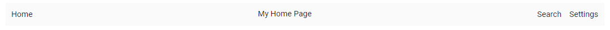
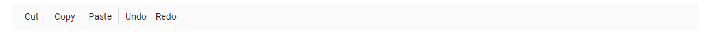

# Item Configuration in Blazor Toolbar Component

The [Blazor Toolbar](https://www.syncfusion.com/blazor-components/blazor-toolbar) can be rendered by defining a list of items. Items can be constructed with the following built-in Items types or item template.

* Align
* CssClass
* Disabled
* HtmlAttributes
* Id
* Overflow
* PrefixIcon
* ShowAlwaysInPopup
* ShowTextOn
* SuffixIcon
* TabIndex
* Template
* Text
* TooltipText
* Type
* Visible
* Width

## Align

This property specifies the alignment of Toolbar items within the Toolbar. Each item aligns according to its `Align` property. The possible values are:

1.  **Left**: Aligns items to the left side of the Toolbar.
2.  **Center**: Aligns items at the center of the Toolbar.
3.  **Right**: Aligns items to the right side of the Toolbar.

```cshtml

@using Syncfusion.Blazor.Navigations

<SfToolbar>
    <ToolbarItems>
        <ToolbarItem Text="Home" Align="ItemAlign.Left"></ToolbarItem>
        <ToolbarItem Text="My Home Page" Align="ItemAlign.Center"></ToolbarItem>
        <ToolbarItem Text="Search" Align="ItemAlign.Right"></ToolbarItem>
        <ToolbarItem Text="Settings" Align="ItemAlign.Right"></ToolbarItem>
    </ToolbarItems>
</SfToolbar>

```





To optimize the alignment of Toolbar items without using [Align](https://help.syncfusion.com/cr/blazor/Syncfusion.Blazor.Navigations.ToolbarItem.html#Syncfusion_Blazor_Navigations_ToolbarItem_Align) property, utilize the [Spacer](https://help.syncfusion.com/cr/blazor/Syncfusion.Blazor.Navigations.ToolbarItem.html#Syncfusion_Blazor_Navigations_ToolbarItem_Type) in toolbar. Refer [here](./align-items.md) to integrate spacer in Toolbar.

## CssClass

Single or multiple CSS classes can be added to the Toolbar Items using the Toolbar item `CssClass` property. Refer [Set Items customization](https://blazor.syncfusion.com/documentation/toolbar/how-to/set-command-customization) for snippet and output.

## Disabled

It specifies whether an item should be disabled or not. Refer [Enable/Disable Toolbar item](https://blazor.syncfusion.com/documentation/toolbar/how-to/enable-or-disable-toolbar-item) for snippet and output.

## HtmlAttributes

This property is used to add custom HTML attributes to the Toolbar item, such as `style`, `class`, etc. Refer [Set Items customization](https://blazor.syncfusion.com/documentation/toolbar/how-to/set-command-customization) for examples and output.

## Id

This property specifies a unique ID to be used for the button or input element of the Toolbar item. 

```cshtml

@using Syncfusion.Blazor.Navigations

<SfToolbar>
    <ToolbarItems>
        <ToolbarItem Id="Home" Text="Home" Align="ItemAlign.Left"></ToolbarItem>
        <ToolbarItem Text="My Home Page" Align="ItemAlign.Center"></ToolbarItem>
        <ToolbarItem Text="Search" Align="ItemAlign.Right"></ToolbarItem>
        <ToolbarItem Text="Settings" Align="ItemAlign.Right"></ToolbarItem>
    </ToolbarItems>
</SfToolbar>

```




## Overflow

It Specifies the Toolbar Items display area when an element’s content is too large to fit available space. This is applicable only to `Popup` mode. The possible values are:

1. **Show**: Always shows the item as the primary priority on the Toolbar.

2. **Hide**: Always shows the item as the secondary priority on the popup.

3. **None**: No priority for display, and as per normal order moves to popup when content exceeds.

Refer [Responsive Mode](https://blazor.syncfusion.com/documentation/toolbar/responsive-mode#text-mode-for-buttons) for snippet and output.

## PrefixIcon

This property defines single or multiple classes, separated by space, used to specify an icon for the button. The icon is positioned before the text content if text is available; otherwise, only the icon is rendered. Refer [Customize the Scrolling distance](https://blazor.syncfusion.com/documentation/toolbar/how-to/customize-the-scrolling-distance) for examples and output.

## ShowAlwaysInPopup

It defines the priority of items to display it in popup always. It allows to maintain toolbar item on popup always but it does not work for the toolbar priority items.

```cshtml

@using Syncfusion.Blazor.Navigations

<SfToolbar Width="300px" OverflowMode="OverflowMode.Popup">
    <ToolbarItems>
        <ToolbarItem Text="Cut" ShowAlwaysInPopup=true TooltipText="Cut"></ToolbarItem>
        <ToolbarItem Text="Copy" TooltipText="Copy"></ToolbarItem>
        <ToolbarItem Text="Paste" TooltipText="Paste"></ToolbarItem>
        <ToolbarItem></ToolbarItem>
        <ToolbarItem Text="Bold" TooltipText="Bold"></ToolbarItem>
        <ToolbarItem Text="Underline" TooltipText="Underline"></ToolbarItem>
        <ToolbarItem Text="Italic" TooltipText="Italic"></ToolbarItem>
        <ToolbarItem Text="Color Picker" TooltipText="Color-Picker"></ToolbarItem>
        <ToolbarItem></ToolbarItem>
        <ToolbarItem Text="Align Left" TooltipText="Align-Left"></ToolbarItem>
        <ToolbarItem Text="Align Right" TooltipText="Align-Right"></ToolbarItem>
        <ToolbarItem Text="Align Center" TooltipText="Align-Center"></ToolbarItem>
        <ToolbarItem Text="Align Justify" TooltipText="Align-Justify"></ToolbarItem>
    </ToolbarItems>
</SfToolbar>

```




## ShowTextOn

It specifies where the button text will be displayed on popup mode of the Toolbar. The possible values are:

1. **Toolbar**: Text will be displayed on Toolbar only.

2. **Overflow**: Text will be displayed only when content overflows to popup.

3. **Both**: Text will be displayed on popup and Toolbar.

Refer [Responsive Mode](https://blazor.syncfusion.com/documentation/toolbar/responsive-mode#text-mode-for-buttons) for snippet and output.

## SuffixIcon

This property defines single or multiple classes, separated by space, used to specify an icon for the button. The icon is positioned after the text content if text is available.

```cshtml

@using Syncfusion.Blazor.Navigations

<SfToolbar Width="600">
    <ToolbarItems>
        <ToolbarItem SuffixIcon="e-icons e-cut" Text="Cut"></ToolbarItem>
        <ToolbarItem SuffixIcon="e-icons e-copy" Text="Copy"></ToolbarItem>
        <ToolbarItem SuffixIcon="e-icons e-paste" Text="Paste"></ToolbarItem>
        <ToolbarItem Type="ItemType.Separator"></ToolbarItem>
        <ToolbarItem SuffixIcon="e-icons e-bold" Text="Bold"></ToolbarItem>
        <ToolbarItem SuffixIcon="e-icons e-underline" Text="Underline"></ToolbarItem>
        <ToolbarItem SuffixIcon="e-icons e-italic" Text="Italic"></ToolbarItem>
        <ToolbarItem SuffixIcon="e-icons e-paint-bucket" Text="Color-Picker"></ToolbarItem>
        <ToolbarItem Type="ItemType.Separator"></ToolbarItem>
        <ToolbarItem SuffixIcon="e-icons e-list-unordered" Text="Bullets"></ToolbarItem>
        <ToolbarItem SuffixIcon="e-icons e-list-ordered" Text="Numbering"></ToolbarItem>
        <ToolbarItem Type="ItemType.Separator"></ToolbarItem>
        <ToolbarItem SuffixIcon="e-icons e-sort-ascending" Text="Sort A - Z"></ToolbarItem>
        <ToolbarItem SuffixIcon="e-icons e-sort-descending" Text="Sort Z - A"></ToolbarItem>
        <ToolbarItem Type="ItemType.Separator"></ToolbarItem>
        <ToolbarItem SuffixIcon="e-icons e-upload-1" Text="Upload"></ToolbarItem>
        <ToolbarItem SuffixIcon="e-icons e-download" Text="Download"></ToolbarItem>
        <ToolbarItem Type="ItemType.Separator"></ToolbarItem>
        <ToolbarItem SuffixIcon="e-icons e-increase-indent" Text="Text Indent"></ToolbarItem>
        <ToolbarItem SuffixIcon="e-icons e-decrease-indent" Text="Text Outdent"></ToolbarItem>
        <ToolbarItem Type="ItemType.Separator"></ToolbarItem>
        <ToolbarItem SuffixIcon="e-icons e-erase" Text="Clear"></ToolbarItem>
        <ToolbarItem SuffixIcon="e-icons e-refresh" Text="Reload"></ToolbarItem>
        <ToolbarItem SuffixIcon="e-icons e-export" Text="Export"></ToolbarItem>
    </ToolbarItems>
</SfToolbar>
```



N> Refer [here](https://blazor.syncfusion.com/documentation/appearance/icons#icon-integration-in-button-component) to integrate Syncfusion icons in the Toolbar component.

## TabIndex

The Toolbar supports `TabIndex` functionality. Refer [Tab key navigation toolbar items ](https://blazor.syncfusion.com/documentation/toolbar/how-to/tab-key-navigation-toolbar-items) for detailed explanation, snippets, and output. 

## Template

The Toolbar supports custom content rendering using its `Template` property. This property accepts either an HTML element or a `RenderFragment`. Refer [Set item-wise custom template](https://blazor.syncfusion.com/documentation/toolbar/how-to/set-item-wise-custom-template) for detailed explanation, snippets, and output.

## Text

It is used to specify the text to be displayed on the Toolbar button. Refer [Getting Started](https://blazor.syncfusion.com/documentation/toolbar/getting-started#adding-toolbar-component-to-the-application) for the snippet and output.

## TooltipText

It is used to specify the text to be displayed on hovering the Toolbar button.

```cshtml

@using Syncfusion.Blazor.Navigations

<SfToolbar>
    <ToolbarItems>
        <ToolbarItem Text="Cut" TooltipText="Cut"></ToolbarItem>
        <ToolbarItem Text="Copy" TooltipText="Copy"></ToolbarItem>
        <ToolbarItem Text="Paste" TooltipText="Paste"></ToolbarItem>
        //To separate the Toolbar items
        <ToolbarItem></ToolbarItem>
        <ToolbarItem Text="Bold" TooltipText="Bold"></ToolbarItem>
        <ToolbarItem Text="Underline" TooltipText="Underline"></ToolbarItem>
        <ToolbarItem Text="Italic" TooltipText="Italic"></ToolbarItem>
        <ToolbarItem Text="Color-Picker" TooltipText="Color Picker"></ToolbarItem>
    </ToolbarItems>
</SfToolbar>

```



## Type

It specifies the types of Items to be rendered in the Toolbar. Supported types are:

1. **Button**: Creates the Button control with its given properties like text, prefixIcon, etc.

2. **Separator**: Adds a horizontal line that separates the Toolbar Items.

3. **Input**: Creates an input element that is applicable to template rendering with Syncfusion<sup style="font-size:70%">&reg;</sup> controls like DropDownList, AutoComplete, etc.

4. **Spacer**: Adds a space within the Toolbar item. [Spacer](https://help.syncfusion.com/cr/blazor/Syncfusion.Blazor.Navigations.ToolbarItem.html#Syncfusion_Blazor_Navigations_ToolbarItem_Type) can be used to align the Toolbar items to the left, center, and right.

### Button

`Button` is the default Items [Type](https://help.syncfusion.com/cr/blazor/Syncfusion.Blazor.Navigations.ToolbarItem.html#Syncfusion_Blazor_Navigations_ToolbarItem_Type), and it can be rendered by using the `Text` property.
Properties of the button Items type:

  Property   | Description
------------ | -------------
  Text       | The text to be displayed for the button.
 ID         | The ID of the button to be rendered. If the ID is not given, auto ID is generated.
  PrefixIcon | Defines the class used to specify an icon for the button. The icon is `positioned before` the text if the text is available or the icon alone button is rendered.
SuffixIcon | Defines the class used to specify an icon for the button. The icon is `positioned after` the text if text is available. If both [PrefixIcon](https://help.syncfusion.com/cr/blazor/Syncfusion.Blazor.Navigations.ToolbarItem.html#Syncfusion_Blazor_Navigations_ToolbarItem_PrefixIcon) and [SuffixIcon](https://help.syncfusion.com/cr/blazor/Syncfusion.Blazor.Navigations.ToolbarItem.html#Syncfusion_Blazor_Navigations_ToolbarItem_SuffixIcon) are specified, only the `PrefixIcon` is considered.
  Width      | Used to set the width of the button.

Refer [Set Blazor Tooltip to the Items](https://blazor.syncfusion.com/documentation/toolbar/how-to/set-tool-tip-to-the-commands) for snippet and output.

### Separator

The `Separator` type adds a vertical line that visually separates Toolbar's items.

```cshtml
@using Syncfusion.Blazor.Navigations

<SfToolbar>
  <ToolbarItems>
    <ToolbarItem Text="Cut"></ToolbarItem>
    <ToolbarItem Text="Copy"></ToolbarItem>
    <ToolbarItem Type="ItemType.Separator"></ToolbarItem>
    <ToolbarItem Text="Paste"></ToolbarItem>
    <ToolbarItem Type="ItemType.Separator"></ToolbarItem>
    <ToolbarItem Text="Undo"></ToolbarItem>
    <ToolbarItem Text="Redo"></ToolbarItem>
  </ToolbarItems>
</SfToolbar>
```

N> If `Separator` is added as the first or the last item, it will not be visible.




### Input

The `Input` type is only applicable for adding `Template` elements when the `Template` property is defined as an `object`. Input type creates an `input element` internally that acts as the container for `Syncfusion` input based components.

#### NumericTextBox

* The `NumericTextBox` component can be included by importing the `@using Syncfusion.Blazor.Inputs` package into the `~/_Imports.razor` file.

* Initialize the `NumericTextBox` in [Template](https://help.syncfusion.com/cr/blazor/Syncfusion.Blazor.Navigations.ToolbarItem.html#Syncfusion_Blazor_Navigations_ToolbarItem_Template) property, where the Toolbar item `Type` is set as `Input`.

* Related `NumericTextBox` component properties can also be configured as given below.

```csharp

<SfNumericTextBox Format="n2"></SfNumericTextBox>

```

#### DropDownList

* The `DropDownList` component can be included by importing the `@using Syncfusion.Blazor.DropDowns` package into the `~/_Imports.razor` file.

* Initialize the `DropDownList` in `Template` property, where the Toolbar item `Type` is set as `Input`.

* Related `DropDownList` component properties can also be configured as given below.

```csharp

<SfDropdownList Width="100"></SfDropdownList>

```

#### RadioButton

* The `RadioButton` component can be included by importing the `@using Syncfusion.Blazor.Buttons` package into the `~/_Imports.razor` file.

* Initialize the `RadioButton` in `Template` property, where the Toolbar item `Type` is set as `Input`.

* Related `RadioButton` component properties can also be configured as given below.

```csharp

<SfRadioButton Label="Option 1" Name="Default"></SfRadioButton>

```

The following code explains how to add `NumericTextBox`, `DropDownList`, `RadioButton` and `CheckBox` components to the Toolbar.

```cshtml
@using Syncfusion.Blazor.Navigations
@using Syncfusion.Blazor.Inputs
@using Syncfusion.Blazor.DropDowns
@using Syncfusion.Blazor.Buttons

<SfToolbar>
    <ToolbarItems>
        <ToolbarItem Type="ItemType.Input">
          <Template>
            <SfNumericTextBox Width="150" Value=1 Format="c2"></SfNumericTextBox>
          </Template>
        </ToolbarItem>
        <ToolbarItem></ToolbarItem>
        <ToolbarItem Type="ItemType.Input">
            <Template>
                <SfDropDownList TValue="string" ID="Games" DataSource="@SportsData" Width="120" Index="2" TItem="Games">
                    <DropDownListFieldSettings Value="Text"></DropDownListFieldSettings>
                </SfDropDownList>
            </Template>
        </ToolbarItem>
        <ToolbarItem></ToolbarItem>
        <ToolbarItem Type="ItemType.Input">
            <Template>
                <SfCheckBox Checked="true" Label="CheckBox"></SfCheckBox>
            </Template>
        </ToolbarItem>
        <ToolbarItem></ToolbarItem>
        <ToolbarItem Type="ItemType.Input">
            <Template>
                <SfRadioButton Label="Radio" Name="default" Value="Radio" @bind-Checked="CheckedValue"></SfRadioButton>
            </Template>
        </ToolbarItem>
    </ToolbarItems>
</SfToolbar>

@code {
    private string CheckedValue = "Radio";
    public class Games
    {
        public string Id { get; set; }
        public string Text { get; set; }
    }
    List<Games> SportsData = new List<Games> {
    new Games() { Id= "Game2", Text= "Badminton" },
    new Games() { Id= "Game4", Text= "Cricket" },
    new Games() { Id= "Game5", Text= "Football" },
    new Games() { Id= "Game6", Text= "Golf" },
    new Games() { Id= "Game10", Text= "Tennis"}
  };
}
```




### Spacer

N> Refer [Align Items Using Spacer](./align-items-using-spacer) to integrate the spacer in the Toolbar component.

## Visible

It specifies whether an item should be hidden or not.

```cshtml

@using Syncfusion.Blazor.Navigations

<SfToolbar>
    <ToolbarItems>
        <ToolbarItem Text="Cut" Visible=false></ToolbarItem>
        <ToolbarItem Text="Copy"></ToolbarItem>
        <ToolbarItem Type="ItemType.Separator"></ToolbarItem>
        <ToolbarItem Text="Paste"></ToolbarItem>
        <ToolbarItem Type="ItemType.Separator"></ToolbarItem>
        <ToolbarItem Text="Undo"></ToolbarItem>
        <ToolbarItem Text="Redo"></ToolbarItem>
    </ToolbarItems>
</SfToolbar>

```




## Width

It specifies the width of the Toolbar button Items.

```cshtml

@using Syncfusion.Blazor.Navigations

<SfToolbar>
    <ToolbarItems>
        <ToolbarItem Text="Cut" Width="50px"></ToolbarItem>
        <ToolbarItem Text="Copy"></ToolbarItem>
        <ToolbarItem Type="ItemType.Separator"></ToolbarItem>
        <ToolbarItem Text="Paste"></ToolbarItem>
        <ToolbarItem Type="ItemType.Separator"></ToolbarItem>
        <ToolbarItem Text="Undo"></ToolbarItem>
        <ToolbarItem Text="Redo"></ToolbarItem>
    </ToolbarItems>
</SfToolbar>

```



