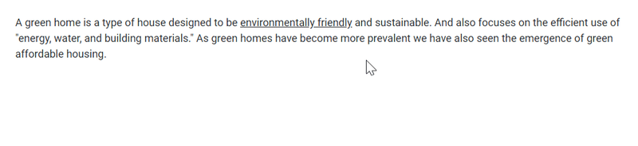

# Content

A text or a piece of information assigned to the Tooltip's `Content` property will be displayed as the main text stream of the Tooltip.
 It can be a string or a template content. If the `Content` property is not provided with any specific value, then it takes the value
  assigned to the attribute of the target element on which the Tooltip was initialized. The content can also dynamically be assigned to the Tooltip via AJAX.

## Template content

Any text or image can be added to the Tooltip, by default. To customize the Tooltip layout or to create your own visualized element on the
 Tooltip, template can be used.

Refer to the following code example to add formatted HTML content to the Tooltip.

```csharp
@using Syncfusion.Blazor.Popups

<SfTooltip ID="tooltip" IsSticky="true" Target="#target" Content="@Content">
    <div id='container'>
        <p>
            A green home is a type of house designed to be
            <a id="target">
                <u>environmentally friendly</u>
            </a> and sustainable. And also focuses on the efficient use of "energy, water, and building materials." As green homes
            have become more prevalent we have also seen the emergence of green affordable housing.
        </p>
    </div>
</SfTooltip>

@code
{
    string Content = "<div><b>Environmentally friendly</b> or environment-friendly, (also referred to as eco-friendly, nature-friendly, and green) are marketing and sustainability terms referring to goods and services, laws, guidelines and policies that inflict reduced, minimal, or no harm upon ecosystems or the environment.</div>";
}
```

Output be like the below.


