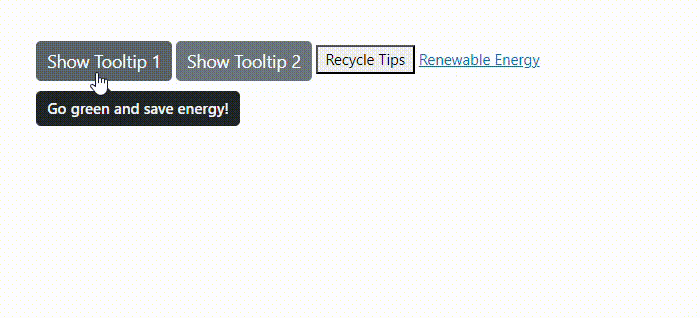

# Content in Blazor Tooltip Component

The Blazor Tooltip component displays supplemental information when users hover over or interact with elements on a web page. This article explains multiple options for defining tooltip content and when to use each approach to enhance clarity and appearance.

## Simple Text Content

The simplest way to configure tooltip content is to provide a text string using the [Content](https://help.syncfusion.com/cr/blazor/Syncfusion.Blazor.Popups.SfTooltip.html#Syncfusion_Blazor_Popups_SfTooltip_Content) property. The value assigned to the `Content` property is rendered as the primary text of the tooltip.

```cshtml
@using Syncfusion.Blazor.Popups
@using Syncfusion.Blazor.Buttons

<SfTooltip ID="Tooltip" Target="#btn" Content="@Content">
    <SfButton ID="btn" Content="Show Tooltip"></SfButton>
</SfTooltip>

@code
{
    string Content = "Lets go green & Save Earth !!";
}
```

This configuration displays a plain text message when the button receives hover or focus. The example text is illustrative and can be replaced with task-specific content.


## Using the Title Attribute

The tooltip can also derive its content from the title attribute of the target element. The [Target](https://help.syncfusion.com/cr/blazor/Syncfusion.Blazor.Popups.SfTooltip.html#Syncfusion_Blazor_Popups_SfTooltip_Target) property defines the elements to which the tooltip is applied, and when those elements include a title attribute, that value is used as the tooltip content.

```cshtml
@using Syncfusion.Blazor.Buttons
@using Syncfusion.Blazor.Popups

<SfTooltip ID="Tooltip" Target="#container [title]">
    <!-- Elements with title attributes -->
    <div id="container">
        <SfButton ID="btn1" Content="Show Tooltip 1" title="Go green and save energy!"></SfButton>
        <SfButton ID="btn2" Content="Show Tooltip 2" title="Plant trees to combat climate change!"></SfButton>
        <button title="Recycle to reduce waste">Recycle Tips</button>
        <a href="#" title="Switch to renewable energy">Renewable Energy</a>
    </div>
</SfTooltip>

```

This approach is effective for enhancing existing title attributes with a styled tooltip, especially when retrofitting existing markup. The example includes a placeholder hyperlink (href="#") for demonstration.




## Using Template

The Tooltip's Template capability enables full customization and the inclusion of custom elements. Provide any content or HTML elements through the [`ContentTemplate`](https://help.syncfusion.com/cr/blazor/Syncfusion.Blazor.Popups.SfTooltip.html#Syncfusion_Blazor_Popups_SfTooltip_ContentTemplate) property to compose rich content. The [`ContentTemplate`](https://help.syncfusion.com/cr/blazor/Syncfusion.Blazor.Popups.SfTooltip.html#Syncfusion_Blazor_Popups_SfTooltip_ContentTemplate) property supports the `RenderFragment` type, enabling dynamic and interactive content.

The following example shows how to include an HTML template inside the tooltip.

```cshtml
@using Syncfusion.Blazor.Buttons;
@using Syncfusion.Blazor.Popups;
<SfTooltip CssClass="e-tooltip-css" OpensOn="Click" Target="#btn">
    <ContentTemplate>
        <div id='democontent' class='democontent'>
            <div class='info'>
                <h3 style='margin-top:10px'>Eastern Bluebird <hr style='margin-top:10px'></h3>
                <div style='margin-top: -10px'>
                    <div style='float:left;width:57%'>
                        The
                            <a href='https://en.wikipedia.org/wiki/Eastern_bluebird' target='blank'> Eastern Bluebird
                            </a> 
                                is easily found in open fields and sparse woodland areas, including along woodland edges.These are
                            <i>
                                cavity-nesting birds
                            </i>
                        and a pair of eastern bluebirds will raise 2-3 broods annually, with 2-8 light blue or whitish eggs per brood.
                    </div>
                    <div id='bird' style='float:right;width:42%'>
                        
                    </div>
                </div>
                <div style='margin-top:160px'>
                    <hr>
                    <p style='margin-top:-11px'> Eastern bluebirds can be very vocal in flocks.Their calls include a rapid,  mid-tone chatter and several long dropping pitch calls.
                    </p>
                </div>
                    <p>Source:<br />
                        <a href='https://en.wikipedia.org/wiki/Eastern_bluebird' target='_blank'>https://en.wikipedia.org/wiki/Eastern_bluebird</a>
                    </p>
            </div>
        </div>
    </ContentTemplate>
    <ChildContent>
        <SfButton ID="btn" CssClass="e-outline text" IsPrimary="true" Content="HTML Template"></SfButton>
    </ChildContent>
</SfTooltip>
<style>
    .e-tooltip-css {
        filter: drop-shadow(2px 5px 5px rgba(0, 0, 0, 0.25));
    }
    .text {
        text-transform: capitalize;
        width: 155px;
    }
    .democontent {
        border: 0.5px solid grey;
    }
    #bird {
        padding-top: 4px;
    }
    .info a {
        color: #2FA1E3;
    }
    .info {
        padding-left: 12px;
        padding-right: 5px;
    }
</style>
```


## Dynamic Content with RenderFragment

The SfTooltip is used to display dynamic content generated using a RenderFragment. The [`ContentTemplate`](https://help.syncfusion.com/cr/blazor/Syncfusion.Blazor.Popups.SfTooltip.html#Syncfusion_Blazor_Popups_SfTooltip_ContentTemplate)property allows you to render this dynamic content within the tooltip. A `RenderFragment` in Blazor enables you to dynamically define and render UI content, including Blazor components, HTML, and interactive logic. 

```cshtml
@using Syncfusion.Blazor.Buttons
@using Syncfusion.Blazor.Popups

<SfTooltip ID="tooltip" Target="#target">
    <ContentTemplate>
        <div>
            @(TooltipContent())
        </div>
    </ContentTemplate>
    <ChildContent>
        <div id='container'>
            <p>
                A green home is a type of house designed to be
                <a id="target">
                    <u>environmentally friendly</u>
                </a> and sustainable. And also focuses on the efficient use of "energy, water, and building materials." As green homes
                have become more prevalent we have also seen the emergence of green affordable housing.
            </p>
        </div>
    </ChildContent>
</SfTooltip>

@code {
    private RenderFragment TooltipContent()
        {
            return@<div>
                <h3>Complex Tooltip Content</h3>
                <p>This is a paragraph inside the tooltip.</p>
                <ul>
                    <li>List item 1</li>
                    <li>List item 2</li>
                    <li>List item 3</li>
                </ul>
                <button @onclick="@(() => Console.WriteLine("Button in Tooltip clicked!"))">
                    Click me!
                </button>
                <SfButton ID="btn" IsPrimary="true" Content="HTML Template"></SfButton>
            </div>;
        }
}
```

This approach provides full control over the tooltip content and supports interactivity and dynamic data. When adding interactive elements, consider accessibility and focus behavior to ensure a predictable user experience.


##  Rendering HTML content using MarkupString

By default, the tooltip can show formatted content. To improve the layout or create a custom visual element, use the [`ContentTemplate`](https://help.syncfusion.com/cr/blazor/Syncfusion.Blazor.Popups.SfTooltip.html#Syncfusion_Blazor_Popups_SfTooltip_ContentTemplate) property to define the structure. The [`@(MarkupString)`](https://learn.microsoft.com/en-us/dotnet/api/microsoft.aspnetcore.components.markupstring?view=aspnetcore-7.0) type can also be used to render HTML content from a string dynamically.

```cshtml
@using Syncfusion.Blazor.Popups

<SfTooltip ID="tooltip" Target="#target">
    <ContentTemplate>
        <div>
            @((MarkupString)Content)
        </div>
    </ContentTemplate>
    <ChildContent>
        <div id='container'>
            <p>
                A green home is a type of house designed to be
                <a id="target">
                    <u>environmentally friendly</u>
                </a> and sustainable. And also focuses on the efficient use of "energy, water, and building materials." As green homes
                have become more prevalent we have also seen the emergence of green affordable housing.
            </p>
        </div>
    </ChildContent>
</SfTooltip>

@code
{
    string Content = "<div><b>Environmentally friendly</b> or environment-friendly, (also referred to as eco-friendly, nature-friendly, and green) are marketing and sustainability terms referring to goods and services, laws, guidelines and policies that inflict reduced, minimal, or no harm upon ecosystems or the environment.</div>";
}
```

This option is useful when rendering HTML stored as a string from a database or API. Do not render untrusted HTML without sanitization, as doing so may introduce cross-site scripting (XSS) vulnerabilities.


By selecting the appropriate approach—plain text via `Content`, title attribute content via `Target`, rich layouts via `ContentTemplate`, dynamic UI via `RenderFragment`, or string-based HTML via `MarkupString`—the tooltip can convey anything from simple hints to rich, interactive information to improve the user experience.