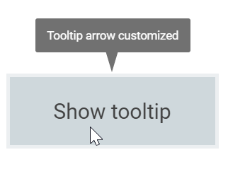

# Customization in Blazor Tooltip Component

The Tooltip can be customized by using the [`CssClass`](https://help.syncfusion.com/cr/blazor/Syncfusion.Blazor.Popups.SfTooltip.html#Syncfusion_Blazor_Popups_SfTooltip_CssClass) property, which applies one or more custom CSS class names. These classes allow defining user-specific styles and themes that are applied to the tooltip wrapper and its elements.

## Tip pointer customization

Style the tip pointer size, background, and border colors using the [`CssClass`](https://help.syncfusion.com/cr/blazor/Syncfusion.Blazor.Popups.SfTooltip.html#Syncfusion_Blazor_Popups_SfTooltip_CssClass) property as shown below. The selectors target the generated tooltip wrapper and pointer elements that are set at runtime based on placement.

```cshtml
@using Syncfusion.Blazor.Popups
@using Syncfusion.Blazor.Buttons

<SfTooltip Target="#target" CssClass="customtip" Content="@Content">
    <SfButton ID="target" Content="Show Tooltip"></SfButton>
</SfTooltip>

@code
{
    string Content = "Tooltip arrow customized";
}

<style>
    #target {
        background-color: #cfd8dc;
        border: 3px solid #eceff1;
        box-sizing: border-box;
        margin: 80px auto;
        padding: 20px 0;
        width: 200px;
        text-align: center;
        color: #424242;
        font-size: 20px;
        user-select: none;
    }

    .customtip.e-tooltip-wrap {
        padding: 4px;
    }

    .customtip.e-tooltip-wrap .e-arrow-tip.e-tip-bottom,
    .customtip.e-tooltip-wrap .e-arrow-tip.e-tip-top,
    .customtip.e-tooltip-wrap .e-arrow-tip.e-tip-left,    
    .customtip.e-tooltip-wrap .e-arrow-tip.e-tip-right {
        height: 20px;
        width: 12px;
    }

    .customtip.e-tooltip-wrap .e-arrow-tip-outer.e-tip-bottom {
        border-left: 6px solid transparent;
        border-right: 6px solid transparent;
        border-top: 20px solid #616161;
    }

    .customtip.e-tooltip-wrap .e-arrow-tip-outer.e-tip-top {
        border-bottom: 20px solid #616161;
        border-left: 6px solid transparent;
        border-right: 6px solid transparent;
    }

    .customtip.e-tooltip-wrap .e-arrow-tip-outer.e-tip-left {
        border-bottom: 6px solid transparent;
        border-right: 20px solid #616161;
        border-top: 6px solid transparent;
    }

    .customtip.e-tooltip-wrap .e-arrow-tip-outer.e-tip-right {
        border-bottom: 6px solid transparent;
        border-left: 20px solid #616161;
        border-top: 6px solid transparent;
    }
</style>
```



## Tooltip customization

The complete look and feel of the Tooltip can be customized by changing its background color, opacity, content font, and related styles. The following example demonstrates overriding theme styles by scoping CSS to a custom class applied through `CssClass`.

```cshtml
@using Syncfusion.Blazor.Popups
@using Syncfusion.Blazor.Buttons


<SfTooltip Target="#target" CssClass="customtooltip" Content="@Content">
    <SfButton ID="target" Content="Show Tooltip"></SfButton>
</SfTooltip>

@code
{
    string Content="Tooltip customized";
}

<style>
    #target {
        background-color: #ececec;
        border: 1px solid #c8c8c8;
        box-sizing: border-box;
        margin: 70px auto;
        padding: 20px;
        width: 200px;
    }

    .customtooltip.e-tooltip-wrap .e-tip-content {
        line-height: 20px;
    }

    .customtooltip.e-tooltip-wrap .e-arrow-tip.e-tip-bottom {
        height: 12px;
        left: 50%;
        top: 100%;
        width: 24px;
    }

    .customtooltip.e-tooltip-wrap .e-arrow-tip.e-tip-top {
        height: 12px;
        left: 50%;
        top: -9px;
        width: 24px;
    }

    .customtooltip.e-tooltip-wrap .e-arrow-tip.e-tip-left {
        height: 24px;
        left: -9px;
        top: 48%;
        width: 12px;
    }

    .customtooltip.e-tooltip-wrap .e-arrow-tip.e-tip-right {
        height: 24px;
        left: 100%;
        top: 50%;
        width: 12px;
    }

    .customtooltip.e-tooltip-wrap {
        border-radius: 4px;
        opacity: 1;
    }

    .customtooltip.e-tooltip-wrap.e-popup {
        background-color: #fff;
        border: 2px solid #000;
    }

    .customtooltip.e-tooltip-wrap .e-tip-content {
        color: #000;
        font-size: 12px;
    }

    .customtooltip.e-tooltip-wrap .e-arrow-tip-outer.e-tip-bottom {
        border-left: 12px solid transparent;
        border-right: 14px solid transparent;
        border-top: 12px solid #000;
    }

    .customtooltip.e-tooltip-wrap .e-arrow-tip-outer.e-tip-top {
        border-bottom: 12px solid #000;
        border-left: 12px solid transparent;
        border-right: 12px solid transparent;
    }

    .customtooltip.e-tooltip-wrap .e-arrow-tip-outer.e-tip-left {
        border-bottom: 12px solid transparent;
        border-right: 12px solid #000;
        border-top: 12px solid transparent;
    }

    .customtooltip.e-tooltip-wrap .e-arrow-tip-outer.e-tip-right {
        border-bottom: 12px solid transparent;
        border-left: 12px solid #000;
        border-top: 12px solid transparent;
    }

    .customtooltip.e-tooltip-wrap .e-arrow-tip-inner.e-tip-bottom {
        color: #fff;
        font-size: 25.9px;
    }
</style>
```

