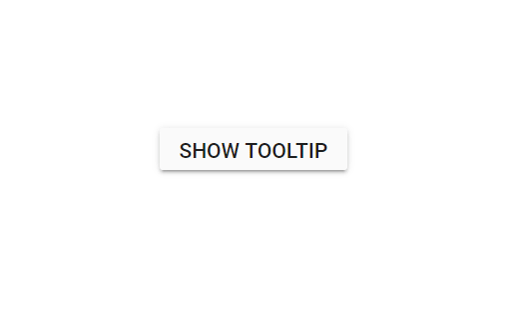

# Getting Started

This section briefly explains how to include a `Tooltip` in your Blazor Server-Side application. Refer to the [Getting Started with Syncfusion Blazor for Server-Side in Visual Studio 2019 page](https://blazor.syncfusion.com/documentation/getting-started/blazor-server-side-visual-studio-2019/) for the introduction and configuring the common specifications.

To get start quickly with Blazor Tooltip, you can check on this video



## Importing Syncfusion Blazor component in the application

You can use any one of the below standards to install the Syncfusion Blazor library in your application.

### Using Syncfusion Blazor Individual NuGet Packages [New standard]

> Starting with Volume 4, 2020 (v18.4.0.30) release, Syncfusion provides [individual NuGet packages](https://blazor.syncfusion.com/documentation/nuget-packages/) for our Syncfusion Blazor components. We highly recommend this new standard for your Blazor production applications. Refer to [this section](https://blazor.syncfusion.com/documentation/nuget-packages/#benefits-of-using-individual-nuget-packages) to know the benefits of the individual NuGet packages.

1. Install **Syncfusion.Blazor.Popups** NuGet package to the application by using the `NuGet Package Manager`. Refer to the [Individual NuGet Packages](https://blazor.syncfusion.com/documentation/nuget-packages/) section for the available NuGet packages.

    

2. Search **Syncfusion.Blazor.Popups** keyword in the Browse tab and install **Syncfusion.Blazor.Popups** NuGet package in the application.

    

3. Once the installation process is completed, the Syncfusion Blazor Popups package will be installed in the project.

4. You can add the client-side style resources from NuGet package in the `<head>` element of the **~/Pages/_Host.cshtml** page.

    ```html
    <head>
        ....
        ....
        <link href="_content/Syncfusion.Blazor.Themes/bootstrap4.css" rel="stylesheet" />
    </head>
    ```

    W> `Syncfusion.Blazor` package should not be installed along with [individual NuGet packages](https://blazor.syncfusion.com/documentation/nuget-packages/). Hence, you have to add the above `Syncfusion.Blazor.Themes` static web assets (styles) in the application.

### Using Syncfusion.Blazor NuGet Package [Old standard]

W> If you prefer the above new standard (individual NuGet packages), then skip this section. Using both old and new standards in the same application will throw ambiguous compilation errors.

1. Install **Syncfusion.Blazor** NuGet package to the application by using the `NuGet Package Manager` Right-click the project and then select `Manage NuGet Packages`.

    

2. Search **Syncfusion.Blazor** keyword in the Browse tab and install **Syncfusion.Blazor** NuGet package in the application.

    

3. Once the installation process is completed, the Syncfusion Blazor package will be installed in the project.

4. You can add the client-side style resources using NuGet package to the `<head>` element of the `~/wwwroot/index.html` page in Blazor WebAssembly app or `~/Pages/_Host.cshtml` page in Blazor Server app.

>Note: You can also add the client-side style resources through CDN.

```html
    <head>
        ....
        ....
        <link href="_content/Syncfusion.Blazor/styles/bootstrap4.css" rel="stylesheet" />
    </head>
```

```html
    <head>
        <link href="https://cdn.syncfusion.com/blazor/{:version:}/styles/bootstrap4.css" rel="stylesheet" />
    </head>
```

> For `Internet Explorer 11` kindly refer the polyfills. Refer the [documentation](https://blazor.syncfusion.com/documentation/common/how-to/render-blazor-server-app-in-ie/) for more information.

```csharp
<head>
    <link href="_content/Syncfusion.Blazor/styles/bootstrap4.css" rel="stylesheet" />
    <script src="https://github.com/Daddoon/Blazor.Polyfill/releases/download/3.0.1/blazor.polyfill.min.js"></script>
</head>
```

## Add Syncfusion Blazor service in Startup.cs (Server-side application)

Open the **Startup.cs** file and add services required by Syncfusion components using `services.AddSyncfusionBlazor()` method. Add this method in the `ConfigureServices` function as follows.

```csharp
using Syncfusion.Blazor;

namespace BlazorApplication
{
    public class Startup
    {
        ....
        ....
        public void ConfigureServices(IServiceCollection services)
        {
            ....
            ....
            services.AddSyncfusionBlazor();
        }
    }
}
```

## Add Syncfusion Blazor service in Program.cs (Client-side application)

Open the **Program.cs** file and add services required by Syncfusion components using `builder.services.AddSyncfusionBlazor()` method. Add this method in the `Main` function as follows.

```csharp
using Syncfusion.Blazor;

namespace BlazorApplication
{
    public class Program
    {
        public static async Task Main(string[] args)
        {
            ....
            ....
            builder.Services.AddSyncfusionBlazor();
        }
    }
}
```

## Adding component package to the application

Open `~/_Imports.razor` file and import the `Syncfusion.Blazor.Popups` package.

```cshtml
@using Syncfusion.Blazor
@using Syncfusion.Blazor.Buttons
@using Syncfusion.Blazor.Popups
```

## Adding Tooltip component to the application

Now, add the Syncfusion Blazor Tooltip component in any web page `razor` in the `Pages` folder. For example, the Tooltip component is added in the `~/Pages/Index.razor` page.

```cshtml
@using Syncfusion.Blazor.Popups
@using Syncfusion.Blazor.Buttons

<SfTooltip ID="Tooltip" Target="#btn" Content="@Content">
    <SfButton ID="btn" Content="Show Tooltip"></SfButton>
</SfTooltip>

@code
{
    string Content = "Lets go green & Save Earth !!";
}
```

## Run the application

 After successful compilation of your application, simply press `F5` to run the application.

Output be like the below.



## See Also

[Positioning Tooltip](./position)

[Tooltip Open Mode](./open-mode)

[Customize the Tooltip](./customization)

[Getting Started with Syncfusion Blazor for Client-Side in .NET Core CLI](https://blazor.syncfusion.com/documentation/getting-started/blazor-webassembly-dotnet-cli/)

[Getting Started with Syncfusion Blazor for Client-Side in Visual Studio 2019](https://blazor.syncfusion.com/documentation/getting-started/blazor-webassembly-visual-studio-2019/)

[Getting Started with Syncfusion Blazor for Server-Side in .NET Core CLI](https://blazor.syncfusion.com/documentation/getting-started/blazor-server-side-dotnet-cli/)