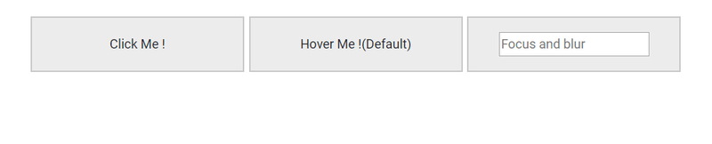
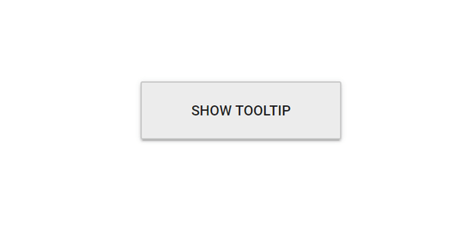

# Open Mode in Blazor Tooltip Component

Control when the Tooltip opens by configuring the [`OpensOn`](https://help.syncfusion.com/cr/blazor/Syncfusion.Blazor.Popups.SfTooltip.html#Syncfusion_Blazor_Popups_SfTooltip_OpensOn) property. Tooltips can open on hover, focus, or click of the target element.

N> On mobile devices, Tooltips appear when you tap and hold the element, even if the [`OpensOn`](https://help.syncfusion.com/cr/blazor/Syncfusion.Blazor.Popups.SfTooltip.html#Syncfusion_Blazor_Popups_SfTooltip_OpensOn) option is assigned with `Hover`.
 Tooltips remain visible while the element is pressed and held, then disappear about 1.5 seconds after release. If another action occurs before that time, the tooltip closes immediately.

The [`OpensOn`](https://help.syncfusion.com/cr/blazor/Syncfusion.Blazor.Popups.SfTooltip.html#Syncfusion_Blazor_Popups_SfTooltip_OpensOn) property can take either a single or a combination of multiple values, separated by space from the following options. The table below explains how the Tooltip opens on both desktop and mobile based on the value(s) assigned to the `OpensOn` property. By default, it takes `Auto` value.

| Values | Desktop | Mobile |
| ------------- | ------------- | ------------- |
| `Auto` | Tooltip appears when you hover over the target or when the target element receives focus. | Tooltip opens on tap and hold of the target element. |
| `Hover` | Tooltip appears when you hover over the target. | Tooltip opens on tap and hold of the target element. |
| `Click` | Tooltip appears when you click a target element. | Tooltip appears when you single tap the target element. |
| `Focus` | Tooltip appears when you focus on a target element (for example, via the Tab key). | Tooltip appears with a single tap on the target element. |
| `Custom` | Tooltip is not triggered by any default action. Bind your own events and invoke the tooltip’s open/close methods programmatically. | Same as Desktop. |

To open the tooltip for multiple actions, such as both hover and click on the target element, assign `OpensOn` with multiple values separated by a space, for example: `Hover Click`.

N> `Auto` value cannot be used with any combination for multiple values.

```cshtml
@using Syncfusion.Blazor.Popups

<SfTooltip ID="tooltiphover" Target=".blocks" Content="@Content" OpensOn="Click">
    <div class="blocks"><span>Click Me !</span></div>
</SfTooltip>
<SfTooltip ID="tooltipclick" Target=".blocks" Content="@Content" OpensOn="Hover">
    <div class="blocks"><span>Hover Me !(Default)</span></div>
</SfTooltip>
<SfTooltip ID="tooltipfocus" Target=".e-info" Content="@Content" OpensOn="Focus">
    <div class="blocks"><span><input class="e-info" type="text" placeholder="Focus and blur" /></span></div>
</SfTooltip>

@code
{
    string Content="Tooltip content";
}

<style>
    #tooltiphover {
        width: 200px;
        box-sizing: border-box;
        display: inline-block;
    }

    #tooltipclick {
        width: 200px;
        box-sizing: border-box;
        display: inline-block;
    }

    #tooltipfocus {
        width: 200px;
        box-sizing: border-box;
        display: inline-block;
        line-height: 17px;
    }

    #tooltipfocus .blocks span {
        line-height: 17px;
    }

    #tooltipcustom .blocks #tooltipopen {
        line-height: 17px;
    }

    .blocks {
        background-color: #ececec;
        border: 1px solid #c8c8c8;
        box-sizing: border-box;
        display: inline-block;
        line-height: 50px;
        margin: 0 10px 10px 0;
        overflow: hidden;
        text-align: center;
        vertical-align: middle;
        width: 200px;
    }
</style>
```



## Sticky mode

When `IsSticky` is set to `true`, the tooltip stays visible until the close icon is selected. In this mode, a close icon appears in the top-right corner of the tooltip. Enable or disable this behavior with the [`IsSticky`](https://help.syncfusion.com/cr/blazor/Syncfusion.Blazor.Popups.SfTooltip.html#Syncfusion_Blazor_Popups_SfTooltip_IsSticky) property.

```cshtml
@using Syncfusion.Blazor.Popups
@using Syncfusion.Blazor.Buttons

<SfTooltip Target="#target" Content="@Content" IsSticky="true">
    <SfButton ID="target" Content="Show Tooltip"></SfButton>
</SfTooltip>

@code
{
    string Content="Click close icon to close me";
}

<style>
    #target {
        background-color: #ececec;
        border: 1px solid #c8c8c8;
        box-sizing: border-box;
        margin: 80px auto;
        padding: 20px;
        width: 200px;
    }
</style>

```



## Open or Close Tooltip with delay

Open or close the tooltip after a specified delay using the [`OpenDelay`](https://help.syncfusion.com/cr/blazor/Syncfusion.Blazor.Popups.SfTooltip.html#Syncfusion_Blazor_Popups_SfTooltip_OpenDelay) and [`CloseDelay`](https://help.syncfusion.com/cr/blazor/Syncfusion.Blazor.Popups.SfTooltip.html#Syncfusion_Blazor_Popups_SfTooltip_CloseDelay) properties. Use delays judiciously to avoid hindering user interactions.

```cshtml
@using Syncfusion.Blazor.Popups
@using Syncfusion.Blazor.Buttons

<SfTooltip Target="#target" Content="@Content" OpenDelay="1000" CloseDelay="1000">
    <SfButton ID="target" Content="Show Tooltip"></SfButton>
</SfTooltip>

@code
{
    string Content="Tooltip with delay";
}

<style>
    #target {
        background-color: #ececec;
        border: 1px solid #c8c8c8;
        box-sizing: border-box;
        margin: 80px auto;
        padding: 20px;
        width: 200px;
    }
</style>
```

