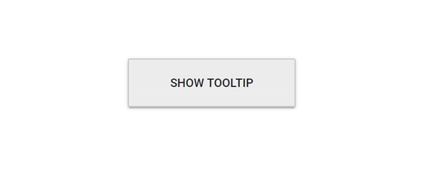
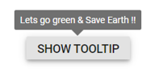

# Position in Blazor Tooltip Component

Tooltips can be positioned at 12 predefined locations around the target. Set the [**Position**](https://help.syncfusion.com/cr/blazor/Syncfusion.Blazor.Popups.SfTooltip.html#Syncfusion_Blazor_Popups_SfTooltip_Position) property to one of the following values:

* `TopLeft`
* `TopCenter`
* `TopRight`
* `BottomLeft`
* `BottomCenter`
* `BottomRight`
* `LeftTop`
* `LeftCenter`
* `LeftBottom`
* `RightTop`
* `RightCenter`
* `RightBottom`

N> By default, the tooltip is placed at the **TopCenter** of the target element.

```cshtml
@using Syncfusion.Blazor.Popups
@using Syncfusion.Blazor.Buttons

<SfTooltip Target="#target" Content="@Content" Position="Position.RightCenter">
    <SfButton ID="target" Content="Show Tooltip"></SfButton>
</SfTooltip>

@code
{
    string Content = "Tooltip Content";
}
```


## Mouse trailing

Position the tooltip relative to the mouse pointer by enabling the [`MouseTrail`](https://help.syncfusion.com/cr/blazor/Syncfusion.Blazor.Popups.SfTooltip.html#Syncfusion_Blazor_Popups_SfTooltip_MouseTrail) property. By default, this property is `false`.

```cshtml
@using Syncfusion.Blazor.Popups
@using Syncfusion.Blazor.Buttons

<SfTooltip MouseTrail=true Content="@Content" Target="#target">
    <SfButton ID="target" Content="Show Tooltip"></SfButton>
</SfTooltip>

@code
{
    string Content="Tooltip Content";
}

<style>
    #target {
        background-color: #ececec;
        border: 1px solid #c8c8c8;
        box-sizing: border-box;
        margin: 80px auto;
        padding: 20px;
        width: 200px;
    }
</style>
```


N> When mouse trailing is enabled, the tip pointer alignment is auto-adjusted based on the target and cursor, and alignment options such as start, end, and middle are not applied (to keep the pointer within the target area). Consider accessibility needs when using pointer-tracking behavior.

## Setting offset values

Use offsets to control the distance between the target and the tooltip element. [`OffsetX`](https://help.syncfusion.com/cr/blazor/Syncfusion.Blazor.Popups.SfTooltip.html#Syncfusion_Blazor_Popups_SfTooltip_OffsetX) and [`OffsetY`](https://help.syncfusion.com/cr/blazor/Syncfusion.Blazor.Popups.SfTooltip.html#Syncfusion_Blazor_Popups_SfTooltip_OffsetY) specify horizontal and vertical offsets relative to the chosen position.

* `OffsetX` specifies the distance on the X-axis between the target and the tooltip element.
* `OffsetY` specifies the distance on the Y-axis between the target and the tooltip element.

```cshtml
@using Syncfusion.Blazor.Popups
@using Syncfusion.Blazor.Buttons

<SfTooltip Target="#target" ShowTipPointer="false" MouseTrail="true" Content="@Content" OffsetX="30" OffsetY="30">
    <SfButton ID="target" Content="Show Tooltip"></SfButton>
</SfTooltip>

@code
{
    string Content="Tooltip Content";
}

<style>
    #target {
        background-color: #ececec;
        border: 1px solid #c8c8c8;
        box-sizing: border-box;
        margin: 80px auto;
        padding: 20px;
        width: 200px;
    }
</style>

```



N> Collision is handled automatically. When a collision is detected, the tooltip fits horizontally and flips vertically to remain visible within the viewport. Use offsets sparingly to avoid overlap and maintain readability.

## Change collision target to viewport when setting Target

Set the [WindowCollision](https://help.syncfusion.com/cr/blazor/Syncfusion.Blazor.Popups.SfTooltip.html#Syncfusion_Blazor_Popups_SfTooltip_WindowCollision) property to change the collision target to the browser viewport instead of the tooltip’s parent.

```cshtml
@using Syncfusion.Blazor.Popups
@using Syncfusion.Blazor.Buttons

<SfTooltip ID="Tooltip" Target="#btn" Content="@content" Position="Position.TopCenter" WindowCollision="true">
     <SfButton ID="btn" Content="Show Tooltip"></SfButton>
</SfTooltip>
@code
{
    string content = "Lets go green & Save Earth !!";
}

```



N> [View sample on GitHub](https://github.com/SyncfusionExamples/Change-collision-target-to-viewport-in-Blazor-Tooltip).