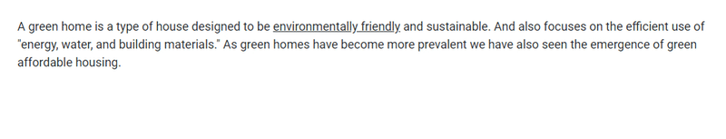

# Setting Dimension in Blazor Tooltip Component

## Height and width

The Tooltip can either be assigned with auto height and width values or specific pixel values. The [`Width`](https://help.syncfusion.com/cr/blazor/Syncfusion.Blazor.Popups.SfTooltip.html#Syncfusion_Blazor_Popups_SfTooltip_Width) and [`Height`](https://help.syncfusion.com/cr/blazor/Syncfusion.Blazor.Popups.SfTooltip.html#Syncfusion_Blazor_Popups_SfTooltip_Height) properties are used to set the outer dimension of the Tooltip element. The default value for both the properties is `auto`. It also accepts string and number values in pixels.


```cshtml
@using Syncfusion.Blazor.Popups
@using Syncfusion.Blazor.Buttons

<SfTooltip ID="Tooltip" Height="50px" Width="200px" Target="#btn" Content="@Content">
    <SfButton ID="btn" Content="Show Tooltip"></SfButton>
</SfTooltip>

@code
{
    string Content="Lets go green & Save Earth !!";
}
```


### Scroll mode

When [`Height`](https://help.syncfusion.com/cr/blazor/Syncfusion.Blazor.Popups.SfTooltip.html#Syncfusion_Blazor_Popups_SfTooltip_Height) is specified with a certain pixel value and the Tooltip content overflows, the scrolling mode gets enabled.

```cshtml
@using Syncfusion.Blazor.Popups

<SfTooltip ID="tooltip" Height="60px" Width="200px" IsSticky="true" Target="#target" Content="@Content">
    <div id='container'>
        <p>
            A green home is a type of house designed to be
            <a id="target">
                <u>environmentally friendly</u>
            </a> and sustainable. And also focuses on the efficient use of "energy, water, and building materials." As green homes
            have become more prevalent we have also seen the emergence of green affordable housing.
        </p>
    </div>
</SfTooltip>

@code
{
    string Content = "<div><b>Environmentally friendly</b> or environment-friendly, (also referred to as eco-friendly, nature-friendly, and green) are marketing and sustainability terms referring to goods and services, laws, guidelines and policies that inflict reduced, minimal, or no harm upon ecosystems or the environment.</div>";
}
```



N> The scrolling mode can best be seen when the sticky mode of the Tooltip is enabled. To enable sticky mode, set the [`IsSticky`](https://help.syncfusion.com/cr/blazor/Syncfusion.Blazor.Popups.SfTooltip.html#Syncfusion_Blazor_Popups_SfTooltip_IsSticky) property to true.