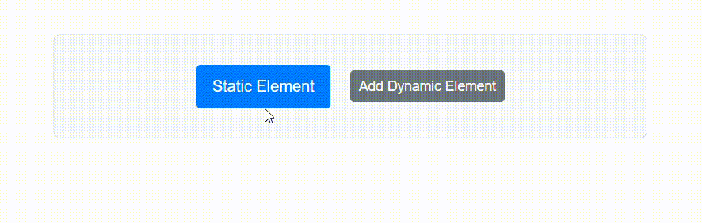

# Configure target and container selectors in Blazor Tooltip

The [`Target`](https://help.syncfusion.com/cr/blazor/Syncfusion.Blazor.Popups.SfTooltip.html#Syncfusion_Blazor_Popups_SfTooltip_Target) property accepts a CSS selector that identifies the elements the tooltip should attach to. Matching elements display a tooltip based on user interactions such as hover, focus, or click, depending on the configured `OpensOn` setting.

```cshtml
<SfTooltip Content="Let's go green to save the planet!!" Target="#btn" >
 <SfButton ID="btn" Content="Show Tooltip"></SfButton>
</SfTooltip>
```


## Displaying Tooltip for dynamically created target element

Tooltips can be shown for elements that are added to the DOM after the initial render. This is useful when targets are rendered dynamically in response to user actions, API results, or conditional logic.

Set the [`TargetContainer`](https://help.syncfusion.com/cr/blazor/Syncfusion.Blazor.Popups.SfTooltip.html#Syncfusion_Blazor_Popups_SfTooltip_TargetContainer) property to a CSS selector that scopes where target discovery occurs. All descendants of this container that match the `Target` selector will automatically display tooltips, including elements added after the component is rendered—no additional configuration is required. Interactions follow the configured `OpensOn` behavior. For keyboard accessibility, ensure targets are focusable when relying on focus or click.

```cshtml
@using Syncfusion.Blazor.Popups
@using Syncfusion.Blazor.Buttons

<SfTooltip ID="BasicTooltip" Target="[title]" TargetContainer=".tooltip-container">
</SfTooltip>
<div class="tooltip-container">
        <span title="Static tooltip">Static Element</span>
        <SfButton @onclick="AddElement">Add Dynamic Element<SfButton>
        @if (ShowElement)
        {
            <span title="Dynamic tooltip">Dynamic Element</span>
        }
</div>

@code {
    private bool ShowElement = false;
    
    private void AddElement()
    {
        ShowElement = true;
    }
}
```

The [`TargetContainer`](https://help.syncfusion.com/cr/blazor/Syncfusion.Blazor.Popups.SfTooltip.html#Syncfusion_Blazor_Popups_SfTooltip_TargetContainer) property enables automatic tooltip registration for newly added elements within the specified container, improving interactivity in dynamic content scenarios.

