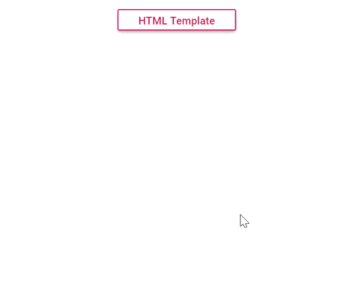

# Tooltip template

Tooltip Template property can be used to customize the tooltip layout or to add any custom elements within the tooltip. You can add any content or HTML elements as tooltip content by specifying them in the `<content>` tag of the tooltip templates.

Refer to the following code example to add and display a HTML page to the Tooltip.

```csharp
@using Syncfusion.Blazor.Buttons;
@using Syncfusion.Blazor.Popups;

<SfTooltip CssClass="e-tooltip-css" OpensOn="Click" Target="#btn">
    <TooltipTemplates>
        <Content>
            <div id='democontent' class='democontent'>
                <div class='info'>
                    <h3 style='margin-top:10px'>Eastern Bluebird <hr style='margin-top:10px'></h3>
                    <div style='margin-top: -10px'>
                        <div style='float:left;width:57%'>
                            The<a href='https://en.wikipedia.org/wiki/Eastern_bluebird' target='blank'> Eastern Bluebird</a>
                            is easily found in open fields and sparse woodland areas, including along woodland edges.These are<i>cavity-nesting birds</i>and a pair of eastern bluebirds will raise 2-3 broods annually, with 2-8 light blue or whitish eggs per brood.
                        </div>
                        <div id='bird' style='float:right;width:42%'></div>
                    </div>
                    <div style='margin-top:160px'>
                        <hr><p style='margin-top:-11px'> Eastern bluebirds can be very vocal in flocks.Their calls include a rapid, mid-tone chatter and several long dropping pitch calls.</p>
                    </div><p>Source:<br /><a href='https://en.wikipedia.org/wiki/Eastern_bluebird' target='_blank'>https://en.wikipedia.org/wiki/Eastern_bluebird</a></p>
                </div>
            </div>
        </Content>
    </TooltipTemplates>
    <SfButton ID="btn" CssClass="e-outline text" IsPrimary="true" Content="HTML Template"></SfButton>
</SfTooltip>

<style>
    .e-tooltip-css {
        filter: drop-shadow(2px 5px 5px rgba(0, 0, 0, 0.25));
    }
    .text {
        text-transform: capitalize;
        width: 155px;
    }
    .democontent {
        border: 0.5px solid grey;
    }
    #bird {
        padding-top: 4px;
    }
    .info a {
        color: #2FA1E3;
    }
    .info {
        padding-left: 12px;
        padding-right: 5px;
    }
</style>
```

Output be like the below.

