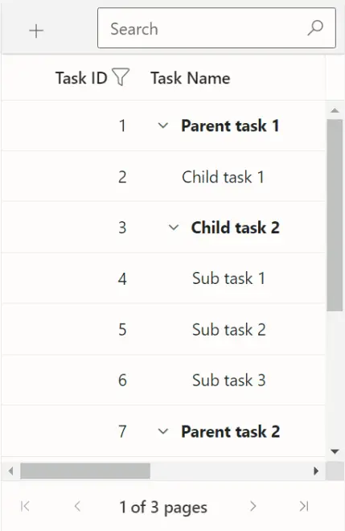

# Adaptive UI Layout in Blazor TreeGrid 

The TreeGrid user interface (UI) was redesigned to provide an optimal viewing experience and improve usability on small screens. This interface renders the filter, sort, and edit dialogs adaptively and allows rendering the TreeGrid row elements in the vertical direction.

## Render adaptive dialog

To render adaptive dialog UI in the TreeGrid, set the [EnableAdaptiveUI](https://help.syncfusion.com/cr/blazor/Syncfusion.Blazor.TreeGrid.SfTreeGrid-1.html#Syncfusion_Blazor_TreeGrid_SfTreeGrid_1_EnableAdaptiveUI) property to true. The TreeGrid will render the filter, sort, and edit dialogs in full screen for a better user experience.

```csharp

@using Syncfusion.Blazor.TreeGrid
@using Syncfusion.Blazor.Grids

<div class="col-lg-12 control-section">
   <div class="content-wrapper">
      <div class="row">
         <div class="content-wrapper e-bigger e-adaptive-demo">
            <div class="e-mobile-layout">
               <div class="e-mobile-content">
                        <SfTreeGrid DataSource="@TreeData" AllowSorting="true" AllowFiltering="true" IdMapping="TaskID" ParentIdMapping="ParentID" TreeColumnIndex="1" EnableAdaptiveUI="true" Toolbar="@(new List<string>() { "Add", "Edit", "Delete", "Cancel", "Update", "Search" })" Height="100%" Width="100%" AllowPaging="true">
                            <TreeGridFilterSettings Type="@Syncfusion.Blazor.TreeGrid.FilterType.Excel"></TreeGridFilterSettings>
                            <TreeGridPageSettings PageSize="2" PageSizeMode="PageSizeMode.Root" ></TreeGridPageSettings>
                            <TreeGridEditSettings AllowAdding="true" AllowEditing="true" AllowDeleting="true" Mode="Syncfusion.Blazor.TreeGrid.EditMode.Dialog"></TreeGridEditSettings>
                            <TreeGridColumns>
                                <TreeGridColumn Field="TaskID" HeaderText="Task ID" IsPrimaryKey="true" Width="135" ValidationRules="@(new ValidationRules() { Required = true, Number = true })" TextAlign="TextAlign.Right"></TreeGridColumn>
                                <TreeGridColumn Field="TaskName" HeaderText="Task Name" Width="280" ValidationRules="@(new ValidationRules() { Required = true })" TextAlign="TextAlign.Left"></TreeGridColumn>
                                <TreeGridColumn Field="Duration" HeaderText="Duration" Width="140" TextAlign="TextAlign.Right"></TreeGridColumn>
                                <TreeGridColumn Field="Progress" HeaderText="Progress" Width="145" EditType="Syncfusion.Blazor.Grids.EditType.DropDownEdit"></TreeGridColumn>
                            </TreeGridColumns>
                        </SfTreeGrid>
                    </div>
                </div>
            </div>
        </div>
    </div>
</div>

@code{

    private List<SelfReferenceData> TreeData { get; set; }

    protected override void OnInitialized()
    {
        this.TreeData = SelfReferenceData.GetTree().Take(30).ToList();
    }
    public class SelfReferenceData
    {
        public static List<SelfReferenceData> tree = new List<SelfReferenceData>();
        public int TaskID { get; set; }
        public string TaskName { get; set; }
        public DateTime StartDate { get; set; }
        public String Progress { get; set; }
        public int Duration { get; set; }
        public int? ParentID { get; set; }
        public SelfReferenceData() { }

        public static List<SelfReferenceData> GetTree()
        {
            if (tree.Count == 0)
            {
                int root = -1;
                for (var t = 1; t <= 60; t++)
                {
                    Random ran = new Random();
                    string math = (ran.Next() % 3) == 0 ? "High" : (ran.Next() % 2) == 0 ? "Release Breaker" : "Critical";
                    string progr = (ran.Next() % 3) == 0 ? "Started" : (ran.Next() % 2) == 0 ? "Open" : "In Progress";
                    root++;
                    int rootItem = tree.Count + root + 1;
                    tree.Add(new SelfReferenceData() { TaskID = rootItem, TaskName = "Parent Task " + rootItem.ToString(), StartDate = new DateTime(1992, 06, 07), ParentID = null, Progress = progr, Duration = ran.Next(1, 50) });
                    int parent = tree.Count;
                    for (var c = 0; c < 10; c++)
                    {
                        root++;
                        string val = ((parent + c + 1) % 3 == 0) ? "Low" : "Critical";
                        int parn = parent + c + 1;
                        progr = (ran.Next() % 3) == 0 ? "In Progress" : (ran.Next() % 2) == 0 ? "Open" : "Validated";
                        int iD = tree.Count + root + 1;
                        tree.Add(new SelfReferenceData() { TaskID = iD, TaskName = "Child Task " + iD.ToString(), StartDate = new DateTime(1992, 06, 07), ParentID = rootItem, Progress = progr, Duration = ran.Next(1, 50) });
                        if ((((parent + c + 1) % 3) == 0))
                        {
                            int immParent = tree.Count;
                            for (var s = 0; s < 3; s++)
                            {
                                root++;
                                string Prior = (immParent % 2 == 0) ? "Validated" : "Normal";
                                tree.Add(new SelfReferenceData() { TaskID = tree.Count + root + 1, TaskName = "Sub Task " + (tree.Count + root + 1).ToString(), StartDate = new DateTime(1992, 06, 07), ParentID = iD, Progress = (immParent % 2 == 0) ? "On Progress" : "Closed", Duration = ran.Next(1, 50) });
                            }
                        }
                    }
                }
            }
            return tree;
        }
    }
}

```


