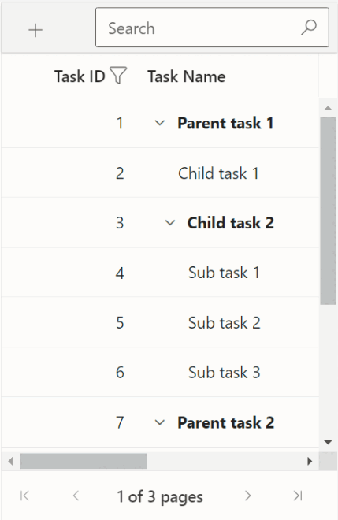

# Adaptive UI Layout in Syncfusion Blazor TreeGrid Component

The TreeGrid user interface (UI) is designed to provide an optimal viewing experience and enhance usability on small screens. It renders filter, sort, and edit dialogs adaptively and includes an option to display TreeGrid row elements in a vertical layout.

## Render Adaptive Dialog

To enable adaptive dialog UI in the TreeGrid, set the [EnableAdaptiveUI](https://help.syncfusion.com/cr/blazor/Syncfusion.Blazor.TreeGrid.SfTreeGrid-1.html#Syncfusion_Blazor_TreeGrid_SfTreeGrid_1_EnableAdaptiveUI) property to `true`.renders the filter, sort, and edit dialogs in full screen for improved accessibility and interaction.

```csharp

@using Syncfusion.Blazor.TreeGrid
@using Syncfusion.Blazor.Grids

<div class="col-lg-12 control-section">
   <div class="content-wrapper">
      <div class="row">
         <div class="content-wrapper e-bigger e-adaptive-demo">
            <div class="e-mobile-layout">
               <div class="e-mobile-content">
                        <SfTreeGrid DataSource="@TreeData" AllowSorting="true" AllowFiltering="true" IdMapping="TaskID" ParentIdMapping="ParentID" TreeColumnIndex="1" EnableAdaptiveUI="true" Toolbar="@(new List<string>() { "Add", "Edit", "Delete", "Cancel", "Update", "Search" })" Height="100%" Width="100%" AllowPaging="true">
                            <TreeGridFilterSettings Type="@Syncfusion.Blazor.TreeGrid.FilterType.Excel"></TreeGridFilterSettings>
                            <TreeGridPageSettings PageSize="2" PageSizeMode="PageSizeMode.Root" ></TreeGridPageSettings>
                            <TreeGridEditSettings AllowAdding="true" AllowEditing="true" AllowDeleting="true" Mode="Syncfusion.Blazor.TreeGrid.EditMode.Dialog"></TreeGridEditSettings>
                            <TreeGridColumns>
                                <TreeGridColumn Field="TaskID" HeaderText="Task ID" IsPrimaryKey="true" Width="135" ValidationRules="@(new ValidationRules() { Required = true, Number = true })" TextAlign="TextAlign.Right"></TreeGridColumn>
                                <TreeGridColumn Field="TaskName" HeaderText="Task Name" Width="280" ValidationRules="@(new ValidationRules() { Required = true })" TextAlign="TextAlign.Left"></TreeGridColumn>
                                <TreeGridColumn Field="Duration" HeaderText="Duration" Width="140" TextAlign="TextAlign.Right"></TreeGridColumn>
                                <TreeGridColumn Field="Progress" HeaderText="Progress" Width="145" EditType="Syncfusion.Blazor.Grids.EditType.DropDownEdit"></TreeGridColumn>
                            </TreeGridColumns>
                        </SfTreeGrid>
                    </div>
                </div>
            </div>
        </div>
    </div>
</div>

@code{

    private List<SelfReferenceData> TreeData { get; set; }

    protected override void OnInitialized()
    {
        this.TreeData = SelfReferenceData.GetTree().Take(30).ToList();
    }
}

```


