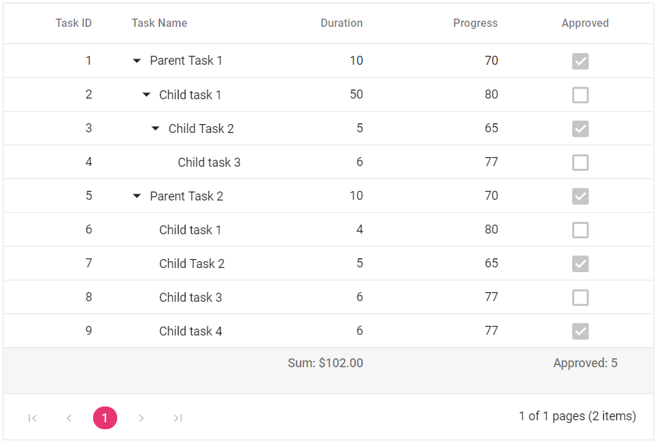
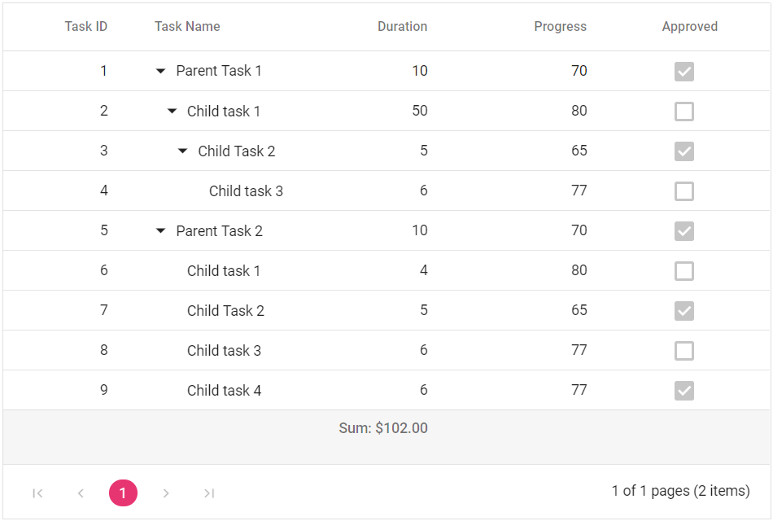

# Aggregate in Blazor TreeGrid Component

To know about Aggregate in Blazor tree grid Component, you can check this video.



Aggregate values are displayed in the Tree Grid footer and in parent row footer for child row aggregate values. It can be configured through [TreeGridAggregateColumn](https://help.syncfusion.com/cr/blazor/Syncfusion.Blazor.TreeGrid.TreeGridAggregateColumn.html) property. The [Field](https://help.syncfusion.com/cr/blazor/Syncfusion.Blazor.TreeGrid.TreeGridAggregateColumn.html#Syncfusion_Blazor_TreeGrid_TreeGridAggregateColumn_Field) and [Type](https://help.syncfusion.com/cr/blazor/Syncfusion.Blazor.TreeGrid.TreeGridAggregateColumn.html#Syncfusion_Blazor_TreeGrid_TreeGridAggregateColumn_Type) are the minimum properties required to represent an aggregate column.

By default, the aggregate value can be displayed in the Tree Grid footer, and footer of child rows. To show the aggregate value in one of the cells, use the [FooterTemplate](https://help.syncfusion.com/cr/blazor/Syncfusion.Blazor.TreeGrid.TreeGridAggregateColumn.html#Syncfusion_Blazor_TreeGrid_TreeGridAggregateColumn_FooterTemplate).

## Built-in aggregate types

The aggregate type should be specified in the [Type](https://help.syncfusion.com/cr/blazor/Syncfusion.Blazor.TreeGrid.TreeGridAggregateColumn.html#Syncfusion_Blazor_TreeGrid_TreeGridAggregateColumn_Type) property to configure an aggregate column.

The built-in aggregates are,
* Sum
* Average
* Min
* Max
* Count
* Truecount
* Falsecount

## Footer aggregate

Footer aggregate value is calculated for all the rows, and it is displayed in the footer cells. Use the [FooterTemplate](https://help.syncfusion.com/cr/blazor/Syncfusion.Blazor.TreeGrid.TreeGridAggregateColumn.html#Syncfusion_Blazor_TreeGrid_TreeGridAggregateColumn_FooterTemplate) to render the aggregate value in footer cells.





@using TreeGridComponent.Data;
@using Syncfusion.Blazor.TreeGrid;

<SfTreeGrid DataSource="@TreeGridData" IdMapping="TaskId" ParentIdMapping="ParentId" AllowPaging="true" TreeColumnIndex="1">
    <TreeGridAggregates>
        <TreeGridAggregate ShowChildSummary="false">
            <TreeGridAggregateColumns>
                <TreeGridAggregateColumn Field="Duration" Type="Syncfusion.Blazor.Grids.AggregateType.Sum" Format="C2">
                    <FooterTemplate>
                        @{
                            var sumvalue = (context as Syncfusion.Blazor.Grids.AggregateTemplateContext);
                            

                                
Sum: @sumvalue.Sum

                            

                        }
                    </FooterTemplate>
                </TreeGridAggregateColumn>
                <TreeGridAggregateColumn Field="Approved" Type="Syncfusion.Blazor.Grids.AggregateType.TrueCount" Format="C2">
                    <FooterTemplate>
                        @{
                            var truecount = (context as Syncfusion.Blazor.Grids.AggregateTemplateContext);
                            

                                
Approved: @truecount.TrueCount

                            

                        }
                    </FooterTemplate>
                </TreeGridAggregateColumn>              
            </TreeGridAggregateColumns>
        </TreeGridAggregate>
    </TreeGridAggregates>
    <TreeGridColumns>
        <TreeGridColumn Field="TaskId" HeaderText="Task ID" Width="80" TextAlign="Syncfusion.Blazor.Grids.TextAlign.Right"></TreeGridColumn>
        <TreeGridColumn Field="TaskName" HeaderText="Task Name" Width="100"></TreeGridColumn>
        <TreeGridColumn Field="Duration" HeaderText="Duration" Width="100" TextAlign="Syncfusion.Blazor.Grids.TextAlign.Right"></TreeGridColumn>
        <TreeGridColumn Field="Progress" HeaderText="Progress" Width="100" TextAlign="Syncfusion.Blazor.Grids.TextAlign.Right"></TreeGridColumn>
        <TreeGridColumn Field="Approved" HeaderText="Approved" TextAlign="Syncfusion.Blazor.Grids.TextAlign.Center" DisplayAsCheckBox="true" Width="100">
        </TreeGridColumn>
    </TreeGridColumns>
</SfTreeGrid>

@code{
    public List<TreeData> TreeGridData { get; set; }

    public Syncfusion.Blazor.Grids.AggregateTemplateContext model = new Syncfusion.Blazor.Grids.AggregateTemplateContext();

    protected override void OnInitialized()
    {
        this.TreeGridData = TreeData.GetSelfDataSource().ToList();
    }
}





namespace TreeGridComponent.Data {

 public class TreeData
    {     
            public int TaskId { get; set; }
            public string TaskName { get; set; }
            public DateTime? StartDate { get; set; }
            public int? Duration { get; set; }
            public int? Progress { get; set; }
            public bool Approved { get; set; }
            public int? ParentId { get; set; }
        
        public static List<TreeData> GetSelfDataSource()
        {
            List<TreeData> TreeDataCollection = new List<TreeData>();
            TreeDataCollection.Add(new TreeData() { TaskId = 1, TaskName = "Parent Task 1", Duration = 10, Progress = 70, Approved = true, ParentId = null });
            TreeDataCollection.Add(new TreeData() { TaskId = 2, TaskName = "Child task 1", Duration = 4, Progress = 80, Approved = false, Duration = 50, ParentId = 1 });
            TreeDataCollection.Add(new TreeData() { TaskId = 3, TaskName = "Child Task 2", Duration = 5, Progress = 65, Approved = true, ParentId = 2 });
            TreeDataCollection.Add(new TreeData() { TaskId = 4, TaskName = "Child task 3", Duration = 6, Approved = false, Progress = 77, ParentId = 3 });
            TreeDataCollection.Add(new TreeData() { TaskId = 5, TaskName = "Parent Task 2", Duration = 10, Progress = 70, Approved = true, ParentId = null });
            TreeDataCollection.Add(new TreeData() { TaskId = 6, TaskName = "Child task 1", Duration = 4, Progress = 80, Approved = false, ParentId = 5 });
            TreeDataCollection.Add(new TreeData() { TaskId = 7, TaskName = "Child Task 2", Duration = 5, Progress = 65, Approved = true, ParentId = 5 });
            TreeDataCollection.Add(new TreeData() { TaskId = 8, TaskName = "Child task 3", Duration = 6, Progress = 77, Approved = false, ParentId = 5 });
            TreeDataCollection.Add(new TreeData() { TaskId = 9, TaskName = "Child task 4", Duration = 6, Progress = 77, Approved = true, ParentId = 5 });
            return TreeDataCollection;
        }
    }
}





N> The aggregate values must be accessed inside the template using their corresponding `AggregateType`.

## How to format aggregate value

The aggregate value result can be formatted by using the [Format](https://help.syncfusion.com/cr/blazor/Syncfusion.Blazor.TreeGrid.TreeGridAggregateColumn.html#Syncfusion_Blazor_TreeGrid_TreeGridAggregateColumn_Format) property.





@using TreeGridComponent.Data;
@using Syncfusion.Blazor.TreeGrid;

<SfTreeGrid DataSource="@TreeGridData" IdMapping="TaskId" ParentIdMapping="ParentId" AllowPaging="true" TreeColumnIndex="1">
    <TreeGridAggregates>
        <TreeGridAggregate ShowChildSummary="false">
            <TreeGridAggregateColumns>
                <TreeGridAggregateColumn Field="Duration" Type="Syncfusion.Blazor.Grids.AggregateType.Sum" Format="C2">
                    <FooterTemplate>
                        @{
                            var sumvalue = (context as Syncfusion.Blazor.Grids.AggregateTemplateContext);
                            

                                
Sum: @sumvalue.Sum

                            

                        }
                    </FooterTemplate>
                </TreeGridAggregateColumn>                            
            </TreeGridAggregateColumns>
        </TreeGridAggregate>
    </TreeGridAggregates>
    <TreeGridColumns>
        <TreeGridColumn Field="TaskId" HeaderText="Task ID" Width="80" TextAlign="Syncfusion.Blazor.Grids.TextAlign.Right"></TreeGridColumn>
        <TreeGridColumn Field="TaskName" HeaderText="Task Name" Width="100"></TreeGridColumn>
        <TreeGridColumn Field="Duration" HeaderText="Duration" Width="100" TextAlign="Syncfusion.Blazor.Grids.TextAlign.Right"></TreeGridColumn>
        <TreeGridColumn Field="Progress" HeaderText="Progress" Width="100" TextAlign="Syncfusion.Blazor.Grids.TextAlign.Right"></TreeGridColumn>
        <TreeGridColumn Field="Approved" HeaderText="Approved" TextAlign="Syncfusion.Blazor.Grids.TextAlign.Center" DisplayAsCheckBox="true" Width="100">
        </TreeGridColumn>
    </TreeGridColumns>
</SfTreeGrid>

@code{
    public List<TreeData> TreeGridData { get; set; }

    public Syncfusion.Blazor.Grids.AggregateTemplateContext model = new Syncfusion.Blazor.Grids.AggregateTemplateContext();

    protected override void OnInitialized()
    {
        this.TreeGridData = TreeData.GetSelfDataSource().ToList();
    }
}





namespace TreeGridComponent.Data {

 public class TreeData
    {     
            public int TaskId { get; set; }
            public string TaskName { get; set; }
            public DateTime? StartDate { get; set; }
            public int? Duration { get; set; }
            public int? Progress { get; set; }
            public bool Approved { get; set; }
            public int? ParentId { get; set; }
        
        public static List<TreeData> GetSelfDataSource()
        {
            List<TreeData> TreeDataCollection = new List<TreeData>();
            TreeDataCollection.Add(new TreeData() { TaskId = 1, TaskName = "Parent Task 1", Duration = 10, Progress = 70, Approved = true, ParentId = null });
            TreeDataCollection.Add(new TreeData() { TaskId = 2, TaskName = "Child task 1",Duration = 4, Progress = 80, Approved = false, Duration = 50, ParentId = 1 });
            TreeDataCollection.Add(new TreeData() { TaskId = 3, TaskName = "Child Task 2", Duration = 5, Progress = 65, Approved = true, ParentId = 2 });
            TreeDataCollection.Add(new TreeData() { TaskId = 4, TaskName = "Child task 3", Duration = 6, Approved = false, Progress = 77, ParentId = 3 });
            TreeDataCollection.Add(new TreeData() { TaskId = 5, TaskName = "Parent Task 2", Duration = 10, Progress = 70, Approved = true, ParentId = null });
            TreeDataCollection.Add(new TreeData() { TaskId = 6, TaskName = "Child task 1", Duration = 4, Progress = 80, Approved = false, ParentId = 5 });
            TreeDataCollection.Add(new TreeData() { TaskId = 7, TaskName = "Child Task 2", Duration = 5, Progress = 65, Approved = true, ParentId = 5 });
            TreeDataCollection.Add(new TreeData() { TaskId = 8, TaskName = "Child task 3", Duration = 6, Progress = 77, Approved = false, ParentId = 5 });
            TreeDataCollection.Add(new TreeData() { TaskId = 9, TaskName = "Child task 4", Duration = 6, Progress = 77, Approved = true, ParentId = 5 });
            return TreeDataCollection;
        }
    }
}





<!-- Custom aggregate

To calculate the aggregate value with your own aggregate functions, use the custom aggregate option. To use custom aggregation, specify the [`Type`](https://help.syncfusion.com/cr/blazor/Syncfusion.Blazor.TreeGrid.TreeGridAggregateColumn.html#Syncfusion_Blazor_TreeGrid_TreeGridAggregateColumn_Type) as `Custom`, and provide the custom aggregate function in the [`CustomAggregate`](https://help.syncfusion.com/cr/blazor/Syncfusion.Blazor.TreeGrid.TreeGridAggregateColumn.html) property.

> To access the custom aggregate value inside the template, use the key as `Custom`.

-->

## Limitations

* By default, Footer Aggregate or total aggregate will be shown only for the current page records and not for the dataSource. To aggregate for all page records, set adaptor in **SfDataManager**.