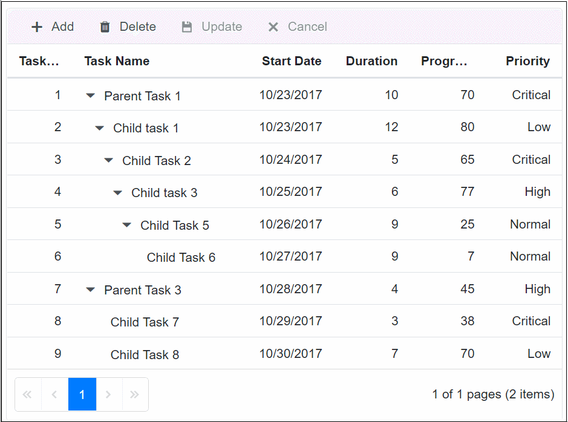

# AutoFill in Blazor TreeGrid Component

The AutoFill feature enables copying data from selected cells and pasting it into other cells by dragging the autofill icon across the desired range. This functionality is activated by setting the [EnableAutoFill](https://help.syncfusion.com/cr/blazor/Syncfusion.Blazor.TreeGrid.SfTreeGrid-1.html#Syncfusion_Blazor_TreeGrid_SfTreeGrid_1_EnableAutoFill) property to `true`.





@using TreeGridComponent.Data;
@using Syncfusion.Blazor.TreeGrid;

<SfTreeGrid DataSource="TreeData" IdMapping="TaskId" ParentIdMapping="ParentId" EnableAutoFill="true" TreeColumnIndex="1" AllowPaging="true" 
Toolbar="@(new List<string>() { "Add", "Delete", "Update", "Cancel" })">
    <TreeGridPageSettings PageSize="2"></TreeGridPageSettings>
    <TreeGridSelectionSettings Type="Syncfusion.Blazor.Grids.SelectionType.Multiple"
    Mode="Syncfusion.Blazor.Grids.SelectionMode.Cell" 
    CellSelectionMode="Syncfusion.Blazor.Grids.CellSelectionMode.Box">
    </TreeGridSelectionSettings>
    <TreeGridEditSettings AllowAdding="true" AllowEditing="true" 
    AllowDeleting="true" Mode="Syncfusion.Blazor.TreeGrid.EditMode.Batch">
    </TreeGridEditSettings>
    <TreeGridColumns>
        <TreeGridColumn Field="TaskId" HeaderText="Task ID" Width="60"
        IsPrimaryKey="true" TextAlign="Syncfusion.Blazor.Grids.TextAlign.Right">
        </TreeGridColumn>
        <TreeGridColumn Field="TaskName" HeaderText="Task Name" Width="155">
        </TreeGridColumn>
        <TreeGridColumn Field="StartDate" HeaderText="Start Date" Format="d" Type=Syncfusion.Blazor.Grids.ColumnType.Date Width="85" 
        TextAlign="Syncfusion.Blazor.Grids.TextAlign.Right" 
        EditType=Syncfusion.Blazor.Grids.EditType.DatePickerEdit>
        </TreeGridColumn>
        <TreeGridColumn Field="Duration" HeaderText="Duration" Width="70" TextAlign="Syncfusion.Blazor.Grids.TextAlign.Right">
        </TreeGridColumn>
        <TreeGridColumn Field="Progress" HeaderText="Progress" Width="70" TextAlign="Syncfusion.Blazor.Grids.TextAlign.Right">
        </TreeGridColumn>
        <TreeGridColumn Field="Priority" HeaderText="Priority" Width="70" TextAlign="Syncfusion.Blazor.Grids.TextAlign.Right">
        </TreeGridColumn>
    </TreeGridColumns>
</SfTreeGrid>

@code {
    public List<BusinessObject> TreeData { get; set; }
    protected override void OnInitialized()
    {
        this.TreeData = BusinessObject.GetSelfDataSource().ToList();
    }
}





namespace TreeGridComponent.Data {
        public class BusinessObject
        {
            public int TaskId { get; set;}
            public string TaskName { get; set;}
            public DateTime? StartDate { get; set;}
            public int? Duration { get; set;}
            public int? Progress { get; set;}
            public string Priority { get; set;}
            public int? ParentId { get; set;}

        public static List<BusinessObject> GetSelfDataSource()
        {
            List<BusinessObject> BusinessObjectCollection = new List<BusinessObject>();
            BusinessObjectCollection.Add(new BusinessObject() { TaskId = 1,TaskName = "Parent Task 1",StartDate = new DateTime(2017, 10, 23),Duration = 10,Progress = 70,Priority = "Critical",ParentId = null });
            BusinessObjectCollection.Add(new BusinessObject() { TaskId = 2,TaskName = "Child task 1",StartDate = new DateTime(2017, 10, 23),Duration = 12,Progress = 80,Priority = "Low",ParentId = 1 });
            BusinessObjectCollection.Add(new BusinessObject() { TaskId = 3,TaskName = "Child Task 2",StartDate = new DateTime(2017, 10, 24),Duration = 5,Progress = 65,Priority = "Critical",ParentId = 2 });
            BusinessObjectCollection.Add(new BusinessObject() { TaskId = 4,TaskName = "Child task 3",StartDate = new DateTime(2017, 10, 25),Duration = 6,Priority = "High",Progress = 77,ParentId = 3 });
            BusinessObjectCollection.Add(new BusinessObject() { TaskId = 5, TaskName = "Child Task 5",StartDate = new DateTime(2017, 10, 26), Duration = 9, Progress = 25, ParentId = 4, Priority = "Normal" });
            BusinessObjectCollection.Add(new BusinessObject() { TaskId = 6, TaskName = "Child Task 6",StartDate = new DateTime(2017, 10, 27), Duration = 9, Progress = 7, ParentId = 5, Priority = "Normal" });
            BusinessObjectCollection.Add(new BusinessObject() { TaskId = 7, TaskName = "Parent Task 3",StartDate = new DateTime(2017, 10, 28), Duration = 4, Progress = 45, ParentId = null, Priority = "High" });
            BusinessObjectCollection.Add(new BusinessObject() { TaskId = 8, TaskName = "Child Task 7",StartDate = new DateTime(2017, 10, 29), Duration = 3, Progress = 38, ParentId = 7, Priority = "Critical" });
            BusinessObjectCollection.Add(new BusinessObject() { TaskId = 9, TaskName = "Child Task 8",StartDate = new DateTime(2017, 10, 30), Duration = 7, Progress = 70, ParentId = 7, Priority = "Low" });
            return BusinessObjectCollection;
        }
    }

}





N> *If [EnableAutoFill](https://help.syncfusion.com/cr/blazor/Syncfusion.Blazor.TreeGrid.SfTreeGrid-1.html#Syncfusion_Blazor_TreeGrid_SfTreeGrid_1_EnableAutoFill) is set to `true`, the autofill icon will appear on cell selection to copy cells.  
  * It requires the selection [Mode](https://help.syncfusion.com/cr/blazor/Syncfusion.Blazor.TreeGrid.TreeGridSelectionSettings.html#Syncfusion_Blazor_TreeGrid_TreeGridSelectionSettings_Mode) to be `Cell`, [CellSelectionMode](https://help.syncfusion.com/cr/blazor/Syncfusion.Blazor.TreeGrid.TreeGridSelectionSettings.html#Syncfusion_Blazor_TreeGrid_TreeGridSelectionSettings_CellSelectionMode) to be `Box`, and batch editing must be enabled.

The following GIF demonstrates the TreeGrid with AutoFill functionality:

## Limitations of AutoFill

* String values are not parsed into number or date types. When string-type cells are dragged into number-type cells, the result will be **NaN**. For date-type cells, the result will be an **empty cell**.
* Linear series and sequential data generation are not supported in this feature.
