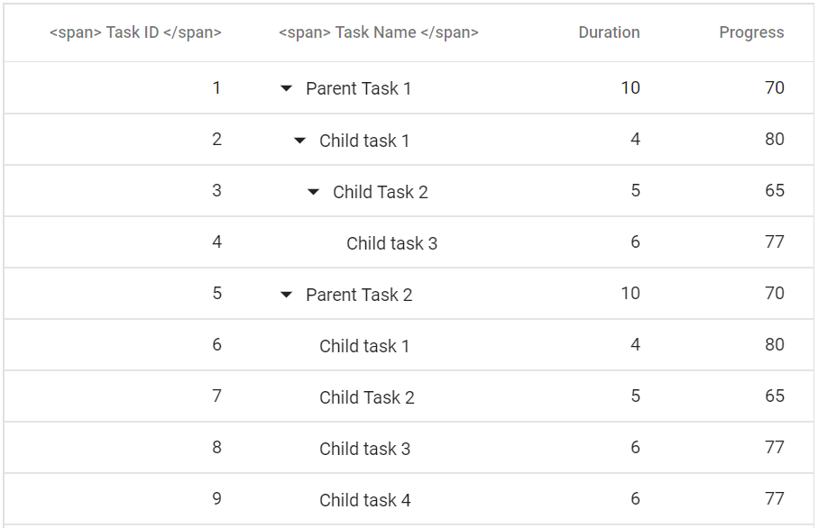
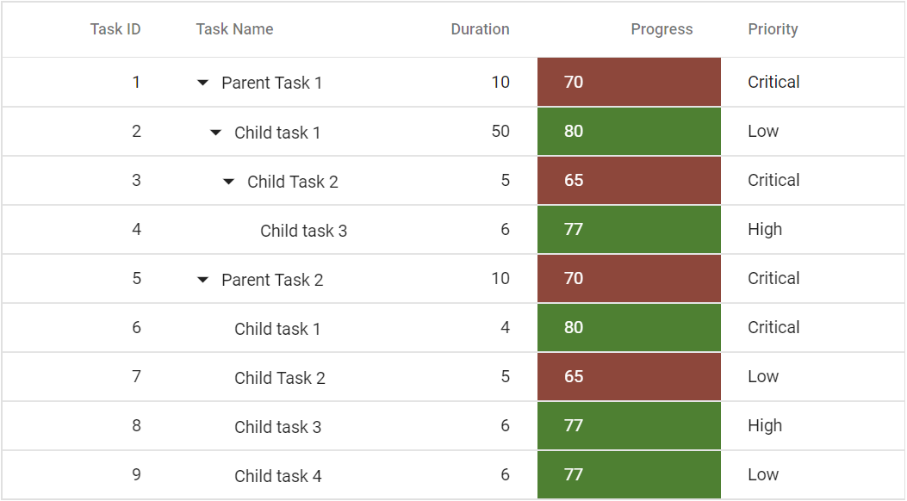
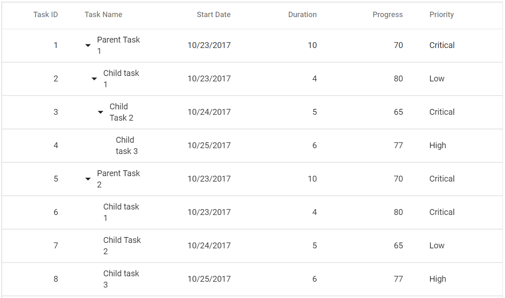

# Cell in Syncfusion Blazor TreeGrid Component

## Displaying HTML Content

HTML tags can be rendered in the TreeGrid header and content by enabling the [DisableHtmlEncode](https://help.syncfusion.com/cr/blazor/Syncfusion.Blazor.TreeGrid.TreeGridColumn.html#Syncfusion_Blazor_TreeGrid_TreeGridColumn_DisableHtmlEncode) property.





@using TreeGridComponent.Data
@using Syncfusion.Blazor.TreeGrid;

<SfTreeGrid IdMapping="TaskId" DataSource="@TreeGridData" ParentIdMapping="ParentId" TreeColumnIndex="1">
    <TreeGridColumns>
        <TreeGridColumn Field="TaskId" HeaderText=" Task ID " Width="80" TextAlign="Syncfusion.Blazor.Grids.TextAlign.Right"></TreeGridColumn>
        <TreeGridColumn Field="TaskName" HeaderText=" Task Name " Width="160"></TreeGridColumn>
        <TreeGridColumn Field="Duration" HeaderText=" Duration " DisableHtmlEncode="false" Width="100" TextAlign="Syncfusion.Blazor.Grids.TextAlign.Right"></TreeGridColumn>
        <TreeGridColumn Field="Progress" HeaderText=" Progress " DisableHtmlEncode="false" Width="100" TextAlign="Syncfusion.Blazor.Grids.TextAlign.Right"></TreeGridColumn>
    </TreeGridColumns>
</SfTreeGrid>

@code{
    public List<TreeData.BusinessObject> TreeGridData { get; set; }
    protected override void OnInitialized()
    {
        this.TreeGridData = TreeData.GetSelfDataSource().ToList();
    }
}





namespace TreeGridComponent.Data {

public class TreeData
    {
        public class BusinessObject
        {
            public int TaskId { get; set;}
            public string TaskName { get; set;}
            public DateTime? StartDate { get; set;}
            public int? Duration { get; set;}
            public int? Progress { get; set;}
            public int? ParentId { get; set;}
        }

        public static List<BusinessObject> GetSelfDataSource()
        {
            List<BusinessObject> BusinessObjectCollection = new List<BusinessObject>();
            BusinessObjectCollection.Add(new BusinessObject() { TaskId = 1,TaskName = "Parent Task 1",StartDate = new DateTime(2017, 10, 23),Duration = 10,Progress = 70,ParentId = null });
            BusinessObjectCollection.Add(new BusinessObject() { TaskId = 2,TaskName = "Child task 1",StartDate = new DateTime(2017, 10, 23),Duration = 4,Progress = 80,ParentId = 1 });
            BusinessObjectCollection.Add(new BusinessObject() { TaskId = 3,TaskName = "Child Task 2",StartDate = new DateTime(2017, 10, 24),Duration = 5,Progress = 65,ParentId = 2 });
            BusinessObjectCollection.Add(new BusinessObject() { TaskId = 4,TaskName = "Child task 3",StartDate = new DateTime(2017, 10, 25),Duration = 6,Progress = 77,ParentId = 3 });
            return BusinessObjectCollection;
        }
    }
}





## Customize Cell Styles

Cell appearance can be customized using the [QueryCellInfo](https://help.syncfusion.com/cr/blazor/Syncfusion.Blazor.TreeGrid.SfTreeGrid-1.html#Syncfusion_Blazor_TreeGrid_SfTreeGrid_1_Query) event. This event triggers for every cell and provides access to **QueryCellInfoEventArgs**.





@using TreeGridComponent.Data;
@using Syncfusion.Blazor.TreeGrid;
@using Syncfusion.Blazor.Grids;

<SfTreeGrid DataSource="@TreeGridData" IdMapping="TaskId" ParentIdMapping="ParentId" TreeColumnIndex="1">
    <TreeGridEvents QueryCellInfo="querycellinfo" TValue="TreeData"></TreeGridEvents>
    <TreeGridColumns>
        <TreeGridColumn Field="TaskId" HeaderText="Task ID" Width="90" TextAlign="Syncfusion.Blazor.Grids.TextAlign.Right"></TreeGridColumn>
        <TreeGridColumn Field="TaskName" HeaderText="Task Name" Width="100"></TreeGridColumn>
        <TreeGridColumn Field="Duration" HeaderText="Duration" Width="100" TextAlign="Syncfusion.Blazor.Grids.TextAlign.Right"></TreeGridColumn>
        <TreeGridColumn Field="Progress" HeaderText="Progress" Width="100" TextAlign="Syncfusion.Blazor.Grids.TextAlign.Right"></TreeGridColumn>
        <TreeGridColumn Field="Priority" HeaderText="Priority" Width="100"></TreeGridColumn>
    </TreeGridColumns>
</SfTreeGrid>

   

@code{

    public List<TreeData> TreeGridData { get; set; }

    protected override void OnInitialized()
    {
        this.TreeGridData = TreeData.GetSelfDataSource().ToList();
    }

    private void querycellinfo(QueryCellInfoEventArgs<TreeData> Args)
    {
        if (Args.Column.Field == "Progress" && Args.Data.Progress > 70 && Args.Data.Progress <= 100)
        {
            String[] s1 = new String[1] { "intro" };
            Args.Cell.AddClass(s1);
            }
        else if (Args.Column.Field == "Progress" && Args.Data.Progress > 20)
        {
            String[] s2 = new String[1] { "intro1" };
            Args.Cell.AddClass(s2);
            }
    }
}





namespace TreeGridComponent.Data {

public class TreeData
    {
            public int TaskId { get; set;}
            public string TaskName { get; set;}
            public DateTime? StartDate { get; set;}
            public int? Duration { get; set;}
            public int? Progress { get; set;}
            public string Priority { get; set;}
            public int? ParentId { get; set;}
       
        public static List<TreeData> GetSelfDataSource()
        {
            List<TreeData> TreeDataCollection = new List<TreeData>();
            TreeDataCollection.Add(new TreeData() { TaskId = 1,TaskName = "Parent Task 1",Duration = 10,Progress = 70,Priority = "Critical",ParentId = null });
            TreeDataCollection.Add(new TreeData() { TaskId = 2,TaskName = "Child task 1",Duration = 4,Progress = 80,Priority = "Low",ParentId = 1 });
            TreeDataCollection.Add(new TreeData() { TaskId = 3,TaskName = "Child Task 2",Duration = 5,Progress = 65,Priority = "Critical",ParentId = 2 });
            TreeDataCollection.Add(new TreeData() { TaskId = 4,TaskName = "Child task 3",Duration = 6,Priority = "High",Progress = 77,ParentId = 3 });
            TreeDataCollection.Add(new TreeData() { TaskId = 5,TaskName = "Parent Task 2",Duration = 10,Progress = 70,Priority = "Critical",ParentId = null});
            TreeDataCollection.Add(new TreeData() { TaskId = 6,TaskName = "Child task 1",Duration = 4,Progress = 80,Priority = "Critical",ParentId = 5});
            TreeDataCollection.Add(new TreeData() { TaskId = 7,TaskName = "Child Task 2",Duration = 5,Progress = 65,Priority = "Low",ParentId = 5});
            TreeDataCollection.Add(new TreeData() { TaskId = 8,TaskName = "Child task 3",Duration = 6,Progress = 77,Priority = "High",ParentId = 5});
            TreeDataCollection.Add(new TreeData() { TaskId = 9,TaskName = "Child task 4",Duration = 6,Progress = 77,Priority = "Low",ParentId = 5});
            return TreeDataCollection;
        }
    }
}





## Auto Wrap

Auto wrap allows cell content to wrap to the next line when it exceeds the cell width. Wrapping behavior depends on whitespace between words. Enable this feature by setting [AllowTextWrap](https://help.syncfusion.com/cr/blazor/Syncfusion.Blazor.TreeGrid.SfTreeGrid-1.html#Syncfusion_Blazor_TreeGrid_SfTreeGrid_1_AllowTextWrap) to **true**.

> Note: If column width is not specified, auto wrap adjusts based on the TreeGrid's overall width.





@using TreeGridComponent.Data;
@using Syncfusion.Blazor.TreeGrid;

<SfTreeGrid DataSource="@TreeGridData" IdMapping="TaskId" ParentIdMapping="ParentId" TreeColumnIndex="1" AllowTextWrap="true">
    <TreeGridColumns>
        <TreeGridColumn Field="TaskId" HeaderText="Task ID" Width="80" TextAlign="Syncfusion.Blazor.Grids.TextAlign.Right"></TreeGridColumn>
        <TreeGridColumn Field="TaskName" HeaderText="Task Name" Width="100"></TreeGridColumn>
        <TreeGridColumn Field="StartDate" HeaderText="Start Date" Format="yMd" Type="Syncfusion.Blazor.Grids.ColumnType.Date" Width="100" TextAlign="Syncfusion.Blazor.Grids.TextAlign.Right"></TreeGridColumn>
        <TreeGridColumn Field="Duration" HeaderText="Duration" Width="100" TextAlign="Syncfusion.Blazor.Grids.TextAlign.Right"></TreeGridColumn>
        <TreeGridColumn Field="Progress" HeaderText="Progress" Width="100" TextAlign="Syncfusion.Blazor.Grids.TextAlign.Right"></TreeGridColumn>
        <TreeGridColumn Field="Priority" HeaderText="Priority" Width="100"></TreeGridColumn>
    </TreeGridColumns>
</SfTreeGrid>

@code{
    public List<TreeData.BusinessObject> TreeGridData { get; set; }
    protected override void OnInitialized()
    {
        this.TreeGridData = TreeData.GetSelfDataSource().ToList();
    }
}





namespace TreeGridComponent.Data {

public class TreeData
    {
        public class BusinessObject
        {
            public int TaskId { get; set;}
            public string TaskName { get; set;}
            public DateTime? StartDate { get; set;}
            public int? Duration { get; set;}
            public int? Progress { get; set;}
            public string Priority { get; set;}
            public int? ParentId { get; set;}
        }

        public static List<BusinessObject> GetSelfDataSource()
        {
            List<BusinessObject> BusinessObjectCollection = new List<BusinessObject>();
            BusinessObjectCollection.Add(new BusinessObject() { TaskId = 1,TaskName = "Parent Task 1",StartDate = new DateTime(2017, 10, 23),Duration = 10,Progress = 70,Priority = "Critical",ParentId = null });
            BusinessObjectCollection.Add(new BusinessObject() { TaskId = 2,TaskName = "Child task 1",StartDate = new DateTime(2017, 10, 23),Duration = 4,Progress = 80,Priority = "Low",ParentId = 1 });
            BusinessObjectCollection.Add(new BusinessObject() { TaskId = 3,TaskName = "Child Task 2",StartDate = new DateTime(2017, 10, 24),Duration = 5,Progress = 65,Priority = "Critical",ParentId = 2 });
            BusinessObjectCollection.Add(new BusinessObject() { TaskId = 4,TaskName = "Child task 3",StartDate = new DateTime(2017, 10, 25),Duration = 6,Priority = "High",Progress = 77,ParentId = 3 });
            return BusinessObjectCollection;
        }
    }
}





## Grid lines

The [GridLines](https://help.syncfusion.com/cr/blazor/Syncfusion.Blazor.TreeGrid.SfTreeGrid-1.html#Syncfusion_Blazor_TreeGrid_SfTreeGrid_1_GridLines) have option to display cell border and it can be defined by the [GridLines](https://help.syncfusion.com/cr/blazor/Syncfusion.Blazor.TreeGrid.SfTreeGrid-1.html#Syncfusion_Blazor_TreeGrid_SfTreeGrid_1_GridLines) property.

The available modes of grid lines are:

| Modes | Actions |
|-------|---------|
| Both | Displays both the horizontal and vertical grid lines.|
| None | No grid lines are displayed.|
| Horizontal | Displays the horizontal grid lines only.|
| Vertical | Displays the vertical grid lines only.|
| Default | Displays grid lines based on the theme.|





@using TreeGridComponent.Data
@using Syncfusion.Blazor.TreeGrid;

<SfTreeGrid IdMapping="TaskId" ParentIdMapping="ParentId" DataSource="@TreeGridData"  TreeColumnIndex="1" GridLines="Syncfusion.Blazor.Grids.GridLine.None">
    <TreeGridColumns>
        <TreeGridColumn Field="TaskId" HeaderText="Task ID" Width="80" TextAlign="Syncfusion.Blazor.Grids.TextAlign.Right"></TreeGridColumn>
        <TreeGridColumn Field="TaskName" HeaderText="Task Name" Width="100"></TreeGridColumn>
        <TreeGridColumn Field="StartDate" HeaderText="Start Date" Format="yMd" Type="Syncfusion.Blazor.Grids.ColumnType.Date" Width="100" TextAlign="Syncfusion.Blazor.Grids.TextAlign.Right"></TreeGridColumn>
        <TreeGridColumn Field="Duration" HeaderText="Duration" Width="100" TextAlign="Syncfusion.Blazor.Grids.TextAlign.Right"></TreeGridColumn>
        <TreeGridColumn Field="Progress" HeaderText="Progress" Width="100" TextAlign="Syncfusion.Blazor.Grids.TextAlign.Right"></TreeGridColumn>
        <TreeGridColumn Field="Priority" HeaderText="Priority" Width="100"></TreeGridColumn>
    </TreeGridColumns>
</SfTreeGrid>

@code{
    public List<TreeData.BusinessObject> TreeGridData { get; set; }
    protected override void OnInitialized()
    {
        this.TreeGridData = TreeData.GetSelfDataSource().ToList();
    }
}





namespace TreeGridComponent.Data {

public class TreeData
    {
        public class BusinessObject
        {
            public int TaskId { get; set;}
            public string TaskName { get; set;}
            public DateTime? StartDate { get; set;}
            public int? Duration { get; set;}
            public int? Progress { get; set;}
            public string Priority { get; set;}
            public int? ParentId { get; set;}
        }

        public static List<BusinessObject> GetSelfDataSource()
        {
            List<BusinessObject> BusinessObjectCollection = new List<BusinessObject>();
            BusinessObjectCollection.Add(new BusinessObject() { TaskId = 1,TaskName = "Parent Task 1",StartDate = new DateTime(2017, 10, 23),Duration = 10,Progress = 70,Priority = "Critical",ParentId = null });
            BusinessObjectCollection.Add(new BusinessObject() { TaskId = 2,TaskName = "Child task 1",StartDate = new DateTime(2017, 10, 23),Duration = 4,Progress = 80,Priority = "Low",ParentId = 1 });
            BusinessObjectCollection.Add(new BusinessObject() { TaskId = 3,TaskName = "Child Task 2",StartDate = new DateTime(2017, 10, 24),Duration = 5,Progress = 65,Priority = "Critical",ParentId = 2 });
            BusinessObjectCollection.Add(new BusinessObject() { TaskId = 4,TaskName = "Child task 3",StartDate = new DateTime(2017, 10, 25),Duration = 6,Priority = "High",Progress = 77,ParentId = 3 });
            return BusinessObjectCollection;
        }
    }
}





N> By default, the TreeGrid renders with **Default** mode.

## Clip Mode

Clip mode controls how overflow cell content is displayed. Configure it using the [ClipMode](ttps://help.syncfusion.com/cr/blazor/Syncfusion.Blazor.TreeGrid.TreeGridColumn.html#Syncfusion_Blazor_TreeGrid_TreeGridColumn_ClipMode) property.

Available options:

* **Clip**: Truncates the cell content when it overflows its area.
* **Ellipsis**: Displays ellipsis when the cell content overflows its area.
* **EllipsisWithTooltip**: Displays ellipsis when the cell content overflows its area, also it will display the tooltip while hover on ellipsis is applied.





@using TreeGridComponent.Data
@using Syncfusion.Blazor.TreeGrid;

<SfTreeGrid IdMapping="TaskId" ParentIdMapping="ParentId" DataSource="@TreeGridData"  TreeColumnIndex="1">
    <TreeGridColumns>
        <TreeGridColumn Field="TaskId" HeaderText="Task ID" Width="80" TextAlign="Syncfusion.Blazor.Grids.TextAlign.Right"></TreeGridColumn>
        <TreeGridColumn Field="TaskName" HeaderText="Task Name" Width="100" ClipMode="Syncfusion.Blazor.Grids.ClipMode.EllipsisWithTooltip"></TreeGridColumn>
        <TreeGridColumn Field="StartDate" HeaderText="Start Date"  ClipMode="Syncfusion.Blazor.Grids.ClipMode.Ellipsis" Width="100" TextAlign="Syncfusion.Blazor.Grids.TextAlign.Right"></TreeGridColumn>
        <TreeGridColumn Field="Duration" HeaderText="Duration" Width="100" TextAlign="Syncfusion.Blazor.Grids.TextAlign.Right"></TreeGridColumn>
        <TreeGridColumn Field="Progress" HeaderText="Progress" Width="100" TextAlign="Syncfusion.Blazor.Grids.TextAlign.Right"></TreeGridColumn>
        <TreeGridColumn Field="Priority" HeaderText="Priority" Width="60" ClipMode="Syncfusion.Blazor.Grids.ClipMode.Clip"></TreeGridColumn>
    </TreeGridColumns>
</SfTreeGrid>

@code{
    public List<TreeData.BusinessObject> TreeGridData { get; set; }
    protected override void OnInitialized()
    {
        this.TreeGridData = TreeData.GetSelfDataSource().ToList();
    }
}





namespace TreeGridComponent.Data {

public class TreeData
    {
        public class BusinessObject
        {
            public int TaskId { get; set;}
            public string TaskName { get; set;}
            public DateTime? StartDate { get; set;}
            public int? Duration { get; set;}
            public int? Progress { get; set;}
            public string Priority { get; set;}
            public int? ParentId { get; set;}
        }

        public static List<BusinessObject> GetSelfDataSource()
        {
            List<BusinessObject> BusinessObjectCollection = new List<BusinessObject>();
            BusinessObjectCollection.Add(new BusinessObject() { TaskId = 1,TaskName = "Parent Task 1",StartDate = new DateTime(2017, 10, 23),Duration = 10,Progress = 70,Priority = "Critical",ParentId = null});
            BusinessObjectCollection.Add(new BusinessObject() { TaskId = 2,TaskName = "Child task 1",StartDate = new DateTime(2017, 10, 23),Duration = 4,Progress = 80,Priority = "Low",ParentId = 1 });
            BusinessObjectCollection.Add(new BusinessObject() { TaskId = 3,TaskName = "Child Task 2",StartDate = new DateTime(2017, 10, 24),Duration = 5,Progress = 65,Priority = "Critical",ParentId = 2 });
            BusinessObjectCollection.Add(new BusinessObject() { TaskId = 4,TaskName = "Child task 3",StartDate = new DateTime(2017, 10, 25),Duration = 6,Priority = "High",Progress = 77,ParentId = 3 });
            return BusinessObjectCollection;
        }
    }
}





N> By default, [ClipMode](https://help.syncfusion.com/cr/blazor/Syncfusion.Blazor.TreeGrid.TreeGridColumn.html#Syncfusion_Blazor_TreeGrid_TreeGridColumn_ClipMode) value is **Ellipsis**.
