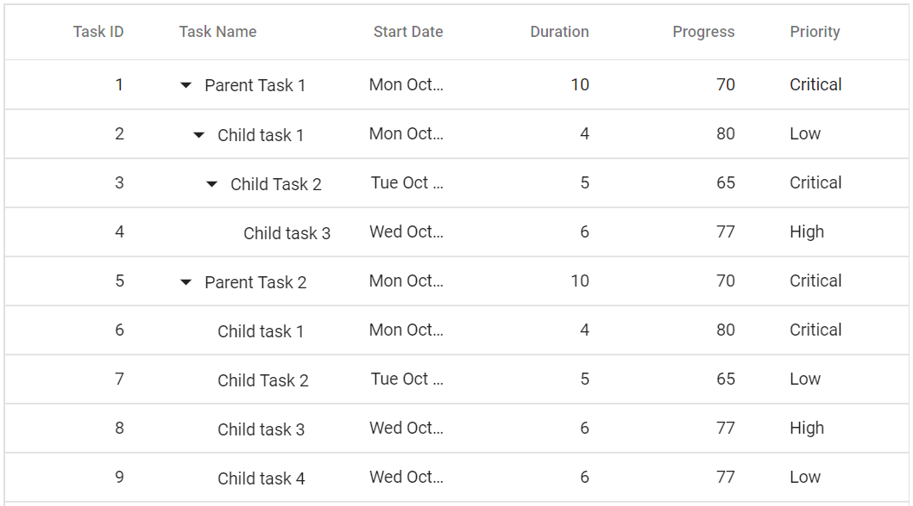

# Cell

## Displaying the HTML content

The HTML tags can be displayed in the Tree Grid header and content by enabling the [`DisableHtmlEncode`](https://help.syncfusion.com/cr/blazor/Syncfusion.Blazor~Syncfusion.Blazor.TreeGrid.TreeGridColumn~DisableHtmlEncode.html) property.



@using TreeGridComponent.Data
@using Syncfusion.Blazor.TreeGrid;

<SfTreeGrid IdMapping="TaskId" DataSource="@TreeGridData" ParentIdMapping="ParentId" TreeColumnIndex="1">
    <TreeGridColumns>
        <TreeGridColumn Field="TaskId" HeaderText="<span> Task ID </span>" Width="80" TextAlign="Syncfusion.Blazor.Grids.TextAlign.Right"></TreeGridColumn>
        <TreeGridColumn Field="TaskName" HeaderText="<span> Task Name </span>" Width="160"></TreeGridColumn>
        <TreeGridColumn Field="Duration" HeaderText="<span> Duration </span>" DisableHtmlEncode="false" Width="100" TextAlign="Syncfusion.Blazor.Grids.TextAlign.Right"></TreeGridColumn>
        <TreeGridColumn Field="Progress" HeaderText="<span> Progress </span>" DisableHtmlEncode="false" Width="100" TextAlign="Syncfusion.Blazor.Grids.TextAlign.Right"></TreeGridColumn>
    </TreeGridColumns>
</SfTreeGrid>

@code{
    public List<TreeData.BusinessObject> TreeGridData { get; set; }
    protected override void OnInitialized()
    {
        this.TreeGridData = TreeData.GetSelfDataSource().ToList();
    }
}



The following output is displayed as a result of the above code example.


## Customize cell styles

The appearance of cells can be customized by using the [`QueryCellInfo`](https://help.syncfusion.com/cr/blazor/Syncfusion.Blazor~Syncfusion.Blazor.TreeGrid.SfTreeGrid~QueryCellInfo.html) event.
The [`QueryCellInfo`](https://help.syncfusion.com/cr/blazor/Syncfusion.Blazor~Syncfusion.Blazor.TreeGrid.SfTreeGrid~QueryCellInfo.html) event triggers for every cell. In that event handler, you can get **QueryCellInfoEventArgs** that contains the details of the cell.



@using TreeGridComponent.Data;
@using Syncfusion.Blazor.TreeGrid;

<SfTreeGrid DataSource="@TreeGridData" IdMapping="TaskId" ParentIdMapping="ParentId" TreeColumnIndex="1">
    <TreeGridEvents QueryCellInfo="querycellinfo" TValue="TreeData"></TreeGridEvents>
    <TreeGridColumns>
        <TreeGridColumn Field="TaskId" HeaderText="Task ID" Width="90" TextAlign="Syncfusion.Blazor.Grids.TextAlign.Right"></TreeGridColumn>
        <TreeGridColumn Field="TaskName" HeaderText="Task Name" Width="100"></TreeGridColumn>
        <TreeGridColumn Field="Duration" HeaderText="Duration" Width="100" TextAlign="Syncfusion.Blazor.Grids.TextAlign.Right"></TreeGridColumn>
        <TreeGridColumn Field="Progress" HeaderText="Progress" Width="100" TextAlign="Syncfusion.Blazor.Grids.TextAlign.Right"></TreeGridColumn>
        <TreeGridColumn Field="Priority" HeaderText="Priority" Width="100"></TreeGridColumn>
    </TreeGridColumns>
</SfTreeGrid>

   <style>    
    .intro {
        background-color:#336c12;
        color:white;
    }
    .intro1 {
        background-color:#7b2b1d;
        color:white;
    }
    </style>

@code{

    public List<TreeData> TreeGridData { get; set; }

    protected override void OnInitialized()
    {
        this.TreeGridData = TreeData.GetSelfDataSource().ToList();
    }

    private void querycellinfo(QueryCellInfoEventArgs<TreeData> Args)
    {
        if (Args.Column.Field == "Progress" && Args.Data.Progress > 70 && Args.Data.Progress <= 100)
        {
            String[] s1 = new String[1] { "intro" };
            Args.Cell.AddClass(s1);
            }
        else if (Args.Column.Field == "Progress" && Args.Data.Progress > 20)
        {
            String[] s2 = new String[1] { "intro1" };
            Args.Cell.AddClass(s2);
            }
    }
}



The following output is displayed as a result of the above code example.


## Auto wrap

The auto wrap allows the cell content of the tree grid to wrap to the next line when it exceeds the boundary of the cell width. The Cell Content wrapping works based on the position of white space between words.
To enable auto wrap, set the [`AllowTextWrap`](https://help.syncfusion.com/cr/blazor/Syncfusion.Blazor~Syncfusion.Blazor.TreeGrid.SfTreeGrid%601~AllowTextWrap.html) property to **true**.
<!-- You can configure the auto wrap mode by setting the [`textWrapSettings.wrapMode`](https://help.syncfusion.com/cr/blazor/Syncfusion.Blazor~Syncfusion.Blazor.TreeGrid.SfTreeGrid%601~TextWrapSettings.html) property.

There are three types of `wrapMode`. They are:

* **`Both`**: `Both` value is set by default. Auto wrap will be enabled for both the content and the header.
* **`Header`**: Auto wrap will be enabled only for the header.
* **`Content`**: Auto wrap will be enabled only for the content.

In the following example, the `textWrapSettings.wrapMode` is set to `Content`.
-->
Note: When a column width is not specified, then auto wrap of columns will be adjusted with respect to the tree grid's width.



@using TreeGridComponent.Data;
@using Syncfusion.Blazor.TreeGrid;

<SfTreeGrid DataSource="@TreeGridData" IdMapping="TaskId" ParentIdMapping="ParentId" TreeColumnIndex="1" AllowTextWrap="true">
    <TreeGridColumns>
        <TreeGridColumn Field="TaskId" HeaderText="Task ID" Width="80" TextAlign="Syncfusion.Blazor.Grids.TextAlign.Right"></TreeGridColumn>
        <TreeGridColumn Field="TaskName" HeaderText="Task Name" Width="100"></TreeGridColumn>
        <TreeGridColumn Field="StartDate" HeaderText="Start Date" Format="yMd" Type="Syncfusion.Blazor.Grids.ColumnType.Date" Width="100" TextAlign="Syncfusion.Blazor.Grids.TextAlign.Right"></TreeGridColumn>
        <TreeGridColumn Field="Duration" HeaderText="Duration" Width="100" TextAlign="Syncfusion.Blazor.Grids.TextAlign.Right"></TreeGridColumn>
        <TreeGridColumn Field="Progress" HeaderText="Progress" Width="100" TextAlign="Syncfusion.Blazor.Grids.TextAlign.Right"></TreeGridColumn>
        <TreeGridColumn Field="Priority" HeaderText="Priority" Width="100"></TreeGridColumn>
    </TreeGridColumns>
</SfTreeGrid>

@code{
    public List<TreeData.BusinessObject> TreeGridData { get; set; }
    protected override void OnInitialized()
    {
        this.TreeGridData = TreeData.GetSelfDataSource().ToList();
    }
}



The following output is displayed as a result of the above code example.


<!--
 Custom Attributes

You can customize the tree grid cells by adding a CSS class to the [`customAttribute`](https://help.syncfusion.com/cr/blazor/Syncfusion.Blazor~Syncfusion.Blazor.TreeGrid.TreeGridColumn~CustomAttributes.html) property of the column.

```CSS
.e-attr {
    background: '#d7f0f4';
}
```

In the below example, we have customized the cells of `TaskID` and `StartDate` columns.

````csharp

@using TreeGridComponent.Data
@using Syncfusion.Blazor.Grids;
@using Syncfusion.Blazor.Data;

<SfTreeGrid ChildMapping="Children" TreeColumnIndex="1" AllowTextWrap="true">
    <SfDataManager Json="@TreeGridData" Adaptor="Syncfusion.Blazor.Adaptors.JsonAdaptor" ></SfDataManager>
    <TreeGridColumns>
        <TreeGridColumn Field="TaskId" HeaderText="Task ID" Width="80" TextAlign="Syncfusion.Blazor.Grids.TextAlign.Right"></TreeGridColumn>
        <TreeGridColumn Field="TaskName" HeaderText="Task Name" CustomAttributes="@attribute" Width="100"></TreeGridColumn>
        <TreeGridColumn Field="StartDate" HeaderText="Start Date" Format="yMd" type="date" Width="100" TextAlign="Syncfusion.Blazor.Grids.TextAlign.Right"></TreeGridColumn>
        <TreeGridColumn Field="Duration" HeaderText="Duration" Width="100" TextAlign="Syncfusion.Blazor.Grids.TextAlign.Right"></TreeGridColumn>
        <TreeGridColumn Field="Progress" HeaderText="Progress" Width="100" TextAlign="Syncfusion.Blazor.Grids.TextAlign.Right"></TreeGridColumn>
        <TreeGridColumn Field="Priority" HeaderText="Priority" Width="100"></TreeGridColumn>
    </TreeGridColumns>
</SfTreeGrid>

@code{
    public object[] TreeGridData { get; set; }
    public object attribute { get; set; }
    protected override void OnInitialized()
    {
        this.attribute = new { @class = "customcss" };
        this.TreeGridData = TreeData.GetDefaultData().ToList().Cast<object>().ToArray();
    }
}

<style>
    .e-attr {
        background: #d7f0f4;
    }
</style>

```
-->

## Grid lines

The [`GridLines`](https://help.syncfusion.com/cr/blazor/Syncfusion.Blazor~Syncfusion.Blazor.TreeGrid.SfTreeGrid~GridLines.html) have option to display cell border and it can be defined by the
[`GridLines`](https://help.syncfusion.com/cr/blazor/Syncfusion.Blazor~Syncfusion.Blazor.TreeGrid.SfTreeGrid~GridLines.html) property.

The available modes of grid lines are:

| Modes | Actions |
|-------|---------|
| Both | Displays both the horizontal and vertical grid lines.|
| None | No grid lines are displayed.|
| Horizontal | Displays the horizontal grid lines only.|
| Vertical | Displays the vertical grid lines only.|
| Default | Displays grid lines based on the theme.|



@using TreeGridComponent.Data
@using Syncfusion.Blazor.TreeGrid;

<SfTreeGrid IdMapping="TaskId" ParentIdMapping="ParentId" DataSource="@TreeGridData"  TreeColumnIndex="1" GridLines="Syncfusion.Blazor.Grids.GridLine.None">
    <TreeGridColumns>
        <TreeGridColumn Field="TaskId" HeaderText="Task ID" Width="80" TextAlign="Syncfusion.Blazor.Grids.TextAlign.Right"></TreeGridColumn>
        <TreeGridColumn Field="TaskName" HeaderText="Task Name" Width="100"></TreeGridColumn>
        <TreeGridColumn Field="StartDate" HeaderText="Start Date" Format="yMd" Type="Syncfusion.Blazor.Grids.ColumnType.Date" Width="100" TextAlign="Syncfusion.Blazor.Grids.TextAlign.Right"></TreeGridColumn>
        <TreeGridColumn Field="Duration" HeaderText="Duration" Width="100" TextAlign="Syncfusion.Blazor.Grids.TextAlign.Right"></TreeGridColumn>
        <TreeGridColumn Field="Progress" HeaderText="Progress" Width="100" TextAlign="Syncfusion.Blazor.Grids.TextAlign.Right"></TreeGridColumn>
        <TreeGridColumn Field="Priority" HeaderText="Priority" Width="100"></TreeGridColumn>
    </TreeGridColumns>
</SfTreeGrid>

@code{
    public List<TreeData.BusinessObject> TreeGridData { get; set; }
    protected override void OnInitialized()
    {
        this.TreeGridData = TreeData.GetSelfDataSource().ToList();
    }
}



The following output is displayed as a result of the above code example.


>By default, the tree grid renders with **Default** mode.

## Clip Mode

The clip mode provides options to display its overflow cell content and it can be defined by the [`ClipMode`](https://help.syncfusion.com/cr/blazor/Syncfusion.Blazor~Syncfusion.Blazor.TreeGrid.TreeGridColumn~ClipMode.html) property.

There are three types of [`ClipMode`](https://help.syncfusion.com/cr/blazor/Syncfusion.Blazor~Syncfusion.Blazor.TreeGrid.TreeGridColumn~ClipMode.html). They are:

* **Clip**: Truncates the cell content when it overflows its area.
* **Ellipsis**: Displays ellipsis when the cell content overflows its area.
* **EllipsisWithTooltip**: Displays ellipsis when the cell content overflows its area, also it will display the tooltip while hover on ellipsis is applied.



@using TreeGridComponent.Data
@using Syncfusion.Blazor.TreeGrid;

<SfTreeGrid IdMapping="TaskId" ParentIdMapping="ParentId" DataSource="@TreeGridData"  TreeColumnIndex="1">
    <TreeGridColumns>
        <TreeGridColumn Field="TaskId" HeaderText="Task ID" Width="80" TextAlign="Syncfusion.Blazor.Grids.TextAlign.Right"></TreeGridColumn>
        <TreeGridColumn Field="TaskName" HeaderText="Task Name" Width="100" ClipMode="Syncfusion.Blazor.Grids.ClipMode.EllipsisWithTooltip"></TreeGridColumn>
        <TreeGridColumn Field="StartDate" HeaderText="Start Date"  ClipMode="Syncfusion.Blazor.Grids.ClipMode.Ellipsis" Width="100" TextAlign="Syncfusion.Blazor.Grids.TextAlign.Right"></TreeGridColumn>
        <TreeGridColumn Field="Duration" HeaderText="Duration" Width="100" TextAlign="Syncfusion.Blazor.Grids.TextAlign.Right"></TreeGridColumn>
        <TreeGridColumn Field="Progress" HeaderText="Progress" Width="100" TextAlign="Syncfusion.Blazor.Grids.TextAlign.Right"></TreeGridColumn>
        <TreeGridColumn Field="Priority" HeaderText="Priority" Width="60" ClipMode="Syncfusion.Blazor.Grids.ClipMode.Clip"></TreeGridColumn>
    </TreeGridColumns>
</SfTreeGrid>

@code{
    public List<TreeData.BusinessObject> TreeGridData { get; set; }
    protected override void OnInitialized()
    {
        this.TreeGridData = TreeData.GetSelfDataSource().ToList();
    }
}



The following output is displayed as a result of the above code example.



> By default, [`ClipMode`](https://help.syncfusion.com/cr/blazor/Syncfusion.Blazor~Syncfusion.Blazor.TreeGrid.TreeGridColumn~ClipMode.html) value is **Ellipsis**.
