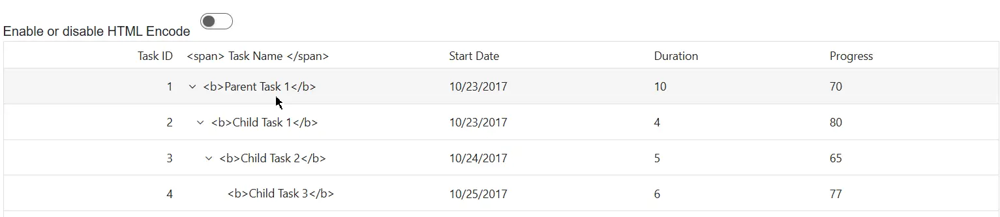
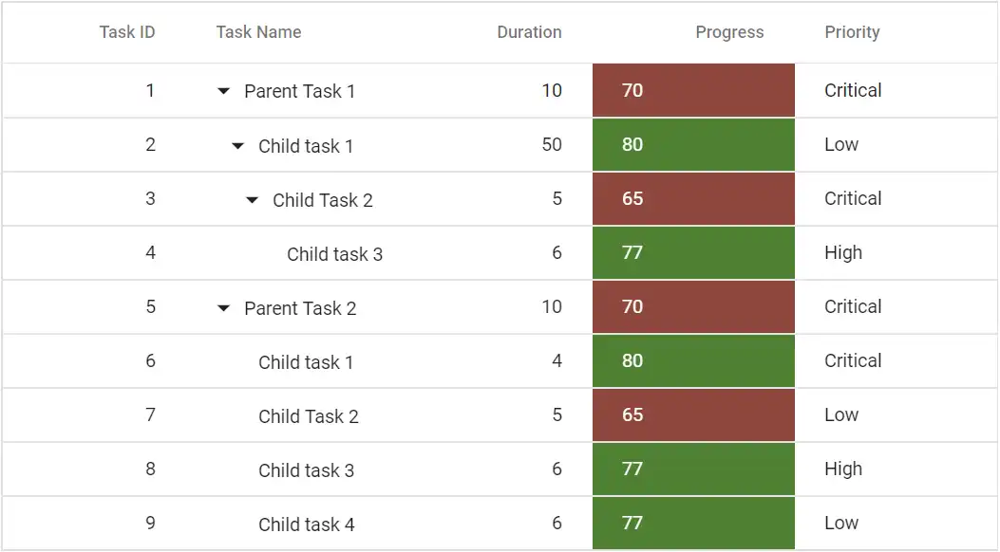
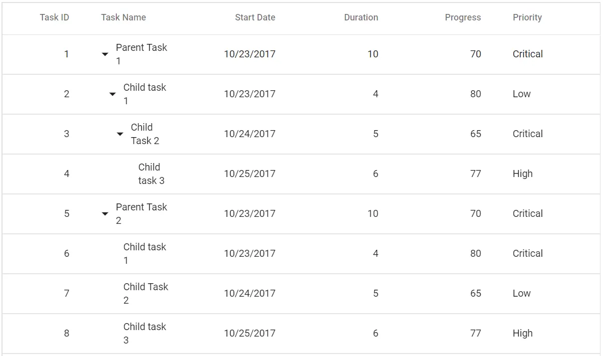
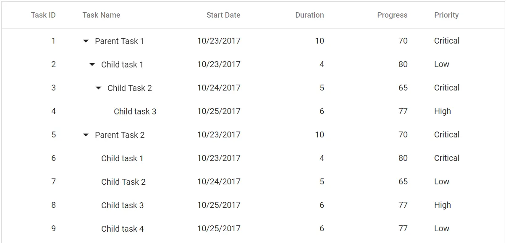
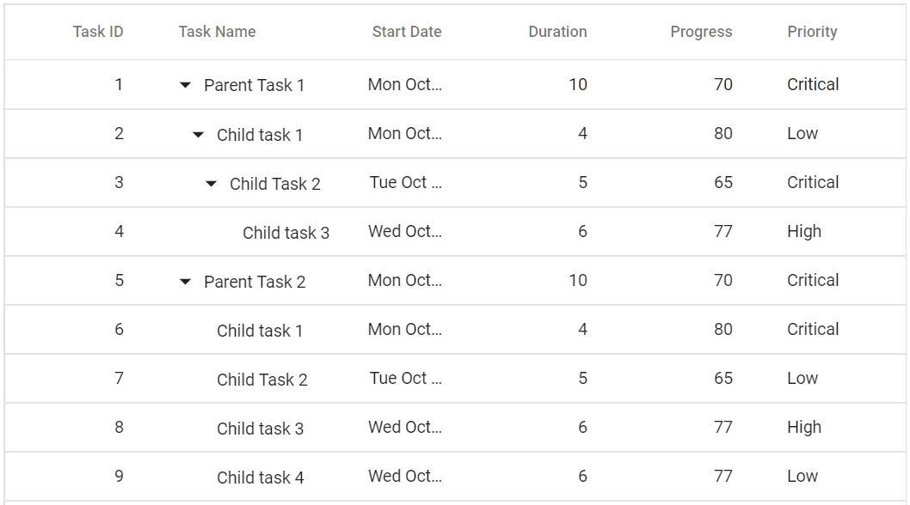

# Cell Features in Blazor TreeGrid

## Displaying HTML Content in Blazor TreeGrid

Displaying HTML content in the Blazor TreeGrid is useful when presenting formatted elements such as images, hyperlinks, or styled text within hierarchical tabular layouts. The TreeGrid supports rendering HTML tags in both header and content cells.

By default, HTML content is encoded to prevent security vulnerabilities. To render raw HTML, set the [DisableHtmlEncode](https://help.syncfusion.com/cr/blazor/Syncfusion.Blazor.TreeGrid.TreeGridColumn.html#Syncfusion_Blazor_TreeGrid_TreeGridColumn_DisableHtmlEncode) property to **false**. This allows HTML tags to be displayed as intended within the cell.

## Configuration Steps

- Set `DisableHtmlEncode` to **false** in the column definition.  
- Insert HTML tags such as ``, `<a>`, or `<b>` directly into the cell content.  
- Use a [Blazor Toggle Switch](https://www.syncfusion.com/blazor-components/blazor-toggle-switch-button) to dynamically control the encoding behavior.  
- Handle the [ValueChange](https://help.syncfusion.com/cr/blazor/Syncfusion.Blazor.Buttons.SfSwitch-1.html#Syncfusion_Blazor_Buttons_SfSwitch_1_ValueChange) event to update the column setting.  
- Call the [Refresh](https://help.syncfusion.com/cr/blazor/Syncfusion.Blazor.TreeGrid.SfTreeGrid-1.html#Syncfusion_Blazor_TreeGrid_SfTreeGrid_1_Refresh) method to apply the changes and re-render the TreeGrid.  



@using Syncfusion.Blazor.TreeGrid
@using Syncfusion.Blazor.Buttons

<label> Enable or disable HTML Encode</label>
<SfSwitch ValueChange="Change" TChecked="bool"></SfSwitch>

<SfTreeGrid @ref="TreeGrid" DataSource="@Tasks" TreeColumnIndex="1" IdMapping="TaskId" ParentIdMapping="ParentId" Height="315">
    <TreeGridColumns>
        <TreeGridColumn Field=@nameof(TreeData.BusinessObject.TaskId) HeaderText="Task ID" TextAlign="TextAlign.Right" Width="120"></TreeGridColumn>
        <TreeGridColumn Field=@nameof(TreeData.BusinessObject.TaskName) HeaderText=" Task Name " DisableHtmlEncode="@IsEncode" Width="180"></TreeGridColumn>
        <TreeGridColumn Field=@nameof(TreeData.BusinessObject.StartDate) HeaderText="Start Date" Format="d" Width="140"></TreeGridColumn>
        <TreeGridColumn Field=@nameof(TreeData.BusinessObject.Duration) HeaderText="Duration" Width="120"></TreeGridColumn>
        <TreeGridColumn Field=@nameof(TreeData.BusinessObject.Progress) HeaderText="Progress" Width="120"></TreeGridColumn>
    </TreeGridColumns>
</SfTreeGrid>

@code {
    private SfTreeGrid<TreeData.BusinessObject> TreeGrid;
    public bool IsEncode { get; set; } = true;
    public List<TreeData.BusinessObject> Tasks { get; set; }

    protected override void OnInitialized()
    {
        Tasks = TreeData.GetSelfDataSource();
    }

    private async Task Change(Syncfusion.Blazor.Buttons.ChangeEventArgs<bool> args)
    {
        IsEncode = !args.Checked;
        await TreeGrid.RefreshAsync();
    }
}



public class TreeData
{
    public class BusinessObject
    {
        public int TaskId { get; set; }
        public string TaskName { get; set; }
        public DateTime? StartDate { get; set; }
        public int? Duration { get; set; }
        public int? Progress { get; set; }
        public int? ParentId { get; set; }
    }

    public static List<BusinessObject> GetSelfDataSource()
    {
        List<BusinessObject> BusinessObjectCollection = new List<BusinessObject>();
        BusinessObjectCollection.Add(new BusinessObject() { TaskId = 1, TaskName = "<b>Parent Task 1</b>", StartDate = new DateTime(2017, 10, 23), Duration = 10, Progress = 70, ParentId = null });
        BusinessObjectCollection.Add(new BusinessObject() { TaskId = 2, TaskName = "<b>Child Task 1</b>", StartDate = new DateTime(2017, 10, 23), Duration = 4, Progress = 80, ParentId = 1 });
        BusinessObjectCollection.Add(new BusinessObject() { TaskId = 3, TaskName = "<b>Child Task 2</b>", StartDate = new DateTime(2017, 10, 24), Duration = 5, Progress = 65, ParentId = 2 });
        BusinessObjectCollection.Add(new BusinessObject() { TaskId = 4, TaskName = "<b>Child Task 3</b>", StartDate = new DateTime(2017, 10, 25), Duration = 6, Progress = 77, ParentId = 3 });
        return BusinessObjectCollection;
    }
}



> * The [DisableHtmlEncode](https://help.syncfusion.com/cr/blazor/Syncfusion.Blazor.TreeGrid.TreeGridColumn.html#Syncfusion_Blazor_TreeGrid_TreeGridColumn_DisableHtmlEncode) property disables HTML encoding for the corresponding column in the DataGrid.
> * When set to **false**, HTML tags in the column’s data are rendered as HTML.
> * When set to **true**, HTML tags are encoded and displayed as plain text.
> * Disabling HTML encoding introduces potential security vulnerabilities. Enable this feature only when using fully trusted and sanitized data sources.

## Customize cell styles

Use the [QueryCellInfo](https://help.syncfusion.com/cr/blazor/Syncfusion.Blazor.TreeGrid.TreeGridEvents-1.html#Syncfusion_Blazor_TreeGrid_TreeGridEvents_1_QueryCellInfo) event to customize cell appearance. The event is raised during cell rendering for each visible cell and is triggered again when the TreeGrid refreshes its view due to actions such as paging, sorting, filtering, or data updates. The [QueryCellInfoEventArgs](https://help.syncfusion.com/cr/blazor/Syncfusion.Blazor.Grids.QueryCellInfoEventArgs-1.html) parameter provides information about the current cell.





@using TreeGridComponent.Data;
@using Syncfusion.Blazor.TreeGrid;
@using Syncfusion.Blazor.Grids;

<SfTreeGrid DataSource="@TreeGridData" IdMapping="TaskId" ParentIdMapping="ParentId" TreeColumnIndex="1">
    <TreeGridEvents QueryCellInfo="QueryCellInfo" TValue="TreeData"></TreeGridEvents>
    <TreeGridColumns>
        <TreeGridColumn Field="TaskId" HeaderText="Task ID" Width="90" TextAlign="Syncfusion.Blazor.Grids.TextAlign.Right"></TreeGridColumn>
        <TreeGridColumn Field="TaskName" HeaderText="Task Name" Width="100"></TreeGridColumn>
        <TreeGridColumn Field="Duration" HeaderText="Duration" Width="100" TextAlign="Syncfusion.Blazor.Grids.TextAlign.Right"></TreeGridColumn>
        <TreeGridColumn Field="Progress" HeaderText="Progress" Width="100" TextAlign="Syncfusion.Blazor.Grids.TextAlign.Right"></TreeGridColumn>
        <TreeGridColumn Field="Priority" HeaderText="Priority" Width="100"></TreeGridColumn>
    </TreeGridColumns>
</SfTreeGrid>

   

@code{

    public List<TreeData> TreeGridData { get; set; }

    protected override void OnInitialized()
    {
        this.TreeGridData = TreeData.GetSelfDataSource().ToList();
    }

    private void QueryCellInfo(QueryCellInfoEventArgs<TreeData> Args)
    {
        if (Args.Column.Field == "Progress" && Args.Data.Progress > 70 && Args.Data.Progress <= 100)
        {
            Args.Cell.AddClass(new[] { "intro" })
        }
        else if (Args.Column.Field == "Progress" && Args.Data.Progress > 20)
        {
            Args.Cell.AddClass(new[] { "intro1" })
        }
    }
}





namespace TreeGridComponent.Data {

    public class TreeData
    {
        public int TaskId { get; set;}
        public string TaskName { get; set;}
        public DateTime? StartDate { get; set;}
        public int? Duration { get; set;}
        public int? Progress { get; set;}
        public string Priority { get; set;}
        public int? ParentId { get; set;}
       
        public static List<TreeData> GetSelfDataSource()
        {
            List<TreeData> TreeDataCollection = new List<TreeData>();
            TreeDataCollection.Add(new TreeData() { TaskId = 1,TaskName = "Parent Task 1",Duration = 10,Progress = 70,Priority = "Critical",ParentId = null });
            TreeDataCollection.Add(new TreeData() { TaskId = 2,TaskName = "Child task 1",Duration = 4,Progress = 80,Priority = "Low",ParentId = 1 });
            TreeDataCollection.Add(new TreeData() { TaskId = 3,TaskName = "Child Task 2",Duration = 5,Progress = 65,Priority = "Critical",ParentId = 2 });
            TreeDataCollection.Add(new TreeData() { TaskId = 4,TaskName = "Child task 3",Duration = 6,Priority = "High",Progress = 77,ParentId = 3 });
            TreeDataCollection.Add(new TreeData() { TaskId = 5,TaskName = "Parent Task 2",Duration = 10,Progress = 70,Priority = "Critical",ParentId = null});
            TreeDataCollection.Add(new TreeData() { TaskId = 6,TaskName = "Child task 1",Duration = 4,Progress = 80,Priority = "Critical",ParentId = 5});
            TreeDataCollection.Add(new TreeData() { TaskId = 7,TaskName = "Child Task 2",Duration = 5,Progress = 65,Priority = "Low",ParentId = 5});
            TreeDataCollection.Add(new TreeData() { TaskId = 8,TaskName = "Child task 3",Duration = 6,Progress = 77,Priority = "High",ParentId = 5});
            TreeDataCollection.Add(new TreeData() { TaskId = 9,TaskName = "Child task 4",Duration = 6,Progress = 77,Priority = "Low",ParentId = 5});
            return TreeDataCollection;
        }
    }
}





## Auto wrap

The auto wrap allows the cell content of the TreeGrid to wrap to the next line when it exceeds cell width. The Cell Content wrapping works based on the position of white space between words. To enable auto wrap, set the [AllowTextWrap](https://help.syncfusion.com/cr/blazor/Syncfusion.Blazor.TreeGrid.SfTreeGrid-1.html#Syncfusion_Blazor_TreeGrid_SfTreeGrid_1_AllowTextWrap) property to **true**.





@using TreeGridComponent.Data;
@using Syncfusion.Blazor.TreeGrid;

<SfTreeGrid DataSource="@TreeGridData" IdMapping="TaskId" ParentIdMapping="ParentId" TreeColumnIndex="1" AllowTextWrap="true">
    <TreeGridColumns>
        <TreeGridColumn Field="TaskId" HeaderText="Task ID" Width="80" TextAlign="Syncfusion.Blazor.Grids.TextAlign.Right"></TreeGridColumn>
        <TreeGridColumn Field="TaskName" HeaderText="Task Name" Width="100"></TreeGridColumn>
        <TreeGridColumn Field="StartDate" HeaderText="Start Date" Format="yMd" Type="Syncfusion.Blazor.Grids.ColumnType.Date" Width="100" TextAlign="Syncfusion.Blazor.Grids.TextAlign.Right"></TreeGridColumn>
        <TreeGridColumn Field="Duration" HeaderText="Duration" Width="100" TextAlign="Syncfusion.Blazor.Grids.TextAlign.Right"></TreeGridColumn>
        <TreeGridColumn Field="Progress" HeaderText="Progress" Width="100" TextAlign="Syncfusion.Blazor.Grids.TextAlign.Right"></TreeGridColumn>
        <TreeGridColumn Field="Priority" HeaderText="Priority" Width="100"></TreeGridColumn>
    </TreeGridColumns>
</SfTreeGrid>

@code{
    public List<TreeData.BusinessObject> TreeGridData { get; set; }
    protected override void OnInitialized()
    {
        this.TreeGridData = TreeData.GetSelfDataSource().ToList();
    }
}





namespace TreeGridComponent.Data {

public class TreeData
    {
        public class BusinessObject
        {
            public int TaskId { get; set;}
            public string TaskName { get; set;}
            public DateTime? StartDate { get; set;}
            public int? Duration { get; set;}
            public int? Progress { get; set;}
            public string Priority { get; set;}
            public int? ParentId { get; set;}
        }

        public static List<BusinessObject> GetSelfDataSource()
        {
            List<BusinessObject> BusinessObjectCollection = new List<BusinessObject>();
            BusinessObjectCollection.Add(new BusinessObject() { TaskId = 1,TaskName = "Parent Task 1",StartDate = new DateTime(2017, 10, 23),Duration = 10,Progress = 70,Priority = "Critical",ParentId = null });
            BusinessObjectCollection.Add(new BusinessObject() { TaskId = 2,TaskName = "Child task 1",StartDate = new DateTime(2017, 10, 23),Duration = 4,Progress = 80,Priority = "Low",ParentId = 1 });
            BusinessObjectCollection.Add(new BusinessObject() { TaskId = 3,TaskName = "Child Task 2",StartDate = new DateTime(2017, 10, 24),Duration = 5,Progress = 65,Priority = "Critical",ParentId = 2 });
            BusinessObjectCollection.Add(new BusinessObject() { TaskId = 4,TaskName = "Child task 3",StartDate = new DateTime(2017, 10, 25),Duration = 6,Priority = "High",Progress = 77,ParentId = 3 });
            return BusinessObjectCollection;
        }
    }
}





N> When a column width is not specified, that column's auto wrap will be adjusted with respect to the TreeGrid's width.

## Grid lines

The [GridLines](https://help.syncfusion.com/cr/blazor/Syncfusion.Blazor.TreeGrid.SfTreeGrid-1.html#Syncfusion_Blazor_TreeGrid_SfTreeGrid_1_GridLines) have option to display cell border and it can be defined by the `GridLines` property.

The available modes of grid lines are:

| Modes | Actions |
|-------|---------|
| Both | Displays both the horizontal and vertical grid lines.|
| None | No grid lines are displayed.|
| Horizontal | Displays the horizontal grid lines only.|
| Vertical | Displays the vertical grid lines only.|
| Default | Displays grid lines based on the theme.|





@using TreeGridComponent.Data;
@using Syncfusion.Blazor.TreeGrid;

<SfTreeGrid IdMapping="TaskId" ParentIdMapping="ParentId" DataSource="@TreeGridData"  TreeColumnIndex="1" GridLines="Syncfusion.Blazor.Grids.GridLine.None">
    <TreeGridColumns>
        <TreeGridColumn Field="TaskId" HeaderText="Task ID" Width="80" TextAlign="Syncfusion.Blazor.Grids.TextAlign.Right"></TreeGridColumn>
        <TreeGridColumn Field="TaskName" HeaderText="Task Name" Width="100"></TreeGridColumn>
        <TreeGridColumn Field="StartDate" HeaderText="Start Date" Format="yMd" Type="Syncfusion.Blazor.Grids.ColumnType.Date" Width="100" TextAlign="Syncfusion.Blazor.Grids.TextAlign.Right"></TreeGridColumn>
        <TreeGridColumn Field="Duration" HeaderText="Duration" Width="100" TextAlign="Syncfusion.Blazor.Grids.TextAlign.Right"></TreeGridColumn>
        <TreeGridColumn Field="Progress" HeaderText="Progress" Width="100" TextAlign="Syncfusion.Blazor.Grids.TextAlign.Right"></TreeGridColumn>
        <TreeGridColumn Field="Priority" HeaderText="Priority" Width="100"></TreeGridColumn>
    </TreeGridColumns>
</SfTreeGrid>

@code{
    public List<TreeData.BusinessObject> TreeGridData { get; set; }
    protected override void OnInitialized()
    {
        this.TreeGridData = TreeData.GetSelfDataSource().ToList();
    }
}





namespace TreeGridComponent.Data {

    public class TreeData
    {
        public class BusinessObject
        {
            public int TaskId { get; set;}
            public string TaskName { get; set;}
            public DateTime? StartDate { get; set;}
            public int? Duration { get; set;}
            public int? Progress { get; set;}
            public string Priority { get; set;}
            public int? ParentId { get; set;}
        }

        public static List<BusinessObject> GetSelfDataSource()
        {
            List<BusinessObject> BusinessObjectCollection = new List<BusinessObject>();
            BusinessObjectCollection.Add(new BusinessObject() { TaskId = 1,TaskName = "Parent Task 1",StartDate = new DateTime(2017, 10, 23),Duration = 10,Progress = 70,Priority = "Critical",ParentId = null });
            BusinessObjectCollection.Add(new BusinessObject() { TaskId = 2,TaskName = "Child task 1",StartDate = new DateTime(2017, 10, 23),Duration = 4,Progress = 80,Priority = "Low",ParentId = 1 });
            BusinessObjectCollection.Add(new BusinessObject() { TaskId = 3,TaskName = "Child Task 2",StartDate = new DateTime(2017, 10, 24),Duration = 5,Progress = 65,Priority = "Critical",ParentId = 2 });
            BusinessObjectCollection.Add(new BusinessObject() { TaskId = 4,TaskName = "Child task 3",StartDate = new DateTime(2017, 10, 25),Duration = 6,Priority = "High",Progress = 77,ParentId = 3 });
            return BusinessObjectCollection;
        }
    }
}





N> By default, the TreeGrid renders with **Default** mode.

## Clip Mode

The clip mode provides options to display its overflow cell content and it can be defined by the [ClipMode](https://help.syncfusion.com/cr/blazor/Syncfusion.Blazor.TreeGrid.TreeGridColumn.html#Syncfusion_Blazor_TreeGrid_TreeGridColumn_ClipMode) property.

The Blazor TreeGrid supports the following `ClipMode` options to control the display of cell content when the content exceeds the available column width:

* **Clip**: Truncates the cell content when the content exceeds the available cell width.
* **Ellipsis**: Displays an ellipsis (...) when the content exceeds the available cell width.
* **EllipsisWithTooltip**: Displays an ellipsis (...) when the content exceeds the available cell width and displays the full content in a tooltip on hover.





@using TreeGridComponent.Data;
@using Syncfusion.Blazor.TreeGrid;

<SfTreeGrid IdMapping="TaskId" ParentIdMapping="ParentId" DataSource="@TreeGridData"  TreeColumnIndex="1">
    <TreeGridColumns>
        <TreeGridColumn Field="TaskId" HeaderText="Task ID" Width="80" TextAlign="Syncfusion.Blazor.Grids.TextAlign.Right"></TreeGridColumn>
        <TreeGridColumn Field="TaskName" HeaderText="Task Name" Width="100" ClipMode="Syncfusion.Blazor.Grids.ClipMode.EllipsisWithTooltip"></TreeGridColumn>
        <TreeGridColumn Field="StartDate" HeaderText="Start Date"  ClipMode="Syncfusion.Blazor.Grids.ClipMode.Ellipsis" Width="100" TextAlign="Syncfusion.Blazor.Grids.TextAlign.Right"></TreeGridColumn>
        <TreeGridColumn Field="Duration" HeaderText="Duration" Width="100" TextAlign="Syncfusion.Blazor.Grids.TextAlign.Right"></TreeGridColumn>
        <TreeGridColumn Field="Progress" HeaderText="Progress" Width="100" TextAlign="Syncfusion.Blazor.Grids.TextAlign.Right"></TreeGridColumn>
        <TreeGridColumn Field="Priority" HeaderText="Priority" Width="60" ClipMode="Syncfusion.Blazor.Grids.ClipMode.Clip"></TreeGridColumn>
    </TreeGridColumns>
</SfTreeGrid>

@code{
    public List<TreeData.BusinessObject> TreeGridData { get; set; }
    protected override void OnInitialized()
    {
        this.TreeGridData = TreeData.GetSelfDataSource().ToList();
    }
}





namespace TreeGridComponent.Data {

    public class TreeData
    {
        public class BusinessObject
        {
            public int TaskId { get; set;}
            public string TaskName { get; set;}
            public DateTime? StartDate { get; set;}
            public int? Duration { get; set;}
            public int? Progress { get; set;}
            public string Priority { get; set;}
            public int? ParentId { get; set;}
        }

        public static List<BusinessObject> GetSelfDataSource()
        {
            List<BusinessObject> BusinessObjectCollection = new List<BusinessObject>();
            BusinessObjectCollection.Add(new BusinessObject() { TaskId = 1,TaskName = "Parent Task 1",StartDate = new DateTime(2017, 10, 23),Duration = 10,Progress = 70,Priority = "Critical",ParentId = null});
            BusinessObjectCollection.Add(new BusinessObject() { TaskId = 2,TaskName = "Child task 1",StartDate = new DateTime(2017, 10, 23),Duration = 4,Progress = 80,Priority = "Low",ParentId = 1 });
            BusinessObjectCollection.Add(new BusinessObject() { TaskId = 3,TaskName = "Child Task 2",StartDate = new DateTime(2017, 10, 24),Duration = 5,Progress = 65,Priority = "Critical",ParentId = 2 });
            BusinessObjectCollection.Add(new BusinessObject() { TaskId = 4,TaskName = "Child task 3",StartDate = new DateTime(2017, 10, 25),Duration = 6,Priority = "High",Progress = 77,ParentId = 3 });
            return BusinessObjectCollection;
        }
    }
}





N> By default, [ClipMode](https://help.syncfusion.com/cr/blazor/Syncfusion.Blazor.TreeGrid.TreeGridColumn.html#Syncfusion_Blazor_TreeGrid_TreeGridColumn_ClipMode) value is **Ellipsis**.
