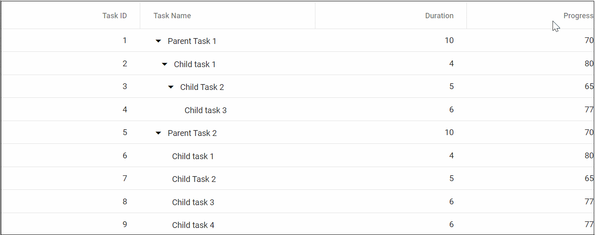
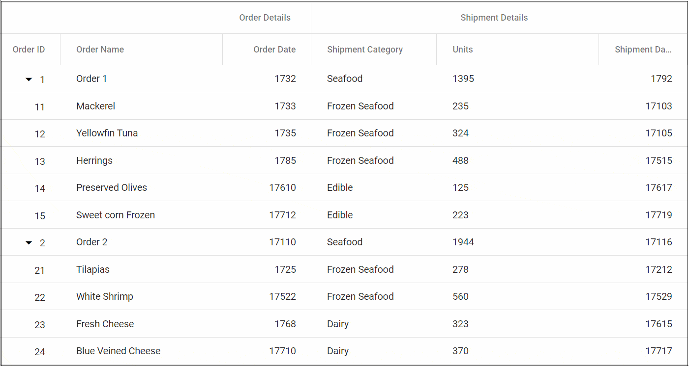

# Column Resizing in Blazor Tree Grid

Column width can be resized by clicking and dragging the right edge of the column header. While dragging, the width of the respective column will be resized immediately. Each column can be auto resized by double-clicking the right edge of the column header to fit the width of that column based on the widest cell content. To enable column resize, set the [AllowResizing](https://help.syncfusion.com/cr/blazor/Syncfusion.Blazor.TreeGrid.SfTreeGrid-1.html#Syncfusion_Blazor_TreeGrid_SfTreeGrid_1_AllowResizing) property to true.





@using TreeGridComponent.Data;
@using Syncfusion.Blazor.TreeGrid;

<SfTreeGrid IdMapping="TaskId" ParentIdMapping="ParentId"  AllowResizing="true" DataSource="@TreeGridData" TreeColumnIndex="1">
    <TreeGridColumns>
        <TreeGridColumn Field="TaskId" HeaderText="Task ID" Width="80" TextAlign="Syncfusion.Blazor.Grids.TextAlign.Right"></TreeGridColumn>
        <TreeGridColumn Field="TaskName" HeaderText="Task Name" Width="180"></TreeGridColumn>
        <TreeGridColumn Field="Duration" HeaderText="Duration" TextAlign="Syncfusion.Blazor.Grids.TextAlign.Right" Width="80"></TreeGridColumn>
        <TreeGridColumn Field="Progress" HeaderText="Progress" TextAlign="Syncfusion.Blazor.Grids.TextAlign.Right" Width="80"></TreeGridColumn>
    </TreeGridColumns>
</SfTreeGrid>

@code{
    public List<TreeData.BusinessObject> TreeGridData { get; set; }
    protected override void OnInitialized()
    {
        this.TreeGridData = TreeData.GetSelfDataSource().ToList();
    }
}





namespace TreeGridComponent.Data {

public class TreeData
    {
        public class BusinessObject
        {
            public int TaskId { get; set;}
            public string TaskName { get; set;}
            public int? Duration { get; set;}
            public int? Progress { get; set;}
            public int? ParentId { get; set;}
        }

        public static List<BusinessObject> GetSelfDataSource()
        {
            List<BusinessObject> BusinessObjectCollection = new List<BusinessObject>();
            BusinessObjectCollection.Add(new BusinessObject() { TaskId = 1,TaskName = "Parent Task 1",Duration = 10,Progress = 70,ParentId = null });
            BusinessObjectCollection.Add(new BusinessObject() { TaskId = 2,TaskName = "Child task 1",Duration = 4,Progress = 80,ParentId = 1 });
            BusinessObjectCollection.Add(new BusinessObject() { TaskId = 3,TaskName = "Child Task 2",Duration = 5,Progress = 65,ParentId = 2 });
            BusinessObjectCollection.Add(new BusinessObject() { TaskId = 4,TaskName = "Child task 3",Duration = 6,Progress = 77,ParentId = 3 });
            BusinessObjectCollection.Add(new BusinessObject() { TaskId = 5,TaskName = "Parent Task 2",Duration = 10,Progress = 70,ParentId = null});
            BusinessObjectCollection.Add(new BusinessObject() { TaskId = 6,TaskName = "Child task 1",Duration = 4,Progress = 80,ParentId = 5});
            BusinessObjectCollection.Add(new BusinessObject() { TaskId = 7,TaskName = "Child Task 2",Duration = 5,Progress = 65,ParentId = 5});
            BusinessObjectCollection.Add(new BusinessObject() { TaskId = 8,TaskName = "Child task 3",Duration = 6,Progress = 77,ParentId = 5});
            BusinessObjectCollection.Add(new BusinessObject() { TaskId = 9,TaskName = "Child task 4",Duration = 6,Progress = 77,ParentId = 5});
            return BusinessObjectCollection;
        }
    }
}





> You can disable resizing for a particular column by setting the [AllowResizing]https://help.syncfusion.com/cr/blazor/Syncfusion.Blazor.TreeGrid.SfTreeGrid-1.html#Syncfusion_Blazor_TreeGrid_SfTreeGrid_1_AllowResizing) property of the [TreeGridColumn](https://help.syncfusion.com/cr/blazor/Syncfusion.Blazor~Syncfusion.Blazor.TreeGrid.TreeGridColumn.html) component to false.
> In RTL mode, you can click and drag the left edge of the header cell to resize the column.

## Min and max width

Column resize can be restricted between minimum and maximum width by defining the [MinWidth](https://help.syncfusion.com/cr/blazor/Syncfusion.Blazor.TreeGrid.TreeGridColumn.html#Syncfusion_Blazor_TreeGrid_TreeGridColumn_MinWidth) and [MaxWidth](https://help.syncfusion.com/cr/blazor/Syncfusion.Blazor.TreeGrid.TreeGridColumn.html#Syncfusion_Blazor_TreeGrid_TreeGridColumn_MaxWidth) properties in [TreeGridColumn](https://help.syncfusion.com/cr/blazor/Syncfusion.Blazor~Syncfusion.Blazor.TreeGrid.TreeGridColumn.html) component.

In the following sample, minimum and maximum width are defined for **TaskName** and **Duration** columns.





@using TreeGridComponent.Data;
@using Syncfusion.Blazor.TreeGrid;

<SfTreeGrid IdMapping="TaskId" ParentIdMapping="ParentId"  AllowResizing="true" DataSource="@TreeGridData" TreeColumnIndex="1">
    <TreeGridColumns>
        <TreeGridColumn Field="TaskId" HeaderText="Task ID" Width="80" TextAlign="Syncfusion.Blazor.Grids.TextAlign.Right"></TreeGridColumn>
        <TreeGridColumn Field="TaskName" HeaderText="Task Name" MinWidth="170" MaxWidth="250" Width="180"></TreeGridColumn>
        <TreeGridColumn Field="Duration" HeaderText="Duration" MinWidth="50" MaxWidth="150" TextAlign="Syncfusion.Blazor.Grids.TextAlign.Right" Width="80"></TreeGridColumn>
        <TreeGridColumn Field="Progress" HeaderText="Progress" TextAlign="Syncfusion.Blazor.Grids.TextAlign.Right" Width="80"></TreeGridColumn>
    </TreeGridColumns>
</SfTreeGrid>

@code{
    public List<TreeData.BusinessObject> TreeGridData { get; set; }
    protected override void OnInitialized()
    {
        this.TreeGridData = TreeData.GetSelfDataSource().ToList();
    }
}





namespace TreeGridComponent.Data {

public class TreeData
    {
        public class BusinessObject
        {
            public int TaskId { get; set;}
            public string TaskName { get; set;}
            public int? Duration { get; set;}
            public int? Progress { get; set;}
            public int? ParentId { get; set;}
        }

        public static List<BusinessObject> GetSelfDataSource()
        {
            List<BusinessObject> BusinessObjectCollection = new List<BusinessObject>();
            BusinessObjectCollection.Add(new BusinessObject() { TaskId = 1,TaskName = "Parent Task 1",Duration = 10,Progress = 70,ParentId = null });
            BusinessObjectCollection.Add(new BusinessObject() { TaskId = 2,TaskName = "Child task 1",Duration = 4,Progress = 80,ParentId = 1 });
            BusinessObjectCollection.Add(new BusinessObject() { TaskId = 3,TaskName = "Child Task 2",Duration = 5,Progress = 65,ParentId = 2 });
            BusinessObjectCollection.Add(new BusinessObject() { TaskId = 4,TaskName = "Child task 3",Duration = 6,Progress = 77,ParentId = 3 });
            BusinessObjectCollection.Add(new BusinessObject() { TaskId = 5,TaskName = "Parent Task 2",Duration = 10,Progress = 70,ParentId = null});
            BusinessObjectCollection.Add(new BusinessObject() { TaskId = 6,TaskName = "Child task 1",Duration = 4,Progress = 80,ParentId = 5});
            BusinessObjectCollection.Add(new BusinessObject() { TaskId = 7,TaskName = "Child Task 2",Duration = 5,Progress = 65,ParentId = 5});
            BusinessObjectCollection.Add(new BusinessObject() { TaskId = 8,TaskName = "Child task 3",Duration = 6,Progress = 77,ParentId = 5});
            BusinessObjectCollection.Add(new BusinessObject() { TaskId = 9,TaskName = "Child task 4",Duration = 6,Progress = 77,ParentId = 5});
            return BusinessObjectCollection;
        }
    }
}





## Resize stacked column

Stacked columns can be resized by clicking and dragging the right edge of the stacked column header. While dragging, the width of the respective child columns will be resized at the same time. You can disable resize for any particular stacked column by setting [AllowResizing](https://help.syncfusion.com/cr/blazor/Syncfusion.Blazor.TreeGrid.SfTreeGrid-1.html#Syncfusion_Blazor_TreeGrid_SfTreeGrid_1_AllowResizing) property of the [TreeGridColumn](https://help.syncfusion.com/cr/blazor/Syncfusion.Blazor~Syncfusion.Blazor.TreeGrid.TreeGridColumn.html)as **false** to its columns.





@using TreeGridComponent.Data;
@using Syncfusion.Blazor.TreeGrid;

<SfTreeGrid @ref="TreeGrid" IdMapping="TaskId" ParentIdMapping="ParentId" AllowResizing="true" DataSource="@TreeGridData" TreeColumnIndex="1">
    <TreeGridColumns>
        <TreeGridColumn Field="TaskId" HeaderText="Task ID" Width="120" TextAlign="Syncfusion.Blazor.Grids.TextAlign.Right"></TreeGridColumn>
        <TreeGridColumn HeaderText="Task Details">
            <TreeGridColumns>
                <TreeGridColumn Field="TaskName" HeaderText="Task Name" Width="150"></TreeGridColumn>
                <TreeGridColumn Field="Duration" HeaderText="Duration" TextAlign="Syncfusion.Blazor.Grids.TextAlign.Right" Width="60"></TreeGridColumn>
                <TreeGridColumn Field="Progress" HeaderText="Progress" TextAlign="Syncfusion.Blazor.Grids.TextAlign.Right" Width="70"></TreeGridColumn>
            </TreeGridColumns>
        </TreeGridColumn>
    </TreeGridColumns>
</SfTreeGrid>

@code{
    public List<TreeData.BusinessObject> TreeGridData { get; set; }
    protected override void OnInitialized()
    {
        this.TreeGridData = TreeData.GetSelfDataSource().ToList();
    }
}





namespace TreeGridComponent.Data {

public class TreeData
    {
        public class BusinessObject
        {
            public int TaskId { get; set;}
            public string TaskName { get; set;}
            public int? Duration { get; set;}
            public int? Progress { get; set;}
            public int? ParentId { get; set;}
        }

        public static List<BusinessObject> GetSelfDataSource()
        {
            List<BusinessObject> BusinessObjectCollection = new List<BusinessObject>();
            BusinessObjectCollection.Add(new BusinessObject() { TaskId = 1,TaskName = "Parent Task 1",Duration = 10,Progress = 70,ParentId = null });
            BusinessObjectCollection.Add(new BusinessObject() { TaskId = 2,TaskName = "Child task 1",Duration = 4,Progress = 80,ParentId = 1 });
            BusinessObjectCollection.Add(new BusinessObject() { TaskId = 3,TaskName = "Child Task 2",Duration = 5,Progress = 65,ParentId = 2 });
            BusinessObjectCollection.Add(new BusinessObject() { TaskId = 4,TaskName = "Child task 3",Duration = 6,Progress = 77,ParentId = 3 });
            BusinessObjectCollection.Add(new BusinessObject() { TaskId = 5,TaskName = "Parent Task 2",Duration = 10,Progress = 70,ParentId = null});
            BusinessObjectCollection.Add(new BusinessObject() { TaskId = 6,TaskName = "Child task 1",Duration = 4,Progress = 80,ParentId = 5});
            BusinessObjectCollection.Add(new BusinessObject() { TaskId = 7,TaskName = "Child Task 2",Duration = 5,Progress = 65,ParentId = 5});
            BusinessObjectCollection.Add(new BusinessObject() { TaskId = 8,TaskName = "Child task 3",Duration = 6,Progress = 77,ParentId = 5});
            BusinessObjectCollection.Add(new BusinessObject() { TaskId = 9,TaskName = "Child task 4",Duration = 6,Progress = 77,ParentId = 5});
            return BusinessObjectCollection;
        }
    }
}





Resizing of stacked header is shown below

## Touch interaction

When the right edge of the header cell is tapped, a floating handler will be visible over the right border of the column. To resize the column, tap and drag the floating handler as needed. You can AutoFit a column by using the Column menu of the tree grid.

The following screenshot represents the column resizing in touch device.

