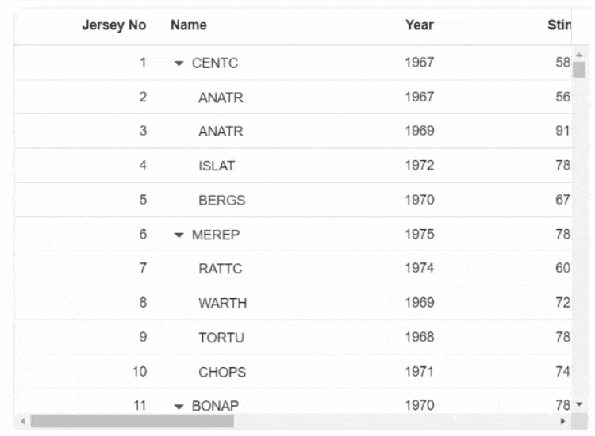

# Column Virtualization in Blazor TreeGrid Component

Column virtualization allows you to virtualize columns. It will render columns which are in the viewport. You can scroll horizontally to view more columns.

To setup the column virtualization, set the [EnableVirtualization](https://help.syncfusion.com/cr/blazor/Syncfusion.Blazor.TreeGrid.SfTreeGrid-1.html#Syncfusion_Blazor_TreeGrid_SfTreeGrid_1_EnableVirtualization) and [EnableColumnVirtualization](https://help.syncfusion.com/cr/blazor/Syncfusion.Blazor.TreeGrid.SfTreeGrid-1.html#Syncfusion_Blazor_TreeGrid_SfTreeGrid_1_EnableColumnVirtualization) properties as **true**.

```csharp

@using Syncfusion.Blazor.Grids
@using Syncfusion.Blazor.TreeGrid;

<SfTreeGrid DataSource="@TreeData" IdMapping="TaskID" TreeColumnIndex="1" ParentIdMapping="ParentID" Height="400" Width="600" EnableHover="false" EnableVirtualization="true" EnableColumnVirtualization="true">
    <TreeGridPageSettings PageSize="40"></TreeGridPageSettings>
    <TreeGridColumns>
        <TreeGridColumn Field="TaskID" HeaderText="Jersey No" TextAlign="TextAlign.Right" Width="150"></TreeGridColumn>
        <TreeGridColumn Field="FIELD1" HeaderText="Name" Width="150"></TreeGridColumn>
        <TreeGridColumn Field="FIELD2" HeaderText="Year" TextAlign="TextAlign.Right" Width="150"></TreeGridColumn>
        <TreeGridColumn Field="FIELD3" HeaderText="Stint" TextAlign="TextAlign.Right" Width="150"></TreeGridColumn>
        <TreeGridColumn Field="FIELD4" HeaderText="TMID" TextAlign="TextAlign.Right" Width="150"></TreeGridColumn>
        <TreeGridColumn Field="FIELD5" HeaderText="LGID" TextAlign="TextAlign.Right" Width="150"></TreeGridColumn>
        <TreeGridColumn Field="FIELD6" HeaderText="GP" TextAlign="TextAlign.Right" Width="150"></TreeGridColumn>
        <TreeGridColumn Field="Field7" HeaderText="GS" TextAlign="TextAlign.Right" Width="150"></TreeGridColumn>
        <TreeGridColumn Field="Field8" HeaderText="Minutes" TextAlign="TextAlign.Right" Width="150"></TreeGridColumn>
        <TreeGridColumn Field="Field9" HeaderText="Points" TextAlign="TextAlign.Right" Width="150"></TreeGridColumn>
    </TreeGridColumns>
</SfTreeGrid>

@code{
    public List<VirtualData> TreeData { get; set; }
    protected override void OnInitialized()
    {
        this.TreeData = VirtualData.GetTreeVirtualData().ToList();
    }

    public class VirtualData
    {
        public int TaskID { get; set; }
        public string FIELD1 { get; set; }
        public int FIELD2 { get; set; }
        public int FIELD3 { get; set; }
        public int FIELD4 { get; set; }
        public int FIELD5 { get; set; }
        public int FIELD6 { get; set; }
        public int Field7 { get; set; }
        public int Field8 { get; set; }
        public int Field9 { get; set; }
        public int? ParentID { get; set; }
        public static List<VirtualData> GetTreeVirtualData()
        {
            string[] Names = new string[] { "VINET", "TOMSP", "HANAR", "VICTE", "SUPRD", "HANAR", "CHOPS", "RICSU", "WELLI", "HILAA", "ERNSH", "CENTC",
            "OTTIK", "QUEDE", "RATTC", "ERNSH", "FOLKO", "BLONP", "WARTH", "FRANK", "GROSR", "WHITC", "WARTH", "SPLIR", "RATTC", "QUICK", "VINET",
            "MAGAA", "TORTU", "MORGK", "BERGS", "LEHMS", "BERGS", "ROMEY", "ROMEY", "LILAS", "LEHMS", "QUICK", "QUICK", "RICAR", "REGGC", "BSBEV",
            "COMMI", "QUEDE", "TRADH", "TORTU", "RATTC", "VINET", "LILAS", "BLONP", "HUNGO", "RICAR", "MAGAA", "WANDK", "SUPRD", "GODOS", "TORTU",
            "OLDWO", "ROMEY", "LONEP", "ANATR", "HUNGO", "THEBI", "DUMON", "WANDK", "QUICK", "RATTC", "ISLAT", "RATTC", "LONEP", "ISLAT", "TORTU",
            "WARTH", "ISLAT", "PERIC", "KOENE", "SAVEA", "KOENE", "BOLID", "FOLKO", "FURIB", "SPLIR", "LILAS", "BONAP", "MEREP", "WARTH", "VICTE",
            "HUNGO", "PRINI", "FRANK", "OLDWO", "MEREP", "BONAP", "SIMOB", "FRANK", "LEHMS", "WHITC", "QUICK", "RATTC", "FAMIA" };
            List<VirtualData> DataCollection = new List<VirtualData>();
            Random random = new Random();
            var RecordID = 0;
            for (var i = 1; i <= 2000; i++)
            {
                var name = random.Next(0, 100);
                VirtualData Parent = new VirtualData()
                {
                    TaskID = ++RecordID,
                    FIELD1 = Names[name],
                    FIELD2 = 1967 + random.Next(0, 10),
                    FIELD3 = 395 + random.Next(100, 600),
                    FIELD4 = 87 + random.Next(50, 250),
                    FIELD5 = 410 + random.Next(100, 600),
                    FIELD6 = 67 + random.Next(50, 250),
                    Field7 = (int)Math.Floor(random.NextDouble() * 100),
                    Field8 = (int)Math.Floor(random.NextDouble() * 10),
                    Field9 = (int)Math.Floor(random.NextDouble() * 10),
                    ParentID = null
                };
                DataCollection.Add(Parent);
                for (var j = 1; j <= 4; j++)
                {
                    var childName = random.Next(0, 100);
                    DataCollection.Add(new VirtualData()
                    {
                        TaskID = ++RecordID,
                        FIELD1 = Names[childName],
                        FIELD2 = 1967 + random.Next(0, 10),
                        FIELD3 = 395 + random.Next(100, 600),
                        FIELD4 = 87 + random.Next(50, 250),
                        FIELD5 = 410 + random.Next(100, 600),
                        FIELD6 = 67 + random.Next(50, 250),
                        Field7 = (int)Math.Floor(random.NextDouble() * 100),
                        Field8 = (int)Math.Floor(random.NextDouble() * 10),
                        Field9 = (int)Math.Floor(random.NextDouble() * 10),
                        ParentID = Parent.TaskID
                    });
                }
            }
            return DataCollection;

        }
    }
}
```

> Column's [Width](https://help.syncfusion.com/cr/blazor/Syncfusion.Blazor.TreeGrid.SfTreeGrid-1.html#Syncfusion_Blazor_TreeGrid_SfTreeGrid_1_Width) is required for column virtualization. If column's width is not defined then Tree Grid will consider its value as **200px**.

The following GIF represent a Tree Grid with Column virtualization.

