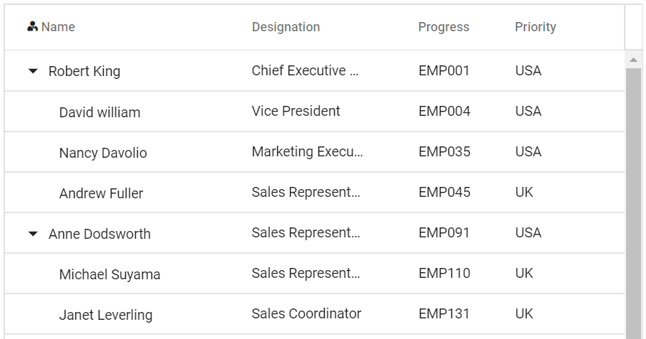
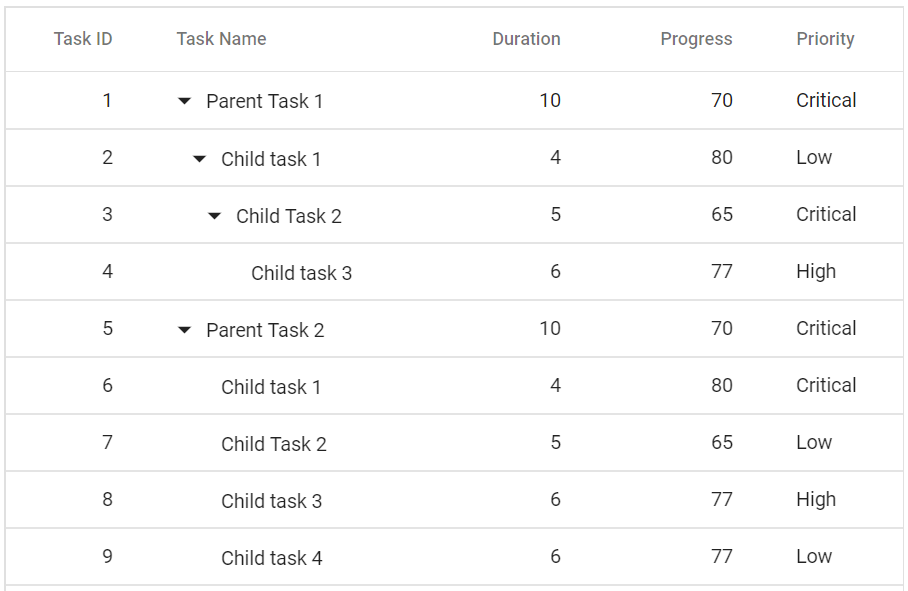
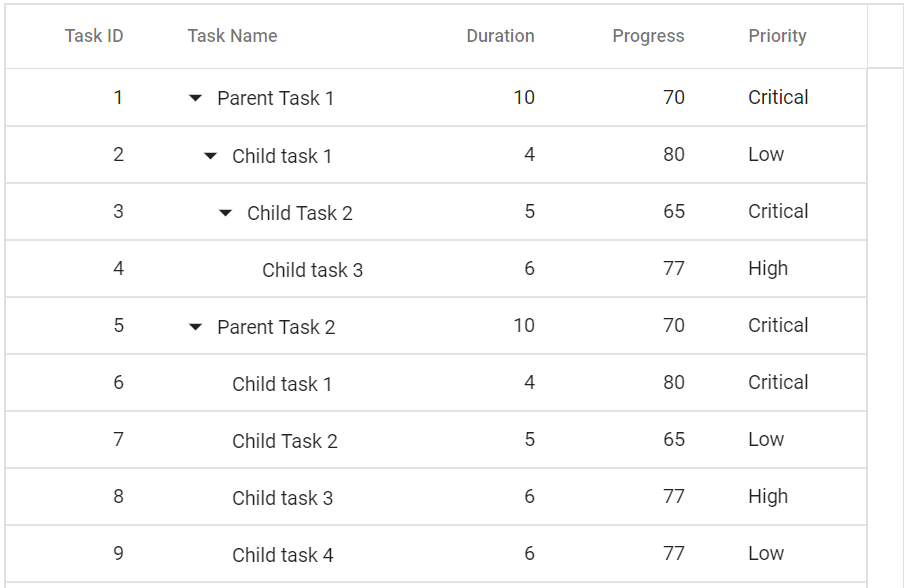
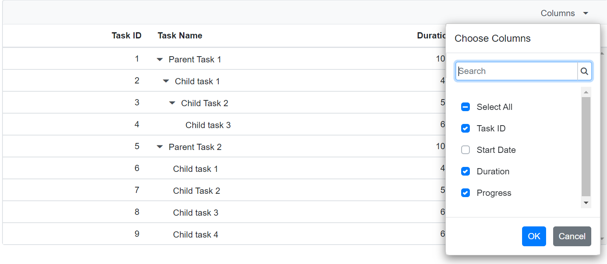
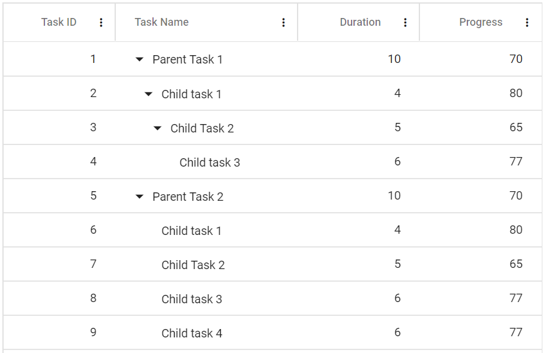
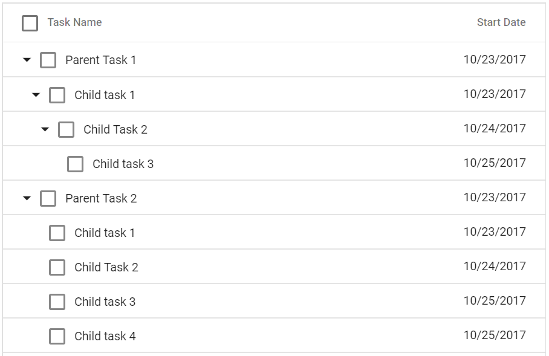
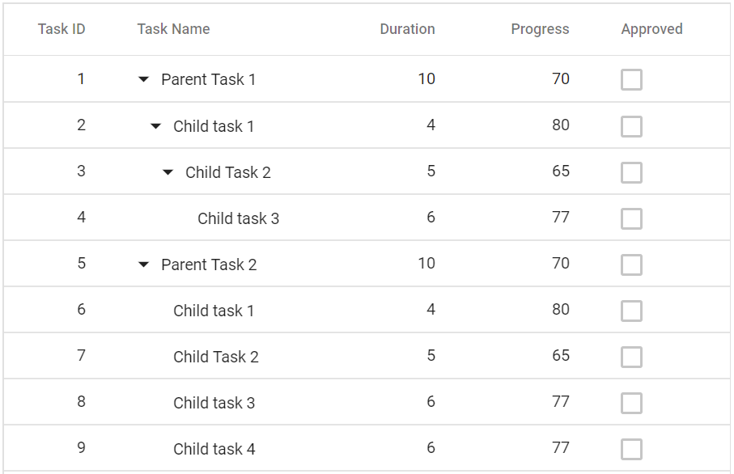

# Columns in Blazor TreeGrid Component

The column definitions are used as the datasource schema in the Tree Grid. This plays a vital role in rendering column values in the required format. The tree grid operations such as sorting, filtering and searching etc. are performed based on the column definitions. The [Field](https://help.syncfusion.com/cr/blazor/Syncfusion.Blazor~Syncfusion.Blazor.TreeGrid.TreeGridColumn~Field.html) property of [TreeGridColumns](https://help.syncfusion.com/cr/blazor/Syncfusion.Blazor~Syncfusion.Blazor.TreeGrid.TreeGridColumns.html) tag helper is necessary to map the data source values in Tree Grid columns.

> If the column [Field](https://help.syncfusion.com/cr/blazor/Syncfusion.Blazor~Syncfusion.Blazor.TreeGrid.TreeGridColumn~Field.html) is not specified in the dataSource, the column values will be empty. <br />[TreeColumnIndex](https://help.syncfusion.com/cr/blazor/Syncfusion.Blazor~Syncfusion.Blazor.TreeGrid.SfTreeGrid~TreeColumnIndex.html) property denotes the column that is used to expand and collapse child rows.

## Complex data binding

The complex data binding in the Tree Grid can be achieved by using the dot(.) operator in the column.field. In the below examples **Task.TaskName** and **Task.Duration** are complex data.

```cshtml
@using Syncfusion.Blazor.TreeGrid

<SfTreeGrid DataSource="@TreeData" AllowPaging="true" IdMapping="TaskId" ParentIdMapping="ParentId" TreeColumnIndex="1">
    <TreeGridColumns>
        <TreeGridColumn Field="TaskId" HeaderText="Task ID" Width="80" TextAlign="Syncfusion.Blazor.Grids.TextAlign.Right"></TreeGridColumn>
        <TreeGridColumn Field="Task.TaskName" HeaderText="Task Name" Width="160"></TreeGridColumn>
        <TreeGridColumn Field="Task.Duration" HeaderText="Duration" Width="100" TextAlign="Syncfusion.Blazor.Grids.TextAlign.Right"></TreeGridColumn>
        <TreeGridColumn Field="Progress" HeaderText="Progress" Width="100" TextAlign="Syncfusion.Blazor.Grids.TextAlign.Right"></TreeGridColumn>
        <TreeGridColumn Field="Priority" HeaderText="Priority" Width="80"></TreeGridColumn>
    </TreeGridColumns>
</SfTreeGrid>

@code{
    public class BusinessObject
    {
        public int TaskId { get; set; }
        public TaskDetails Task { get; set; }
        public int Progress { get; set; }
        public string Priority { get; set; }
        public int? ParentId { get; set; }
    }

    public class TaskDetails
    {
        public string TaskName { get; set; }
        public int Duration { get; set; }
    }
    public List<BusinessObject> TreeData = new List<BusinessObject>();
    protected override void OnInitialized()
    {
        TreeData.Add(new BusinessObject() { Task = new TaskDetails() { TaskName = "Parent Task 1", Duration = 50000 }, TaskId = 1, Progress = 70, ParentId = null, Priority = "High" });
        TreeData.Add(new BusinessObject() { Task = new TaskDetails() { TaskName = "Child task 1", Duration = 400000 }, TaskId = 2, Progress = 80, ParentId = 1, Priority = "Normal" });
        TreeData.Add(new BusinessObject() { Task = new TaskDetails() { TaskName = "Child Task 2", Duration = 500000 }, TaskId = 3, Progress = 65, ParentId = 1, Priority = "Critical" });
        TreeData.Add(new BusinessObject() { Task = new TaskDetails() { TaskName = "Parent Task 2", Duration = 50000 }, TaskId = 4, Progress = 70, ParentId = null, Priority = "High" });
        TreeData.Add(new BusinessObject() { Task = new TaskDetails() { TaskName = "Child task 1", Duration = 400000 }, TaskId = 5, Progress = 80, ParentId = 4, Priority = "Normal" });
        TreeData.Add(new BusinessObject() { Task = new TaskDetails() { TaskName = "Child Task 2", Duration = 500000 }, TaskId = 6, Progress = 65, ParentId = 4, Priority = "Critical" });

    }
}
```


### Expando data binding

Tree Grid supports Complex Data Binding with ExpandoObject. In the below examples **Task.TaskName** and **Task.Duration** are complex data with ExpandoObject.

```cshtml
@using Syncfusion.Blazor.TreeGrid;
@using System.Dynamic;

<SfTreeGrid DataSource="@TreeData" AllowPaging="true" IdMapping="TaskID" ParentIdMapping="ParentID" TreeColumnIndex="1">
    <TreeGridColumns>
        <TreeGridColumn Field="TaskID" HeaderText="Task ID" Width="80" TextAlign="Syncfusion.Blazor.Grids.TextAlign.Right"></TreeGridColumn>
        <TreeGridColumn Field="Task.TaskName" HeaderText="Task Name" Width="160"></TreeGridColumn>
        <TreeGridColumn Field="Task.Duration" HeaderText="Duration" Width="160" TextAlign="Syncfusion.Blazor.Grids.TextAlign.Right"></TreeGridColumn>
        <TreeGridColumn Field="Progress" HeaderText="Progress" Width="100" TextAlign="Syncfusion.Blazor.Grids.TextAlign.Right"></TreeGridColumn>
        <TreeGridColumn Field="Priority" HeaderText="Priority" Width="80"></TreeGridColumn>
    </TreeGridColumns>
</SfTreeGrid>
@code {
    public List<ExpandoObject> TreeData { get; set; }
    protected override void OnInitialized()
    {
        this.TreeData = GetData().ToList();
    }
    public static List<ExpandoObject> Data = new List<ExpandoObject>();
    public static int ParentRecordID { get; set; }
    public static int ChildRecordID { get; set; }
    public static List<ExpandoObject> GetData()
    {
        Data.Clear();
        ParentRecordID = 0;
        ChildRecordID = 0;
        for (var i = 1; i <= 2; i++)
        {

            dynamic ParentRecord = new ExpandoObject();
            dynamic Task = new ExpandoObject();
            Task.TaskName = "Parent Task " + i;
            Task.Duration = ParentRecordID % 2 == 0 ? 32 : 76;
            ParentRecord.TaskID = ++ParentRecordID;
            ParentRecord.Task = Task;
            ParentRecord.Progress = ParentRecordID % 2 == 0 ? "In Progress" : "Open";
            ParentRecord.Priority = ParentRecordID % 2 == 0 ? "High" : "Low";
            ParentRecord.ParentID = null;
            Data.Add(ParentRecord);
            AddChildRecords(ParentRecordID);
        }
        return Data;
    }
    public static void AddChildRecords(int ParentId)
    {
        for (var i = 1; i < 3; i++)
        {

            dynamic ChildRecord = new ExpandoObject();
            dynamic Task = new ExpandoObject();
            Task.TaskName = "Child Task " + ++ChildRecordID;
            Task.Duration = ParentRecordID % 3 == 0 ? 64 : 98;
            ChildRecord.TaskID = ++ParentRecordID;
            ChildRecord.Task = Task;
            ChildRecord.Progress = ParentRecordID % 3 == 0 ? "Validated" : "Closed";
            ChildRecord.Priority = ParentRecordID % 3 == 0 ? "Low" : "Critical";
            ChildRecord.ParentID = ParentId;
            Data.Add(ChildRecord);
        }
    }
}
```


## Header template

The header element can be customized by using the [HeaderTemplate](https://help.syncfusion.com/cr/blazor/Syncfusion.Blazor~Syncfusion.Blazor.TreeGrid.TreeGridColumn~HeaderTemplate.html) property.





@using TreeGridComponent.Data;
@using Syncfusion.Blazor.TreeGrid;

<SfTreeGrid  Height="400" DataSource="@TreeGridData" IdMapping="EmployeeID" ParentIdMapping="ParentId" TreeColumnIndex="0">
    <TreeGridColumns>
        <TreeGridColumn Field="Name" HeaderText="Name" Width="160">
            <HeaderTemplate>
                    <div>
                        <span class="e-icon-userlogin e-icons employee"></span> Name
                    </div>
            </HeaderTemplate>
        </TreeGridColumn>
        <TreeGridColumn Field="Designation" HeaderText="Designation" Width="120"></TreeGridColumn>
        <TreeGridColumn Field="EmpID" HeaderText="Progress" Width="80" TextAlign="Syncfusion.Blazor.Grids.TextAlign.Right"></TreeGridColumn>
        <TreeGridColumn Field="Country" HeaderText="Priority" Width="100"></TreeGridColumn>
        </TreeGridColumns>
</SfTreeGrid>

<style>

    @@font-face {
        font-family: 'ej2-headertemplate';
        src: url(data:application/x-font-ttf;charset=utf-8;base64,AAEAAAAKAIAAAwAgT1MvMj1vTFIAAAEoAAAAVmNtYXDS2c5qAAABjAAAAEBnbHlmQmNFrQAAAdQAAANoaGVhZBRdbkIAAADQAAAANmhoZWEIUQQEAAAArAAAACRobXR4DAAAAAAAAYAAAAAMbG9jYQCOAbQAAAHMAAAACG1heHABHgENAAABCAAAACBuYW1lohGZJQAABTwAAAKpcG9zdA2o3w0AAAfoAAAAQAABAAAEAAAAAFwEAAAAAAAD9AABAAAAAAAAAAAAAAAAAAAAAwABAAAAAQAATBXy9l8PPPUACwQAAAAAANillKkAAAAA2KWUqQAAAAAD9APzAAAACAACAAAAAAAAAAEAAAADAQEAEQAAAAAAAgAAAAoACgAAAP8AAAAAAAAAAQQAAZAABQAAAokCzAAAAI8CiQLMAAAB6wAyAQgAAAIABQMAAAAAAAAAAAAAAAAAAAAAAAAAAAAAUGZFZABA5wLpYAQAAAAAXAQAAAAAAAABAAAAAAAABAAAAAQAAAAEAAAAAAAAAgAAAAMAAAAUAAMAAQAAABQABAAsAAAABgAEAAEAAucC6WD//wAA5wLpYP//AAAAAAABAAYABgAAAAIAAQAAAAAAjgG0ABEAAAAAA8kD8wADAAcACwAPABMAFwAbAB8AIwAnACsALwAzADcAOwBPAGsAACUVIzUjFSM1IxUjNSMVIzUjFSM1JRUjNSMVIzUjFSM1IxUjNSMVIzUlFSM1IxUjNSMVIzUjFSM1IxUjNQMVHwYhPwcRITcjDwghNS8HIzUjFSE1IwN2U1NTU1RTU1NTAuxTU1NTVFNTU1MC7FNTU1NUU1NTU1QCAwUGBggIA0QICAcHBQQBAvxsp30ICAcHAgUDAQEDlAECBAUHBwgIfVP+YFOzU1NTU1NTU1NTU6dUVFRUVFRUVFRUplNTU1NTU1NTU1P+NgQIBwcGBAMCAQIEBQcHAwgCdPoBAgQFAwcHCIF8CQgHBgUEAgFTU1MABAAAAAAD9APeADQAbQCuAQAAAAEfCDc1Lwc1PwIPBy8HHww3HwQPATMVPwc1Lx0jDwMfAgUdAR8GBTUzLxQjDx0BFxUfEDsBPxA1Nyc1LxIPEhUCCg8OGxcVExANCgMBAQMDCQQDAgECAxESEhMTExUUFRQTFBISEhEHCwYHCAkKCw0NDw8SuQQGAwIBAgRxlgsKCQcGBAMBAgMDAwUFBQcGBwgICQkKCgsKDAsMDQwNDQ4NDg45BQUDAQEEA/1eAgUGBwkKCwHjeggKDhEUFxs1FRMSEA4NCwoJBwcJBjwODg0ODQ0MDQwLDAoLCgoJCQgIBwYHBQUFAwMDAgEBAQECAgYICg0ODxISFBUXFwwMDA0MDQwMFxcVFBISDw4MCwgGAgIBAQICAwcJCw0PERITFRUXDAwMDA0NDAwMDAsXFRQTEQ8ODQoIBgICAVQEAwgJCgsMCwwbEBAREREZEA8VDAwKCgoIBwYFAwIBAQIDBQYHCAoUFQwLCwsLCgoJCAcGMwsWFhUVHB3QAQIEBggICgueDg4ODg0NDA0MCwsLCwoKCQgJBwgGBwUFBAQDAwECCw8NDxETCrIlawsKCAgGBAIB0AoLCwoLCQgNCAkLDA0NDg4ODg4ZFAIBAwMEBAUGBgYIBwkICQoKCwsLDAwMDA0ODQ4ODgH7DQwMDBgWFRQTERAODAoIBgICAQECAgYICgwOEBETFBUWGAwMDA0MDQwMCxcWFRMSEA8NDAkHAwIBAQEBAQECAwMICwwOEBETFBUWFwwMDQAAAAASAN4AAQAAAAAAAAABAAAAAQAAAAAAAQASAAEAAQAAAAAAAgAHABMAAQAAAAAAAwASABoAAQAAAAAABAASACwAAQAAAAAABQALAD4AAQAAAAAABgASAEkAAQAAAAAACgAsAFsAAQAAAAAACwASAIcAAwABBAkAAAACAJkAAwABBAkAAQAkAJsAAwABBAkAAgAOAL8AAwABBAkAAwAkAM0AAwABBAkABAAkAPEAAwABBAkABQAWARUAAwABBAkABgAkASsAAwABBAkACgBYAU8AAwABBAkACwAkAacgZWoyLWhlYWRlcnRlbXBsYXRlUmVndWxhcmVqMi1oZWFkZXJ0ZW1wbGF0ZWVqMi1oZWFkZXJ0ZW1wbGF0ZVZlcnNpb24gMS4wZWoyLWhlYWRlcnRlbXBsYXRlRm9udCBnZW5lcmF0ZWQgdXNpbmcgU3luY2Z1c2lvbiBNZXRybyBTdHVkaW93d3cuc3luY2Z1c2lvbi5jb20AIABlAGoAMgAtAGgAZQBhAGQAZQByAHQAZQBtAHAAbABhAHQAZQBSAGUAZwB1AGwAYQByAGUAagAyAC0AaABlAGEAZABlAHIAdABlAG0AcABsAGEAdABlAGUAagAyAC0AaABlAGEAZABlAHIAdABlAG0AcABsAGEAdABlAFYAZQByAHMAaQBvAG4AIAAxAC4AMABlAGoAMgAtAGgAZQBhAGQAZQByAHQAZQBtAHAAbABhAHQAZQBGAG8AbgB0ACAAZwBlAG4AZQByAGEAdABlAGQAIAB1AHMAaQBuAGcAIABTAHkAbgBjAGYAdQBzAGkAbwBuACAATQBlAHQAcgBvACAAUwB0AHUAZABpAG8AdwB3AHcALgBzAHkAbgBjAGYAdQBzAGkAbwBuAC4AYwBvAG0AAAAAAgAAAAAAAAAKAAAAAAAAAAAAAAAAAAAAAAAAAAAAAAADAQIBAwEEAAtCVF9DYWxlbmRhcghlbXBsb3llZQAA) format('truetype');
        font-weight: normal;
        font-style: normal;
    }

    .e-grid .e-icon-userlogin::before {
        font-family: 'ej2-headertemplate';
        width: 15px !important;
        content: '\e702';
    }

    .e-grid .e-icon-calender::before {
        font-family: 'ej2-headertemplate';
        width: 15px !important;
        content: '\e960';
    }
</style>


@code{
    public Employee model = new Employee();
    public IEnumerable<Employee> TreeGridData { get; set; }
    protected override void OnInitialized()
    {
        this.TreeGridData = Employee.GetTemplateData();
    }
}





namespace TreeGridComponent.Data {

public class Employee
    {
        public string Name { get; set; }
        public string Designation { get; set; }
        public string EmpID { get; set; }
        public string Contact { get; set; }
        public int? ParentId { get; set; }
        public TreeData Treedata { get; set; }

        public static List<Employee> GetTemplateData()
        {
            List<Employee> DataCollection = new List<Employee>();
            DataCollection.Add(new Employee { Name = "Robert King",Designation = "Chief Executive Officer",EmpID = "EMP001",Country = "USA",ParentId = null,Treedata = new TreeData() { ID = 21}});
            DataCollection.Add(new Employee { Name = "David william",Designation = "Vice President",EmpID = "EMP004",Country = "USA",ParentId = 1,Treedata = new TreeData() { ID = 21 }});
            DataCollection.Add(new Employee { Name = "Nancy Davolio",Designation = "Marketing Executive",EmpID = "EMP035",Country = "USA",ParentId = 1,Treedata = new TreeData() { ID = 21 }});
            DataCollection.Add(new Employee { Name = "Andrew Fuller",Designation = "Sales Representative",EmpID = "EMP045",Country = "UK",ParentId = 1,Treedata = new TreeData() { ID = 21 }});
            DataCollection.Add(new Employee { Name = "Anne Dodsworth",FullName = "AnneDodsworth",Designation = "Sales Representative",EmployeeID = 5,EmpID = "EMP091",Country = "USA",ParentId = null,Treedata = new TreeData() { ID = 21 }});
            DataCollection.Add(new Employee { Name = "Michael Suyama",FullName = "MichaelSuyama",Designation = "Sales Representative",EmployeeID = 6,EmpID = "EMP110",Country = "UK",ParentId = 5,Treedata = new TreeData() { ID = 21 }});
            return DataCollection;
        }
    }
}








> For Templated Tree Grid component, [ModelType](./templates/#template-modeltype) property of Tree Grid should be defined.

## Header text

By default, column header title is displayed from column [Field](https://help.syncfusion.com/cr/blazor/Syncfusion.Blazor~Syncfusion.Blazor.TreeGrid.TreeGridColumn~Field.html) value. To override the default header title, define the [HeaderText](https://help.syncfusion.com/cr/blazor/Syncfusion.Blazor~Syncfusion.Blazor.TreeGrid.TreeGridColumn~HeaderText.html) value.





@using TreeGridComponent.Data;
@using Syncfusion.Blazor.TreeGrid;

<SfTreeGrid DataSource="@TreeGridData" IdMapping="TaskId" ParentIdMapping="ParentId" TreeColumnIndex="1">
    <TreeGridColumns>
        <TreeGridColumn Field="TaskId" HeaderText="Task ID" Width="80" TextAlign="Syncfusion.Blazor.Grids.TextAlign.Right"></TreeGridColumn>
        <TreeGridColumn Field="TaskName" HeaderText="Task Name" Width="160"></TreeGridColumn>
        <TreeGridColumn Field="Duration" HeaderText="Duration" Width="100" TextAlign="Syncfusion.Blazor.Grids.TextAlign.Right"></TreeGridColumn>
        <TreeGridColumn Field="Progress" HeaderText="Progress" Width="100" TextAlign="Syncfusion.Blazor.Grids.TextAlign.Right"></TreeGridColumn>
        <TreeGridColumn Field="Priority" HeaderText="Priority" Width="80"></TreeGridColumn>
    </TreeGridColumns>
</SfTreeGrid>

@code{

    public List<TreeData.BusinessObject> TreeGridData { get; set; }
    protected override void OnInitialized()
    {
        this.TreeGridData = TreeData.GetSelfDataSource().ToList();
    }
}





namespace TreeGridComponent.Data {

public class TreeData
    {
        public class BusinessObject
        {
            public int TaskId { get; set;}
            public string TaskName { get; set;}
            public int? Duration { get; set;}
            public int? Progress { get; set;}
            public string Priority { get; set;}
            public int? ParentId { get; set;}
        }

        public static List<BusinessObject> GetSelfDataSource()
        {
            List<BusinessObject> BusinessObjectCollection = new List<BusinessObject>();
            BusinessObjectCollection.Add(new BusinessObject() { TaskId = 1,TaskName = "Parent Task 1",Duration = 10,Progress = 70,Priority = "Critical",ParentId = null });
            BusinessObjectCollection.Add(new BusinessObject() { TaskId = 2,TaskName = "Child task 1",Duration = 6,Progress = 80,Priority = "Low",ParentId = 1 });
            BusinessObjectCollection.Add(new BusinessObject() { TaskId = 3,TaskName = "Child Task 2",Duration = 5,Progress = 65,Priority = "Critical",ParentId = 2 });
            BusinessObjectCollection.Add(new BusinessObject() { TaskId = 4,TaskName = "Child task 3",Duration = 6,Priority = "High",Progress = 77,ParentId = 3 });
            BusinessObjectCollection.Add(new BusinessObject() { TaskId = 5,TaskName = "Parent Task 2",Duration = 10,Progress = 70,Priority = "Critical",ParentId = null});
            BusinessObjectCollection.Add(new BusinessObject() { TaskId = 6,TaskName = "Child task 1",Duration = 4,Progress = 80,Priority = "Critical",ParentId = 5});
            BusinessObjectCollection.Add(new BusinessObject() { TaskId = 7,TaskName = "Child Task 2",Duration = 5,Progress = 65,Priority = "Low",ParentId = 5});
            BusinessObjectCollection.Add(new BusinessObject() { TaskId = 8,TaskName = "Child task 3",Duration = 6,Progress = 77,Priority = "High",ParentId = 5});
            BusinessObjectCollection.Add(new BusinessObject() { TaskId = 9,TaskName = "Child task 4",Duration = 6,Progress = 77,Priority = "Low",ParentId = 5});
            return BusinessObjectCollection;
        }
    }
}







> If both the [Field](https://help.syncfusion.com/cr/blazor/Syncfusion.Blazor~Syncfusion.Blazor.TreeGrid.TreeGridColumn~Field.html) and [HeaderText](https://help.syncfusion.com/cr/blazor/Syncfusion.Blazor~Syncfusion.Blazor.TreeGrid.TreeGridColumn~HeaderText.html) are not defined in the column, the column renders with **empty** header text.

## Format

To format cell values based on specific culture, use the [Format](https://help.syncfusion.com/cr/blazor/Syncfusion.Blazor~Syncfusion.Blazor.TreeGrid.TreeGridColumn~Format.html) property of the[TreeGridColumns](https://help.syncfusion.com/cr/blazor/Syncfusion.Blazor~Syncfusion.Blazor.TreeGrid.TreeGridColumns.html) tag helper. The Tree Grid uses **Internalization** library to format the number values.





@using TreeGridComponent.Data;
@using Syncfusion.Blazor.TreeGrid;

<SfTreeGrid DataSource="@TreeGridData" IdMapping="OrderID" ParentIdMapping="ParentId" TreeColumnIndex="1" >
    <TreeGridColumns>
        <TreeGridColumn Field="OrderID" HeaderText="Order ID" Width="80" TextAlign="Syncfusion.Blazor.Grids.TextAlign.Right"></TreeGridColumn>
        <TreeGridColumn Field="OrderName" HeaderText="Order Name" Width="160"></TreeGridColumn>
        <TreeGridColumn Field="Price" HeaderText="Price" Width="100" Format="C2" Type="Syncfusion.Blazor.Grids.ColumnType.Number" TextAlign="Syncfusion.Blazor.Grids.TextAlign.Right"></TreeGridColumn>
    </TreeGridColumns>
</SfTreeGrid>

@code{

    public List<TreeDataFormat> TreeGridData { get; set; }
    protected override void OnInitialized()
    {
        this.TreeGridData = TreeDataFormat.GetDataFormat().ToList();
    }
}





namespace TreeGridComponent.Data {

public class TreeDataFormat
{
    public TreeDataFormat() { }
    public int OrderID { get; set; }
    public string OrderName { get; set; }
    public double Price { get; set; }
    public int? ParentId { get; set; }
    
    public static List<TreeDataFormat> GetDataFormat()
    {
        List<TreeDataFormat> data = new List<TreeDataFormat>()
            {
                new TreeDataFormat() { OrderID= 1,OrderName= "Order 1",ParentId = null,Price=133.66 },
                new TreeDataFormat() { OrderID= 11, ParentId = 1, OrderName= "Mackerel", Price= 28.20},
                new TreeDataFormat() { OrderID= 12, ParentId = 1, OrderName= "Mackerel", Price= 25.92},
                new TreeDataFormat() { OrderID= 13, ParentId = 1, OrderName= "Mackerel", Price= 52.68},
                new TreeDataFormat() { OrderID= 14, ParentId = 1, OrderName= "Mackerel", Price= 11.25},
                new TreeDataFormat() { OrderID= 15, ParentId = 1, OrderName= "Mackerel", Price= 15.61},
                new TreeDataFormat() { OrderID= 2,OrderName= "Order 2",ParentId = null,Price=212.33},
                new TreeDataFormat() { OrderID= 21, ParentId = 2, OrderName= "Tilapias",Price= 55.50},
                new TreeDataFormat() { OrderID= 22, ParentId = 2, OrderName= "White Shrimp", Price= 41.70},
                new TreeDataFormat() { OrderID= 23, ParentId = 2, OrderName= "Fresh Cheese",Price= 39.20},
                new TreeDataFormat() { OrderID= 24, ParentId = 2, OrderName= "Blue Veined Cheese",Price= 38.76},
                new TreeDataFormat() { OrderID= 25, ParentId = 2, OrderName= "Butter", Price= 37.17}};
        return data;
    }
}
}





> By default, the number and date values are formatted in **en-US** locale.

### Number formatting

The number or integer values can be formatted using the below format strings.

Format |Description |Remarks
-----|-----|-----
N | Denotes numeric type. | The numeric format is followed by integer value as N2, N3. etc which denotes the number of precision to be allowed.
C | Denotes currency type. | The currency format is followed by integer value as C2, C3. etc which denotes the number of precision to be allowed.
P | Denotes percentage type | The percentage format expects the input value to be in the range of 0 to 100. For example the cell value *0.2* is formatted as *20%*. The percentage format is followed by integer value as P2, P3. etc which denotes the number of precision to be allowed.

<!-- Please refer to the link to know more about [`Number formatting`](../../common/internationalization/#number-formatting). -->

### Date formatting

The date values can be formatted using built-in date format string.

For built-in date format specify the [Format](https://help.syncfusion.com/cr/blazor/Syncfusion.Blazor~Syncfusion.Blazor.TreeGrid.TreeGridColumn~Format.html) property as string   (Example: *d*).
<!-- Please refer to the link to know more about [`Date formatting`](../../common/internationalization/#manipulating-datetime). -->





@using TreeGridComponent.Data;
@using Syncfusion.Blazor.TreeGrid;

<SfTreeGrid IdMapping="OrderID" ParentIdMapping="ParentId" DataSource="@TreeGridData" TreeColumnIndex="1" >
    <TreeGridColumns>
        <TreeGridColumn Field="OrderID" HeaderText="Order ID" Width="80" TextAlign="Syncfusion.Blazor.Grids.TextAlign.Right"></TreeGridColumn>
        <TreeGridColumn Field="OrderName" HeaderText="Order Name" Width="160"></TreeGridColumn>
        <TreeGridColumn Field="OrderDate" HeaderText="Order Date" Format="yMd" Type="Syncfusion.Blazor.Grids.ColumnType.Date" Width="160"></TreeGridColumn>
        <TreeGridColumn Field="Price" HeaderText="Price" Width="100" Format="C2" Type="Syncfusion.Blazor.Grids.ColumnType.Number" TextAlign="Syncfusion.Blazor.Grids.TextAlign.Right"></TreeGridColumn>
    </TreeGridColumns>
</SfTreeGrid>

@code{

    public List<TreeDataFormat> TreeGridData { get; set; }
    protected override void OnInitialized()
    {
        this.TreeGridData = TreeDataFormat.GetDataFormat().ToList();
    }
}





namespace TreeGridComponent.Data {

public class TreeDataFormat
{
    public TreeDataFormat() { }
    public int OrderID { get; set; }
    public string OrderName { get; set; }
    public double Price { get; set; }
    public DateTime? OrderDate { get; set; }
    public int? ParentId { get; set; }
    
    public static List<TreeDataFormat> GetDataFormat()
    {
        List<TreeDataFormat> data = new List<TreeDataFormat>()
            {
                new TreeDataFormat() { OrderID= 1,OrderName= "Order 1",OrderDate = new DateTime(1963, 2, 15),ParentId = null,Price=133.66 },
                new TreeDataFormat() { OrderID= 11, ParentId = 1, OrderName= "Mackerel",OrderDate = new DateTime(1966, 3, 19), Price= 28.20},
                new TreeDataFormat() { OrderID= 12, ParentId = 1, OrderName= "Mackerel",OrderDate = new DateTime(1963, 2, 15), Price= 25.92},
                new TreeDataFormat() { OrderID= 13, ParentId = 1, OrderName= "Mackerel", OrderDate = new DateTime(1966, 3, 19),Price= 52.68},
                new TreeDataFormat() { OrderID= 14, ParentId = 1, OrderName= "Mackerel",OrderDate = new DateTime(1963, 2, 15), Price= 11.25},
                new TreeDataFormat() { OrderID= 15, ParentId = 1, OrderName= "Mackerel", OrderDate = new DateTime(1980, 9, 20),Price= 15.61},
                new TreeDataFormat() { OrderID= 2,OrderName= "Order 2",ParentId = null,OrderDate = new DateTime(1980, 9, 20),Price=212.33},
                new TreeDataFormat() { OrderID= 21, ParentId = 2, OrderName= "Tilapias",OrderDate = new DateTime(1966, 3, 19),Price= 55.50},
                new TreeDataFormat() { OrderID= 22, ParentId = 2, OrderName= "White Shrimp",OrderDate = new DateTime(1963, 2, 15), Price= 41.70},
                new TreeDataFormat() { OrderID= 23, ParentId = 2, OrderName= "Fresh Cheese",OrderDate = new DateTime(1980, 9, 20),Price= 39.20},
                new TreeDataFormat() { OrderID= 24, ParentId = 2, OrderName= "Blue Veined Cheese",OrderDate = new DateTime(1966, 3, 19),Price= 38.76},
                new TreeDataFormat() { OrderID= 25, ParentId = 2, OrderName= "Butter",OrderDate = new DateTime(1966, 3, 19), Price= 37.17}};
        return data;
    }
}
}






## AutoFit specific columns

The **AutoFitColumns** method resizes the column to fit the widest cell's content without wrapping. A specific column can be autofitted at initial rendering by invoking the [AutoFitColumns](https://help.syncfusion.com/cr/blazor/Syncfusion.Blazor~Syncfusion.Blazor.TreeGrid.SfTreeGrid~AutoFitColumns.html) method in [DataBound](https://help.syncfusion.com/cr/blazor/Syncfusion.Blazor~Syncfusion.Blazor.TreeGrid.SfTreeGrid~DataBound.html) event.





@using TreeGridComponent.Data;
@using Syncfusion.Blazor.TreeGrid;

<SfTreeGrid @ref="TreeGrid" DataSource="@TreeGridData" IdMapping="TaskId" ParentIdMapping="ParentId" TreeColumnIndex="1">
    <TreeGridEvents DataBound="OnDataBound" TValue="TreeData.BusinessObject"></TreeGridEvents>
    <TreeGridColumns>
        <TreeGridColumn Field="TaskId" HeaderText="Task ID" Width="80" TextAlign="Syncfusion.Blazor.Grids.TextAlign.Right"></TreeGridColumn>
        <TreeGridColumn Field="TaskName" HeaderText="Task Name" Width="160"></TreeGridColumn>
        <TreeGridColumn Field="Duration" HeaderText="Duration" Width="100" TextAlign="Syncfusion.Blazor.Grids.TextAlign.Right"></TreeGridColumn>
        <TreeGridColumn Field="Progress" HeaderText="Progress" Width="100" TextAlign="Syncfusion.Blazor.Grids.TextAlign.Right"></TreeGridColumn>
        <TreeGridColumn Field="Priority" HeaderText="Priority" Width="80"></TreeGridColumn>
    </TreeGridColumns>
</SfTreeGrid>

@code{
    SfTreeGrid<TreeData.BusinessObject> TreeGrid;

    public List<TreeData.BusinessObject> TreeGridData { get; set; }
    protected override void OnInitialized()
    {
        this.TreeGridData = TreeData.GetSelfDataSource().ToList();
    }

    private void OnDataBound(object e)
    {
        this.TreeGrid.AutoFitColumns(new List<string>() { "TaskName" });
    }
}





namespace TreeGridComponent.Data {

public class TreeData
    {
        public class BusinessObject
        {
            public int TaskId { get; set;}
            public string TaskName { get; set;}
            public int? Duration { get; set;}
            public int? Progress { get; set;}
            public string Priority { get; set;}
            public int? ParentId { get; set;}
        }

        public static List<BusinessObject> GetSelfDataSource()
        {
            List<BusinessObject> BusinessObjectCollection = new List<BusinessObject>();
            BusinessObjectCollection.Add(new BusinessObject() { TaskId = 1,TaskName = "Parent Task 1",Duration = 10,Progress = 70,Priority = "Critical",ParentId = null });
            BusinessObjectCollection.Add(new BusinessObject() { TaskId = 2,TaskName = "Child task 1",Duration = 4,Progress = 80,Priority = "Low",ParentId = 1 });
            BusinessObjectCollection.Add(new BusinessObject() { TaskId = 3,TaskName = "Child Task 2",Duration = 5,Progress = 65,Priority = "Critical",ParentId = 2 });
            BusinessObjectCollection.Add(new BusinessObject() { TaskId = 4,TaskName = "Child task 3",Duration = 6,Priority = "High",Progress = 77,ParentId = 3 });
            BusinessObjectCollection.Add(new BusinessObject() { TaskId = 5,TaskName = "Parent Task 2",Duration = 10,Progress = 70,Priority = "Critical",ParentId = null});
            BusinessObjectCollection.Add(new BusinessObject() { TaskId = 6,TaskName = "Child task 1",Duration = 4,Progress = 80,Priority = "Critical",ParentId = 5});
            BusinessObjectCollection.Add(new BusinessObject() { TaskId = 7,TaskName = "Child Task 2",Duration = 5,Progress = 65,Priority = "Low",ParentId = 5});
            BusinessObjectCollection.Add(new BusinessObject() { TaskId = 8,TaskName = "Child task 3",Duration = 6,Progress = 77,Priority = "High",ParentId = 5});
            BusinessObjectCollection.Add(new BusinessObject() { TaskId = 9,TaskName = "Child task 4",Duration = 6,Progress = 77,Priority = "Low",ParentId = 5});
            return BusinessObjectCollection;
        }
    }
}







> All the columns can be autofitted by invoking the **AutoFitColumns** method without column names.

## Reorder

Reordering can be done by drag and drop of a particular column header from one index to another index within the treegrid. To enable reordering, set the [AllowReordering](https://help.syncfusion.com/cr/blazor/Syncfusion.Blazor~Syncfusion.Blazor.TreeGrid.SfTreeGrid~AllowReordering.html) to true.





@using TreeGridComponent.Data;
@using Syncfusion.Blazor.TreeGrid;

<SfTreeGrid IdMapping="TaskId" ParentIdMapping="ParentId" DataSource="@TreeGridData" TreeColumnIndex="1" AllowReordering="true">
    <TreeGridColumns>
        <TreeGridColumn Field="TaskId" HeaderText="Task ID" Width="80" TextAlign="Syncfusion.Blazor.Grids.TextAlign.Right"></TreeGridColumn>
        <TreeGridColumn Field="TaskName" HeaderText="Task Name" Width="90"></TreeGridColumn>
        <TreeGridColumn Field="StartDate" HeaderText=" Start Date" TextAlign="Syncfusion.Blazor.Grids.TextAlign.Right" Format="yMd" Type="Syncfusion.Blazor.Grids.ColumnType.Date" Width="90"></TreeGridColumn>
        <TreeGridColumn  Field="Duration" HeaderText="Duration" TextAlign="Syncfusion.Blazor.Grids.TextAlign.Right" Width="80"></TreeGridColumn>
    </TreeGridColumns>
</SfTreeGrid>

@code{
    public List<TreeData.BusinessObject> TreeGridData { get; set; }
    protected override void OnInitialized()
    {
        this.TreeGridData = TreeData.GetSelfDataSource().ToList();
    }
}





namespace TreeGridComponent.Data {

public class TreeData
    {
        public class BusinessObject
        {
            public int TaskId { get; set;}
            public string TaskName { get; set;}
            public DateTime? StartDate { get; set;}
            public int? Duration { get; set;}
            public int? ParentId { get; set;}
        }

        public static List<BusinessObject> GetSelfDataSource()
        {
            List<BusinessObject> BusinessObjectCollection = new List<BusinessObject>();
            BusinessObjectCollection.Add(new BusinessObject() { TaskId = 1,TaskName = "Parent Task 1",StartDate = new DateTime(2017, 10, 23),Duration = 10,ParentId = null });
            BusinessObjectCollection.Add(new BusinessObject() { TaskId = 2,TaskName = "Child task 1",StartDate = new DateTime(2017, 10, 23),Duration = 6,ParentId = 1 });
            BusinessObjectCollection.Add(new BusinessObject() { TaskId = 3,TaskName = "Child Task 2",StartDate = new DateTime(2017, 10, 24),Duration = 5,ParentId = 2 });
            BusinessObjectCollection.Add(new BusinessObject() { TaskId = 4,TaskName = "Child task 3",StartDate = new DateTime(2017, 10, 25),Duration = 6,ParentId = 3 });
            BusinessObjectCollection.Add(new BusinessObject() { TaskId = 5,TaskName = "Parent Task 2",StartDate = new DateTime(2017, 10, 23),Duration = 10,ParentId = null});
            BusinessObjectCollection.Add(new BusinessObject() { TaskId = 6,TaskName = "Child task 1",StartDate = new DateTime(2017, 10, 23),Duration = 4,ParentId = 5});
            BusinessObjectCollection.Add(new BusinessObject() { TaskId = 7,TaskName = "Child Task 2",StartDate = new DateTime(2017, 10, 24),Duration = 5,ParentId = 5});
            BusinessObjectCollection.Add(new BusinessObject() { TaskId = 8,TaskName = "Child task 3",StartDate = new DateTime(2017, 10, 25),Duration = 6,ParentId = 5});
            BusinessObjectCollection.Add(new BusinessObject() { TaskId = 9,TaskName = "Child task 4",StartDate = new DateTime(2017, 10, 25),Duration = 6,ParentId = 5});
            return BusinessObjectCollection;
        }
    }
}





> Reordering a particular column can be disabled by setting the [AllowReordering](https://help.syncfusion.com/cr/blazor/Syncfusion.Blazor~Syncfusion.Blazor.TreeGrid.SfTreeGrid~AllowReordering.html) property of [TreeGridColumns](https://help.syncfusion.com/cr/blazor/Syncfusion.Blazor~Syncfusion.Blazor.TreeGrid.TreeGridColumns.html) tag helper to false.

### Reorder multiple columns

Multiple columns can be reordered at a time by using the **ReorderColumns** method.





@using TreeGridComponent.Data;
@using Syncfusion.Blazor.TreeGrid;

<button id="reorderMultipleCols" @onclick="click">Reorder</button>

<SfTreeGrid @ref="TreeGrid" IdMapping="TaskId" ParentIdMapping="ParentId" DataSource="@TreeGridData" TreeColumnIndex="1" AllowReordering="true">
    <TreeGridColumns>
        <TreeGridColumn Field="TaskId" HeaderText="Task ID" Width="80" TextAlign="Syncfusion.Blazor.Grids.TextAlign.Right"></TreeGridColumn>
        <TreeGridColumn Field="TaskName" HeaderText="Task Name" Width="90"></TreeGridColumn>
        <TreeGridColumn Field="StartDate" HeaderText=" Start Date" TextAlign="Syncfusion.Blazor.Grids.TextAlign.Right" Format="yMd" Type="Syncfusion.Blazor.Grids.ColumnType.Date" Width="90"></TreeGridColumn>
        <TreeGridColumn Field="Duration" HeaderText="Duration" TextAlign="Syncfusion.Blazor.Grids.TextAlign.Right" Width="80"></TreeGridColumn>
        <TreeGridColumn Field="Progress" HeaderText="Progress" TextAlign="Syncfusion.Blazor.Grids.TextAlign.Right" Width="80"></TreeGridColumn>
    </TreeGridColumns>
</SfTreeGrid>

@code{
    SfTreeGrid<TreeData.BusinessObject> TreeGrid;
    public List<TreeData.BusinessObject> TreeGridData { get; set; }
    protected override void OnInitialized()
    {
        this.TreeGridData = TreeData.GetSelfDataSource().ToList();
    }
    private void click()
    {
        this.TreeGrid.ReorderColumns(new List<string>() { "TaskId", "Duration" }, "Progress");
    }
}





namespace TreeGridComponent.Data {

public class TreeData
    {
        public class BusinessObject
        {
            public int TaskId { get; set;}
            public string TaskName { get; set;}
            public DateTime? StartDate { get; set;}
            public int? Duration { get; set;}
            public int? Progress { get; set;}
            public int? ParentId { get; set;}
        }

        public static List<BusinessObject> GetSelfDataSource()
        {
            List<BusinessObject> BusinessObjectCollection = new List<BusinessObject>();
            BusinessObjectCollection.Add(new BusinessObject() { TaskId = 1,TaskName = "Parent Task 1",StartDate = new DateTime(2017, 10, 23),Duration = 10,Progress = 70,ParentId = null });
            BusinessObjectCollection.Add(new BusinessObject() { TaskId = 2,TaskName = "Child task 1",StartDate = new DateTime(2017, 10, 23),Duration = 6,Progress = 80,ParentId = 1 });
            BusinessObjectCollection.Add(new BusinessObject() { TaskId = 3,TaskName = "Child Task 2",StartDate = new DateTime(2017, 10, 24),Duration = 5,Progress = 65,ParentId = 2 });
            BusinessObjectCollection.Add(new BusinessObject() { TaskId = 4,TaskName = "Child task 3",StartDate = new DateTime(2017, 10, 25),Duration = 6,Progress = 77,ParentId = 3 });
            BusinessObjectCollection.Add(new BusinessObject() { TaskId = 5,TaskName = "Parent Task 2",StartDate = new DateTime(2017, 10, 23),Duration = 10,Progress = 70,ParentId = null});
            BusinessObjectCollection.Add(new BusinessObject() { TaskId = 6,TaskName = "Child task 1",StartDate = new DateTime(2017, 10, 23),Duration = 4,Progress = 80,ParentId = 5});
            BusinessObjectCollection.Add(new BusinessObject() { TaskId = 7,TaskName = "Child Task 2",StartDate = new DateTime(2017, 10, 24),Duration = 5,Progress = 65,ParentId = 5});
            BusinessObjectCollection.Add(new BusinessObject() { TaskId = 8,TaskName = "Child task 3",StartDate = new DateTime(2017, 10, 25),Duration = 6,Progress = 77,ParentId = 5});
            BusinessObjectCollection.Add(new BusinessObject() { TaskId = 9,TaskName = "Child task 4",StartDate = new DateTime(2017, 10, 25),Duration = 6,Progress = 77,ParentId = 5});
            return BusinessObjectCollection;
        }
    }
}





### Lock columns

Columns can be locked by using the [LockColumn](https://help.syncfusion.com/cr/blazor/Syncfusion.Blazor~Syncfusion.Blazor.TreeGrid.TreeGridColumn~LockColumn.html) property. The locked columns will be moved to the first position. Also this position can’t be reordered.

In the below example, Duration column is locked and its reordering functionality is disabled.





@using TreeGridComponent.Data;
@using Syncfusion.Blazor.TreeGrid;

<SfTreeGrid IdMapping="TaskId" ParentIdMapping="ParentId" DataSource="@TreeGridData" TreeColumnIndex="1" AllowReordering="true">
    <TreeGridColumns>
        <TreeGridColumn Field="TaskId" HeaderText="Task ID" Width="80" TextAlign="Syncfusion.Blazor.Grids.TextAlign.Right"></TreeGridColumn>
        <TreeGridColumn Field="TaskName" HeaderText="Task Name" Width="90"></TreeGridColumn>
        <TreeGridColumn Field="StartDate" HeaderText=" Start Date" TextAlign="Syncfusion.Blazor.Grids.TextAlign.Right" Format="yMd" Type="Syncfusion.Blazor.Grids.ColumnType.Date" Width="90"></TreeGridColumn>
        <TreeGridColumn Field="Duration" LockColumn="true" HeaderText="Duration" TextAlign="Syncfusion.Blazor.Grids.TextAlign.Right" Width="80"></TreeGridColumn>
        <TreeGridColumn Field="Progress" HeaderText="Progress" TextAlign="Syncfusion.Blazor.Grids.TextAlign.Right" Width="80"></TreeGridColumn>
    </TreeGridColumns>
</SfTreeGrid>

@code{
    public List<TreeData.BusinessObject> TreeGridData { get; set; }
    protected override void OnInitialized()
    {
        this.TreeGridData = TreeData.GetSelfDataSource().ToList();
    }
}





namespace TreeGridComponent.Data {

public class TreeData
    {
        public class BusinessObject
        {
            public int TaskId { get; set;}
            public string TaskName { get; set;}
            public DateTime? StartDate { get; set;}
            public int? Duration { get; set;}
            public int? Progress { get; set;}
            public int? ParentId { get; set;}
        }

        public static List<BusinessObject> GetSelfDataSource()
        {
            List<BusinessObject> BusinessObjectCollection = new List<BusinessObject>();
            BusinessObjectCollection.Add(new BusinessObject() { TaskId = 1,TaskName = "Parent Task 1",StartDate = new DateTime(2017, 10, 23),Duration = 10,Progress = 70,ParentId = null });
            BusinessObjectCollection.Add(new BusinessObject() { TaskId = 2,TaskName = "Child task 1",StartDate = new DateTime(2017, 10, 23),Duration = 4,Progress = 80,ParentId = 1 });
            BusinessObjectCollection.Add(new BusinessObject() { TaskId = 3,TaskName = "Child Task 2",StartDate = new DateTime(2017, 10, 24),Duration = 5,Progress = 65,ParentId = 2 });
            BusinessObjectCollection.Add(new BusinessObject() { TaskId = 4,TaskName = "Child task 3",StartDate = new DateTime(2017, 10, 25),Duration = 6,Progress = 77,ParentId = 3 });
            BusinessObjectCollection.Add(new BusinessObject() { TaskId = 5,TaskName = "Parent Task 2",StartDate = new DateTime(2017, 10, 23),Duration = 10,Progress = 70,ParentId = null});
            BusinessObjectCollection.Add(new BusinessObject() { TaskId = 6,TaskName = "Child task 1",StartDate = new DateTime(2017, 10, 23),Duration = 4,Progress = 80,ParentId = 5});
            BusinessObjectCollection.Add(new BusinessObject() { TaskId = 7,TaskName = "Child Task 2",StartDate = new DateTime(2017, 10, 24),Duration = 5,Progress = 65,ParentId = 5});
            BusinessObjectCollection.Add(new BusinessObject() { TaskId = 8,TaskName = "Child task 3",StartDate = new DateTime(2017, 10, 25),Duration = 6,Progress = 77,ParentId = 5});
            BusinessObjectCollection.Add(new BusinessObject() { TaskId = 9,TaskName = "Child task 4",StartDate = new DateTime(2017, 10, 25),Duration = 6,Progress = 77,ParentId = 5});
            return BusinessObjectCollection;
        }
    }
}






## Column resizing

Column width can be resized by clicking and dragging the right edge of the column header. While dragging, the width of the respective column will be resized immediately. Each column can be auto resized by double-clicking the right edge of the column header to fit the width of that column based on the widest cell content. To enable column resize, set the [AllowResizing](https://help.syncfusion.com/cr/blazor/Syncfusion.Blazor~Syncfusion.Blazor.TreeGrid.SfTreeGrid~AllowResizing.html) property to true.





@using TreeGridComponent.Data;
@using Syncfusion.Blazor.TreeGrid;

<SfTreeGrid IdMapping="TaskId" ParentIdMapping="ParentId" DataSource="@TreeGridData" TreeColumnIndex="1" AllowResizing="true">
    <TreeGridColumns>
        <TreeGridColumn Field="TaskId" HeaderText="Task ID" Width="80" TextAlign="Syncfusion.Blazor.Grids.TextAlign.Right"></TreeGridColumn>
        <TreeGridColumn Field="TaskName" HeaderText="Task Name" Width="90"></TreeGridColumn>
        <TreeGridColumn Field="StartDate" HeaderText=" Start Date" TextAlign="Syncfusion.Blazor.Grids.TextAlign.Right" Format="yMd" Type="Syncfusion.Blazor.Grids.ColumnType.Date" Width="90"></TreeGridColumn>
        <TreeGridColumn Field="Duration" LockColumn="true" HeaderText="Duration" TextAlign="Syncfusion.Blazor.Grids.TextAlign.Right" Width="80"></TreeGridColumn>
        <TreeGridColumn Field="Progress" HeaderText="Progress" TextAlign="Syncfusion.Blazor.Grids.TextAlign.Right" Width="80"></TreeGridColumn>
    </TreeGridColumns>
</SfTreeGrid>

@code{
    public List<TreeData.BusinessObject> TreeGridData { get; set; }
    protected override void OnInitialized()
    {
        this.TreeGridData = TreeData.GetSelfDataSource().ToList();
    }
}





namespace TreeGridComponent.Data {

public class TreeData
    {
        public class BusinessObject
        {
            public int TaskId { get; set;}
            public string TaskName { get; set;}
            public DateTime? StartDate { get; set;}
            public int? Duration { get; set;}
            public int? Progress { get; set;}
            public int? ParentId { get; set;}
        }

        public static List<BusinessObject> GetSelfDataSource()
        {
            List<BusinessObject> BusinessObjectCollection = new List<BusinessObject>();
            BusinessObjectCollection.Add(new BusinessObject() { TaskId = 1,TaskName = "Parent Task 1",StartDate = new DateTime(2017, 10, 23),Duration = 10,Progress = 70,ParentId = null });
            BusinessObjectCollection.Add(new BusinessObject() { TaskId = 2,TaskName = "Child task 1",StartDate = new DateTime(2017, 10, 23),Duration = 4,Progress = 80,ParentId = 1 });
            BusinessObjectCollection.Add(new BusinessObject() { TaskId = 3,TaskName = "Child Task 2",StartDate = new DateTime(2017, 10, 24),Duration = 5,Progress = 65,ParentId = 2 });
            BusinessObjectCollection.Add(new BusinessObject() { TaskId = 4,TaskName = "Child task 3",StartDate = new DateTime(2017, 10, 25),Duration = 6,Progress = 77,ParentId = 3 });
            BusinessObjectCollection.Add(new BusinessObject() { TaskId = 5,TaskName = "Parent Task 2",StartDate = new DateTime(2017, 10, 23),Duration = 10,Progress = 70,ParentId = null});
            BusinessObjectCollection.Add(new BusinessObject() { TaskId = 6,TaskName = "Child task 1",StartDate = new DateTime(2017, 10, 23),Duration = 4,Progress = 80,ParentId = 5});
            BusinessObjectCollection.Add(new BusinessObject() { TaskId = 7,TaskName = "Child Task 2",StartDate = new DateTime(2017, 10, 24),Duration = 5,Progress = 65,ParentId = 5});
            BusinessObjectCollection.Add(new BusinessObject() { TaskId = 8,TaskName = "Child task 3",StartDate = new DateTime(2017, 10, 25),Duration = 6,Progress = 77,ParentId = 5});
            BusinessObjectCollection.Add(new BusinessObject() { TaskId = 9,TaskName = "Child task 4",StartDate = new DateTime(2017, 10, 25),Duration = 6,Progress = 77,ParentId = 5});
            return BusinessObjectCollection;
        }
    }
}





> * Resizing for a particular column can be disabled by setting the [AllowResizing](https://help.syncfusion.com/cr/blazor/Syncfusion.Blazor~Syncfusion.Blazor.TreeGrid.TreeGridColumn~AllowResizing.html) property of the [TreeGridColumns](https://help.syncfusion.com/cr/blazor/Syncfusion.Blazor~Syncfusion.Blazor.TreeGrid.TreeGridColumns.html) tag helper to false.
> * In RTL mode, click and drag the left edge of the header cell to resize the column.

### Min and max width

Column resize can be restricted between minimum and maximum width by defining the [MinWidth](https://help.syncfusion.com/cr/blazor/Syncfusion.Blazor~Syncfusion.Blazor.TreeGrid.TreeGridColumn~MinWidth.html) and [MaxWidth](https://help.syncfusion.com/cr/blazor/Syncfusion.Blazor~Syncfusion.Blazor.TreeGrid.TreeGridColumn~MaxWidth.html) properties of the [TreeGridColumns](https://help.syncfusion.com/cr/blazor/Syncfusion.Blazor~Syncfusion.Blazor.TreeGrid.TreeGridColumns.html) tag helper.

In the following sample, minimum and maximum width are defined for **Duration**, and **Task Name** columns.





@using TreeGridComponent.Data;
@using Syncfusion.Blazor.TreeGrid;

<SfTreeGrid IdMapping="TaskId" ParentIdMapping="ParentId" DataSource="@TreeGridData" TreeColumnIndex="1" AllowResizing="true">
    <TreeGridColumns>
        <TreeGridColumn Field="TaskId" HeaderText="Task ID" Width="80" TextAlign="Syncfusion.Blazor.Grids.TextAlign.Right"></TreeGridColumn>
        <TreeGridColumn Field="TaskName" HeaderText="Task Name" MinWidth="170" MaxWidth="250" Width="180"></TreeGridColumn>
        <TreeGridColumn Field="Duration" HeaderText="Duration" MinWidth="50" MaxWidth="150" TextAlign="Syncfusion.Blazor.Grids.TextAlign.Right" Width="80"></TreeGridColumn>
        <TreeGridColumn Field="Progress" HeaderText="Progress" TextAlign="Syncfusion.Blazor.Grids.TextAlign.Right" Width="80"></TreeGridColumn>
        <TreeGridColumn Field="Priority " HeaderText="Priority " TextAlign="Syncfusion.Blazor.Grids.TextAlign.Right" Width="80"></TreeGridColumn>
    </TreeGridColumns>
</SfTreeGrid>

@code{
    public List<TreeData.BusinessObject> TreeGridData { get; set; }
    protected override void OnInitialized()
    {
        this.TreeGridData = TreeData.GetSelfDataSource().ToList();
    }
}





namespace TreeGridComponent.Data {

public class TreeData
    {
        public class BusinessObject
        {
            public int TaskId { get; set;}
            public string TaskName { get; set;}
            public int? Duration { get; set;}
            public int? Progress { get; set;}
            public int? ParentId { get; set;}
            public string Priority { get; set;}
        }

        public static List<BusinessObject> GetSelfDataSource()
        {
            List<BusinessObject> BusinessObjectCollection = new List<BusinessObject>();
            BusinessObjectCollection.Add(new BusinessObject() { TaskId = 1,TaskName = "Parent Task 1",Duration = 10,Progress = 70,Priority = "Critical",ParentId = null });
            BusinessObjectCollection.Add(new BusinessObject() { TaskId = 2,TaskName = "Child task 1",Duration = 6,Progress = 80,Priority = "Low",ParentId = 1 });
            BusinessObjectCollection.Add(new BusinessObject() { TaskId = 3,TaskName = "Child Task 2",Duration = 5,Progress = 65,Priority = "Critical",ParentId = 2 });
            BusinessObjectCollection.Add(new BusinessObject() { TaskId = 4,TaskName = "Child task 3",Duration = 6,Priority = "High",Progress = 77,ParentId = 3 });
            BusinessObjectCollection.Add(new BusinessObject() { TaskId = 5,TaskName = "Parent Task 2",Duration = 10,Progress = 70,Priority = "Critical",ParentId = null});
            BusinessObjectCollection.Add(new BusinessObject() { TaskId = 6,TaskName = "Child task 1",Duration = 4,Progress = 80,Priority = "Critical",ParentId = 5});
            BusinessObjectCollection.Add(new BusinessObject() { TaskId = 7,TaskName = "Child Task 2",Duration = 5,Progress = 65,Priority = "Low",ParentId = 5});
            BusinessObjectCollection.Add(new BusinessObject() { TaskId = 8,TaskName = "Child task 3",Duration = 6,Progress = 77,Priority = "High",ParentId = 5});
            BusinessObjectCollection.Add(new BusinessObject() { TaskId = 9,TaskName = "Child task 4",Duration = 6,Progress = 77,Priority = "Low",ParentId = 5});
            return BusinessObjectCollection;
        }
    }
}





### Resize stacked column

Stacked columns can be resized by clicking and dragging the right edge of the stacked column header. While dragging, the width of the respective child columns will be resized at the same time. Resize for a particular stacked column can be disabled by setting the [AllowResizing](https://help.syncfusion.com/cr/blazor/Syncfusion.Blazor~Syncfusion.Blazor.TreeGrid.TreeGridColumn~AllowResizing.html) as **false** to its columns.





@using TreeGridComponent.Data;
@using Syncfusion.Blazor.TreeGrid;

<SfTreeGrid IdMapping="ID" ParentIdMapping="ParentID" DataSource="@TreeGridData" TreeColumnIndex="1" AllowResizing="true">
    <TreeGridColumns>
        <TreeGridColumn HeaderText="Order Details" TextAlign="Syncfusion.Blazor.Grids.TextAlign.Right">
            <TreeGridColumns>
                <TreeGridColumn Field="ID" Width="110" HeaderText="Order ID" TextAlign="Syncfusion.Blazor.Grids.TextAlign.Right"></TreeGridColumn>
                <TreeGridColumn Field="Name" Width="220" HeaderText="Order Name" TextAlign="Syncfusion.Blazor.Grids.TextAlign.Left"></TreeGridColumn>
                <TreeGridColumn Field="OrderDate" Width="120" HeaderText="Order Date" TextAlign="Syncfusion.Blazor.Grids.TextAlign.Right" Format="yMd" Type="Syncfusion.Blazor.Grids.ColumnType.Date"></TreeGridColumn>
            </TreeGridColumns>
        </TreeGridColumn>
        <TreeGridColumn HeaderText="Shipment Details" TextAlign="Syncfusion.Blazor.Grids.TextAlign.Center">
            <TreeGridColumns>
                <TreeGridColumn Field="ShipmentCategory" Width="170" HeaderText="Shipment Category"></TreeGridColumn>
                <TreeGridColumn Field="Units" Width="220" HeaderText="Units" TextAlign="Syncfusion.Blazor.Grids.TextAlign.Left"></TreeGridColumn>
                <TreeGridColumn Field="ShippedDate" Width="120" HeaderText="Shipment Date" TextAlign="Syncfusion.Blazor.Grids.TextAlign.Right" Format="yMd" Type="Syncfusion.Blazor.Grids.ColumnType.Date"></TreeGridColumn>
            </TreeGridColumns>
        </TreeGridColumn>
        <TreeGridColumn HeaderText="Price Details" TextAlign="Syncfusion.Blazor.Grids.TextAlign.Center">
            <TreeGridColumns>
                <TreeGridColumn Field="UnitPrice" Width="180" HeaderText="Price per unit" Format="C2" Type="Syncfusion.Blazor.Grids.ColumnType.Number" TextAlign="Syncfusion.Blazor.Grids.TextAlign.Right"></TreeGridColumn>
                <TreeGridColumn Field="Price" Width="220" HeaderText="Price" Format="C" TextAlign="Syncfusion.Blazor.Grids.TextAlign.Left"></TreeGridColumn>
                <TreeGridColumn Field="OrderDate" Width="120" HeaderText="Total Price" TextAlign="Syncfusion.Blazor.Grids.TextAlign.Right" Type="Syncfusion.Blazor.Grids.ColumnType.Number"></TreeGridColumn>
            </TreeGridColumns>
        </TreeGridColumn>
    </TreeGridColumns>
</SfTreeGrid>

@code{
    public List<ShipmentData> TreeGridData { get; set; }
    protected override void OnInitialized()
    {
        this.TreeGridData = ShipmentData.GetShipmentData().ToList();
    }
}





namespace TreeGridComponent.Data {

public class ShipmentData
{
    public int ID { get; set; }
    public string Name { get; set; }
    public int Units { get; set; }
    public string Category { get; set; }
    public int UnitPrice { get; set; }
    public int Price { get; set; }
    public int? ParentID { get; set; }
    public string ShipmentCategory { get; set; }
    public DateTime ShippedDate { get; set; }
    public DateTime OrderDate { get; set; }
    public List<ShipmentData> Children { get; set; }

    public static List<ShipmentData> GetShipmentData()
    {
        List<ShipmentData> DataCollection = new List<ShipmentData>() {

        new ShipmentData() { ID = 1,Name = "Order 1",Category = "Seafood",Units = 1395,UnitPrice = 47,Price = 65565,ParentID = null,OrderDate = new DateTime(2017, 3, 2),ShippedDate = new DateTime(2017, 9, 2),ShipmentCategory = "Seafood"},
        new ShipmentData() { ID = 11,Name = "Mackerel",Category = "Frozen Seafood",Units = 235,UnitPrice = 12,Price = 2820,ParentID = 1,OrderDate = new DateTime(2017, 3, 3),ShippedDate = new DateTime(2017, 10, 3),ShipmentCategory = "Frozen Seafood"},
        new ShipmentData() { ID = 12,Name = "Yellowfin Tuna",Category = "Frozen Seafood",Units = 324,UnitPrice = 8,Price = 2592,ParentID = 1,OrderDate = new DateTime(2017, 3, 5),ShippedDate = new DateTime(2017, 10, 5),ShipmentCategory = "Frozen Seafood"},
        new ShipmentData() { ID = 13,Name = "Herrings",Category = "Frozen Seafood",Units = 488,UnitPrice = 11,Price = 5368,ParentID = 1,OrderDate = new DateTime(2017, 8, 5),ShippedDate = new DateTime(2017, 5, 15),ShipmentCategory = "Frozen Seafood"},
        new ShipmentData() { ID = 14,Name = "Preserved Olives",Category = "Edible",Units = 125,UnitPrice = 9,Price = 1125,ParentID = 1,OrderDate = new DateTime(2017, 6, 10),ShippedDate = new DateTime(2017, 6, 17),ShipmentCategory = "Edible"},
        new ShipmentData() { ID = 15,Name = " Sweet corn Frozen ",Category = "Edible",Units = 223,UnitPrice = 7,Price = 1561,ParentID = 1,OrderDate = new DateTime(2017, 7, 12),ShippedDate = new DateTime(2017, 7, 19),ShipmentCategory = "Edible"},
        new ShipmentData() { ID = 2,Name = "Order 2",Category = "Products",Units = 1944,UnitPrice = 58,Price = 21233,ParentID = null,OrderDate = new DateTime(2017, 1, 10),ShippedDate = new DateTime(2017, 1, 16),ShipmentCategory = "Seafood",Children = new List<ShipmentData>()},
        new ShipmentData() { ID = 21,Name = "Tilapias",Category = "Frozen Seafood",Units = 278,UnitPrice = 15,Price = 4170,ParentID = 2,OrderDate = new DateTime(2017, 2, 5),ShippedDate = new DateTime(2017, 2, 12),ShipmentCategory = "Frozen Seafood"},
        new ShipmentData() { ID = 22,Name = "White Shrimp",Category = "Frozen Seafood",Units = 560,UnitPrice = 7,Price = 3920,ParentID = 2,OrderDate = new DateTime(2017, 5, 22),ShippedDate = new DateTime(2017, 5, 29),ShipmentCategory = "Frozen Seafood"},
        new ShipmentData() { ID = 23,Name = "Fresh Cheese",Category = "Dairy",Units = 323,UnitPrice = 12,Price = 3876,ParentID = 2,OrderDate = new DateTime(2017, 6, 8),ShippedDate = new DateTime(2017, 6, 15),ShipmentCategory = "Dairy"},
        new ShipmentData() { ID = 24,Name = "Blue Veined Cheese",Category = "Dairy",Units = 370,UnitPrice = 15,Price = 5550,ParentID = 2,OrderDate = new DateTime(2017, 7, 10),ShippedDate = new DateTime(2017, 7, 17),ShipmentCategory = "Dairy"},
        new ShipmentData() { ID = 25,Name = "Butter",Category = "Dairy",Units = 413,UnitPrice = 9,Price = 3717,ParentID = 2,OrderDate = new DateTime(2017, 9, 18),ShippedDate = new DateTime(2017, 9, 25),ShipmentCategory = "Dairy"}
        };
        return DataCollection;
    }
}
}





### Touch interaction

When the right edge of the header cell is tapped, a floating handler will be visible over the right border of the column. To resize the column, tap and drag the floating handler as needed.

<!-- markdownlint-disable MD033 -->

<!-- markdownlint-enable MD033 -->

## Column template

The column [Template](https://help.syncfusion.com/cr/blazor/Syncfusion.Blazor~Syncfusion.Blazor.TreeGrid.TreeGridColumn~Template.html) has options to display custom element instead of a field value in the column.





@using TreeGridComponent.Data;
@using Syncfusion.Blazor.TreeGrid;
@inject Microsoft.AspNetCore.Components.NavigationManager UriHelper

<SfTreeGrid Height="400" DataSource="@TreeGridData" IdMapping="EmployeeID" ParentIdMapping="ParentId" TreeColumnIndex="0">
    <TreeGridColumns>
        <TreeGridColumn Field="Name" HeaderText="Name" Width="160"></TreeGridColumn>
        <TreeGridColumn HeaderText="Employee Image" Width="80">
            <Template>
                @{
                    var employee = (context as Employee);
                    <div class="image">
                        
                    </div>
                }
            </Template>
        </TreeGridColumn>
        <TreeGridColumn Field="DOB" HeaderText="DOB" Width="10" Type="Syncfusion.Blazor.Grids.ColumnType.Date" Format="yMd"></TreeGridColumn>
        <TreeGridColumn Field="Designation" HeaderText="Designation" Width="120"></TreeGridColumn>
        <TreeGridColumn Field="EmployeeID" HeaderText="Employee ID" Width="80" TextAlign="Syncfusion.Blazor.Grids.TextAlign.Right"></TreeGridColumn>
        <TreeGridColumn Field="Country" HeaderText="Country" Width="100"></TreeGridColumn>
        </TreeGridColumns>
</SfTreeGrid>

@code{
    public Employee model = new Employee();
    public IEnumerable<Employee> TreeGridData { get; set; }
    protected override void OnInitialized()
    {
        this.TreeGridData = Employee.GetTemplateData();
    }
}





namespace TreeGridComponent.Data {

public class Employee
    {
        public string Name { get; set; }
        public string FullName { get; set; }
        public DateTime? DOB { get; set; }
        public string Designation { get; set; }
        public string EmpID { get; set; }
        public int? EmployeeID { get; set; }
        public string Country { get; set; }
        public string Address { get; set; }
        public string Contact { get; set; }
        public int? ParentId { get; set; }
        public TreeData Treedata { get; set; }

        public static List<Employee> GetTemplateData()
        {
            List<Employee> DataCollection = new List<Employee>();

            DataCollection.Add(new Employee { Name = "Robert King",FullName = "RobertKing",Designation = "Chief Executive Officer",EmployeeID = 1,EmpID = "EMP001",Address = "507 - 20th Ave. E.Apt. 2A, Seattle",Contact = "(206) 555-9857",Country = "USA",DOB = new DateTime(1963, 2, 15),ParentId = null,Treedata = new TreeData() { ID = 21}});
            DataCollection.Add(new Employee { Name = "David william",FullName = "DavidWilliam",Designation = "Vice President",EmployeeID = 2,EmpID = "EMP004",Address = "722 Moss Bay Blvd., Kirkland",Contact = "(206) 555-3412",Country = "USA",DOB = new DateTime(1971, 5, 20),ParentId = 1,Treedata = new TreeData() { ID = 21 }});
            DataCollection.Add(new Employee { Name = "Nancy Davolio",FullName = "NancyDavolio",Designation = "Marketing Executive",EmployeeID = 3,EmpID = "EMP035",Address = "4110 Old Redmond Rd., Redmond",Contact = "(206) 555-8122",Country = "USA",DOB = new DateTime(1966, 3, 19),ParentId = 1,Treedata = new TreeData() { ID = 21 }});
            DataCollection.Add(new Employee { Name = "Andrew Fuller",FullName = "AndrewFuller",Designation = "Sales Representative",EmployeeID = 4,EmpID = "EMP045",Country = "UK",DOB = new DateTime(1980, 9, 20),ParentId = 1,Treedata = new TreeData() { ID = 21 }});
            DataCollection.Add(new Employee { Name = "Anne Dodsworth",FullName = "AnneDodsworth",Designation = "Sales Representative",EmployeeID = 5,EmpID = "EMP091",Country = "USA",ParentId = null,Treedata = new TreeData() { ID = 21 }});
            DataCollection.Add(new Employee { Name = "Michael Suyama",FullName = "MichaelSuyama",Designation = "Sales Representative",EmployeeID = 6,EmpID = "EMP110",Country = "UK",ParentId = 5,Treedata = new TreeData() { ID = 21 }});
            return DataCollection;
        }
    }
}






> * Tree Grid actions such as editing, filtering and sorting etc. will depend upon the column [Field](https://help.syncfusion.com/cr/blazor/Syncfusion.Blazor~Syncfusion.Blazor.TreeGrid.TreeGridColumn~Field.html). If the [Field](https://help.syncfusion.com/cr/blazor/Syncfusion.Blazor~Syncfusion.Blazor.TreeGrid.TreeGridColumn~Field.html) is not specified in the
template column, the tree grid actions cannot be performed.
> * For Templated Tree Grid component, [ModelType](./templates/#template-modeltype) property of Tree Grid should be defined.

### Using condition template

The template elements can be rendered based on condition.

In the following code, checkbox is rendered based on **Duration** field value.





@using TreeGridComponent.Data;
@using Syncfusion.Blazor.TreeGrid;
@using Syncfusion.Blazor.Buttons;

<SfTreeGrid DataSource="@TreeGridData"  Id="TreeGrid" AllowPaging="true" ParentIdMapping="ParentID" IdMapping="TaskID" TreeColumnIndex="2">
        <TreeGridColumns>
            <TreeGridColumn HeaderText="Template Column" Width="90">
                <Template>
                    @{
                        var tempColumn= (context as SelfReferenceData);
                        @if (tempColumn.Duration > 1)
                        {
                            <SfCheckBox Checked="true"></SfCheckBox>
                        }
                        else
                        {
                            <SfCheckBox Checked="false"></SfCheckBox>
                        }
                    }
                </Template>
            </TreeGridColumn>
            <TreeGridColumn Field="TaskID" HeaderText="Task ID" IsPrimaryKey="true" Width="60"></TreeGridColumn>
            <TreeGridColumn Field="TaskName" HeaderText="Task Name" Width="120"></TreeGridColumn>
            <TreeGridColumn Field="StartDate" HeaderText=" Start Date" Type="Syncfusion.Blazor.Grids.ColumnType.Date" Format="yMd" Width="90" TextAlign="Syncfusion.Blazor.Grids.TextAlign.Right"></TreeGridColumn>
            <TreeGridColumn Field="Duration" HeaderText="Duration" Width="80" TextAlign="Syncfusion.Blazor.Grids.TextAlign.Right"></TreeGridColumn>
            <TreeGridColumn Field="Progress" HeaderText="Progress" TextAlign="Syncfusion.Blazor.Grids.TextAlign.Right" Width="80"></TreeGridColumn>
        </TreeGridColumns>
</SfTreeGrid>


@code{
    public SelfReferenceData model = new SelfReferenceData();
    public List<SelfReferenceData> TreeGridData { get; set; }
    protected override void OnInitialized()
    {
        this.TreeGridData = SelfReferenceData.GetTree().ToList();
    }
}





namespace TreeGridComponent.Data {

public class SelfReferenceData
{
    public static List<SelfReferenceData> tree = new List<SelfReferenceData>();
    [Key]
    public int TaskID { get; set; }
    public string TaskName { get; set; }
    public DateTime StartDate { get; set; }
    public String Progress { get; set; }
    public int Duration { get; set; }
    public int? ParentID { get; set; }
    public SelfReferenceData() { }

    public static List<SelfReferenceData> GetTree()
    {
        if (tree.Count == 0)
        {
            int root = -1;
            for (var t = 1; t <= 60; t++)
            {
                Random ran = new Random();
                string math = (ran.Next() % 3) == 0 ? "High" : (ran.Next() % 2) == 0 ? "Release Breaker" : "Critical";
                string progr = (ran.Next() % 3) == 0 ? "Started" : (ran.Next() % 2) == 0 ? "Open" : "In Progress";
                root++;
                int rootItem = tree.Count + root + 1;
                tree.Add(new SelfReferenceData() { TaskID = rootItem, TaskName = "Parent Task " + rootItem.ToString(), StartDate = new DateTime(1992, 06, 07), ParentID = null, Progress = progr, Priority = math, Duration = ran.Next(1, 50) });
                int parent = tree.Count;
                for (var c = 0; c < 10; c++)
                {
                    root++;
                    string val = ((parent + c + 1) % 3 == 0) ? "Low" : "Critical";
                    int parn = parent + c + 1;
                    progr = (ran.Next() % 3) == 0 ? "In Progress" : (ran.Next() % 2) == 0 ? "Open" : "Validated";
                    int iD = tree.Count + root + 1;
                    tree.Add(new SelfReferenceData() { TaskID = iD, TaskName = "Child Task " + iD.ToString(), StartDate = new DateTime(1992, 06, 07), ParentID = rootItem, Progress = progr, Priority = val, Duration = ran.Next(1, 50) });
                    if ((((parent + c + 1) % 3) == 0))
                    {
                        int immParent = tree.Count;
                        for (var s = 0; s < 3; s++)
                        {
                            root++;
                            string Prior = (immParent % 2 == 0) ? "Validated" : "Normal";
                            tree.Add(new SelfReferenceData() { TaskID = tree.Count + root + 1, TaskName = "Sub Task " + (tree.Count + root + 1).ToString(), StartDate = new DateTime(1992, 06, 07), ParentID = iD, Progress = (immParent % 2 == 0) ? "On Progress" : "Closed", Priority = Prior, Duration = ran.Next(1, 50) });
                        }
                    }
                }
            }
        }
        return tree;
    }
}
}





> For Templated Tree Grid component, [ModelType](./templates/#template-modeltype) property of Tree Grid should be defined.

## Column type

Column type can be specified using the [Type](https://help.syncfusion.com/cr/blazor/Syncfusion.Blazor~Syncfusion.Blazor.TreeGrid.TreeGridColumn~Type.html) property of [TreeGridColumn](https://help.syncfusion.com/cr/blazor/Syncfusion.Blazor~Syncfusion.Blazor.TreeGrid.TreeGridColumn.html) tag helper. It specifies the type of data the column binds.

If the [Format](https://help.syncfusion.com/cr/blazor/Syncfusion.Blazor~Syncfusion.Blazor.TreeGrid.TreeGridColumn~Format.html)  is defined for a column, the column uses [Type](https://help.syncfusion.com/cr/blazor/Syncfusion.Blazor~Syncfusion.Blazor.TreeGrid.TreeGridColumn~Type.html) to select the appropriate format option (**number** or **date**).

Tree Grid column supports the following types:
* string
* number
* boolean
* date
* datetime

> If the [Type](https://help.syncfusion.com/cr/blazor/Syncfusion.Blazor~Syncfusion.Blazor.TreeGrid.TreeGridColumn~Type.html) is not defined, it will be determined from the first record of the [DataSource](https://help.syncfusion.com/cr/blazor/Syncfusion.Blazor~Syncfusion.Blazor.TreeGrid.SfTreeGrid%601~DataSource.html).

## Column Chooser

The column chooser has options to show or hide columns dynamically. It can be enabled by defining the [ShowColumnChooser](https://help.syncfusion.com/cr/blazor/Syncfusion.Blazor~Syncfusion.Blazor.TreeGrid.SfTreeGrid~ShowColumnChooser.html) as true.





@using TreeGridComponent.Data;
@using Syncfusion.Blazor.TreeGrid;

<SfTreeGrid IdMapping="TaskId" ParentIdMapping="ParentId" DataSource="@TreeGridData" TreeColumnIndex="1" ShowColumnChooser="true"  Toolbar=@ToolbarItems>
    <TreeGridColumns>
        <TreeGridColumn Field="TaskId" HeaderText="Task ID" Width="80" TextAlign="Syncfusion.Blazor.Grids.TextAlign.Right"></TreeGridColumn>
        <TreeGridColumn Field="TaskName" HeaderText="Task Name" Width="90" ShowInColumnChooser="false"></TreeGridColumn>
        <TreeGridColumn Field="StartDate" HeaderText=" Start Date" TextAlign="Syncfusion.Blazor.Grids.TextAlign.Right" Format="yMd" Type="Syncfusion.Blazor.Grids.ColumnType.Date" Width="90"></TreeGridColumn>
        <TreeGridColumn Field="Duration"  HeaderText="Duration" TextAlign="Syncfusion.Blazor.Grids.TextAlign.Right" Width="80"></TreeGridColumn>
        <TreeGridColumn Field="Progress" HeaderText="Progress" TextAlign="Syncfusion.Blazor.Grids.TextAlign.Right" Width="80"></TreeGridColumn>
    </TreeGridColumns>
</SfTreeGrid>

@code{
    public string[] ToolbarItems = new string[] { "ColumnChooser" };
    public List<TreeData.BusinessObject> TreeGridData { get; set; }
    protected override void OnInitialized()
    {
        this.TreeGridData = TreeData.GetSelfDataSource().ToList();
    }
}





namespace TreeGridComponent.Data {

public class TreeData
    {
        public class BusinessObject
        {
            public int TaskId { get; set;}
            public string TaskName { get; set;}
            public DateTime? StartDate { get; set;}
            public int? Duration { get; set;}
            public int? Progress { get; set;}
            public int? ParentId { get; set;}
        }

        public static List<BusinessObject> GetSelfDataSource()
        {
            List<BusinessObject> BusinessObjectCollection = new List<BusinessObject>();
            BusinessObjectCollection.Add(new BusinessObject() { TaskId = 1,TaskName = "Parent Task 1",StartDate = new DateTime(2017, 10, 23),Duration = 10,Progress = 70,ParentId = null });
            BusinessObjectCollection.Add(new BusinessObject() { TaskId = 2,TaskName = "Child task 1",StartDate = new DateTime(2017, 10, 23),Duration = 4,Progress = 80,ParentId = 1 });
            BusinessObjectCollection.Add(new BusinessObject() { TaskId = 3,TaskName = "Child Task 2",StartDate = new DateTime(2017, 10, 24),Duration = 5,Progress = 65,ParentId = 2 });
            BusinessObjectCollection.Add(new BusinessObject() { TaskId = 4,TaskName = "Child task 3",StartDate = new DateTime(2017, 10, 25),Duration = 6,Progress = 77,ParentId = 3 });
            BusinessObjectCollection.Add(new BusinessObject() { TaskId = 5,TaskName = "Parent Task 2",StartDate = new DateTime(2017, 10, 23),Duration = 10,Progress = 70,ParentId = null});
            BusinessObjectCollection.Add(new BusinessObject() { TaskId = 6,TaskName = "Child task 1",StartDate = new DateTime(2017, 10, 23),Duration = 4,Progress = 80,ParentId = 5});
            BusinessObjectCollection.Add(new BusinessObject() { TaskId = 7,TaskName = "Child Task 2",StartDate = new DateTime(2017, 10, 24),Duration = 5,Progress = 65,ParentId = 5});
            BusinessObjectCollection.Add(new BusinessObject() { TaskId = 8,TaskName = "Child task 3",StartDate = new DateTime(2017, 10, 25),Duration = 6,Progress = 77,ParentId = 5});
            BusinessObjectCollection.Add(new BusinessObject() { TaskId = 9,TaskName = "Child task 4",StartDate = new DateTime(2017, 10, 25),Duration = 6,Progress = 77,ParentId = 5});
            return BusinessObjectCollection;
        }
    }
}







> The column names can be hidden in the column chooser by defining the [ShowInColumnChooser](https://help.syncfusion.com/cr/blazor/Syncfusion.Blazor~Syncfusion.Blazor.TreeGrid.SfTreeGrid~ShowInColumnChooser.html) property as false.

### Open column chooser by external button

The column chooser has options to show or hide columns dynamically. It can be enabled by defining the [ShowInColumnChooser](https://help.syncfusion.com/cr/blazor/Syncfusion.Blazor~Syncfusion.Blazor.TreeGrid.SfTreeGrid~ShowInColumnChooser.html) as true.





@using TreeGridComponent.Data;
@using Syncfusion.Blazor.Data;
@using Syncfusion.Blazor.TreeGrid;
@using Syncfusion.Blazor.Buttons;

<SfButton OnClick="Show"  Content="Open column chooser"></SfButton>
<SfTreeGrid @ref="TreeGrid" IdMapping="TaskId" ParentIdMapping="ParentId" DataSource="@TreeGridData" TreeColumnIndex="1" ShowColumnChooser="true"  Toolbar=@ToolbarItems>
    <TreeGridColumns>
        <TreeGridColumn Field="TaskId" HeaderText="Task ID" Width="80" TextAlign="Syncfusion.Blazor.Grids.TextAlign.Right"></TreeGridColumn>
        <TreeGridColumn Field="TaskName" HeaderText="Task Name" Width="90" ShowInColumnChooser="false"></TreeGridColumn>
        <TreeGridColumn Field="StartDate" HeaderText=" Start Date" TextAlign="Syncfusion.Blazor.Grids.TextAlign.Right" Format="yMd" Type="Syncfusion.Blazor.Grids.ColumnType.Date" Width="90"></TreeGridColumn>
        <TreeGridColumn Field="Duration"  HeaderText="Duration" TextAlign="Syncfusion.Blazor.Grids.TextAlign.Right" Width="80"></TreeGridColumn>
        <TreeGridColumn Field="Progress" HeaderText="Progress" TextAlign="Syncfusion.Blazor.Grids.TextAlign.Right" Width="80"></TreeGridColumn>
    </TreeGridColumns>
</SfTreeGrid>

@code{
    private SfTreeGrid<TreeData.BusinessObject> TreeGrid;
    public string[] ToolbarItems = new string[] { "ColumnChooser" };
    public List<TreeData.BusinessObject> TreeGridData { get; set; }
    protected override void OnInitialized()
    {
        this.TreeGridData = TreeData.GetSelfDataSource().ToList();
    }
    public void Show()
    {
        this.TreeGrid.OpenColumnChooser(200, 50);
    }
}





namespace TreeGridComponent.Data {

public class TreeData
    {
        public class BusinessObject
        {
            public int TaskId { get; set;}
            public string TaskName { get; set;}
            public DateTime? StartDate { get; set;}
            public int? Duration { get; set;}
            public int? Progress { get; set;}
            public int? ParentId { get; set;}
        }

        public static List<BusinessObject> GetSelfDataSource()
        {
            List<BusinessObject> BusinessObjectCollection = new List<BusinessObject>();
            BusinessObjectCollection.Add(new BusinessObject() { TaskId = 1,TaskName = "Parent Task 1",StartDate = new DateTime(2017, 10, 23),Duration = 10,Progress = 70,ParentId = null });
            BusinessObjectCollection.Add(new BusinessObject() { TaskId = 2,TaskName = "Child task 1",StartDate = new DateTime(2017, 10, 23),Duration = 4,Progress = 80,ParentId = 1 });
            BusinessObjectCollection.Add(new BusinessObject() { TaskId = 3,TaskName = "Child Task 2",StartDate = new DateTime(2017, 10, 24),Duration = 5,Progress = 65,ParentId = 2 });
            BusinessObjectCollection.Add(new BusinessObject() { TaskId = 4,TaskName = "Child task 3",StartDate = new DateTime(2017, 10, 25),Duration = 6,Progress = 77,ParentId = 3 });
            BusinessObjectCollection.Add(new BusinessObject() { TaskId = 5,TaskName = "Parent Task 2",StartDate = new DateTime(2017, 10, 23),Duration = 10,Progress = 70,ParentId = null});
            BusinessObjectCollection.Add(new BusinessObject() { TaskId = 6,TaskName = "Child task 1",StartDate = new DateTime(2017, 10, 23),Duration = 4,Progress = 80,ParentId = 5});
            BusinessObjectCollection.Add(new BusinessObject() { TaskId = 7,TaskName = "Child Task 2",StartDate = new DateTime(2017, 10, 24),Duration = 5,Progress = 65,ParentId = 5});
            BusinessObjectCollection.Add(new BusinessObject() { TaskId = 8,TaskName = "Child task 3",StartDate = new DateTime(2017, 10, 25),Duration = 6,Progress = 77,ParentId = 5});
            BusinessObjectCollection.Add(new BusinessObject() { TaskId = 9,TaskName = "Child task 4",StartDate = new DateTime(2017, 10, 25),Duration = 6,Progress = 77,ParentId = 5});
            return BusinessObjectCollection;
        }
    }
}






> The column names in column chooser can be hidden by defining the [ShowInColumnChooser](https://help.syncfusion.com/cr/blazor/Syncfusion.Blazor~Syncfusion.Blazor.TreeGrid.SfTreeGrid~ShowInColumnChooser.html) property as false.

### Template support in column chooser

We can render template in column chooser of tree grid. You can customize the column chooser dialog using **Template** and **FooterTemplate** of the [`TreeGridColumnChooserSettings`](https://help.syncfusion.com/cr/blazor/Syncfusion.Blazor.TreeGrid.TreeGridColumnChooserSettings.html) Component.

In this below example, we have rendered simple column chooser using [`TreeGridColumnChooserItem`](https://help.syncfusion.com/cr/blazor/Syncfusion.Blazor.TreeGrid.TreeGridColumnChooserItem.html) inside the [`TreeGridColumnChooserSettings`](https://help.syncfusion.com/cr/blazor/Syncfusion.Blazor.TreeGrid.TreeGridColumnChooserSettings.html) Component.





@using Syncfusion.Blazor.Buttons
@using Syncfusion.Blazor.Grids
@using Syncfusion.Blazor.TreeGrid;
@inject WeatherForecastService ForecastService

<SfTreeGrid ID="TreeGrid" @ref="TreeGrid" DataSource="@GridData" IdMapping="TaskId" ParentIdMapping="ParentId" TreeColumnIndex="1"
            ShowColumnChooser="true" Toolbar="@(new List<string>() {"ColumnChooser" })" AllowPaging="true">
    <TreeGridColumnChooserSettings>
        <Template>
            @{
                var cxt = context as ColumnChooserTemplateContext;
                @foreach (var column in cxt.Columns)
                {
                    <TreeGridColumnChooserItem Column="column"></TreeGridColumnChooserItem>
                }
            }
        </Template>
        <FooterTemplate>
            @{
                var cxt = context as ColumnChooserFooterTemplateContext;
                var visibles = cxt.Columns.Where(x => x.Visible).Select(x => x.HeaderText).ToArray();
                var hiddens = cxt.Columns.Where(x => !x.Visible).Select(x => x.HeaderText).ToArray();
            }
            <SfButton IsPrimary="true" OnClick="@(async () => {
                            await TreeGrid.ShowColumnsAsync(visibles);
                            await TreeGrid.HideColumnsAsync(hiddens); })">Ok</SfButton>
            <SfButton @onclick="@(async () => await cxt.CancelAsync())">Cancel</SfButton>
        </FooterTemplate>
    </TreeGridColumnChooserSettings>
    <TreeGridColumns>
        <TreeGridColumn Field="TaskId" HeaderText="Task ID" Width="70" IsPrimaryKey="true" TextAlign="Syncfusion.Blazor.Grids.TextAlign.Right"></TreeGridColumn>
        <TreeGridColumn Field="TaskName" HeaderText="Task Name" Width="70"></TreeGridColumn>
        <TreeGridColumn Field="Duration" HeaderText="Duration" TextAlign="Syncfusion.Blazor.Grids.TextAlign.Right" Width="80"></TreeGridColumn>
        <TreeGridColumn Field="Progress" HeaderText="Progress" Width="70" TextAlign="Syncfusion.Blazor.Grids.TextAlign.Right"></TreeGridColumn>
        <TreeGridColumn Field="Priority" HeaderText="Priority" Width="80"></TreeGridColumn>
    </TreeGridColumns>
</SfTreeGrid>

@code
    {
    public SfTreeGrid<BusinessObject> TreeGrid { get; set; }
    private List<BusinessObject> GridData;
    protected override void OnInitialized()
    {
        GridData = ForecastService.GetTree1();
    }
}





namespace TreeGridComponent.Data
{
    public class BusinessObject
    {
        public int TaskId { get; set; }
        public string TaskName { get; set; }
        public int Duration { get; set; }
        public int Progress { get; set; }
        public string Priority { get; set; }
        public int? ParentId { get; set; }
    }
    public List<BusinessObject> TreeGridData = new List<BusinessObject>();
    public List<BusinessObject> GetTree1()
    {
        if (TreeGridData.Count == 0)
        {
            TreeGridData.Add(new BusinessObject() { TaskId = 1, TaskName = "Parent Task 1", Duration = 10, Progress = 70, ParentId = null, Priority = "High" });
            TreeGridData.Add(new BusinessObject() { TaskId = 2, TaskName = "Child task 1", Duration = 4, Progress = 80, ParentId = 1, Priority = "Normal" });
            TreeGridData.Add(new BusinessObject() { TaskId = 3, TaskName = "Child Task 2", Duration = 5, Progress = 65, ParentId = 1, Priority = "Critical" });
            TreeGridData.Add(new BusinessObject() { TaskId = 4, TaskName = "Parent Task 2", Duration = 6, Progress = 77, ParentId = null, Priority = "Low" });
            TreeGridData.Add(new BusinessObject() { TaskId = 5, TaskName = "Child Task 5", Duration = 9, Progress = 25, ParentId = 4, Priority = "Normal" });
            TreeGridData.Add(new BusinessObject() { TaskId = 6, TaskName = "Child Task 6", Duration = 9, Progress = 7, ParentId = 5, Priority = "Normal" });
            TreeGridData.Add(new BusinessObject() { TaskId = 7, TaskName = "Parent Task 3", Duration = 4, Progress = 45, ParentId = null, Priority = "High" });
            TreeGridData.Add(new BusinessObject() { TaskId = 8, TaskName = "Child Task 7", Duration = 3, Progress = 38, ParentId = 7, Priority = "Critical" });
            TreeGridData.Add(new BusinessObject() { TaskId = 9, TaskName = "Child Task 8", Duration = 7, Progress = 70, ParentId = 7, Priority = "Low" });
        }
        return TreeGridData;
    }
}






#### Custom component in column chooser template

In below example, we have rendered ListView as custom component inside the Template of [`TreeGridColumnChooserSettings`](https://help.syncfusion.com/cr/blazor/Syncfusion.Blazor.TreeGrid.TreeGridColumnChooserSettings.html) in tree grid. Inside the custom component, we have added image in ListView Template.





@using TreeGridComponent.Data;
@using Syncfusion.Blazor.TreeGrid;
@inject WeatherForecastService ForecastService

<SfTreeGrid ID="TreeGrid" @ref="TreeGrid" DataSource="@GridData" IdMapping="TaskId" ParentIdMapping="ParentId"
            TreeColumnIndex="1" ShowColumnChooser="true" Toolbar="@(new List<string>() {"ColumnChooser" })" AllowPaging="true">
    <TreeGridColumnChooserSettings>
        <Template>
            @{
                var ContextData = context as ColumnChooserTemplateContext;
                <CustomComponent @key="ContextData.Columns.Count" ColumnContext="ContextData"></CustomComponent>
            }
        </Template>
    </TreeGridColumnChooserSettings>
    <TreeGridColumns>
        <TreeGridColumn Field="TaskId" HeaderText="Task ID" Width="80" IsPrimaryKey="true"
                        TextAlign="Syncfusion.Blazor.Grids.TextAlign.Right"></TreeGridColumn>
        <TreeGridColumn Field="TaskName" HeaderText="Task Name" Width="90"></TreeGridColumn>
        <TreeGridColumn Field="Duration" HeaderText="Duration" TextAlign="Syncfusion.Blazor.Grids.TextAlign.Right"
                        Width="80"></TreeGridColumn>
        <TreeGridColumn Field="Progress" HeaderText="Progress" Width="100"
                        TextAlign="Syncfusion.Blazor.Grids.TextAlign.Right"></TreeGridColumn>
        <TreeGridColumn Field="Priority" HeaderText="Priority" Width="100"></TreeGridColumn>
    </TreeGridColumns>
</SfTreeGrid>

<style>
    #TreeGrid .e-grid .e-ccdlg .e-cc-searchdiv,
    #Grid_ccdlg div.e-footer-content {
        display: none;
    }

    #TreeGrid .e-grid .e-ccdlg .e-dlg-content {
        margin-top: 0px;
    }

    .e-list-item.e-level-1.e-checklist.e-focused {
        background-color: none;
    }

    #TreeGrid_ccdlg .e-content {
        overflow-y: unset;
    }
</style>

@code
{
    public SfTreeGrid<BusinessObject> TreeGrid { get; set; }
    private List<BusinessObject> GridData;
    protected override void OnInitialized()
    {
        GridData = ForecastService.GetTree1();
    }
}





namespace TreeGridComponent.Data
{
    public class BusinessObject
    {
        public int TaskId { get; set; }
        public string TaskName { get; set; }
        public int Duration { get; set; }
        public int Progress { get; set; }
        public string Priority { get; set; }
        public int? ParentId { get; set; }
    }
    public List<BusinessObject> TreeGridData = new List<BusinessObject>();
    public List<BusinessObject> GetTree1()
    {
        if (TreeGridData.Count == 0)
        {
            TreeGridData.Add(new BusinessObject() { TaskId = 1, TaskName = "Parent Task 1", Duration = 10, Progress = 70, ParentId = null, Priority = "High" });
            TreeGridData.Add(new BusinessObject() { TaskId = 2, TaskName = "Child task 1", Duration = 4, Progress = 80, ParentId = 1, Priority = "Normal" });
            TreeGridData.Add(new BusinessObject() { TaskId = 3, TaskName = "Child Task 2", Duration = 5, Progress = 65, ParentId = 1, Priority = "Critical" });
            TreeGridData.Add(new BusinessObject() { TaskId = 4, TaskName = "Parent Task 2", Duration = 6, Progress = 77, ParentId = null, Priority = "Low" });
            TreeGridData.Add(new BusinessObject() { TaskId = 5, TaskName = "Child Task 5", Duration = 9, Progress = 25, ParentId = 4, Priority = "Normal" });
            TreeGridData.Add(new BusinessObject() { TaskId = 6, TaskName = "Child Task 6", Duration = 9, Progress = 7, ParentId = 5, Priority = "Normal" });
            TreeGridData.Add(new BusinessObject() { TaskId = 7, TaskName = "Parent Task 3", Duration = 4, Progress = 45, ParentId = null, Priority = "High" });
            TreeGridData.Add(new BusinessObject() { TaskId = 8, TaskName = "Child Task 7", Duration = 3, Progress = 38, ParentId = 7, Priority = "Critical" });
            TreeGridData.Add(new BusinessObject() { TaskId = 9, TaskName = "Child Task 8", Duration = 7, Progress = 70, ParentId = 7, Priority = "Low" });
        }
        return TreeGridData;
    }
}









@using Syncfusion.Blazor.Grids
@using Syncfusion.Blazor.TreeGrid
@using Syncfusion.Blazor.Lists;
@using Syncfusion.Blazor.Inputs;
@inject Microsoft.AspNetCore.Components.NavigationManager UriHelper
@inject WeatherForecastService ForecastService

<div class="setMargin">
    <SfTextBox Placeholder="Search" ShowClearButton="true" Input="@OnInput"></SfTextBox>
</div>
<SfListView @ref="ListView" Height="100%" ShowCheckBox="true" DataSource="@CloneData">
    <ListViewFieldSettings TValue="DataModel" Id="Id" Text="Text" IsChecked="IsChecked"></ListViewFieldSettings>
    <ListViewEvents Clicked="OnClicked" Created="@(()=>OnCreated(ColumnContext.Columns))" TValue="DataModel"></ListViewEvents>
    <ListViewTemplates TValue="DataModel">
        <Template>
            @{
                DataModel item = context as DataModel;
                
            }
            @context.Text
        </Template>
    </ListViewTemplates>
</SfListView>
<style>
    .setMargin {
        margin-bottom: 10px;
    }
</style>

@code
{
    public List<DataModel> CloneData { get; set; } = new List<DataModel>();

    [CascadingParameter]
    public SfTreeGrid<BusinessObject> TreeGrid { get; set; }

    [Parameter]
    public ColumnChooserTemplateContext ColumnContext { get; set; }

    public SfListView<DataModel> ListView { get; set; }

    async Task OnInput(InputEventArgs eventArgs)
    {
        if (eventArgs.Value == null)
        {
            CloneData = DataSource;
        }
        else
        {
            CloneData = DataSource.FindAll(e => e.Text.ToLower().StartsWith(eventArgs.Value.ToLower()));
        }
        await Task.Delay(100);
        await Preselect();
    }

    protected override async Task OnInitializedAsync()
    {
        CloneData = DataSource;
        await Task.Delay(100);
        await Preselect();
    }

    List<DataModel> DataSource = new List<DataModel>
    {
            new DataModel() { Text = "Task ID", Id = "TaskId", IsChecked = true },
            new DataModel() { Text = "Task Name", Id ="TaskName", IsChecked = true},
            new DataModel() { Text = "Duration", Id = "Duration", IsChecked = true },
            new DataModel() { Text = "Progress", Id ="Progress", IsChecked = true},
            new DataModel() { Text = "Priority", Id = "Priority", IsChecked = true },
    };

    public async Task Preselect()
    {
        var cols = ColumnContext.Columns.FindAll(x => x.Visible == true).ToList();
        var selectlist = new List<DataModel>();
        foreach (var column in cols)
        {
            selectlist.Add(DataSource.Where(x => x.Text == column.HeaderText).FirstOrDefault());
        }
        if (selectlist.Count > 0)
        {
            if (ListView != null)
            {
                await ListView?.CheckItemsAsync(selectlist.AsEnumerable());
            }
        }
    }

    public async Task OnCreated(List<GridColumn> args)
    {
        await Preselect();
    }

    public async Task OnClicked(ClickEventArgs<DataModel> args)
    {
        if (args.IsChecked)
        {
            await TreeGrid.HideColumnAsync(args.Text);
        }
        else
        {
            await TreeGrid.ShowColumnAsync(args.Text);
        }
    }

    public class DataModel
    {
        public string Text { get; set; }
        public string Id { get; set; }
        public bool IsChecked { get; set; }
    }

}





The following output is displayed as a result of the above code example.


#### Column Chooser with group template

We can also group the columns inside the column chooser template with the help of Group Template. To group columns we need to wrap [`TreeGridColumnChooserItem`](https://help.syncfusion.com/cr/blazor/Syncfusion.Blazor.TreeGrid.TreeGridColumnChooserItem.html) inside [`TreeGridColumnChooserItemGroup`](https://help.syncfusion.com/cr/blazor/Syncfusion.Blazor.TreeGrid.TreeGridColumnChooserItemGroup.html)  as shown in the below example code.





@using TreeGridComponent.Data;
@using Syncfusion.Blazor.TreeGrid;
@inject WeatherForecastService ForecastService

<SfTreeGrid ID="TreeGrid" @ref="TreeGrid" DataSource="@GridData" IdMapping="TaskId" ParentIdMapping="ParentId"
            TreeColumnIndex="1" ShowColumnChooser="true" Toolbar="@(new List<string>() {"ColumnChooser" })" AllowPaging="true">
    <TreeGridColumnChooserSettings>
        <Template>
            @{
                var ContextData = context as ColumnChooserTemplateContext;
                <CustomComponent @key="ContextData.Columns.Count" ColumnContext="ContextData"></CustomComponent>
            }
        </Template>
    </TreeGridColumnChooserSettings>
    <TreeGridColumns>
        <TreeGridColumn Field="TaskId" HeaderText="Task ID" Width="80" IsPrimaryKey="true"
                        TextAlign="Syncfusion.Blazor.Grids.TextAlign.Right"></TreeGridColumn>
        <TreeGridColumn Field="TaskName" HeaderText="Task Name" Width="90"></TreeGridColumn>
        <TreeGridColumn Field="Duration" HeaderText="Duration" TextAlign="Syncfusion.Blazor.Grids.TextAlign.Right"
                        Width="80"></TreeGridColumn>
        <TreeGridColumn Field="Progress" HeaderText="Progress" Width="100"
                        TextAlign="Syncfusion.Blazor.Grids.TextAlign.Right"></TreeGridColumn>
        <TreeGridColumn Field="Priority" HeaderText="Priority" Width="100"></TreeGridColumn>
    </TreeGridColumns>
</SfTreeGrid>

<style>
    #TreeGrid .e-grid .e-ccdlg .e-cc-searchdiv,
    #Grid_ccdlg div.e-footer-content {
        display: none;
    }

    #TreeGrid .e-grid .e-ccdlg .e-dlg-content {
        margin-top: 0px;
    }

    .e-list-item.e-level-1.e-checklist.e-focused {
        background-color: none;
    }

    #TreeGrid_ccdlg .e-content {
        overflow-y: unset;
    }
</style>

@code
{
    public SfTreeGrid<BusinessObject> TreeGrid { get; set; }
    private List<BusinessObject> GridData;
    protected override void OnInitialized()
    {
        GridData = ForecastService.GetTree1();
    }
}





namespace TreeGridComponent.Data
{
    public class BusinessObject
    {
        public int TaskId { get; set; }
        public string TaskName { get; set; }
        public int Duration { get; set; }
        public int Progress { get; set; }
        public string Priority { get; set; }
        public int? ParentId { get; set; }
    }
    public List<BusinessObject> TreeGridData = new List<BusinessObject>();
    public List<BusinessObject> GetTree1()
    {
        if (TreeGridData.Count == 0)
        {
            TreeGridData.Add(new BusinessObject() { TaskId = 1, TaskName = "Parent Task 1", Duration = 10, Progress = 70, ParentId = null, Priority = "High" });
            TreeGridData.Add(new BusinessObject() { TaskId = 2, TaskName = "Child task 1", Duration = 4, Progress = 80, ParentId = 1, Priority = "Normal" });
            TreeGridData.Add(new BusinessObject() { TaskId = 3, TaskName = "Child Task 2", Duration = 5, Progress = 65, ParentId = 1, Priority = "Critical" });
            TreeGridData.Add(new BusinessObject() { TaskId = 4, TaskName = "Parent Task 2", Duration = 6, Progress = 77, ParentId = null, Priority = "Low" });
            TreeGridData.Add(new BusinessObject() { TaskId = 5, TaskName = "Child Task 5", Duration = 9, Progress = 25, ParentId = 4, Priority = "Normal" });
            TreeGridData.Add(new BusinessObject() { TaskId = 6, TaskName = "Child Task 6", Duration = 9, Progress = 7, ParentId = 5, Priority = "Normal" });
            TreeGridData.Add(new BusinessObject() { TaskId = 7, TaskName = "Parent Task 3", Duration = 4, Progress = 45, ParentId = null, Priority = "High" });
            TreeGridData.Add(new BusinessObject() { TaskId = 8, TaskName = "Child Task 7", Duration = 3, Progress = 38, ParentId = 7, Priority = "Critical" });
            TreeGridData.Add(new BusinessObject() { TaskId = 9, TaskName = "Child Task 8", Duration = 7, Progress = 70, ParentId = 7, Priority = "Low" });
        }
        return TreeGridData;
    }
}





The following output is displayed as a result of the above code example.


## Column menu

The column menu has options to integrate features like sorting, filtering, and autofit. It will show a menu with the integrated feature when users click on multiple icon of the column. To enable column menu, define the [ShowColumnMenu](https://help.syncfusion.com/cr/blazor/Syncfusion.Blazor~Syncfusion.Blazor.TreeGrid.SfTreeGrid~ShowColumnMenu.html) property as true.

The default items are displayed in following table.

| Item | Description |
|-----|-----|
| **SortAscending** | Sort the current column in ascending order. |
| **SortDescending** | Sort the current column in descending order. |
| **AutoFit** | Auto fit the current column. |
| **AutoFitAll** | Auto fit all columns. |
| **Filter** | Show the filter option as given in **FilterSettings.Type** |





@using TreeGridComponent.Data;
@using Syncfusion.Blazor.TreeGrid;

<SfTreeGrid IdMapping="TaskId" ParentIdMapping="ParentId" DataSource="@TreeGridData" TreeColumnIndex="1" ShowColumnMenu="true" AllowFiltering="true"
             AllowSorting="true" AllowResizing="true">
    <TreeGridFilterSettings Type="Syncfusion.Blazor.TreeGrid.FilterType.Menu"/>
    <TreeGridColumns>
        <TreeGridColumn Field="TaskId" HeaderText="Task ID" Width="80" TextAlign="Syncfusion.Blazor.Grids.TextAlign.Right"></TreeGridColumn>
        <TreeGridColumn Field="TaskName" HeaderText="Task Name" MinWidth="170" MaxWidth="250" Width="180"></TreeGridColumn>
        <TreeGridColumn Field="Duration" HeaderText="Duration" MinWidth="50" MaxWidth="150" TextAlign="Syncfusion.Blazor.Grids.TextAlign.Right" Width="80"></TreeGridColumn>
        <TreeGridColumn Field="Progress" HeaderText="Progress" TextAlign="Syncfusion.Blazor.Grids.TextAlign.Right" Width="80"></TreeGridColumn>
    </TreeGridColumns>
</SfTreeGrid>

@code{
    public List<TreeData.BusinessObject> TreeGridData { get; set; }
    protected override void OnInitialized()
    {
        this.TreeGridData = TreeData.GetSelfDataSource().ToList();
    }
}





namespace TreeGridComponent.Data {

public class TreeData
    {
        public class BusinessObject
        {
            public int TaskId { get; set;}
            public string TaskName { get; set;}
            public int? Duration { get; set;}
            public int? Progress { get; set;}
            public int? ParentId { get; set;}
        }

        public static List<BusinessObject> GetSelfDataSource()
        {
            List<BusinessObject> BusinessObjectCollection = new List<BusinessObject>();
            BusinessObjectCollection.Add(new BusinessObject() { TaskId = 1,TaskName = "Parent Task 1",Duration = 10,Progress = 70,ParentId = null });
            BusinessObjectCollection.Add(new BusinessObject() { TaskId = 2,TaskName = "Child task 1",Duration = 4,Progress = 80,ParentId = 1 });
            BusinessObjectCollection.Add(new BusinessObject() { TaskId = 3,TaskName = "Child Task 2",Duration = 5,Progress = 65,ParentId = 2 });
            BusinessObjectCollection.Add(new BusinessObject() { TaskId = 4,TaskName = "Child task 3",Duration = 6,Progress = 77,ParentId = 3 });
            BusinessObjectCollection.Add(new BusinessObject() { TaskId = 5,TaskName = "Parent Task 2",Duration = 10,Progress = 70,ParentId = null});
            BusinessObjectCollection.Add(new BusinessObject() { TaskId = 6,TaskName = "Child task 1",Duration = 4,Progress = 80,ParentId = 5});
            BusinessObjectCollection.Add(new BusinessObject() { TaskId = 7,TaskName = "Child Task 2",Duration = 5,Progress = 65,ParentId = 5});
            BusinessObjectCollection.Add(new BusinessObject() { TaskId = 8,TaskName = "Child task 3",Duration = 6,Progress = 77,ParentId = 5});
            BusinessObjectCollection.Add(new BusinessObject() { TaskId = 9,TaskName = "Child task 4",Duration = 6,Progress = 77,ParentId = 5});
            return BusinessObjectCollection;
        }
    }
}







> The column menu can be disabled for a particular column by defining the [ShowColumnMenu](https://help.syncfusion.com/cr/blazor/Syncfusion.Blazor~Syncfusion.Blazor.TreeGrid.SfTreeGrid~ShowColumnMenu.html) property of the [TreeGridColumn](https://help.syncfusion.com/cr/blazor/Syncfusion.Blazor~Syncfusion.Blazor.TreeGrid.TreeGridColumn.html) tag helper as false.

## Checkbox column

To render checkboxes in the existing column, set the [ShowCheckbox](https://help.syncfusion.com/cr/blazor/Syncfusion.Blazor~Syncfusion.Blazor.TreeGrid.TreeGridColumn~ShowCheckbox.html) property of the [TreeGridColumn](https://help.syncfusion.com/cr/blazor/Syncfusion.Blazor~Syncfusion.Blazor.TreeGrid.TreeGridColumn.html) as **true**.

It is also possible to select the rows hierarchically using checkboxes in the Tree Grid by enabling [AutoCheckHierarchy](https://help.syncfusion.com/cr/blazor/Syncfusion.Blazor~Syncfusion.Blazor.TreeGrid.SfTreeGrid~AutoCheckHierarchy.html) property. When we check on any parent record checkbox, the child record checkboxes will get checked.





@using TreeGridComponent.Data;
@using Syncfusion.Blazor.TreeGrid;

<SfTreeGrid IdMapping="TaskId" ParentIdMapping="ParentId" DataSource="@TreeGridData" TreeColumnIndex="1" AutoCheckHierarchy="true">
    <TreeGridColumns>
        <TreeGridColumn Field="TaskId" HeaderText="Task ID" Width="80" TextAlign="Syncfusion.Blazor.Grids.TextAlign.Right"></TreeGridColumn>
        <TreeGridColumn Field="TaskName" HeaderText="Task Name" ShowCheckbox="true" Width="90"></TreeGridColumn>
        <TreeGridColumn Field="StartDate" HeaderText=" Start Date" TextAlign="Syncfusion.Blazor.Grids.TextAlign.Right" Format="yMd" Type="Syncfusion.Blazor.Grids.ColumnType.Date" Width="90"></TreeGridColumn>
        <TreeGridColumn Field="Duration" HeaderText="Duration" TextAlign="Syncfusion.Blazor.Grids.TextAlign.Right" Width="80"></TreeGridColumn>
        <TreeGridColumn Field="Progress" HeaderText="Progress" TextAlign="Syncfusion.Blazor.Grids.TextAlign.Right" Width="80"></TreeGridColumn>
    </TreeGridColumns>
</SfTreeGrid>

@code{
    public List<TreeData.BusinessObject> TreeGridData { get; set; }
    protected override void OnInitialized()
    {
        this.TreeGridData = TreeData.GetSelfDataSource().ToList();
    }
}





namespace TreeGridComponent.Data {

public class TreeData
    {
        public class BusinessObject
        {
            public int TaskId { get; set;}
            public string TaskName { get; set;}
            public DateTime? StartDate { get; set;}
            public int? Duration { get; set;}
            public int? Progress { get; set;}
            public int? ParentId { get; set;}
        }

        public static List<BusinessObject> GetSelfDataSource()
        {
            List<BusinessObject> BusinessObjectCollection = new List<BusinessObject>();
            BusinessObjectCollection.Add(new BusinessObject() { TaskId = 1,TaskName = "Parent Task 1",StartDate = new DateTime(2017, 10, 23),Duration = 10,Progress = 70,ParentId = null });
            BusinessObjectCollection.Add(new BusinessObject() { TaskId = 2,TaskName = "Child task 1",StartDate = new DateTime(2017, 10, 23),Duration = 4,Progress = 80,ParentId = 1 });
            BusinessObjectCollection.Add(new BusinessObject() { TaskId = 3,TaskName = "Child Task 2",StartDate = new DateTime(2017, 10, 24),Duration = 5,Progress = 65,ParentId = 2 });
            BusinessObjectCollection.Add(new BusinessObject() { TaskId = 4,TaskName = "Child task 3",StartDate = new DateTime(2017, 10, 25),Duration = 6,Progress = 77,ParentId = 3 });
            BusinessObjectCollection.Add(new BusinessObject() { TaskId = 5,TaskName = "Parent Task 2",StartDate = new DateTime(2017, 10, 23),Duration = 10,Progress = 70,ParentId = null });
            BusinessObjectCollection.Add(new BusinessObject() { TaskId = 6,TaskName = "Child task 1",StartDate = new DateTime(2017, 10, 23),Duration = 4,Progress = 80,ParentId = 5});
            BusinessObjectCollection.Add(new BusinessObject() { TaskId = 7,TaskName = "Child Task 2",StartDate = new DateTime(2017, 10, 24),Duration = 5,Progress = 65,ParentId = 5});
            BusinessObjectCollection.Add(new BusinessObject() { TaskId = 8,TaskName = "Child task 3",StartDate = new DateTime(2017, 10, 25),Duration = 6,Progress = 77,ParentId = 5});
            BusinessObjectCollection.Add(new BusinessObject() { TaskId = 9,TaskName = "Child task 4",StartDate = new DateTime(2017, 10, 25),Duration = 6,Progress = 77,ParentId = 5});
            return BusinessObjectCollection;
        }
    }
}






## Responsive columns

The column visibility can be toggled based on the media queries which are defined at the [HideAtMedia](https://help.syncfusion.com/cr/blazor/Syncfusion.Blazor~Syncfusion.Blazor.TreeGrid.TreeGridColumn~HideAtMedia.html).
The [HideAtMedia](https://help.syncfusion.com/cr/blazor/Syncfusion.Blazor~Syncfusion.Blazor.TreeGrid.TreeGridColumn~HideAtMedia.html) accepts valid [Media Queries]( http://cssmediaqueries.com/what-are-css-media-queries.html).





@using TreeGridComponent.Data;
@using Syncfusion.Blazor.TreeGrid;

<SfTreeGrid IdMapping="TaskId" ParentIdMapping="ParentId" DataSource="@TreeGridData" TreeColumnIndex="1" AutoCheckHierarchy="true">
    <TreeGridColumns>
        <TreeGridColumn Field="TaskId" HeaderText="Task ID" Width="80" HideAtMedia="max-width: 700px" TextAlign="Syncfusion.Blazor.Grids.TextAlign.Right"></TreeGridColumn>
        <TreeGridColumn Field="TaskName" HeaderText="Task Name" ShowCheckbox="true" Width="90"></TreeGridColumn>
        <TreeGridColumn Field="StartDate" HeaderText=" Start Date" TextAlign="Syncfusion.Blazor.Grids.TextAlign.Right" Format="yMd" Type="Syncfusion.Blazor.Grids.ColumnType.Date" Width="90"></TreeGridColumn>
        <TreeGridColumn Field="Duration" HeaderText="Duration" HideAtMedia="max-width: 500px" TextAlign="Syncfusion.Blazor.Grids.TextAlign.Right" Width="80"></TreeGridColumn>
    </TreeGridColumns>
</SfTreeGrid>

@code{
    public List<TreeData.BusinessObject> TreeGridData { get; set; }
    protected override void OnInitialized()
    {
        this.TreeGridData = TreeData.GetSelfDataSource().ToList();
    }
}





namespace TreeGridComponent.Data {

public class TreeData
    {
        public class BusinessObject
        {
            public int TaskId { get; set;}
            public string TaskName { get; set;}
            public DateTime? StartDate { get; set;}
            public int? Duration { get; set;}
            public int? ParentId { get; set;}
        }

        public static List<BusinessObject> GetSelfDataSource()
        {
            List<BusinessObject> BusinessObjectCollection = new List<BusinessObject>();
            BusinessObjectCollection.Add(new BusinessObject() { TaskId = 1,TaskName = "Parent Task 1",StartDate = new DateTime(2017, 10, 23),Duration = 10,ParentId = null });
            BusinessObjectCollection.Add(new BusinessObject() { TaskId = 2,TaskName = "Child task 1",StartDate = new DateTime(2017, 10, 23),Duration = 6,ParentId = 1 });
            BusinessObjectCollection.Add(new BusinessObject() { TaskId = 3,TaskName = "Child Task 2",StartDate = new DateTime(2017, 10, 24),Duration = 5,ParentId = 2 });
            BusinessObjectCollection.Add(new BusinessObject() { TaskId = 4,TaskName = "Child task 3",StartDate = new DateTime(2017, 10, 25),Duration = 6,ParentId = 3 });
            BusinessObjectCollection.Add(new BusinessObject() { TaskId = 5,TaskName = "Parent Task 2",StartDate = new DateTime(2017, 10, 23),Duration = 10,ParentId = null});
            BusinessObjectCollection.Add(new BusinessObject() { TaskId = 6,TaskName = "Child task 1",StartDate = new DateTime(2017, 10, 23),Duration = 4,ParentId = 5});
            BusinessObjectCollection.Add(new BusinessObject() { TaskId = 7,TaskName = "Child Task 2",StartDate = new DateTime(2017, 10, 24),Duration = 5,ParentId = 5});
            BusinessObjectCollection.Add(new BusinessObject() { TaskId = 8,TaskName = "Child task 3",StartDate = new DateTime(2017, 10, 25),Duration = 6,ParentId = 5});
            BusinessObjectCollection.Add(new BusinessObject() { TaskId = 9,TaskName = "Child task 4",StartDate = new DateTime(2017, 10, 25),Duration = 6,ParentId = 5});
            return BusinessObjectCollection;
        }
    }
}







## Controlling Tree Grid actions

The tree grid action can be enabled or disabled for a particular column by setting the [AllowFiltering](https://help.syncfusion.com/cr/blazor/Syncfusion.Blazor~Syncfusion.Blazor.TreeGrid.TreeGridColumn~AllowFiltering.html), and [AllowSorting](https://help.syncfusion.com/cr/blazor/Syncfusion.Blazor~Syncfusion.Blazor.TreeGrid.TreeGridColumn~AllowSorting.html) properties of [TreeGridColumn](https://help.syncfusion.com/cr/blazor/Syncfusion.Blazor~Syncfusion.Blazor.TreeGrid.TreeGridColumn.html) tag helper.





@using TreeGridComponent.Data;
@using Syncfusion.Blazor.TreeGrid;

<SfTreeGrid IdMapping="TaskId" ParentIdMapping="ParentId" DataSource="@TreeGridData" TreeColumnIndex="1" AllowFiltering="true" AllowSorting="true">
    <TreeGridColumns>
        <TreeGridColumn Field="TaskId" HeaderText="Task ID" Width="80" AllowSorting="false" AllowFiltering="false" TextAlign="Syncfusion.Blazor.Grids.TextAlign.Right"></TreeGridColumn>
        <TreeGridColumn Field="TaskName" HeaderText="Task Name" Width="90"></TreeGridColumn>
        <TreeGridColumn Field="StartDate" HeaderText=" Start Date" TextAlign="Syncfusion.Blazor.Grids.TextAlign.Right" Format="yMd" Type="Syncfusion.Blazor.Grids.ColumnType.Date" Width="90"></TreeGridColumn>
        <TreeGridColumn Field="Duration" HeaderText="Duration"  TextAlign="Syncfusion.Blazor.Grids.TextAlign.Right" Width="80"></TreeGridColumn>
    </TreeGridColumns>
</SfTreeGrid>

@code{
    public List<TreeData.BusinessObject> TreeGridData { get; set; }
    protected override void OnInitialized()
    {
        this.TreeGridData = TreeData.GetSelfDataSource().ToList();
    }
}





namespace TreeGridComponent.Data {

public class TreeData
    {
        public class BusinessObject
        {
            public int TaskId { get; set;}
            public string TaskName { get; set;}
            public DateTime? StartDate { get; set;}
            public int? Duration { get; set;}
            public int? ParentId { get; set;}
        }

        public static List<BusinessObject> GetSelfDataSource()
        {
            List<BusinessObject> BusinessObjectCollection = new List<BusinessObject>();
            BusinessObjectCollection.Add(new BusinessObject() { TaskId = 1,TaskName = "Parent Task 1",StartDate = new DateTime(2017, 10, 23),Duration = 10,ParentId = null });
            BusinessObjectCollection.Add(new BusinessObject() { TaskId = 2,TaskName = "Child task 1",StartDate = new DateTime(2017, 10, 23),Duration = 6,ParentId = 1 });
            BusinessObjectCollection.Add(new BusinessObject() { TaskId = 3,TaskName = "Child Task 2",StartDate = new DateTime(2017, 10, 24),Duration = 5,ParentId = 2 });
            BusinessObjectCollection.Add(new BusinessObject() { TaskId = 4,TaskName = "Child task 3",StartDate = new DateTime(2017, 10, 25),Duration = 6,ParentId = 3 });
            BusinessObjectCollection.Add(new BusinessObject() { TaskId = 5,TaskName = "Parent Task 2",StartDate = new DateTime(2017, 10, 23),Duration = 10,ParentId = null});
            BusinessObjectCollection.Add(new BusinessObject() { TaskId = 6,TaskName = "Child task 1",StartDate = new DateTime(2017, 10, 23),Duration = 4,ParentId = 5});
            BusinessObjectCollection.Add(new BusinessObject() { TaskId = 7,TaskName = "Child Task 2",StartDate = new DateTime(2017, 10, 24),Duration = 5,ParentId = 5});
            BusinessObjectCollection.Add(new BusinessObject() { TaskId = 8,TaskName = "Child task 3",StartDate = new DateTime(2017, 10, 25),Duration = 6,ParentId = 5});
            BusinessObjectCollection.Add(new BusinessObject() { TaskId = 9,TaskName = "Child task 4",StartDate = new DateTime(2017, 10, 25),Duration = 6,ParentId = 5});
            return BusinessObjectCollection;
        }
    }
}





## Show/hide columns by external button

The tree grid columns can be shown or hidden dynamically using the external buttons by invoking the [ShowColumns](https://help.syncfusion.com/cr/blazor/Syncfusion.Blazor~Syncfusion.Blazor.TreeGrid.SfTreeGrid~ShowColumns.html) or [HideColumns](https://help.syncfusion.com/cr/blazor/Syncfusion.Blazor~Syncfusion.Blazor.TreeGrid.SfTreeGrid~HideColumns.html) method.





@using TreeGridComponent.Data;
@using Syncfusion.Blazor.TreeGrid;

<button id="hide" @onclick="HideColumns">Hide Column</button>
<button id="show" @onclick="ShowColumns">Show Column</button>

<SfTreeGrid @ref="TreeGrid" IdMapping="TaskId" ParentIdMapping="ParentId" DataSource="@TreeGridData" TreeColumnIndex="1" AllowFiltering="true" AllowSorting="true">
    <TreeGridColumns>
        <TreeGridColumn Field="TaskId" HeaderText="Task ID" Width="80" AllowSorting="false" AllowFiltering="false" TextAlign="Syncfusion.Blazor.Grids.TextAlign.Right"></TreeGridColumn>
        <TreeGridColumn Field="TaskName" HeaderText="Task Name" Width="90"></TreeGridColumn>
        <TreeGridColumn Field="StartDate" HeaderText=" Start Date" TextAlign="Syncfusion.Blazor.Grids.TextAlign.Right" Format="yMd" Type="Syncfusion.Blazor.Grids.ColumnType.Date" Width="90">
        </TreeGridColumn>
        <TreeGridColumn Field="Duration" HeaderText="Duration" TextAlign="Syncfusion.Blazor.Grids.TextAlign.Right" Width="80"></TreeGridColumn>
    </TreeGridColumns>
</SfTreeGrid>

@code{
    SfTreeGrid<TreeData.BusinessObject> TreeGrid;
    public List<TreeData.BusinessObject> TreeGridData { get; set; }
    public string[] ColumnItems = new string[] { "Task ID", "Duration" };
    protected override void OnInitialized()
    {
        this.TreeGridData = TreeData.GetSelfDataSource().ToList();
    }
    private void HideColumns()
    {
        this.TreeGrid.HideColumns(ColumnItems);  //hide by HeaderText
    }
    private void ShowColumns()
    {
        this.TreeGrid.ShowColumns(ColumnItems); //show by HeaderText
    }
}





namespace TreeGridComponent.Data {

public class TreeData
    {
        public class BusinessObject
        {
            public int TaskId { get; set;}
            public string TaskName { get; set;}
            public DateTime? StartDate { get; set;}
            public int? Duration { get; set;}
            public int? ParentId { get; set;}
        }

        public static List<BusinessObject> GetSelfDataSource()
        {
            List<BusinessObject> BusinessObjectCollection = new List<BusinessObject>();
            BusinessObjectCollection.Add(new BusinessObject() { TaskId = 1,TaskName = "Parent Task 1",StartDate = new DateTime(2017, 10, 23),Duration = 10,ParentId = null });
            BusinessObjectCollection.Add(new BusinessObject() { TaskId = 2,TaskName = "Child task 1",StartDate = new DateTime(2017, 10, 23),Duration = 6,ParentId = 1 });
            BusinessObjectCollection.Add(new BusinessObject() { TaskId = 3,TaskName = "Child Task 2",StartDate = new DateTime(2017, 10, 24),Duration = 5,ParentId = 2 });
            BusinessObjectCollection.Add(new BusinessObject() { TaskId = 4,TaskName = "Child task 3",StartDate = new DateTime(2017, 10, 25),Duration = 6,ParentId = 3 });
            BusinessObjectCollection.Add(new BusinessObject() { TaskId = 5,TaskName = "Parent Task 2",StartDate = new DateTime(2017, 10, 23),Duration = 10,ParentId = null});
            BusinessObjectCollection.Add(new BusinessObject() { TaskId = 6,TaskName = "Child task 1",StartDate = new DateTime(2017, 10, 23),Duration = 4,ParentId = 5});
            BusinessObjectCollection.Add(new BusinessObject() { TaskId = 7,TaskName = "Child Task 2",StartDate = new DateTime(2017, 10, 24),Duration = 5,ParentId = 5});
            BusinessObjectCollection.Add(new BusinessObject() { TaskId = 8,TaskName = "Child task 3",StartDate = new DateTime(2017, 10, 25),Duration = 6,ParentId = 5});
            BusinessObjectCollection.Add(new BusinessObject() { TaskId = 9,TaskName = "Child task 4",StartDate = new DateTime(2017, 10, 25),Duration = 6,ParentId = 5});
            return BusinessObjectCollection;
        }
    }
}





## How to render boolean values as checkbox

To render boolean values as checkbox in columns, set the [DisplayAsCheckBox](https://help.syncfusion.com/cr/blazor/Syncfusion.Blazor~Syncfusion.Blazor.TreeGrid.TreeGridColumn~DisplayAsCheckBox.html) property as **true**.





@using TreeGridComponent.Data
@using Syncfusion.Blazor.TreeGrid;

<SfTreeGrid IdMapping="TaskId" ParentIdMapping="ParentId" DataSource="@TreeGridData" TreeColumnIndex="1">
    <TreeGridColumns>
        <TreeGridColumn Field="TaskId" HeaderText="Task ID" Width="80" TextAlign="Syncfusion.Blazor.Grids.TextAlign.Right"></TreeGridColumn>
        <TreeGridColumn Field="TaskName" HeaderText="Task Name" Width="160"></TreeGridColumn>
        <TreeGridColumn Field="Duration" HeaderText="Duration" Width="100" TextAlign="Syncfusion.Blazor.Grids.TextAlign.Right"></TreeGridColumn>
        <TreeGridColumn Field="Progress" HeaderText="Progress" Width="100" TextAlign="Syncfusion.Blazor.Grids.TextAlign.Right"></TreeGridColumn>
        <TreeGridColumn Field="Priority" HeaderText="Priority" Width="100" TextAlign="Syncfusion.Blazor.Grids.TextAlign.Right"></TreeGridColumn>
        <TreeGridColumn Field="Approved" HeaderText="Approved" DisplayAsCheckBox="true" Width="80"></TreeGridColumn>
    </TreeGridColumns>
</SfTreeGrid>

@code{
    public List<TreeData.BusinessObject> TreeGridData { get; set; }
    protected override void OnInitialized()
    {
        this.TreeGridData = TreeData.GetSelfDataSource().ToList();
    }
}





namespace TreeGridComponent.Data {

public class TreeData
    {
        public class BusinessObject
        {
            public int TaskId { get; set;}
            public string TaskName { get; set;}
            public int? Duration { get; set;}
            public int? Progress { get; set;}
            public bool Approved { get; set;}
            public int? ParentId { get; set;}
            public string Priority { get; set; }
        }

        public static List<BusinessObject> GetSelfDataSource()
        {
            List<BusinessObject> BusinessObjectCollection = new List<BusinessObject>();
            BusinessObjectCollection.Add(new BusinessObject() { TaskId = 1,TaskName = "Parent Task 1",Duration = 10,Progress = 70,Priority = "Critical",ParentId = null, Approved=true  });
            BusinessObjectCollection.Add(new BusinessObject() { TaskId = 2,TaskName = "Child task 1",Duration = 10,Progress = 80,Priority = "Low",ParentId = 1, Approved = false  });
            BusinessObjectCollection.Add(new BusinessObject() { TaskId = 3,TaskName = "Child Task 2",Duration = 5,Progress = 65,Priority = "Critical",ParentId = 2, Approved = false  });
            BusinessObjectCollection.Add(new BusinessObject() { TaskId = 4,TaskName = "Child task 3",Duration = 6,Priority = "High",Progress = 77,ParentId = 3 , Approved=true, Approved = false  });
            BusinessObjectCollection.Add(new BusinessObject() { TaskId = 5,TaskName = "Parent Task 2",Duration = 10,Progress = 70,Priority = "Critical",ParentId = null, Approved=true });
            BusinessObjectCollection.Add(new BusinessObject() { TaskId = 6,TaskName = "Child task 1",Duration = 4,Progress = 80,Priority = "Critical",ParentId = 5, Approved = false });
            BusinessObjectCollection.Add(new BusinessObject() { TaskId = 7,TaskName = "Child Task 2",Duration = 5,Progress = 65,Priority = "Low",ParentId = 5, Approved=true });
            BusinessObjectCollection.Add(new BusinessObject() { TaskId = 8,TaskName = "Child task 3",Duration = 6,Progress = 77,Priority = "High",ParentId = 5, Approved = false });
            BusinessObjectCollection.Add(new BusinessObject() { TaskId = 9,TaskName = "Child task 4",Duration = 6,Progress = 77,Priority = "Low",ParentId = 5, Approved=true });
            return BusinessObjectCollection;
        }
    }
}





