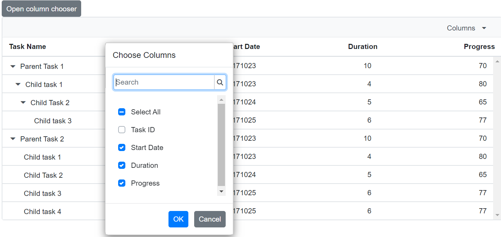
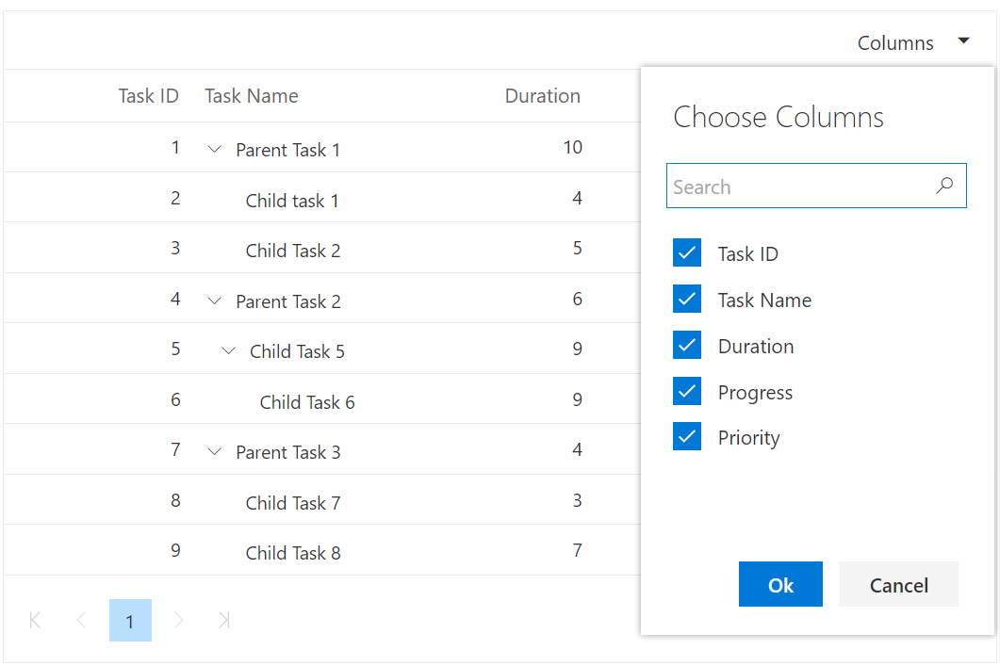
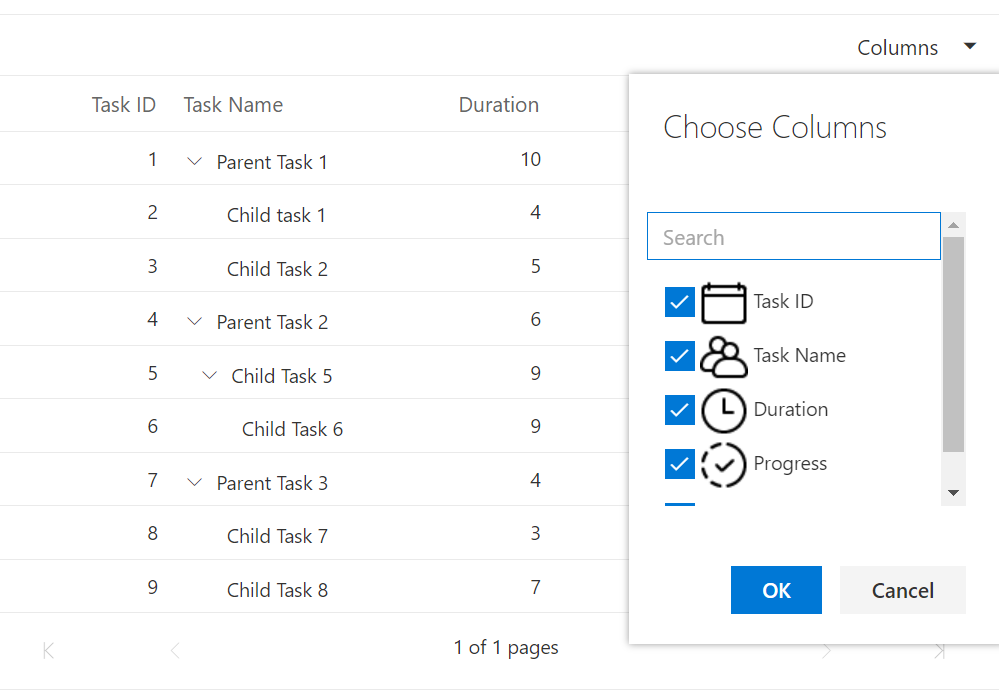
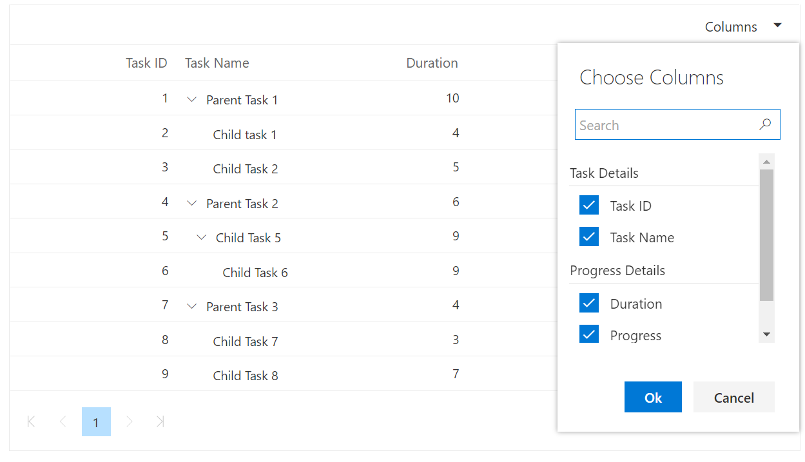

# Column Chooser in Blazor TreeGrid Component

The column chooser provides options to dynamically show or hide columns at runtime. Enable it by setting the [ShowColumnChooser](https://help.syncfusion.com/cr/blazor/Syncfusion.Blazor~Syncfusion.Blazor.TreeGrid.SfTreeGrid~ShowColumnChooser.html) property to true.





@using TreeGridComponent.Data;
@using Syncfusion.Blazor.TreeGrid;

<SfTreeGrid IdMapping="TaskId" ParentIdMapping="ParentId" DataSource="@TreeGridData" TreeColumnIndex="1" ShowColumnChooser="true"  Toolbar=@ToolbarItems>
    <TreeGridColumns>
        <TreeGridColumn Field="TaskId" HeaderText="Task ID" Width="80" TextAlign="Syncfusion.Blazor.Grids.TextAlign.Right"></TreeGridColumn>
        <TreeGridColumn Field="TaskName" HeaderText="Task Name" Width="90" ShowInColumnChooser="false"></TreeGridColumn>
        <TreeGridColumn Field="StartDate" HeaderText="Start Date" TextAlign="Syncfusion.Blazor.Grids.TextAlign.Right" Format="yMd" Type="Syncfusion.Blazor.Grids.ColumnType.Date" Width="90"></TreeGridColumn>
        <TreeGridColumn Field="Duration"  HeaderText="Duration" TextAlign="Syncfusion.Blazor.Grids.TextAlign.Right" Width="80"></TreeGridColumn>
        <TreeGridColumn Field="Progress" HeaderText="Progress" TextAlign="Syncfusion.Blazor.Grids.TextAlign.Right" Width="80"></TreeGridColumn>
    </TreeGridColumns>
</SfTreeGrid>

@code{
    public string[] ToolbarItems = new string[] { "ColumnChooser" };
    public List<TreeData.BusinessObject> TreeGridData { get; set; }
    protected override void OnInitialized()
    {
        this.TreeGridData = TreeData.GetSelfDataSource().ToList();
    }
}





namespace TreeGridComponent.Data {

public class TreeData
    {
        public class BusinessObject
        {
            public int TaskId { get; set;}
            public string TaskName { get; set;}
            public DateTime? StartDate { get; set;}
            public int? Duration { get; set;}
            public int? Progress { get; set;}
            public int? ParentId { get; set;}
        }

        public static List<BusinessObject> GetSelfDataSource()
        {
            List<BusinessObject> BusinessObjectCollection = new List<BusinessObject>();
            BusinessObjectCollection.Add(new BusinessObject() { TaskId = 1,TaskName = "Parent Task 1",StartDate = new DateTime(2017, 10, 23),Duration = 10,Progress = 70,ParentId = null });
            BusinessObjectCollection.Add(new BusinessObject() { TaskId = 2,TaskName = "Child task 1",StartDate = new DateTime(2017, 10, 23),Duration = 4,Progress = 80,ParentId = 1 });
            BusinessObjectCollection.Add(new BusinessObject() { TaskId = 3,TaskName = "Child Task 2",StartDate = new DateTime(2017, 10, 24),Duration = 5,Progress = 65,ParentId = 2 });
            BusinessObjectCollection.Add(new BusinessObject() { TaskId = 4,TaskName = "Child task 3",StartDate = new DateTime(2017, 10, 25),Duration = 6,Progress = 77,ParentId = 3 });
            BusinessObjectCollection.Add(new BusinessObject() { TaskId = 5,TaskName = "Parent Task 2",StartDate = new DateTime(2017, 10, 23),Duration = 10,Progress = 70,ParentId = null});
            BusinessObjectCollection.Add(new BusinessObject() { TaskId = 6,TaskName = "Child task 1",StartDate = new DateTime(2017, 10, 23),Duration = 4,Progress = 80,ParentId = 5});
            BusinessObjectCollection.Add(new BusinessObject() { TaskId = 7,TaskName = "Child Task 2",StartDate = new DateTime(2017, 10, 24),Duration = 5,Progress = 65,ParentId = 5});
            BusinessObjectCollection.Add(new BusinessObject() { TaskId = 8,TaskName = "Child task 3",StartDate = new DateTime(2017, 10, 25),Duration = 6,Progress = 77,ParentId = 5});
            BusinessObjectCollection.Add(new BusinessObject() { TaskId = 9,TaskName = "Child task 4",StartDate = new DateTime(2017, 10, 25),Duration = 6,Progress = 77,ParentId = 5});
            return BusinessObjectCollection;
        }
    }
}





N> Specific columns can be excluded from the column chooser by setting the [ShowInColumnChooser](https://help.syncfusion.com/cr/blazor/Syncfusion.Blazor.TreeGrid.TreeGridColumn.html#Syncfusion_Blazor_TreeGrid_TreeGridColumn_ShowInColumnChooser) property to false on the corresponding column.

## Open column chooser by external button

Open the column chooser programmatically, for example from an external button, by invoking the `OpenColumnChooser` method on the TreeGrid instance. Ensure [ShowColumnChooser](https://help.syncfusion.com/cr/blazor/Syncfusion.Blazor~Syncfusion.Blazor.TreeGrid.SfTreeGrid~ShowColumnChooser.html) is enabled.





@using TreeGridComponent.Data;
@using Syncfusion.Blazor.Data;
@using Syncfusion.Blazor.TreeGrid;
@using Syncfusion.Blazor.Buttons;

<SfButton OnClick="Show"  Content="Open column chooser"></SfButton>
<SfTreeGrid @ref="TreeGrid" IdMapping="TaskId" ParentIdMapping="ParentId" DataSource="@TreeGridData" TreeColumnIndex="1" ShowColumnChooser="true"  Toolbar=@ToolbarItems>
    <TreeGridColumns>
        <TreeGridColumn Field="TaskId" HeaderText="Task ID" Width="80" TextAlign="Syncfusion.Blazor.Grids.TextAlign.Right"></TreeGridColumn>
        <TreeGridColumn Field="TaskName" HeaderText="Task Name" Width="90" ShowInColumnChooser="false"></TreeGridColumn>
        <TreeGridColumn Field="StartDate" HeaderText="Start Date" TextAlign="Syncfusion.Blazor.Grids.TextAlign.Right" Format="yMd" Type="Syncfusion.Blazor.Grids.ColumnType.Date" Width="90"></TreeGridColumn>
        <TreeGridColumn Field="Duration"  HeaderText="Duration" TextAlign="Syncfusion.Blazor.Grids.TextAlign.Right" Width="80"></TreeGridColumn>
        <TreeGridColumn Field="Progress" HeaderText="Progress" TextAlign="Syncfusion.Blazor.Grids.TextAlign.Right" Width="80"></TreeGridColumn>
    </TreeGridColumns>
</SfTreeGrid>

@code{
    private SfTreeGrid<TreeData.BusinessObject> TreeGrid;
    public string[] ToolbarItems = new string[] { "ColumnChooser" };
    public List<TreeData.BusinessObject> TreeGridData { get; set; }
    protected override void OnInitialized()
    {
        this.TreeGridData = TreeData.GetSelfDataSource().ToList();
    }
    public void Show()
    {
        this.TreeGrid.OpenColumnChooserAsync(200, 50);
    }
}





namespace TreeGridComponent.Data {

public class TreeData
    {
        public class BusinessObject
        {
            public int TaskId { get; set;}
            public string TaskName { get; set;}
            public DateTime? StartDate { get; set;}
            public int? Duration { get; set;}
            public int? Progress { get; set;}
            public int? ParentId { get; set;}
        }

        public static List<BusinessObject> GetSelfDataSource()
        {
            List<BusinessObject> BusinessObjectCollection = new List<BusinessObject>();
            BusinessObjectCollection.Add(new BusinessObject() { TaskId = 1,TaskName = "Parent Task 1",StartDate = new DateTime(2017, 10, 23),Duration = 10,Progress = 70,ParentId = null });
            BusinessObjectCollection.Add(new BusinessObject() { TaskId = 2,TaskName = "Child task 1",StartDate = new DateTime(2017, 10, 23),Duration = 4,Progress = 80,ParentId = 1 });
            BusinessObjectCollection.Add(new BusinessObject() { TaskId = 3,TaskName = "Child Task 2",StartDate = new DateTime(2017, 10, 24),Duration = 5,Progress = 65,ParentId = 2 });
            BusinessObjectCollection.Add(new BusinessObject() { TaskId = 4,TaskName = "Child task 3",StartDate = new DateTime(2017, 10, 25),Duration = 6,Progress = 77,ParentId = 3 });
            BusinessObjectCollection.Add(new BusinessObject() { TaskId = 5,TaskName = "Parent Task 2",StartDate = new DateTime(2017, 10, 23),Duration = 10,Progress = 70,ParentId = null});
            BusinessObjectCollection.Add(new BusinessObject() { TaskId = 6,TaskName = "Child task 1",StartDate = new DateTime(2017, 10, 23),Duration = 4,Progress = 80,ParentId = 5});
            BusinessObjectCollection.Add(new BusinessObject() { TaskId = 7,TaskName = "Child Task 2",StartDate = new DateTime(2017, 10, 24),Duration = 5,Progress = 65,ParentId = 5});
            BusinessObjectCollection.Add(new BusinessObject() { TaskId = 8,TaskName = "Child task 3",StartDate = new DateTime(2017, 10, 25),Duration = 6,Progress = 77,ParentId = 5});
            BusinessObjectCollection.Add(new BusinessObject() { TaskId = 9,TaskName = "Child task 4",StartDate = new DateTime(2017, 10, 25),Duration = 6,Progress = 77,ParentId = 5});
            return BusinessObjectCollection;
        }
    }
}





N> Specific columns can be excluded from the column chooser by setting the [ShowInColumnChooser](https://help.syncfusion.com/cr/blazor/Syncfusion.Blazor~Syncfusion.Blazor.TreeGrid.TreeGridColumn~ShowInColumnChooser.html) property to false on the corresponding column.

## Template support in column chooser

Render a custom template in the column chooser by configuring the **Template** and **FooterTemplate** of the [TreeGridColumnChooserSettings](https://help.syncfusion.com/cr/blazor/Syncfusion.Blazor.TreeGrid.TreeGridColumnChooserSettings.html) component.

The following example demonstrates a simple column chooser template using [TreeGridColumnChooserItem](https://help.syncfusion.com/cr/blazor/Syncfusion.Blazor.TreeGrid.TreeGridColumnChooserItem.html) within [TreeGridColumnChooserSettings](https://help.syncfusion.com/cr/blazor/Syncfusion.Blazor.TreeGrid.TreeGridColumnChooserSettings.html).

Use `ColumnChooserTemplateContext` inside the `Template` to access column details and control template rendering of the column chooser.





@using Syncfusion.Blazor.Buttons
@using Syncfusion.Blazor.Grids
@using Syncfusion.Blazor.TreeGrid;
@inject WeatherForecastService ForecastService

<SfTreeGrid ID="TreeGrid" @ref="TreeGrid" DataSource="@GridData" IdMapping="TaskId" ParentIdMapping="ParentId" TreeColumnIndex="1"
            ShowColumnChooser="true" Toolbar="@(new List<string>() {"ColumnChooser" })" AllowPaging="true">
    <TreeGridColumnChooserSettings>
        <Template>
            @{
                var cxt = context as ColumnChooserTemplateContext;
                @foreach (var column in cxt.Columns)
                {
                    <TreeGridColumnChooserItem Column="column"></TreeGridColumnChooserItem>
                }
            }
        </Template>
        <FooterTemplate>
            @{
                var cxt = context as ColumnChooserFooterTemplateContext;
                var visibles = cxt.Columns.Where(x => x.Visible).Select(x => x.HeaderText).ToArray();
                var hiddens = cxt.Columns.Where(x => !x.Visible).Select(x => x.HeaderText).ToArray();
            }
            <SfButton IsPrimary="true" OnClick="@(async () => {
                            await TreeGrid.ShowColumnsAsync(visibles);
                            await TreeGrid.HideColumnsAsync(hiddens); })">Ok</SfButton>
            <SfButton @onclick="@(async () => await cxt.CancelAsync())">Cancel</SfButton>
        </FooterTemplate>
    </TreeGridColumnChooserSettings>
    <TreeGridColumns>
        <TreeGridColumn Field="TaskId" HeaderText="Task ID" Width="70" IsPrimaryKey="true" TextAlign="Syncfusion.Blazor.Grids.TextAlign.Right"></TreeGridColumn>
        <TreeGridColumn Field="TaskName" HeaderText="Task Name" Width="70"></TreeGridColumn>
        <TreeGridColumn Field="Duration" HeaderText="Duration" TextAlign="Syncfusion.Blazor.Grids.TextAlign.Right" Width="80"></TreeGridColumn>
        <TreeGridColumn Field="Progress" HeaderText="Progress" Width="70" TextAlign="Syncfusion.Blazor.Grids.TextAlign.Right"></TreeGridColumn>
        <TreeGridColumn Field="Priority" HeaderText="Priority" Width="80"></TreeGridColumn>
    </TreeGridColumns>
</SfTreeGrid>

@code
    {
    public SfTreeGrid<BusinessObject> TreeGrid { get; set; }
    private List<BusinessObject> GridData;
    protected override void OnInitialized()
    {
        GridData = ForecastService.GetTree1();
    }
}





namespace TreeGridComponent.Data
{
    public class BusinessObject
    {
        public int TaskId { get; set; }
        public string TaskName { get; set; }
        public int Duration { get; set; }
        public int Progress { get; set; }
        public string Priority { get; set; }
        public int? ParentId { get; set; }
    }
    public List<BusinessObject> TreeGridData = new List<BusinessObject>();
    public List<BusinessObject> GetTree1()
    {
        if (TreeGridData.Count == 0)
        {
            TreeGridData.Add(new BusinessObject() { TaskId = 1, TaskName = "Parent Task 1", Duration = 10, Progress = 70, ParentId = null, Priority = "High" });
            TreeGridData.Add(new BusinessObject() { TaskId = 2, TaskName = "Child task 1", Duration = 4, Progress = 80, ParentId = 1, Priority = "Normal" });
            TreeGridData.Add(new BusinessObject() { TaskId = 3, TaskName = "Child Task 2", Duration = 5, Progress = 65, ParentId = 1, Priority = "Critical" });
            TreeGridData.Add(new BusinessObject() { TaskId = 4, TaskName = "Parent Task 2", Duration = 6, Progress = 77, ParentId = null, Priority = "Low" });
            TreeGridData.Add(new BusinessObject() { TaskId = 5, TaskName = "Child Task 5", Duration = 9, Progress = 25, ParentId = 4, Priority = "Normal" });
            TreeGridData.Add(new BusinessObject() { TaskId = 6, TaskName = "Child Task 6", Duration = 9, Progress = 7, ParentId = 5, Priority = "Normal" });
            TreeGridData.Add(new BusinessObject() { TaskId = 7, TaskName = "Parent Task 3", Duration = 4, Progress = 45, ParentId = null, Priority = "High" });
            TreeGridData.Add(new BusinessObject() { TaskId = 8, TaskName = "Child Task 7", Duration = 3, Progress = 38, ParentId = 7, Priority = "Critical" });
            TreeGridData.Add(new BusinessObject() { TaskId = 9, TaskName = "Child Task 8", Duration = 7, Progress = 70, ParentId = 7, Priority = "Low" });
        }
        return TreeGridData;
    }
}





### Custom component in column chooser template

In the following example, a ListView is rendered as a custom component inside the `Template` of [TreeGridColumnChooserSettings](https://help.syncfusion.com/cr/blazor/Syncfusion.Blazor.TreeGrid.TreeGridColumnChooserSettings.html) in the TreeGrid. Inside the custom component, an image is added in the ListView template.





@using TreeGridComponent.Data;
@using Syncfusion.Blazor.TreeGrid;
@inject WeatherForecastService ForecastService

<SfTreeGrid ID="TreeGrid" @ref="TreeGrid" DataSource="@GridData" IdMapping="TaskId" ParentIdMapping="ParentId"
            TreeColumnIndex="1" ShowColumnChooser="true" Toolbar="@(new List<string>() {"ColumnChooser" })" AllowPaging="true">
    <TreeGridColumnChooserSettings>
        <Template>
            @{
                var ContextData = context as ColumnChooserTemplateContext;
                <CustomComponent @key="ContextData.Columns.Count" ColumnContext="ContextData"></CustomComponent>
            }
        </Template>
    </TreeGridColumnChooserSettings>
    <TreeGridColumns>
        <TreeGridColumn Field="TaskId" HeaderText="Task ID" Width="80" IsPrimaryKey="true"
                        TextAlign="Syncfusion.Blazor.Grids.TextAlign.Right"></TreeGridColumn>
        <TreeGridColumn Field="TaskName" HeaderText="Task Name" Width="90"></TreeGridColumn>
        <TreeGridColumn Field="Duration" HeaderText="Duration" TextAlign="Syncfusion.Blazor.Grids.TextAlign.Right"
                        Width="80"></TreeGridColumn>
        <TreeGridColumn Field="Progress" HeaderText="Progress" Width="100"
                        TextAlign="Syncfusion.Blazor.Grids.TextAlign.Right"></TreeGridColumn>
        <TreeGridColumn Field="Priority" HeaderText="Priority" Width="100"></TreeGridColumn>
    </TreeGridColumns>
</SfTreeGrid>

@code
{
    public SfTreeGrid<BusinessObject> TreeGrid { get; set; }
    private List<BusinessObject> GridData;
    protected override void OnInitialized()
    {
        GridData = ForecastService.GetTree1();
    }
}





namespace TreeGridComponent.Data
{
    public class BusinessObject
    {
        public int TaskId { get; set; }
        public string TaskName { get; set; }
        public int Duration { get; set; }
        public int Progress { get; set; }
        public string Priority { get; set; }
        public int? ParentId { get; set; }
    }
    public List<BusinessObject> TreeGridData = new List<BusinessObject>();
    public List<BusinessObject> GetTree1()
    {
        if (TreeGridData.Count == 0)
        {
            TreeGridData.Add(new BusinessObject() { TaskId = 1, TaskName = "Parent Task 1", Duration = 10, Progress = 70, ParentId = null, Priority = "High" });
            TreeGridData.Add(new BusinessObject() { TaskId = 2, TaskName = "Child task 1", Duration = 4, Progress = 80, ParentId = 1, Priority = "Normal" });
            TreeGridData.Add(new BusinessObject() { TaskId = 3, TaskName = "Child Task 2", Duration = 5, Progress = 65, ParentId = 1, Priority = "Critical" });
            TreeGridData.Add(new BusinessObject() { TaskId = 4, TaskName = "Parent Task 2", Duration = 6, Progress = 77, ParentId = null, Priority = "Low" });
            TreeGridData.Add(new BusinessObject() { TaskId = 5, TaskName = "Child Task 5", Duration = 9, Progress = 25, ParentId = 4, Priority = "Normal" });
            TreeGridData.Add(new BusinessObject() { TaskId = 6, TaskName = "Child Task 6", Duration = 9, Progress = 7, ParentId = 5, Priority = "Normal" });
            TreeGridData.Add(new BusinessObject() { TaskId = 7, TaskName = "Parent Task 3", Duration = 4, Progress = 45, ParentId = null, Priority = "High" });
            TreeGridData.Add(new BusinessObject() { TaskId = 8, TaskName = "Child Task 7", Duration = 3, Progress = 38, ParentId = 7, Priority = "Critical" });
            TreeGridData.Add(new BusinessObject() { TaskId = 9, TaskName = "Child Task 8", Duration = 7, Progress = 70, ParentId = 7, Priority = "Low" });
        }
        return TreeGridData;
    }
}









@using Syncfusion.Blazor.Grids
@using Syncfusion.Blazor.TreeGrid
@using Syncfusion.Blazor.Lists;
@using Syncfusion.Blazor.Inputs;
@inject Microsoft.AspNetCore.Components.NavigationManager UriHelper
@inject WeatherForecastService ForecastService

    <SfTextBox Placeholder="Search" ShowClearButton="true" Input="@OnInput"></SfTextBox>

<SfListView @ref="ListView" Height="100%" ShowCheckBox="true" DataSource="@CloneData">
    <ListViewFieldSettings TValue="DataModel" Id="Id" Text="Text" IsChecked="IsChecked"></ListViewFieldSettings>
    <ListViewEvents Clicked="OnClicked" Created="@(()=>OnCreated(ColumnContext.Columns))" TValue="DataModel"></ListViewEvents>
    <ListViewTemplates TValue="DataModel">
        <Template>
            @{
                DataModel item = context as DataModel;
                
            }
            @context.Text
        </Template>
    </ListViewTemplates>
</SfListView>

@code
{
    public List<DataModel> CloneData { get; set; } = new List<DataModel>();

    [CascadingParameter]
    public SfTreeGrid<BusinessObject> TreeGrid { get; set; }

    [Parameter]
    public ColumnChooserTemplateContext ColumnContext { get; set; }

    public SfListView<DataModel> ListView { get; set; }

    async Task OnInput(InputEventArgs eventArgs)
    {
        if (eventArgs.Value == null)
        {
            CloneData = DataSource;
        }
        else
        {
            CloneData = DataSource.FindAll(e => e.Text.ToLower().StartsWith(eventArgs.Value.ToLower()));
        }
        await Task.Delay(100);
        await Preselect();
    }

    protected override async Task OnInitializedAsync()
    {
        CloneData = DataSource;
        await Task.Delay(100);
        await Preselect();
    }

    List<DataModel> DataSource = new List<DataModel>
    {
            new DataModel() { Text = "Task ID", Id = "TaskId", IsChecked = true },
            new DataModel() { Text = "Task Name", Id ="TaskName", IsChecked = true},
            new DataModel() { Text = "Duration", Id = "Duration", IsChecked = true },
            new DataModel() { Text = "Progress", Id ="Progress", IsChecked = true},
            new DataModel() { Text = "Priority", Id = "Priority", IsChecked = true },
    };

    public async Task Preselect()
    {
        var cols = ColumnContext.Columns.FindAll(x => x.Visible == true).ToList();
        var selectlist = new List<DataModel>();
        foreach (var column in cols)
        {
            selectlist.Add(DataSource.Where(x => x.Text == column.HeaderText).FirstOrDefault());
        }
        if (selectlist.Count > 0)
        {
            if (ListView != null)
            {
                await ListView?.CheckItemsAsync(selectlist.AsEnumerable());
            }
        }
    }

    public async Task OnCreated(List<GridColumn> args)
    {
        await Preselect();
    }

    public async Task OnClicked(ClickEventArgs<DataModel> args)
    {
        if (args.IsChecked)
        {
            await TreeGrid.HideColumnAsync(args.Text);
        }
        else
        {
            await TreeGrid.ShowColumnAsync(args.Text);
        }
    }

    public class DataModel
    {
        public string Text { get; set; }
        public string Id { get; set; }
        public bool IsChecked { get; set; }
    }

}





The following output is displayed as a result of the above code example.

### Column Chooser with group template

Columns can also be grouped inside the column chooser template using a group template. To group columns, wrap [TreeGridColumnChooserItem](https://help.syncfusion.com/cr/blazor/Syncfusion.Blazor.TreeGrid.TreeGridColumnChooserItem.html) inside [TreeGridColumnChooserItemGroup](https://help.syncfusion.com/cr/blazor/Syncfusion.Blazor.TreeGrid.TreeGridColumnChooserItemGroup.html) as shown in the following example.





@using TreeGridComponent.Data;
@using Syncfusion.Blazor.TreeGrid;
@inject WeatherForecastService ForecastService

<SfTreeGrid ID="TreeGrid" @ref="TreeGrid" DataSource="@GridData" IdMapping="TaskId" ParentIdMapping="ParentId"
            TreeColumnIndex="1" ShowColumnChooser="true" Toolbar="@(new List<string>() {"ColumnChooser" })" AllowPaging="true">
    <TreeGridColumnChooserSettings>
        <Template>
            @{
                var ContextData = context as ColumnChooserTemplateContext;
                <CustomComponent @key="ContextData.Columns.Count" ColumnContext="ContextData"></CustomComponent>
            }
        </Template>
    </TreeGridColumnChooserSettings>
    <TreeGridColumns>
        <TreeGridColumn Field="TaskId" HeaderText="Task ID" Width="80" IsPrimaryKey="true"
                        TextAlign="Syncfusion.Blazor.Grids.TextAlign.Right"></TreeGridColumn>
        <TreeGridColumn Field="TaskName" HeaderText="Task Name" Width="90"></TreeGridColumn>
        <TreeGridColumn Field="Duration" HeaderText="Duration" TextAlign="Syncfusion.Blazor.Grids.TextAlign.Right"
                        Width="80"></TreeGridColumn>
        <TreeGridColumn Field="Progress" HeaderText="Progress" Width="100"
                        TextAlign="Syncfusion.Blazor.Grids.TextAlign.Right"></TreeGridColumn>
        <TreeGridColumn Field="Priority" HeaderText="Priority" Width="100"></TreeGridColumn>
    </TreeGridColumns>
</SfTreeGrid>

@code
{
    public SfTreeGrid<BusinessObject> TreeGrid { get; set; }
    private List<BusinessObject> GridData;
    protected override void OnInitialized()
    {
        GridData = ForecastService.GetTree1();
    }
}





namespace TreeGridComponent.Data
{
    public class BusinessObject
    {
        public int TaskId { get; set; }
        public string TaskName { get; set; }
        public int Duration { get; set; }
        public int Progress { get; set; }
        public string Priority { get; set; }
        public int? ParentId { get; set; }
    }
    public List<BusinessObject> TreeGridData = new List<BusinessObject>();
    public List<BusinessObject> GetTree1()
    {
        if (TreeGridData.Count == 0)
        {
            TreeGridData.Add(new BusinessObject() { TaskId = 1, TaskName = "Parent Task 1", Duration = 10, Progress = 70, ParentId = null, Priority = "High" });
            TreeGridData.Add(new BusinessObject() { TaskId = 2, TaskName = "Child task 1", Duration = 4, Progress = 80, ParentId = 1, Priority = "Normal" });
            TreeGridData.Add(new BusinessObject() { TaskId = 3, TaskName = "Child Task 2", Duration = 5, Progress = 65, ParentId = 1, Priority = "Critical" });
            TreeGridData.Add(new BusinessObject() { TaskId = 4, TaskName = "Parent Task 2", Duration = 6, Progress = 77, ParentId = null, Priority = "Low" });
            TreeGridData.Add(new BusinessObject() { TaskId = 5, TaskName = "Child Task 5", Duration = 9, Progress = 25, ParentId = 4, Priority = "Normal" });
            TreeGridData.Add(new BusinessObject() { TaskId = 6, TaskName = "Child Task 6", Duration = 9, Progress = 7, ParentId = 5, Priority = "Normal" });
            TreeGridData.Add(new BusinessObject() { TaskId = 7, TaskName = "Parent Task 3", Duration = 4, Progress = 45, ParentId = null, Priority = "High" });
            TreeGridData.Add(new BusinessObject() { TaskId = 8, TaskName = "Child Task 7", Duration = 3, Progress = 38, ParentId = 7, Priority = "Critical" });
            TreeGridData.Add(new BusinessObject() { TaskId = 9, TaskName = "Child Task 8", Duration = 7, Progress = 70, ParentId = 7, Priority = "Low" });
        }
        return TreeGridData;
    }
}





The following output is displayed as a result of the above code example.

