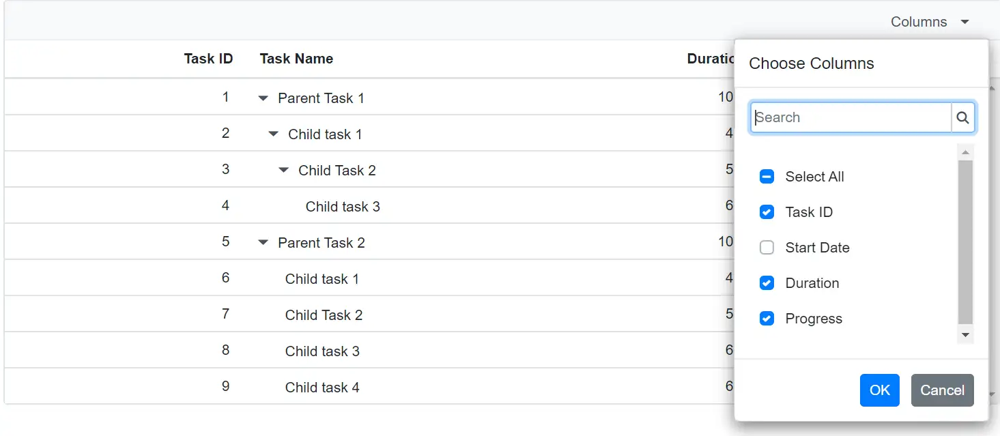
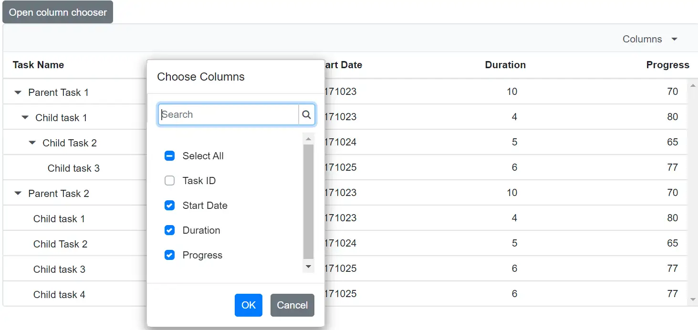
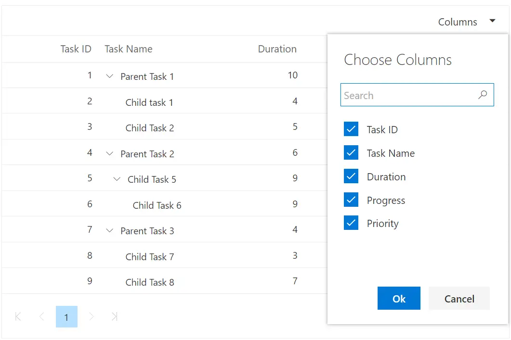
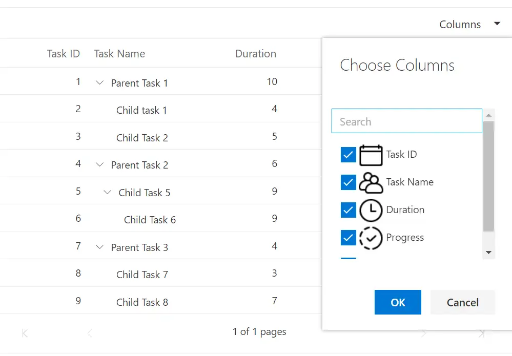
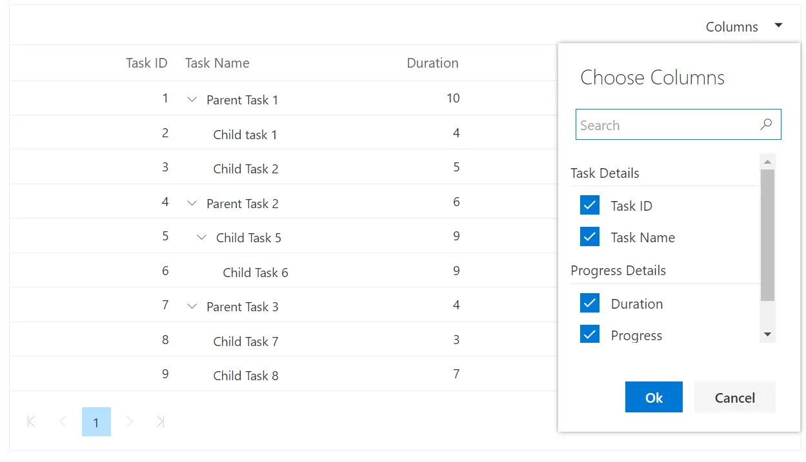

# Column Chooser in Blazor TreeGrid

The column chooser has options to show or hide columns dynamically. It can be enabled by defining the [ShowColumnChooser](https://help.syncfusion.com/cr/blazor/Syncfusion.Blazor.TreeGrid.SfTreeGrid-1.html#Syncfusion_Blazor_TreeGrid_SfTreeGrid_1_ShowColumnChooser) as true.





@using TreeGridComponent.Data;
@using Syncfusion.Blazor.TreeGrid;

<SfTreeGrid IdMapping="TaskId" ParentIdMapping="ParentId" DataSource="@TreeGridData" TreeColumnIndex="1" ShowColumnChooser="true"  Toolbar=@ToolbarItems>
    <TreeGridColumns>
        <TreeGridColumn Field="TaskId" HeaderText="Task ID" Width="80" TextAlign="Syncfusion.Blazor.Grids.TextAlign.Right"></TreeGridColumn>
        <TreeGridColumn Field="TaskName" HeaderText="Task Name" Width="90" ShowInColumnChooser="false"></TreeGridColumn>
        <TreeGridColumn Field="StartDate" HeaderText="Start Date" TextAlign="Syncfusion.Blazor.Grids.TextAlign.Right" Format="yMd" Type="Syncfusion.Blazor.Grids.ColumnType.Date" Width="90"></TreeGridColumn>
        <TreeGridColumn Field="Duration"  HeaderText="Duration" TextAlign="Syncfusion.Blazor.Grids.TextAlign.Right" Width="80"></TreeGridColumn>
        <TreeGridColumn Field="Progress" HeaderText="Progress" TextAlign="Syncfusion.Blazor.Grids.TextAlign.Right" Width="80"></TreeGridColumn>
    </TreeGridColumns>
</SfTreeGrid>

@code{
    public string[] ToolbarItems = new string[] { "ColumnChooser" };
    public List<TreeData.BusinessObject> TreeGridData { get; set; }
    protected override void OnInitialized()
    {
        this.TreeGridData = TreeData.GetSelfDataSource().ToList();
    }
}





namespace TreeGridComponent.Data {

public class TreeData
    {
        public class BusinessObject
        {
            public int TaskId { get; set;}
            public string TaskName { get; set;}
            public DateTime? StartDate { get; set;}
            public int? Duration { get; set;}
            public int? Progress { get; set;}
            public int? ParentId { get; set;}
        }

        public static List<BusinessObject> GetSelfDataSource()
        {
            List<BusinessObject> BusinessObjectCollection = new List<BusinessObject>();
            BusinessObjectCollection.Add(new BusinessObject() { TaskId = 1,TaskName = "Parent Task 1",StartDate = new DateTime(2017, 10, 23),Duration = 10,Progress = 70,ParentId = null });
            BusinessObjectCollection.Add(new BusinessObject() { TaskId = 2,TaskName = "Child task 1",StartDate = new DateTime(2017, 10, 23),Duration = 4,Progress = 80,ParentId = 1 });
            BusinessObjectCollection.Add(new BusinessObject() { TaskId = 3,TaskName = "Child Task 2",StartDate = new DateTime(2017, 10, 24),Duration = 5,Progress = 65,ParentId = 2 });
            BusinessObjectCollection.Add(new BusinessObject() { TaskId = 4,TaskName = "Child task 3",StartDate = new DateTime(2017, 10, 25),Duration = 6,Progress = 77,ParentId = 3 });
            BusinessObjectCollection.Add(new BusinessObject() { TaskId = 5,TaskName = "Parent Task 2",StartDate = new DateTime(2017, 10, 23),Duration = 10,Progress = 70,ParentId = null});
            BusinessObjectCollection.Add(new BusinessObject() { TaskId = 6,TaskName = "Child task 1",StartDate = new DateTime(2017, 10, 23),Duration = 4,Progress = 80,ParentId = 5});
            BusinessObjectCollection.Add(new BusinessObject() { TaskId = 7,TaskName = "Child Task 2",StartDate = new DateTime(2017, 10, 24),Duration = 5,Progress = 65,ParentId = 5});
            BusinessObjectCollection.Add(new BusinessObject() { TaskId = 8,TaskName = "Child task 3",StartDate = new DateTime(2017, 10, 25),Duration = 6,Progress = 77,ParentId = 5});
            BusinessObjectCollection.Add(new BusinessObject() { TaskId = 9,TaskName = "Child task 4",StartDate = new DateTime(2017, 10, 25),Duration = 6,Progress = 77,ParentId = 5});
            return BusinessObjectCollection;
        }
    }
}





N> The column names can be hidden in the column chooser by defining the [ShowInColumnChooser](https://help.syncfusion.com/cr/blazor/Syncfusion.Blazor.TreeGrid.TreeGridColumn.html#Syncfusion_Blazor_TreeGrid_TreeGridColumn_ShowInColumnChooser) property as false.

## Open column chooser by external button

The Blazor TreeGrid allows opening the column chooser dialog programmatically using an external button. Use the [OpenColumnChooserAsync](https://help.syncfusion.com/cr/blazor/Syncfusion.Blazor.TreeGrid.SfTreeGrid-1.html#Syncfusion_Blazor_TreeGrid_SfTreeGrid_1_OpenColumnChooserAsync_System_Nullable_System_Double__System_Nullable_System_Double__) method to display the dialog at a specific position on the page.

The [OpenColumnChooserAsync](https://help.syncfusion.com/cr/blazor/Syncfusion.Blazor.TreeGrid.SfTreeGrid-1.html#Syncfusion_Blazor_TreeGrid_SfTreeGrid_1_OpenColumnChooserAsync_System_Nullable_System_Double__System_Nullable_System_Double__) method accepts the following parameters:

* `x` - Defines the X-coordinate (horizontal position) in pixels where the column chooser dialog will appear on the screen.
* `y` - Defines the Y-coordinate (vertical position) in pixels where the column chooser dialog will appear on the screen.

Both `x` and `y` parameters are optional nullable `double` values. When these values are not provided, the column chooser dialog is displayed at the default position on the page.





@using TreeGridComponent.Data;
@using Syncfusion.Blazor.Data;
@using Syncfusion.Blazor.TreeGrid;
@using Syncfusion.Blazor.Buttons;

<SfButton OnClick="Show"  Content="Open column chooser"></SfButton>
<SfTreeGrid @ref="TreeGrid" IdMapping="TaskId" ParentIdMapping="ParentId" DataSource="@TreeGridData" TreeColumnIndex="1" ShowColumnChooser="true"  Toolbar=@ToolbarItems>
    <TreeGridColumns>
        <TreeGridColumn Field="TaskId" HeaderText="Task ID" Width="80" TextAlign="Syncfusion.Blazor.Grids.TextAlign.Right"></TreeGridColumn>
        <TreeGridColumn Field="TaskName" HeaderText="Task Name" Width="90" ShowInColumnChooser="false"></TreeGridColumn>
        <TreeGridColumn Field="StartDate" HeaderText="Start Date" TextAlign="Syncfusion.Blazor.Grids.TextAlign.Right" Format="yMd" Type="Syncfusion.Blazor.Grids.ColumnType.Date" Width="90"></TreeGridColumn>
        <TreeGridColumn Field="Duration"  HeaderText="Duration" TextAlign="Syncfusion.Blazor.Grids.TextAlign.Right" Width="80"></TreeGridColumn>
        <TreeGridColumn Field="Progress" HeaderText="Progress" TextAlign="Syncfusion.Blazor.Grids.TextAlign.Right" Width="80"></TreeGridColumn>
    </TreeGridColumns>
</SfTreeGrid>

@code{
    private SfTreeGrid<TreeData.BusinessObject> TreeGrid;
    public string[] ToolbarItems = new string[] { "ColumnChooser" };
    public List<TreeData.BusinessObject> TreeGridData { get; set; }
    protected override void OnInitialized()
    {
        this.TreeGridData = TreeData.GetSelfDataSource().ToList();
    }
    public void Show()
    {
        this.TreeGrid.OpenColumnChooserAsync(200, 50);
    }
}





namespace TreeGridComponent.Data {

public class TreeData
    {
        public class BusinessObject
        {
            public int TaskId { get; set;}
            public string TaskName { get; set;}
            public DateTime? StartDate { get; set;}
            public int? Duration { get; set;}
            public int? Progress { get; set;}
            public int? ParentId { get; set;}
        }

        public static List<BusinessObject> GetSelfDataSource()
        {
            List<BusinessObject> BusinessObjectCollection = new List<BusinessObject>();
            BusinessObjectCollection.Add(new BusinessObject() { TaskId = 1,TaskName = "Parent Task 1",StartDate = new DateTime(2017, 10, 23),Duration = 10,Progress = 70,ParentId = null });
            BusinessObjectCollection.Add(new BusinessObject() { TaskId = 2,TaskName = "Child task 1",StartDate = new DateTime(2017, 10, 23),Duration = 4,Progress = 80,ParentId = 1 });
            BusinessObjectCollection.Add(new BusinessObject() { TaskId = 3,TaskName = "Child Task 2",StartDate = new DateTime(2017, 10, 24),Duration = 5,Progress = 65,ParentId = 2 });
            BusinessObjectCollection.Add(new BusinessObject() { TaskId = 4,TaskName = "Child task 3",StartDate = new DateTime(2017, 10, 25),Duration = 6,Progress = 77,ParentId = 3 });
            BusinessObjectCollection.Add(new BusinessObject() { TaskId = 5,TaskName = "Parent Task 2",StartDate = new DateTime(2017, 10, 23),Duration = 10,Progress = 70,ParentId = null});
            BusinessObjectCollection.Add(new BusinessObject() { TaskId = 6,TaskName = "Child task 1",StartDate = new DateTime(2017, 10, 23),Duration = 4,Progress = 80,ParentId = 5});
            BusinessObjectCollection.Add(new BusinessObject() { TaskId = 7,TaskName = "Child Task 2",StartDate = new DateTime(2017, 10, 24),Duration = 5,Progress = 65,ParentId = 5});
            BusinessObjectCollection.Add(new BusinessObject() { TaskId = 8,TaskName = "Child task 3",StartDate = new DateTime(2017, 10, 25),Duration = 6,Progress = 77,ParentId = 5});
            BusinessObjectCollection.Add(new BusinessObject() { TaskId = 9,TaskName = "Child task 4",StartDate = new DateTime(2017, 10, 25),Duration = 6,Progress = 77,ParentId = 5});
            return BusinessObjectCollection;
        }
    }
}





## Text wrapping in column chooser

The Blazor TreeGrid includes a enhancement that improves readability within the column chooser dialog by allowing long column names to wrap across multiple lines. This behavior is enabled by setting the [TreeGridColumnChooserSettings.AllowTextWrap](https://help.syncfusion.com/cr/blazor/Syncfusion.Blazor.TreeGrid.TreeGridColumnChooserSettings.html#Syncfusion_Blazor_TreeGrid_TreeGridColumnChooserSettings_AllowTextWrap) property to **true**.



@using TreeGridComponent.Data
@using Syncfusion.Blazor.Data
@using Syncfusion.Blazor.TreeGrid
@using Syncfusion.Blazor.Buttons
<SfTreeGrid @ref="TreeGrid" IdMapping="ShipmentId" ParentIdMapping="ParentId" DataSource="@Shipments" TreeColumnIndex="1" ShowColumnChooser="true" Toolbar="@ToolbarItems" Locale="en-US">
    <TreeGridColumnChooserSettings AllowTextWrap="true"></TreeGridColumnChooserSettings>
    <TreeGridColumns>
        <TreeGridColumn Field="ShipmentId" HeaderText="Shipment ID" Width="100" TextAlign="Syncfusion.Blazor.Grids.TextAlign.Right" ClipMode="Syncfusion.Blazor.Grids.ClipMode.EllipsisWithTooltip"></TreeGridColumn>
        <TreeGridColumn Field="Description" HeaderText="Description of Shipment" Width="160" ClipMode="Syncfusion.Blazor.Grids.ClipMode.EllipsisWithTooltip"></TreeGridColumn>
        <TreeGridColumn Field="Origin" HeaderText="Origin Location of Shipment" Width="120" ClipMode="Syncfusion.Blazor.Grids.ClipMode.EllipsisWithTooltip"></TreeGridColumn>
        <TreeGridColumn Field="Destination" HeaderText="Destination Location of Shipment" Width="120" ClipMode="Syncfusion.Blazor.Grids.ClipMode.EllipsisWithTooltip"></TreeGridColumn>
        <TreeGridColumn Field="Weight" HeaderText="Total Weight of Shipment (lbs)" Width="120" TextAlign="Syncfusion.Blazor.Grids.TextAlign.Right" ClipMode="Syncfusion.Blazor.Grids.ClipMode.EllipsisWithTooltip"></TreeGridColumn>
        <TreeGridColumn Field="DeliveryDate" HeaderText="Delivery Date for Shipment" Width="110" TextAlign="Syncfusion.Blazor.Grids.TextAlign.Right" Format="MM/dd/yyyy" Type="Syncfusion.Blazor.Grids.ColumnType.Date" ClipMode="Syncfusion.Blazor.Grids.ClipMode.EllipsisWithTooltip"></TreeGridColumn>
        <TreeGridColumn Field="Status" HeaderText="Current Status of Shipment" Width="120" ShowInColumnChooser="false" ClipMode="Syncfusion.Blazor.Grids.ClipMode.EllipsisWithTooltip"></TreeGridColumn>
    </TreeGridColumns>
</SfTreeGrid>

@code {
    private SfTreeGrid<Shipment> TreeGrid;
    public string[] ToolbarItems = new string[] { "ColumnChooser" };
    public List<Shipment> Shipments { get; set; }

    protected override void OnInitialized()
    {
        this.Shipments = Shipment.GetShipments().ToList();
    }
}




namespace TreeGridComponent.Data {
    public class Shipment
    {
        public string ShipmentId { get; set; }
        public string Description { get; set; }
        public string Origin { get; set; }
        public string Destination { get; set; }
        public double? Weight { get; set; } // Weight in pounds
        public DateTime? DeliveryDate { get; set; }
        public string Status { get; set; }
        public string ParentId { get; set; }

        public static List<Shipment> GetShipments()
        {
            var shipments = new List<Shipment>
            {
                // Parent 1: North America Shipment
                new Shipment { ShipmentId = "SH001", Description = "North America Shipment", Origin = null, Destination = null, Weight = null, DeliveryDate = null, Status = null, ParentId = null },
                new Shipment { ShipmentId = "SH002", Description = "Dell XPS 13 Laptops", Origin = "Los Angeles", Destination = "Houston", Weight = 132.28, DeliveryDate = new DateTime(2025, 10, 20), Status = "In Transit", ParentId = "SH001" }, // 50 laptops at ~2.65 lbs each
                new Shipment { ShipmentId = "SH003", Description = "Samsung QLED Monitors", Origin = "New York", Destination = "Houston", Weight = 1102.31, DeliveryDate = new DateTime(2025, 10, 21), Status = "In Transit", ParentId = "SH001" }, // 50 monitors at ~22 lbs each
                new Shipment { ShipmentId = "SH004", Description = "Logitech Keyboards", Origin = "San Francisco", Destination = "Miami", Weight = 99.21, DeliveryDate = new DateTime(2025, 10, 22), Status = "Pending", ParentId = "SH001" }, // 50 keyboards at ~1.98 lbs each
                new Shipment { ShipmentId = "SH005", Description = "Logitech MX Master Mice", Origin = "Boston", Destination = "Seattle", Weight = 15.43, DeliveryDate = new DateTime(2025, 10, 23), Status = "Pending", ParentId = "SH001" }, // 50 mice at ~0.31 lbs each
                new Shipment { ShipmentId = "SH006", Description = "Anker USB-C Cables", Origin = "Dallas", Destination = "Denver", Weight = 11.02, DeliveryDate = new DateTime(2025, 10, 24), Status = "Pending", ParentId = "SH001" }, // 100 cables at ~0.11 lbs each
                new Shipment { ShipmentId = "SH007", Description = "Bose Bluetooth Speakers", Origin = "Atlanta", Destination = "Phoenix", Weight = 220.46, DeliveryDate = new DateTime(2025, 10, 25), Status = "Pending", ParentId = "SH001" }, // 50 speakers at ~4.41 lbs each
                // Parent 2: Europe Shipment
                new Shipment { ShipmentId = "SH008", Description = "Europe Shipment", Origin = null, Destination = null, Weight = null, DeliveryDate = null, Status = null, ParentId = null },
                new Shipment { ShipmentId = "SH009", Description = "iPhone 14 Smartphones", Origin = "Munich", Destination = "Madrid", Weight = 30.42, DeliveryDate = new DateTime(2025, 10, 28), Status = "In Transit", ParentId = "SH008" }, // 50 smartphones at ~0.61 lbs each
                new Shipment { ShipmentId = "SH010", Description = "Samsung Galaxy Tab S9 Tablets", Origin = "Hamburg", Destination = "Rome", Weight = 55.56, DeliveryDate = new DateTime(2025, 10, 29), Status = "In Transit", ParentId = "SH008" }, // 50 tablets at ~1.11 lbs each
                new Shipment { ShipmentId = "SH011", Description = "Jabra Elite Headsets", Origin = "Frankfurt", Destination = "Paris", Weight = 33.07, DeliveryDate = new DateTime(2025, 10, 30), Status = "Delivered", ParentId = "SH008" }, // 50 headsets at ~0.66 lbs each
                new Shipment { ShipmentId = "SH012", Description = "Anker PowerPort Chargers", Origin = "Cologne", Destination = "Amsterdam", Weight = 22.05, DeliveryDate = new DateTime(2025, 11, 1), Status = "Pending", ParentId = "SH008" }, // 50 chargers at ~0.44 lbs each
                new Shipment { ShipmentId = "SH013", Description = "Canon EOS R Cameras", Origin = "Stuttgart", Destination = "Lisbon", Weight = 72.75, DeliveryDate = new DateTime(2025, 11, 2), Status = "Pending", ParentId = "SH008" }, // 50 cameras at ~1.46 lbs each
                new Shipment { ShipmentId = "SH014", Description = "Nikon 50mm Lenses", Origin = "Dresden", Destination = "Vienna", Weight = 46.30, DeliveryDate = new DateTime(2025, 11, 3), Status = "Pending", ParentId = "SH008" }, // 50 lenses at ~0.93 lbs each
            };
            return shipments;
        }
    }
}





## Template support in column chooser

Templates can be rendered in the TreeGrid column chooser by customizing the column chooser using **Template** and **FooterTemplate** of the [TreeGridColumnChooserSettings](https://help.syncfusion.com/cr/blazor/Syncfusion.Blazor.TreeGrid.TreeGridColumnChooserSettings.html) Component.

Below example demonstrates simple column chooser template using [TreeGridColumnChooserItem](https://help.syncfusion.com/cr/blazor/Syncfusion.Blazor.TreeGrid.TreeGridColumnChooserItem.html) inside the `TreeGridColumnChooserSettings` Component.

The [Template](https://help.syncfusion.com/cr/blazor/Syncfusion.Blazor.TreeGrid.TreeGridColumnChooserSettings.html#Syncfusion_Blazor_TreeGrid_TreeGridColumnChooserSettings_Template) property of the `TreeGridColumnChooserSettings` is used to customize the content of the column chooser dialog. The context parameter can be typecast to `ColumnChooserTemplateContext` to access the list of columns within the template.





@using Syncfusion.Blazor.Buttons
@using Syncfusion.Blazor.Grids
@using Syncfusion.Blazor.TreeGrid;

<SfTreeGrid ID="TreeGrid" @ref="TreeGrid" DataSource="@TreeGridData" IdMapping="TaskId" ParentIdMapping="ParentId" TreeColumnIndex="1"
            ShowColumnChooser="true" Toolbar="@(new List<string>() {"ColumnChooser" })" AllowPaging="true">
    <TreeGridColumnChooserSettings>
        <Template>
            @{
                var cxt = context as ColumnChooserTemplateContext;
                @foreach (var column in cxt.Columns)
                {
                    <TreeGridColumnChooserItem Column="column"></TreeGridColumnChooserItem>
                }
            }
        </Template>
        <FooterTemplate>
            @{
                var cxt = context as ColumnChooserFooterTemplateContext;
                var visibles = cxt.Columns.Where(x => x.Visible).Select(x => x.HeaderText).ToArray();
                var hiddens = cxt.Columns.Where(x => !x.Visible).Select(x => x.HeaderText).ToArray();
            }
            <SfButton IsPrimary="true" OnClick="@(async () => {
                            await TreeGrid.ShowColumnsAsync(visibles);
                            await TreeGrid.HideColumnsAsync(hiddens); })">Ok</SfButton>
            <SfButton @onclick="@(async () => await cxt.CancelAsync())">Cancel</SfButton>
        </FooterTemplate>
    </TreeGridColumnChooserSettings>
    <TreeGridColumns>
        <TreeGridColumn Field="TaskId" HeaderText="Task ID" Width="70" IsPrimaryKey="true" TextAlign="Syncfusion.Blazor.Grids.TextAlign.Right"></TreeGridColumn>
        <TreeGridColumn Field="TaskName" HeaderText="Task Name" Width="70"></TreeGridColumn>
        <TreeGridColumn Field="Duration" HeaderText="Duration" TextAlign="Syncfusion.Blazor.Grids.TextAlign.Right" Width="80"></TreeGridColumn>
        <TreeGridColumn Field="Progress" HeaderText="Progress" Width="70" TextAlign="Syncfusion.Blazor.Grids.TextAlign.Right"></TreeGridColumn>
        <TreeGridColumn Field="Priority" HeaderText="Priority" Width="80"></TreeGridColumn>
    </TreeGridColumns>
</SfTreeGrid>

@code
    {
    public SfTreeGrid<BusinessObject> TreeGrid { get; set; }
    private List<BusinessObject> TreeGridData;
    protected override void OnInitialized()
    {
        TreeGridData = new BusinessObject().GetTree1();
    }
}





namespace TreeGridComponent.Data
{
    public class BusinessObject
    {
        public int TaskId { get; set; }
        public string TaskName { get; set; }
        public int Duration { get; set; }
        public int Progress { get; set; }
        public string Priority { get; set; }
        public int? ParentId { get; set; }
    
        public List<BusinessObject> TreeGridData = new List<BusinessObject>();
        public List<BusinessObject> GetTree1()
        {
            if (TreeGridData.Count == 0)
            {
                TreeGridData.Add(new BusinessObject() { TaskId = 1, TaskName = "Parent Task 1", Duration = 10, Progress = 70, ParentId = null, Priority = "High" });
                TreeGridData.Add(new BusinessObject() { TaskId = 2, TaskName = "Child task 1", Duration = 4, Progress = 80, ParentId = 1, Priority = "Normal" });
                TreeGridData.Add(new BusinessObject() { TaskId = 3, TaskName = "Child Task 2", Duration = 5, Progress = 65, ParentId = 1, Priority = "Critical" });
                TreeGridData.Add(new BusinessObject() { TaskId = 4, TaskName = "Parent Task 2", Duration = 6, Progress = 77, ParentId = null, Priority = "Low" });
                TreeGridData.Add(new BusinessObject() { TaskId = 5, TaskName = "Child Task 5", Duration = 9, Progress = 25, ParentId = 4, Priority = "Normal" });
                TreeGridData.Add(new BusinessObject() { TaskId = 6, TaskName = "Child Task 6", Duration = 9, Progress = 7, ParentId = 5, Priority = "Normal" });
                TreeGridData.Add(new BusinessObject() { TaskId = 7, TaskName = "Parent Task 3", Duration = 4, Progress = 45, ParentId = null, Priority = "High" });
                TreeGridData.Add(new BusinessObject() { TaskId = 8, TaskName = "Child Task 7", Duration = 3, Progress = 38, ParentId = 7, Priority = "Critical" });
                TreeGridData.Add(new BusinessObject() { TaskId = 9, TaskName = "Child Task 8", Duration = 7, Progress = 70, ParentId = 7, Priority = "Low" });
            }
            return TreeGridData;
        }
    }
}





### Custom component in column chooser template

The TreeGrid uses a custom ListView component inside the Template of [TreeGridColumnChooserSettings](https://help.syncfusion.com/cr/blazor/Syncfusion.Blazor.TreeGrid.TreeGridColumnChooserSettings.html). This replaces the default column chooser list with a ListView, where each item can be customized. 




@using Syncfusion.Blazor.TreeGrid
@using BlazorApp.Data

<SfTreeGrid ID="TreeGrid" @ref="TreeGrid" AllowPaging="true"
            DataSource="@TreeGridData"
            IdMapping="TaskId" ParentIdMapping="ParentId"
            ShowColumnChooser="true"
            Toolbar="@ToolbarItems"
            TreeColumnIndex="1">
    <TreeGridColumnChooserSettings>
        <Template>
            @{
                var ContextData = context as ColumnChooserTemplateContext;
                <CustomComponent @key="ContextData.Columns.Count" ColumnContext="ContextData"></CustomComponent>
            }
        </Template>
        <FooterTemplate>
        </FooterTemplate>
    </TreeGridColumnChooserSettings>
    <TreeGridColumns>
        <TreeGridColumn Field=@nameof(BusinessObject.TaskId) HeaderText="Task ID" Width="120" TextAlign="TextAlign.Right"></TreeGridColumn>
        <TreeGridColumn Field=@nameof(BusinessObject.TaskName) HeaderText="Task Name" Width="160"></TreeGridColumn>
        <TreeGridColumn Field=@nameof(BusinessObject.StartDate) HeaderText="Start Date" Format="d" Type="ColumnType.Date" Width="130" TextAlign="TextAlign.Right"></TreeGridColumn>
        <TreeGridColumn Field=@nameof(BusinessObject.Duration) HeaderText="Duration" Width="100" TextAlign="TextAlign.Right"></TreeGridColumn>
        <TreeGridColumn Field=@nameof(BusinessObject.Progress) HeaderText="Progress" Width="100" TextAlign="TextAlign.Right"></TreeGridColumn>
    </TreeGridColumns>
</SfTreeGrid>

@code {
    public SfTreeGrid<BusinessObject> TreeGrid { get; set; }
    public string[] ToolbarItems = new string[] { "ColumnChooser" };
    public List<BusinessObject> TreeGridData { get; set; }

    protected override void OnInitialized()
    {
        TreeGridData = TreeData.GetSelfDataSource();
    }
}


namespace TreeGridComponent.Data {
    public class TreeData
    {
        public class BusinessObject
        {
            public int TaskId { get; set;}
            public string TaskName { get; set;}
            public DateTime? StartDate { get; set;}
            public int? Duration { get; set;}
            public int? Progress { get; set;}
            public int? ParentId { get; set;}
        }

        public static List<BusinessObject> GetSelfDataSource()
        {
            List<BusinessObject> BusinessObjectCollection = new List<BusinessObject>();
            BusinessObjectCollection.Add(new BusinessObject() { TaskId = 1,TaskName = "Parent Task 1",StartDate = new DateTime(2017, 10, 23),Duration = 10,Progress = 70,ParentId = null });
            BusinessObjectCollection.Add(new BusinessObject() { TaskId = 2,TaskName = "Child task 1",StartDate = new DateTime(2017, 10, 23),Duration = 4,Progress = 80,ParentId = 1 });
            BusinessObjectCollection.Add(new BusinessObject() { TaskId = 3,TaskName = "Child Task 2",StartDate = new DateTime(2017, 10, 24),Duration = 5,Progress = 65,ParentId = 2 });
            BusinessObjectCollection.Add(new BusinessObject() { TaskId = 4,TaskName = "Child task 3",StartDate = new DateTime(2017, 10, 25),Duration = 6,Progress = 77,ParentId = 3 });
            BusinessObjectCollection.Add(new BusinessObject() { TaskId = 5,TaskName = "Parent Task 2",StartDate = new DateTime(2017, 10, 23),Duration = 10,Progress = 70,ParentId = null});
            BusinessObjectCollection.Add(new BusinessObject() { TaskId = 6,TaskName = "Child task 1",StartDate = new DateTime(2017, 10, 23),Duration = 4,Progress = 80,ParentId = 5});
            BusinessObjectCollection.Add(new BusinessObject() { TaskId = 7,TaskName = "Child Task 2",StartDate = new DateTime(2017, 10, 24),Duration = 5,Progress = 65,ParentId = 5});
            BusinessObjectCollection.Add(new BusinessObject() { TaskId = 8,TaskName = "Child task 3",StartDate = new DateTime(2017, 10, 25),Duration = 6,Progress = 77,ParentId = 5});
            BusinessObjectCollection.Add(new BusinessObject() { TaskId = 9,TaskName = "Child task 4",StartDate = new DateTime(2017, 10, 25),Duration = 6,Progress = 77,ParentId = 5});
            return BusinessObjectCollection;
        }
    }
}



@using Syncfusion.Blazor.Lists
@using Syncfusion.Blazor.Inputs
@using Syncfusion.Blazor.TreeGrid
@using BlazorApp.Data

    <SfTextBox Placeholder="Search" Input="@OnInput"></SfTextBox>

<SfListView @ref="ListView" Height="100%" ShowCheckBox="true" DataSource="@CloneData">
    <ListViewFieldSettings TValue="DataModel" Id="Id" Text="Text"></ListViewFieldSettings>
    <ListViewEvents Clicked="OnClicked" Created="@(()=>OnCreated(ColumnContext.Columns))" TValue="DataModel"></ListViewEvents>
</SfListView>

@code {
    public List<DataModel> CloneData { get; set; } = new List<DataModel>();
    [CascadingParameter]
    public SfTreeGrid<BusinessObject> TreeGrid { get; set; }
    [Parameter]
    public ColumnChooserTemplateContext ColumnContext { get; set; }
    public SfListView<DataModel> ListView { get; set; }

    List<DataModel> DataSource = new List<DataModel>
    {
        new DataModel() { Text = "Task ID", Id = "TaskId" },
        new DataModel() { Text = "Task Name", Id ="TaskName"},
        new DataModel() { Text = "Start Date", Id = "StartDate" },
        new DataModel() { Text = "Duration", Id = "Duration"},
        new DataModel() { Text = "Progress", Id = "Progress" }
    };

    protected override async Task OnAfterRenderAsync(bool firstRender)
    {
        if (firstRender)
        {
            CloneData = DataSource;
            await Preselect();
        }
    }

    async Task OnInput(InputEventArgs eventArgs)
    {
        CloneData = string.IsNullOrEmpty(eventArgs.Value)
            ? DataSource
            : DataSource.FindAll(e => e.Text.ToLower().StartsWith(eventArgs.Value.ToLower()));
        await Preselect();
    }

    public async Task Preselect()
    {
        var cols = ColumnContext.Columns.FindAll(x => x.Visible == true).ToList();
        var selectlist = new List<DataModel>();
        foreach (var column in cols)
        {
            selectlist.Add(DataSource.FirstOrDefault(x => x.Text == column.HeaderText));
        }
        if (selectlist.Count > 0 && ListView != null)
        {
            await ListView.CheckItemsAsync(selectlist.AsEnumerable());
        }
    }

    public async Task OnCreated(List<TreeGridColumn> args)
    {
        await Preselect();
    }

    public async Task OnClicked(ClickEventArgs<DataModel> args)
    {
        if (args.IsChecked)
        {
            await TreeGrid.ShowColumnAsync(args.Text);
        }
        else
        {
            await TreeGrid.HideColumnAsync(args.Text);
        }
    }

    public class DataModel
    {
        public string Id { get; set; }
        public string Text { get; set; }
        public string Type { get; set; }
    }
}




### Column Chooser with group template

The Blazor TreeGrid supports grouping items in the column chooser dialog using the [TreeGridColumnChooserItemGroup](https://help.syncfusion.com/cr/blazor/Syncfusion.Blazor.TreeGrid.TreeGridColumnChooserItemGroup.html) component. This improves usability by organizing columns into logical sections. 

To configure this:

1. Set the [ShowColumnChooser](https://help.syncfusion.com/cr/blazor/Syncfusion.Blazor.TreeGrid.SfTreeGrid-1.html#Syncfusion_Blazor_TreeGrid_SfTreeGrid_1_ShowColumnChooser)  property to **true** and include **"ColumnChooser"** in the [Toolbar](https://help.syncfusion.com/cr/blazor/Syncfusion.Blazor.TreeGrid.SfTreeGrid-1.html#Syncfusion_Blazor_TreeGrid_SfTreeGrid_1_Toolbar) collection.
2. Use the [Template](https://help.syncfusion.com/cr/blazor/Syncfusion.Blazor.TreeGrid.TreeGridColumnChooserSettings.html#Syncfusion_Blazor_TreeGrid_TreeGridColumnChooserSettings_Template)  property of [TreeGridColumnChooserSettings](https://help.syncfusion.com/cr/blazor/Syncfusion.Blazor.TreeGrid.TreeGridColumnChooserSettings.html) to define the layout of chooser items.
3. Wrap columns in `TreeGridColumnChooserItemGroup` components to define logical groups.
4. Use helper methods to filter and render columns dynamically within each group.





@using TreeGridComponent.Data;
@using Syncfusion.Blazor.TreeGrid
@using Syncfusion.Blazor.Grids
@using Syncfusion.Blazor.Inputs
@using Syncfusion.Blazor.DropDowns
@using Syncfusion.Blazor.Buttons

<SfTreeGrid ID="TreeColumnChooser" DataSource="@Tickets" IdMapping="TicketID" @ref="TreeGrid" ParentIdMapping="ParentTicketID" TreeColumnIndex="1" Height="420" ShowColumnChooser Toolbar="@(new List<string>(){"ColumnChooser"})">
    <TreeGridColumnChooserSettings>
                <Template>
                    @{
                        if(initialGrid)
                        {
                            templateContext = context as ColumnChooserTemplateContext;
                        }
                    }
                    

                        @if (templateContext?.Columns != null &&  ShouldRenderGroup("Ticket", templateContext.Columns))
                        {
                            <GridColumnChooserItemGroup Title="Ticket">
                                @foreach (var column in GetGroupColumns("Ticket", templateContext.Columns))
                                {
                                    <GridColumnChooserItem Column="column"></GridColumnChooserItem>
                                }
                                </GridColumnChooserItemGroup>
                        }
                        @if (templateContext?.Columns != null &&  ShouldRenderGroup("OwnerShip", templateContext.Columns))
                        {
                            <GridColumnChooserItemGroup Title="OwnerShip">
                                @foreach (var column in GetGroupColumns("OwnerShip", templateContext.Columns))
                                {
                                    <GridColumnChooserItem Column="column"></GridColumnChooserItem>
                                }
                            </GridColumnChooserItemGroup>
                        }
                        @if (templateContext?.Columns != null && ShouldRenderGroup("Schedule", templateContext.Columns))
                        {
                            <GridColumnChooserItemGroup Title="Schedule">
                                @foreach (var column in GetGroupColumns("Schedule", templateContext.Columns))
                                {
                                    <GridColumnChooserItem Column="column"></GridColumnChooserItem>
                                }
                            </GridColumnChooserItemGroup>
                        }
                        @if(templateContext?.Columns == null)
                        {
                            

                                No Matches found
                            

                        }
                    

                </Template>
                <FooterTemplate>
                    @{
                        var templateContext = context as ColumnChooserFooterTemplateContext;
                        var visibles = templateContext?.Columns?.Where(x => x.Visible).Select(x => x.HeaderText).ToArray();
                        var hiddens = templateContext?.Columns?.Where(x => !x.Visible).Select(x => x.HeaderText).ToArray();
                    }
                    <SfButton IsPrimary="true" OnClick="@(async () => {
                    await TreeGrid?.ShowColumnsAsync(visibles!)!;
                    await TreeGrid?.HideColumnsAsync(hiddens!)!; initialGrid = true; cancelIcon = ""; searchText="";})">OK</SfButton>
                    <SfButton @onclick="@(async () =>
                                {
                                    if (templateContext?.CancelAsync != null)
                                    {
                                        await templateContext.CancelAsync();
                                    }
                                    initialGrid = true;
                                    cancelIcon = "";
                                    searchText = "";
                                })">
                        Cancel
                    </SfButton>
                </FooterTemplate>
            </TreeGridColumnChooserSettings>
    <TreeGridColumns>
        <!-- Ticket group -->
        <TreeGridColumn HeaderText=" Ticket" TextAlign="TextAlign.Center">
            <TreeGridColumns>
                        <TreeGridColumn Field="TicketID" HeaderText="Ticket ID" Width="110" TextAlign="TextAlign.Right"></TreeGridColumn>
                        <TreeGridColumn Field="Title" ClipMode="ClipMode.EllipsisWithTooltip" HeaderText="Title" Width="240"></TreeGridColumn>
                        <TreeGridColumn Field="Category" HeaderText="Category" Width="140"></TreeGridColumn>
            </TreeGridColumns>
        </TreeGridColumn>
        <!-- Ownership group -->
        <TreeGridColumn HeaderText="Ownership" TextAlign="TextAlign.Center">
            <TreeGridColumns>
                        <TreeGridColumn Field="AssignedAgent" HeaderText="Agent" Width="160"></TreeGridColumn>
                        <TreeGridColumn Field="CustomerName" HeaderText="Customer" Width="180"></TreeGridColumn>
                        <TreeGridColumn Field="Priority" HeaderText="Priority" Width="120"></TreeGridColumn>
                        <TreeGridColumn Field="Status" HeaderText="Status" Width="120"></TreeGridColumn>
            </TreeGridColumns>
        </TreeGridColumn>
        <!-- Schedule group -->
        <TreeGridColumn HeaderText="Schedule" TextAlign="TextAlign.Center">
            <TreeGridColumns >
                        <TreeGridColumn Field="CreatedDate" HeaderText="Created Date" Format="d" Type=ColumnType.Date Width="130" TextAlign="TextAlign.Right"></TreeGridColumn>
                        <TreeGridColumn Field="DueDate" HeaderText="Due Date" Format="d" Type=ColumnType.Date Width="130" TextAlign="TextAlign.Right"></TreeGridColumn>
                        <TreeGridColumn Field="EstimatedHours" HeaderText="Estimated (In Hours)" Width="120" ClipMode="ClipMode.EllipsisWithTooltip" TextAlign="TextAlign.Right"></TreeGridColumn>
            </TreeGridColumns>
        </TreeGridColumn>
    </TreeGridColumns>
    </SfTreeGrid>

@code
{
    private List<SupportTicketData> Tickets { get; set; } = new();
    protected override void OnInitialized()
    {
        Tickets = SupportTicketData.GetSupportTickets();
    }
    SfTreeGrid<SupportTicketData>? TreeGrid { get; set; }
    SfTextBox? textBox { get; set; }
    private ColumnChooserTemplateContext? templateContext { get; set; }
    private string cancelIcon { get; set; } = "";
    private string? searchText { get; set; }
    private bool initialGrid = true;
    IDictionary<string, string[]> groups = new Dictionary<string, string[]>()
    {
        { "Ticket", new string[] { "TicketID","Title", "Category" } }, { "OwnerShip", new string[]{ "AssignedAgent", "CustomerName", "Priority", "Status" } }, { "Schedule", new string[]{ "CreatedDate", "DueDate", "EstimatedHours" } }
    };
    private bool ShouldRenderGroup(string title, List<GridColumn> columns)
    {
        return groups[title].Any(x => columns.Any(y => y.Field.Split('.')[1] == x));
    }
    private List<GridColumn> GetGroupColumns(string title, List<GridColumn> columns)
    {
        return columns.Where(x => groups[title].Contains(x.Field.Split('.')[1])).ToList();
    }
}





namespace TreeGridComponent.Data
{
    internal sealed class SupportTicketData
    {
        public SupportTicketData() { }
        // Properties for support ticket data
        public int TicketID { get; set; }
        public string Title { get; set; } = string.Empty;
        public int? ParentTicketID { get; set; }
        public string Category { get; set; } = string.Empty;
        public string Priority { get; set; } = string.Empty;
        public string Status { get; set; } = string.Empty;
        public string AssignedAgent { get; set; } = string.Empty;
        public string CustomerName { get; set; } = string.Empty;
        public DateTime CreatedDate { get; set; }
        public DateTime DueDate { get; set; }
        public decimal EstimatedHours { get; set; }
        public string Description { get; set; } = string.Empty;
        public SupportTicketData(int ticketID, string title, int? parentTicketID, string category,
            string priority, string status, string assignedAgent, string customerName,
            DateTime createdDate, DateTime dueDate, decimal estimatedHours, string description = "")
        {
            this.TicketID = ticketID;
            this.Title = title;
            this.ParentTicketID = parentTicketID;
            this.Category = category;
            this.Priority = priority;
            this.Status = status;
            this.AssignedAgent = assignedAgent;
            this.CustomerName = customerName;
            this.CreatedDate = createdDate;
            this.DueDate = dueDate;
            this.EstimatedHours = estimatedHours;
            this.Description = description;
        }
        public static List<SupportTicketData> GetSupportTickets()
        {
            // Fixed anchor so dates are deterministic across runs
            var Base = new DateTime(2025, 12, 15, 12, 0, 0);
            var tickets = new List<SupportTicketData>
            {
                // Server Infrastructure Issues (Category 1) - Pattern: 573XX
                new SupportTicketData(57301, "Server Infrastructure Issues", null, "Technical", "High", "In Progress", "Alex Rivera", "Zorath Industries", Base.AddDays(-15), Base.AddHours(-1), 16, "Server Infrastructure Issues"),
                new SupportTicketData(57302, "Email Service Down", 57301, "Technical", "Critical", "Open", "Alex Rivera", "Zorath Industries", Base.AddDays(-12), Base.AddHours(2), 4, "The email service has stopped functioning, impacting communication across the organization."),
                new SupportTicketData(57303, "Database Connection Issues", 57301, "Technical", "High", "In Progress", "Jordan Lee", "Zorath Industries", Base.AddDays(-11), Base.AddHours(6), 8, "Users experiencing intermittent errors when connecting to the primary database server."),
                new SupportTicketData(57304, "Load Balancer Configuration", 57301, "Technical", "Medium", "Resolved", "Alex Rivera", "Zorath Industries", Base.AddDays(-10), Base.AddDays(1), 6, "Misconfigured load balancer causing uneven distribution of incoming traffic."),
                new SupportTicketData(57305, "DNS Resolution Problems", 57301, "Technical", "High", "Open", "Casey Kim", "Zorath Industries", Base.AddDays(-9), Base.AddDays(1), 5, "DNS servers failing to resolve domain names, resulting in website access issues."),
                new SupportTicketData(57306, "CDN Performance Issues", 57301, "Technical", "Medium", "In Progress", "Taylor Morgan", "Zorath Industries", Base.AddDays(-8), Base.AddDays(2), 10, "Increased latency in the content delivery network, slowing down page load times."),
                // Application Bug Reports (Category 2) - Pattern: 573XX
                new SupportTicketData(57307, "Application Bug Reports", null, "Software", "Medium", "Open", "Casey Kim", "Keldrix Systems", Base.AddDays(-14), Base.AddDays(1), 12, "Application Bug Reports"),
                new SupportTicketData(57308, "Login Authentication Error", 57307, "Software", "High", "Escalated", "Casey Kim", "Keldrix Systems", Base.AddDays(-13), Base.AddHours(4), 6, "Users unable to authenticate due to token mismatch during login process."),
                new SupportTicketData(57309, "Data Export Functionality", 57307, "Software", "Low", "Open", "Taylor Morgan", "Keldrix Systems", Base.AddDays(-12), Base.AddDays(3), 4, "Export feature failing to generate accurate CSV files with all data."),
                new SupportTicketData(57310, "UI Rendering Issues", 57307, "Software", "Medium", "In Progress", "Casey Kim", "Keldrix Systems", Base.AddDays(-11), Base.AddDays(2), 8, "UI elements not rendering correctly on the latest browser versions."),
                new SupportTicketData(57311, "API Integration Problems", 57307, "Software", "Critical", "Open", "Riley Patel", "Keldrix Systems", Base.AddDays(-10), Base.AddHours(12), 15, "External API calls returning internal server errors (500)."),
                new SupportTicketData(57312, "File Upload Memory Leak", 57307, "Software", "High", "In Progress", "Jordan Lee", "Keldrix Systems", Base.AddDays(-9), Base.AddDays(1), 12, "Memory usage spikes after multiple file uploads, leading to crashes."),
                new SupportTicketData(57313, "Session Timeout Bug", 57307, "Software", "Medium", "Resolved", "Taylor Morgan", "Keldrix Systems", Base.AddDays(-8), Base.AddDays(3), 7, "User sessions expiring too early, causing unexpected logouts."),
                // Network Connectivity Problems (Category 3) - Pattern: 573XX
                new SupportTicketData(57314, "Network Connectivity Problems", null, "Network", "Medium", "Open", "Riley Patel", "Quorvex Networks", Base.AddDays(-13), Base.AddDays(1), 8, "Network Connectivity Problems"),
                new SupportTicketData(57315, "VPN Connection Timeout", 57314, "Network", "Medium", "In Progress", "Riley Patel", "Quorvex Networks", Base.AddDays(-12), Base.AddHours(8), 3, "VPN sessions dropping after short periods of inactivity."),
                new SupportTicketData(57316, "Firewall Configuration", 57314, "Network", "Low", "Resolved", "Alex Rivera", "Quorvex Networks", Base.AddDays(-11), Base.AddDays(2), 2, "Firewall rules incorrectly blocking HTTPS traffic."),
                new SupportTicketData(57317, "WiFi Access Point Issues", 57314, "Network", "High", "Open", "Riley Patel", "Quorvex Networks", Base.AddDays(-10), Base.AddHours(12), 4, "Several WiFi access points in the office are offline."),
                new SupportTicketData(57318, "Router Configuration Error", 57314, "Network", "Critical", "Escalated", "Casey Kim", "Quorvex Networks", Base.AddDays(-9), Base.AddHours(6), 8, "Router setup error creating network loops and instability."),
                new SupportTicketData(57319, "Bandwidth Optimization", 57314, "Network", "Medium", "In Progress", "Jordan Lee", "Quorvex Networks", Base.AddDays(-8), Base.AddDays(4), 6, "Adjust bandwidth allocation to prioritize VoIP and video calls."),
                // User Training & Support Requests (Category 4) - Pattern: 573XX
                new SupportTicketData(57320, "User Training Requests", null, "Support", "Low", "Open", "Jordan Lee", "Mirath News", Base.AddDays(-12), Base.AddDays(5), 20, "User Training Requests"),
                new SupportTicketData(57321, "Password Reset Issues", 57320, "Support", "Medium", "Resolved", "Jordan Lee", "Mirath News", Base.AddDays(-11), Base.AddDays(1), 1, "Password reset emails not arriving in user inboxes."),
                new SupportTicketData(57322, "Feature Request Training", 57320, "Support", "Low", "Open", "Taylor Morgan", "Mirath News", Base.AddDays(-10), Base.AddDays(7), 8, "Schedule training for the new analytics reporting features."),
                new SupportTicketData(57323, "New Employee Onboarding", 57320, "Support", "Medium", "In Progress", "Jordan Lee", "Mirath News", Base.AddDays(-9), Base.AddDays(3), 12, "Onboarding for new hires delayed by access provisioning problems."),
                new SupportTicketData(57324, "System Access Training", 57320, "Support", "Low", "Open", "Riley Patel", "Mirath News", Base.AddDays(-8), Base.AddDays(5), 4, "Provide training on secure system access for remote employees."),
                new SupportTicketData(57325, "Advanced Features Workshop", 57320, "Support", "Medium", "In Progress", "Casey Kim", "Mirath News", Base.AddDays(-7), Base.AddDays(2), 16, "Conduct workshop on advanced customization of dashboards."),
                // Hardware Maintenance (Category 5) - Pattern: 573XX
                new SupportTicketData(57326, "Hardware Maintenance", null, "Hardware", "Medium", "Open", "Casey Kim", "Fluxor Hardware", Base.AddDays(-11), Base.AddDays(2), 16, "Hardware Maintenance"),
                new SupportTicketData(57327, "Printer Configuration", 57326, "Hardware", "Low", "Open", "Riley Patel", "Fluxor Hardware", Base.AddDays(-10), Base.AddDays(1), 2, "Network printers failing to accept print jobs from workstations."),
                new SupportTicketData(57328, "Server Memory Upgrade", 57326, "Hardware", "High", "In Progress", "Casey Kim", "Fluxor Hardware", Base.AddDays(-9), Base.AddHours(12), 8, "Upgrade server RAM capacity from 64GB to 128GB for better performance."),
                new SupportTicketData(57329, "Workstation Replacement", 57326, "Hardware", "Medium", "Closed", "Taylor Morgan", "Fluxor Hardware", Base.AddDays(-8), Base.AddDays(4), 6, "Replace aging workstations for the development team."),
                new SupportTicketData(57330, "UPS Battery Replacement", 57326, "Hardware", "High", "Open", "Alex Rivera", "Fluxor Hardware", Base.AddDays(-7), Base.AddHours(24), 4, "Replace aging batteries in UPS units to ensure power backup."),
                new SupportTicketData(57331, "Network Switch Upgrade", 57326, "Hardware", "Critical", "In Progress", "Jordan Lee", "Fluxor Hardware", Base.AddDays(-6), Base.AddHours(8), 12, "Upgrade to faster gigabit network switches."),
                new SupportTicketData(57332, "Monitor Calibration", 57326, "Hardware", "Low", "Resolved", "Riley Patel", "Fluxor Hardware", Base.AddDays(-5), Base.AddDays(3), 2, "Calibrate monitors for accurate color representation in design work."),
                // Security Vulnerabilities (Category 6) - Pattern: 573XX
                new SupportTicketData(57333, "Security Vulnerabilities", null, "Security", "Critical", "Open", "Alex Rivera", "Lumithar Mobility", Base.AddDays(-10), Base.AddHours(6), 24, "Security Vulnerabilities"),
                new SupportTicketData(57334, "SSL Certificate Renewal", 57333, "Security", "High", "In Progress", "Jordan Lee", "Lumithar Mobility", Base.AddDays(-9), Base.AddHours(8), 4, "Renew expiring SSL certificates to maintain secure connections."),
                new SupportTicketData(57335, "Access Control Review", 57333, "Security", "Medium", "Open", "Casey Kim", "Lumithar Mobility", Base.AddDays(-8), Base.AddDays(5), 16, "Conduct quarterly review of user access rights and permissions."),
                new SupportTicketData(57336, "Penetration Test Findings", 57333, "Security", "Critical", "Escalated", "Taylor Morgan", "Lumithar Mobility", Base.AddDays(-7), Base.AddHours(4), 20, "Remediate vulnerabilities discovered during penetration testing."),
                new SupportTicketData(57337, "Two-Factor Auth Setup", 57333, "Security", "High", "In Progress", "Riley Patel", "Lumithar Mobility", Base.AddDays(-6), Base.AddDays(1), 8, "Roll out two-factor authentication for administrative accounts."),
                new SupportTicketData(57338, "Compliance Audit Issues", 57333, "Security", "Medium", "Open", "Alex Rivera", "Lumithar Mobility", Base.AddDays(-5), Base.AddDays(7), 14, "Address non-compliance items from the latest audit report."),
                // Performance Optimization (Category 7) - Pattern: 573XX
                new SupportTicketData(57339, "Performance Optimization", null, "Performance", "High", "Open", "Taylor Morgan", "Thrylon Dynamics", Base.AddDays(-9), Base.AddDays(1), 20, "Performance Optimization"),
                new SupportTicketData(57340, "Query Optimization", 57339, "Performance", "High", "In Progress", "Riley Patel", "Thrylon Dynamics", Base.AddDays(-8), Base.AddHours(10), 12, "Identify and optimize slow-performing SQL queries in reports."),
                new SupportTicketData(57341, "Caching Implementation", 57339, "Performance", "Medium", "Open", "Taylor Morgan", "Thrylon Dynamics", Base.AddDays(-7), Base.AddDays(3), 8, "Implement Redis-based caching for high-traffic data endpoints."),
                new SupportTicketData(57342, "Memory Usage Analysis", 57339, "Performance", "High", "In Progress", "Casey Kim", "Thrylon Dynamics", Base.AddDays(-6), Base.AddHours(16), 15, "Profile and reduce memory leaks in the Java application."),
                new SupportTicketData(57343, "Load Testing Setup", 57339, "Performance", "Medium", "Open", "Jordan Lee", "Thrylon Dynamics", Base.AddDays(-5), Base.AddDays(2), 10, "Configure JMeter environment for comprehensive load testing."),
                new SupportTicketData(57344, "CDN Configuration", 57339, "Performance", "Low", "Resolved", "Alex Rivera", "Thrylon Dynamics", Base.AddDays(-4), Base.AddDays(5), 6, "Set up CDN for serving static assets to global users."),
                // Backup & Recovery Systems (Category 8) - Pattern: 573XX
                new SupportTicketData(57345, "Backup System Issues", null, "Backup", "High", "Open", "Alex Rivera", "Resilvault Storage", Base.AddDays(-8), Base.AddHours(4), 14, "Backup System Issues"),
                new SupportTicketData(57346, "Daily Backup Failure", 57345, "Backup", "Critical", "Escalated", "Jordan Lee", "Resilvault Storage", Base.AddDays(-7), Base.AddHours(2), 6, "Automated daily backups failing due to insufficient disk space."),
                new SupportTicketData(57347, "Recovery Testing", 57345, "Backup", "Medium", "Open", "Casey Kim", "Resilvault Storage", Base.AddDays(-6), Base.AddDays(2), 10, "Perform quarterly testing of disaster recovery procedures."),
                new SupportTicketData(57348, "Backup Storage Expansion", 57345, "Backup", "High", "In Progress", "Taylor Morgan", "Resilvault Storage", Base.AddDays(-5), Base.AddDays(1), 12, "Increase backup storage capacity by an additional 50TB."),
                new SupportTicketData(57349, "Archive Policy Update", 57345, "Backup", "Medium", "Open", "Riley Patel", "Resilvault Storage", Base.AddDays(-4), Base.AddDays(3), 8, "Revise data retention and archiving policies for compliance."),
                new SupportTicketData(57350, "Disaster Recovery Plan", 57345, "Backup", "Critical", "In Progress", "Alex Rivera", "Resilvault Storage", Base.AddDays(-3), Base.AddHours(12), 20, "Update the disaster recovery plan to include cloud migration steps."),
                // Mobile Application Issues (Category 9) - Pattern: 573XX
                new SupportTicketData(57351, "Mobile App Issues", null, "Mobile", "High", "Open", "Riley Patel", "Vexarion Mobile", Base.AddDays(-7), Base.AddDays(8), 16, "Mobile App Issues"),
                new SupportTicketData(57352, "iOS App Crashes", 57351, "Mobile", "Critical", "Escalated", "Jordan Lee", "Vexarion Mobile", Base.AddDays(-6), Base.AddHours(6), 10, "Frequent crashes on iOS 17 specifically at the login screen."),
                new SupportTicketData(57353, "Android Push Notifications", 57351, "Mobile", "Medium", "In Progress", "Casey Kim", "Vexarion Mobile", Base.AddDays(-5), Base.AddDays(2), 8, "Push notifications not being received on Android devices."),
                new SupportTicketData(57354, "App Store Deployment", 57351, "Mobile", "High", "Open", "Taylor Morgan", "Vexarion Mobile", Base.AddDays(-4), Base.AddDays(1), 12, "Prepare and deploy the latest app update to the App Store."),
                new SupportTicketData(57355, "Offline Sync Issues", 57351, "Mobile", "Medium", "In Progress", "Riley Patel", "Vexarion Mobile", Base.AddDays(-3), Base.AddDays(4), 14, "Data synchronization failing when the app is offline."),
                new SupportTicketData(57356, "Mobile Performance Tuning", 57351, "Mobile", "Low", "Open", "Alex Rivera", "Vexarion Mobile", Base.AddDays(-2), Base.AddDays(6), 6, "Tune app performance for better experience on budget Android devices."),
                // Cloud Infrastructure (Category 10) - Pattern: 573XX
                new SupportTicketData(57357, "Cloud Infrastructure Issues", null, "Cloud", "High", "Open", "Jordan Lee", "Elyndor Cloud", Base.AddDays(-6), Base.AddDays(2), 18, "Cloud Infrastructure Issues"),
                new SupportTicketData(57358, "AWS Lambda Timeouts", 57357, "Cloud", "Critical", "In Progress", "Casey Kim", "Elyndor Cloud", Base.AddDays(-5), Base.AddHours(8), 10, "Serverless functions in AWS Lambda exceeding timeout limits under load."),
                new SupportTicketData(57359, "S3 Bucket Configuration", 57357, "Cloud", "Medium", "Open", "Taylor Morgan", "Elyndor Cloud", Base.AddDays(-4), Base.AddDays(3), 6, "S3 bucket permissions misconfigured, causing access denied errors."),
                new SupportTicketData(57360, "Auto-scaling Issues", 57357, "Cloud", "High", "Escalated", "Riley Patel", "Elyndor Cloud", Base.AddDays(-3), Base.AddHours(12), 15, "EC2 auto-scaling group not provisioning instances during peak times."),
                new SupportTicketData(57361, "Container Orchestration", 57357, "Cloud", "Medium", "In Progress", "Alex Rivera", "Elyndor Cloud", Base.AddDays(-2), Base.AddDays(5), 12, "Debug Kubernetes pod evictions and resource limits."),
                new SupportTicketData(57362, "Kubernetes Deployment", 57357, "Cloud", "Low", "Open", "Jordan Lee", "Elyndor Cloud", Base.AddDays(-1), Base.AddDays(7), 8, "Optimize deployment strategies for microservices in Kubernetes."),
                // Integration & API Issues (Category 11) - Pattern: 573XX
                new SupportTicketData(57363, "Integration Problems", null, "Integration", "Medium", "Open", "Casey Kim", "Alyndra Nexus", Base.AddDays(-5), Base.AddDays(3), 14, "Integration Problems"),
                new SupportTicketData(57364, "Third-party API Failures", 57363, "Integration", "Critical", "Escalated", "Taylor Morgan", "Alyndra Nexus", Base.AddDays(-4), Base.AddHours(4), 8, "Payment gateway API (Stripe) hitting rate limits frequently."),
                new SupportTicketData(57365, "Webhook Configuration", 57363, "Integration", "High", "In Progress", "Riley Patel", "Alyndra Nexus", Base.AddDays(-3), Base.AddDays(1), 10, "Set up secure webhooks for GitHub repository events."),
                new SupportTicketData(57366, "Data Synchronization Issues", 57363, "Integration", "Medium", "Open", "Alex Rivera", "Alyndra Nexus", Base.AddDays(-2), Base.AddDays(4), 12, "Nightly sync between CRM and ERP systems failing intermittently."),
                new SupportTicketData(57367, "OAuth Authentication Setup", 57363, "Integration", "Low", "Resolved", "Jordan Lee", "Alyndra Nexus", Base.AddDays(-1), Base.AddDays(6), 6, "Configure OAuth 2.0 flow for seamless Google login integration."),
                // Database Management (Category 12) - Pattern: 573XX
                new SupportTicketData(57368, "Database Management Issues", null, "Database", "High", "Open", "Alex Rivera", "Vyrnax Data", Base.AddDays(-4), Base.AddDays(1), 16, "Database Management Issues"),
                new SupportTicketData(57369, "Index Optimization", 57368, "Database", "Medium", "In Progress", "Jordan Lee", "Vyrnax Data", Base.AddDays(-3), Base.AddDays(2), 8, "Rebuild fragmented indexes on the high-traffic customer table."),
                new SupportTicketData(57370, "Backup Corruption Recovery", 57368, "Database", "Critical", "Escalated", "Casey Kim", "Vyrnax Data", Base.AddDays(-2), Base.AddHours(6), 20, "Recover database from a corrupted backup file and restore integrity.")
            };
            return tickets;
        }
    }
}





The following output is displayed as a result of the above code example.

