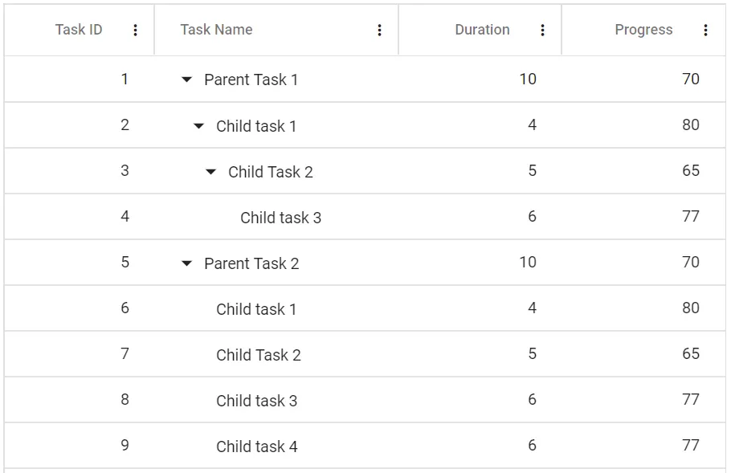

# Column Menu in Blazor TreeGrid 

The column menu has options to integrate features like sorting, filtering, and autofit. Clicking the column header’s menu icon displays a contextual menu with these options. To enable column menu, define the [ShowColumnMenu](https://help.syncfusion.com/cr/blazor/Syncfusion.Blazor.TreeGrid.SfTreeGrid-1.html#Syncfusion_Blazor_TreeGrid_SfTreeGrid_1_ShowColumnMenu) property as true.

The following table displays the default menu items.

| Item | Description |
|-----|-----|
| **SortAscending** | Sort the current column in ascending order. |
| **SortDescending** | Sort the current column in descending order. |
| **AutoFit** | Auto fit the current column. |
| **AutoFitAll** | Auto fit all columns. |
| **Filter** | Show the filter option as specified in **FilterSettings.Type** |





@using Syncfusion.Blazor.TreeGrid
@using TreeGridComponent.Data

<SfTreeGrid IdMapping="TaskId" ParentIdMapping="ParentId" DataSource="@TreeGridData" TreeColumnIndex="1" ShowColumnMenu="true" AllowFiltering="true" AllowSorting="true" >
    <TreeGridFilterSettings Type="Syncfusion.Blazor.TreeGrid.FilterType.Menu"></TreeGridFilterSettings>
    <TreeGridColumns>
        <TreeGridColumn Field="TaskId" HeaderText="Task ID" Width="90" TextAlign="Syncfusion.Blazor.Grids.TextAlign.Right"></TreeGridColumn>
        <TreeGridColumn Field="TaskName" HeaderText="Task Name" Width="180"></TreeGridColumn>
        <TreeGridColumn Field="Duration" HeaderText="Duration" TextAlign="Syncfusion.Blazor.Grids.TextAlign.Right" Width="100"></TreeGridColumn>
        <TreeGridColumn Field="Progress" HeaderText="Progress" TextAlign="Syncfusion.Blazor.Grids.TextAlign.Right" Width="100"></TreeGridColumn>
    </TreeGridColumns>
</SfTreeGrid>

@code {
    public List<TreeData.BusinessObject> TreeGridData { get; set; }

    protected override void OnInitialized()
    {
        TreeGridData = TreeData.GetSelfDataSource().ToList();
    }
}





namespace TreeGridComponent.Data
{
    public class TreeData
    {
        public class BusinessObject
        {
            public int TaskId { get; set; }
            public string TaskName { get; set; }
            public int? Duration { get; set; }
            public int? Progress { get; set; }
            public int? ParentId { get; set; }
        }

        public static List<BusinessObject> GetSelfDataSource()
        {
            List<BusinessObject> BusinessObjectCollection = new List<BusinessObject>
            {
                new BusinessObject() { TaskId = 1, TaskName = "Parent Task 1", Duration = 10, Progress = 70, ParentId = null },
                new BusinessObject() { TaskId = 2, TaskName = "Child task 1", Duration = 4, Progress = 80, ParentId = 1 },
                new BusinessObject() { TaskId = 3, TaskName = "Child Task 2", Duration = 5, Progress = 65, ParentId = 2 },
                new BusinessObject() { TaskId = 4, TaskName = "Child task 3", Duration = 6, Progress = 77, ParentId = 3 },
                new BusinessObject() { TaskId = 5, TaskName = "Parent Task 2", Duration = 10, Progress = 70, ParentId = null },
                new BusinessObject() { TaskId = 6, TaskName = "Child task 1", Duration = 4, Progress = 80, ParentId = 5 },
                new BusinessObject() { TaskId = 7, TaskName = "Child Task 2", Duration = 5, Progress = 65, ParentId = 5 },
                new BusinessObject() { TaskId = 8, TaskName = "Child task 3", Duration = 6, Progress = 77, ParentId = 5 },
                new BusinessObject() { TaskId = 9, TaskName = "Child task 4", Duration = 6, Progress = 77, ParentId = 5 }
            };

            return BusinessObjectCollection;
        }
    }
}





N> The column menu can be disabled for a particular column by defining the `ShowColumnMenu` property of the [TreeGridColumn](https://help.syncfusion.com/cr/blazor/Syncfusion.Blazor.TreeGrid.TreeGridColumn.html) tag helper as false.

# Column menu events in TreeGrid

The Blazor TreeGrid provides the [ColumnMenuItemClicked](https://help.syncfusion.com/cr/blazor/Syncfusion.Blazor.TreeGrid.TreeGridEvents-1.html#Syncfusion_Blazor_TreeGrid_TreeGridEvents_1_ColumnMenuItemClicked) event, which is triggered when a column menu item is clicked. This event can be used to perform actions based on the selected menu item.

**Event Arguments**

The event uses the [ColumnMenuClickEventArgs](https://help.syncfusion.com/cr/blazor/Syncfusion.Blazor.Grids.ColumnMenuClickEventArgs.html) class, which includes:

| Property | Type                     | Description                                           |
|----------|--------------------------|-------------------------------------------------------|
| Column   | TreeGridColumn           | The TreeGrid column associated with the menu popup.   |
| Element  | ElementReference         | The DOM element that triggered the event.             |
| Event    | System.EventArgs         | Provides event details for the column menu action.    |
| Item     | Navigations.MenuItemModel| The menu item that was clicked in the column menu.    |

---



@using Syncfusion.Blazor.Grids
@using Syncfusion.Blazor.TreeGrid
@using TreeGridComponent.Data

    @ColumnMenuMessage

<SfTreeGrid IdMapping="TaskId" ParentIdMapping="ParentId" DataSource="@TreeGridData" TreeColumnIndex="1" ShowColumnMenu="true" AllowFiltering="true" AllowSorting="true">
    <TreeGridFilterSettings Type="Syncfusion.Blazor.TreeGrid.FilterType.Menu"></TreeGridFilterSettings>
    <TreeGridEvents ColumnMenuItemClicked="ColumnMenuItemClickedHandler" TValue="TreeData.BusinessObject"></TreeGridEvents>
    <TreeGridColumns>
        <TreeGridColumn Field="TaskId" HeaderText="Task ID" Width="90" TextAlign="Syncfusion.Blazor.Grids.TextAlign.Right"></TreeGridColumn>
        <TreeGridColumn Field="TaskName" HeaderText="Task Name" Width="180"></TreeGridColumn>
        <TreeGridColumn Field="Duration" HeaderText="Duration" TextAlign="Syncfusion.Blazor.Grids.TextAlign.Right" Width="100"></TreeGridColumn>
        <TreeGridColumn Field="Progress" HeaderText="Progress" TextAlign="Syncfusion.Blazor.Grids.TextAlign.Right" Width="100"></TreeGridColumn>
    </TreeGridColumns>
</SfTreeGrid>

@code {
    public string ColumnMenuMessage;
    public List<TreeData.BusinessObject> TreeGridData { get; set; }

    protected override void OnInitialized()
    {
        TreeGridData = TreeData.GetSelfDataSource().ToList();
    }

    public void ColumnMenuItemClickedHandler(ColumnMenuClickEventArgs args)
    {
        ColumnMenuMessage = "ColumnMenuItemClicked event triggered";
    }
}


namespace TreeGridComponent.Data
{
    public class TreeData
    {
        public class BusinessObject
        {
            public int TaskId { get; set; }
            public string TaskName { get; set; }
            public int? Duration { get; set; }
            public int? Progress { get; set; }
            public int? ParentId { get; set; }
        }

        public static List<BusinessObject> GetSelfDataSource()
        {
            return new List<BusinessObject>
            {
                new BusinessObject() { TaskId = 1, TaskName = "Parent Task 1", Duration = 10, Progress = 70, ParentId = null },
                new BusinessObject() { TaskId = 2, TaskName = "Child task 1", Duration = 4, Progress = 80, ParentId = 1 },
                new BusinessObject() { TaskId = 3, TaskName = "Child Task 2", Duration = 5, Progress = 65, ParentId = 2 },
                new BusinessObject() { TaskId = 4, TaskName = "Child task 3", Duration = 6, Progress = 77, ParentId = 3 },
                new BusinessObject() { TaskId = 5, TaskName = "Parent Task 2", Duration = 10, Progress = 70, ParentId = null },
                new BusinessObject() { TaskId = 6, TaskName = "Child task 1", Duration = 4, Progress = 80, ParentId = 5 },
                new BusinessObject() { TaskId = 7, TaskName = "Child Task 2", Duration = 5, Progress = 65, ParentId = 5 },
                new BusinessObject() { TaskId = 8, TaskName = "Child task 3", Duration = 6, Progress = 77, ParentId = 5 },
                new BusinessObject() { TaskId = 9, TaskName = "Child task 4", Duration = 6, Progress = 77, ParentId = 5 }
            };
        }
    }
}

