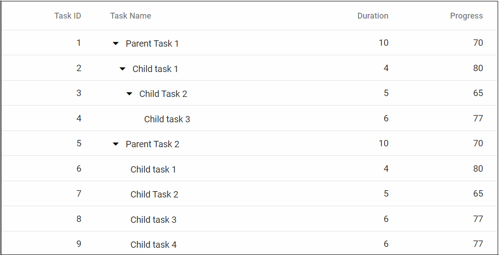
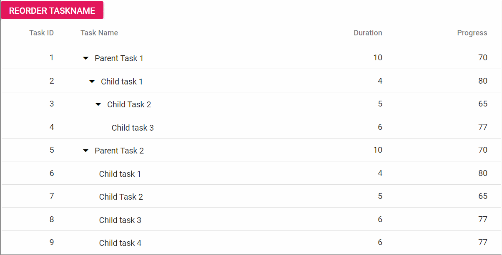
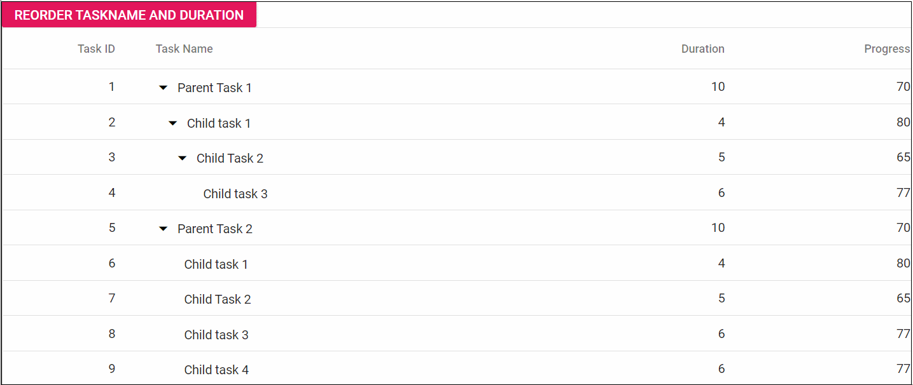

# Column Reorder in Blazor Tree Grid Component

Reordering can be done by drag and drop of a particular column header from one index to another index within the tree grid. To enable reordering, set the [AllowReordering](https://help.syncfusion.com/cr/blazor/Syncfusion.Blazor.TreeGrid.SfTreeGrid-1.html#Syncfusion_Blazor_TreeGrid_SfTreeGrid_1_AllowReordering) property to true.





@using TreeGridComponent.Data;
@using Syncfusion.Blazor.TreeGrid;

<SfTreeGrid IdMapping="TaskId" ParentIdMapping="ParentId" AllowReordering="true" DataSource="@TreeGridData" TreeColumnIndex="1">
    <TreeGridColumns>
        <TreeGridColumn Field="TaskId" HeaderText="Task ID" Width="80" TextAlign="Syncfusion.Blazor.Grids.TextAlign.Right"></TreeGridColumn>
        <TreeGridColumn Field="TaskName" HeaderText="Task Name" MinWidth="170" MaxWidth="250" Width="180"></TreeGridColumn>
        <TreeGridColumn Field="Duration" HeaderText="Duration" MinWidth="50" MaxWidth="150" TextAlign="Syncfusion.Blazor.Grids.TextAlign.Right" Width="80"></TreeGridColumn>
        <TreeGridColumn Field="Progress" HeaderText="Progress" TextAlign="Syncfusion.Blazor.Grids.TextAlign.Right" Width="80"></TreeGridColumn>
    </TreeGridColumns>
</SfTreeGrid>

@code{
    public List<TreeData.BusinessObject> TreeGridData { get; set; }
    protected override void OnInitialized()
    {
        this.TreeGridData = TreeData.GetSelfDataSource().ToList();
    }
}





namespace TreeGridComponent.Data {

public class TreeData
    {
        public class BusinessObject
        {
            public int TaskId { get; set;}
            public string TaskName { get; set;}
            public int? Duration { get; set;}
            public int? Progress { get; set;}
            public int? ParentId { get; set;}
        }

        public static List<BusinessObject> GetSelfDataSource()
        {
            List<BusinessObject> BusinessObjectCollection = new List<BusinessObject>();
            BusinessObjectCollection.Add(new BusinessObject() { TaskId = 1,TaskName = "Parent Task 1",Duration = 10,Progress = 70,ParentId = null });
            BusinessObjectCollection.Add(new BusinessObject() { TaskId = 2,TaskName = "Child task 1",Duration = 4,Progress = 80,ParentId = 1 });
            BusinessObjectCollection.Add(new BusinessObject() { TaskId = 3,TaskName = "Child Task 2",Duration = 5,Progress = 65,ParentId = 2 });
            BusinessObjectCollection.Add(new BusinessObject() { TaskId = 4,TaskName = "Child task 3",Duration = 6,Progress = 77,ParentId = 3 });
            BusinessObjectCollection.Add(new BusinessObject() { TaskId = 5,TaskName = "Parent Task 2",Duration = 10,Progress = 70,ParentId = null});
            BusinessObjectCollection.Add(new BusinessObject() { TaskId = 6,TaskName = "Child task 1",Duration = 4,Progress = 80,ParentId = 5});
            BusinessObjectCollection.Add(new BusinessObject() { TaskId = 7,TaskName = "Child Task 2",Duration = 5,Progress = 65,ParentId = 5});
            BusinessObjectCollection.Add(new BusinessObject() { TaskId = 8,TaskName = "Child task 3",Duration = 6,Progress = 77,ParentId = 5});
            BusinessObjectCollection.Add(new BusinessObject() { TaskId = 9,TaskName = "Child task 4",Duration = 6,Progress = 77,ParentId = 5});
            return BusinessObjectCollection;
        }
    }
}





N> You can disable reordering a particular column by setting the `AllowReordering` property of the [TreeGridColumn](https://help.syncfusion.com/cr/blazor/Syncfusion.Blazor~Syncfusion.Blazor.TreeGrid.TreeGridColumn.html) tag helper to false.

## Reorder single column

Tree Grid has option to reorder a column either by interaction or by using the [ReorderColumnsAsync](https://help.syncfusion.com/cr/blazor/Syncfusion.Blazor.TreeGrid.SfTreeGrid-1.html#Syncfusion_Blazor_TreeGrid_SfTreeGrid_1_ReorderColumnsAsync_System_Collections_Generic_List_System_String__System_String_) method. In the following sample, **TaskName** column is reordered to third column position by using the method on button click.





@using TreeGridComponent.Data;
@using Syncfusion.Blazor.Buttons;
@using Syncfusion.Blazor.TreeGrid;

<SfButton OnClick="ReorderColumn" CssClass="e-primary" IsPrimary="true" Content="Reorder TaskName"></SfButton>
<SfTreeGrid @ref="TreeGrid" IdMapping="TaskId" ParentIdMapping="ParentId" AllowReordering="true" DataSource="@TreeGridData" TreeColumnIndex="1">
    <TreeGridColumns>
        <TreeGridColumn Field="TaskId" HeaderText="Task ID" Width="80" TextAlign="Syncfusion.Blazor.Grids.TextAlign.Right"></TreeGridColumn>
        <TreeGridColumn Field="TaskName" HeaderText="Task Name" Width="180"></TreeGridColumn>
        <TreeGridColumn Field="Duration" HeaderText="Duration" MinWidth="50" MaxWidth="150" TextAlign="Syncfusion.Blazor.Grids.TextAlign.Right" Width="80"></TreeGridColumn>
        <TreeGridColumn Field="Progress" HeaderText="Progress" TextAlign="Syncfusion.Blazor.Grids.TextAlign.Right" Width="80"></TreeGridColumn>
    </TreeGridColumns>
</SfTreeGrid>

@code{
    private SfTreeGrid<TreeData.BusinessObject> TreeGrid;
    public List<TreeData.BusinessObject> TreeGridData { get; set; }
    protected override void OnInitialized()
    {
        this.TreeGridData = TreeData.GetSelfDataSource().ToList();
    }
    private async Task ReorderColumn()
    {
        await TreeGrid.ReorderColumnsAsync(new List<string>(){ "TaskName" }, "Duration");
    }
}





namespace TreeGridComponent.Data {

public class TreeData
    {
        public class BusinessObject
        {
            public int TaskId { get; set;}
            public string TaskName { get; set;}
            public int? Duration { get; set;}
            public int? Progress { get; set;}
            public int? ParentId { get; set;}
        }

        public static List<BusinessObject> GetSelfDataSource()
        {
            List<BusinessObject> BusinessObjectCollection = new List<BusinessObject>();
            BusinessObjectCollection.Add(new BusinessObject() { TaskId = 1,TaskName = "Parent Task 1",Duration = 10,Progress = 70,ParentId = null });
            BusinessObjectCollection.Add(new BusinessObject() { TaskId = 2,TaskName = "Child task 1",Duration = 4,Progress = 80,ParentId = 1 });
            BusinessObjectCollection.Add(new BusinessObject() { TaskId = 3,TaskName = "Child Task 2",Duration = 5,Progress = 65,ParentId = 2 });
            BusinessObjectCollection.Add(new BusinessObject() { TaskId = 4,TaskName = "Child task 3",Duration = 6,Progress = 77,ParentId = 3 });
            BusinessObjectCollection.Add(new BusinessObject() { TaskId = 5,TaskName = "Parent Task 2",Duration = 10,Progress = 70,ParentId = null});
            BusinessObjectCollection.Add(new BusinessObject() { TaskId = 6,TaskName = "Child task 1",Duration = 4,Progress = 80,ParentId = 5});
            BusinessObjectCollection.Add(new BusinessObject() { TaskId = 7,TaskName = "Child Task 2",Duration = 5,Progress = 65,ParentId = 5});
            BusinessObjectCollection.Add(new BusinessObject() { TaskId = 8,TaskName = "Child task 3",Duration = 6,Progress = 77,ParentId = 5});
            BusinessObjectCollection.Add(new BusinessObject() { TaskId = 9,TaskName = "Child task 4",Duration = 6,Progress = 77,ParentId = 5});
            return BusinessObjectCollection;
        }
    }
}





The following GIF represents the Reordering column **TaskName** by using the method,

## Reorder multiple columns

User can reorder a single column at a time by Interaction. Sometimes, you need to reorder multiple columns at the same time by passing list of columns programmatically in the [ReorderColumnsAsync](https://help.syncfusion.com/cr/blazor/Syncfusion.Blazor.TreeGrid.SfTreeGrid-1.html#Syncfusion_Blazor_TreeGrid_SfTreeGrid_1_ReorderColumnsAsync_System_Collections_Generic_List_System_String__System_String_) method.

In the following sample, **TaskName** and **Duration** columns are reordered to the last column position using this method on the click button.





@using TreeGridComponent.Data;
@using Syncfusion.Blazor.Buttons;
@using Syncfusion.Blazor.TreeGrid;

<SfButton OnClick="ReorderColumn" CssClass="e-primary" IsPrimary="true" Content="Reorder TaskName and Duration"></SfButton>
<SfTreeGrid @ref="TreeGrid" IdMapping="TaskId" ParentIdMapping="ParentId" AllowReordering="true" DataSource="@TreeGridData" TreeColumnIndex="1">
    <TreeGridColumns>
        <TreeGridColumn Field="TaskId" HeaderText="Task ID" Width="80" TextAlign="Syncfusion.Blazor.Grids.TextAlign.Right"></TreeGridColumn>
        <TreeGridColumn Field="TaskName" HeaderText="Task Name" MinWidth="170" MaxWidth="250" Width="180"></TreeGridColumn>
        <TreeGridColumn Field="Duration" HeaderText="Duration" MinWidth="50" MaxWidth="150" TextAlign="Syncfusion.Blazor.Grids.TextAlign.Right" Width="80"></TreeGridColumn>
        <TreeGridColumn Field="Progress" HeaderText="Progress" TextAlign="Syncfusion.Blazor.Grids.TextAlign.Right" Width="80"></TreeGridColumn>
    </TreeGridColumns>
</SfTreeGrid>

@code{
    private SfTreeGrid<TreeData.BusinessObject> TreeGrid;
    public List<TreeData.BusinessObject> TreeGridData { get; set; }
    protected override void OnInitialized()
    {
        this.TreeGridData = TreeData.GetSelfDataSource().ToList();
    }
    private async Task ReorderColumn()
    {
        await TreeGrid.ReorderColumnsAsync(new List<string>() { "TaskName", "Duration" }, "Progress");
    }
}





namespace TreeGridComponent.Data {

public class TreeData
    {
        public class BusinessObject
        {
            public int TaskId { get; set;}
            public string TaskName { get; set;}
            public int? Duration { get; set;}
            public int? Progress { get; set;}
            public int? ParentId { get; set;}
        }

        public static List<BusinessObject> GetSelfDataSource()
        {
            List<BusinessObject> BusinessObjectCollection = new List<BusinessObject>();
            BusinessObjectCollection.Add(new BusinessObject() { TaskId = 1,TaskName = "Parent Task 1",Duration = 10,Progress = 70,ParentId = null });
            BusinessObjectCollection.Add(new BusinessObject() { TaskId = 2,TaskName = "Child task 1",Duration = 4,Progress = 80,ParentId = 1 });
            BusinessObjectCollection.Add(new BusinessObject() { TaskId = 3,TaskName = "Child Task 2",Duration = 5,Progress = 65,ParentId = 2 });
            BusinessObjectCollection.Add(new BusinessObject() { TaskId = 4,TaskName = "Child task 3",Duration = 6,Progress = 77,ParentId = 3 });
            BusinessObjectCollection.Add(new BusinessObject() { TaskId = 5,TaskName = "Parent Task 2",Duration = 10,Progress = 70,ParentId = null});
            BusinessObjectCollection.Add(new BusinessObject() { TaskId = 6,TaskName = "Child task 1",Duration = 4,Progress = 80,ParentId = 5});
            BusinessObjectCollection.Add(new BusinessObject() { TaskId = 7,TaskName = "Child Task 2",Duration = 5,Progress = 65,ParentId = 5});
            BusinessObjectCollection.Add(new BusinessObject() { TaskId = 8,TaskName = "Child task 3",Duration = 6,Progress = 77,ParentId = 5});
            BusinessObjectCollection.Add(new BusinessObject() { TaskId = 9,TaskName = "Child task 4",Duration = 6,Progress = 77,ParentId = 5});
            return BusinessObjectCollection;
        }
    }
}





