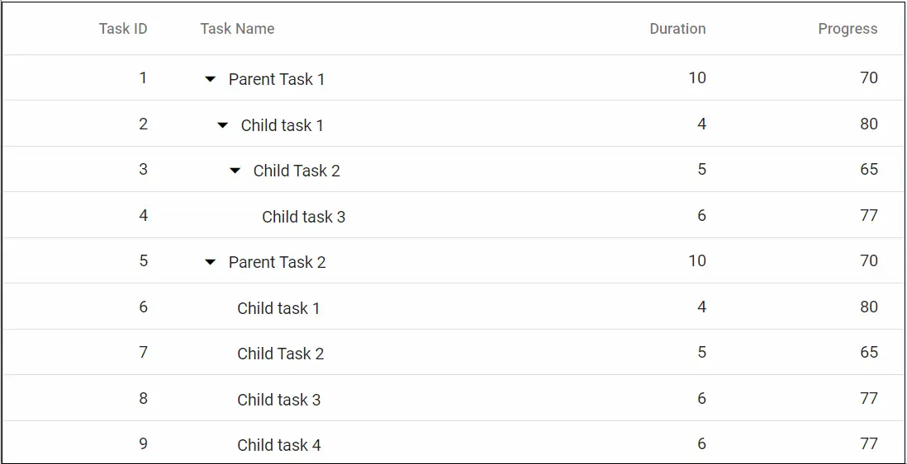
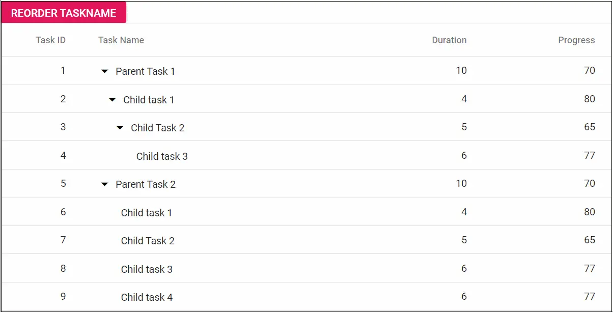
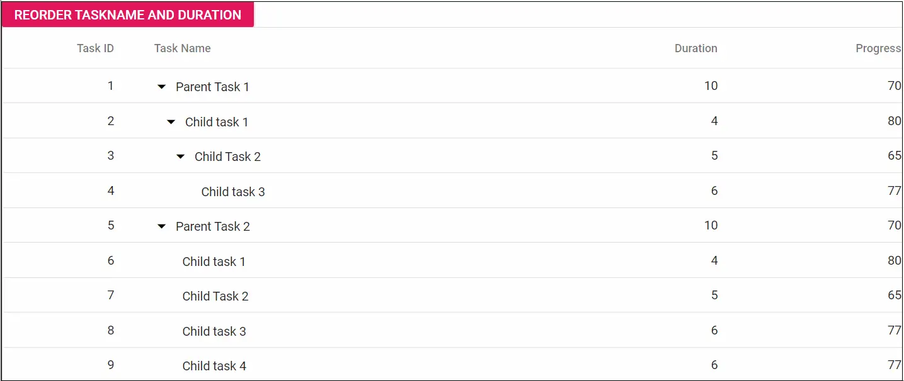

# Column Reordering in Blazor TreeGrid 

Drag and drop a column header to reorder it from one position to another position within the treegrid. To enable reordering, set the [AllowReordering](https://help.syncfusion.com/cr/blazor/Syncfusion.Blazor.TreeGrid.SfTreeGrid-1.html#Syncfusion_Blazor_TreeGrid_SfTreeGrid_1_AllowReordering) property to true.





@using Syncfusion.Blazor.TreeGrid
@using TreeGridComponent.Data

<SfTreeGrid IdMapping="TaskId" ParentIdMapping="ParentId" AllowReordering="true" DataSource="@TreeGridData" TreeColumnIndex="1">
    <TreeGridColumns>
        <TreeGridColumn Field="TaskId" HeaderText="Task ID" Width="90" TextAlign="Syncfusion.Blazor.Grids.TextAlign.Right"></TreeGridColumn>
        <TreeGridColumn Field="TaskName" HeaderText="Task Name" Width="180"></TreeGridColumn>
        <TreeGridColumn Field="Duration" HeaderText="Duration" TextAlign="Syncfusion.Blazor.Grids.TextAlign.Right" Width="100"></TreeGridColumn>
        <TreeGridColumn Field="Progress" HeaderText="Progress" TextAlign="Syncfusion.Blazor.Grids.TextAlign.Right" Width="100"></TreeGridColumn>
    </TreeGridColumns>
</SfTreeGrid>

@code {
    public List<TreeData.BusinessObject> TreeGridData { get; set; }

    protected override void OnInitialized()
    {
        TreeGridData = TreeData.GetSelfDataSource().ToList();
    }
}





namespace TreeGridComponent.Data
{
    public class TreeData
    {
        public class BusinessObject
        {
            public int TaskId { get; set; }
            public string TaskName { get; set; }
            public int? Duration { get; set; }
            public int? Progress { get; set; }
            public int? ParentId { get; set; }
        }

        public static List<BusinessObject> GetSelfDataSource()
        {
            List<BusinessObject> BusinessObjectCollection = new List<BusinessObject>
            {
                new BusinessObject() { TaskId = 1, TaskName = "Parent Task 1", Duration = 10, Progress = 70, ParentId = null },
                new BusinessObject() { TaskId = 2, TaskName = "Child task 1", Duration = 4, Progress = 80, ParentId = 1 },
                new BusinessObject() { TaskId = 3, TaskName = "Child Task 2", Duration = 5, Progress = 65, ParentId = 2 },
                new BusinessObject() { TaskId = 4, TaskName = "Child task 3", Duration = 6, Progress = 77, ParentId = 3 },
                new BusinessObject() { TaskId = 5, TaskName = "Parent Task 2", Duration = 10, Progress = 70, ParentId = null },
                new BusinessObject() { TaskId = 6, TaskName = "Child task 1", Duration = 4, Progress = 80, ParentId = 5 },
                new BusinessObject() { TaskId = 7, TaskName = "Child Task 2", Duration = 5, Progress = 65, ParentId = 5 },
                new BusinessObject() { TaskId = 8, TaskName = "Child task 3", Duration = 6, Progress = 77, ParentId = 5 },
                new BusinessObject() { TaskId = 9, TaskName = "Child task 4", Duration = 6, Progress = 77, ParentId = 5 }
            };

            return BusinessObjectCollection;
        }
    }
}





N> Reordering for a specific column can be disabled by setting the `AllowReordering` property of the [TreeGridColumn](https://help.syncfusion.com/cr/blazor/Syncfusion.Blazor.TreeGrid.TreeGridColumn.html) tag helper to false. 

## Reorder single column

TreeGrid has option to reorder a column either by interaction or by using the [ReorderColumnsAsync](https://help.syncfusion.com/cr/blazor/Syncfusion.Blazor.TreeGrid.SfTreeGrid-1.html#Syncfusion_Blazor_TreeGrid_SfTreeGrid_1_ReorderColumnsAsync_System_Collections_Generic_List_System_String__System_String_) method.





@using TreeGridComponent.Data;
@using Syncfusion.Blazor.TreeGrid;
@using Syncfusion.Blazor.Buttons;

<SfButton OnClick="ReorderColumn" CssClass="e-primary" IsPrimary="true" Content="Reorder TaskName Column"></SfButton>
<SfTreeGrid IdMapping="TaskId" ParentIdMapping="ParentId" AllowReordering="true" DataSource="@TreeGridData" TreeColumnIndex="1">
    <TreeGridColumns>
        <TreeGridColumn Field="TaskId" HeaderText="Task ID" Width="80" TextAlign="Syncfusion.Blazor.Grids.TextAlign.Right"></TreeGridColumn>
        <TreeGridColumn Field="TaskName" HeaderText="Task Name" MinWidth="170" MaxWidth="250" Width="180"></TreeGridColumn>
        <TreeGridColumn Field="Duration" HeaderText="Duration" MinWidth="50" MaxWidth="150" TextAlign="Syncfusion.Blazor.Grids.TextAlign.Right" Width="80"></TreeGridColumn>
        <TreeGridColumn Field="Progress" HeaderText="Progress" TextAlign="Syncfusion.Blazor.Grids.TextAlign.Right" Width="80"></TreeGridColumn>
    </TreeGridColumns>
</SfTreeGrid>

@code{
    public List<TreeData.BusinessObject> TreeGridData { get; set; }
    protected override void OnInitialized()
    {
        this.TreeGridData = TreeData.GetSelfDataSource().ToList();
    }
    private async Task ReorderColumn()
    {
        // Move TaskName column before Progress column (third position)
        await TreeGrid.ReorderColumnsAsync(new List<string> { "TaskName" }, "Progress");
    }
}





namespace TreeGridComponent.Data {

public class TreeData
    {
        public class BusinessObject
        {
            public int TaskId { get; set;}
            public string TaskName { get; set;}
            public int? Duration { get; set;}
            public int? Progress { get; set;}
            public int? ParentId { get; set;}
        }

        public static List<BusinessObject> GetSelfDataSource()
        {
            List<BusinessObject> BusinessObjectCollection = new List<BusinessObject>();
            BusinessObjectCollection.Add(new BusinessObject() { TaskId = 1,TaskName = "Parent Task 1",Duration = 10,Progress = 70,ParentId = null });
            BusinessObjectCollection.Add(new BusinessObject() { TaskId = 2,TaskName = "Child task 1",Duration = 4,Progress = 80,ParentId = 1 });
            BusinessObjectCollection.Add(new BusinessObject() { TaskId = 3,TaskName = "Child Task 2",Duration = 5,Progress = 65,ParentId = 2 });
            BusinessObjectCollection.Add(new BusinessObject() { TaskId = 4,TaskName = "Child task 3",Duration = 6,Progress = 77,ParentId = 3 });
            BusinessObjectCollection.Add(new BusinessObject() { TaskId = 5,TaskName = "Parent Task 2",Duration = 10,Progress = 70,ParentId = null});
            BusinessObjectCollection.Add(new BusinessObject() { TaskId = 6,TaskName = "Child task 1",Duration = 4,Progress = 80,ParentId = 5});
            BusinessObjectCollection.Add(new BusinessObject() { TaskId = 7,TaskName = "Child Task 2",Duration = 5,Progress = 65,ParentId = 5});
            BusinessObjectCollection.Add(new BusinessObject() { TaskId = 8,TaskName = "Child task 3",Duration = 6,Progress = 77,ParentId = 5});
            BusinessObjectCollection.Add(new BusinessObject() { TaskId = 9,TaskName = "Child task 4",Duration = 6,Progress = 77,ParentId = 5});
            return BusinessObjectCollection;
        }
    }
}





## Reorder multiple columns

A single column can be reordered through user interaction. Multiple columns can be reordered at the same time by passing a list of columns programmatically into the [ReorderColumnsAsync](https://help.syncfusion.com/cr/blazor/Syncfusion.Blazor.TreeGrid.SfTreeGrid-1.html#Syncfusion_Blazor_TreeGrid_SfTreeGrid_1_ReorderColumnsAsync_System_Collections_Generic_List_System_String__System_String_) method.





@using TreeGridComponent.Data;
@using Syncfusion.Blazor.Buttons;
@using Syncfusion.Blazor.TreeGrid;

<SfButton OnClick="ReorderColumn" CssClass="e-primary" IsPrimary="true" Content="Reorder TaskName and Duration"></SfButton>
<SfTreeGrid @ref="TreeGrid" IdMapping="TaskId" ParentIdMapping="ParentId" AllowReordering="true" DataSource="@TreeGridData" TreeColumnIndex="1">
    <TreeGridColumns>
        <TreeGridColumn Field="TaskId" HeaderText="Task ID" Width="80" TextAlign="Syncfusion.Blazor.Grids.TextAlign.Right"></TreeGridColumn>
        <TreeGridColumn Field="TaskName" HeaderText="Task Name" MinWidth="170" MaxWidth="250" Width="180"></TreeGridColumn>
        <TreeGridColumn Field="Duration" HeaderText="Duration" MinWidth="50" MaxWidth="150" TextAlign="Syncfusion.Blazor.Grids.TextAlign.Right" Width="80"></TreeGridColumn>
        <TreeGridColumn Field="Progress" HeaderText="Progress" TextAlign="Syncfusion.Blazor.Grids.TextAlign.Right" Width="80"></TreeGridColumn>
    </TreeGridColumns>
</SfTreeGrid>

@code{
    private SfTreeGrid<TreeData.BusinessObject> TreeGrid;
    public List<TreeData.BusinessObject> TreeGridData { get; set; }
    protected override void OnInitialized()
    {
        this.TreeGridData = TreeData.GetSelfDataSource().ToList();
    }
    private async Task ReorderColumn()
    {
        await TreeGrid.ReorderColumnsAsync(new List<string>() { "TaskName", "Duration" }, "Progress");
    }
}





namespace TreeGridComponent.Data {

public class TreeData
    {
        public class BusinessObject
        {
            public int TaskId { get; set;}
            public string TaskName { get; set;}
            public int? Duration { get; set;}
            public int? Progress { get; set;}
            public int? ParentId { get; set;}
        }

        public static List<BusinessObject> GetSelfDataSource()
        {
            List<BusinessObject> BusinessObjectCollection = new List<BusinessObject>();
            BusinessObjectCollection.Add(new BusinessObject() { TaskId = 1,TaskName = "Parent Task 1",Duration = 10,Progress = 70,ParentId = null });
            BusinessObjectCollection.Add(new BusinessObject() { TaskId = 2,TaskName = "Child task 1",Duration = 4,Progress = 80,ParentId = 1 });
            BusinessObjectCollection.Add(new BusinessObject() { TaskId = 3,TaskName = "Child Task 2",Duration = 5,Progress = 65,ParentId = 2 });
            BusinessObjectCollection.Add(new BusinessObject() { TaskId = 4,TaskName = "Child task 3",Duration = 6,Progress = 77,ParentId = 3 });
            BusinessObjectCollection.Add(new BusinessObject() { TaskId = 5,TaskName = "Parent Task 2",Duration = 10,Progress = 70,ParentId = null});
            BusinessObjectCollection.Add(new BusinessObject() { TaskId = 6,TaskName = "Child task 1",Duration = 4,Progress = 80,ParentId = 5});
            BusinessObjectCollection.Add(new BusinessObject() { TaskId = 7,TaskName = "Child Task 2",Duration = 5,Progress = 65,ParentId = 5});
            BusinessObjectCollection.Add(new BusinessObject() { TaskId = 8,TaskName = "Child task 3",Duration = 6,Progress = 77,ParentId = 5});
            BusinessObjectCollection.Add(new BusinessObject() { TaskId = 9,TaskName = "Child task 4",Duration = 6,Progress = 77,ParentId = 5});
            return BusinessObjectCollection;
        }
    }
}





## Reorder events in TreeGrid

The Blazor TreeGrid provides events to handle column reordering interactions. These events allow executing custom logic during drag-and-drop operations.

1. [ColumnReordering](https://help.syncfusion.com/cr/blazor/Syncfusion.Blazor.TreeGrid.TreeGridEvents-1.html#Syncfusion_Blazor_TreeGrid_TreeGridEvents_1_ColumnReordering) – Triggered while a column header is being dragged.  
2. [ColumnReordered](https://help.syncfusion.com/cr/blazor/Syncfusion.Blazor.TreeGrid.TreeGridEvents-1.html#Syncfusion_Blazor_TreeGrid_TreeGridEvents_1_ColumnReordered) – Triggered when a column header is dropped on the target column.

---

## ColumnReordering

The `ColumnReordering` event is triggered while a column header is being dragged during a reordering operation. This event can be used to inspect the column being moved and optionally cancel the reordering based on custom logic.

**Event Arguments**

The event uses the [ColumnReorderingEventArgs](https://help.syncfusion.com/cr/blazor/Syncfusion.Blazor.Grids.ColumnReorderingEventArgs.html) class, which includes:

| Event Argument     | Type                   | Description                                                                 |
|--------------------|------------------------|------------------------------------------------------------------------------|
| ReorderingColumns  | List<TreeGridColumn>   | Represents the columns being dragged.                                       |
| Cancel             | bool                   | Set to **true** to cancel the reordering operation.                         |

---

## ColumnReordered

The `ColumnReordered` event is triggered after a column header is dropped on the target column during a reordering operation. This event allows executing custom logic after the reordering is completed, such as updating UI elements or logging changes.

**Event Arguments**

The event uses the [ColumnReorderedEventArgs](https://help.syncfusion.com/cr/blazor/Syncfusion.Blazor.Grids.ColumnReorderedEventArgs.html) class, which includes:

| Parameter           | Type                   | Description                                                                 |
|---------------------|------------------------|-----------------------------------------------------------------------------|
| ReorderingColumns   | List<TreeGridColumn>   | Represents the columns that were reordered.                                 |
| ToColumn            | TreeGridColumn         | Destination column where the reordered columns are placed.                  |

---



@using Syncfusion.Blazor.Grids
@using TreeGridComponent.Data;
@using Syncfusion.Blazor.TreeGrid;
@using Syncfusion.Blazor.Buttons;

    @ReorderMessage

<SfButton OnClick="ReorderColumn" CssClass="e-primary" IsPrimary="true" Content="Reorder TaskName Column"></SfButton>

<SfTreeGrid @ref="TreeGrid" IdMapping="TaskId" ParentIdMapping="ParentId" AllowReordering="true" DataSource="@TreeGridData" TreeColumnIndex="1">
    <TreeGridEvents TValue="TreeData.BusinessObject" ColumnReordering="OnColumnReordering" ColumnReordered="OnColumnReordered"></TreeGridEvents>
    <TreeGridColumns>
        <TreeGridColumn Field="TaskId" HeaderText="Task ID" Width="80" TextAlign="Syncfusion.Blazor.Grids.TextAlign.Right"></TreeGridColumn>
        <TreeGridColumn Field="TaskName" HeaderText="Task Name" MinWidth="170" MaxWidth="250" Width="180"></TreeGridColumn>
        <TreeGridColumn Field="Duration" HeaderText="Duration" MinWidth="50" MaxWidth="150" TextAlign="Syncfusion.Blazor.Grids.TextAlign.Right" Width="80"></TreeGridColumn>
        <TreeGridColumn Field="Progress" HeaderText="Progress" TextAlign="Syncfusion.Blazor.Grids.TextAlign.Right" Width="80"></TreeGridColumn>
    </TreeGridColumns>
</SfTreeGrid>

@code {
    private SfTreeGrid<TreeData.BusinessObject> TreeGrid;
    public string ReorderMessage;
    public List<TreeData.BusinessObject> TreeGridData { get; set; }

    protected override void OnInitialized()
    {
        TreeGridData = TreeData.GetSelfDataSource().ToList();
    }

    private async Task ReorderColumn()
    {
        // Move TaskName column before Progress column (third position)
        await TreeGrid.ReorderColumnsAsync(new List<string> { "TaskName" }, "Progress");
    }

    public void OnColumnReordering(ColumnReorderingEventArgs args)
    {
        if (args.ReorderingColumns[0].Field == "TaskId")
        {
            args.Cancel = true;
            ReorderMessage = "ColumnReordering event triggered. Reordering cancelled for " + args.ReorderingColumns[0].HeaderText + " column.";
        }
    }

    public void OnColumnReordered(ColumnReorderedEventArgs args)
    {
        ReorderMessage = "ColumnReordered event triggered. " + args.ReorderingColumns[0].HeaderText + " column moved to index " + args.ReorderingColumns[0].Index;
    }
}


namespace TreeGridComponent.Data {
    public class TreeData {
        public class BusinessObject {
            public int TaskId { get; set; }
            public string TaskName { get; set; }
            public int? Duration { get; set; }
            public int? Progress { get; set; }
            public int? ParentId { get; set; }
        }

        public static List<BusinessObject> GetSelfDataSource() {
            return new List<BusinessObject> {
                new BusinessObject() { TaskId = 1, TaskName = "Parent Task 1", Duration = 10, Progress = 70, ParentId = null },
                new BusinessObject() { TaskId = 2, TaskName = "Child task 1", Duration = 4, Progress = 80, ParentId = 1 },
                new BusinessObject() { TaskId = 3, TaskName = "Child Task 2", Duration = 5, Progress = 65, ParentId = 2 },
                new BusinessObject() { TaskId = 4, TaskName = "Child task 3", Duration = 6, Progress = 77, ParentId = 3 },
                new BusinessObject() { TaskId = 5, TaskName = "Parent Task 2", Duration = 10, Progress = 70, ParentId = null },
                new BusinessObject() { TaskId = 6, TaskName = "Child task 1", Duration = 4, Progress = 80, ParentId = 5 },
                new BusinessObject() { TaskId = 7, TaskName = "Child Task 2", Duration = 5, Progress = 65, ParentId = 5 },
                new BusinessObject() { TaskId = 8, TaskName = "Child task 3", Duration = 6, Progress = 77, ParentId = 5 },
                new BusinessObject() { TaskId = 9, TaskName = "Child task 4", Duration = 6, Progress = 77, ParentId = 5 }
            };
        }
    }
}

