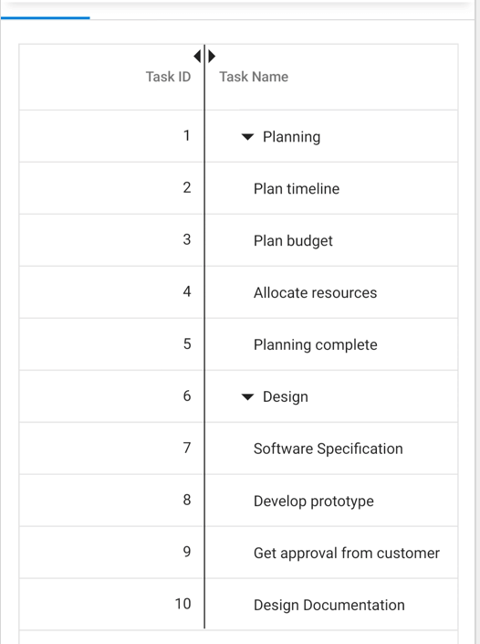

# Column Resizing in Blazor TreeGrid

The Syncfusion&reg; Blazor TreeGrid provides an intuitive interface for resizing columns to fit their content. This feature allows columns to be adjusted for improved readability and layout control.

To enable column resizing, set the [AllowResizing](https://help.syncfusion.com/cr/blazor/Syncfusion.Blazor.TreeGrid.SfTreeGrid-1.html#Syncfusion_Blazor_TreeGrid_SfTreeGrid_1_AllowResizing) property of the [TreeGrid](https://help.syncfusion.com/cr/blazor/Syncfusion.Blazor.TreeGrid.SfTreeGrid-1.html) component to **true**.

Once enabled, column width can be adjusted by clicking and dragging the right edge of the column header. The column resizes immediately during the drag operation.



@using Syncfusion.Blazor.TreeGrid

<SfTreeGrid IdMapping="TaskId" ParentIdMapping="ParentId" AllowResizing="true" DataSource="@TreeGridData" TreeColumnIndex="1">
    <TreeGridColumns>
        <TreeGridColumn Field="TaskId" HeaderText="Task ID" Width="80" TextAlign="Syncfusion.Blazor.Grids.TextAlign.Right"></TreeGridColumn>
        <TreeGridColumn Field="TaskName" HeaderText="Task Name" Width="180"></TreeGridColumn>
        <TreeGridColumn Field="Duration" HeaderText="Duration" TextAlign="Syncfusion.Blazor.Grids.TextAlign.Right" Width="100"></TreeGridColumn>
        <TreeGridColumn Field="Progress" HeaderText="Progress" TextAlign="Syncfusion.Blazor.Grids.TextAlign.Right" Width="100"></TreeGridColumn>
    </TreeGridColumns>
</SfTreeGrid>

@code {
    public List<TreeData.BusinessObject> TreeGridData { get; set; }

    protected override void OnInitialized()
    {
        TreeGridData = TreeData.GetSelfDataSource().ToList();
    }
}


namespace TreeGridComponent.Data
{
    public class TreeData
    {
        public class BusinessObject
        {
            public int TaskId { get; set; }
            public string TaskName { get; set; }
            public int? Duration { get; set; }
            public int? Progress { get; set; }
            public int? ParentId { get; set; }
        }

        public static List<BusinessObject> GetSelfDataSource()
        {
            List<BusinessObject> BusinessObjectCollection = new List<BusinessObject>
            {
                new BusinessObject() { TaskId = 1, TaskName = "Parent Task 1", Duration = 10, Progress = 70, ParentId = null },
                new BusinessObject() { TaskId = 2, TaskName = "Child task 1", Duration = 4, Progress = 80, ParentId = 1 },
                new BusinessObject() { TaskId = 3, TaskName = "Child Task 2", Duration = 5, Progress = 65, ParentId = 2 },
                new BusinessObject() { TaskId = 4, TaskName = "Child task 3", Duration = 6, Progress = 77, ParentId = 3 },
                new BusinessObject() { TaskId = 5, TaskName = "Parent Task 2", Duration = 10, Progress = 70, ParentId = null },
                new BusinessObject() { TaskId = 6, TaskName = "Child task 1", Duration = 4, Progress = 80, ParentId = 5 },
                new BusinessObject() { TaskId = 7, TaskName = "Child Task 2", Duration = 5, Progress = 65, ParentId = 5 },
                new BusinessObject() { TaskId = 8, TaskName = "Child task 3", Duration = 6, Progress = 77, ParentId = 5 },
                new BusinessObject() { TaskId = 9, TaskName = "Child task 4", Duration = 6, Progress = 77, ParentId = 5 }
            };

            return BusinessObjectCollection;
        }
    }
}



> * To disable resizing for a specific column, set the [AllowResizing](https://help.syncfusion.com/cr/blazor/Syncfusion.Blazor.TreeGrid.TreeGridColumn.html#Syncfusion_Blazor_TreeGrid_TreeGridColumn_AllowResizing) property of the [TreeGridColumn](https://help.syncfusion.com/cr/blazor/Syncfusion.Blazor.TreeGrid.TreeGridColumn.html) to **false**.
> * In RTL mode, column resizing is performed by dragging the left edge of the header cell.

## Restrict the resizing based on minimum and maximum width

The Syncfusion&reg; Blazor TreeGrid allows restricting column resizing between a defined minimum and maximum width. This ensures that columns remain within a specific size range, maintaining layout consistency and readability.

To configure this behavior, set the [MinWidth](https://help.syncfusion.com/cr/blazor/Syncfusion.Blazor.TreeGrid.TreeGridColumn.html#Syncfusion_Blazor_TreeGrid_TreeGridColumn_MinWidth) and [MaxWidth](https://help.syncfusion.com/cr/blazor/Syncfusion.Blazor.TreeGrid.TreeGridColumn.html#Syncfusion_Blazor_TreeGrid_TreeGridColumn_MaxWidth) properties for the respective [TreeGridColumn](https://help.syncfusion.com/cr/blazor/Syncfusion.Blazor.TreeGrid.TreeGridColumn.html).



@using Syncfusion.Blazor.TreeGrid

<SfTreeGrid IdMapping="TaskId" ParentIdMapping="ParentId" AllowResizing="true" DataSource="@TreeGridData" TreeColumnIndex="1">
    <TreeGridColumns>
        <TreeGridColumn Field="TaskId" HeaderText="Task ID" Width="90" TextAlign="Syncfusion.Blazor.Grids.TextAlign.Right"></TreeGridColumn>
        <TreeGridColumn Field="TaskName" HeaderText="Task Name" MinWidth="170" MaxWidth="250" Width="180"></TreeGridColumn>
        <TreeGridColumn Field="Duration" HeaderText="Duration" MinWidth="80" MaxWidth="150" TextAlign="Syncfusion.Blazor.Grids.TextAlign.Right" Width="100"></TreeGridColumn>
        <TreeGridColumn Field="Progress" HeaderText="Progress" TextAlign="Syncfusion.Blazor.Grids.TextAlign.Right" Width="100"></TreeGridColumn>
    </TreeGridColumns>
</SfTreeGrid>

@code {
    public List<TreeData.BusinessObject> TreeGridData { get; set; }

    protected override void OnInitialized()
    {
        TreeGridData = TreeData.GetSelfDataSource().ToList();
    }
}


namespace TreeGridComponent.Data
{
    public class TreeData
    {
        public class BusinessObject
        {
            public int TaskId { get; set; }
            public string TaskName { get; set; }
            public int? Duration { get; set; }
            public int? Progress { get; set; }
            public int? ParentId { get; set; }
        }

        public static List<BusinessObject> GetSelfDataSource()
        {
            List<BusinessObject> BusinessObjectCollection = new List<BusinessObject>
            {
                new BusinessObject() { TaskId = 1, TaskName = "Parent Task 1", Duration = 10, Progress = 70, ParentId = null },
                new BusinessObject() { TaskId = 2, TaskName = "Child task 1", Duration = 4, Progress = 80, ParentId = 1 },
                new BusinessObject() { TaskId = 3, TaskName = "Child Task 2", Duration = 5, Progress = 65, ParentId = 2 },
                new BusinessObject() { TaskId = 4, TaskName = "Child task 3", Duration = 6, Progress = 77, ParentId = 3 },
                new BusinessObject() { TaskId = 5, TaskName = "Parent Task 2", Duration = 10, Progress = 70, ParentId = null },
                new BusinessObject() { TaskId = 6, TaskName = "Child task 1", Duration = 4, Progress = 80, ParentId = 5 },
                new BusinessObject() { TaskId = 7, TaskName = "Child Task 2", Duration = 5, Progress = 65, ParentId = 5 },
                new BusinessObject() { TaskId = 8, TaskName = "Child task 3", Duration = 6, Progress = 77, ParentId = 5 },
                new BusinessObject() { TaskId = 9, TaskName = "Child task 4", Duration = 6, Progress = 77, ParentId = 5 }
            };

            return BusinessObjectCollection;
        }
    }
}



> * The `MinWidth` and `MaxWidth` properties are applied only during column resizing. These constraints are not enforced when resizing the browser window.
> * When resizing exceeds the defined range, the column width is automatically restricted to the nearest valid value within the specified limits.

## Prevent resizing for particular column

The Syncfusion&reg; Blazor TreeGrid provides the ability to restrict resizing for individual columns. This is useful when a column's width must remain fixed for layout consistency or to prevent unintended changes.

To disable resizing for a specific column, set the [AllowResizing](https://help.syncfusion.com/cr/blazor/Syncfusion.Blazor.TreeGrid.TreeGridColumn.html#Syncfusion_Blazor_TreeGrid_TreeGridColumn_AllowResizing) property of that [TreeGridColumn](https://help.syncfusion.com/cr/blazor/Syncfusion.Blazor.TreeGrid.TreeGridColumn.html) to **false**.

In this configuration, resizing is disabled for the **TaskName** column.



@using Syncfusion.Blazor.TreeGrid

<SfTreeGrid IdMapping="TaskId" ParentIdMapping="ParentId" AllowResizing="true" DataSource="@TreeGridData" TreeColumnIndex="1">
    <TreeGridColumns>
        <TreeGridColumn Field="TaskId" HeaderText="Task ID" Width="90" TextAlign="Syncfusion.Blazor.Grids.TextAlign.Right"></TreeGridColumn>
        <TreeGridColumn Field="TaskName" HeaderText="Task Name" AllowResizing="false" Width="180"></TreeGridColumn>
        <TreeGridColumn Field="Duration" HeaderText="Duration" TextAlign="Syncfusion.Blazor.Grids.TextAlign.Right" Width="100"></TreeGridColumn>
        <TreeGridColumn Field="Progress" HeaderText="Progress" TextAlign="Syncfusion.Blazor.Grids.TextAlign.Right" Width="100"></TreeGridColumn>
    </TreeGridColumns>
</SfTreeGrid>

@code {
    public List<TreeData.BusinessObject> TreeGridData { get; set; }

    protected override void OnInitialized()
    {
        TreeGridData = TreeData.GetSelfDataSource().ToList();
    }
}


namespace TreeGridComponent.Data
{
    public class TreeData
    {
        public class BusinessObject
        {
            public int TaskId { get; set; }
            public string TaskName { get; set; }
            public int? Duration { get; set; }
            public int? Progress { get; set; }
            public int? ParentId { get; set; }
        }

        public static List<BusinessObject> GetSelfDataSource()
        {
            List<BusinessObject> BusinessObjectCollection = new List<BusinessObject>
            {
                new BusinessObject() { TaskId = 1, TaskName = "Parent Task 1", Duration = 10, Progress = 70, ParentId = null },
                new BusinessObject() { TaskId = 2, TaskName = "Child task 1", Duration = 4, Progress = 80, ParentId = 1 },
                new BusinessObject() { TaskId = 3, TaskName = "Child Task 2", Duration = 5, Progress = 65, ParentId = 2 },
                new BusinessObject() { TaskId = 4, TaskName = "Child task 3", Duration = 6, Progress = 77, ParentId = 3 },
                new BusinessObject() { TaskId = 5, TaskName = "Parent Task 2", Duration = 10, Progress = 70, ParentId = null },
                new BusinessObject() { TaskId = 6, TaskName = "Child task 1", Duration = 4, Progress = 80, ParentId = 5 },
                new BusinessObject() { TaskId = 7, TaskName = "Child Task 2", Duration = 5, Progress = 65, ParentId = 5 },
                new BusinessObject() { TaskId = 8, TaskName = "Child task 3", Duration = 6, Progress = 77, ParentId = 5 },
                new BusinessObject() { TaskId = 9, TaskName = "Child task 4", Duration = 6, Progress = 77, ParentId = 5 }
            };

            return BusinessObjectCollection;
        }
    }
}



> Resizing can also be prevented dynamically by setting **args.Cancel** to **true** in the [OnResizeStart](https://help.syncfusion.com/cr/blazor/Syncfusion.Blazor.TreeGrid.TreeGridEvents-1.html#Syncfusion_Blazor_TreeGrid_TreeGridEvents_1_OnResizeStart) event.

## Resize stacked header column

The Syncfusion&reg; Blazor TreeGrid allows resizing stacked columns by dragging the right edge of the stacked column header. During this action, the widths of the child columns are adjusted simultaneously.

To disable resizing for a specific stacked column, set the [AllowResizing](https://help.syncfusion.com/cr/blazor/Syncfusion.Blazor.TreeGrid.TreeGridColumn.html#Syncfusion_Blazor_TreeGrid_TreeGridColumn_AllowResizing) property of that [TreeGridColumn](https://help.syncfusion.com/cr/blazor/Syncfusion.Blazor.TreeGrid.TreeGridColumn.html) to **false**.



@using Syncfusion.Blazor.TreeGrid

<SfTreeGrid IdMapping="ID" ParentIdMapping="ParentID" DataSource="@TreeGridData" TreeColumnIndex="1" AllowResizing="true">
    <TreeGridColumns>
        <TreeGridColumn HeaderText="Order Details" TextAlign="Syncfusion.Blazor.Grids.TextAlign.Right">
            <TreeGridColumns>
                <TreeGridColumn Field="ID" Width="110" HeaderText="Order ID" TextAlign="Syncfusion.Blazor.Grids.TextAlign.Right"></TreeGridColumn>
                <TreeGridColumn Field="Name" Width="220" HeaderText="Order Name" TextAlign="Syncfusion.Blazor.Grids.TextAlign.Left"></TreeGridColumn>
                <TreeGridColumn Field="OrderDate" Width="120" HeaderText="Order Date" TextAlign="Syncfusion.Blazor.Grids.TextAlign.Right" Format="yMd" Type="Syncfusion.Blazor.Grids.ColumnType.Date"></TreeGridColumn>
            </TreeGridColumns>
        </TreeGridColumn>
        <TreeGridColumn HeaderText="Shipment Details" TextAlign="Syncfusion.Blazor.Grids.TextAlign.Center">
            <TreeGridColumns>
                <TreeGridColumn Field="ShipmentCategory" Width="170" HeaderText="Shipment Category"></TreeGridColumn>
                <TreeGridColumn Field="Units" Width="220" HeaderText="Units" TextAlign="Syncfusion.Blazor.Grids.TextAlign.Left"></TreeGridColumn>
                <TreeGridColumn Field="ShippedDate" Width="120" HeaderText="Shipment Date" TextAlign="Syncfusion.Blazor.Grids.TextAlign.Right" Format="yMd" Type="Syncfusion.Blazor.Grids.ColumnType.Date"></TreeGridColumn>
            </TreeGridColumns>
        </TreeGridColumn>
        <TreeGridColumn HeaderText="Price Details" TextAlign="Syncfusion.Blazor.Grids.TextAlign.Center">
            <TreeGridColumns>
                <TreeGridColumn Field="UnitPrice" Width="180" HeaderText="Price per unit" Format="C2" Type="Syncfusion.Blazor.Grids.ColumnType.Integer" TextAlign="Syncfusion.Blazor.Grids.TextAlign.Right"></TreeGridColumn>
                <TreeGridColumn Field="Price" Width="220" HeaderText="Price" Format="C" TextAlign="Syncfusion.Blazor.Grids.TextAlign.Left"></TreeGridColumn>
                <TreeGridColumn Field="OrderDate" Width="120" HeaderText="Total Price" TextAlign="Syncfusion.Blazor.Grids.TextAlign.Right" Type="Syncfusion.Blazor.Grids.ColumnType.Integer"></TreeGridColumn>
            </TreeGridColumns>
        </TreeGridColumn>
    </TreeGridColumns>
</SfTreeGrid>

@code {
    public List<ShipmentData> TreeGridData { get; set; }

    protected override void OnInitialized()
    {
        TreeGridData = ShipmentData.GetShipmentData().ToList();
    }
}


namespace TreeGridComponent.Data
{
    public class ShipmentData
    {
        public int ID { get; set; }
        public string Name { get; set; }
        public int Units { get; set; }
        public string Category { get; set; }
        public int UnitPrice { get; set; }
        public int Price { get; set; }
        public int? ParentID { get; set; }
        public string ShipmentCategory { get; set; }
        public DateTime ShippedDate { get; set; }
        public DateTime OrderDate { get; set; }
        public List<ShipmentData> Children { get; set; }

        public static List<ShipmentData> GetShipmentData()
        {
            List<ShipmentData> DataCollection = new List<ShipmentData>()
            {
                new ShipmentData() { ID = 1, Name = "Order 1", Category = "Seafood", Units = 1395, UnitPrice = 47, Price = 65565, ParentID = null, OrderDate = new DateTime(2017, 3, 2), ShippedDate = new DateTime(2017, 9, 2), ShipmentCategory = "Seafood" },
                new ShipmentData() { ID = 11, Name = "Mackerel", Category = "Frozen Seafood", Units = 235, UnitPrice = 12, Price = 2820, ParentID = 1, OrderDate = new DateTime(2017, 3, 3), ShippedDate = new DateTime(2017, 10, 3), ShipmentCategory = "Frozen Seafood" },
                new ShipmentData() { ID = 12, Name = "Yellowfin Tuna", Category = "Frozen Seafood", Units = 324, UnitPrice = 8, Price = 2592, ParentID = 1, OrderDate = new DateTime(2017, 3, 5), ShippedDate = new DateTime(2017, 10, 5), ShipmentCategory = "Frozen Seafood" },
                new ShipmentData() { ID = 13, Name = "Herrings", Category = "Frozen Seafood", Units = 488, UnitPrice = 11, Price = 5368, ParentID = 1, OrderDate = new DateTime(2017, 8, 5), ShippedDate = new DateTime(2017, 5, 15), ShipmentCategory = "Frozen Seafood" },
                new ShipmentData() { ID = 14, Name = "Preserved Olives", Category = "Edible", Units = 125, UnitPrice = 9, Price = 1125, ParentID = 1, OrderDate = new DateTime(2017, 6, 10), ShippedDate = new DateTime(2017, 6, 17), ShipmentCategory = "Edible" },
                new ShipmentData() { ID = 15, Name = "Sweet corn Frozen", Category = "Edible", Units = 223, UnitPrice = 7, Price = 1561, ParentID = 1, OrderDate = new DateTime(2017, 7, 12), ShippedDate = new DateTime(2017, 7, 19), ShipmentCategory = "Edible" },
                new ShipmentData() { ID = 2, Name = "Order 2", Category = "Products", Units = 1944, UnitPrice = 58, Price = 21233, ParentID = null, OrderDate = new DateTime(2017, 1, 10), ShippedDate = new DateTime(2017, 1, 16), ShipmentCategory = "Seafood", Children = new List<ShipmentData>() },
                new ShipmentData() { ID = 21, Name = "Tilapias", Category = "Frozen Seafood", Units = 278, UnitPrice = 15, Price = 4170, ParentID = 2, OrderDate = new DateTime(2017, 2, 5), ShippedDate = new DateTime(2017, 2, 12), ShipmentCategory = "Frozen Seafood" },
                new ShipmentData() { ID = 22, Name = "White Shrimp", Category = "Frozen Seafood", Units = 560, UnitPrice = 7, Price = 3920, ParentID = 2, OrderDate = new DateTime(2017, 5, 22), ShippedDate = new DateTime(2017, 5, 29), ShipmentCategory = "Frozen Seafood" },
                new ShipmentData() { ID = 23, Name = "Fresh Cheese", Category = "Dairy", Units = 323, UnitPrice = 12, Price = 3876, ParentID = 2, OrderDate = new DateTime(2017, 6, 8), ShippedDate = new DateTime(2017, 6, 15), ShipmentCategory = "Dairy" },
                new ShipmentData() { ID = 24, Name = "Blue Veined Cheese", Category = "Dairy", Units = 370, UnitPrice = 15, Price = 5550, ParentID = 2, OrderDate = new DateTime(2017, 7, 10), ShippedDate = new DateTime(2017, 7, 17), ShipmentCategory = "Dairy" },
                new ShipmentData() { ID = 25, Name = "Butter", Category = "Dairy", Units = 413, UnitPrice = 9, Price = 3717, ParentID = 2, OrderDate = new DateTime(2017, 9, 18), ShippedDate = new DateTime(2017, 9, 25), ShipmentCategory = "Dairy" }
            };

            return DataCollection;
        }
    }
}



Resizing of stacked header is shown below

## Touch interaction

The Syncfusion&reg; Blazor TreeGrid supports touch interactions, enabling column resizing on mobile devices. Columns can be resized by tapping and dragging the floating handler, or adjusted using the column menu options.

**Resizing columns on touch devices**

To resize a column:

1. Tap the right edge of the column header.
2. A floating handler appears over the column’s right border.
3. Tap and drag the handler to adjust the column width.

## Resize columns via programmatically

The Syncfusion&reg; Blazor TreeGrid supports column resizing through external UI interactions such as dropdowns or buttons. This allows dynamic control over column widths without relying on the TreeGrid’s built-in UI handlers.

To resize a column externally, update the `Width` property of the corresponding `TreeGridColumn` and call the [RefreshAsync](https://help.syncfusion.com/cr/blazor/Syncfusion.Blazor.TreeGrid.SfTreeGrid-1.html#Syncfusion_Blazor_TreeGrid_SfTreeGrid_1_RefreshAsync) method to apply the changes.



@using Syncfusion.Blazor.TreeGrid
@using Syncfusion.Blazor.DropDowns
@using Syncfusion.Blazor.Inputs
@using Syncfusion.Blazor.Buttons

    <label style="margin: 5px 5px 0 0"> Select column name:</label>
    <SfDropDownList TValue="string" TItem="Columns" Width="160px" Placeholder="Select a Column" DataSource="@LocalData" @bind-Value="@DropDownValue">
        <DropDownListFieldSettings Value="ID" Text="Value"></DropDownListFieldSettings>
    </SfDropDownList>

    <label style="margin: 5px 5px 0 0"> Enter the width:</label>
    <SfTextBox CssClass="e-outline" @bind-Value="@ModifiedWidth" PlaceHolder="Enter new width" Width="150px"></SfTextBox>
    <SfButton OnClick="OnExternalResize">Resize</SfButton>

<SfTreeGrid @ref="TreeGrid" IdMapping="TaskId" ParentIdMapping="ParentId" AllowResizing="true" DataSource="@TreeGridData" TreeColumnIndex="1">
    <TreeGridColumns>
        <TreeGridColumn Field="TaskId" HeaderText="Task ID" Width="@TaskIdWidth" TextAlign="Syncfusion.Blazor.Grids.TextAlign.Right"></TreeGridColumn>
        <TreeGridColumn Field="TaskName" HeaderText="Task Name" Width="@TaskNameWidth"></TreeGridColumn>
        <TreeGridColumn Field="Duration" HeaderText="Duration" Width="@DurationWidth" TextAlign="Syncfusion.Blazor.Grids.TextAlign.Right"></TreeGridColumn>
        <TreeGridColumn Field="Progress" HeaderText="Progress" Width="@ProgressWidth" TextAlign="Syncfusion.Blazor.Grids.TextAlign.Right"></TreeGridColumn>
    </TreeGridColumns>
</SfTreeGrid>

@code {
    public SfTreeGrid<TreeData.BusinessObject> TreeGrid { get; set; }
    public List<TreeData.BusinessObject> TreeGridData { get; set; }

    public string ModifiedWidth;
    public string TaskIdWidth = "90";
    public string TaskNameWidth = "180";
    public string DurationWidth = "100";
    public string ProgressWidth = "100";

    public string DropDownValue { get; set; } = "TaskId";

    public class Columns
    {
        public string ID { get; set; }
        public string Value { get; set; }
    }

    List<Columns> LocalData = new List<Columns>
    {
        new Columns() { ID = "TaskId", Value = "Task ID" },
        new Columns() { ID = "TaskName", Value = "Task Name" },
        new Columns() { ID = "Duration", Value = "Duration" },
        new Columns() { ID = "Progress", Value = "Progress" }
    };

    protected override void OnInitialized()
    {
        TreeGridData = TreeData.GetSelfDataSource().ToList();
    }

    public async Task OnExternalResize()
    {
        if (DropDownValue == "TaskId")
        {
            TaskIdWidth = ModifiedWidth;
        }
        else if (DropDownValue == "TaskName")
        {
            TaskNameWidth = ModifiedWidth;
        }
        else if (DropDownValue == "Duration")
        {
            DurationWidth = ModifiedWidth;
        }
        else if (DropDownValue == "Progress")
        {
            ProgressWidth = ModifiedWidth;
        }

        await TreeGrid.RefreshAsync();
    }
}


namespace TreeGridComponent.Data
{
    public class TreeData
    {
        public class BusinessObject
        {
            public int TaskId { get; set; }
            public string TaskName { get; set; }
            public int? Duration { get; set; }
            public int? Progress { get; set; }
            public int? ParentId { get; set; }
        }

        public static List<BusinessObject> GetSelfDataSource()
        {
            List<BusinessObject> BusinessObjectCollection = new List<BusinessObject>
            {
                new BusinessObject() { TaskId = 1, TaskName = "Parent Task 1", Duration = 10, Progress = 70, ParentId = null },
                new BusinessObject() { TaskId = 2, TaskName = "Child task 1", Duration = 4, Progress = 80, ParentId = 1 },
                new BusinessObject() { TaskId = 3, TaskName = "Child Task 2", Duration = 5, Progress = 65, ParentId = 2 },
                new BusinessObject() { TaskId = 4, TaskName = "Child task 3", Duration = 6, Progress = 77, ParentId = 3 },
                new BusinessObject() { TaskId = 5, TaskName = "Parent Task 2", Duration = 10, Progress = 70, ParentId = null },
                new BusinessObject() { TaskId = 6, TaskName = "Child task 1", Duration = 4, Progress = 80, ParentId = 5 },
                new BusinessObject() { TaskId = 7, TaskName = "Child Task 2", Duration = 5, Progress = 65, ParentId = 5 },
                new BusinessObject() { TaskId = 8, TaskName = "Child task 3", Duration = 6, Progress = 77, ParentId = 5 },
                new BusinessObject() { TaskId = 9, TaskName = "Child task 4", Duration = 6, Progress = 77, ParentId = 5 }
            };

            return BusinessObjectCollection;
        }
    }
}



## Resizing events

The Syncfusion&reg; Blazor TreeGrid provides events that are triggered during column resizing operations. These events allow execution of custom logic before and after a column is resized.

1. [OnResizeStart](https://help.syncfusion.com/cr/blazor/Syncfusion.Blazor.TreeGrid.TreeGridEvents-1.html#Syncfusion_Blazor_TreeGrid_TreeGridEvents_1_OnResizeStart): Triggered when column resizing begins.

2. [ResizeStopped](https://help.syncfusion.com/cr/blazor/Syncfusion.Blazor.TreeGrid.TreeGridEvents-1.html#Syncfusion_Blazor_TreeGrid_TreeGridEvents_1_ResizeStopped): Triggered when column resizing ends.

### OnResizeStart

The `OnResizeStart` event is triggered before a column is resized. This event can be used to inspect or cancel the resizing operation based on custom logic.

**Event Arguments**

The event uses the [ResizeArgs](https://help.syncfusion.com/cr/blazor/Syncfusion.Blazor.Grids.ResizeArgs.html) class, which includes the following properties:

| Event Argument | Description |
|---|---|
| Column | Represents the column being resized. |
| Cancel | Determines whether the resizing operation should be aborted. Setting this property to **true** prevents the resizing from being applied. |

### ResizeStopped

The `ResizeStopped` event is triggered after a column has been resized.

**Event Arguments**

The event uses the [ResizeArgs](https://help.syncfusion.com/cr/blazor/Syncfusion.Blazor.Grids.ResizeArgs.html) class, which includes the following properties:

| Event Argument | Description |
|---|---|
| Column | Represents the column that was resized. |
| Cancel | Indicates whether the resize operation was canceled. If **true**, the column was not resized. |



@using Syncfusion.Blazor.TreeGrid

    @ResizeMessage

<SfTreeGrid @ref="TreeGrid" DataSource="@TreeData" IdMapping="TaskId" ParentIdMapping="ParentId" TreeColumnIndex="1" AllowResizing="true">
    <TreeGridEvents TValue="TreeData.BusinessObject" OnResizeStart="OnResizeStart" ResizeStopped="ResizeStopped"></TreeGridEvents>
    <TreeGridColumns>
        <TreeGridColumn Field="TaskId" HeaderText="Task ID" Width="90" TextAlign="Syncfusion.Blazor.Grids.TextAlign.Right"></TreeGridColumn>
        <TreeGridColumn Field="TaskName" HeaderText="Task Name" Width="180"></TreeGridColumn>
        <TreeGridColumn Field="Duration" HeaderText="Duration" Width="100" TextAlign="Syncfusion.Blazor.Grids.TextAlign.Right"></TreeGridColumn>
        <TreeGridColumn Field="Progress" HeaderText="Progress" Width="100" TextAlign="Syncfusion.Blazor.Grids.TextAlign.Right"></TreeGridColumn>
    </TreeGridColumns>
</SfTreeGrid>

@code {
    private SfTreeGrid<TreeData.BusinessObject> TreeGrid;
    public List<TreeData.BusinessObject> TreeData { get; set; }

    public string ResizeMessage;

    protected override void OnInitialized()
    {
        TreeData = TreeData.GetSelfDataSource().ToList();
    }

    public void OnResizeStart(ResizeArgs args)
    {
        if (args.Column.Field == "TaskId")
        {
            args.Cancel = true;
            ResizeMessage = "OnResizeStart event is triggered. Column Resizing cancelled for " + args.Column.HeaderText + " column";
        }
    }

    public void ResizeStopped(ResizeArgs args)
    {
        ResizeMessage = "ResizeStopped event is triggered. " + args.Column.HeaderText + " column resizing completed.";
    }
}


namespace TreeGridComponent.Data
{
    public class TreeData
    {
        public class BusinessObject
        {
            public int TaskId { get; set; }
            public string TaskName { get; set; }
            public int? Duration { get; set; }
            public int? Progress { get; set; }
            public int? ParentId { get; set; }
        }

        public static List<BusinessObject> GetSelfDataSource()
        {
            List<BusinessObject> BusinessObjectCollection = new List<BusinessObject>
            {
                new BusinessObject() { TaskId = 1, TaskName = "Parent Task 1", Duration = 10, Progress = 70, ParentId = null },
                new BusinessObject() { TaskId = 2, TaskName = "Child task 1", Duration = 4, Progress = 80, ParentId = 1 },
                new BusinessObject() { TaskId = 3, TaskName = "Child Task 2", Duration = 5, Progress = 65, ParentId = 2 },
                new BusinessObject() { TaskId = 4, TaskName = "Child task 3", Duration = 6, Progress = 77, ParentId = 3 },
                new BusinessObject() { TaskId = 5, TaskName = "Parent Task 2", Duration = 10, Progress = 70, ParentId = null },
                new BusinessObject() { TaskId = 6, TaskName = "Child task 1", Duration = 4, Progress = 80, ParentId = 5 },
                new BusinessObject() { TaskId = 7, TaskName = "Child Task 2", Duration = 5, Progress = 65, ParentId = 5 },
                new BusinessObject() { TaskId = 8, TaskName = "Child task 3", Duration = 6, Progress = 77, ParentId = 5 },
                new BusinessObject() { TaskId = 9, TaskName = "Child task 4", Duration = 6, Progress = 77, ParentId = 5 }
            };

            return BusinessObjectCollection;
        }
    }
}


