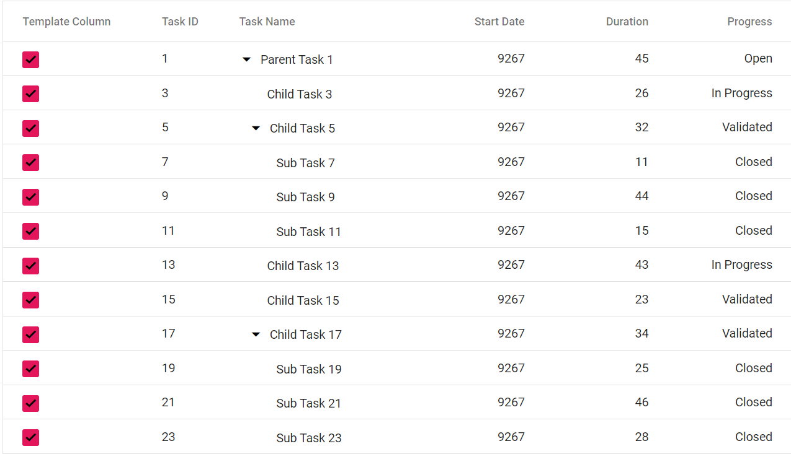

# Column Template in Blazor Tree Grid

N> Before adding column template to the tree grid, it is recommended to go through the [template](../templates/#templates) section topic to configure the template.

To know about **Column Template** in Blazor tree grid Component, you can check this video.



The Column template has options to display custom element value or content in the column. You can use the [Template](https://help.syncfusion.com/cr/blazor/Syncfusion.Blazor.TreeGrid.TreeGridColumn.html#Syncfusion_Blazor_TreeGrid_TreeGridColumn_Template) of the [TreeGridColumn](https://help.syncfusion.com/cr/blazor/Syncfusion.Blazor~Syncfusion.Blazor.TreeGrid.TreeGridColumn.html) component to specify the custom content. Inside the `Template`, you can access the data using the implicit named parameter **context**.

N> The column template feature is used to render the customized element value in the UI for a particular column. The data operations like filtering, sorting, etc., will not work based on the column template values. It will be handled based on the values you have provided to the particular column in the datasource.

```cshtml
@using Syncfusion.Blazor.TreeGrid
@inject Microsoft.AspNetCore.Components.NavigationManager UriHelper
<div class="col-lg-12 control-section">
    <div class="content-wrapper">
        <div class="row">
            <SfTreeGrid Height="400" DataSource="@TreeData" IdMapping="EmployeeID" ParentIdMapping="ParentId" TreeColumnIndex="0">
                <TreeGridColumns>
                    <TreeGridColumn Field="Name" HeaderText="Name" Width="160"></TreeGridColumn>
                    <TreeGridColumn HeaderText="Employee Image" Width="140">
                        <Template>
                            @{
                                var employee = (context as Employee);
                                <div class="image">
                                    
                                </div>
                            }
                        </Template>
                    </TreeGridColumn>
                    <TreeGridColumn Field="DOB" HeaderText="DOB" Width="90" TextAlign=" Syncfusion.Blazor.Grids.TextAlign.Right" Type=ColumnType.Date Format="d"></TreeGridColumn>
                    <TreeGridColumn Field="Designation" HeaderText="Designation" Width="170"></TreeGridColumn>
                    <TreeGridColumn Field="EmpID" HeaderText="Employee ID" Width="120"></TreeGridColumn>
                    <TreeGridColumn Field="Country" HeaderText="Priority" Width="100"></TreeGridColumn>
                </TreeGridColumns>
            </SfTreeGrid>
        </div>
    </div>
</div>

<style>
    .image img {
        height: 55px;
        width: 55px;
        border-radius: 50px;
        box-shadow: inset 0 0 1px #e0e0e0, inset 0 0 14px rgba(0, 0, 0, 0.2);
    }
</style>

@code{
    private IEnumerable<Employee> TreeData { get; set; }
    protected override void OnInitialized()
    {
        this.TreeData = Employee.GetTemplateData();
    }
    public class Employee
    {
        public string Name { get; set; }
        public string FullName { get; set; }
        public DateTime DOB { get; set; }
        public string Designation { get; set; }
        public string EmpID { get; set; }
        public int? EmployeeID { get; set; }
        public string Country { get; set; }
        public string Address { get; set; }
        public string Contact { get; set; }
        public int? ParentId { get; set; }
        public static List<Employee> GetTemplateData()
        {
            List<Employee> DataCollection = new List<Employee>();
            DataCollection.Add(new Employee
            {
                Name = "Robert King",
                FullName = "RobertKing",
                Designation = "Chief Executive Officer",
                EmployeeID = 1,
                EmpID = "EMP001",
                Address = "507 - 20th Ave. E.Apt. 2A, Seattle",
                Contact = "(206) 555-9857",
                Country = "USA",
                DOB = new DateTime(1992, 2, 15),
                ParentId = null
            });
            DataCollection.Add(new Employee
            {
                Name = "David William",
                FullName = "DavidWilliam",
                Designation = "Vice President",
                EmployeeID = 2,
                EmpID = "EMP004",
                Address = "722 Moss Bay Blvd., Kirkland",
                Contact = "(206) 555-3412",
                Country = "USA",
                DOB = new DateTime(1990, 5, 20),
                ParentId = 1
            });
            DataCollection.Add(new Employee
            {
                Name = "Nancy Davolio",
                FullName = "NancyDavolio",
                Designation = "Marketing Executive",
                EmployeeID = 3,
                EmpID = "EMP035",
                Address = "4110 Old Redmond Rd., Redmond",
                Contact = "(206) 555-8122",
                Country = "USA",
                DOB = new DateTime(1988, 3, 19),
                ParentId = 1
            });
            DataCollection.Add(new Employee
            {
                Name = "Andrew Fuller",
                FullName = "AndrewFuller",
                Designation = "Sales Representative",
                EmployeeID = 4,
                EmpID = "EMP045",
                Address = "14 Garrett Hill, London",
                Contact = "(71) 555-4848",
                Country = "UK",
                DOB = new DateTime(1993, 9, 20),
                ParentId = 1
            });
            DataCollection.Add(new Employee
            {
                Name = "Anne Dodsworth",
                FullName = "AnneDodsworth",
                Designation = "Sales Representative",
                EmployeeID = 5,
                EmpID = "EMP091",
                Address = "4726 - 11th Ave. N.E., Seattle",
                Contact = "(206) 555-1189",
                Country = "USA",
                ParentId = null
            });
            DataCollection.Add(new Employee
            {
                Name = "Michael Suyama",
                FullName = "MichaelSuyama",
                Designation = "Sales Representative",
                EmployeeID = 6,
                EmpID = "EMP110",
                Address = "Coventry House Miner Rd., London",
                Contact = "(71) 555-3636",
                Country = "UK",
                ParentId = 5
            });
            DataCollection.Add(new Employee
            {
                Name = "Janet Leverling",
                FullName = "JanetLeverling",
                Designation = "Sales Coordinator",
                EmployeeID = 7,
                EmpID = "EMP131",
                Address = "Edgeham Hollow Winchester Way, London",
                Contact = "(71) 555-3636",
                Country = "UK",
                ParentId = 5
            });
            DataCollection.Add(new Employee
            {
                Name = "Romey Wilson",
                FullName = "RomeyWilson",
                Designation = "Sales Executive",
                EmployeeID = 8,
                EmpID = "EMP039",
                Address = "7 Houndstooth Rd., London",
                Contact = "(71) 555-3690",
                Country = "UK",
                DOB = new DateTime(1994, 2, 2),
                ParentId = null
            });
            DataCollection.Add(new Employee
            {
                Name = "Margaret Peacock",
                FullName = "MargaretPeacock",
                Designation = "Sales Representative",
                EmployeeID = 9,
                EmpID = "EMP213",
                Address = "4726 - 11th Ave. N.E., California",
                Contact = "(206) 555-1989",
                Country = "USA",
                ParentId = 8
            });
            DataCollection.Add(new Employee
            {
                Name = "Steven Buchanan",
                FullName = "StevenBuchanan",
                Designation = "Sales Representative",
                EmployeeID = 11,
                EmpID = "EMP197",
                Address = "200 Lincoln Ave, Salinas, CA 93901",
                Contact = "(831) 758-7408",
                Country = "USA",
                ParentId = 8
            });
            DataCollection.Add(new Employee
            {
                Name = "Tedd Lawson",
                FullName = "TeddLawson",
                Designation = "Sales Representative",
                EmployeeID = 12,
                EmpID = "EMP167",
                Address = "200 Lincoln Ave, Salinas, CA 93901",
                Contact = "(831) 758-7368",
                Country = "USA",
                ParentId = 8
            });
            return DataCollection;
        }
    }
}
```

The following screenshot represents the column Template.


N> * Tree Grid actions such as editing, filtering and sorting etc. will depend upon the column [Field](https://help.syncfusion.com/cr/blazor/Syncfusion.Blazor~Syncfusion.Blazor.TreeGrid.TreeGridColumn~Field.html). If the `Field` is not specified in the
template column, the tree grid actions cannot be performed.
<br/> * For Templated tree grid component, [ModelType](../templates/#template-modeltype) property of tree grid should be defined.

## Using conditions inside template

Template elements can be rendered based on required conditions inside the [Template](https://help.syncfusion.com/cr/blazor/Syncfusion.Blazor.TreeGrid.TreeGridColumn.html#Syncfusion_Blazor_TreeGrid_TreeGridColumn_Template) of the [TreeGridColumn](https://help.syncfusion.com/cr/blazor/Syncfusion.Blazor~Syncfusion.Blazor.TreeGrid.TreeGridColumn.html) component.

In the following code, checkbox is rendered based on Discontinued field value in the datasource. This data can be accessed inside the [Template](https://help.syncfusion.com/cr/blazor/Syncfusion.Blazor.TreeGrid.TreeGridColumn.html#Syncfusion_Blazor_TreeGrid_TreeGridColumn_Template) using the implicit named parameter **context**.

```cshtml
@using Syncfusion.Blazor.TreeGrid;
@using Syncfusion.Blazor.Buttons;

<SfTreeGrid DataSource="@TreeGridData"  Id="TreeGrid" Width="850" AllowPaging="true" ParentIdMapping="ParentID" IdMapping="TaskID" TreeColumnIndex="2">
        <TreeGridColumns>
            <TreeGridColumn HeaderText="Template Column" Width="90">
                <Template>
                    @{
                        var tempColumn= (context as SelfReferenceData);
                        @if (tempColumn.Duration > 1)
                        {
                            <SfCheckBox Checked="true"></SfCheckBox>
                        }
                        else
                        {
                            <SfCheckBox Checked="false"></SfCheckBox>
                        }
                    }
                </Template>
            </TreeGridColumn>
            <TreeGridColumn Field="TaskID" HeaderText="Task ID" IsPrimaryKey="true" Width="50"></TreeGridColumn>
            <TreeGridColumn Field="TaskName" HeaderText="Task Name" Width="120"></TreeGridColumn>
            <TreeGridColumn Field="StartDate" HeaderText=" Start Date" Type="Syncfusion.Blazor.Grids.ColumnType.Date" Format="yMd" Width="90" TextAlign="Syncfusion.Blazor.Grids.TextAlign.Right"></TreeGridColumn>
            <TreeGridColumn Field="Duration" HeaderText="Duration" Width="80" TextAlign="Syncfusion.Blazor.Grids.TextAlign.Right"></TreeGridColumn>
            <TreeGridColumn Field="Progress" HeaderText="Progress" TextAlign="Syncfusion.Blazor.Grids.TextAlign.Right" Width="80"></TreeGridColumn>
        </TreeGridColumns>
</SfTreeGrid>

@code{
    public SelfReferenceData model = new SelfReferenceData();
    public List<SelfReferenceData> TreeGridData { get; set; }
    protected override void OnInitialized()
    {
        this.TreeGridData = SelfReferenceData.GetTree().ToList();
    }

    public class SelfReferenceData
{
    public static List<SelfReferenceData> tree = new List<SelfReferenceData>();
    public int TaskID { get; set; }
    public string TaskName { get; set; }
    public DateTime StartDate { get; set; }
    public String Progress { get; set; }
    public int Duration { get; set; }
    public int? ParentID { get; set; }
    public SelfReferenceData() { }

    public static List<SelfReferenceData> GetTree()
    {
        if (tree.Count == 0)
        {
            int root = -1;
            for (var t = 1; t <= 60; t++)
            {
                Random ran = new Random();
                string math = (ran.Next() % 3) == 0 ? "High" : (ran.Next() % 2) == 0 ? "Release Breaker" : "Critical";
                string progr = (ran.Next() % 3) == 0 ? "Started" : (ran.Next() % 2) == 0 ? "Open" : "In Progress";
                root++;
                int rootItem = tree.Count + root + 1;
                tree.Add(new SelfReferenceData() { TaskID = rootItem, TaskName = "Parent Task " + rootItem.ToString(), StartDate = new DateTime(1992, 06, 07), ParentID = null, Progress = progr, Duration = ran.Next(1, 50) });
                int parent = tree.Count;
                for (var c = 0; c < 10; c++)
                {
                    root++;
                    string val = ((parent + c + 1) % 3 == 0) ? "Low" : "Critical";
                    int parn = parent + c + 1;
                    progr = (ran.Next() % 3) == 0 ? "In Progress" : (ran.Next() % 2) == 0 ? "Open" : "Validated";
                    int iD = tree.Count + root + 1;
                    tree.Add(new SelfReferenceData() { TaskID = iD, TaskName = "Child Task " + iD.ToString(), StartDate = new DateTime(1992, 06, 07), ParentID = rootItem, Progress = progr, Duration = ran.Next(1, 50) });
                    if ((((parent + c + 1) % 3) == 0))
                    {
                        int immParent = tree.Count;
                        for (var s = 0; s < 3; s++)
                        {
                            root++;
                            string Prior = (immParent % 2 == 0) ? "Validated" : "Normal";
                            tree.Add(new SelfReferenceData() { TaskID = tree.Count + root + 1, TaskName = "Sub Task " + (tree.Count + root + 1).ToString(), StartDate = new DateTime(1992, 06, 07), ParentID = iD, Progress = (immParent % 2 == 0) ? "On Progress" : "Closed", Duration = ran.Next(1, 50) });
                        }
                    }
                }
            }
        }
        return tree;
    }
}
}
```

The following screenshot represents the Conditional Template.


N> For Templated Tree Grid component, [ModelType](../templates/#template-modeltype) property of Tree Grid should be defined.

## Using image inside template

You can use the [Template](https://help.syncfusion.com/cr/blazor/Syncfusion.Blazor.TreeGrid.TreeGridColumn.html#Syncfusion_Blazor_TreeGrid_TreeGridColumn_Template) of the [TreeGridColumn](https://help.syncfusion.com/cr/blazor/Syncfusion.Blazor~Syncfusion.Blazor.TreeGrid.TreeGridColumn.html) component to specify the custom image content. Inside the `Template`, you can access the data using the implicit named parameter **context** of Model type.

```cshtml
@using Syncfusion.Blazor.TreeGrid
@inject Microsoft.AspNetCore.Components.NavigationManager UriHelper
<div class="col-lg-12 control-section">
    <div class="content-wrapper">
        <div class="row">
            <SfTreeGrid Height="400" DataSource="@TreeData" IdMapping="EmployeeID" ParentIdMapping="ParentId" TreeColumnIndex="0">
                <TreeGridColumns>
                    <TreeGridColumn Field="Name" HeaderText="Name" Width="160"></TreeGridColumn>
                    <TreeGridColumn HeaderText="Employee Image" Width="140">
                        <Template>
                            @{
                                var employee = (context as Employee);
                                <div class="image">
                                    
                                </div>
                            }
                        </Template>
                    </TreeGridColumn>
                    <TreeGridColumn Field="DOB" HeaderText="DOB" Width="90" TextAlign=" Syncfusion.Blazor.Grids.TextAlign.Right" Type=ColumnType.Date Format="d"></TreeGridColumn>
                    <TreeGridColumn Field="Designation" HeaderText="Designation" Width="170"></TreeGridColumn>
                    <TreeGridColumn Field="EmpID" HeaderText="Employee ID" Width="120"></TreeGridColumn>
                    <TreeGridColumn Field="Country" HeaderText="Priority" Width="100"></TreeGridColumn>
                </TreeGridColumns>
            </SfTreeGrid>
        </div>
    </div>
</div>

<style>
    .image img {
        height: 55px;
        width: 55px;
        border-radius: 50px;
        box-shadow: inset 0 0 1px #e0e0e0, inset 0 0 14px rgba(0, 0, 0, 0.2);
    }
</style>

@code{
    private IEnumerable<Employee> TreeData { get; set; }
    protected override void OnInitialized()
    {
        this.TreeData = Employee.GetTemplateData();
    }
    public class Employee
    {
        public string Name { get; set; }
        public string FullName { get; set; }
        public DateTime DOB { get; set; }
        public string Designation { get; set; }
        public string EmpID { get; set; }
        public int? EmployeeID { get; set; }
        public string Country { get; set; }
        public string Address { get; set; }
        public string Contact { get; set; }
        public int? ParentId { get; set; }
        public static List<Employee> GetTemplateData()
        {
            List<Employee> DataCollection = new List<Employee>();
            DataCollection.Add(new Employee
            {
                Name = "Robert King",
                FullName = "RobertKing",
                Designation = "Chief Executive Officer",
                EmployeeID = 1,
                EmpID = "EMP001",
                Address = "507 - 20th Ave. E.Apt. 2A, Seattle",
                Contact = "(206) 555-9857",
                Country = "USA",
                DOB = new DateTime(1992, 2, 15),
                ParentId = null
            });
            DataCollection.Add(new Employee
            {
                Name = "David William",
                FullName = "DavidWilliam",
                Designation = "Vice President",
                EmployeeID = 2,
                EmpID = "EMP004",
                Address = "722 Moss Bay Blvd., Kirkland",
                Contact = "(206) 555-3412",
                Country = "USA",
                DOB = new DateTime(1990, 5, 20),
                ParentId = 1
            });
            DataCollection.Add(new Employee
            {
                Name = "Nancy Davolio",
                FullName = "NancyDavolio",
                Designation = "Marketing Executive",
                EmployeeID = 3,
                EmpID = "EMP035",
                Address = "4110 Old Redmond Rd., Redmond",
                Contact = "(206) 555-8122",
                Country = "USA",
                DOB = new DateTime(1988, 3, 19),
                ParentId = 1
            });
            DataCollection.Add(new Employee
            {
                Name = "Andrew Fuller",
                FullName = "AndrewFuller",
                Designation = "Sales Representative",
                EmployeeID = 4,
                EmpID = "EMP045",
                Address = "14 Garrett Hill, London",
                Contact = "(71) 555-4848",
                Country = "UK",
                DOB = new DateTime(1993, 9, 20),
                ParentId = 1
            });
            DataCollection.Add(new Employee
            {
                Name = "Anne Dodsworth",
                FullName = "AnneDodsworth",
                Designation = "Sales Representative",
                EmployeeID = 5,
                EmpID = "EMP091",
                Address = "4726 - 11th Ave. N.E., Seattle",
                Contact = "(206) 555-1189",
                Country = "USA",
                ParentId = null
            });
            DataCollection.Add(new Employee
            {
                Name = "Michael Suyama",
                FullName = "MichaelSuyama",
                Designation = "Sales Representative",
                EmployeeID = 6,
                EmpID = "EMP110",
                Address = "Coventry House Miner Rd., London",
                Contact = "(71) 555-3636",
                Country = "UK",
                ParentId = 5
            });
            DataCollection.Add(new Employee
            {
                Name = "Janet Leverling",
                FullName = "JanetLeverling",
                Designation = "Sales Coordinator",
                EmployeeID = 7,
                EmpID = "EMP131",
                Address = "Edgeham Hollow Winchester Way, London",
                Contact = "(71) 555-3636",
                Country = "UK",
                ParentId = 5
            });
            DataCollection.Add(new Employee
            {
                Name = "Romey Wilson",
                FullName = "RomeyWilson",
                Designation = "Sales Executive",
                EmployeeID = 8,
                EmpID = "EMP039",
                Address = "7 Houndstooth Rd., London",
                Contact = "(71) 555-3690",
                Country = "UK",
                DOB = new DateTime(1994, 2, 2),
                ParentId = null
            });
            DataCollection.Add(new Employee
            {
                Name = "Margaret Peacock",
                FullName = "MargaretPeacock",
                Designation = "Sales Representative",
                EmployeeID = 9,
                EmpID = "EMP213",
                Address = "4726 - 11th Ave. N.E., California",
                Contact = "(206) 555-1989",
                Country = "USA",
                ParentId = 8
            });
            DataCollection.Add(new Employee
            {
                Name = "Steven Buchanan",
                FullName = "StevenBuchanan",
                Designation = "Sales Representative",
                EmployeeID = 11,
                EmpID = "EMP197",
                Address = "200 Lincoln Ave, Salinas, CA 93901",
                Contact = "(831) 758-7408",
                Country = "USA",
                ParentId = 8
            });
            DataCollection.Add(new Employee
            {
                Name = "Tedd Lawson",
                FullName = "TeddLawson",
                Designation = "Sales Representative",
                EmployeeID = 12,
                EmpID = "EMP167",
                Address = "200 Lincoln Ave, Salinas, CA 93901",
                Contact = "(831) 758-7368",
                Country = "USA",
                ParentId = 8
            });
            return DataCollection;
        }
    }
}
```

The following screenshot represents the Image Template.


## Using hyperlink column

You can use the [Template](https://help.syncfusion.com/cr/blazor/Syncfusion.Blazor.TreeGrid.TreeGridColumn.html#Syncfusion_Blazor_TreeGrid_TreeGridColumn_Template) property of the [TreeGridColumn](https://help.syncfusion.com/cr/blazor/Syncfusion.Blazor~Syncfusion.Blazor.TreeGrid.TreeGridColumn.html) to render the hyperlinks and for routing, [UriHelper](https://docs.microsoft.com/en-us/aspnet/core/blazor/routing?view=aspnetcore-3.0#uri-and-navigation-state-helpers) can be utilized.

This can be achieved by initially defining an anchor tag inside the column template and binding click event to it. By using the named parameter **context** of Model type, we can pass the row data to click event handler.

```cshtml
@inject NavigationManager UriHelper
@using Syncfusion.Blazor.TreeGrid

<SfTreeGrid  DataSource="@Employees" IdMapping="EmployeeID" ParentIdMapping="ParentId" TreeColumnIndex="1">
    <TreeGridColumns>
        <TreeGridColumn Field=@nameof(EmployeeData.EmployeeID) TextAlign="TextAlign.Center" HeaderText="Employee ID" Width="120"></TreeGridColumn>
        <TreeGridColumn Field=@nameof(EmployeeData.Name) HeaderText="First Name" Width="130"></TreeGridColumn>
        <TreeGridColumn Field=@nameof(EmployeeData.Title) HeaderText="Title" Width="120"></TreeGridColumn>
        <TreeGridColumn HeaderText="User profile" TextAlign="TextAlign.Center" Width="120">
            <Template>
                @{
                    var Employee = (context as EmployeeData);
                    <div><a href="#" @onclick="@(() => Navigate(Employee))">View</a></div>
                }
            </Template>
        </TreeGridColumn>
    </TreeGridColumns>
</SfTreeGrid>

<style>
    .image img {
        height: 55px;
        width: 55px;
        border-radius: 50px;
        box-shadow: inset 0 0 1px #e0e0e0, inset 0 0 14px rgba(0, 0, 0, 0.2);
    }
</style>

@code{

    List<EmployeeData> Employees = new List<EmployeeData>
    {
        new EmployeeData() { EmployeeID = 1, Name = "Nancy Fuller", Link = "nancy_fuller", Title = "Vice President", ParentId = null },
        new EmployeeData() { EmployeeID = 2, Name = "Steven Buchanan", Link = "steven_buchanan", Title = "Sales Manager", ParentId = 1 },
        new EmployeeData() { EmployeeID = 3, Name = "Janet Leverling", Link = "janet_leverling", Title = "Sales Representative", ParentId = null },
        new EmployeeData() { EmployeeID = 4, Name = "Andrew Davolio", Link = "andrew_davolio", Title = "Inside Sales Coordinator", ParentId = 3 },
        new EmployeeData() { EmployeeID = 5, Name = "Margaret Peacock", Link = "margaret_peacock", Title = "Inside Sales Coordinator", ParentId = 3 },
        new EmployeeData() { EmployeeID = 6, Name = "Steven Buchanan", Link = "steven_buchanan", Title = "Inside Sales Coordinator", ParentId = 3 }
    };

    public class EmployeeData
    {
        public int EmployeeID { get; set; }
        public string Name { get; set; }
        public string Title { get; set; }
        public string Link { get; set; }
        public int? ParentId { get; set; }
    }
    private void Navigate(EmployeeData Employee)
    {
        UriHelper.NavigateTo($"{ Employee.Link}/{Employee.EmployeeID.ToString()}/{Employee.Name}/{ Employee.Title}");
    }
}
```

In the above code, the url to be navigated is specified in the Link variable of the tree grid data. Based on this, the page is routed to the corresponding url.

```cshtml
@page "/nancy_fuller/{EmpID}/{Name}/{Title}"

<div class="center">
<h2>Hello @Name!</h2>
<br>
<h4><u>Employee Details</u></h4>
<br>
<div><b>Employee ID:</b><div class="details">@EmpID</div></div>
<div><b>Position:</b><div class="details">@Title</div></div>
<div>

<style>
    .center {
  text-align: center;
}
</style>

@code {
    [Parameter]
    public string EmpID { get; set; }
    [Parameter]
    public string Name { get; set; }
    [Parameter]
    public string Title { get; set; }
}
```

The following GIF represents template routing in tree grid

