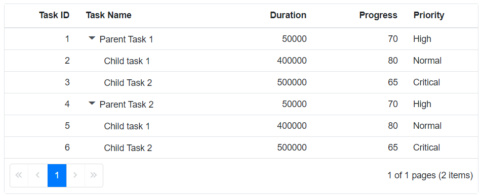
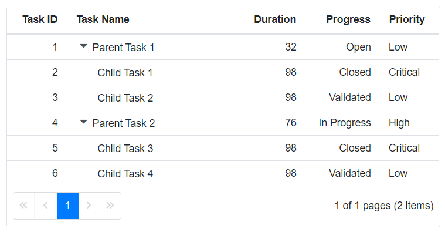
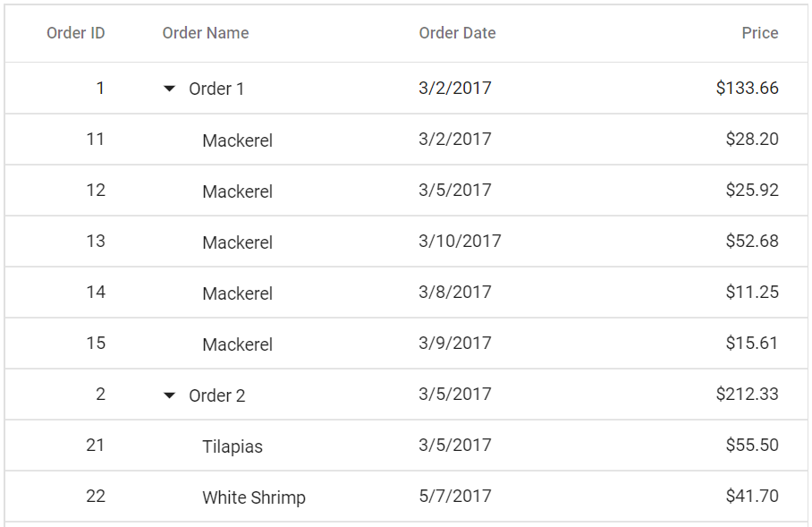
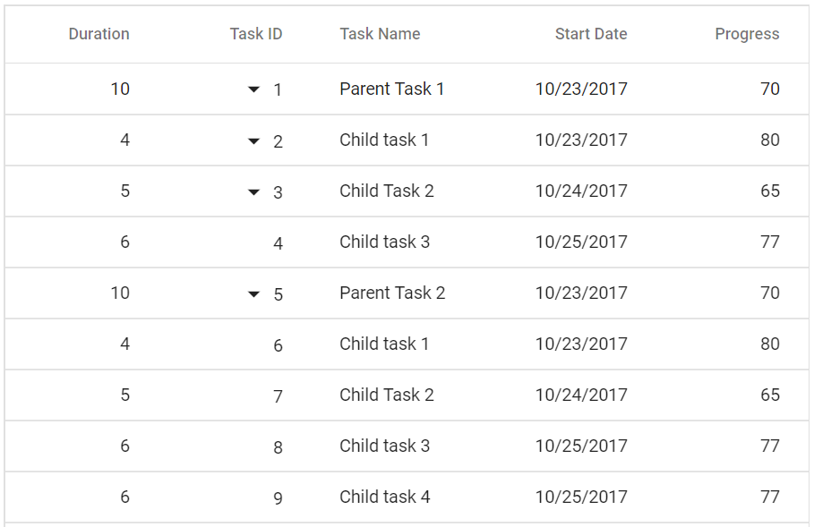
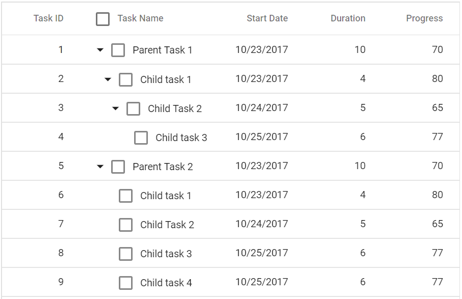

# Columns in Blazor Tree Grid Component

The column definitions are used as the datasource schema in the Tree Grid. This plays a vital role in rendering column values in the required format. The tree grid operations such as sorting, filtering and searching etc. are performed based on the column definitions. The [Field](https://help.syncfusion.com/cr/blazor/Syncfusion.Blazor.TreeGrid.TreeGridColumn.html#Syncfusion_Blazor_TreeGrid_TreeGridColumn_Field) property of [TreeGridColumns](https://help.syncfusion.com/cr/blazor/Syncfusion.Blazor.TreeGrid.TreeGridColumn.html) tag helper is necessary to map the data source values in Tree Grid columns.

N> If the column `Field` is not specified in the dataSource, the column values will be empty. <br />[TreeColumnIndex](https://help.syncfusion.com/cr/blazor/Syncfusion.Blazor.TreeGrid.SfTreeGrid-1.html#Syncfusion_Blazor_TreeGrid_SfTreeGrid_1_TreeColumnIndex) property denotes the column that is used to expand and collapse child rows.

## Complex data binding

The complex data binding in the Tree Grid can be achieved by using the dot(.) operator in the column.field. In the below examples **Task.TaskName** and **Task.Duration** are complex data.

```cshtml
@using Syncfusion.Blazor.TreeGrid

<SfTreeGrid DataSource="@TreeData" AllowPaging="true" IdMapping="TaskId" ParentIdMapping="ParentId" TreeColumnIndex="1">
    <TreeGridColumns>
        <TreeGridColumn Field="TaskId" HeaderText="Task ID" Width="80" 
        TextAlign="Syncfusion.Blazor.Grids.TextAlign.Right"></TreeGridColumn>
        <TreeGridColumn Field="Task.TaskName" HeaderText="Task Name" Width="160">
        </TreeGridColumn>
        <TreeGridColumn Field="Task.Duration" HeaderText="Duration" Width="100" 
        TextAlign="Syncfusion.Blazor.Grids.TextAlign.Right"></TreeGridColumn>
        <TreeGridColumn Field="Progress" HeaderText="Progress" Width="100"
        TextAlign="Syncfusion.Blazor.Grids.TextAlign.Right"></TreeGridColumn>
        <TreeGridColumn Field="Priority" HeaderText="Priority" Width="80">
        </TreeGridColumn>
    </TreeGridColumns>
</SfTreeGrid>

@code{
    public class BusinessObject
    {
        public int TaskId { get; set; }
        public TaskDetails Task { get; set; }
        public int Progress { get; set; }
        public string Priority { get; set; }
        public int? ParentId { get; set; }
    }

    public class TaskDetails
    {
        public string TaskName { get; set; }
        public int Duration { get; set; }
    }
    public List<BusinessObject> TreeData = new List<BusinessObject>();
    protected override void OnInitialized()
    {
        TreeData.Add(new BusinessObject() { Task = new TaskDetails() { TaskName = "Parent Task 1", Duration = 50000 }, TaskId = 1, Progress = 70, ParentId = null, Priority = "High" });
        TreeData.Add(new BusinessObject() { Task = new TaskDetails() { TaskName = "Child task 1", Duration = 400000 }, TaskId = 2, Progress = 80, ParentId = 1, Priority = "Normal" });
        TreeData.Add(new BusinessObject() { Task = new TaskDetails() { TaskName = "Child Task 2", Duration = 500000 }, TaskId = 3, Progress = 65, ParentId = 1, Priority = "Critical" });
        TreeData.Add(new BusinessObject() { Task = new TaskDetails() { TaskName = "Parent Task 2", Duration = 50000 }, TaskId = 4, Progress = 70, ParentId = null, Priority = "High" });
        TreeData.Add(new BusinessObject() { Task = new TaskDetails() { TaskName = "Child task 1", Duration = 400000 }, TaskId = 5, Progress = 80, ParentId = 4, Priority = "Normal" });
        TreeData.Add(new BusinessObject() { Task = new TaskDetails() { TaskName = "Child Task 2", Duration = 500000 }, TaskId = 6, Progress = 65, ParentId = 4, Priority = "Critical" });

    }
}
```



### Expando data binding

Tree Grid supports Complex Data Binding with ExpandoObject. In the below examples **Task.TaskName** and **Task.Duration** are complex data with ExpandoObject.

```cshtml
@using Syncfusion.Blazor.TreeGrid;
@using System.Dynamic;

<SfTreeGrid DataSource="@TreeData" AllowPaging="true" IdMapping="TaskID" ParentIdMapping="ParentID" TreeColumnIndex="1">
    <TreeGridColumns>
        <TreeGridColumn Field="TaskID" HeaderText="Task ID" Width="80" TextAlign="Syncfusion.Blazor.Grids.TextAlign.Right"></TreeGridColumn>
        <TreeGridColumn Field="Task.TaskName" HeaderText="Task Name" Width="160"></TreeGridColumn>
        <TreeGridColumn Field="Task.Duration" HeaderText="Duration" Width="160" TextAlign="Syncfusion.Blazor.Grids.TextAlign.Right"></TreeGridColumn>
        <TreeGridColumn Field="Progress" HeaderText="Progress" Width="100" TextAlign="Syncfusion.Blazor.Grids.TextAlign.Right"></TreeGridColumn>
        <TreeGridColumn Field="Priority" HeaderText="Priority" Width="80"></TreeGridColumn>
    </TreeGridColumns>
</SfTreeGrid>
@code {
    public List<ExpandoObject> TreeData { get; set; }
    protected override void OnInitialized()
    {
        this.TreeData = GetData().ToList();
    }
    public static List<ExpandoObject> Data = new List<ExpandoObject>();
    public static int ParentRecordID { get; set; }
    public static int ChildRecordID { get; set; }
    public static List<ExpandoObject> GetData()
    {
        Data.Clear();
        ParentRecordID = 0;
        ChildRecordID = 0;
        for (var i = 1; i <= 2; i++)
        {

            dynamic ParentRecord = new ExpandoObject();
            dynamic Task = new ExpandoObject();
            Task.TaskName = "Parent Task " + i;
            Task.Duration = ParentRecordID % 2 == 0 ? 32 : 76;
            ParentRecord.TaskID = ++ParentRecordID;
            ParentRecord.Task = Task;
            ParentRecord.Progress = ParentRecordID % 2 == 0 ? "In Progress" : "Open";
            ParentRecord.Priority = ParentRecordID % 2 == 0 ? "High" : "Low";
            ParentRecord.ParentID = null;
            Data.Add(ParentRecord);
            AddChildRecords(ParentRecordID);
        }
        return Data;
    }
    public static void AddChildRecords(int ParentId)
    {
        for (var i = 1; i < 3; i++)
        {

            dynamic ChildRecord = new ExpandoObject();
            dynamic Task = new ExpandoObject();
            Task.TaskName = "Child Task " + ++ChildRecordID;
            Task.Duration = ParentRecordID % 3 == 0 ? 64 : 98;
            ChildRecord.TaskID = ++ParentRecordID;
            ChildRecord.Task = Task;
            ChildRecord.Progress = ParentRecordID % 3 == 0 ? "Validated" : "Closed";
            ChildRecord.Priority = ParentRecordID % 3 == 0 ? "Low" : "Critical";
            ChildRecord.ParentID = ParentId;
            Data.Add(ChildRecord);
        }
    }
}
```



## Header template

To know about **Header Template** in Blazor tree grid Component, you can check this video.



The header element can be customized by using the [HeaderTemplate](https://help.syncfusion.com/cr/blazor/Syncfusion.Blazor.TreeGrid.TreeGridColumn.html#Syncfusion_Blazor_TreeGrid_TreeGridColumn_HeaderTemplate) property.





@using TreeGridComponent.Data;
@using Syncfusion.Blazor.TreeGrid;

<SfTreeGrid  Height="400" DataSource="@TreeGridData" IdMapping="EmployeeID" ParentIdMapping="ParentId" TreeColumnIndex="0">
    <TreeGridColumns>
        <TreeGridColumn Field="Name" HeaderText="Name" Width="160">
            <HeaderTemplate>
                    <div>
                        <span class="e-icon-userlogin e-icons employee"></span> Name
                    </div>
            </HeaderTemplate>
        </TreeGridColumn>
        <TreeGridColumn Field="Designation" HeaderText="Designation" Width="120"></TreeGridColumn>
        <TreeGridColumn Field="EmpID" HeaderText="Progress" Width="80" TextAlign="Syncfusion.Blazor.Grids.TextAlign.Right"></TreeGridColumn>
        <TreeGridColumn Field="Country" HeaderText="Priority" Width="100"></TreeGridColumn>
        </TreeGridColumns>
</SfTreeGrid>

<style>

    @@font-face {
        font-family: 'ej2-headertemplate';
        src: url(data:application/x-font-ttf;charset=utf-8;base64,AAEAAAAKAIAAAwAgT1MvMj1vTFIAAAEoAAAAVmNtYXDS2c5qAAABjAAAAEBnbHlmQmNFrQAAAdQAAANoaGVhZBRdbkIAAADQAAAANmhoZWEIUQQEAAAArAAAACRobXR4DAAAAAAAAYAAAAAMbG9jYQCOAbQAAAHMAAAACG1heHABHgENAAABCAAAACBuYW1lohGZJQAABTwAAAKpcG9zdA2o3w0AAAfoAAAAQAABAAAEAAAAAFwEAAAAAAAD9AABAAAAAAAAAAAAAAAAAAAAAwABAAAAAQAATBXy9l8PPPUACwQAAAAAANillKkAAAAA2KWUqQAAAAAD9APzAAAACAACAAAAAAAAAAEAAAADAQEAEQAAAAAAAgAAAAoACgAAAP8AAAAAAAAAAQQAAZAABQAAAokCzAAAAI8CiQLMAAAB6wAyAQgAAAIABQMAAAAAAAAAAAAAAAAAAAAAAAAAAAAAUGZFZABA5wLpYAQAAAAAXAQAAAAAAAABAAAAAAAABAAAAAQAAAAEAAAAAAAAAgAAAAMAAAAUAAMAAQAAABQABAAsAAAABgAEAAEAAucC6WD//wAA5wLpYP//AAAAAAABAAYABgAAAAIAAQAAAAAAjgG0ABEAAAAAA8kD8wADAAcACwAPABMAFwAbAB8AIwAnACsALwAzADcAOwBPAGsAACUVIzUjFSM1IxUjNSMVIzUjFSM1JRUjNSMVIzUjFSM1IxUjNSMVIzUlFSM1IxUjNSMVIzUjFSM1IxUjNQMVHwYhPwcRITcjDwghNS8HIzUjFSE1IwN2U1NTU1RTU1NTAuxTU1NTVFNTU1MC7FNTU1NUU1NTU1QCAwUGBggIA0QICAcHBQQBAvxsp30ICAcHAgUDAQEDlAECBAUHBwgIfVP+YFOzU1NTU1NTU1NTU6dUVFRUVFRUVFRUplNTU1NTU1NTU1P+NgQIBwcGBAMCAQIEBQcHAwgCdPoBAgQFAwcHCIF8CQgHBgUEAgFTU1MABAAAAAAD9APeADQAbQCuAQAAAAEfCDc1Lwc1PwIPBy8HHww3HwQPATMVPwc1Lx0jDwMfAgUdAR8GBTUzLxQjDx0BFxUfEDsBPxA1Nyc1LxIPEhUCCg8OGxcVExANCgMBAQMDCQQDAgECAxESEhMTExUUFRQTFBISEhEHCwYHCAkKCw0NDw8SuQQGAwIBAgRxlgsKCQcGBAMBAgMDAwUFBQcGBwgICQkKCgsKDAsMDQwNDQ4NDg45BQUDAQEEA/1eAgUGBwkKCwHjeggKDhEUFxs1FRMSEA4NCwoJBwcJBjwODg0ODQ0MDQwLDAoLCgoJCQgIBwYHBQUFAwMDAgEBAQECAgYICg0ODxISFBUXFwwMDA0MDQwMFxcVFBISDw4MCwgGAgIBAQICAwcJCw0PERITFRUXDAwMDA0NDAwMDAsXFRQTEQ8ODQoIBgICAVQEAwgJCgsMCwwbEBAREREZEA8VDAwKCgoIBwYFAwIBAQIDBQYHCAoUFQwLCwsLCgoJCAcGMwsWFhUVHB3QAQIEBggICgueDg4ODg0NDA0MCwsLCwoKCQgJBwgGBwUFBAQDAwECCw8NDxETCrIlawsKCAgGBAIB0AoLCwoLCQgNCAkLDA0NDg4ODg4ZFAIBAwMEBAUGBgYIBwkICQoKCwsLDAwMDA0ODQ4ODgH7DQwMDBgWFRQTERAODAoIBgICAQECAgYICgwOEBETFBUWGAwMDA0MDQwMCxcWFRMSEA8NDAkHAwIBAQEBAQECAwMICwwOEBETFBUWFwwMDQAAAAASAN4AAQAAAAAAAAABAAAAAQAAAAAAAQASAAEAAQAAAAAAAgAHABMAAQAAAAAAAwASABoAAQAAAAAABAASACwAAQAAAAAABQALAD4AAQAAAAAABgASAEkAAQAAAAAACgAsAFsAAQAAAAAACwASAIcAAwABBAkAAAACAJkAAwABBAkAAQAkAJsAAwABBAkAAgAOAL8AAwABBAkAAwAkAM0AAwABBAkABAAkAPEAAwABBAkABQAWARUAAwABBAkABgAkASsAAwABBAkACgBYAU8AAwABBAkACwAkAacgZWoyLWhlYWRlcnRlbXBsYXRlUmVndWxhcmVqMi1oZWFkZXJ0ZW1wbGF0ZWVqMi1oZWFkZXJ0ZW1wbGF0ZVZlcnNpb24gMS4wZWoyLWhlYWRlcnRlbXBsYXRlRm9udCBnZW5lcmF0ZWQgdXNpbmcgU3luY2Z1c2lvbiBNZXRybyBTdHVkaW93d3cuc3luY2Z1c2lvbi5jb20AIABlAGoAMgAtAGgAZQBhAGQAZQByAHQAZQBtAHAAbABhAHQAZQBSAGUAZwB1AGwAYQByAGUAagAyAC0AaABlAGEAZABlAHIAdABlAG0AcABsAGEAdABlAGUAagAyAC0AaABlAGEAZABlAHIAdABlAG0AcABsAGEAdABlAFYAZQByAHMAaQBvAG4AIAAxAC4AMABlAGoAMgAtAGgAZQBhAGQAZQByAHQAZQBtAHAAbABhAHQAZQBGAG8AbgB0ACAAZwBlAG4AZQByAGEAdABlAGQAIAB1AHMAaQBuAGcAIABTAHkAbgBjAGYAdQBzAGkAbwBuACAATQBlAHQAcgBvACAAUwB0AHUAZABpAG8AdwB3AHcALgBzAHkAbgBjAGYAdQBzAGkAbwBuAC4AYwBvAG0AAAAAAgAAAAAAAAAKAAAAAAAAAAAAAAAAAAAAAAAAAAAAAAADAQIBAwEEAAtCVF9DYWxlbmRhcghlbXBsb3llZQAA) format('truetype');
        font-weight: normal;
        font-style: normal;
    }

    .e-grid .e-icon-userlogin::before {
        font-family: 'ej2-headertemplate';
        width: 15px !important;
        content: '\e702';
    }

    .e-grid .e-icon-calender::before {
        font-family: 'ej2-headertemplate';
        width: 15px !important;
        content: '\e960';
    }
</style>


@code{
    public Employee model = new Employee();
    public IEnumerable<Employee> TreeGridData { get; set; }
    protected override void OnInitialized()
    {
        this.TreeGridData = Employee.GetTemplateData();
    }
}





namespace TreeGridComponent.Data {

public class Employee
    {
        public string Name { get; set; }
        public string Designation { get; set; }
        public string EmpID { get; set; }
        public string Contact { get; set; }
        public int? ParentId { get; set; }
        public TreeData Treedata { get; set; }

        public static List<Employee> GetTemplateData()
        {
            List<Employee> DataCollection = new List<Employee>();
            DataCollection.Add(new Employee { Name = "Robert King",Designation = "Chief Executive Officer",EmpID = "EMP001",Country = "USA",ParentId = null,Treedata = new TreeData() { ID = 21}});
            DataCollection.Add(new Employee { Name = "David william",Designation = "Vice President",EmpID = "EMP004",Country = "USA",ParentId = 1,Treedata = new TreeData() { ID = 21 }});
            DataCollection.Add(new Employee { Name = "Nancy Davolio",Designation = "Marketing Executive",EmpID = "EMP035",Country = "USA",ParentId = 1,Treedata = new TreeData() { ID = 21 }});
            DataCollection.Add(new Employee { Name = "Andrew Fuller",Designation = "Sales Representative",EmpID = "EMP045",Country = "UK",ParentId = 1,Treedata = new TreeData() { ID = 21 }});
            DataCollection.Add(new Employee { Name = "Anne Dodsworth",FullName = "AnneDodsworth",Designation = "Sales Representative",EmployeeID = 5,EmpID = "EMP091",Country = "USA",ParentId = null,Treedata = new TreeData() { ID = 21 }});
            DataCollection.Add(new Employee { Name = "Michael Suyama",FullName = "MichaelSuyama",Designation = "Sales Representative",EmployeeID = 6,EmpID = "EMP110",Country = "UK",ParentId = 5,Treedata = new TreeData() { ID = 21 }});
            return DataCollection;
        }
    }
}






N> For Templated Tree Grid component, [ModelType](../templates/#template-modeltype) property of Tree Grid should be defined.

## Header text

By default, column header title is displayed from column [Field](https://help.syncfusion.com/cr/blazor/Syncfusion.Blazor.TreeGrid.TreeGridColumn.html#Syncfusion_Blazor_TreeGrid_TreeGridColumn_Field) value. To override the default header title, define the [HeaderText](https://help.syncfusion.com/cr/blazor/Syncfusion.Blazor.TreeGrid.TreeGridColumn.html#Syncfusion_Blazor_TreeGrid_TreeGridColumn_HeaderText) value.





@using TreeGridComponent.Data;
@using Syncfusion.Blazor.TreeGrid;

<SfTreeGrid DataSource="@TreeGridData" IdMapping="TaskId" ParentIdMapping="ParentId" TreeColumnIndex="1">
    <TreeGridColumns>
        <TreeGridColumn Field="TaskId" HeaderText="Task ID" Width="80" TextAlign="Syncfusion.Blazor.Grids.TextAlign.Right"></TreeGridColumn>
        <TreeGridColumn Field="TaskName" HeaderText="Task Name" Width="160"></TreeGridColumn>
        <TreeGridColumn Field="Duration" HeaderText="Duration" Width="100" TextAlign="Syncfusion.Blazor.Grids.TextAlign.Right"></TreeGridColumn>
        <TreeGridColumn Field="Progress" HeaderText="Progress" Width="100" TextAlign="Syncfusion.Blazor.Grids.TextAlign.Right"></TreeGridColumn>
        <TreeGridColumn Field="Priority" HeaderText="Priority" Width="80"></TreeGridColumn>
    </TreeGridColumns>
</SfTreeGrid>

@code{

    public List<TreeData.BusinessObject> TreeGridData { get; set; }
    protected override void OnInitialized()
    {
        this.TreeGridData = TreeData.GetSelfDataSource().ToList();
    }
}





namespace TreeGridComponent.Data {

public class TreeData
    {
        public class BusinessObject
        {
            public int TaskId { get; set;}
            public string TaskName { get; set;}
            public int? Duration { get; set;}
            public int? Progress { get; set;}
            public string Priority { get; set;}
            public int? ParentId { get; set;}
        }

        public static List<BusinessObject> GetSelfDataSource()
        {
            List<BusinessObject> BusinessObjectCollection = new List<BusinessObject>();
            BusinessObjectCollection.Add(new BusinessObject() { TaskId = 1,TaskName = "Parent Task 1",Duration = 10,Progress = 70,Priority = "Critical",ParentId = null });
            BusinessObjectCollection.Add(new BusinessObject() { TaskId = 2,TaskName = "Child task 1",Duration = 6,Progress = 80,Priority = "Low",ParentId = 1 });
            BusinessObjectCollection.Add(new BusinessObject() { TaskId = 3,TaskName = "Child Task 2",Duration = 5,Progress = 65,Priority = "Critical",ParentId = 2 });
            BusinessObjectCollection.Add(new BusinessObject() { TaskId = 4,TaskName = "Child task 3",Duration = 6,Priority = "High",Progress = 77,ParentId = 3 });
            BusinessObjectCollection.Add(new BusinessObject() { TaskId = 5,TaskName = "Parent Task 2",Duration = 10,Progress = 70,Priority = "Critical",ParentId = null});
            BusinessObjectCollection.Add(new BusinessObject() { TaskId = 6,TaskName = "Child task 1",Duration = 4,Progress = 80,Priority = "Critical",ParentId = 5});
            BusinessObjectCollection.Add(new BusinessObject() { TaskId = 7,TaskName = "Child Task 2",Duration = 5,Progress = 65,Priority = "Low",ParentId = 5});
            BusinessObjectCollection.Add(new BusinessObject() { TaskId = 8,TaskName = "Child task 3",Duration = 6,Progress = 77,Priority = "High",ParentId = 5});
            BusinessObjectCollection.Add(new BusinessObject() { TaskId = 9,TaskName = "Child task 4",Duration = 6,Progress = 77,Priority = "Low",ParentId = 5});
            return BusinessObjectCollection;
        }
    }
}






N> If both the `Field` and `HeaderText` are not defined in the column, the column renders with **empty** header text.

## Format

To format cell values based on specific culture, use the [Format](https://help.syncfusion.com/cr/blazor/Syncfusion.Blazor.TreeGrid.TreeGridColumn.html#Syncfusion_Blazor_TreeGrid_TreeGridColumn_Format) property of the[TreeGridColumns](https://help.syncfusion.com/cr/blazor/Syncfusion.Blazor.TreeGrid.TreeGridColumn.html) tag helper. The Tree Grid uses **Internalization** library to format the number values.





@using TreeGridComponent.Data;
@using Syncfusion.Blazor.TreeGrid;

<SfTreeGrid DataSource="@TreeGridData" IdMapping="OrderID" ParentIdMapping="ParentId" TreeColumnIndex="1" >
    <TreeGridColumns>
        <TreeGridColumn Field="OrderID" HeaderText="Order ID" Width="80" TextAlign="Syncfusion.Blazor.Grids.TextAlign.Right"></TreeGridColumn>
        <TreeGridColumn Field="OrderName" HeaderText="Order Name" Width="160"></TreeGridColumn>
        <TreeGridColumn Field="Price" HeaderText="Price" Width="100" Format="C2" Type="Syncfusion.Blazor.Grids.ColumnType.Number" TextAlign="Syncfusion.Blazor.Grids.TextAlign.Right"></TreeGridColumn>
    </TreeGridColumns>
</SfTreeGrid>

@code{

    public List<TreeDataFormat> TreeGridData { get; set; }
    protected override void OnInitialized()
    {
        this.TreeGridData = TreeDataFormat.GetDataFormat().ToList();
    }
}





namespace TreeGridComponent.Data {

public class TreeDataFormat
{
    public TreeDataFormat() { }
    public int OrderID { get; set; }
    public string OrderName { get; set; }
    public double Price { get; set; }
    public int? ParentId { get; set; }
    
    public static List<TreeDataFormat> GetDataFormat()
    {
        List<TreeDataFormat> data = new List<TreeDataFormat>()
            {
                new TreeDataFormat() { OrderID= 1,OrderName= "Order 1",ParentId = null,Price=133.66 },
                new TreeDataFormat() { OrderID= 11, ParentId = 1, OrderName= "Mackerel", Price= 28.20},
                new TreeDataFormat() { OrderID= 12, ParentId = 1, OrderName= "Mackerel", Price= 25.92},
                new TreeDataFormat() { OrderID= 13, ParentId = 1, OrderName= "Mackerel", Price= 52.68},
                new TreeDataFormat() { OrderID= 14, ParentId = 1, OrderName= "Mackerel", Price= 11.25},
                new TreeDataFormat() { OrderID= 15, ParentId = 1, OrderName= "Mackerel", Price= 15.61},
                new TreeDataFormat() { OrderID= 2,OrderName= "Order 2",ParentId = null,Price=212.33},
                new TreeDataFormat() { OrderID= 21, ParentId = 2, OrderName= "Tilapias",Price= 55.50},
                new TreeDataFormat() { OrderID= 22, ParentId = 2, OrderName= "White Shrimp", Price= 41.70},
                new TreeDataFormat() { OrderID= 23, ParentId = 2, OrderName= "Fresh Cheese",Price= 39.20},
                new TreeDataFormat() { OrderID= 24, ParentId = 2, OrderName= "Blue Veined Cheese",Price= 38.76},
                new TreeDataFormat() { OrderID= 25, ParentId = 2, OrderName= "Butter", Price= 37.17}};
        return data;
    }
}
}





N> By default, the number and date values are formatted in **en-US** locale.

### Number formatting

The number or integer values can be formatted using the below format strings.

Format |Description |Remarks
-----|-----|-----
N | Denotes numeric type. | The numeric format is followed by integer value as N2, N3. etc which denotes the number of precision to be allowed.
C | Denotes currency type. | The currency format is followed by integer value as C2, C3. etc which denotes the number of precision to be allowed.
P | Denotes percentage type | The percentage format expects the input value to be in the range of 0 to 100. For example the cell value *0.2* is formatted as *20%*. The percentage format is followed by integer value as P2, P3. etc which denotes the number of precision to be allowed.

<!-- Please refer to the link to know more about [`Number formatting`](../../common/internationalization/#number-formatting). -->

### Date formatting

The date values can be formatted using built-in date format string.

For built-in date format specify the [Format](https://help.syncfusion.com/cr/blazor/Syncfusion.Blazor.TreeGrid.TreeGridColumn.html#Syncfusion_Blazor_TreeGrid_TreeGridColumn_Format) property as string   (Example: *d*).
<!-- Please refer to the link to know more about [`Date formatting`](../../common/internationalization/#manipulating-datetime). -->





@using TreeGridComponent.Data;
@using Syncfusion.Blazor.TreeGrid;

<SfTreeGrid IdMapping="OrderID" ParentIdMapping="ParentId" DataSource="@TreeGridData" TreeColumnIndex="1" >
    <TreeGridColumns>
        <TreeGridColumn Field="OrderID" HeaderText="Order ID" Width="80" TextAlign="Syncfusion.Blazor.Grids.TextAlign.Right"></TreeGridColumn>
        <TreeGridColumn Field="OrderName" HeaderText="Order Name" Width="160"></TreeGridColumn>
        <TreeGridColumn Field="OrderDate" HeaderText="Order Date" Format="yMd" Type="Syncfusion.Blazor.Grids.ColumnType.Date" Width="160"></TreeGridColumn>
        <TreeGridColumn Field="Price" HeaderText="Price" Width="100" Format="C2" Type="Syncfusion.Blazor.Grids.ColumnType.Number" TextAlign="Syncfusion.Blazor.Grids.TextAlign.Right"></TreeGridColumn>
    </TreeGridColumns>
</SfTreeGrid>

@code{

    public List<TreeDataFormat> TreeGridData { get; set; }
    protected override void OnInitialized()
    {
        this.TreeGridData = TreeDataFormat.GetDataFormat().ToList();
    }
}





namespace TreeGridComponent.Data {

public class TreeDataFormat
{
    public TreeDataFormat() { }
    public int OrderID { get; set; }
    public string OrderName { get; set; }
    public double Price { get; set; }
    public DateTime? OrderDate { get; set; }
    public int? ParentId { get; set; }
    
    public static List<TreeDataFormat> GetDataFormat()
    {
        List<TreeDataFormat> data = new List<TreeDataFormat>()
            {
                new TreeDataFormat() { OrderID= 1,OrderName= "Order 1",OrderDate = new DateTime(1963, 2, 15),ParentId = null,Price=133.66 },
                new TreeDataFormat() { OrderID= 11, ParentId = 1, OrderName= "Mackerel",OrderDate = new DateTime(1966, 3, 19), Price= 28.20},
                new TreeDataFormat() { OrderID= 12, ParentId = 1, OrderName= "Mackerel",OrderDate = new DateTime(1963, 2, 15), Price= 25.92},
                new TreeDataFormat() { OrderID= 13, ParentId = 1, OrderName= "Mackerel", OrderDate = new DateTime(1966, 3, 19),Price= 52.68},
                new TreeDataFormat() { OrderID= 14, ParentId = 1, OrderName= "Mackerel",OrderDate = new DateTime(1963, 2, 15), Price= 11.25},
                new TreeDataFormat() { OrderID= 15, ParentId = 1, OrderName= "Mackerel", OrderDate = new DateTime(1980, 9, 20),Price= 15.61},
                new TreeDataFormat() { OrderID= 2,OrderName= "Order 2",ParentId = null,OrderDate = new DateTime(1980, 9, 20),Price=212.33},
                new TreeDataFormat() { OrderID= 21, ParentId = 2, OrderName= "Tilapias",OrderDate = new DateTime(1966, 3, 19),Price= 55.50},
                new TreeDataFormat() { OrderID= 22, ParentId = 2, OrderName= "White Shrimp",OrderDate = new DateTime(1963, 2, 15), Price= 41.70},
                new TreeDataFormat() { OrderID= 23, ParentId = 2, OrderName= "Fresh Cheese",OrderDate = new DateTime(1980, 9, 20),Price= 39.20},
                new TreeDataFormat() { OrderID= 24, ParentId = 2, OrderName= "Blue Veined Cheese",OrderDate = new DateTime(1966, 3, 19),Price= 38.76},
                new TreeDataFormat() { OrderID= 25, ParentId = 2, OrderName= "Butter",OrderDate = new DateTime(1966, 3, 19), Price= 37.17}};
        return data;
    }
}
}







## AutoFit specific columns

The **AutoFitColumnsAsync** method resizes the column to fit the widest cell's content without wrapping. A specific column can be autofitted at initial rendering by invoking the [AutoFitColumnsAsync](https://help.syncfusion.com/cr/blazor/Syncfusion.Blazor.TreeGrid.SfTreeGrid-1.html#Syncfusion_Blazor_TreeGrid_SfTreeGrid_1_AutoFitColumnsAsync_System_String___) method in [DataBound](https://help.syncfusion.com/cr/blazor/Syncfusion.Blazor.TreeGrid.TreeGridEvents-1.html#Syncfusion_Blazor_TreeGrid_TreeGridEvents_1_DataBound) event.





@using TreeGridComponent.Data;
@using Syncfusion.Blazor.TreeGrid;

<SfTreeGrid @ref="TreeGrid" DataSource="@TreeGridData" IdMapping="TaskId" ParentIdMapping="ParentId" TreeColumnIndex="1">
    <TreeGridEvents DataBound="OnDataBound" TValue="TreeData.BusinessObject"></TreeGridEvents>
    <TreeGridColumns>
        <TreeGridColumn Field="TaskId" HeaderText="Task ID" Width="80" TextAlign="Syncfusion.Blazor.Grids.TextAlign.Right"></TreeGridColumn>
        <TreeGridColumn Field="TaskName" HeaderText="Task Name" Width="160"></TreeGridColumn>
        <TreeGridColumn Field="Duration" HeaderText="Duration" Width="100" TextAlign="Syncfusion.Blazor.Grids.TextAlign.Right"></TreeGridColumn>
        <TreeGridColumn Field="Progress" HeaderText="Progress" Width="100" TextAlign="Syncfusion.Blazor.Grids.TextAlign.Right"></TreeGridColumn>
        <TreeGridColumn Field="Priority" HeaderText="Priority" Width="80"></TreeGridColumn>
    </TreeGridColumns>
</SfTreeGrid>

@code{
    SfTreeGrid<TreeData.BusinessObject> TreeGrid;

    public List<TreeData.BusinessObject> TreeGridData { get; set; }
    protected override void OnInitialized()
    {
        this.TreeGridData = TreeData.GetSelfDataSource().ToList();
    }

    private void OnDataBound(object e)
    {
        this.TreeGrid.AutoFitColumnsAsync(new List<string>() { "TaskName" });
    }
}





namespace TreeGridComponent.Data {

public class TreeData
    {
        public class BusinessObject
        {
            public int TaskId { get; set;}
            public string TaskName { get; set;}
            public int? Duration { get; set;}
            public int? Progress { get; set;}
            public string Priority { get; set;}
            public int? ParentId { get; set;}
        }

        public static List<BusinessObject> GetSelfDataSource()
        {
            List<BusinessObject> BusinessObjectCollection = new List<BusinessObject>();
            BusinessObjectCollection.Add(new BusinessObject() { TaskId = 1,TaskName = "Parent Task 1",Duration = 10,Progress = 70,Priority = "Critical",ParentId = null });
            BusinessObjectCollection.Add(new BusinessObject() { TaskId = 2,TaskName = "Child task 1",Duration = 4,Progress = 80,Priority = "Low",ParentId = 1 });
            BusinessObjectCollection.Add(new BusinessObject() { TaskId = 3,TaskName = "Child Task 2",Duration = 5,Progress = 65,Priority = "Critical",ParentId = 2 });
            BusinessObjectCollection.Add(new BusinessObject() { TaskId = 4,TaskName = "Child task 3",Duration = 6,Priority = "High",Progress = 77,ParentId = 3 });
            BusinessObjectCollection.Add(new BusinessObject() { TaskId = 5,TaskName = "Parent Task 2",Duration = 10,Progress = 70,Priority = "Critical",ParentId = null});
            BusinessObjectCollection.Add(new BusinessObject() { TaskId = 6,TaskName = "Child task 1",Duration = 4,Progress = 80,Priority = "Critical",ParentId = 5});
            BusinessObjectCollection.Add(new BusinessObject() { TaskId = 7,TaskName = "Child Task 2",Duration = 5,Progress = 65,Priority = "Low",ParentId = 5});
            BusinessObjectCollection.Add(new BusinessObject() { TaskId = 8,TaskName = "Child task 3",Duration = 6,Progress = 77,Priority = "High",ParentId = 5});
            BusinessObjectCollection.Add(new BusinessObject() { TaskId = 9,TaskName = "Child task 4",Duration = 6,Progress = 77,Priority = "Low",ParentId = 5});
            return BusinessObjectCollection;
        }
    }
}






N> All the columns can be autofitted by invoking the **AutoFitColumnsAsync** method without column names.

## Lock columns

Columns can be locked by using the [LockColumn](https://help.syncfusion.com/cr/blazor/Syncfusion.Blazor.TreeGrid.TreeGridColumn.html#Syncfusion_Blazor_TreeGrid_TreeGridColumn_LockColumn) property. The locked columns will be moved to the first position. Also this position can’t be reordered.

In the below example, Duration column is locked and its reordering functionality is disabled.





@using TreeGridComponent.Data;
@using Syncfusion.Blazor.TreeGrid;

<SfTreeGrid IdMapping="TaskId" ParentIdMapping="ParentId" DataSource="@TreeGridData" TreeColumnIndex="1" AllowReordering="true">
    <TreeGridColumns>
        <TreeGridColumn Field="TaskId" HeaderText="Task ID" Width="80" TextAlign="Syncfusion.Blazor.Grids.TextAlign.Right"></TreeGridColumn>
        <TreeGridColumn Field="TaskName" HeaderText="Task Name" Width="90"></TreeGridColumn>
        <TreeGridColumn Field="StartDate" HeaderText=" Start Date" TextAlign="Syncfusion.Blazor.Grids.TextAlign.Right" Format="yMd" Type="Syncfusion.Blazor.Grids.ColumnType.Date" Width="90"></TreeGridColumn>
        <TreeGridColumn Field="Duration" LockColumn="true" HeaderText="Duration" TextAlign="Syncfusion.Blazor.Grids.TextAlign.Right" Width="80"></TreeGridColumn>
        <TreeGridColumn Field="Progress" HeaderText="Progress" TextAlign="Syncfusion.Blazor.Grids.TextAlign.Right" Width="80"></TreeGridColumn>
    </TreeGridColumns>
</SfTreeGrid>

@code{
    public List<TreeData.BusinessObject> TreeGridData { get; set; }
    protected override void OnInitialized()
    {
        this.TreeGridData = TreeData.GetSelfDataSource().ToList();
    }
}





namespace TreeGridComponent.Data {

public class TreeData
    {
        public class BusinessObject
        {
            public int TaskId { get; set;}
            public string TaskName { get; set;}
            public DateTime? StartDate { get; set;}
            public int? Duration { get; set;}
            public int? Progress { get; set;}
            public int? ParentId { get; set;}
        }

        public static List<BusinessObject> GetSelfDataSource()
        {
            List<BusinessObject> BusinessObjectCollection = new List<BusinessObject>();
            BusinessObjectCollection.Add(new BusinessObject() { TaskId = 1,TaskName = "Parent Task 1",StartDate = new DateTime(2017, 10, 23),Duration = 10,Progress = 70,ParentId = null });
            BusinessObjectCollection.Add(new BusinessObject() { TaskId = 2,TaskName = "Child task 1",StartDate = new DateTime(2017, 10, 23),Duration = 4,Progress = 80,ParentId = 1 });
            BusinessObjectCollection.Add(new BusinessObject() { TaskId = 3,TaskName = "Child Task 2",StartDate = new DateTime(2017, 10, 24),Duration = 5,Progress = 65,ParentId = 2 });
            BusinessObjectCollection.Add(new BusinessObject() { TaskId = 4,TaskName = "Child task 3",StartDate = new DateTime(2017, 10, 25),Duration = 6,Progress = 77,ParentId = 3 });
            BusinessObjectCollection.Add(new BusinessObject() { TaskId = 5,TaskName = "Parent Task 2",StartDate = new DateTime(2017, 10, 23),Duration = 10,Progress = 70,ParentId = null});
            BusinessObjectCollection.Add(new BusinessObject() { TaskId = 6,TaskName = "Child task 1",StartDate = new DateTime(2017, 10, 23),Duration = 4,Progress = 80,ParentId = 5});
            BusinessObjectCollection.Add(new BusinessObject() { TaskId = 7,TaskName = "Child Task 2",StartDate = new DateTime(2017, 10, 24),Duration = 5,Progress = 65,ParentId = 5});
            BusinessObjectCollection.Add(new BusinessObject() { TaskId = 8,TaskName = "Child task 3",StartDate = new DateTime(2017, 10, 25),Duration = 6,Progress = 77,ParentId = 5});
            BusinessObjectCollection.Add(new BusinessObject() { TaskId = 9,TaskName = "Child task 4",StartDate = new DateTime(2017, 10, 25),Duration = 6,Progress = 77,ParentId = 5});
            return BusinessObjectCollection;
        }
    }
}







## Column type

Column type can be specified using the [Type](https://help.syncfusion.com/cr/blazor/Syncfusion.Blazor.TreeGrid.TreeGridColumn.html#Syncfusion_Blazor_TreeGrid_TreeGridColumn_Type) property of [TreeGridColumn](https://help.syncfusion.com/cr/blazor/Syncfusion.Blazor.TreeGrid.TreeGridColumn.html) tag helper. It specifies the type of data the column binds.

If the [Format](https://help.syncfusion.com/cr/blazor/Syncfusion.Blazor.TreeGrid.TreeGridColumn.html#Syncfusion_Blazor_TreeGrid_TreeGridColumn_Format)  is defined for a column, the column uses `Type` to select the appropriate format option (**number** or **date**).

Tree Grid column supports the following types:
* string
* number
* boolean
* date
* datetime
* DateOnly
* TimeOnly

N> If the `Type` is not defined, it will be determined from the first record of the [DataSource](https://help.syncfusion.com/cr/blazor/Syncfusion.Blazor.TreeGrid.SfTreeGrid-1.html#Syncfusion_Blazor_TreeGrid_SfTreeGrid_1_DataSource).

## Checkbox column

To render checkboxes in the existing column, set the [ShowCheckbox](https://help.syncfusion.com/cr/blazor/Syncfusion.Blazor.TreeGrid.TreeGridColumn.html#Syncfusion_Blazor_TreeGrid_TreeGridColumn_ShowCheckbox) property of the [TreeGridColumn](https://help.syncfusion.com/cr/blazor/Syncfusion.Blazor.TreeGrid.TreeGridColumn.html) as **true**.

It is also possible to select the rows hierarchically using checkboxes in the Tree Grid by enabling [AutoCheckHierarchy](https://help.syncfusion.com/cr/blazor/Syncfusion.Blazor.TreeGrid.SfTreeGrid-1.html#Syncfusion_Blazor_TreeGrid_SfTreeGrid_1_AutoCheckHierarchy) property. When we check on any parent record checkbox, the child record checkboxes will get checked.





@using TreeGridComponent.Data;
@using Syncfusion.Blazor.TreeGrid;

<SfTreeGrid IdMapping="TaskId" ParentIdMapping="ParentId" DataSource="@TreeGridData" TreeColumnIndex="1" AutoCheckHierarchy="true">
    <TreeGridColumns>
        <TreeGridColumn Field="TaskId" HeaderText="Task ID" Width="80" TextAlign="Syncfusion.Blazor.Grids.TextAlign.Right"></TreeGridColumn>
        <TreeGridColumn Field="TaskName" HeaderText="Task Name" ShowCheckbox="true" Width="90"></TreeGridColumn>
        <TreeGridColumn Field="StartDate" HeaderText=" Start Date" TextAlign="Syncfusion.Blazor.Grids.TextAlign.Right" Format="yMd" Type="Syncfusion.Blazor.Grids.ColumnType.Date" Width="90"></TreeGridColumn>
        <TreeGridColumn Field="Duration" HeaderText="Duration" TextAlign="Syncfusion.Blazor.Grids.TextAlign.Right" Width="80"></TreeGridColumn>
        <TreeGridColumn Field="Progress" HeaderText="Progress" TextAlign="Syncfusion.Blazor.Grids.TextAlign.Right" Width="80"></TreeGridColumn>
    </TreeGridColumns>
</SfTreeGrid>

@code{
    public List<TreeData.BusinessObject> TreeGridData { get; set; }
    protected override void OnInitialized()
    {
        this.TreeGridData = TreeData.GetSelfDataSource().ToList();
    }
}





namespace TreeGridComponent.Data {

public class TreeData
    {
        public class BusinessObject
        {
            public int TaskId { get; set;}
            public string TaskName { get; set;}
            public DateTime? StartDate { get; set;}
            public int? Duration { get; set;}
            public int? Progress { get; set;}
            public int? ParentId { get; set;}
        }

        public static List<BusinessObject> GetSelfDataSource()
        {
            List<BusinessObject> BusinessObjectCollection = new List<BusinessObject>();
            BusinessObjectCollection.Add(new BusinessObject() { TaskId = 1,TaskName = "Parent Task 1",StartDate = new DateTime(2017, 10, 23),Duration = 10,Progress = 70,ParentId = null });
            BusinessObjectCollection.Add(new BusinessObject() { TaskId = 2,TaskName = "Child task 1",StartDate = new DateTime(2017, 10, 23),Duration = 4,Progress = 80,ParentId = 1 });
            BusinessObjectCollection.Add(new BusinessObject() { TaskId = 3,TaskName = "Child Task 2",StartDate = new DateTime(2017, 10, 24),Duration = 5,Progress = 65,ParentId = 2 });
            BusinessObjectCollection.Add(new BusinessObject() { TaskId = 4,TaskName = "Child task 3",StartDate = new DateTime(2017, 10, 25),Duration = 6,Progress = 77,ParentId = 3 });
            BusinessObjectCollection.Add(new BusinessObject() { TaskId = 5,TaskName = "Parent Task 2",StartDate = new DateTime(2017, 10, 23),Duration = 10,Progress = 70,ParentId = null });
            BusinessObjectCollection.Add(new BusinessObject() { TaskId = 6,TaskName = "Child task 1",StartDate = new DateTime(2017, 10, 23),Duration = 4,Progress = 80,ParentId = 5});
            BusinessObjectCollection.Add(new BusinessObject() { TaskId = 7,TaskName = "Child Task 2",StartDate = new DateTime(2017, 10, 24),Duration = 5,Progress = 65,ParentId = 5});
            BusinessObjectCollection.Add(new BusinessObject() { TaskId = 8,TaskName = "Child task 3",StartDate = new DateTime(2017, 10, 25),Duration = 6,Progress = 77,ParentId = 5});
            BusinessObjectCollection.Add(new BusinessObject() { TaskId = 9,TaskName = "Child task 4",StartDate = new DateTime(2017, 10, 25),Duration = 6,Progress = 77,ParentId = 5});
            return BusinessObjectCollection;
        }
    }
}







## Responsive columns

The column visibility can be toggled based on the media queries which are defined at the [HideAtMedia](https://help.syncfusion.com/cr/blazor/Syncfusion.Blazor.TreeGrid.TreeGridColumn.html#Syncfusion_Blazor_TreeGrid_TreeGridColumn_HideAtMedia). The `HideAtMedia` accepts valid [Media Queries]( http://cssmediaqueries.com/what-are-css-media-queries.html).





@using TreeGridComponent.Data;
@using Syncfusion.Blazor.TreeGrid;

<SfTreeGrid IdMapping="TaskId" ParentIdMapping="ParentId" DataSource="@TreeGridData" TreeColumnIndex="1" AutoCheckHierarchy="true">
    <TreeGridColumns>
        <TreeGridColumn Field="TaskId" HeaderText="Task ID" Width="80" HideAtMedia="max-width: 700px" TextAlign="Syncfusion.Blazor.Grids.TextAlign.Right"></TreeGridColumn>
        <TreeGridColumn Field="TaskName" HeaderText="Task Name" ShowCheckbox="true" Width="90"></TreeGridColumn>
        <TreeGridColumn Field="StartDate" HeaderText=" Start Date" TextAlign="Syncfusion.Blazor.Grids.TextAlign.Right" Format="yMd" Type="Syncfusion.Blazor.Grids.ColumnType.Date" Width="90"></TreeGridColumn>
        <TreeGridColumn Field="Duration" HeaderText="Duration" HideAtMedia="max-width: 500px" TextAlign="Syncfusion.Blazor.Grids.TextAlign.Right" Width="80"></TreeGridColumn>
    </TreeGridColumns>
</SfTreeGrid>

@code{
    public List<TreeData.BusinessObject> TreeGridData { get; set; }
    protected override void OnInitialized()
    {
        this.TreeGridData = TreeData.GetSelfDataSource().ToList();
    }
}





namespace TreeGridComponent.Data {

public class TreeData
    {
        public class BusinessObject
        {
            public int TaskId { get; set;}
            public string TaskName { get; set;}
            public DateTime? StartDate { get; set;}
            public int? Duration { get; set;}
            public int? ParentId { get; set;}
        }

        public static List<BusinessObject> GetSelfDataSource()
        {
            List<BusinessObject> BusinessObjectCollection = new List<BusinessObject>();
            BusinessObjectCollection.Add(new BusinessObject() { TaskId = 1,TaskName = "Parent Task 1",StartDate = new DateTime(2017, 10, 23),Duration = 10,ParentId = null });
            BusinessObjectCollection.Add(new BusinessObject() { TaskId = 2,TaskName = "Child task 1",StartDate = new DateTime(2017, 10, 23),Duration = 6,ParentId = 1 });
            BusinessObjectCollection.Add(new BusinessObject() { TaskId = 3,TaskName = "Child Task 2",StartDate = new DateTime(2017, 10, 24),Duration = 5,ParentId = 2 });
            BusinessObjectCollection.Add(new BusinessObject() { TaskId = 4,TaskName = "Child task 3",StartDate = new DateTime(2017, 10, 25),Duration = 6,ParentId = 3 });
            BusinessObjectCollection.Add(new BusinessObject() { TaskId = 5,TaskName = "Parent Task 2",StartDate = new DateTime(2017, 10, 23),Duration = 10,ParentId = null});
            BusinessObjectCollection.Add(new BusinessObject() { TaskId = 6,TaskName = "Child task 1",StartDate = new DateTime(2017, 10, 23),Duration = 4,ParentId = 5});
            BusinessObjectCollection.Add(new BusinessObject() { TaskId = 7,TaskName = "Child Task 2",StartDate = new DateTime(2017, 10, 24),Duration = 5,ParentId = 5});
            BusinessObjectCollection.Add(new BusinessObject() { TaskId = 8,TaskName = "Child task 3",StartDate = new DateTime(2017, 10, 25),Duration = 6,ParentId = 5});
            BusinessObjectCollection.Add(new BusinessObject() { TaskId = 9,TaskName = "Child task 4",StartDate = new DateTime(2017, 10, 25),Duration = 6,ParentId = 5});
            return BusinessObjectCollection;
        }
    }
}






## Controlling treegrid actions

The tree grid action can be enabled or disabled for a particular column by setting the [AllowFiltering](https://help.syncfusion.com/cr/blazor/Syncfusion.Blazor.TreeGrid.TreeGridColumn.html#Syncfusion_Blazor_TreeGrid_TreeGridColumn_AllowFiltering), and [AllowSorting](https://help.syncfusion.com/cr/blazor/Syncfusion.Blazor.TreeGrid.TreeGridColumn.html#Syncfusion_Blazor_TreeGrid_TreeGridColumn_AllowSorting) properties of [TreeGridColumn](https://help.syncfusion.com/cr/blazor/Syncfusion.Blazor.TreeGrid.TreeGridColumn.html) tag helper.





@using TreeGridComponent.Data;
@using Syncfusion.Blazor.TreeGrid;

<SfTreeGrid IdMapping="TaskId" ParentIdMapping="ParentId" DataSource="@TreeGridData" TreeColumnIndex="1" AllowFiltering="true" AllowSorting="true">
    <TreeGridColumns>
        <TreeGridColumn Field="TaskId" HeaderText="Task ID" Width="80" AllowSorting="false" AllowFiltering="false" TextAlign="Syncfusion.Blazor.Grids.TextAlign.Right"></TreeGridColumn>
        <TreeGridColumn Field="TaskName" HeaderText="Task Name" Width="90"></TreeGridColumn>
        <TreeGridColumn Field="StartDate" HeaderText=" Start Date" TextAlign="Syncfusion.Blazor.Grids.TextAlign.Right" Format="yMd" Type="Syncfusion.Blazor.Grids.ColumnType.Date" Width="90"></TreeGridColumn>
        <TreeGridColumn Field="Duration" HeaderText="Duration"  TextAlign="Syncfusion.Blazor.Grids.TextAlign.Right" Width="80"></TreeGridColumn>
    </TreeGridColumns>
</SfTreeGrid>

@code{
    public List<TreeData.BusinessObject> TreeGridData { get; set; }
    protected override void OnInitialized()
    {
        this.TreeGridData = TreeData.GetSelfDataSource().ToList();
    }
}





namespace TreeGridComponent.Data {

public class TreeData
    {
        public class BusinessObject
        {
            public int TaskId { get; set;}
            public string TaskName { get; set;}
            public DateTime? StartDate { get; set;}
            public int? Duration { get; set;}
            public int? ParentId { get; set;}
        }

        public static List<BusinessObject> GetSelfDataSource()
        {
            List<BusinessObject> BusinessObjectCollection = new List<BusinessObject>();
            BusinessObjectCollection.Add(new BusinessObject() { TaskId = 1,TaskName = "Parent Task 1",StartDate = new DateTime(2017, 10, 23),Duration = 10,ParentId = null });
            BusinessObjectCollection.Add(new BusinessObject() { TaskId = 2,TaskName = "Child task 1",StartDate = new DateTime(2017, 10, 23),Duration = 6,ParentId = 1 });
            BusinessObjectCollection.Add(new BusinessObject() { TaskId = 3,TaskName = "Child Task 2",StartDate = new DateTime(2017, 10, 24),Duration = 5,ParentId = 2 });
            BusinessObjectCollection.Add(new BusinessObject() { TaskId = 4,TaskName = "Child task 3",StartDate = new DateTime(2017, 10, 25),Duration = 6,ParentId = 3 });
            BusinessObjectCollection.Add(new BusinessObject() { TaskId = 5,TaskName = "Parent Task 2",StartDate = new DateTime(2017, 10, 23),Duration = 10,ParentId = null});
            BusinessObjectCollection.Add(new BusinessObject() { TaskId = 6,TaskName = "Child task 1",StartDate = new DateTime(2017, 10, 23),Duration = 4,ParentId = 5});
            BusinessObjectCollection.Add(new BusinessObject() { TaskId = 7,TaskName = "Child Task 2",StartDate = new DateTime(2017, 10, 24),Duration = 5,ParentId = 5});
            BusinessObjectCollection.Add(new BusinessObject() { TaskId = 8,TaskName = "Child task 3",StartDate = new DateTime(2017, 10, 25),Duration = 6,ParentId = 5});
            BusinessObjectCollection.Add(new BusinessObject() { TaskId = 9,TaskName = "Child task 4",StartDate = new DateTime(2017, 10, 25),Duration = 6,ParentId = 5});
            return BusinessObjectCollection;
        }
    }
}





## Show or Hide Columns by external button

The tree grid columns can be shown or hidden dynamically using the external buttons by invoking the [ShowColumnsAsync](https://help.syncfusion.com/cr/blazor/Syncfusion.Blazor.TreeGrid.SfTreeGrid-1.html#Syncfusion_Blazor_TreeGrid_SfTreeGrid_1_ShowColumnsAsync_System_String___System_String_) or [HideColumnsAsync](https://help.syncfusion.com/cr/blazor/Syncfusion.Blazor.TreeGrid.SfTreeGrid-1.html#Syncfusion_Blazor_TreeGrid_SfTreeGrid_1_HideColumnsAsync_System_String___System_String_) method.





@using TreeGridComponent.Data;
@using Syncfusion.Blazor.TreeGrid;

<button id="hide" @onclick="HideColumns">Hide Column</button>
<button id="show" @onclick="ShowColumns">Show Column</button>

<SfTreeGrid @ref="TreeGrid" IdMapping="TaskId" ParentIdMapping="ParentId" DataSource="@TreeGridData" TreeColumnIndex="1" AllowFiltering="true" AllowSorting="true">
    <TreeGridColumns>
        <TreeGridColumn Field="TaskId" HeaderText="Task ID" Width="80" AllowSorting="false" AllowFiltering="false" TextAlign="Syncfusion.Blazor.Grids.TextAlign.Right"></TreeGridColumn>
        <TreeGridColumn Field="TaskName" HeaderText="Task Name" Width="90"></TreeGridColumn>
        <TreeGridColumn Field="StartDate" HeaderText=" Start Date" TextAlign="Syncfusion.Blazor.Grids.TextAlign.Right" Format="yMd" Type="Syncfusion.Blazor.Grids.ColumnType.Date" Width="90">
        </TreeGridColumn>
        <TreeGridColumn Field="Duration" HeaderText="Duration" TextAlign="Syncfusion.Blazor.Grids.TextAlign.Right" Width="80"></TreeGridColumn>
    </TreeGridColumns>
</SfTreeGrid>

@code{
    SfTreeGrid<TreeData.BusinessObject> TreeGrid;
    public List<TreeData.BusinessObject> TreeGridData { get; set; }
    public string[] ColumnItems = new string[] { "Task ID", "Duration" };
    protected override void OnInitialized()
    {
        this.TreeGridData = TreeData.GetSelfDataSource().ToList();
    }
    private void HideColumns()
    {
        this.TreeGrid.HideColumnsAsync(ColumnItems);  //hide by HeaderText
    }
    private void ShowColumns()
    {
        this.TreeGrid.ShowColumnsAsync(ColumnItems); //show by HeaderText
    }
}





namespace TreeGridComponent.Data {

public class TreeData
    {
        public class BusinessObject
        {
            public int TaskId { get; set;}
            public string TaskName { get; set;}
            public DateTime? StartDate { get; set;}
            public int? Duration { get; set;}
            public int? ParentId { get; set;}
        }

        public static List<BusinessObject> GetSelfDataSource()
        {
            List<BusinessObject> BusinessObjectCollection = new List<BusinessObject>();
            BusinessObjectCollection.Add(new BusinessObject() { TaskId = 1,TaskName = "Parent Task 1",StartDate = new DateTime(2017, 10, 23),Duration = 10,ParentId = null });
            BusinessObjectCollection.Add(new BusinessObject() { TaskId = 2,TaskName = "Child task 1",StartDate = new DateTime(2017, 10, 23),Duration = 6,ParentId = 1 });
            BusinessObjectCollection.Add(new BusinessObject() { TaskId = 3,TaskName = "Child Task 2",StartDate = new DateTime(2017, 10, 24),Duration = 5,ParentId = 2 });
            BusinessObjectCollection.Add(new BusinessObject() { TaskId = 4,TaskName = "Child task 3",StartDate = new DateTime(2017, 10, 25),Duration = 6,ParentId = 3 });
            BusinessObjectCollection.Add(new BusinessObject() { TaskId = 5,TaskName = "Parent Task 2",StartDate = new DateTime(2017, 10, 23),Duration = 10,ParentId = null});
            BusinessObjectCollection.Add(new BusinessObject() { TaskId = 6,TaskName = "Child task 1",StartDate = new DateTime(2017, 10, 23),Duration = 4,ParentId = 5});
            BusinessObjectCollection.Add(new BusinessObject() { TaskId = 7,TaskName = "Child Task 2",StartDate = new DateTime(2017, 10, 24),Duration = 5,ParentId = 5});
            BusinessObjectCollection.Add(new BusinessObject() { TaskId = 8,TaskName = "Child task 3",StartDate = new DateTime(2017, 10, 25),Duration = 6,ParentId = 5});
            BusinessObjectCollection.Add(new BusinessObject() { TaskId = 9,TaskName = "Child task 4",StartDate = new DateTime(2017, 10, 25),Duration = 6,ParentId = 5});
            return BusinessObjectCollection;
        }
    }
}





## How to render boolean values as checkbox

To render boolean values as checkbox in columns, set the [DisplayAsCheckBox](https://help.syncfusion.com/cr/blazor/Syncfusion.Blazor.TreeGrid.TreeGridColumn.html#Syncfusion_Blazor_TreeGrid_TreeGridColumn_DisplayAsCheckBox) property as **true**.





@using TreeGridComponent.Data
@using Syncfusion.Blazor.TreeGrid;

<SfTreeGrid IdMapping="TaskId" ParentIdMapping="ParentId" DataSource="@TreeGridData" TreeColumnIndex="1">
    <TreeGridColumns>
        <TreeGridColumn Field="TaskId" HeaderText="Task ID" Width="80" TextAlign="Syncfusion.Blazor.Grids.TextAlign.Right"></TreeGridColumn>
        <TreeGridColumn Field="TaskName" HeaderText="Task Name" Width="160"></TreeGridColumn>
        <TreeGridColumn Field="Duration" HeaderText="Duration" Width="100" TextAlign="Syncfusion.Blazor.Grids.TextAlign.Right"></TreeGridColumn>
        <TreeGridColumn Field="Progress" HeaderText="Progress" Width="100" TextAlign="Syncfusion.Blazor.Grids.TextAlign.Right"></TreeGridColumn>
        <TreeGridColumn Field="Priority" HeaderText="Priority" Width="100" TextAlign="Syncfusion.Blazor.Grids.TextAlign.Right"></TreeGridColumn>
        <TreeGridColumn Field="Approved" HeaderText="Approved" DisplayAsCheckBox="true" Width="80"></TreeGridColumn>
    </TreeGridColumns>
</SfTreeGrid>

@code{
    public List<TreeData.BusinessObject> TreeGridData { get; set; }
    protected override void OnInitialized()
    {
        this.TreeGridData = TreeData.GetSelfDataSource().ToList();
    }
}





namespace TreeGridComponent.Data {

public class TreeData
    {
        public class BusinessObject
        {
            public int TaskId { get; set;}
            public string TaskName { get; set;}
            public int? Duration { get; set;}
            public int? Progress { get; set;}
            public bool Approved { get; set;}
            public int? ParentId { get; set;}
            public string Priority { get; set; }
        }

        public static List<BusinessObject> GetSelfDataSource()
        {
            List<BusinessObject> BusinessObjectCollection = new List<BusinessObject>();
            BusinessObjectCollection.Add(new BusinessObject() { TaskId = 1,TaskName = "Parent Task 1",Duration = 10,Progress = 70,Priority = "Critical",ParentId = null, Approved=true  });
            BusinessObjectCollection.Add(new BusinessObject() { TaskId = 2,TaskName = "Child task 1",Duration = 10,Progress = 80,Priority = "Low",ParentId = 1, Approved = false  });
            BusinessObjectCollection.Add(new BusinessObject() { TaskId = 3,TaskName = "Child Task 2",Duration = 5,Progress = 65,Priority = "Critical",ParentId = 2, Approved = false  });
            BusinessObjectCollection.Add(new BusinessObject() { TaskId = 4,TaskName = "Child task 3",Duration = 6,Priority = "High",Progress = 77,ParentId = 3 , Approved=true, Approved = false  });
            BusinessObjectCollection.Add(new BusinessObject() { TaskId = 5,TaskName = "Parent Task 2",Duration = 10,Progress = 70,Priority = "Critical",ParentId = null, Approved=true });
            BusinessObjectCollection.Add(new BusinessObject() { TaskId = 6,TaskName = "Child task 1",Duration = 4,Progress = 80,Priority = "Critical",ParentId = 5, Approved = false });
            BusinessObjectCollection.Add(new BusinessObject() { TaskId = 7,TaskName = "Child Task 2",Duration = 5,Progress = 65,Priority = "Low",ParentId = 5, Approved=true });
            BusinessObjectCollection.Add(new BusinessObject() { TaskId = 8,TaskName = "Child task 3",Duration = 6,Progress = 77,Priority = "High",ParentId = 5, Approved = false });
            BusinessObjectCollection.Add(new BusinessObject() { TaskId = 9,TaskName = "Child task 4",Duration = 6,Progress = 77,Priority = "Low",ParentId = 5, Approved=true });
            return BusinessObjectCollection;
        }
    }
}






