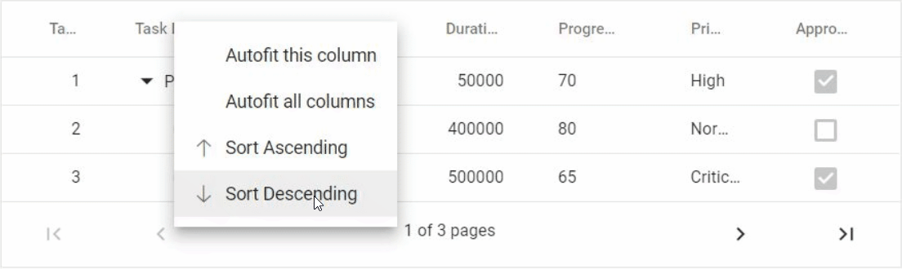
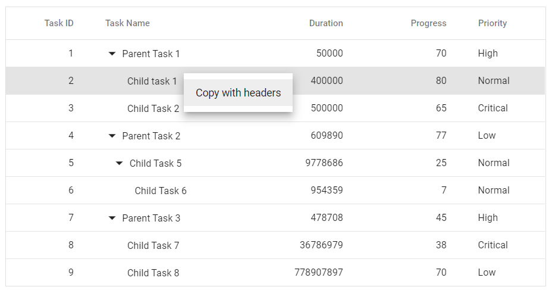

# Context Menu in Syncfusion Blazor TreeGrid Component

The TreeGrid supports displaying a context menu on right-click. To enable this feature, define default or custom items using the [ContextMenuItems](https://help.syncfusion.com/cr/blazor/Syncfusion.Blazor.TreeGrid.SfTreeGrid-1.html#Syncfusion_Blazor_TreeGrid_SfTreeGrid_1_ContextMenuItems) property.

## Default Context Menu Items

| Item | Description |
|------|-------------|
| `AutoFit` | Auto fit the current column |
| `AutoFitAll` | Auto fit all columns |
| `Edit` | Edit the current record |
| `Delete` | Delete the current record |
| `Save` | Save the edited record |
| `Cancel` | Cancel the edited state |
| `Copy` | Copy the selected records |
| `PdfExport` | Export TreeGrid data as PDF |
| `ExcelExport` | Export TreeGrid data as Excel |
| `CsvExport` | Export TreeGrid data as CSV |
| `SortAscending` | Sort the current column in ascending order |
| `SortDescending` | Sort the current column in descending order |
| `FirstPage` | Navigate to the first page |
| `PrevPage` | Navigate to the previous page |
| `LastPage` | Navigate to the last page |
| `NextPage` | Navigate to the next page |
| `AddRow` | Add a new row to the TreeGrid |

The following sample code demonstrates enabling context menu with its default items,

```cshtml
@using Syncfusion.Blazor.TreeGrid;

<SfTreeGrid DataSource="@TreeData" IdMapping="TaskId" AllowPaging="true" AllowExcelExport="true" AllowPdfExport="true" AllowSorting="true" ParentIdMapping="ParentId" ContextMenuItems="@(new List<object>() { "AutoFit", "AutoFitAll", "SortAscending", "SortDescending","Copy", "Edit", "Delete", "Save", "Cancel","PdfExport", "ExcelExport", "CsvExport", "FirstPage", "PrevPage","LastPage", "NextPage"})" TreeColumnIndex="1">
    <TreeGridEditSettings AllowAdding="true" AllowEditing="true" AllowDeleting="true" Mode="EditMode.Row"></TreeGridEditSettings>
    <TreeGridPageSettings PageSize="1"></TreeGridPageSettings>
    <TreeGridColumns>
        <TreeGridColumn Field="TaskId" HeaderText="Task ID" IsPrimaryKey="true" Width="80" TextAlign=" Syncfusion.Blazor.Grids.TextAlign.Right"></TreeGridColumn>
        <TreeGridColumn Field="TaskName" HeaderText="Task Name" Width="220"></TreeGridColumn>
        <TreeGridColumn Field="Duration" HeaderText="Duration" Width="100" TextAlign=" Syncfusion.Blazor.Grids.TextAlign.Right"></TreeGridColumn>
        <TreeGridColumn Field="Progress" HeaderText="Progress" Width="100" EditType="Syncfusion.Blazor.Grids.EditType.NumericEdit" TextAlign=" Syncfusion.Blazor.Grids.TextAlign.Left"></TreeGridColumn>
        <TreeGridColumn Field="Priority" HeaderText="Priority" Width="80"></TreeGridColumn>
        <TreeGridColumn Field="Approved" HeaderText="Approved" Type="Syncfusion.Blazor.Grids.ColumnType.Boolean" EditType="Syncfusion.Blazor.Grids.EditType.BooleanEdit" Width="100" DisplayAsCheckBox="true" TextAlign="Syncfusion.Blazor.Grids.TextAlign.Center"></TreeGridColumn>
    </TreeGridColumns>
</SfTreeGrid>

@code{
   public class BusinessObject
    {
        public int TaskId { get; set; }
        public string TaskName { get; set; }
        public int Duration { get; set; }
        public int Progress { get; set; }
        public string Priority { get; set; }
        public int? ParentId { get; set; }
        public bool Approved { get; set; }
    }

    public List<BusinessObject> TreeData = new List<BusinessObject>();

    protected override void OnInitialized()
    {
        TreeData.Add(new BusinessObject() { TaskId = 1, TaskName = "Parent Task 1", Duration = 50000, Progress = 70, ParentId = null, Priority = "High", Approved = true });
        TreeData.Add(new BusinessObject() { TaskId = 2, TaskName = "Child task 1", Duration = 400000, Progress = 80, ParentId = 1, Priority = "Normal", Approved = false });
        TreeData.Add(new BusinessObject() { TaskId = 3, TaskName = "Child Task 2", Duration = 500000, Progress = 65, ParentId = 1, Priority = "Critical", Approved = true });
        TreeData.Add(new BusinessObject() { TaskId = 4, TaskName = "Parent Task 2", Duration = 609890, Progress = 77, ParentId = null, Priority = "Low", Approved = false });
        TreeData.Add(new BusinessObject() { TaskId = 5, TaskName = "Child Task 5", Duration = 9778686, Progress = 25, ParentId = 4, Priority = "Normal", Approved = true });
        TreeData.Add(new BusinessObject() { TaskId = 6, TaskName = "Child Task 6", Duration = 954359, Progress = 7, ParentId = 5, Priority = "Normal", Approved = false });
        TreeData.Add(new BusinessObject() { TaskId = 7, TaskName = "Parent Task 3", Duration = 478708, Progress = 45, ParentId = null, Priority = "High", Approved = true });
        TreeData.Add(new BusinessObject() { TaskId = 8, TaskName = "Child Task 7", Duration = 36786979, Progress = 38, ParentId = 7, Priority = "Critical", Approved = false });
        TreeData.Add(new BusinessObject() { TaskId = 9, TaskName = "Child Task 8", Duration = 778907897, Progress = 70, ParentId = 7, Priority = "Low", Approved = true });
    }
}
```



## Custom Context Menu Items

Add custom context menu items by setting [ContextMenuItems](https://help.syncfusion.com/cr/blazor/Syncfusion.Blazor.TreeGrid.SfTreeGrid-1.html#Syncfusion_Blazor_TreeGrid_SfTreeGrid_1_ContextMenuItems) to a collection of [ContextMenuItemModel](https://help.syncfusion.com/cr/blazor/Syncfusion.Blazor.Grids.ContextMenuItemModel.html) objects, and handle their actions in the [ContextMenuItemClicked](https://help.syncfusion.com/cr/blazor/Syncfusion.Blazor.TreeGrid.TreeGridEvents-1.html#Syncfusion_Blazor_TreeGrid_TreeGridEvents_1_ContextMenuItemClicked) event.

The following sample code demonstrates defining custom context menu item and its corresponding action in the [ContextMenuItemClicked](https://help.syncfusion.com/cr/blazor/Syncfusion.Blazor.TreeGrid.TreeGridEvents-1.html#Syncfusion_Blazor_TreeGrid_TreeGridEvents_1_ContextMenuItemClicked) event,

```cshtml
@using Syncfusion.Blazor.Grids
@using Syncfusion.Blazor.TreeGrid;

<SfTreeGrid DataSource="@TreeData" @ref="TreeGrid" IdMapping="TaskId" ParentIdMapping="ParentId" ContextMenuItems="@(new List<ContextMenuItemModel>() { new ContextMenuItemModel { Text = "Copy with headers", Target = ".e-content", Id = "copywithheader" } })" TreeColumnIndex="1">
    <TreeGridEvents ContextMenuItemClicked="OnContextMenuClick" TValue="BusinessObject"></TreeGridEvents>
    <TreeGridColumns>
        <TreeGridColumn Field="TaskId" HeaderText="Task ID" IsPrimaryKey="true" Width="80" TextAlign="Syncfusion.Blazor.Grids.TextAlign.Right"></TreeGridColumn>
        <TreeGridColumn Field="TaskName" HeaderText="Task Name" Width="160"></TreeGridColumn>
        <TreeGridColumn Field="Duration" HeaderText="Duration" Width="100" TextAlign="Syncfusion.Blazor.Grids.TextAlign.Right"></TreeGridColumn>
        <TreeGridColumn Field="Progress" HeaderText="Progress" Width="100" TextAlign="Syncfusion.Blazor.Grids.TextAlign.Right"></TreeGridColumn>
        <TreeGridColumn Field="Priority" HeaderText="Priority" Width="80"></TreeGridColumn>
    </TreeGridColumns>
</SfTreeGrid>

@code{
    SfTreeGrid<BusinessObject> TreeGrid;

    public class BusinessObject
    {
        public int TaskId { get; set; }
        public string TaskName { get; set; }
        public int Duration { get; set; }
        public int Progress { get; set; }
        public string Priority { get; set; }
        public int? ParentId { get; set; }
    }

    public List<BusinessObject> TreeData = new List<BusinessObject>();

    protected override void OnInitialized()
    {
        TreeData.Add(new BusinessObject() { TaskId = 1, TaskName = "Parent Task 1", Duration = 50000, Progress = 70, ParentId = null, Priority = "High" });
        TreeData.Add(new BusinessObject() { TaskId = 2, TaskName = "Child task 1", Duration = 400000, Progress = 80, ParentId = 1, Priority = "Normal" });
        TreeData.Add(new BusinessObject() { TaskId = 3, TaskName = "Child Task 2", Duration = 500000, Progress = 65, ParentId = 1, Priority = "Critical" });
        TreeData.Add(new BusinessObject() { TaskId = 4, TaskName = "Parent Task 2", Duration = 609890, Progress = 77, ParentId = null, Priority = "Low" });
        TreeData.Add(new BusinessObject() { TaskId = 5, TaskName = "Child Task 5", Duration = 9778686, Progress = 25, ParentId = 4, Priority = "Normal" });
        TreeData.Add(new BusinessObject() { TaskId = 6, TaskName = "Child Task 6", Duration = 954359, Progress = 7, ParentId = 5, Priority = "Normal" });
        TreeData.Add(new BusinessObject() { TaskId = 7, TaskName = "Parent Task 3", Duration = 478708, Progress = 45, ParentId = null, Priority = "High" });
        TreeData.Add(new BusinessObject() { TaskId = 8, TaskName = "Child Task 7", Duration = 36786979, Progress = 38, ParentId = 7, Priority = "Critical" });
        TreeData.Add(new BusinessObject() { TaskId = 9, TaskName = "Child Task 8", Duration = 778907897, Progress = 70, ParentId = 7, Priority = "Low" });
    }

    public void OnContextMenuClick(ContextMenuClickEventArgs args)
    {
        if (args.Item.Id == "copywithheader")
        {
            this.TreeGrid.CopyAsync(true);
        }
    }
}
```

