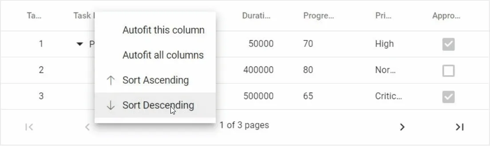
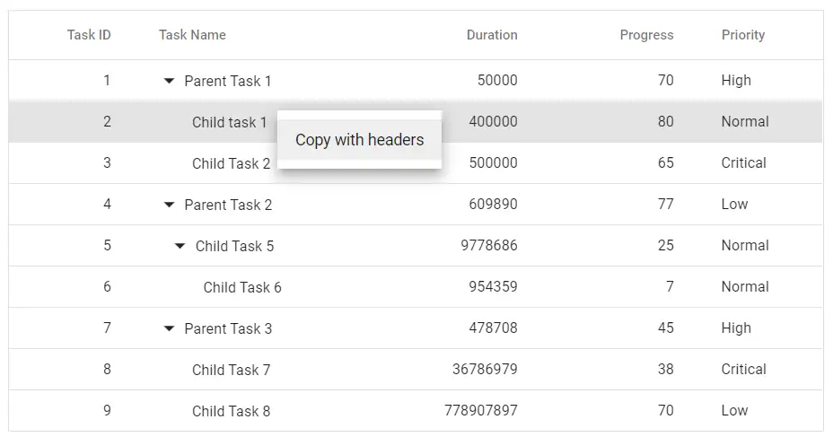

# Context Menu in Blazor TreeGrid

The TreeGrid has options to show the context menu when right-clicked within the TreeGrid. To enable this feature, define either default or custom items in the [ContextMenuItems](https://help.syncfusion.com/cr/blazor/Syncfusion.Blazor.TreeGrid.SfTreeGrid-1.html#Syncfusion_Blazor_TreeGrid_SfTreeGrid_1_ContextMenuItems) property.

Items |Description
-----|-----
`AutoFit` | Auto fit the current column.
`AutoFitAll` | Auto fit all columns.
`Edit` | Edit the current record.
`Delete` | Delete the current record.
`Save` | Save the edited record.
`Cancel` | Cancel the edited state.
`Copy` | Copy the selected records.
`PdfExport` | Export the TreeGrid data as Pdf document.
`ExcelExport` | Export the TreeGrid data as Excel document.
`CsvExport` | Export the TreeGrid data as CSV document.
`SortAscending` | Sort the current column in ascending order.
`SortDescending` | Sort the current column in descending order.
`FirstPage` | Go to the first page.
`PrevPage` | Go to the previous page.
`LastPage` | Go to the last page.
`NextPage` | Go to the next page.
`AddRow` | Add new row to the TreeGrid.

```cshtml
@using Syncfusion.Blazor.TreeGrid;

@using Syncfusion.Blazor.Grids
@using Syncfusion.Blazor.Inputs
@using Syncfusion.Blazor.Navigations
@using System.ComponentModel.DataAnnotations


<SfTreeGrid DataSource="@TreeData" Height="312" IdMapping="TaskID" AllowExcelExport="true" AllowPdfExport="true" AllowSorting="true" ParentIdMapping="ParentID" TreeColumnIndex="1" AllowPaging="true" ContextMenuItems="@(new List<object>() { "AutoFit", "AutoFitAll", "SortAscending", "SortDescending", "Copy", "Edit", "Delete", "Save", "Cancel", "PdfExport", "ExcelExport", "CsvExport", "FirstPage", "PrevPage", "LastPage", "NextPage" })">
    <TreeGridPageSettings PageSize="2">
        
    </TreeGridPageSettings>
    <TreeGridColumns>
        <TreeGridColumn Field="TaskID" HeaderText="Task ID" Width="80" TextAlign="TextAlign.Right"></TreeGridColumn>
        <TreeGridColumn Field="TaskName" HeaderText="Task Name" Width="170"></TreeGridColumn>
        <TreeGridColumn Field="StartDate" HeaderText="Start Date" Format="d" Type=ColumnType.Date Width="145" TextAlign="TextAlign.Right"></TreeGridColumn>
        <TreeGridColumn Field="Duration" HeaderText="Duration" Width="100" TextAlign="TextAlign.Right"></TreeGridColumn>
        <TreeGridColumn Field="Progress" HeaderText="Progress" Width="110"></TreeGridColumn>
        <TreeGridColumn Field="Priority" HeaderText="Priority" Width="100"></TreeGridColumn>
    </TreeGridColumns>
</SfTreeGrid>

@code {
    private List<SelfReferenceData> TreeData { get; set; }

    protected override void OnInitialized()
    {
        TreeData = SelfReferenceData.GetTree().Take(90).ToList();
    }
    public class SelfReferenceData
    {
        public static List<SelfReferenceData> tree = new List<SelfReferenceData>();
        [Key]
        public int? TaskID { get; set; }
        public string TaskName { get; set; }
        public DateTime? StartDate { get; set; }
        public DateTime? EndDate { get; set; }
        public String Progress { get; set; }
        public String Priority { get; set; }
        public double? Duration { get; set; }
        public int? ParentID { get; set; }
        public bool? IsParent { get; set; }
        public bool? Approved { get; set; }
        public int? ParentItem { get; set; }
        public SelfReferenceData() { }
        public static List<SelfReferenceData> GetTree()
        {
            tree.Clear();
            int root = -1;
            int TaskNameID = 0;
            int ChildCount = -1;
            int SubTaskCount = -1;
            for (var t = 1; t <= 60; t++)
            {
                DateTime start = new DateTime(2022, 08, 25);
                DateTime end = new DateTime(2027, 08, 25);
                DateTime startingDate = start.AddDays(t + 2);
                DateTime endingDate = end.AddDays(t + 20);
                string math = "";
                string progr = "";
                bool appr = true;
                int duration = 0;
                duration = (t % 2 == 0) ? 52 : (t % 5 == 0) ? 14 : (t % 3 == 0) ? 25 : 34;
                math = (t % 3) == 0 ? "High" : (t % 2) == 0 ? "Low" : "Critical";
                progr = (t % 3) == 0 ? "Started" : (t % 2) == 0 ? "Open" : "In Progress";
                appr = (t % 3) == 0 ? true : (t % 2) == 0 ? false : true;
                root++; TaskNameID++;
                int rootItem = root + 1;
                tree.Add(new SelfReferenceData() { TaskID = rootItem, TaskName = "Parent task " + TaskNameID.ToString(), StartDate = startingDate, EndDate = endingDate, IsParent = true, ParentID = null, Progress = progr, Priority = math, Duration = duration, Approved = appr });
                int parent = tree.Count;
                for (var c = 0; c < 2; c++)
                {
                    DateTime start1 = new DateTime(2022, 08, 25);
                    DateTime startingDate1 = start1.AddDays(c + 4);
                    DateTime end1 = new DateTime(2025, 06, 16);
                    DateTime endingDate1 = end1.AddDays(c + 15);
                    root++; ChildCount++;
                    int parn = parent + c + 1;
                    string val = "";
                    duration = (c % 3 == 0) ? 1 : (c % 2 == 0) ? 12 : 98;
                    val = ((parent + c + 1) % 3 == 0) ? "Low" : "Critical";
                    progr = ((c + 1) % 3) == 0 ? "In Progress" : ((c + 1) % 2) == 0 ? "Open" : "Validated";
                    appr = ((c + 1) % 3) == 0 ? true : ((c + 3) % 2) == 0 ? false : true;
                    int iD = root + 1;
                    tree.Add(new SelfReferenceData() { TaskID = iD, TaskName = "Child task " + (ChildCount + 1).ToString(), StartDate = startingDate1, EndDate = endingDate1, IsParent = (((parent + c + 1) % 3) == 0), ParentID = rootItem, Progress = progr, Priority = val, Duration = duration, Approved = appr });
                    if ((((parent + c + 1) % 3) == 0))
                    {
                        int immParent = tree.Count;
                        for (var s = 0; s < 3; s++)
                        {
                            DateTime start2 = new DateTime(2022, 08, 25);
                            DateTime startingDate2 = start2.AddDays(s + 4);
                            DateTime end2 = new DateTime(2024, 06, 16);
                            DateTime endingDate2 = end2.AddDays(s + 13);
                            root++; SubTaskCount++;
                            duration = (s % 2 == 0) ? 67 : 14;
                            string Prior = (immParent % 2 == 0) ? "Validated" : "Normal";
                            tree.Add(new SelfReferenceData() { TaskID = root + 1, TaskName = "Sub task " + (SubTaskCount + 1).ToString(), StartDate = startingDate2, EndDate = endingDate2, IsParent = false, ParentID = iD, Progress = (immParent % 2 == 0) ? "In Progress" : "Closed", Priority = Prior, Duration = duration, Approved = appr });
                        }
                    }
                }
            }
            return tree;
        }
    }
}
```

N>  For context menu items such as **ExcelExport**, **PdfExport**, or **CsvExport** to work, the corresponding export properties ([AllowExcelExport](https://help.syncfusion.com/cr/blazor/Syncfusion.Blazor.TreeGrid.SfTreeGrid-1.html#Syncfusion_Blazor_TreeGrid_SfTreeGrid_1_AllowExcelExport), [AllowPdfExport](https://help.syncfusion.com/cr/blazor/Syncfusion.Blazor.TreeGrid.SfTreeGrid-1.html#Syncfusion_Blazor_TreeGrid_SfTreeGrid_1_AllowPdfExport)) must be enabled on the TreeGrid.



## Custom context menu items

The custom context menu items can be added by defining the [ContextMenuItems](https://help.syncfusion.com/cr/blazor/Syncfusion.Blazor.TreeGrid.SfTreeGrid-1.html#Syncfusion_Blazor_TreeGrid_SfTreeGrid_1_ContextMenuItems) as a collection of [ContextMenuItemModel](https://help.syncfusion.com/cr/blazor/Syncfusion.Blazor.Grids.ContextMenuItemModel.html). Actions for these customized items can be defined in the [ContextMenuItemClicked](https://help.syncfusion.com/cr/blazor/Syncfusion.Blazor.TreeGrid.TreeGridEvents-1.html#Syncfusion_Blazor_TreeGrid_TreeGridEvents_1_ContextMenuItemClicked) event.


```cshtml
@using Syncfusion.Blazor.Grids
@using Syncfusion.Blazor.TreeGrid;

<SfTreeGrid DataSource="@TreeData" @ref="TreeGrid" IdMapping="TaskId" ParentIdMapping="ParentId" ContextMenuItems="@(new List<ContextMenuItemModel>() { new ContextMenuItemModel { Text = "Copy with headers", Target = ".e-content", Id = "copywithheader" } })" TreeColumnIndex="1">
    <TreeGridEvents ContextMenuItemClicked="OnContextMenuClick" TValue="BusinessObject"></TreeGridEvents>
    <TreeGridColumns>
        <TreeGridColumn Field="TaskId" HeaderText="Task ID" IsPrimaryKey="true" Width="80" TextAlign="Syncfusion.Blazor.Grids.TextAlign.Right"></TreeGridColumn>
        <TreeGridColumn Field="TaskName" HeaderText="Task Name" Width="160"></TreeGridColumn>
        <TreeGridColumn Field="Duration" HeaderText="Duration" Width="100" TextAlign="Syncfusion.Blazor.Grids.TextAlign.Right"></TreeGridColumn>
        <TreeGridColumn Field="Progress" HeaderText="Progress" Width="100" TextAlign="Syncfusion.Blazor.Grids.TextAlign.Right"></TreeGridColumn>
        <TreeGridColumn Field="Priority" HeaderText="Priority" Width="80"></TreeGridColumn>
    </TreeGridColumns>
</SfTreeGrid>

@code{
    SfTreeGrid<BusinessObject> TreeGrid;

    public class BusinessObject
    {
        public int TaskId { get; set; }
        public string TaskName { get; set; }
        public int Duration { get; set; }
        public int Progress { get; set; }
        public string Priority { get; set; }
        public int? ParentId { get; set; }
    }

    public List<BusinessObject> TreeData = new List<BusinessObject>();

    protected override void OnInitialized()
    {
        TreeData.Add(new BusinessObject() { TaskId = 1, TaskName = "Parent Task 1", Duration = 50000, Progress = 70, ParentId = null, Priority = "High" });
        TreeData.Add(new BusinessObject() { TaskId = 2, TaskName = "Child task 1", Duration = 400000, Progress = 80, ParentId = 1, Priority = "Normal" });
        TreeData.Add(new BusinessObject() { TaskId = 3, TaskName = "Child Task 2", Duration = 500000, Progress = 65, ParentId = 1, Priority = "Critical" });
        TreeData.Add(new BusinessObject() { TaskId = 4, TaskName = "Parent Task 2", Duration = 609890, Progress = 77, ParentId = null, Priority = "Low" });
        TreeData.Add(new BusinessObject() { TaskId = 5, TaskName = "Child Task 5", Duration = 9778686, Progress = 25, ParentId = 4, Priority = "Normal" });
        TreeData.Add(new BusinessObject() { TaskId = 6, TaskName = "Child Task 6", Duration = 954359, Progress = 7, ParentId = 5, Priority = "Normal" });
        TreeData.Add(new BusinessObject() { TaskId = 7, TaskName = "Parent Task 3", Duration = 478708, Progress = 45, ParentId = null, Priority = "High" });
        TreeData.Add(new BusinessObject() { TaskId = 8, TaskName = "Child Task 7", Duration = 36786979, Progress = 38, ParentId = 7, Priority = "Critical" });
        TreeData.Add(new BusinessObject() { TaskId = 9, TaskName = "Child Task 8", Duration = 778907897, Progress = 70, ParentId = 7, Priority = "Low" });
    }

    public async Task OnContextMenuClick(ContextMenuClickEventArgs<BusinessObject> args)
    {
        if (args.Item.Id == "copywithheader")
        {
            await this.TreeGrid.CopyAsync(true);
        }
    }
}
```

