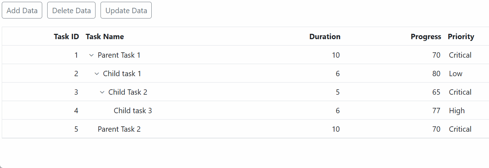
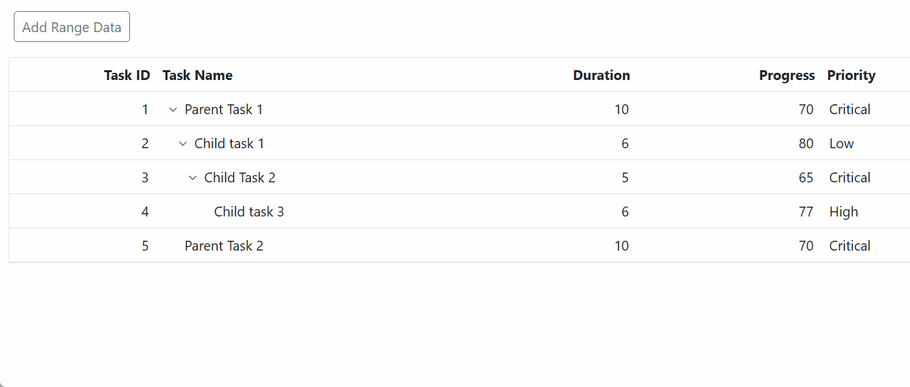

# Data Binding in Blazor TreeGrid Component

The Tree Grid uses **SfDataManager**, which supports both RESTful Web Services binding and List binding. The [DataSource](https://help.syncfusion.com/cr/blazor/Syncfusion.Blazor.TreeGrid.SfTreeGrid-1.html#Syncfusion_Blazor_TreeGrid_SfTreeGrid_1_DataSource) property can be assigned either using the **SfDataManager** as child component of the Tree Grid Blazor component or list of business objects.
It supports two kinds of data binding method:
* List binding
* Remote service binding

To learn about how to bind local or remote data to Tree Grid, check out this video:



## List binding

In List binding, data source for rendering the Tree Grid component is retrieved from the same application locally.

Two types of Data binding are possible with the Tree Grid component.

* Self-Referential Data binding (Flat Data)
* Hierarchical Data binding

For Self-Referential data binding, assign the list of business objects to the [DataSource](https://help.syncfusion.com/cr/blazor/Syncfusion.Blazor.TreeGrid.SfTreeGrid-1.html#Syncfusion_Blazor_TreeGrid_SfTreeGrid_1_DataSource) property.

For Hierarchy Data binding, the data-source should be assigned as an object array to the **Json** property of the **SfDataManager** and the **Adaptor** property of the SfDataManager should be either **RemoteSaveAdaptor** or **JsonAdaptor**.

### Self-Referential data binding/Flat Data

Tree Grid is rendered from Self-Referential data structures by providing two fields, [IdMapping](https://help.syncfusion.com/cr/blazor/Syncfusion.Blazor.TreeGrid.SfTreeGrid-1.html#Syncfusion_Blazor_TreeGrid_SfTreeGrid_1_IdMapping) field and [ParentIdMapping](https://help.syncfusion.com/cr/blazor/Syncfusion.Blazor.TreeGrid.SfTreeGrid-1.html#Syncfusion_Blazor_TreeGrid_SfTreeGrid_1_ParentIdMapping) field.

* [IdMapping](https://help.syncfusion.com/cr/blazor/Syncfusion.Blazor.TreeGrid.SfTreeGrid-1.html#Syncfusion_Blazor_TreeGrid_SfTreeGrid_1_IdMapping): This field contains unique values used to identify nodes.
* [ParentIdMapping](https://help.syncfusion.com/cr/blazor/Syncfusion.Blazor.TreeGrid.SfTreeGrid-1.html#Syncfusion_Blazor_TreeGrid_SfTreeGrid_1_ParentIdMapping): This field contains values that indicate parent nodes.

```cshtml

@using Syncfusion.Blazor.TreeGrid;

<SfTreeGrid DataSource="@TreeData" IdMapping="TaskId" ParentIdMapping="ParentId" TreeColumnIndex="1">
    <TreeGridColumns>
        <TreeGridColumn Field="TaskId" HeaderText="Task ID" Width="80" TextAlign="Syncfusion.Blazor.Grids.TextAlign.Right"></TreeGridColumn>
        <TreeGridColumn Field="TaskName" HeaderText="Task Name" Width="160"></TreeGridColumn>
        <TreeGridColumn Field="StartDate" HeaderText="Start Date" Format="d" Type="Syncfusion.Blazor.Grids.ColumnType.DateOnly" Width="152" TextAlign="Syncfusion.Blazor.Grids.TextAlign.Right"></TreeGridColumn>
        <TreeGridColumn Field="StartTime" HeaderText="Start Time" Type="Syncfusion.Blazor.Grids.ColumnType.TimeOnly" Width="100" TextAlign="Syncfusion.Blazor.Grids.TextAlign.Right"></TreeGridColumn>
        <TreeGridColumn Field="Duration" HeaderText="Duration" Width="100" TextAlign="Syncfusion.Blazor.Grids.TextAlign.Right"></TreeGridColumn>
        <TreeGridColumn Field="Progress" HeaderText="Progress" Width="100" TextAlign="Syncfusion.Blazor.Grids.TextAlign.Right"></TreeGridColumn>
    </TreeGridColumns>
</SfTreeGrid>

@code{
   public class BusinessObject
    {
        public int TaskId { get; set; }
        public string TaskName { get; set; }
        public DateOnly? StartDate { get; set; }
        public TimeOnly? StartTime { get; set; }
        public int Duration { get; set; }
        public int Progress { get; set; }
        public string Priority { get; set; }
        public int? ParentId { get; set; }
    }

    public List<BusinessObject> TreeData = new List<BusinessObject>();

    protected override void OnInitialized()
    {
        TreeData.Add(new BusinessObject() { TaskId = 1, TaskName = "Parent Task 1", StartDate = new DateOnly(2021, 03, 02), StartTime = new TimeOnly(10, 00, 00), Duration = 10, Progress = 70, ParentId = null, Priority = "High" });
        TreeData.Add(new BusinessObject() { TaskId = 2, TaskName = "Child task 1", StartDate = new DateOnly(2021, 03, 04), StartTime = new TimeOnly(11, 30, 00), Duration = 4, Progress = 80, ParentId = 1, Priority = "Normal" });
        TreeData.Add(new BusinessObject() { TaskId = 3, TaskName = "Child Task 2", StartDate = new DateOnly(2021, 03, 06), StartTime = new TimeOnly(12, 00, 00), Duration = 5, Progress = 65, ParentId = 1, Priority = "Critical" });
        TreeData.Add(new BusinessObject() { TaskId = 4, TaskName = "Parent Task 2", StartDate = new DateOnly(2021, 03, 08), StartTime = new TimeOnly(13, 30, 00), Duration = 6, Progress = 77, ParentId = null, Priority = "Low" });
        TreeData.Add(new BusinessObject() { TaskId = 5, TaskName = "Child Task 5", StartDate = new DateOnly(2021, 07, 10), StartTime = new TimeOnly(14, 00, 00), Duration = 9, Progress = 25, ParentId = 4, Priority = "Normal" });
        TreeData.Add(new BusinessObject() { TaskId = 6, TaskName = "Child Task 6", StartDate = new DateOnly(2021, 10, 12), StartTime = new TimeOnly(16, 00, 00), Duration = 9, Progress = 7, ParentId = 5, Priority = "Normal" });
        TreeData.Add(new BusinessObject() { TaskId = 7, TaskName = "Parent Task 3", StartDate = new DateOnly(2021, 10, 14), StartTime = new TimeOnly(17, 30, 00), Duration = 4, Progress = 45, ParentId = null, Priority = "High" });
        TreeData.Add(new BusinessObject() { TaskId = 8, TaskName = "Child Task 7", StartDate = new DateOnly(2021, 10, 16), StartTime = new TimeOnly(18, 00, 00), Duration = 3, Progress = 38, ParentId = 7, Priority = "Critical" });
        TreeData.Add(new BusinessObject() { TaskId = 9, TaskName = "Child Task 8", StartDate = new DateOnly(2021, 02, 18), StartTime = new TimeOnly(19, 30, 00), Duration = 7, Progress = 70, ParentId = 7, Priority = "Low" });
    }
}
```

### Hierarchy data binding

The [ChildMapping](https://help.syncfusion.com/cr/blazor/Syncfusion.Blazor.TreeGrid.SfTreeGrid-1.html#Syncfusion_Blazor_TreeGrid_SfTreeGrid_1_ChildMapping) property is used to map the child records in hierarchy data source.

The following code example shows how to bind the hierarchical list data into the Tree Grid component.

```cshtml

@using Syncfusion.Blazor.TreeGrid;
@using Syncfusion.Blazor.Data;

<SfTreeGrid ChildMapping="Children" TreeColumnIndex="1" DataSource="@TreeData" TValue="BusinessObject" >
    <TreeGridColumns>
        <TreeGridColumn Field="TaskId" HeaderText="Task ID" Width="80" TextAlign="Syncfusion.Blazor.Grids.TextAlign.Right"></TreeGridColumn>
        <TreeGridColumn Field="TaskName" HeaderText="Task Name" Width="160"></TreeGridColumn>
        <TreeGridColumn Field="Duration" HeaderText="Duration" Width="100" TextAlign="Syncfusion.Blazor.Grids.TextAlign.Right"></TreeGridColumn>
        <TreeGridColumn Field="Progress" HeaderText="Progress" Width="100" TextAlign="Syncfusion.Blazor.Grids.TextAlign.Right"></TreeGridColumn>
        <TreeGridColumn Field="Priority" HeaderText="Priority" Width="80"></TreeGridColumn>
    </TreeGridColumns>
</SfTreeGrid>

@code{
    public class BusinessObject
    {
        public int TaskId { get; set; }
        public string TaskName { get; set; }
        public int Duration { get; set; }
        public int Progress { get; set; }
        public string Priority { get; set; }
        public List<BusinessObject> Children { get; set; }
    }
    public List<BusinessObject> TreeData = new List<BusinessObject>();
    protected override void OnInitialized()
    {
        List<BusinessObject> Record1 = new List<BusinessObject>();
        BusinessObject Child1 = new BusinessObject() { TaskId = 2, TaskName = "Plan timeline", Progress = 100, Duration = 5, Priority = "Normal" };
        BusinessObject Child2 = new BusinessObject() { TaskId = 3, TaskName = "Plan budget", Duration = 5, Progress = 100, Priority = "Low" };
        BusinessObject Child3 = new BusinessObject() { TaskId = 4, TaskName = "Allocate resources", Duration = 5, Progress = 100, Priority = "Critical" };
        Record1.Add(Child1);
        Record1.Add(Child2);
        Record1.Add(Child3);
        TreeData.Add(new BusinessObject() { TaskId = 1, TaskName = "Planning", Duration = 10, Progress = 70, Children = Record1, Priority = "High" });


        List<BusinessObject> Record2 = new List<BusinessObject>();
        BusinessObject Child4 = new BusinessObject() { TaskId = 6, TaskName = "Software Specification", Progress = 60, Duration = 3, Priority = "Normal" };
        BusinessObject Child5 = new BusinessObject() { TaskId = 7, TaskName = "Develop Prototype", Duration = 3, Progress = 100, Priority = "Critical" };


        Record2.Add(Child4);
        Record2.Add(Child5);
        TreeData.Add(new BusinessObject() { TaskId = 5, TaskName = "Design", Duration = 3, Progress = 86, Children = Record2, Priority = "High" });
    }
}

```

N> * ExpandCollapse State maintenance is not supported for Hierarchy Data.
<br/> * Batch Editing is not supported for Hierarchy Data.
<br/> * `PageSizeMode` --> `All` is not supported for Hierarchy Data.
<br/> * Row Drag and Drop feature is not supported for Hierarchy Data.

### DynamicObject binding

Tree Grid is a generic component which is strongly bound to a model type. There are cases when the model type is unknown during compile type. In such cases the data can be bound to the tree grid as list of  **DynamicObject**.

**DynamicObject** can be bound to tree grid by assigning to the [DataSource](https://help.syncfusion.com/cr/blazor/Syncfusion.Blazor.TreeGrid.SfTreeGrid-1.html#Syncfusion_Blazor_TreeGrid_SfTreeGrid_1_DataSource) property. Tree Grid can also perform all kind of supported data operations and editing in DynamicObject.

N> The [GetDynamicMemberNames](https://learn.microsoft.com/en-us/dotnet/api/system.dynamic.dynamicobject.getdynamicmembernames?view=net-8.0) method of DynamicObject class must be overridden and return the property names to render and perform data operations, editing etc., while using DynamicObject.

```cshtml
@using Syncfusion.Blazor.TreeGrid
@using System.Dynamic

<SfTreeGrid DataSource="@TreeData" @ref="TreeGrid" AllowPaging="true" Toolbar="@(new List<string>() { "Add", "Edit", "Delete", "Update", "Cancel" })" IdMapping="TaskID" ParentIdMapping="ParentID" TreeColumnIndex="1">
    <TreeGridEditSettings AllowEditing="true" AllowAdding="true" AllowDeleting="true" NewRowPosition="RowPosition.Below" />
    <TreeGridPageSettings PageSize="2" PageSizeMode="PageSizeMode.Root"></TreeGridPageSettings>
    <TreeGridColumns>
        <TreeGridColumn Field="TaskID" HeaderText="Task ID" Width="80" IsPrimaryKey="true"></TreeGridColumn>
        <TreeGridColumn Field="TaskName" HeaderText="Task Name" Width="240"></TreeGridColumn>
        <TreeGridColumn Field="StartDate" HeaderText="StartDate" Format="d" Width="100"></TreeGridColumn>
        <TreeGridColumn Field="Duration" HeaderText="Duration" Width="80"></TreeGridColumn>
        <TreeGridColumn Field="Progress" HeaderText="Progress" Width="100"></TreeGridColumn>
        <TreeGridColumn Field="Priority" HeaderText="Priority" Width="80"></TreeGridColumn>
    </TreeGridColumns>
</SfTreeGrid>

@code {
    SfTreeGrid<DynamicDictionary> TreeGrid;
    public List<DynamicDictionary> TreeData { get; set; }
    protected override void OnInitialized()
    {
        this.TreeData = GetData().ToList();
    }
    public static List<DynamicDictionary> Data = new List<DynamicDictionary>();
    public static int ParentRecordID { get; set; }
    public static int ChildRecordID { get; set; }

    public static List<DynamicDictionary> GetData()
    {
        Data.Clear();
        ParentRecordID = 0;
        ChildRecordID = 0;
        for (var i = 1; i <= 3; i++)
        {
            Random ran = new Random();
            DateTime start = new DateTime(1992, 06, 07);
            int range = (DateTime.Today - start).Days;
            DateTime startingDate = start.AddDays(ran.Next(range));
            dynamic ParentRecord = new DynamicDictionary();
            ParentRecord.TaskID = ++ParentRecordID;
            ParentRecord.TaskName = "Parent Task " + i;
            ParentRecord.StartDate = startingDate;
            ParentRecord.Progress = ParentRecordID % 2 == 0 ? "In Progress" : "Open";
            ParentRecord.Priority = ParentRecordID % 2 == 0 ? "High" : "Low";
            ParentRecord.Duration = ParentRecordID % 2 == 0 ? 32 : 76;
            ParentRecord.ParentID = null;
            Data.Add(ParentRecord);
            AddChildRecords(ParentRecordID);
        }
        return Data;
    }
    public static void AddChildRecords(int ParentId)
    {
        for (var i = 1; i < 3; i++)
        {
            Random ran = new Random();
            DateTime start = new DateTime(1992, 06, 07);
            int range = (DateTime.Today - start).Days;
            DateTime startingDate = start.AddDays(ran.Next(range));
            dynamic ChildRecord = new DynamicDictionary();
            ChildRecord.TaskID = ++ParentRecordID;
            ChildRecord.TaskName = "Child Task " + ++ChildRecordID;
            ChildRecord.StartDate = startingDate;
            ChildRecord.Progress = ParentRecordID % 3 == 0 ? "Validated" : "Closed";
            ChildRecord.Priority = ParentRecordID % 3 == 0 ? "Low" : "Critical";
            ChildRecord.Duration = ParentRecordID % 3 == 0 ? 64 : 98;
            ChildRecord.ParentID = ParentId;
            Data.Add(ChildRecord);
        }
    }

    public class DynamicDictionary : DynamicObject
    {
        Dictionary<string, object> dictionary = new Dictionary<string, object>();

        public override bool TryGetMember(GetMemberBinder binder, out object result)
        {
            string name = binder.Name;
            return dictionary.TryGetValue(name, out result);
        }
        public override bool TrySetMember(SetMemberBinder binder, object value)
        {
            dictionary[binder.Name] = value;
            return true;
        }

        public override System.Collections.Generic.IEnumerable<string> GetDynamicMemberNames()
        {
            return this.dictionary?.Keys;
        }

    }
}
```

### ExpandoObject binding

Tree Grid is a generic component which is strongly bound to a model type. There are cases when the model type is unknown during compile type. In such cases bind data to the tree grid as list of ExpandoObject.

ExpandoObject can be bound to Tree grid by assigning to the [DataSource](https://help.syncfusion.com/cr/blazor/Syncfusion.Blazor.TreeGrid.SfTreeGrid-1.html#Syncfusion_Blazor_TreeGrid_SfTreeGrid_1_DataSource) property. Tree Grid can also perform all kind of supported data operations and editing in ExpandoObject.

```cshtml

@using Syncfusion.Blazor.TreeGrid;

<SfTreeGrid DataSource="@TreeData" @ref="TreeGrid" AllowPaging="true" IdMapping="TaskID" ParentIdMapping="ParentID" TreeColumnIndex="1"  Toolbar="@(new List<string>() { "Add", "Edit", "Delete", "Update", "Cancel" })">
    <TreeGridPageSettings PageSize="2"></TreeGridPageSettings>
    <TreeGridEditSettings AllowAdding="true" AllowEditing="true" AllowDeleting="true" Mode="Syncfusion.Blazor.TreeGrid.EditMode.Cell"></TreeGridEditSettings>
    <TreeGridColumns>
        <TreeGridColumn Field="TaskID" HeaderText="Task ID" Width="80" IsPrimaryKey="true"></TreeGridColumn>
        <TreeGridColumn Field="TaskName" HeaderText="Task Name" Width="100"></TreeGridColumn>
        <TreeGridColumn Field="StartDate" HeaderText="StartDate" Format="d" Width="100"></TreeGridColumn>
        <TreeGridColumn Field="Duration" HeaderText="Duration" Width="80"></TreeGridColumn>
        <TreeGridColumn Field="Progress" HeaderText="Progress" Width="80"></TreeGridColumn>
        <TreeGridColumn Field="Priority" HeaderText="Priority" Width="80"></TreeGridColumn>
    </TreeGridColumns>
</SfTreeGrid>
@code {
    SfTreeGrid<ExpandoObject> TreeGrid;
    public List<ExpandoObject> TreeData { get; set; }
    protected override void OnInitialized()
    {
        this.TreeData = GetData().ToList();
    }
    public static List<ExpandoObject> Data = new List<ExpandoObject>();
    public static int ParentRecordID { get; set; }
    public static int ChildRecordID { get; set; }
    public static List<ExpandoObject> GetData()
    {
        Data.Clear();
        ParentRecordID = 0;
        ChildRecordID = 0;
        for (var i = 1; i <= 60; i++)
        {
            Random ran = new Random();
            DateTime start = new DateTime(1992, 06, 07);
            int range = (DateTime.Today - start).Days;
            DateTime startingDate = start.AddDays(ran.Next(range));
            dynamic ParentRecord = new ExpandoObject();
            ParentRecord.TaskID = ++ParentRecordID;
            ParentRecord.TaskName = "Parent Task " + i;
            ParentRecord.StartDate = startingDate;
            ParentRecord.Progress = ParentRecordID % 2 == 0 ? "In Progress" : "Open";
            ParentRecord.Priority = ParentRecordID % 2 == 0 ? "High" : "Low";
            ParentRecord.Duration = ParentRecordID % 2 == 0 ? 32 : 76;
            ParentRecord.ParentID = null;
            Data.Add(ParentRecord);
            AddChildRecords(ParentRecordID);
        }
        return Data;
    }
    public static void AddChildRecords(int ParentId)
    {
        for (var i = 1; i < 4; i++)
        {
            Random ran = new Random();
            DateTime start = new DateTime(1992, 06, 07);
            int range = (DateTime.Today - start).Days;
            DateTime startingDate = start.AddDays(ran.Next(range));
            dynamic ChildRecord = new ExpandoObject();
            ChildRecord.TaskID = ++ParentRecordID;
            ChildRecord.TaskName = "Child Task " + ++ChildRecordID;
            ChildRecord.StartDate = startingDate;
            ChildRecord.Progress = ParentRecordID % 3 == 0 ? "Validated" : "Closed";
            ChildRecord.Priority = ParentRecordID % 3 == 0 ? "Low" : "Critical";
            ChildRecord.Duration = ParentRecordID % 3 == 0 ? 64 : 98;
            ChildRecord.ParentID = ParentId;
            Data.Add(ChildRecord);
        }
    }
}

```

N> Herewith the list of reserved properties and the purpose used in TreeGrid are provided. It is recommended to avoid these reserved properties for Internal purpose(To get rid of conflicts).

Reserved keywords | Purpose
-----|-----
childRecords | Specifies the childRecords of a parentData
hasChildRecords | Specifies whether the record contains child records
hasFilteredChildRecords | Specifies whether the record contains filtered child records
expanded | Specifies whether the child records are expanded
parentRecord | Specifies the parentItem of childRecords
index | Specifies the index of current record
level | Specifies the hierarchy level of record
filterLevel | Specifies the hierarchy level of filtered record
parentIdMapping | Specifies the parentID
uniqueID | Specifies the unique ID of a record
parentUniqueID | Specifies the parent Unique ID of a record
checkboxState | Specifies the checkbox state of a record

### Observable collection

An Observable collection is a special type of collection in .NET that automatically notifies any subscribers (such as the UI or other components) when changes are made to the collection. This is particularly useful in data-binding scenarios, where you want the UI to reflect changes in the underlying data model without having to manually update the view.

To achieve this, you can use the [ObservableCollection](https://learn.microsoft.com/en-us/dotnet/api/system.collections.objectmodel.observablecollection-1?view=netframework-4.8), a dynamic data collection that:

   * Provides notifications when items are added, removed, or moved.

   * Implements the [INotifyCollectionChanged](https://learn.microsoft.com/en-us/dotnet/api/system.collections.specialized.inotifycollectionchanged?view=netframework-4.8) interface to notify subscribers about changes such as adding, removing, moving, or clearing items in the collection.

   * Implements the [INotifyPropertyChanged](https://learn.microsoft.com/en-us/dotnet/api/system.componentmodel.inotifypropertychanged?view=netframework-4.8) interface to notify when a property value changes on the client side.

The following sample demonstrates how the Order class implements the **INotifyPropertyChanged** interface and raises the event when the **TaskName** property value is changed.




@using BlazorApp1.Components.Data
@using Syncfusion.Blazor.TreeGrid
@using Syncfusion.Blazor.Buttons
@using System.Collections.ObjectModel

<div style="margin-bottom:15px">
<SfButton CssClass="e-outline" OnClick="@(() => AddRecord())" Content="Add Data"></SfButton>
<SfButton CssClass="e-outline" Style="margin-left:5px" OnClick="@(() => DeleteRecord())" Content="Delete Data"></SfButton>
<SfButton CssClass="e-outline" Style="margin-left:5px" OnClick="@(() => UpdateRecord())" Content="Update Data"></SfButton>
</div>

<SfTreeGrid DataSource="@TreeGridData" IdMapping="TaskId" ParentIdMapping="ParentId" TreeColumnIndex="1">
    <TreeGridColumns>
        <TreeGridColumn Field="TaskId" HeaderText="Task ID" Width="80" TextAlign="Syncfusion.Blazor.Grids.TextAlign.Right"></TreeGridColumn>
        <TreeGridColumn Field="TaskName" HeaderText="Task Name" Width="160"></TreeGridColumn>
        <TreeGridColumn Field="Duration" HeaderText="Duration" Width="100" TextAlign="Syncfusion.Blazor.Grids.TextAlign.Right"></TreeGridColumn>
        <TreeGridColumn Field="Progress" HeaderText="Progress" Width="100" TextAlign="Syncfusion.Blazor.Grids.TextAlign.Right"></TreeGridColumn>
        <TreeGridColumn Field="Priority" HeaderText="Priority" Width="80"></TreeGridColumn>
    </TreeGridColumns>
</SfTreeGrid>

@code {
    public ObservableCollection<TreeData.BusinessObject> TreeGridData { get; set; }
    private int taskCounter = 6;

    protected override void OnInitialized()
    {
        TreeGridData = TreeData.GetSelfDataSource();
    }

    public void AddRecord()
    {
        TreeGridData.Add(new TreeData.BusinessObject
        {
            TaskId = taskCounter++,
            TaskName = "New Task",
            Duration = 5,
            Progress = 50,
            Priority = "Normal",
            ParentId = null
        });
    }

    public void DeleteRecord()
    {
        if (TreeGridData.Any())
            TreeGridData.Remove(TreeGridData.Last());
    }

    public void UpdateRecord()
    {
        if (TreeGridData.Any())
            TreeGridData.First().TaskName = "Updated Task Name";
    }
}




using System.Collections.ObjectModel;
using System.ComponentModel;

namespace BlazorApp1.Components.Data
{
  public class TreeData
  {
    public class BusinessObject : INotifyPropertyChanged
    {
      public int TaskId { get; set; }

      private string taskName;
      public string TaskName
      {
        get => taskName;
        set
        {
          taskName = value;
          NotifyPropertyChanged(nameof(TaskName));
        }
      }

      public int? Duration { get; set; }
      public int? Progress { get; set; }
      public string Priority { get; set; }
      public int? ParentId { get; set; }

      public event PropertyChangedEventHandler PropertyChanged;
      private void NotifyPropertyChanged(string propertyName)
      {
        PropertyChanged?.Invoke(this, new PropertyChangedEventArgs(propertyName));
      }
    }

    public static ObservableCollection<BusinessObject> GetSelfDataSource()
    {
      return new ObservableCollection<BusinessObject>
          {
              new BusinessObject { TaskId = 1, TaskName = "Parent Task 1", Duration = 10, Progress = 70, Priority = "Critical", ParentId = null },
              new BusinessObject { TaskId = 2, TaskName = "Child task 1", Duration = 6, Progress = 80, Priority = "Low", ParentId = 1 },
              new BusinessObject { TaskId = 3, TaskName = "Child Task 2", Duration = 5, Progress = 65, Priority = "Critical", ParentId = 2 },
              new BusinessObject { TaskId = 4, TaskName = "Child task 3", Duration = 6, Priority = "High", Progress = 77, ParentId = 3 },
              new BusinessObject { TaskId = 5, TaskName = "Parent Task 2", Duration = 10, Progress = 70, Priority = "Critical", ParentId = null }
          };
    }
  }
}




The following screenshot represents the TreeGrid with **Observable Collection**.



N> While using an Observable collection, the added, removed, and changed records are reflected in the UI. But while updating the Observable collection using external actions like timers, events, and other notifications, you need to call the `StateHasChanged` method to reflect the changes in the UI.

#### Add a range of items into ObservableCollection in Blazor TreeGrid

The Syncfusion<sup style="font-size:70%">&reg;</sup> Blazor TreeGrid supports binding to an **ObservableCollection**, which allows the TreeGrid to automatically reflect changes made to the data source. This approach is particularly useful when you need to add a large batch of records to the TreeGrid at once, such as:

  * Loading or importing a large dataset dynamically.

  * Appending multiple items retrieved from an API or database.

  * Performing bulk updates or data synchronization operations.

  * Avoiding UI lag and flickering caused by multiple individual item additions.

  * Ensuring smoother and more efficient data rendering in scenarios with high-frequency data changes.

By default, the `Add` method is used to insert a single item into the **ObservableCollection**. When multiple items are added one by one using a `foreach` loop, the TreeGrid refreshes after each addition. This can lead to performance issues and UI flickering, especially when adding a large number of items.

To optimize performance when adding multiple items at once, you can extend the `ObservableCollection<T>` class by implementing an `AddRange` method. By using this method, you can add a range of items and ensure that the `OnCollectionChanged` event is triggered only once, updating the TreeGrid a single time for the entire batch operation.

To implement this functionality, follow these steps:

1. **Create a Custom Collection Class**

    Define a new class **SmartObservableCollection<T>** that inherits from `ObservableCollection<T>`. This allows you to customize the behavior of the collection.

2. **Add a flag to control notifications**

    Introduce a private boolean **flag _preventNotification** to temporarily disable collection change notifications while adding multiple items.

3. **Override the OnCollectionChanged method**

    Override this method to check the **_preventNotification** flag. When the flag is set to **true**, skip raising the notification to avoid multiple UI refreshes.

4. **Implement the AddRange method**

    This method enables adding multiple items efficiently by:

      * Setting **_preventNotification** to **true** to suppress notifications.
      * Adding each item from the input list to the collection using the `Add` method within a `foreach` loop.
      * Resetting **_preventNotification** to **false**.
      * Raising a single **NotifyCollectionChangedAction.Reset** notification to inform the TreeGrid that the entire collection has changed.

The following example demonstrates how to use this approach in a TreeGrid:  




@using BlazorApp1.Components.Data
@using Syncfusion.Blazor.TreeGrid
@using Syncfusion.Blazor.Buttons
@using System.Collections.ObjectModel

<div style="margin-bottom:15px">
    <SfButton CssClass="e-outline" Style="margin-left:5px" OnClick="@(() => AddRangeRecords())" Content="Add Range Data"></SfButton>
</div>

<SfTreeGrid DataSource="@TreeGridData" IdMapping="TaskId" ParentIdMapping="ParentId" TreeColumnIndex="1">
    <TreeGridColumns>
        <TreeGridColumn Field="TaskId" HeaderText="Task ID" Width="80" TextAlign="Syncfusion.Blazor.Grids.TextAlign.Right"></TreeGridColumn>
        <TreeGridColumn Field="TaskName" HeaderText="Task Name" Width="160"></TreeGridColumn>
        <TreeGridColumn Field="Duration" HeaderText="Duration" Width="100" TextAlign="Syncfusion.Blazor.Grids.TextAlign.Right"></TreeGridColumn>
        <TreeGridColumn Field="Progress" HeaderText="Progress" Width="100" TextAlign="Syncfusion.Blazor.Grids.TextAlign.Right"></TreeGridColumn>
        <TreeGridColumn Field="Priority" HeaderText="Priority" Width="80"></TreeGridColumn>
    </TreeGridColumns>
</SfTreeGrid>

@code {
    public SmartObservableCollection<TreeData.BusinessObject> TreeGridData { get; set; }
    private int taskCounter = 6;

    protected override void OnInitialized()
    {
        TreeGridData = new SmartObservableCollection<TreeData.BusinessObject>(TreeData.GetSelfDataSource());
    }

    public void AddRangeRecords()
    {
        var newItems = new List<TreeData.BusinessObject>
        {
            new TreeData.BusinessObject { TaskId = taskCounter++, TaskName = "Batch Task 1", Duration = 4, Progress = 40, Priority = "High", ParentId = null },
            new TreeData.BusinessObject { TaskId = taskCounter++, TaskName = "Batch Task 2", Duration = 6, Progress = 60, Priority = "Low", ParentId = null },
            new TreeData.BusinessObject { TaskId = taskCounter++, TaskName = "Batch Subtask", Duration = 3, Progress = 30, Priority = "Normal", ParentId = taskCounter - 2 }
        };

        TreeGridData.AddRange(newItems);
    }

    public class SmartObservableCollection<T> : ObservableCollection<T>
    {
        private bool _preventNotification = false;

        public SmartObservableCollection() : base() { }

        public SmartObservableCollection(IEnumerable<T> collection) : base(collection) { }

        protected override void OnCollectionChanged(NotifyCollectionChangedEventArgs e)
        {
            if (!_preventNotification)
                base.OnCollectionChanged(e);
        }

        public void AddRange(IEnumerable<T> items)
        {
            _preventNotification = true;
            foreach (var item in items)
            {
                Add(item);
            }
            _preventNotification = false;
            OnCollectionChanged(new NotifyCollectionChangedEventArgs(NotifyCollectionChangedAction.Reset));
        }
    }
}





using System.Collections.ObjectModel;
using System.ComponentModel;

namespace BlazorApp1.Components.Data
{
  public class TreeData
  {
    public class BusinessObject : INotifyPropertyChanged
    {
      public int TaskId { get; set; }

      private string taskName;
      public string TaskName
      {
        get => taskName;
        set
        {
          taskName = value;
          NotifyPropertyChanged(nameof(TaskName));
        }
      }

      public int? Duration { get; set; }
      public int? Progress { get; set; }
      public string Priority { get; set; }
      public int? ParentId { get; set; }

      public event PropertyChangedEventHandler PropertyChanged;
      private void NotifyPropertyChanged(string propertyName)
      {
        PropertyChanged?.Invoke(this, new PropertyChangedEventArgs(propertyName));
      }
    }

    public static ObservableCollection<BusinessObject> GetSelfDataSource()
    {
      return new ObservableCollection<BusinessObject>
            {
                new BusinessObject { TaskId = 1, TaskName = "Parent Task 1", Duration = 10, Progress = 70, Priority = "Critical", ParentId = null },
                new BusinessObject { TaskId = 2, TaskName = "Child task 1", Duration = 6, Progress = 80, Priority = "Low", ParentId = 1 },
                new BusinessObject { TaskId = 3, TaskName = "Child Task 2", Duration = 5, Progress = 65, Priority = "Critical", ParentId = 2 },
                new BusinessObject { TaskId = 4, TaskName = "Child task 3", Duration = 6, Priority = "High", Progress = 77, ParentId = 3 },
                new BusinessObject { TaskId = 5, TaskName = "Parent Task 2", Duration = 10, Progress = 70, Priority = "Critical", ParentId = null }
            };
    }
  }
}




The following screenshot represents the TreeGrid with **Observable Collection**.



## Remote Service binding

To bind remote data to Tree Grid component, assign service data as an instance of **SfDataManager** to the [DataSource](https://help.syncfusion.com/cr/blazor/Syncfusion.Blazor.TreeGrid.SfTreeGrid-1.html#Syncfusion_Blazor_TreeGrid_SfTreeGrid_1_DataSource) property. To interact with remote data source,  provide the endpoint **url** and define the [HasChildMapping](https://help.syncfusion.com/cr/blazor/Syncfusion.Blazor.TreeGrid.SfTreeGrid-1.html#Syncfusion_Blazor_TreeGrid_SfTreeGrid_1_HasChildMapping) property of tree grid.

The [HasChildMapping](https://help.syncfusion.com/cr/blazor/Syncfusion.Blazor.TreeGrid.SfTreeGrid-1.html#Syncfusion_Blazor_TreeGrid_SfTreeGrid_1_HasChildMapping) property maps the field name in data source, that denotes whether current record holds any child records. This is useful internally to show expand icon while binding child data on demand.

The Tree Grid provides **Load on Demand** support for rendering remote data. The Load on demand is considered in Tree Grid for the following actions.

* Expanding root nodes.
* Navigating pages, with paging enabled in Tree Grid.

When load on demand is enabled, all the root nodes are rendered in collapsed state at initial load.

When load on demand support is enabled in Tree Grid with paging, the current or active page’s root node alone will be rendered in collapsed state. On expanding the root node, the child nodes will be loaded from the remote server.

When a root node is expanded, its child nodes are rendered and are cached locally, such that on consecutive expand/collapse actions on root node, the child nodes are loaded from the cache instead from the remote server.

Similarly, if the user navigates to a new page, the root nodes of that specific page, will be rendered with request to the remote server.

```cshtml

@using Syncfusion.Blazor.TreeGrid;
@using Syncfusion.Blazor.Data;

<SfTreeGrid IdMapping="TaskID" TValue="BusinessObject" ParentIdMapping="ParentItem" HasChildMapping="isParent" AllowPaging="true" TreeColumnIndex="1">
    <SfDataManager Url="https://blazor.syncfusion.com/services/production/api/SelfReferenceData" CrossDomain="true" Adaptor="Syncfusion.Blazor.Adaptors.WebApiAdaptor"></SfDataManager>
    <TreeGridColumns>
        <TreeGridColumn Field="TaskID" HeaderText="Task ID" Width="80" TextAlign="Syncfusion.Blazor.Grids.TextAlign.Right"></TreeGridColumn>
        <TreeGridColumn Field="TaskName" HeaderText="Task Name" Width="160"></TreeGridColumn>
        <TreeGridColumn Field="Duration" HeaderText="Duration" Width="100" TextAlign="Syncfusion.Blazor.Grids.TextAlign.Right"></TreeGridColumn>
        <TreeGridColumn Field="Progress" HeaderText="Progress" Width="100" TextAlign="Syncfusion.Blazor.Grids.TextAlign.Right"></TreeGridColumn>
        <TreeGridColumn Field="Priority" HeaderText="Priority" Width="80"></TreeGridColumn>
    </TreeGridColumns>
</SfTreeGrid>

@code{
    public class BusinessObject
    {
        public int TaskID { get; set; }
        public string TaskName { get; set; }
        public DateTime? StartDate { get; set; }
        public DateTime? EndDate { get; set; }
        public String Progress { get; set; }
        public String Priority { get; set; }
        public double? Duration { get; set; }
        public int? ParentID { get; set; }
        public bool? isParent { get; set; }
        public bool? Approved { get; set; }
        public int? ParentItem { get; set; }
    }
}

```

**Service code snippet**

```ts

namespace Sample.Controllers
{
    [Route("api/SelfReferenceDatacontroller")]
    [ApiController]

    public class SelfReferenceDataController : ControllerBase
    {
        public static List<SelfReferenceData> FlatData = new List<SelfReferenceData>();
        

        // GET: api/SelfReferenceDataController>
        [HttpGet]
        public object Get()
        {
            var queryString = Request.Query;
            FlatData.Clear();
            if (SelfReferenceData.tree.Count == 0)
                SelfReferenceData.GetTree();
            List<SelfReferenceData> data = SelfReferenceData.tree.ToList();
            bool isFiltered = false;
            if (queryString.Keys.Contains("$filter"))
            {
                StringValues filter;
                isFiltered = true;
                queryString.TryGetValue("$filter", out filter);
                string[] filterQuery = null;
                if (filter[0].IndexOf('(') != -1 && filter[0].IndexOf(')') != -1)
                {
                    filterQuery = filter[0].Split('(', ')')[1].Split(" eq ");
                }
                else
                {
                    filterQuery = filter[0].Split(" eq ");
                }
                var field = filterQuery[0];
                var value = filterQuery[1];
                if (field == "ParentID" && value == "null")
                {
                    data = data.Where(p => p.ParentID == null).ToList();
                }
            }
            if (queryString.Keys.Contains("$orderby"))
            {
                StringValues srt;
                queryString.TryGetValue("$orderby", out srt);
                srt = srt.ToString().Replace("desc", "descending");
                IQueryable<SelfReferenceData> data1 = SortingExtend.Sort(data.AsQueryable(), srt);
                data = data1.ToList();
            }
            int count = data.Count;
            if (queryString.Keys.Contains("$inlinecount"))
            {
                StringValues Skip;
                StringValues Take;
                int skip = (queryString.TryGetValue("$skip", out Skip)) ? Convert.ToInt32(Skip[0]) : 0;
                int top = (queryString.TryGetValue("$top", out Take)) ? Convert.ToInt32(Take[0]) : data.Count();
                FlatData = data.Skip(skip).Take(top).ToList();
               
                return new { Items = FlatData, FlatData.Count };
            }
            else
            {
                return SelfReferenceData.GetTree();
            }
        }
       

public class SelfReferenceData
    {
        public static List<SelfReferenceData> tree = new List<SelfReferenceData>();
        public int? TaskID { get; set; }
        public string TaskName { get; set; }
        public DateTime StartDate { get; set; }
        public DateTime EndDate { get; set; }
        public String Progress { get; set; }
        public String Priority { get; set; }
        public int Duration { get; set; }
        public int? ParentID { get; set; }
        public bool? isParent { get; set; }
        public SelfReferenceData() { }
        public static List<SelfReferenceData> GetTree()
        {
            tree.Clear();
            if (tree.Count == 0)
            {
                int root = -1;
                for (var t = 1; t <= 10; t++)
                {
                    Random ran = new Random();
                    string math = (ran.Next() % 3) == 0 ? "High" : (ran.Next() % 2) == 0 ? "Release Breaker" : "Critical";
                    string progr = (ran.Next() % 3) == 0 ? "Started" : (ran.Next() % 2) == 0 ? "Open" : "In Progress";
                    root++;
                    int rootItem = tree.Count + root + 1;
                    tree.Add(new SelfReferenceData() { TaskID = rootItem, TaskName = "Parent Task " + rootItem.ToString(), StartDate = new DateTime(1992, 06, 07), EndDate = new DateTime(1994, 08, 25), isParent = true, Progress = progr, Priority = math, Duration = ran.Next(1, 50) });
                    int parent = tree.Count;
                    for (var c = 0; c < 3; c++)
                    {
                        root++;
                        string val = ((parent + c + 1) % 3 == 0) ? "Low" : "Critical";
                        int parn = parent + c + 1;
                        progr = (ran.Next() % 3) == 0 ? "In Progress" : (ran.Next() % 2) == 0 ? "Open" : "Validated";
                        int iD = tree.Count + root + 1;
                        tree.Add(new SelfReferenceData() { TaskID = iD, TaskName = "Child Task " + iD.ToString(), StartDate = new DateTime(1992, 06, 07), EndDate = new DateTime(1994, 08, 25), isParent = (((parent + c + 1) % 3) == 0), ParentID = rootItem, Progress = progr, Priority = val, Duration = ran.Next(1, 50) });
                        if ((((parent + c + 1) % 3) == 0))
                        {
                            int immParent = tree.Count;
                            for (var s = 0; s <= 1; s++)
                            {
                                root++;
                                string Prior = (immParent % 2 == 0) ? "Validated" : "Normal";
                                tree.Add(new SelfReferenceData() { TaskID = tree.Count + root + 1, TaskName = "Sub Task " + (tree.Count + root + 1).ToString(), StartDate = new DateTime(1992, 06, 07), EndDate = new DateTime(1994, 08, 25), isParent = false, ParentID = iD, Progress = (immParent % 2 == 0) ? "On Progress" : "Closed", Priority = Prior, Duration = ran.Next(1, 50) });
                            }
                        }
                    }
                }
            }
            return tree;
        }
}
    }
}
```

N> * By default, **SfDataManager** uses **ODataAdaptor** for remote data-binding.
<br/> * Based on the RESTful web services, set the corresponding adaptor to SfDataManager. Refer [here](https://ej2.syncfusion.com/documentation/data/adaptors) for more details.
<br/> * Filtering and searching server-side data operations are not supported in load on demand.
<br/> * Only Self-Referential type data is supported with remote data binding in tree grid

### Offline mode

On remote data binding, all tree grid actions such as paging, loading child on-demand, will be processed on server-side. To avoid postback, set the tree grid to load all data on initialization and make the actions process in client-side. To enable this behavior, use the *offline* property of **SfDataManager**.

```cshtml

@using Syncfusion.Blazor.TreeGrid;
@using Syncfusion.Blazor.Data;

<SfTreeGrid IdMapping="TaskID" TValue="BusinessObject" ParentIdMapping="ParentItem" HasChildMapping="isParent" AllowPaging="true" TreeColumnIndex="1">
    <SfDataManager Url="https://blazor.syncfusion.com/services/production/api/SelfReferenceData" Offline="true" CrossDomain="true" Adaptor="Syncfusion.Blazor.Adaptors.WebApiAdaptor"></SfDataManager>
    <TreeGridColumns>
        <TreeGridColumn Field="TaskID" HeaderText="Task ID" Width="80" TextAlign="Syncfusion.Blazor.Grids.TextAlign.Right"></TreeGridColumn>
        <TreeGridColumn Field="TaskName" HeaderText="Task Name" Width="160"></TreeGridColumn>
        <TreeGridColumn Field="Duration" HeaderText="Duration" Width="100" TextAlign="Syncfusion.Blazor.Grids.TextAlign.Right"></TreeGridColumn>
        <TreeGridColumn Field="Progress" HeaderText="Progress" Width="100" TextAlign="Syncfusion.Blazor.Grids.TextAlign.Right"></TreeGridColumn>
        <TreeGridColumn Field="Priority" HeaderText="Priority" Width="80"></TreeGridColumn>
    </TreeGridColumns>
</SfTreeGrid>

```

### LoadChildOnDemand

The Tree Grid component provides an option to load child records on demand when using remote data binding by setting [LoadChildOnDemand](https://help.syncfusion.com/cr/blazor/Syncfusion.Blazor.TreeGrid.SfTreeGrid-1.html#Syncfusion_Blazor_TreeGrid_SfTreeGrid_1_LoadChildOnDemand)  to `true`.The behavior of the [LoadChildOnDemand](https://help.syncfusion.com/cr/blazor/Syncfusion.Blazor.TreeGrid.SfTreeGrid-1.html#Syncfusion_Blazor_TreeGrid_SfTreeGrid_1_LoadChildOnDemand) feature of Tree Grid are described below.

* The parent records are rendered in an **collapsed** state. 

* Child records are loaded only when the corresponding parent records are **expanded**.

This feature is particularly useful for applications that have a large number of child records. If we want the child records to be readily accessible without additional user interaction for expanding nodes, we need to set **LoadChildOnDemand*** to **false**.

The following code example describes the behavior of the `LoadChildOnDemand` feature of Tree Grid.





@using TreeGridComponent.Data;
@using Syncfusion.Blazor.TreeGrid;

<SfTreeGrid @ref="grid" TValue="SelfReferenceData" LoadChildOnDemand="true" HasChildMapping="isParent" Height="315" IdMapping="TaskID" ParentIdMapping="ParentID" TreeColumnIndex="1" AllowPaging="true">
    <SfDataManager Url="api/Default" Adaptor="Adaptors.WebApiAdaptor" CrossDomain="true"></SfDataManager>
    <TreeGridPageSettings PageSize="2"></TreeGridPageSettings>
    <TreeGridColumns>
        <TreeGridColumn Field="TaskID" HeaderText="Task ID" IsPrimaryKey="true" Width="80" TextAlign="TextAlign.Right"></TreeGridColumn>
        <TreeGridColumn Field="TaskName" HeaderText="Task Name" Width="145"></TreeGridColumn>
        <TreeGridColumn Field="Duration" HeaderText="Duration" Width="100" TextAlign="TextAlign.Right"></TreeGridColumn>
        <TreeGridColumn Field="Progress" HeaderText="Progress" Width="100"></TreeGridColumn>
        <TreeGridColumn Field="Priority" HeaderText="Priority" Width="100"></TreeGridColumn>
    </TreeGridColumns>
</SfTreeGrid>





namespace TreeGridComponent.Data {

public class SelfReferenceData
    {
        public static List<SelfReferenceData> tree = new List<SelfReferenceData>();
        public int? TaskID { get; set; }
        public string TaskName { get; set; }
        public DateTime StartDate { get; set; }
        public DateTime EndDate { get; set; }
        public String Progress { get; set; }
        public String Priority { get; set; }
        public int Duration { get; set; }
        public int? ParentID { get; set; }
        public bool? isParent { get; set; }
        public SelfReferenceData() { }
        public static List<SelfReferenceData> GetTree()
        {
            tree.Clear();
            if (tree.Count == 0)
            {
                int root = -1;
                for (var t = 1; t <= 10; t++)
                {
                    Random ran = new Random();
                    string math = (ran.Next() % 3) == 0 ? "High" : (ran.Next() % 2) == 0 ? "Release Breaker" : "Critical";
                    string progr = (ran.Next() % 3) == 0 ? "Started" : (ran.Next() % 2) == 0 ? "Open" : "In Progress";
                    root++;
                    int rootItem = tree.Count + root + 1;
                    tree.Add(new SelfReferenceData() { TaskID = rootItem, TaskName = "Parent Task " + rootItem.ToString(), StartDate = new DateTime(1992, 06, 07), EndDate = new DateTime(1994, 08, 25), isParent = true, Progress = progr, Priority = math, Duration = ran.Next(1, 50) });
                    int parent = tree.Count;
                    for (var c = 0; c < 3; c++)
                    {
                        root++;
                        string val = ((parent + c + 1) % 3 == 0) ? "Low" : "Critical";
                        int parn = parent + c + 1;
                        progr = (ran.Next() % 3) == 0 ? "In Progress" : (ran.Next() % 2) == 0 ? "Open" : "Validated";
                        int iD = tree.Count + root + 1;
                        tree.Add(new SelfReferenceData() { TaskID = iD, TaskName = "Child Task " + iD.ToString(), StartDate = new DateTime(1992, 06, 07), EndDate = new DateTime(1994, 08, 25), isParent = (((parent + c + 1) % 3) == 0), ParentID = rootItem, Progress = progr, Priority = val, Duration = ran.Next(1, 50) });
                        if ((((parent + c + 1) % 3) == 0))
                        {
                            int immParent = tree.Count;
                            for (var s = 0; s <= 1; s++)
                            {
                                root++;
                                string Prior = (immParent % 2 == 0) ? "Validated" : "Normal";
                                tree.Add(new SelfReferenceData() { TaskID = tree.Count + root + 1, TaskName = "Sub Task " + (tree.Count + root + 1).ToString(), StartDate = new DateTime(1992, 06, 07), EndDate = new DateTime(1994, 08, 25), isParent = false, ParentID = iD, Progress = (immParent % 2 == 0) ? "On Progress" : "Closed", Priority = Prior, Duration = ran.Next(1, 50) });
                            }
                        }
                    }
                }
            }
            return tree;
        }
}





using System;
using System.Collections;
using System.Collections.Generic;
using System.Linq;
using System.Threading.Tasks;
using Microsoft.AspNetCore.Http;
using Microsoft.AspNetCore.Mvc;
using Microsoft.Extensions.Primitives;
using Syncfusion.Blazor;
using Syncfusion.Blazor.Data;
using WebAPI.Data;

namespace WebAPI.Controller
{
    [Route("api/[controller]")]
    [ApiController]
    public class DefaultController : ControllerBase
    {
        public static List<SelfReferenceData> FlatData = new List<SelfReferenceData>();
        // GET: api/Default
        [HttpGet]
        public async Task<object> Get(int? code)
        {
            var queryString = Request.Query;
            FlatData.Clear();
            if (SelfReferenceData.tree.Count == 0)
                SelfReferenceData.GetTree();
            List<SelfReferenceData> data = SelfReferenceData.tree.ToList();
            bool isFiltered = false;
            if (queryString.Keys.Contains("$filter"))
            {
                StringValues filter;
                isFiltered = true;
                queryString.TryGetValue("$filter", out filter);
                string[] filterQuery = null;
                if (filter[0].IndexOf('(') != -1 && filter[0].IndexOf(')') != -1)
                {
                    filterQuery = filter[0].Split('(', ')')[1].Split(" eq ");
                }
                else
                {
                    filterQuery = filter[0].Split(" eq ");
                }
                var field = filterQuery[0];
                var value = filterQuery[1];
                if (field == "ParentID" && value == "null")
                {
                    data = data.Where(p => p.ParentID == null).ToList();
                }
            }
            if (queryString.Keys.Contains("$orderby"))
            {
                StringValues srt;
                queryString.TryGetValue("$orderby", out srt);
                srt = srt.ToString().Replace("desc", "descending");
                IQueryable<SelfReferenceData> data1 = SortingExtend.Sort(data.AsQueryable(), srt);
                data = data1.ToList();
            }
            int count = data.Count;
            if (queryString.Keys.Contains("$inlinecount"))
            {
                StringValues Skip;
                StringValues Take;
                int skip = (queryString.TryGetValue("$skip", out Skip)) ? Convert.ToInt32(Skip[0]) : 0;
                int top = (queryString.TryGetValue("$top", out Take)) ? Convert.ToInt32(Take[0]) : data.Count();
                FlatData = data.Skip(skip).Take(top).ToList();
                var GroupData = SelfReferenceData.tree.ToList().GroupBy(rec => rec.ParentID)
                                .Where(g => g.Key != null).ToDictionary(g => g.Key?.ToString(), g => g.ToList());
                foreach (var Record in FlatData.ToList())
                {
                    if (GroupData.ContainsKey(Record.TaskID.ToString()))
                    {
                        var ChildGroup = GroupData[Record.TaskID.ToString()];
                        if (ChildGroup?.Count > 0)
                            AppendChildren(ChildGroup, Record, GroupData);   /////   appending the child records for the respective parent records
                    }
                }
                return new { Items = FlatData, FlatData.Count };
            }
            else
            {
                return SelfReferenceData.GetTree();
            }
        }

        private void AppendChildren(List<SelfReferenceData> ChildRecords, SelfReferenceData ParentItem, Dictionary<string, List<SelfReferenceData>> GroupData)
        {
            var queryString = Request.Query;
            string TaskId = ParentItem.TaskID.ToString();
            if (queryString.Keys.Contains("$orderby"))
            {
                StringValues srt;
                queryString.TryGetValue("$orderby", out srt);
                srt = srt.ToString().Replace("desc", "descending");
                List<SelfReferenceData> SortedChildRecords = SortingExtend.Sort(ChildRecords.AsQueryable(), srt).ToList();
                var index = FlatData.IndexOf(ParentItem);
                foreach (var Child in SortedChildRecords)
                {
                    string ParentId = Child.ParentID.ToString();
                    if (TaskId == ParentId)
                    {
                        if (FlatData.IndexOf(Child) == -1)
                            ((IList)FlatData).Insert(++index, Child);
                        if (GroupData.ContainsKey(Child.TaskID.ToString()))
                        {
                            var DeepChildRecords = GroupData[Child.TaskID.ToString()];
                            if (DeepChildRecords?.Count > 0)
                                AppendChildren(DeepChildRecords, Child, GroupData);
                        }
                    }
                }
            }
            else
            {
                var index = FlatData.IndexOf(ParentItem);
                foreach (var Child in ChildRecords)
                {
                    string ParentId = Child.ParentID.ToString();
                    if (TaskId == ParentId)
                    {
                        if (FlatData.IndexOf(Child) == -1)
                            ((IList)FlatData).Insert(++index, Child);
                        if (GroupData.ContainsKey(Child.TaskID.ToString()))
                        {
                            var DeepChildRecords = GroupData[Child.TaskID.ToString()];
                            if (DeepChildRecords?.Count > 0)
                                AppendChildren(DeepChildRecords, Child, GroupData);
                        }
                    }
                }
            }
        }

    }
    public static class SortingExtend
    {    
        public static IQueryable<T> Sort<T>(this IQueryable<T> source, string sortBy)    
        {        
            if (source == null)            
                    throw new ArgumentNullException("source");

            if (string.IsNullOrEmpty(sortBy))            
                    throw new ArgumentNullException("sortBy");

            source = (IQueryable<T>)source.OrderBy(sortBy);

            return source;    
        }
    }
}





N> The LoadChildOnDemand feature is not applicable for local data binding.
<br/> The `LoadChildOnDemand` support is also available for virtualization.


<!-- Custom Adaptor

You can create your own adaptor by extending the built-in adaptors. The following demonstrates custom adaptor approach and how to add a serial number for the records by overriding the built-in response processing using the **processResponse** method of the **ODataAdaptor**.

-->

### Sending additional parameters to the Rest Web Services

To add a custom parameter to the data request, use the **addParams** method of **Query**. Assign the **Query** object with additional parameters to the tree grid [Query](https://help.syncfusion.com/cr/blazor/Syncfusion.Blazor.TreeGrid.SfTreeGrid-1.html#Syncfusion_Blazor_TreeGrid_SfTreeGrid_1_Query) property.

```cshtml

@using Syncfusion.Blazor.TreeGrid;
@using Syncfusion.Blazor.Data;

<SfTreeGrid IdMapping="TaskID" TValue="BusinessObject" ParentIdMapping="ParentItem" HasChildMapping="isParent" Query=@TreeGridQuery AllowPaging="true" TreeColumnIndex="1">
    <SfDataManager Url="https://blazor.syncfusion.com/services/production/api/SelfReferenceData" CrossDomain="true" Adaptor="Syncfusion.Blazor.Adaptors.WebApiAdaptor"></SfDataManager>
    <TreeGridColumns>
        <TreeGridColumn Field="TaskID" HeaderText="Task ID" Width="80" TextAlign="Syncfusion.Blazor.Grids.TextAlign.Right"></TreeGridColumn>
        <TreeGridColumn Field="TaskName" HeaderText="Task Name" Width="160"></TreeGridColumn>
        <TreeGridColumn Field="Duration" HeaderText="Duration" Width="100" TextAlign="Syncfusion.Blazor.Grids.TextAlign.Right"></TreeGridColumn>
        <TreeGridColumn Field="Progress" HeaderText="Progress" Width="100" TextAlign="Syncfusion.Blazor.Grids.TextAlign.Right"></TreeGridColumn>
        <TreeGridColumn Field="Priority" HeaderText="Priority" Width="80"></TreeGridColumn>
    </TreeGridColumns>
</SfTreeGrid>
@code{
    public string ParamValue = "true";
    public Query TreeGridQuery { get; set; }

    protected override void  OnInitialized()
    {
        TreeGridQuery = new Query().AddParams("ej2treegrid", ParamValue);
    }
     public class BusinessObject
    {
        public int TaskID { get; set; }
        public string TaskName { get; set; }
        public DateTime? StartDate { get; set; }
        public DateTime? EndDate { get; set; }
        public String Progress { get; set; }
        public String Priority { get; set; }
        public double? Duration { get; set; }
        public int? ParentID { get; set; }
        public bool? isParent { get; set; }
        public bool? Approved { get; set; }
        public int? ParentItem { get; set; }
    }
}

```

<!--Handling HTTP error

During server interaction from the tree grid, some server-side exceptions may occur, and you can acquire those error messages or exception details
in the client-side using the [`ActionFailure`](https://help.syncfusion.com/cr/blazor/Syncfusion.Blazor.TreeGrid.TreeGridEvents-1.html#Syncfusion_Blazor_TreeGrid_TreeGridEvents_1_OnActionFailure) event.

The argument passed to the [`ActionFailure`](https://help.syncfusion.com/cr/blazor/Syncfusion.Blazor.TreeGrid.TreeGridEvents-1.html#Syncfusion_Blazor_TreeGrid_TreeGridEvents_1_OnActionFailure) event contains the error details returned from the server.

> The [`ActionFailure`](https://help.syncfusion.com/cr/blazor/Syncfusion.Blazor.TreeGrid.TreeGridEvents-1.html#Syncfusion_Blazor_TreeGrid_TreeGridEvents_1_OnActionFailure) event will be triggered not only for the server errors, but
also when there is an exception while processing the tree grid actions.

-->

## Entity Framework

Follow the below steps to consume data from the **Entity Framework** in the Tree Grid component.

### Create DBContext class

The first step is to create a DBContext class called **TasksContext** to connect to a Microsoft SQL Server database.

```csharp
using System;
using System.Collections.Generic;
using System.Linq;
using System.Threading.Tasks;
using Microsoft.EntityFrameworkCore;

namespace TreeGridWebApiEFSample.Shared.DataAccess
{
    public class TasksContext: DbContext
    {
        public virtual DbSet<Shared.Models.Task> Tasks { get; set; }

        protected override void OnConfiguring(DbContextOptionsBuilder optionsBuilder)
        {
            if (!optionsBuilder.IsConfigured)
            {
                optionsBuilder.UseSqlServer(@"Data Source=(LocalDB)\MSSQLLocalDB;AttachDbFilename=D:\Documentation\TreeGridWebApiEFSample\TreeGridWebApiEFSample\Shared\App_Data\TreeGridDB.mdf;Integrated Security=True;Connect Timeout=30");
            }
        }
    }
}
```

### Create data access layer to perform data operation

Now, create a class named **TasksDataAccessLayer**, which act as a data access layer for retrieving the records and also insert, update and delete the records from the database table.

```csharp
using System;
using System.Collections.Generic;
using System.Linq;
using System.Threading.Tasks;
using TreeGridWebApiEFSample.Shared.Models;
using Microsoft.EntityFrameworkCore;

namespace TreeGridWebApiEFSample.Shared.DataAccess
{
    public class TasksDataAccessLayer
    {
        TasksContext treedb = new TasksContext();

        //To Get all Task details
        public IEnumerable<Shared.Models.Task> GetAllRecords()
        {
            try
            {
                return treedb.Tasks.ToList();
            }
            catch
            {
                throw;
            }
        }
    }
}
```

### Creating Web API Controller

 A Web API Controller has to be created which allows Tree Grid directly to consume data from the Entity framework.

```csharp
using System;
using System.Collections.Generic;
using System.Linq;
using System.Threading.Tasks;
using Microsoft.AspNetCore.Mvc;
using TreeGridWebApiEFSample.Shared.Models;
using TreeGridWebApiEFSample.Shared.DataAccess;
using Microsoft.Extensions.Primitives;
using System.Web;
using Microsoft.AspNetCore.Http;
using Newtonsoft.Json.Linq;


namespace TreeGridWebApiEFSample.Controllers
{
    [Route("api/[controller]")]
    [ApiController]

    public class TreeGridController : ControllerBase
    {
        TasksDataAccessLayer db = new TasksDataAccessLayer();

        // GET: api/<TreeGridController>
        [HttpGet]
        public object Get()
        {
            var queryString = Request.Query;
            IQueryable<TreeGridWebApiEFSample.Shared.Models.Task> data1 = db.GetAllRecords().AsQueryable();
            if (queryString.Keys.Contains("$filter") && !queryString.Keys.Contains("$top"))
            {
                StringValues filter;
                queryString.TryGetValue("$filter", out filter);
                int fltr = Int32.Parse(filter[0].ToString().Split("eq")[1]);
                data1 = data1.Where(f => f.ParentID == fltr).AsQueryable();
                return new { Items = data1, Count = data1.Count() };
            }
            if (queryString.Keys.Contains("$select"))
            {
                data1 = (from ord in data1
                         select new TreeGridWebApiEFSample.Shared.Models.Task
                         {
                             ParentID = ord.ParentID
                         }
                        );
                return data1;
            }

            data1 = data1.Where(p => p.ParentID == null);
            var count = data1.Count();

            if (queryString.Keys.Contains("$inlinecount"))
            {
                StringValues Skip;
                StringValues Take;
                int skip = (queryString.TryGetValue("$skip", out Skip)) ? Convert.ToInt32(Skip[0]) : 0;
                int top = (queryString.TryGetValue("$top", out Take)) ? Convert.ToInt32(Take[0]) : data1.Count();
                return new { Items = data1.Skip(skip).Take(top), Count = count };
            }
            else
            {
                return data1;
            }
        }
    }
}
```

### Configure Tree Grid component using Web API adaptor

Now, the Tree Grid can be configured using the **'SfDataManager'** to interact with the created Web API and consume the data appropriately. To interact with web API, use WebApiAdaptor.

```cshtml
@using Syncfusion.Blazor.Grids
@using Syncfusion.Blazor.Data
@using Syncfusion.Blazor.Buttons
@using Syncfusion.Blazor.TreeGrid
@using Shared.Models

    <SfTreeGrid TValue="Shared.Models.Task"  @ref="treeGrid" IdMapping="TaskID" AllowPaging="true"
                ParentIdMapping="ParentID" HasChildMapping="IsParent"
                TreeColumnIndex="0">
        <SfDataManager Url="api/TreeGrid" Adaptor="Adaptors.WebApiAdaptor" CrossDomain="true"></SfDataManager>
        <TreeGridColumns>
            <TreeGridColumn Field="TaskID" HeaderText="Task ID" Width="80" IsPrimaryKey="true" Type=ColumnType.Number></TreeGridColumn>
            <TreeGridColumn Field="TaskName" HeaderText="Task Name" Width="160" Type=ColumnType.String></TreeGridColumn>
            <TreeGridColumn Field="Duration" HeaderText="Duration" Width="160" Type=ColumnType.Number></TreeGridColumn>
            <TreeGridColumn Field="Progress" HeaderText="Progress" Width="160" Type=ColumnType.Number></TreeGridColumn>

        </TreeGridColumns>
    </SfTreeGrid>

@code{

    SfTreeGrid<Shared.Models.Task> treeGrid { get; set; }

}
```

To perform Tree Grid CRUD operation using Entity Framework. You can refer [here](https://blazor.syncfusion.com/documentation/treegrid/editing/entity-frame-work).

N> You can find the fully working sample [here](https://github.com/SyncfusionExamples/Blazor-TreeGrid-With-EntityFramework).
