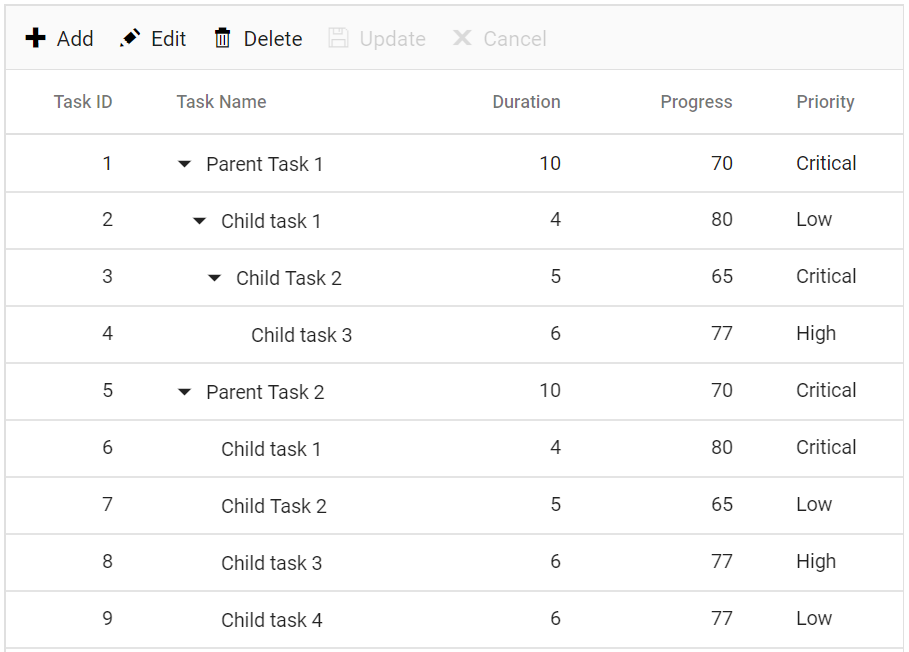
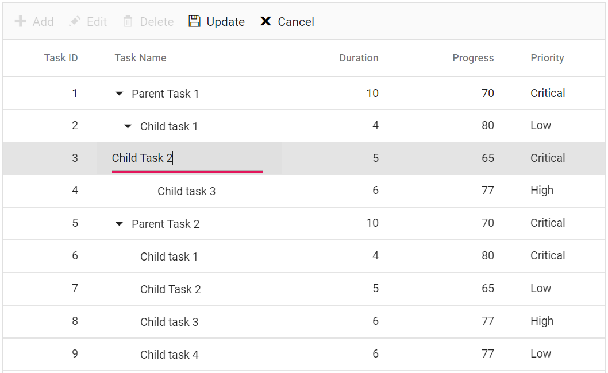
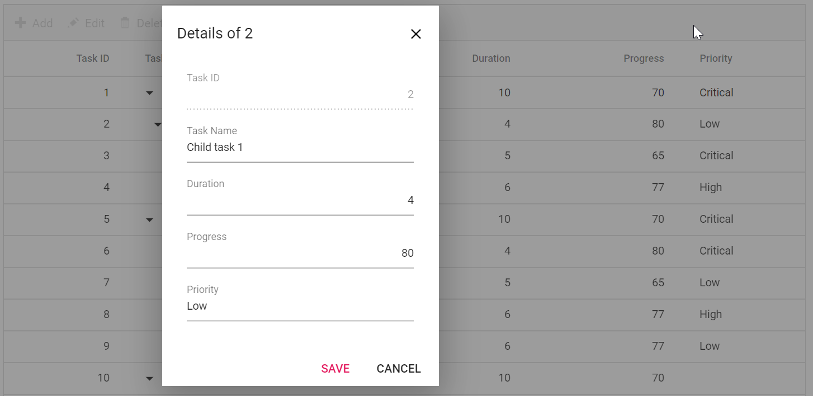
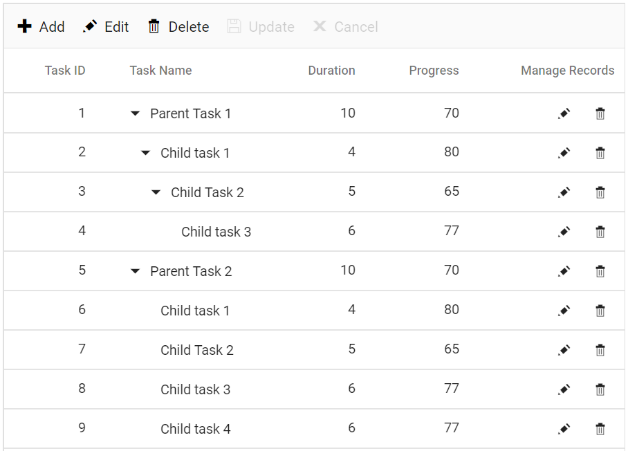
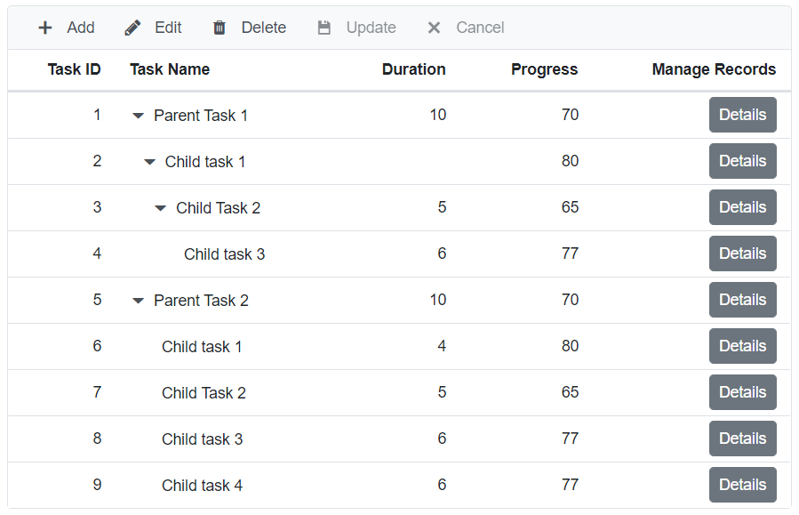
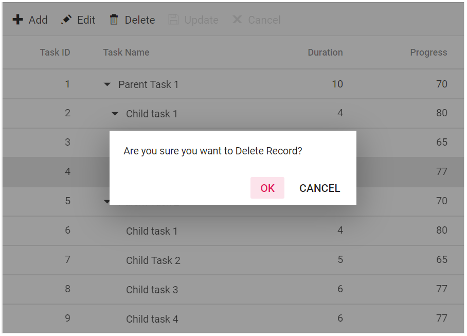

# Editing in Blazor TreeGrid Component

The Tree Grid component has options to dynamically insert, delete and update records. Editing feature is enabled by using the [TreeGridEditSettings](https://help.syncfusion.com/cr/blazor/Syncfusion.Blazor~Syncfusion.Blazor.TreeGrid.TreeGridEditSettings.html) property and it requires a primary key column for CRUD operations. To define the primary key, set the [TreeGridColumn.IsPrimaryKey](https://help.syncfusion.com/cr/blazor/Syncfusion.Blazor~Syncfusion.Blazor.TreeGrid.TreeGridColumn~IsPrimaryKey.html) to **true** in particular column.





@using TreeGridComponent.Data;
@using Syncfusion.Blazor.TreeGrid;

<SfTreeGrid DataSource="@TreeGridData" IdMapping="TaskId" ParentIdMapping="ParentId" TreeColumnIndex="1" >
    <TreeGridEditSettings AllowEditing="true"/>
    <TreeGridColumns>
        <TreeGridColumn Field="TaskId" HeaderText="Task ID" IsPrimaryKey="true" Width="80" TextAlign="Syncfusion.Blazor.Grids.TextAlign.Right"></TreeGridColumn>
        <TreeGridColumn Field="TaskName" HeaderText="Task Name" Width="160"></TreeGridColumn>
        <TreeGridColumn Field="Duration" HeaderText="Duration" Width="100" TextAlign="Syncfusion.Blazor.Grids.TextAlign.Right"></TreeGridColumn>
        <TreeGridColumn Field="Progress" HeaderText="Progress" Width="100" TextAlign="Syncfusion.Blazor.Grids.TextAlign.Right"></TreeGridColumn>
        <TreeGridColumn Field="Priority" HeaderText="Priority" Width="80"></TreeGridColumn>
    </TreeGridColumns>
</SfTreeGrid>

@code{
    public List<TreeData.BusinessObject> TreeGridData { get; set; }
    protected override void OnInitialized()
    {
        this.TreeGridData = TreeData.GetSelfDataSource().ToList();
    }
}





namespace TreeGridComponent.Data {

public class TreeData
    {
        public class BusinessObject
        {
            public int TaskId { get; set;}
            public string TaskName { get; set;}
            public int? Duration { get; set;}
            public int? Progress { get; set;}
            public string Priority { get; set;}
            public int? ParentId { get; set;}
        }

        public static List<BusinessObject> GetSelfDataSource()
        {
            List<BusinessObject> BusinessObjectCollection = new List<BusinessObject>();
            BusinessObjectCollection.Add(new BusinessObject() { TaskId = 1,TaskName = "Parent Task 1",Duration = 10,Progress = 70,Priority = "Critical",ParentId = null });
            BusinessObjectCollection.Add(new BusinessObject() { TaskId = 2,TaskName = "Child task 1",Progress = 80,Priority = "Low",ParentId = 1 });
            BusinessObjectCollection.Add(new BusinessObject() { TaskId = 3,TaskName = "Child Task 2",Duration = 5,Progress = 65,Priority = "Critical",ParentId = 2 });
            BusinessObjectCollection.Add(new BusinessObject() { TaskId = 4,TaskName = "Child task 3",Duration = 6,Priority = "High",Progress = 77,ParentId = 3 });
            BusinessObjectCollection.Add(new BusinessObject() { TaskId = 5,TaskName = "Parent Task 2",Duration = 10,Progress = 70,Priority = "Critical",ParentId = null});
            BusinessObjectCollection.Add(new BusinessObject() { TaskId = 6,TaskName = "Child task 1",Duration = 4,Progress = 80,Priority = "Critical",ParentId = 5});
            BusinessObjectCollection.Add(new BusinessObject() { TaskId = 7,TaskName = "Child Task 2",Duration = 5,Progress = 65,Priority = "Low",ParentId = 5});
            BusinessObjectCollection.Add(new BusinessObject() { TaskId = 8,TaskName = "Child task 3",Duration = 6,Progress = 77,Priority = "High",ParentId = 5});
            BusinessObjectCollection.Add(new BusinessObject() { TaskId = 9,TaskName = "Child task 4",Duration = 6,Progress = 77,Priority = "Low",ParentId = 5});
            return BusinessObjectCollection;
        }
    }
}





The editing can be disabled for a particular column, by specifying [TreeGridColumn.AllowEditing](https://help.syncfusion.com/cr/blazor/Syncfusion.Blazor~Syncfusion.Blazor.TreeGrid.TreeGridColumn~AllowEditing.html) to **false**.

> To perform the editing operation in the Blazor Tree Grid, it is recommended to mention the respective model class type (List<TreeData.BusinessObject>), in the Tree Grid's dataSource property value.

```csharp

@code{
    public List<TreeData.BusinessObject> TreeGridData { get; set; }
    protected override void OnInitialized()
    {
        this.TreeGridData = TreeData.GetSelfDataSource().ToList();
    }
}

```

## Toolbar with edit option

The tree grid toolbar has the built-in items to execute Editing actions. It can be defined by using the [Toolbar](https://help.syncfusion.com/cr/blazor/Syncfusion.Blazor~Syncfusion.Blazor.TreeGrid.SfTreeGrid%601~Toolbar.html) property.





@using TreeGridComponent.Data;
@using Syncfusion.Blazor.TreeGrid;

<SfTreeGrid DataSource="@TreeGridData" IdMapping="TaskId" ParentIdMapping="ParentId"
TreeColumnIndex="1" Toolbar="@(new List<string>() { "Add", "Edit", "Delete", "Update", "Cancel" })">
    <TreeGridEditSettings AllowEditing="true" AllowAdding="true" AllowDeleting="true"/>
    <TreeGridColumns>
        <TreeGridColumn Field="TaskId" HeaderText="Task ID" IsPrimaryKey="true" Width="80" TextAlign="Syncfusion.Blazor.Grids.TextAlign.Right"></TreeGridColumn>
        <TreeGridColumn Field="TaskName" HeaderText="Task Name" Width="160"></TreeGridColumn>
        <TreeGridColumn Field="Duration" HeaderText="Duration" Width="100" TextAlign="Syncfusion.Blazor.Grids.TextAlign.Right"></TreeGridColumn>
        <TreeGridColumn Field="Progress" HeaderText="Progress" Width="100" TextAlign="Syncfusion.Blazor.Grids.TextAlign.Right"></TreeGridColumn>
        <TreeGridColumn Field="Priority" HeaderText="Priority" Width="80"></TreeGridColumn>
    </TreeGridColumns>
</SfTreeGrid>

@code{
    public List<TreeData.BusinessObject> TreeGridData { get; set; }
    protected override void OnInitialized()
    {
        this.TreeGridData = TreeData.GetSelfDataSource().ToList();
    }
}





namespace TreeGridComponent.Data {

public class TreeData
    {
        public class BusinessObject
        {
            public int TaskId { get; set;}
            public string TaskName { get; set;}
            public int? Duration { get; set;}
            public int? Progress { get; set;}
            public string Priority { get; set;}
            public int? ParentId { get; set;}
        }

        public static List<BusinessObject> GetSelfDataSource()
        {
            List<BusinessObject> BusinessObjectCollection = new List<BusinessObject>();
            BusinessObjectCollection.Add(new BusinessObject() { TaskId = 1,TaskName = "Parent Task 1",Duration = 10,Progress = 70,Priority = "Critical",ParentId = null });
            BusinessObjectCollection.Add(new BusinessObject() { TaskId = 2,TaskName = "Child task 1",Progress = 80,Priority = "Low",ParentId = 1 });
            BusinessObjectCollection.Add(new BusinessObject() { TaskId = 3,TaskName = "Child Task 2",Duration = 5,Progress = 65,Priority = "Critical",ParentId = 2 });
            BusinessObjectCollection.Add(new BusinessObject() { TaskId = 4,TaskName = "Child task 3",Duration = 6,Priority = "High",Progress = 77,ParentId = 3 });
            BusinessObjectCollection.Add(new BusinessObject() { TaskId = 5,TaskName = "Parent Task 2",Duration = 10,Progress = 70,Priority = "Critical",ParentId = null});
            BusinessObjectCollection.Add(new BusinessObject() { TaskId = 6,TaskName = "Child task 1",Duration = 4,Progress = 80,Priority = "Critical",ParentId = 5});
            BusinessObjectCollection.Add(new BusinessObject() { TaskId = 7,TaskName = "Child Task 2",Duration = 5,Progress = 65,Priority = "Low",ParentId = 5});
            BusinessObjectCollection.Add(new BusinessObject() { TaskId = 8,TaskName = "Child task 3",Duration = 6,Progress = 77,Priority = "High",ParentId = 5});
            BusinessObjectCollection.Add(new BusinessObject() { TaskId = 9,TaskName = "Child task 4",Duration = 6,Progress = 77,Priority = "Low",ParentId = 5});
            return BusinessObjectCollection;
        }
    }
}








## Cell edit type and its params

The [TreeGridColumn.EditType](https://help.syncfusion.com/cr/blazor/Syncfusion.Blazor~Syncfusion.Blazor.TreeGrid.TreeGridColumn~EditType.html) is used to customize the edit type of the particular column. The [TreeGridColumn.EditType](https://help.syncfusion.com/cr/blazor/Syncfusion.Blazor~Syncfusion.Blazor.TreeGrid.TreeGridColumn~EditType.html) can be set based on the data type of the column.

* [NumericTextBox](../numerictextbox/getting-started) component for integers, double, and decimal data types.

* [TextBox](../textbox/getting-started) component for string data type.

* [DropDownList](../dropdownlist/getting-started) component for list data type.

* [DatePicker](../datepicker/getting-started) component for date values.

* [DateTimePicker](../datetimepicker/getting-started) component for datetime type.

* [Checkbox](../check-box/getting-started) component for boolean type.

Also, the model of the [TreeGridColumn.EditType](https://help.syncfusion.com/cr/blazor/Syncfusion.Blazor~Syncfusion.Blazor.TreeGrid.TreeGridColumn~EditType.html) component can be customized through the [TreeGridColumn.Edit.params](https://help.syncfusion.com/cr/blazor/Syncfusion.Blazor~Syncfusion.Blazor.TreeGrid.TreeGridColumn~Edit.html).

The following table describes cell edit type component and their corresponding edit params of the column.

Component |Example
-----|-----
[NumericTextBox](../numerictextbox/getting-started) | @(new { @params = new { format = "n"} })
[TextBox](../textbox/getting-started) | -
[DropDownList](../dropdownlist/getting-started) | @(new { @params = new { value = "Germany"} })
[DatePicker](../datepicker/getting-started) | @(new { @params = new { format = "yyyy-MM-dd"} })
[DateTimePicker](../datetimepicker/getting-started) | @(new { @params = new { strictMode = true} })
[Checkbox](../check-box/getting-started) | @(new { @params = new { checked = true} })





@using TreeGridComponent.Data;
@using Syncfusion.Blazor.TreeGrid;

<SfTreeGrid DataSource="@TreeGridData" IdMapping="TaskId" ParentIdMapping="ParentId" TreeColumnIndex="1" Toolbar="@(new List<string>() { "Add", "Edit", "Delete", "Update", "Cancel" })">
    <TreeGridEditSettings AllowEditing="true" AllowAdding="true" AllowDeleting="true" />
    <TreeGridColumns>
        <TreeGridColumn Field="TaskId" HeaderText="Task ID" IsPrimaryKey="true" Width="80" TextAlign="Syncfusion.Blazor.Grids.TextAlign.Right"></TreeGridColumn>
        <TreeGridColumn Field="TaskName" HeaderText="Task Name" Width="160"></TreeGridColumn>
        <TreeGridColumn Field="StartDate" HeaderText="Start Date" Width="150" Format="d" EditorSettings="DateParams" Type="Syncfusion.Blazor.Grids.ColumnType.DateTime" EditType="Syncfusion.Blazor.Grids.EditType.DateTimePickerEdit"></TreeGridColumn>
        <TreeGridColumn Field="Duration" HeaderText="Duration" Width="100" TextAlign="Syncfusion.Blazor.Grids.TextAlign.Right"></TreeGridColumn>
        <TreeGridColumn Field="Progress" HeaderText="Progress" Width="100" EditorSettings="NumericParams" EditType="Syncfusion.Blazor.Grids.EditType.NumericEdit" TextAlign="Syncfusion.Blazor.Grids.TextAlign.Right"></TreeGridColumn>
        <TreeGridColumn Field="Approved" HeaderText="Approved" Type="Syncfusion.Blazor.Grids.ColumnType.Boolean" DisplayAsCheckBox="true" EditType="Syncfusion.Blazor.Grids.EditType.BooleanEdit" Width="80"></TreeGridColumn>
    </TreeGridColumns>
</SfTreeGrid>

@code{
    public List<TreeData.BusinessObject> TreeGridData { get; set; }

    public Syncfusion.Blazor.Grids.NumericEditCellParams NumericParams = new Syncfusion.Blazor.Grids.NumericEditCellParams()
    {
        Params = new Syncfusion.Blazor.Inputs.NumericTextBoxModel<object>(){ Format = "N2"  }
    };

    public Syncfusion.Blazor.Grids.DateEditCellParams DateParams = new Syncfusion.Blazor.Grids.DateEditCellParams()
    {
        Params = new Syncfusion.Blazor.Calendars.DatePickerModel(){ Format = "d" }
    };

    protected override void OnInitialized()
    {
        this.TreeGridData = TreeData.GetSelfDataSource().ToList();
    }
}





namespace TreeGridComponent.Data {

public class TreeData
    {
        public class BusinessObject
        {
            public int TaskId { get; set;}
            public string TaskName { get; set;}
            public DateTime? StartDate { get; set;}
            public bool Approved { get; set;}
            public int? Duration { get; set;}
            public int? Progress { get; set;}
            public int? ParentId { get; set;}
        }

        public static List<BusinessObject> GetSelfDataSource()
        {
            List<BusinessObject> BusinessObjectCollection = new List<BusinessObject>();
            BusinessObjectCollection.Add(new BusinessObject() { TaskId = 1,TaskName = "Parent Task 1",StartDate = new DateTime(2017, 10, 23),Duration = 10,Progress = 70,ParentId = null });
            BusinessObjectCollection.Add(new BusinessObject() { TaskId = 2,TaskName = "Child task 1",StartDate = new DateTime(2017, 10, 23),Progress = 80,ParentId = 1 });
            BusinessObjectCollection.Add(new BusinessObject() { TaskId = 3,TaskName = "Child Task 2",StartDate = new DateTime(2017, 10, 24),Duration = 5,Progress = 65,ParentId = 2 });
            BusinessObjectCollection.Add(new BusinessObject() { TaskId = 4,TaskName = "Child task 3",StartDate = new DateTime(2017, 10, 25),Duration = 6,Progress = 77,ParentId = 3 });
            BusinessObjectCollection.Add(new BusinessObject() { TaskId = 5,TaskName = "Parent Task 2",StartDate = new DateTime(2017, 10, 23),Duration = 10,Progress = 70,ParentId = null});
            BusinessObjectCollection.Add(new BusinessObject() { TaskId = 6,TaskName = "Child task 1",StartDate = new DateTime(2017, 10, 23),Duration = 4,Progress = 80,ParentId = 5});
            BusinessObjectCollection.Add(new BusinessObject() { TaskId = 7,TaskName = "Child Task 2",StartDate = new DateTime(2017, 10, 24),Duration = 5,Progress = 65,ParentId = 5});
            BusinessObjectCollection.Add(new BusinessObject() { TaskId = 8,TaskName = "Child task 3",StartDate = new DateTime(2017, 10, 25),Duration = 6,Progress = 77,ParentId = 5});
            BusinessObjectCollection.Add(new BusinessObject() { TaskId = 9,TaskName = "Child task 4",StartDate = new DateTime(2017, 10, 25),Duration = 6,Progress = 77,ParentId = 5});
            return BusinessObjectCollection;
        }
    }
}






> If edit type is not defined in the column, then it will be considered as the **stringedit** type (Textbox component).

## Cell Edit Template

The cell edit template is used to add a custom component for a particular column when the column is edited. The following code example describes, how to define the Edit template for a particular column.





@using TreeGridComponent.Data;
@using Syncfusion.Blazor.TreeGrid;
@using Syncfusion.Blazor.Inputs;

<SfTreeGrid DataSource="@TreeGridData" IdMapping="TaskId" ParentIdMapping="ParentId" TreeColumnIndex="1" Toolbar="@(new List<string>() { "Add", "Edit", "Delete", "Update", "Cancel" })">
    <TreeGridEditSettings AllowEditing="true" AllowAdding="true" AllowDeleting="true" />
    <TreeGridColumns>
        <TreeGridColumn Field="TaskId" HeaderText="Task ID" IsPrimaryKey="true" Width="80" TextAlign="Syncfusion.Blazor.Grids.TextAlign.Right"></TreeGridColumn>
        <TreeGridColumn Field="TaskName" HeaderText="Task Name" Width="160"></TreeGridColumn>
        <TreeGridColumn Field="Duration" HeaderText="Duration" Width="100" TextAlign="Syncfusion.Blazor.Grids.TextAlign.Right"></TreeGridColumn>
        <TreeGridColumn Field="Progress" HeaderText="Progress" Width="100" TextAlign="Syncfusion.Blazor.Grids.TextAlign.Right"></TreeGridColumn>
        <TreeGridColumn Field="Priority" HeaderText="Priority" Width="80">
            <EditTemplate>
                @{
                    var task = context as TreeData;
                 }
                <SfDropDownList ID="Priority" @bind-Value="task.Priority" TItem="string" TValue="string" DataSource="@DropDownData"></SfDropDownList>
            </EditTemplate>
        </TreeGridColumn>
    </TreeGridColumns>
</SfTreeGrid>

@code{
    
    public List<TreeData> TreeGridData { get; set; }

    public List<string> DropDownData { get; set; }

    protected override void OnInitialized()
    {
        this.TreeGridData = TreeData.GetSelfDataSource().ToList();

        this.DropDownData = TreeData.GetSelfDataSource().Select(s => s.Priority).Distinct().ToList();
    }
}





namespace TreeGridComponent.Data {

public class TreeData
    {      
            public int TaskId { get; set;}
            public string TaskName { get; set;}
            public int? Duration { get; set;}
            public int? Progress { get; set;}
            public string Priority { get; set;}
            public int? ParentId { get; set;}

        public static List<TreeData> GetSelfDataSource()
        {
            List<TreeData> TreeDataCollection = new List<TreeData>();
            TreeDataCollection.Add(new TreeData() { TaskId = 1,TaskName = "Parent Task 1",Duration = 10,Progress = 70,Priority = "Critical",ParentId = null });
            TreeDataCollection.Add(new TreeData() { TaskId = 2,TaskName = "Child task 1",Progress = 80,Duration = 50,Priority = "Low",ParentId = 1 });
            TreeDataCollection.Add(new TreeData() { TaskId = 3,TaskName = "Child Task 2",Duration = 5,Progress = 65,Priority = "Critical",ParentId = 2 });
            TreeDataCollection.Add(new TreeData() { TaskId = 4,TaskName = "Child task 3",Duration = 6,Priority = "High",Progress = 77,ParentId = 3 });
            TreeDataCollection.Add(new TreeData() { TaskId = 5,TaskName = "Parent Task 2",Duration = 10,Progress = 70,Priority = "Critical",ParentId = null});
            TreeDataCollection.Add(new TreeData() { TaskId = 6,TaskName = "Child task 1",Duration = 4,Progress = 80,Priority = "Critical",ParentId = 5});
            TreeDataCollection.Add(new TreeData() { TaskId = 7,TaskName = "Child Task 2",Duration = 5,Progress = 65,Priority = "Low",ParentId = 5});
            TreeDataCollection.Add(new TreeData() { TaskId = 8,TaskName = "Child task 3",Duration = 6,Progress = 77,Priority = "High",ParentId = 5});
            TreeDataCollection.Add(new TreeData() { TaskId = 9,TaskName = "Child task 4",Duration = 6,Progress = 77,Priority = "Low",ParentId = 5});
            return TreeDataCollection;
        }
    }
}






## Edit Modes

Tree Grid supports the following types of edit modes, they are:

* Cell
* Row
* Dialog

### Cell

In Cell edit mode, when a cell is double clicked, it is changed to edit state. The cell value can be changed and saved to the data source. To enable Cell edit, set the [TreeGridEditSettings.Mode](https://help.syncfusion.com/cr/blazor/Syncfusion.Blazor~Syncfusion.Blazor.TreeGrid.TreeGridEditSettings~Mode.html) as **Cell**.





@using TreeGridComponent.Data;
@using Syncfusion.Blazor.TreeGrid;

<SfTreeGrid DataSource="@TreeGridData" IdMapping="TaskId" ParentIdMapping="ParentId" TreeColumnIndex="1" Toolbar="@(new List<string>() { "Add", "Edit", "Delete", "Update", "Cancel" })">
    <TreeGridEditSettings AllowEditing="true" AllowAdding="true" AllowDeleting="true" Mode="Syncfusion.Blazor.TreeGrid.EditMode.Cell" />
    <TreeGridColumns>
        <TreeGridColumn Field="TaskId" HeaderText="Task ID" IsPrimaryKey="true" Width="80" TextAlign="Syncfusion.Blazor.Grids.TextAlign.Right"></TreeGridColumn>
        <TreeGridColumn Field="TaskName" HeaderText="Task Name" Width="160"></TreeGridColumn>
        <TreeGridColumn Field="Duration" HeaderText="Duration" Width="100" TextAlign="Syncfusion.Blazor.Grids.TextAlign.Right"></TreeGridColumn>
        <TreeGridColumn Field="Progress" HeaderText="Progress" Width="100" TextAlign="Syncfusion.Blazor.Grids.TextAlign.Right"></TreeGridColumn>
        <TreeGridColumn Field="Priority" HeaderText="Priority" Width="80"></TreeGridColumn>
    </TreeGridColumns>
</SfTreeGrid>

@code{
    public List<TreeData.BusinessObject> TreeGridData { get; set; }
    protected override void OnInitialized()
    {
        this.TreeGridData = TreeData.GetSelfDataSource().ToList();
    }
}





namespace TreeGridComponent.Data {

public class TreeData
    {
        public class BusinessObject
        {
            public int TaskId { get; set;}
            public string TaskName { get; set;}
            public DateTime? StartDate { get; set;}
            public int? Duration { get; set;}
            public int? Progress { get; set;}
            public string Priority { get; set;}
            public int? ParentId { get; set;}
        }

        public static List<BusinessObject> GetSelfDataSource()
        {
            List<BusinessObject> BusinessObjectCollection = new List<BusinessObject>();
            BusinessObjectCollection.Add(new BusinessObject() { TaskId = 1,TaskName = "Parent Task 1",StartDate = new DateTime(2017, 10, 23),Duration = 10,Progress = 70,Priority = "Critical",ParentId = null });
            BusinessObjectCollection.Add(new BusinessObject() { TaskId = 2,TaskName = "Child task 1",StartDate = new DateTime(2017, 10, 23),Progress = 80,Priority = "Low",ParentId = 1 });
            BusinessObjectCollection.Add(new BusinessObject() { TaskId = 3,TaskName = "Child Task 2",StartDate = new DateTime(2017, 10, 24),Duration = 5,Progress = 65,Priority = "Critical",ParentId = 2 });
            BusinessObjectCollection.Add(new BusinessObject() { TaskId = 4,TaskName = "Child task 3",StartDate = new DateTime(2017, 10, 25),Duration = 6,Priority = "High",Progress = 77,ParentId = 3 });
            BusinessObjectCollection.Add(new BusinessObject() { TaskId = 5,TaskName = "Parent Task 2",StartDate = new DateTime(2017, 10, 23),Duration = 10,Progress = 70,Priority = "Critical",ParentId = null});
            BusinessObjectCollection.Add(new BusinessObject() { TaskId = 6,TaskName = "Child task 1",StartDate = new DateTime(2017, 10, 23),Duration = 4,Progress = 80,Priority = "Critical",ParentId = 5});
            BusinessObjectCollection.Add(new BusinessObject() { TaskId = 7,TaskName = "Child Task 2",StartDate = new DateTime(2017, 10, 24),Duration = 5,Progress = 65,Priority = "Low",ParentId = 5});
            BusinessObjectCollection.Add(new BusinessObject() { TaskId = 8,TaskName = "Child task 3",StartDate = new DateTime(2017, 10, 25),Duration = 6,Progress = 77,Priority = "High",ParentId = 5});
            BusinessObjectCollection.Add(new BusinessObject() { TaskId = 9,TaskName = "Child task 4",StartDate = new DateTime(2017, 10, 25),Duration = 6,Progress = 77,Priority = "Low",ParentId = 5});
            return BusinessObjectCollection;
        }
    }
}







> Cell edit mode is default mode of editing.

### Row

In Row edit mode, when the currently selected record is edited, the entire row is changed to edit state. The cell values of the row can be changed and save edited data to the data source. To enable Row edit, set the [TreeGridEditSettings.Mode](https://help.syncfusion.com/cr/blazor/Syncfusion.Blazor~Syncfusion.Blazor.TreeGrid.TreeGridEditSettings~Mode.html) as **Row**.





@using TreeGridComponent.Data;
@using Syncfusion.Blazor.TreeGrid;

<SfTreeGrid DataSource="@TreeGridData" IdMapping="TaskId" ParentIdMapping="ParentId" TreeColumnIndex="1" Toolbar="@(new List<string>() { "Add", "Edit", "Delete", "Update", "Cancel" })">
    <TreeGridEditSettings AllowEditing="true" AllowAdding="true" AllowDeleting="true" Mode="Syncfusion.Blazor.TreeGrid.EditMode.Row" />
    <TreeGridColumns>
        <TreeGridColumn Field="TaskId" HeaderText="Task ID" IsPrimaryKey="true" Width="80" TextAlign="Syncfusion.Blazor.Grids.TextAlign.Right"></TreeGridColumn>
        <TreeGridColumn Field="TaskName" HeaderText="Task Name" Width="160"></TreeGridColumn>
        <TreeGridColumn Field="Duration" HeaderText="Duration" Width="100" TextAlign="Syncfusion.Blazor.Grids.TextAlign.Right"></TreeGridColumn>
        <TreeGridColumn Field="Progress" HeaderText="Progress" Width="100" TextAlign="Syncfusion.Blazor.Grids.TextAlign.Right"></TreeGridColumn>
        <TreeGridColumn Field="Priority" HeaderText="Priority" Width="80"></TreeGridColumn>
    </TreeGridColumns>
</SfTreeGrid>

@code{
    public List<TreeData.BusinessObject> TreeGridData { get; set; }
    protected override void OnInitialized()
    {
        this.TreeGridData = TreeData.GetSelfDataSource().ToList();
    }
}





namespace TreeGridComponent.Data {

public class TreeData
    {
        public class BusinessObject
        {
            public int TaskId { get; set;}
            public string TaskName { get; set;}
            public int? Duration { get; set;}
            public int? Progress { get; set;}
            public string Priority { get; set;}
            public int? ParentId { get; set;}
        }

        public static List<BusinessObject> GetSelfDataSource()
        {
            List<BusinessObject> BusinessObjectCollection = new List<BusinessObject>();
            BusinessObjectCollection.Add(new BusinessObject() { TaskId = 1,TaskName = "Parent Task 1",Duration = 10,Progress = 70,Priority = "Critical",ParentId = null });
            BusinessObjectCollection.Add(new BusinessObject() { TaskId = 2,TaskName = "Child task 1",Progress = 80,Priority = "Low",ParentId = 1 });
            BusinessObjectCollection.Add(new BusinessObject() { TaskId = 3,TaskName = "Child Task 2",Duration = 5,Progress = 65,Priority = "Critical",ParentId = 2 });
            BusinessObjectCollection.Add(new BusinessObject() { TaskId = 4,TaskName = "Child task 3",Duration = 6,Priority = "High",Progress = 77,ParentId = 3 });
            BusinessObjectCollection.Add(new BusinessObject() { TaskId = 5,TaskName = "Parent Task 2",Duration = 10,Progress = 70,Priority = "Critical",ParentId = null});
            BusinessObjectCollection.Add(new BusinessObject() { TaskId = 6,TaskName = "Child task 1",Duration = 4,Progress = 80,Priority = "Critical",ParentId = 5});
            BusinessObjectCollection.Add(new BusinessObject() { TaskId = 7,TaskName = "Child Task 2",Duration = 5,Progress = 65,Priority = "Low",ParentId = 5});
            BusinessObjectCollection.Add(new BusinessObject() { TaskId = 8,TaskName = "Child task 3",Duration = 6,Progress = 77,Priority = "High",ParentId = 5});
            BusinessObjectCollection.Add(new BusinessObject() { TaskId = 9,TaskName = "Child task 4",Duration = 6,Progress = 77,Priority = "Low",ParentId = 5});
            return BusinessObjectCollection;
        }
    }
}






### Dialog

In Dialog edit mode, while editing the currently selected row, data will be shown on a dialog. The cell values and save edited data can be changed to the data source. To enable Dialog edit, set the [TreeGridEditSettings.Mode](https://help.syncfusion.com/cr/blazor/Syncfusion.Blazor~Syncfusion.Blazor.TreeGrid.TreeGridEditSettings~Mode.html) as **Dialog**.





@using TreeGridComponent.Data;
@using Syncfusion.Blazor.TreeGrid;

<SfTreeGrid DataSource="@TreeGridData" IdMapping="TaskId" ParentIdMapping="ParentId" TreeColumnIndex="1" Toolbar="@(new List<string>() { "Add", "Edit", "Delete", "Update", "Cancel" })">
    <TreeGridEditSettings AllowEditing="true" AllowAdding="true" AllowDeleting="true" Mode="Syncfusion.Blazor.TreeGrid.EditMode.Dialog" />
    <TreeGridColumns>
        <TreeGridColumn Field="TaskId" HeaderText="Task ID" IsPrimaryKey="true" Width="80" TextAlign="Syncfusion.Blazor.Grids.TextAlign.Right"></TreeGridColumn>
        <TreeGridColumn Field="TaskName" HeaderText="Task Name" Width="160"></TreeGridColumn>
        <TreeGridColumn Field="Duration" HeaderText="Duration" Width="100" TextAlign="Syncfusion.Blazor.Grids.TextAlign.Right"></TreeGridColumn>
        <TreeGridColumn Field="Progress" HeaderText="Progress" Width="100" TextAlign="Syncfusion.Blazor.Grids.TextAlign.Right"></TreeGridColumn>
        <TreeGridColumn Field="Priority" HeaderText="Priority" Width="80"></TreeGridColumn>
    </TreeGridColumns>
</SfTreeGrid>

@code{
    public List<TreeData.BusinessObject> TreeGridData { get; set; }
    protected override void OnInitialized()
    {
        this.TreeGridData = TreeData.GetSelfDataSource().ToList();
    }
}





namespace TreeGridComponent.Data {

public class TreeData
    {
        public class BusinessObject
        {
            public int TaskId { get; set;}
            public string TaskName { get; set;}
            public int? Duration { get; set;}
            public int? Progress { get; set;}
            public string Priority { get; set;}
            public int? ParentId { get; set;}
        }

        public static List<BusinessObject> GetSelfDataSource()
        {
            List<BusinessObject> BusinessObjectCollection = new List<BusinessObject>();
            BusinessObjectCollection.Add(new BusinessObject() { TaskId = 1,TaskName = "Parent Task 1",Duration = 10,Progress = 70,StartDate = new DateTime(2017, 10, 23),Priority = "Critical",ParentId = null});
            BusinessObjectCollection.Add(new BusinessObject() { TaskId = 2,TaskName = "Child task 1",Progress = 80,Priority = "Low",StartDate = new DateTime(2017, 10, 23),ParentId = 1 });
            BusinessObjectCollection.Add(new BusinessObject() { TaskId = 3,TaskName = "Child Task 2",Duration = 5,Progress = 65,StartDate = new DateTime(2017, 10, 23),Priority = "Critical",ParentId = 2 });
            BusinessObjectCollection.Add(new BusinessObject() { TaskId = 4,TaskName = "Child task 3",Duration = 6,Priority = "High",StartDate = new DateTime(2017, 10, 23),Progress = 77,ParentId = 3 });
            BusinessObjectCollection.Add(new BusinessObject() { TaskId = 5,TaskName = "Parent Task 2",Duration = 10,Progress = 70,StartDate = new DateTime(2017, 10, 23),Priority = "Critical",ParentId = null});
            BusinessObjectCollection.Add(new BusinessObject() { TaskId = 6,TaskName = "Child task 1",Duration = 4,Progress = 80,StartDate = new DateTime(2017, 10, 23),Priority = "Critical",ParentId = 5});
            BusinessObjectCollection.Add(new BusinessObject() { TaskId = 7,TaskName = "Child Task 2",Duration = 5,Progress = 65,StartDate = new DateTime(2017, 10, 23),Priority = "Low",ParentId = 5});
            BusinessObjectCollection.Add(new BusinessObject() { TaskId = 8,TaskName = "Child task 3",Duration = 6,Progress = 77,StartDate = new DateTime(2017, 10, 23),Priority = "High",ParentId = 5});
            BusinessObjectCollection.Add(new BusinessObject() { TaskId = 9,TaskName = "Child task 4",Duration = 6,Progress = 77,StartDate = new DateTime(2017, 10, 23),Priority = "Low",ParentId = 5});
            return BusinessObjectCollection;
        }
    }
}







### Batch

In the Batch edit mode, when the tree grid cell is double-clicked, the target cell goes into edit state. It can be bulk saved (added, changed and deleted data in the single request) to the data source by clicking on the toolbar's **Update** button or by externally invoking the [EndEdit](https://help.syncfusion.com/cr/blazor/Syncfusion.Blazor.TreeGrid.SfTreeGrid-1.html#Syncfusion_Blazor_TreeGrid_SfTreeGrid_1_EndEdit) method.
To enable Batch edit, set the [Mode](https://help.syncfusion.com/cr/blazor/Syncfusion.Blazor~Syncfusion.Blazor.TreeGrid.TreeGridEditSettings~Mode.html) property of the `TreeGridEditSettings` as **Batch**.





@using TreeGridComponent.Data;
@using Syncfusion.Blazor.TreeGrid;

<SfTreeGrid DataSource="TreeData" IdMapping="TaskId" ParentIdMapping="ParentId" TreeColumnIndex="1" AllowPaging="true" Toolbar="@(new List<string>() { "Add", "Delete", "Update", "Cancel" })">
    <TreeGridPageSettings PageSize="2"></TreeGridPageSettings>
    <TreeGridEditSettings AllowAdding="true" AllowEditing="true" AllowDeleting="true" Mode="EditMode.Batch" NewRowPosition="RowPosition.Below"></TreeGridEditSettings>
    <TreeGridColumns>
        <TreeGridColumn Field="TaskId" HeaderText="Task ID" Width="60" IsPrimaryKey="true" TextAlign="Syncfusion.Blazor.Grids.TextAlign.Right"></TreeGridColumn>
        <TreeGridColumn Field="TaskName" HeaderText="Task Name" Width="155"></TreeGridColumn>
        <TreeGridColumn Field="StartDate" HeaderText="Start Date" Format="d" Type=Syncfusion.Blazor.Grids.ColumnType.Date Width="85" TextAlign="Syncfusion.Blazor.Grids.TextAlign.Right" EditType=Syncfusion.Blazor.Grids.EditType.DatePickerEdit></TreeGridColumn>
        <TreeGridColumn Field="Duration" HeaderText="Duration" Width="70" TextAlign="Syncfusion.Blazor.Grids.TextAlign.Right"></TreeGridColumn>
        <TreeGridColumn Field="Progress" HeaderText="Progress" Width="70" TextAlign="Syncfusion.Blazor.Grids.TextAlign.Right"></TreeGridColumn>
        <TreeGridColumn Field="Priority" HeaderText="Priority" Width="70" TextAlign="Syncfusion.Blazor.Grids.TextAlign.Right"></TreeGridColumn>
    </TreeGridColumns>
</SfTreeGrid>

@code{
    public List<BusinessObject> TreeData { get; set; }
    protected override void OnInitialized()
    {
        this.TreeData = BusinessObject.GetSelfDataSource().ToList();
    }
}





namespace TreeGridComponent.Data {
        public class BusinessObject
        {
            public int TaskId { get; set;}
            public string TaskName { get; set;}
            public DateTime? StartDate { get; set;}
            public int? Duration { get; set;}
            public int? Progress { get; set;}
            public string Priority { get; set;}
            public int? ParentId { get; set;}

        public static List<BusinessObject> GetSelfDataSource()
        {
            List<BusinessObject> BusinessObjectCollection = new List<BusinessObject>();
            BusinessObjectCollection.Add(new BusinessObject() { TaskId = 1,TaskName = "Parent Task 1",StartDate = new DateTime(2017, 10, 23),Duration = 10,Progress = 70,Priority = "Critical",ParentId = null });
            BusinessObjectCollection.Add(new BusinessObject() { TaskId = 2,TaskName = "Child task 1",StartDate = new DateTime(2017, 10, 23),Duration = 5,Progress = 80,Priority = "Low",ParentId = 1 });
            BusinessObjectCollection.Add(new BusinessObject() { TaskId = 3,TaskName = "Child Task 2",StartDate = new DateTime(2017, 10, 24),Duration = 5,Progress = 65,Priority = "Critical",ParentId = 2 });
            BusinessObjectCollection.Add(new BusinessObject() { TaskId = 4,TaskName = "Child task 3",StartDate = new DateTime(2017, 10, 25),Duration = 6,Priority = "High",Progress = 77,ParentId = 3 });
            BusinessObjectCollection.Add(new BusinessObject() { TaskId = 5, TaskName = "Child Task 5",StartDate = new DateTime(2017, 10, 26), Duration = 9, Progress = 25, ParentId = 4, Priority = "Normal" });
            BusinessObjectCollection.Add(new BusinessObject() { TaskId = 6, TaskName = "Child Task 6",StartDate = new DateTime(2017, 10, 27), Duration = 9, Progress = 7, ParentId = 5, Priority = "Normal" });
            BusinessObjectCollection.Add(new BusinessObject() { TaskId = 7, TaskName = "Parent Task 3",StartDate = new DateTime(2017, 10, 28), Duration = 4, Progress = 45, ParentId = null, Priority = "High" });
            BusinessObjectCollection.Add(new BusinessObject() { TaskId = 8, TaskName = "Child Task 7",StartDate = new DateTime(2017, 10, 29), Duration = 3, Progress = 38, ParentId = 7, Priority = "Critical" });
            BusinessObjectCollection.Add(new BusinessObject() { TaskId = 9, TaskName = "Child Task 8",StartDate = new DateTime(2017, 10, 30), Duration = 7, Progress = 70, ParentId = 7, Priority = "Low" });
            return BusinessObjectCollection;
        }
    }

}





## Dialog template

The dialog template editing provides an option to customize the default behavior of dialog editing. Using the dialog template, render your own editors by defining the [TreeGridEditSettings.Mode](https://help.syncfusion.com/cr/blazor/Syncfusion.Blazor~Syncfusion.Blazor.TreeGrid.TreeGridEditSettings~Mode.html) as **Dialog** and [Template](https://help.syncfusion.com/cr/blazor/Syncfusion.Blazor~Syncfusion.Blazor.TreeGrid.TreeGridEditSettings~Template.html) using the **Template** of the **TreeGridEditSettings**.

In some cases, the new field editors must be added in the dialog which are not present in the column model. In that situation, the dialog template will help to customize the default edit dialog.






@using TreeGridComponent.Data;
@using Syncfusion.Blazor.TreeGrid;
@using Syncfusion.Blazor.DropDowns;


<SfTreeGrid DataSource="@TreeGridData" AllowPaging="true" IdMapping="TaskId" ParentIdMapping="ParentId" TreeColumnIndex="1" Toolbar="@(new List<string>() { "Add", "Edit", "Delete", "Update", "Cancel" })">
    <TreeGridEvents TValue="TreeData" OnActionComplete="OnComplete"></TreeGridEvents>
    <TreeGridEditSettings AllowEditing="true" AllowAdding="true" AllowDeleting="true" Mode="Syncfusion.Blazor.TreeGrid.EditMode.Dialog" NewRowPosition="RowPosition.Child">
        <Template>
            @{
               var employee = (context as TreeData);
             }
            <div>
                <div class="form-row">
                    <div class="form-group col-md-6">
                        <SfNumericTextBox ID="TaskId" @bind-Value="@(employee.TaskId)" Enabled="@Check" FloatLabelType="FloatLabelType.Always" Placeholder="Task ID"></SfNumericTextBox>
                    </div>
                    <div class="form-group col-md-6">
                        <SfAutoComplete TItem="TreeData" ID="TaskName" @bind-Value="@(employee.TaskName)" TValue="string" DataSource="@TreeGridData" FloatLabelType="FloatLabelType.Always" Placeholder="Task Name">
                            <AutoCompleteFieldSettings Value="TaskName"></AutoCompleteFieldSettings>
                        </SfAutoComplete>
                    </div>
                </div>
                <div class="form-row">
                    <div class="form-group col-md-6">
                        <SfNumericTextBox ID="Duration" @bind-Value="@(employee.Duration)" TValue="int?" FloatLabelType="FloatLabelType.Always" Placeholder="Duration"></SfNumericTextBox>
                    </div>
                    <div class="form-group col-md-6">
                        <SfNumericTextBox ID="Progress" @bind-Value="@(employee.Progress)" TValue="int?" FloatLabelType="FloatLabelType.Always" Placeholder="Progress"></SfNumericTextBox>
                    </div>
                </div>
                <div class="form-row">
                    <div class="form-group col-md-6">
                        <SfDropDownList ID="Priority" TItem="TreeData" @bind-Value="@(employee.Priority)" TValue="string" DataSource="@TreeGridData" FloatLabelType="FloatLabelType.Always" Placeholder="Priority">
                            <DropDownListFieldSettings Value="Priority" Text="Priority"></DropDownListFieldSettings>
                        </SfDropDownList>
                    </div>                    
                </div>                
            </div>
        </Template>
    </TreeGridEditSettings>
    <TreeGridColumns>
        <TreeGridColumn Field="TaskId" HeaderText="Task ID" IsPrimaryKey="true" Width="80" TextAlign="Syncfusion.Blazor.Grids.TextAlign.Right"></TreeGridColumn>
        <TreeGridColumn Field="TaskName" HeaderText="Task Name" Width="160"></TreeGridColumn>
        <TreeGridColumn Field="Duration" HeaderText="Duration" Width="100" TextAlign="Syncfusion.Blazor.Grids.TextAlign.Right"></TreeGridColumn>
        <TreeGridColumn Field="Progress" HeaderText="Progress" Width="100" TextAlign="Syncfusion.Blazor.Grids.TextAlign.Right"></TreeGridColumn>
        <TreeGridColumn Field="Priority" HeaderText="Priority" Width="80"></TreeGridColumn>
    </TreeGridColumns>
</SfTreeGrid>


@code{

    private Boolean Check = false;

    public List<TreeData> TreeGridData { get; set; }

    protected override void OnInitialized()
    {
        this.TreeGridData = TreeData.GetSelfDataSource().ToList();
    }

    private void OnComplete(ActionEventArgs<TreeData> args)
    {
        if (args.RequestType.ToString() == "Add")
        {
            Check = true;
        }
        else
        {
            Check = false;
        }
    }

}





namespace TreeGridComponent.Data {

public class TreeData
    {
            public int TaskId { get; set;}
            public string TaskName { get; set;}
            public int? Duration { get; set;}
            public int? Progress { get; set;}
            public string Priority { get; set;}
            public int? ParentId { get; set;}
       
        public static List<TreeData> GetSelfDataSource()
        {
            List<TreeData> TreeDataCollection = new List<TreeData>();
            TreeDataCollection.Add(new TreeData() { TaskId = 1,TaskName = "Parent Task 1",Duration = 10,Progress = 70,Priority = "Critical",ParentId = null});
            TreeDataCollection.Add(new TreeData() { TaskId = 2,TaskName = "Child task 1",Progress = 80,Priority = "Low",Duration = 50,ParentId = 1 });
            TreeDataCollection.Add(new TreeData() { TaskId = 3,TaskName = "Child Task 2",Duration = 5,Progress = 65,Priority = "Critical",ParentId = 2 });
            TreeDataCollection.Add(new TreeData() { TaskId = 4,TaskName = "Child task 3",Duration = 6,Priority = "High",Progress = 77,ParentId = 3 });
            TreeDataCollection.Add(new TreeData() { TaskId = 5,TaskName = "Parent Task 2",Duration = 10,Progress = 70,Priority = "Critical",ParentId = null});
            TreeDataCollection.Add(new TreeData() { TaskId = 6,TaskName = "Child task 1",Duration = 4,Progress = 80,Priority = "Critical",ParentId = 5});
            TreeDataCollection.Add(new TreeData() { TaskId = 7,TaskName = "Child Task 2",Duration = 5,Progress = 65,Priority = "Low",ParentId = 5});
            TreeDataCollection.Add(new TreeData() { TaskId = 8,TaskName = "Child task 3",Duration = 6,Progress = 77,Priority = "High",ParentId = 5});
            TreeDataCollection.Add(new TreeData() { TaskId = 9,TaskName = "Child task 4",Duration = 6,Progress = 77,Priority = "Low",ParentId = 5});
            return TreeDataCollection;
        }
    }
}






> The template form editors should have **name** attribute.

## Adding row position

The Tree Grid control provides the support to add the new row in the top, bottom, above selected row, below selected row and child position of tree grid content using the [TreeGridEditSettings.NewRowPosition](https://help.syncfusion.com/cr/blazor/Syncfusion.Blazor~Syncfusion.Blazor.TreeGrid.TreeGridEditSettings~NewRowPosition.html) property. By default, a new row will be added at the top of the tree grid.





@using TreeGridComponent.Data;
@using Syncfusion.Blazor.TreeGrid;

<SfTreeGrid DataSource="@TreeGridData" IdMapping="TaskId" ParentIdMapping="ParentId" TreeColumnIndex="1" Toolbar="@(new List<string>() { "Add", "Edit", "Delete", "Update", "Cancel" })">
    <TreeGridEditSettings AllowEditing="true" AllowAdding="true" AllowDeleting="true" NewRowPosition="RowPosition.Child" />
    <TreeGridColumns>
        <TreeGridColumn Field="TaskId" HeaderText="Task ID" IsPrimaryKey="true" Width="80" TextAlign="Syncfusion.Blazor.Grids.TextAlign.Right"></TreeGridColumn>
        <TreeGridColumn Field="TaskName" HeaderText="Task Name" Width="160"></TreeGridColumn>
        <TreeGridColumn Field="Duration" HeaderText="Duration" Width="100" TextAlign="Syncfusion.Blazor.Grids.TextAlign.Right"></TreeGridColumn>
        <TreeGridColumn Field="Progress" HeaderText="Progress" Width="100" TextAlign="Syncfusion.Blazor.Grids.TextAlign.Right"></TreeGridColumn>
        <TreeGridColumn Field="Priority" HeaderText="Priority" Width="80"></TreeGridColumn>
    </TreeGridColumns>
</SfTreeGrid>

@code{
    public List<TreeData.BusinessObject> TreeGridData { get; set; }
    protected override void OnInitialized()
    {
        this.TreeGridData = TreeData.GetSelfDataSource().ToList();
    }
}





namespace TreeGridComponent.Data {

public class TreeData
    {
        public class BusinessObject
        {
            public int TaskId { get; set;}
            public string TaskName { get; set;}
            public int? Duration { get; set;}
            public int? Progress { get; set;}
            public string Priority { get; set;}
            public int? ParentId { get; set;}
        }

        public static List<BusinessObject> GetSelfDataSource()
        {
            List<BusinessObject> BusinessObjectCollection = new List<BusinessObject>();
            BusinessObjectCollection.Add(new BusinessObject() { TaskId = 1,TaskName = "Parent Task 1",Duration = 10,Progress = 70,Priority = "Critical",ParentId = null });
            BusinessObjectCollection.Add(new BusinessObject() { TaskId = 2,TaskName = "Child task 1",Progress = 80,Priority = "Low",ParentId = 1 });
            BusinessObjectCollection.Add(new BusinessObject() { TaskId = 3,TaskName = "Child Task 2",Duration = 5,Progress = 65,Priority = "Critical",ParentId = 2 });
            BusinessObjectCollection.Add(new BusinessObject() { TaskId = 4,TaskName = "Child task 3",Duration = 6,Priority = "High",Progress = 77,ParentId = 3 });
            BusinessObjectCollection.Add(new BusinessObject() { TaskId = 5,TaskName = "Parent Task 2",Duration = 10,Progress = 70,Priority = "Critical",ParentId = null});
            BusinessObjectCollection.Add(new BusinessObject() { TaskId = 6,TaskName = "Child task 1",Duration = 4,Progress = 80,Priority = "Critical",ParentId = 5});
            BusinessObjectCollection.Add(new BusinessObject() { TaskId = 7,TaskName = "Child Task 2",Duration = 5,Progress = 65,Priority = "Low",ParentId = 5});
            BusinessObjectCollection.Add(new BusinessObject() { TaskId = 8,TaskName = "Child task 3",Duration = 6,Progress = 77,Priority = "High",ParentId = 5});
            BusinessObjectCollection.Add(new BusinessObject() { TaskId = 9,TaskName = "Child task 4",Duration = 6,Progress = 77,Priority = "Low",ParentId = 5});
            return BusinessObjectCollection;
        }
    }
}





The following examples shows how to set new row position as **Child** in tree grid.

## Command column

The command column provides an option to add CRUD action buttons in a column. This can be defined by the [TreeGridColumn.Commands](https://help.syncfusion.com/cr/blazor/Syncfusion.Blazor~Syncfusion.Blazor.TreeGrid.TreeGridColumn~Commands.html) property.

The available built-in command buttons are:

| Command Button | Actions |
|----------------|---------|
| Edit | Edit the current row.|
| Delete | Delete the current row.|
| Save | Update the edited row.|
| Cancel | Cancel the edited state. |





@using TreeGridComponent.Data;
@using Syncfusion.Blazor.TreeGrid;
@using Syncfusion.Blazor.Grids;

<SfTreeGrid DataSource="@TreeGridData" IdMapping="TaskId" ParentIdMapping="ParentId" TreeColumnIndex="1" Toolbar="@(new List<string>() { "Add", "Edit", "Delete", "Update", "Cancel" })">
    <TreeGridEditSettings AllowEditing="true" AllowAdding="true" AllowDeleting="true" Mode="Syncfusion.Blazor.TreeGrid.EditMode.Row" />
    <TreeGridColumns>
        <TreeGridColumn Field="TaskId" HeaderText="Task ID" IsPrimaryKey="true" Width="80" TextAlign="Syncfusion.Blazor.Grids.TextAlign.Right"></TreeGridColumn>
        <TreeGridColumn Field="TaskName" HeaderText="Task Name" Width="160"></TreeGridColumn>
        <TreeGridColumn Field="Duration" HeaderText="Duration" Width="100" TextAlign="Syncfusion.Blazor.Grids.TextAlign.Right"></TreeGridColumn>
        <TreeGridColumn Field="Progress" HeaderText="Progress" Width="100" TextAlign="Syncfusion.Blazor.Grids.TextAlign.Right"></TreeGridColumn>
        <TreeGridColumn HeaderText="Manage Records" Width="150">
            <TreeGridCommandColumns>
                <TreeGridCommandColumn Type="CommandButtonType.Edit" ButtonOption="@(new CommandButtonOptions() {IconCss="e-icons e-edit", CssClass="e-flat" })"></TreeGridCommandColumn>
                <TreeGridCommandColumn Type="CommandButtonType.Delete" ButtonOption="@(new CommandButtonOptions() {IconCss="e-icons e-delete", CssClass="e-flat" })"></TreeGridCommandColumn>
                <TreeGridCommandColumn Type="CommandButtonType.Save" ButtonOption="@(new CommandButtonOptions() {IconCss="e-icons e-save", CssClass="e-flat" })"></TreeGridCommandColumn>
                <TreeGridCommandColumn Type="CommandButtonType.Cancel" ButtonOption="@(new CommandButtonOptions() {IconCss="e-icons e-cancel-icon", CssClass="e-flat" })"></TreeGridCommandColumn>
            </TreeGridCommandColumns>
        </TreeGridColumn>
    </TreeGridColumns>
</SfTreeGrid>

@code{
    public List<TreeData.BusinessObject> TreeGridData { get; set; }
    protected override void OnInitialized()
    {
        this.TreeGridData = TreeData.GetSelfDataSource().ToList();
    }
}





namespace TreeGridComponent.Data {

public class TreeData
    {
        public class BusinessObject
        {
            public int TaskId { get; set;}
            public string TaskName { get; set;}
            public int? Duration { get; set;}
            public int? Progress { get; set;}
            public int? ParentId { get; set;}
        }

        public static List<BusinessObject> GetSelfDataSource()
        {
            List<BusinessObject> BusinessObjectCollection = new List<BusinessObject>();
            BusinessObjectCollection.Add(new BusinessObject() { TaskId = 1,TaskName = "Parent Task 1",Duration = 10,Progress = 70,ParentId = null });
            BusinessObjectCollection.Add(new BusinessObject() { TaskId = 2,TaskName = "Child task 1",Progress = 80,ParentId = 1 });
            BusinessObjectCollection.Add(new BusinessObject() { TaskId = 3,TaskName = "Child Task 2",Duration = 5,Progress = 65,ParentId = 2 });
            BusinessObjectCollection.Add(new BusinessObject() { TaskId = 4,TaskName = "Child task 3",Duration = 6,Progress = 77,ParentId = 3 });
            BusinessObjectCollection.Add(new BusinessObject() { TaskId = 5,TaskName = "Parent Task 2",Duration = 10,Progress = 70,ParentId = null});
            BusinessObjectCollection.Add(new BusinessObject() { TaskId = 6,TaskName = "Child task 1",Duration = 4,Progress = 80,ParentId = 5});
            BusinessObjectCollection.Add(new BusinessObject() { TaskId = 7,TaskName = "Child Task 2",Duration = 5,Progress = 65,ParentId = 5});
            BusinessObjectCollection.Add(new BusinessObject() { TaskId = 8,TaskName = "Child task 3",Duration = 6,Progress = 77,ParentId = 5});
            BusinessObjectCollection.Add(new BusinessObject() { TaskId = 9,TaskName = "Child task 4",Duration = 6,Progress = 77,ParentId = 5});
            return BusinessObjectCollection;
        }
    }
}







### Custom command

The custom command buttons can be added in a column by using the [Commands](https://help.syncfusion.com/cr/blazor/Syncfusion.Blazor~Syncfusion.Blazor.TreeGrid.TreeGridColumn~Commands.html) property of the [TreeGridColumn](https://help.syncfusion.com/cr/aspnetcore-blazor/Syncfusion.Blazor~Syncfusion.Blazor.TreeGrid.TreeGridColumn.html) component and the action for the custom buttons can be defined in the [CommandClicked](https://help.syncfusion.com/cr/aspnetcore-blazor/Syncfusion.Blazor~Syncfusion.Blazor.Grids.GridEvents%601~CommandClicked.html) event.

The following sample code demonstrates adding custom command in the **Manage Records** column and the `CommandClicked` event which triggers when the command is clicked,

```cshtml
@using Syncfusion.Blazor.TreeGrid;
@using Syncfusion.Blazor.Grids;

<SfTreeGrid DataSource="@TreeGridData" IdMapping="TaskId" ParentIdMapping="ParentId" TreeColumnIndex="1" Toolbar="@(new List<string>() { "Add", "Edit", "Delete", "Update", "Cancel" })">
    <TreeGridEvents CommandClicked="OnCommandClicked" TValue="TreeData.BusinessObject"></TreeGridEvents>
    <TreeGridEditSettings AllowEditing="true" AllowAdding="true" AllowDeleting="true" Mode="Syncfusion.Blazor.TreeGrid.EditMode.Row" />
    <TreeGridColumns>
        <TreeGridColumn Field="TaskId" HeaderText="Task ID" IsPrimaryKey="true" Width="80" TextAlign="Syncfusion.Blazor.Grids.TextAlign.Right"></TreeGridColumn>
        <TreeGridColumn Field="TaskName" HeaderText="Task Name" Width="160"></TreeGridColumn>
        <TreeGridColumn Field="Duration" HeaderText="Duration" Width="100" TextAlign="Syncfusion.Blazor.Grids.TextAlign.Right"></TreeGridColumn>
        <TreeGridColumn Field="Progress" HeaderText="Progress" Width="100" TextAlign="Syncfusion.Blazor.Grids.TextAlign.Right"></TreeGridColumn>
        <TreeGridColumn HeaderText="Manage Records" Width="150">
            <TreeGridCommandColumns>
                <TreeGridCommandColumn ButtonOption="@(new CommandButtonOptions() { Content = "Details", CssClass = "e-flat" })"></TreeGridCommandColumn>
            </TreeGridCommandColumns>
        </TreeGridColumn>
    </TreeGridColumns>
</SfTreeGrid>

@code{
    public class TreeData
    {
        public class BusinessObject
        {
            public int TaskId { get; set; }
            public string TaskName { get; set; }
            public int? Duration { get; set; }
            public int? Progress { get; set; }
            public int? ParentId { get; set; }
        }

        public static List<BusinessObject> GetSelfDataSource()
        {
            List<BusinessObject> BusinessObjectCollection = new List<BusinessObject>();
            BusinessObjectCollection.Add(new BusinessObject() { TaskId = 1, TaskName = "Parent Task 1", Duration = 10, Progress = 70, ParentId = null });
            BusinessObjectCollection.Add(new BusinessObject() { TaskId = 2, TaskName = "Child task 1", Progress = 80, ParentId = 1 });
            BusinessObjectCollection.Add(new BusinessObject() { TaskId = 3, TaskName = "Child Task 2", Duration = 5, Progress = 65, ParentId = 2 });
            BusinessObjectCollection.Add(new BusinessObject() { TaskId = 4, TaskName = "Child task 3", Duration = 6, Progress = 77, ParentId = 3 });
            BusinessObjectCollection.Add(new BusinessObject() { TaskId = 5, TaskName = "Parent Task 2", Duration = 10, Progress = 70, ParentId = null });
            BusinessObjectCollection.Add(new BusinessObject() { TaskId = 6, TaskName = "Child task 1", Duration = 4, Progress = 80, ParentId = 5 });
            BusinessObjectCollection.Add(new BusinessObject() { TaskId = 7, TaskName = "Child Task 2", Duration = 5, Progress = 65, ParentId = 5 });
            BusinessObjectCollection.Add(new BusinessObject() { TaskId = 8, TaskName = "Child task 3", Duration = 6, Progress = 77, ParentId = 5 });
            BusinessObjectCollection.Add(new BusinessObject() { TaskId = 9, TaskName = "Child task 4", Duration = 6, Progress = 77, ParentId = 5 });
            return BusinessObjectCollection;
        }
    }

    public List<TreeData.BusinessObject> TreeGridData { get; set; }
    protected override void OnInitialized()
    {
        this.TreeGridData = TreeData.GetSelfDataSource().ToList();
    }
    public void OnCommandClicked(CommandClickEventArgs<TreeData.BusinessObject> args)
    {
        // Perform required operations here
    }
}
```

The following image represents the custom command added in the **Manage Records** column of the Tree Grid component,


## Confirmation messages

### Delete confirmation

The delete confirm dialog can be shown when deleting a record by defining the [ShowDeleteConfirmDialog](https://help.syncfusion.com/cr/blazor/Syncfusion.Blazor~Syncfusion.Blazor.TreeGrid.TreeGridEditSettings~ShowDeleteConfirmDialog.html) as **true**





@using TreeGridComponent.Data;
@using Syncfusion.Blazor.TreeGrid;

<SfTreeGrid DataSource="@TreeGridData" IdMapping="TaskId" ParentIdMapping="ParentId" TreeColumnIndex="1" Toolbar="@(new List<string>() { "Add", "Edit", "Delete", "Update", "Cancel" })">
    <TreeGridEditSettings AllowEditing="true" AllowAdding="true" AllowDeleting="true" ShowDeleteConfirmDialog="true"/>
    <TreeGridColumns>
        <TreeGridColumn Field="TaskId" HeaderText="Task ID" IsPrimaryKey="true" Width="80" TextAlign="Syncfusion.Blazor.Grids.TextAlign.Right"></TreeGridColumn>
        <TreeGridColumn Field="TaskName" HeaderText="Task Name" Width="160"></TreeGridColumn>
        <TreeGridColumn Field="Duration" HeaderText="Duration" Width="100" TextAlign="Syncfusion.Blazor.Grids.TextAlign.Right"></TreeGridColumn>
        <TreeGridColumn Field="Progress" HeaderText="Progress" Width="100" TextAlign="Syncfusion.Blazor.Grids.TextAlign.Right"></TreeGridColumn>
    </TreeGridColumns>
</SfTreeGrid>

@code{
    public List<TreeData.BusinessObject> TreeGridData { get; set; }
    protected override void OnInitialized()
    {
        this.TreeGridData = TreeData.GetSelfDataSource().ToList();
    }
}





namespace TreeGridComponent.Data {

public class TreeData
    {
        public class BusinessObject
        {
            public int TaskId { get; set;}
            public string TaskName { get; set;}
            public int? Duration { get; set;}
            public int? Progress { get; set;}
            public int? ParentId { get; set;}
        }

        public static List<BusinessObject> GetSelfDataSource()
        {
            List<BusinessObject> BusinessObjectCollection = new List<BusinessObject>();
            BusinessObjectCollection.Add(new BusinessObject() { TaskId = 1,TaskName = "Parent Task 1",Duration = 10,Progress = 70,ParentId = null});
            BusinessObjectCollection.Add(new BusinessObject() { TaskId = 2,TaskName = "Child task 1",Progress = 80,ParentId = 1 });
            BusinessObjectCollection.Add(new BusinessObject() { TaskId = 3,TaskName = "Child Task 2",Duration = 5,Progress = 65,ParentId = 2 });
            BusinessObjectCollection.Add(new BusinessObject() { TaskId = 4,TaskName = "Child task 3",Duration = 6,Progress = 77,ParentId = 3 });
            BusinessObjectCollection.Add(new BusinessObject() { TaskId = 5,TaskName = "Parent Task 2",Duration = 10,Progress = 70,ParentId = null});
            BusinessObjectCollection.Add(new BusinessObject() { TaskId = 6,TaskName = "Child task 1",Duration = 4,Progress = 80,ParentId = 5});
            BusinessObjectCollection.Add(new BusinessObject() { TaskId = 7,TaskName = "Child Task 2",Duration = 5,Progress = 65,ParentId = 5});
            BusinessObjectCollection.Add(new BusinessObject() { TaskId = 8,TaskName = "Child task 3",Duration = 6,Progress = 77,ParentId = 5});
            BusinessObjectCollection.Add(new BusinessObject() { TaskId = 9,TaskName = "Child task 4",Duration = 6,Progress = 77,ParentId = 5});
            return BusinessObjectCollection;
        }
    }
}







> The **ShowDeleteConfirmDialog** supports all type of edit modes.

## Column validation

Column validation allows to validate the edited or added row data and it displays errors for invalid fields before saving data. Tree Grid uses **Form Validator** component for column validation. The validation rules can be set by defining the [TreeGridColumn.ValidationRules](https://help.syncfusion.com/cr/blazor/Syncfusion.Blazor~Syncfusion.Blazor.TreeGrid.TreeGridColumn~ValidationRules.html).





@using TreeGridComponent.Data;
@using Syncfusion.Blazor.TreeGrid;

<SfTreeGrid DataSource="@TreeGridData" IdMapping="TaskId" ParentIdMapping="ParentId" TreeColumnIndex="1" Toolbar="@(new List<string>() { "Add", "Edit", "Delete", "Update", "Cancel" })">
    <TreeGridEditSettings AllowEditing="true" AllowAdding="true" AllowDeleting="true" ShowDeleteConfirmDialog="true" />
    <TreeGridColumns>
        <TreeGridColumn Field="TaskId" HeaderText="Task ID" IsPrimaryKey="true" Width="80" TextAlign="Syncfusion.Blazor.Grids.TextAlign.Right"></TreeGridColumn>
        <TreeGridColumn Field="TaskName" HeaderText="Task Name" Width="160"></TreeGridColumn>
        <TreeGridColumn Field="Duration" HeaderText="Duration" Width="100" TextAlign="Syncfusion.Blazor.Grids.TextAlign.Right"></TreeGridColumn>
        <TreeGridColumn Field="Progress" HeaderText="Progress" Width="100" ValidationRules="@(new Syncfusion.Blazor.Grids.ValidationRules { Number = true, Min = 0 })" EditType="Syncfusion.Blazor.Grids.EditType.NumericEdit" TextAlign="Syncfusion.Blazor.Grids.TextAlign.Right"></TreeGridColumn>
    </TreeGridColumns>
</SfTreeGrid>

@code{

    public List<TreeData.BusinessObject> TreeGridData { get; set; }

    protected override void OnInitialized()
    {       
        this.TreeGridData = TreeData.GetSelfDataSource().ToList();
    }
}





namespace TreeGridComponent.Data {

public class TreeData
    {
        public class BusinessObject
        {
            public int TaskId { get; set;}
            public string TaskName { get; set;}
            public int? Duration { get; set;}
            public int? Progress { get; set;}
            public int? ParentId { get; set;}
        }

        public static List<BusinessObject> GetSelfDataSource()
        {
            List<BusinessObject> BusinessObjectCollection = new List<BusinessObject>();
            BusinessObjectCollection.Add(new BusinessObject() { TaskId = 1,TaskName = "Parent Task 1",Duration = 10,Progress = 70,ParentId = null });
            BusinessObjectCollection.Add(new BusinessObject() { TaskId = 2,TaskName = "Child task 1",Progress = 80,ParentId = 1 });
            BusinessObjectCollection.Add(new BusinessObject() { TaskId = 3,TaskName = "Child Task 2",Duration = 5,Progress = 65,ParentId = 2 });
            BusinessObjectCollection.Add(new BusinessObject() { TaskId = 4,TaskName = "Child task 3",Duration = 6,Progress = 77,ParentId = 3 });
            BusinessObjectCollection.Add(new BusinessObject() { TaskId = 5,TaskName = "Parent Task 2",Duration = 10,Progress = 70,ParentId = null,IsParent = true,});
            BusinessObjectCollection.Add(new BusinessObject() { TaskId = 6,TaskName = "Child task 1",Duration = 4,Progress = 80,ParentId = 5});
            BusinessObjectCollection.Add(new BusinessObject() { TaskId = 7,TaskName = "Child Task 2",Duration = 5,Progress = 65,ParentId = 5});
            BusinessObjectCollection.Add(new BusinessObject() { TaskId = 8,TaskName = "Child task 3",Duration = 6,Progress = 77,ParentId = 5});
            BusinessObjectCollection.Add(new BusinessObject() { TaskId = 9,TaskName = "Child task 4",Duration = 6,Progress = 77,ParentId = 5});
            return BusinessObjectCollection;
        }
    }
}






<!-- Custom validation

You can define your own custom validation rules for the specific columns by using **Form Validator custom rules**.

In the below demo, custom validation applied for **Priority** column.
-->

## Entity Framework

This section uses and follows the code explained in the [Entity Framework data binding](./data-binding/#entity-framework) section hence it is recommended to refer Entity Framework data binding section before continue this section.

### Handle CRUD in data access layer class

Now add methods **AddTask**, **UpdateTask**, **DeleteTask** in the **"TasksDataAccessLayer.cs"** to handle the insert, update and remove operations respectively.**CRUD** record details are bound to the **Tasks** parameter.

```csharp
using System;
using System.Collections.Generic;
using System.Linq;
using System.Threading.Tasks;
using TreeGridWebApiEFSample.Shared.Models;
using Microsoft.EntityFrameworkCore;

namespace TreeGridWebApiEFSample.Shared.DataAccess
{
    public class TasksDataAccessLayer
    {
        TasksContext treedb = new TasksContext();

        //To Get all Task details  
        public IEnumerable<Shared.Models.Task> GetAllRecords()
        {
            try
            {
                return treedb.Tasks.ToList();
            }
            catch
            {
                throw;
            }
        }

        //To Add new Tasks record  
        public void AddTask(Shared.Models.Task task)
        {
            try
            {
                treedb.Tasks.Add(task);
                treedb.SaveChanges();
            }
            catch
            {
                throw;
            }
        }
        //To Update the records of a particular Tasks
        public void UpdateTask(Shared.Models.Task task)
        {
            try
            {
                treedb.Entry(task).State = EntityState.Modified;
                treedb.SaveChanges();
            }
            catch
            {
                throw;
            }
        }

        //Get the details of a particular Tasks
        public Shared.Models.Task GetTaskData(int id)
        {
            try
            {
                Shared.Models.Task task = treedb.Tasks.Find(id);
                return task;
            }
            catch
            {
                throw;
            }
        }

        //To Delete the record of a particular Tasks
        public void DeleteTask(int id)
        {
            try
            {
                Shared.Models.Task emp = treedb.Tasks.Find(id);
                treedb.Tasks.Remove(emp);
                treedb.SaveChanges();
            }
            catch
            {
                throw;
            }
        }
    }
}
```

### Enable CRUD in Web API

Now, create a new **Post**, **Put**, **Delete** method in the Web API controller which will perform the CRUD operations and returns the appropriate resultant data. The **'SfDataManager'** will make requests to this action based on route name.

```csharp
using System;
using System.Collections.Generic;
using System.Linq;
using System.Threading.Tasks;
using Microsoft.AspNetCore.Mvc;
using TreeGridWebApiEFSample.Shared.Models;
using TreeGridWebApiEFSample.Shared.DataAccess;
using Microsoft.Extensions.Primitives;
using System.Web;
using Microsoft.AspNetCore.Http;
using Newtonsoft.Json.Linq;


namespace TreeGridWebApiEFSample.Controllers
{
    [Route("api/[controller]")]
    [ApiController]

    public class TreeGridController : ControllerBase
    {
        TasksDataAccessLayer db = new TasksDataAccessLayer();

        // GET: api/<TreeGridController>
        [HttpGet]
        public object Get()
        {
            var queryString = Request.Query;
            IQueryable<TreeGridWebApiEFSample.Shared.Models.Task> data1 = db.GetAllRecords().AsQueryable();
            if (queryString.Keys.Contains("$filter") && !queryString.Keys.Contains("$top"))
            {
                StringValues filter;
                queryString.TryGetValue("$filter", out filter);
                int fltr = Int32.Parse(filter[0].ToString().Split("eq")[1]);
                data1 = data1.Where(f => f.ParentID == fltr).AsQueryable();

                return new { Items = data1, Count = data1.Count() };
            }
            if (queryString.Keys.Contains("$select"))
            {
                data1 = (from ord in data1
                         select new TreeGridWebApiEFSample.Shared.Models.Task
                         {
                             ParentID = ord.ParentID
                         }
                        );
                return data1;
            }

            data1 = data1.Where(p => p.ParentID == null);
            var count = data1.Count();

            if (queryString.Keys.Contains("$inlinecount"))
            {
                StringValues Skip;
                StringValues Take;
                int skip = (queryString.TryGetValue("$skip", out Skip)) ? Convert.ToInt32(Skip[0]) : 0;
                int top = (queryString.TryGetValue("$top", out Take)) ? Convert.ToInt32(Take[0]) : data1.Count();
                return new { Items = data1.Skip(skip).Take(top), Count = count };
            }
            else
            {
                return data1;
            }
        }

        // GET api/<TreeGridController>/5
        [HttpGet("{id}")]
        public string Get(int id)
        {
            return "value";
        }

        [HttpPost]
        public object Post([FromBody]TreeGridWebApiEFSample.Shared.Models.Task Task)
        {
            IQueryable<TreeGridWebApiEFSample.Shared.Models.Task> data1 = db.GetAllRecords().AsQueryable();
            var i = 0;
            // For loop for finding the parent record and setting its "HasChildMapping"(here it is "IsParent") to true
            for (; i < data1.ToList().Count; i++)
            {
                if (data1.ToList()[i].TaskID == Task.ParentID)
                {
                    if (data1.ToList()[i].IsParent == null)
                    {
                        data1.ToList()[i].IsParent = true;
                    }
                    break;

                }
            }
            db.AddTask(Task);
            return Task;

        }
        public int FindChildRecords(int? id)
        {
            var count = 0;
            IQueryable<TreeGridWebApiEFSample.Shared.Models.Task> data1 = db.GetAllRecords().AsQueryable();
            for (var i = 0; i < data1.ToList().Count; i++)
            {
                if (data1.ToList()[i].ParentID == id)
                {
                    count++;
                    count += FindChildRecords(data1.ToList()[i].TaskID);
                }
            }
            return count;
        }

        [HttpPut]
        public object Put([FromBody]TreeGridWebApiEFSample.Shared.Models.Task Task)
        {
            IQueryable<TreeGridWebApiEFSample.Shared.Models.Task> data2 = db.GetAllRecords().AsQueryable();
            TreeGridWebApiEFSample.Shared.Models.Task val = data2.Where(or => or.TaskID == Task.TaskID).FirstOrDefault();
            val.TaskID = Task.TaskID;
            val.TaskName = Task.TaskName;
            val.Duration = Task.Duration;
            val.Progress = Task.Progress;
            db.UpdateTask(val);
            return val;
        }

        [HttpDelete("{id}")]
        public void Delete(int id)
        {
            db.DeleteTask(id);
        }
    }
}
```

### Configure the Tree Grid to perform CRUD operations

```cshtml
@using Syncfusion.Blazor.Grids
@using Syncfusion.Blazor.Data
@using Syncfusion.Blazor.Buttons
@using Syncfusion.Blazor.TreeGrid
@using Shared.Models

<SfTreeGrid TValue="Shared.Models.Task"  @ref="treeGrid" IdMapping="TaskID" AllowPaging="true"
            ParentIdMapping="ParentID" HasChildMapping="IsParent"
            TreeColumnIndex="0" Toolbar="Toolbaritems">
    <SfDataManager Url="api/TreeGrid" Adaptor="Adaptors.WebApiAdaptor" CrossDomain="true"></SfDataManager>
    <TreeGridEditSettings AllowEditing="true"
                            AllowAdding="true"
                            AllowDeleting="true"
                            Mode="Syncfusion.Blazor.TreeGrid.EditMode.Row"
                            NewRowPosition="Syncfusion.Blazor.TreeGrid.RowPosition.Child"></TreeGridEditSettings>
    <TreeGridColumns>
        <TreeGridColumn Field="TaskID" HeaderText="Task ID" Width="80" IsPrimaryKey="true" Type=ColumnType.Number></TreeGridColumn>
        <TreeGridColumn Field="TaskName" HeaderText="Task Name" Width="160" Type=ColumnType.String></TreeGridColumn>
        <TreeGridColumn Field="Duration" HeaderText="Duration" Width="160" Type=ColumnType.Number></TreeGridColumn>
        <TreeGridColumn Field="Progress" HeaderText="Progress" Width="160" Type=ColumnType.Number></TreeGridColumn>

    </TreeGridColumns>
</SfTreeGrid>

@code{

    SfTreeGrid<Shared.Models.Task> treeGrid { get; set; }

    private List<Object> Toolbaritems = new List<Object>() { "Add", "Edit", "Delete", "Update", "Cancel" };

}
```

> You can find the fully working sample [here](https://github.com/SyncfusionExamples/Blazor-TreeGrid-With-EntityFramework).

## Default column values on add new

The tree grid provides an option to set the default value for the columns when adding a new record in it. To set a default value for the particular column by defining the [TreeGridColumn.DefaultValue](https://help.syncfusion.com/cr/blazor/Syncfusion.Blazor~Syncfusion.Blazor.TreeGrid.TreeGridColumn~DefaultValue.html).





@using TreeGridComponent.Data;
@using Syncfusion.Blazor.TreeGrid;

<SfTreeGrid DataSource="@TreeGridData" IdMapping="TaskId" ParentIdMapping="ParentId" TreeColumnIndex="1" Toolbar="@(new List<string>() { "Add", "Edit", "Delete", "Update", "Cancel" })">
    <TreeGridEditSettings AllowEditing="true" AllowAdding="true" AllowDeleting="true" ShowDeleteConfirmDialog="true" />
    <TreeGridColumns>
        <TreeGridColumn Field="TaskId" HeaderText="Task ID" IsPrimaryKey="true" Width="80" TextAlign="Syncfusion.Blazor.Grids.TextAlign.Right"></TreeGridColumn>
        <TreeGridColumn Field="TaskName" HeaderText="Task Name" Width="160"></TreeGridColumn>
        <TreeGridColumn Field="Duration" HeaderText="Duration" Width="100" DefaultValue="@DefaultVal" TextAlign="Syncfusion.Blazor.Grids.TextAlign.Right"></TreeGridColumn>
        <TreeGridColumn Field="Progress" HeaderText="Progress" Width="100" TextAlign="Syncfusion.Blazor.Grids.TextAlign.Right"></TreeGridColumn>
    </TreeGridColumns>
</SfTreeGrid>

@code{
    public List<TreeData.BusinessObject> TreeGridData { get; set; }

    public int DefaultVal { get; set; } = 45;

    protected override void OnInitialized()
    {
        this.TreeGridData = TreeData.GetSelfDataSource().ToList();
    }
}





namespace TreeGridComponent.Data {

public class TreeData
    {
        public class BusinessObject
        {
            public int TaskId { get; set;}
            public string TaskName { get; set;}
            public int? Duration { get; set;}
            public int? Progress { get; set;}
            public int? ParentId { get; set;}
        }

        public static List<BusinessObject> GetSelfDataSource()
        {
            List<BusinessObject> BusinessObjectCollection = new List<BusinessObject>();
            BusinessObjectCollection.Add(new BusinessObject() { TaskId = 1,TaskName = "Parent Task 1",Duration = 10,Progress = 70,ParentId = null });
            BusinessObjectCollection.Add(new BusinessObject() { TaskId = 2,TaskName = "Child task 1",Progress = 80,ParentId = 1 });
            BusinessObjectCollection.Add(new BusinessObject() { TaskId = 3,TaskName = "Child Task 2",Duration = 5,Progress = 65,ParentId = 2 });
            BusinessObjectCollection.Add(new BusinessObject() { TaskId = 4,TaskName = "Child task 3",Duration = 6,Progress = 77,ParentId = 3 });
            BusinessObjectCollection.Add(new BusinessObject() { TaskId = 5,TaskName = "Parent Task 2",Duration = 10,Progress = 70,ParentId = null});
            BusinessObjectCollection.Add(new BusinessObject() { TaskId = 6,TaskName = "Child task 1",Duration = 4,Progress = 80,ParentId = 5});
            BusinessObjectCollection.Add(new BusinessObject() { TaskId = 7,TaskName = "Child Task 2",Duration = 5,Progress = 65,ParentId = 5});
            BusinessObjectCollection.Add(new BusinessObject() { TaskId = 8,TaskName = "Child task 3",Duration = 6,Progress = 77,ParentId = 5});
            BusinessObjectCollection.Add(new BusinessObject() { TaskId = 9,TaskName = "Child task 4",Duration = 6,Progress = 77,ParentId = 5});
            return BusinessObjectCollection;
        }
    }
}





## Disable editing for particular column

The editing can be disabled for particular columns by using the [TreeGridColumn.AllowEditing](https://help.syncfusion.com/cr/blazor/Syncfusion.Blazor~Syncfusion.Blazor.TreeGrid.TreeGridColumn~AllowEditing.html).

In the following demo, editing is disabled for the **Duration** column.





@using TreeGridComponent.Data;
@using Syncfusion.Blazor.TreeGrid;

<SfTreeGrid DataSource="@TreeGridData" IdMapping="TaskId" ParentIdMapping="ParentId" TreeColumnIndex="1" Toolbar="@(new List<string>() { "Add", "Edit", "Delete", "Update", "Cancel" })">
    <TreeGridEditSettings AllowEditing="true" AllowAdding="true" AllowDeleting="true" ShowDeleteConfirmDialog="true" />
    <TreeGridColumns>
        <TreeGridColumn Field="TaskId" HeaderText="Task ID" IsPrimaryKey="true" Width="80" TextAlign="Syncfusion.Blazor.Grids.TextAlign.Right"></TreeGridColumn>
        <TreeGridColumn Field="TaskName" HeaderText="Task Name" Width="160"></TreeGridColumn>
        <TreeGridColumn Field="Duration" HeaderText="Duration" Width="100" AllowEditing="false" TextAlign="Syncfusion.Blazor.Grids.TextAlign.Right"></TreeGridColumn>
        <TreeGridColumn Field="Progress" HeaderText="Progress" Width="100" TextAlign="Syncfusion.Blazor.Grids.TextAlign.Right"></TreeGridColumn>
    </TreeGridColumns>
</SfTreeGrid>

@code{
    public List<TreeData.BusinessObject> TreeGridData { get; set; }
    protected override void OnInitialized()
    {
        this.TreeGridData = TreeData.GetSelfDataSource().ToList();
    }
}





namespace TreeGridComponent.Data {

public class TreeData
    {
        public class BusinessObject
        {
            public int TaskId { get; set;}
            public string TaskName { get; set;}
            public int? Duration { get; set;}
            public int? Progress { get; set;}
            public int? ParentId { get; set;}
        }

        public static List<BusinessObject> GetSelfDataSource()
        {
            List<BusinessObject> BusinessObjectCollection = new List<BusinessObject>();
            BusinessObjectCollection.Add(new BusinessObject() { TaskId = 1,TaskName = "Parent Task 1",Duration = 10,Progress = 70,ParentId = null });
            BusinessObjectCollection.Add(new BusinessObject() { TaskId = 2,TaskName = "Child task 1",Progress = 80,ParentId = 1 });
            BusinessObjectCollection.Add(new BusinessObject() { TaskId = 3,TaskName = "Child Task 2",Duration = 5,Progress = 65,ParentId = 2 });
            BusinessObjectCollection.Add(new BusinessObject() { TaskId = 4,TaskName = "Child task 3",Duration = 6,Progress = 77,ParentId = 3 });
            BusinessObjectCollection.Add(new BusinessObject() { TaskId = 5,TaskName = "Parent Task 2",Duration = 10,Progress = 70,ParentId = null});
            BusinessObjectCollection.Add(new BusinessObject() { TaskId = 6,TaskName = "Child task 1",Duration = 4,Progress = 80,ParentId = 5});
            BusinessObjectCollection.Add(new BusinessObject() { TaskId = 7,TaskName = "Child Task 2",Duration = 5,Progress = 65,ParentId = 5});
            BusinessObjectCollection.Add(new BusinessObject() { TaskId = 8,TaskName = "Child task 3",Duration = 6,Progress = 77,ParentId = 5});
            BusinessObjectCollection.Add(new BusinessObject() { TaskId = 9,TaskName = "Child task 4",Duration = 6,Progress = 77,ParentId = 5});
            return BusinessObjectCollection;
        }
    }
}





## Troubleshoot: Editing works only for first row

The Editing functionalities can be performed based upon the primary key value of the selected row. If [IsPrimaryKey](https://help.syncfusion.com/cr/blazor/Syncfusion.Blazor~Syncfusion.Blazor.TreeGrid.TreeGridColumn~IsPrimaryKey.html) is not defined in the tree grid, then edit or delete action take places the first row.
