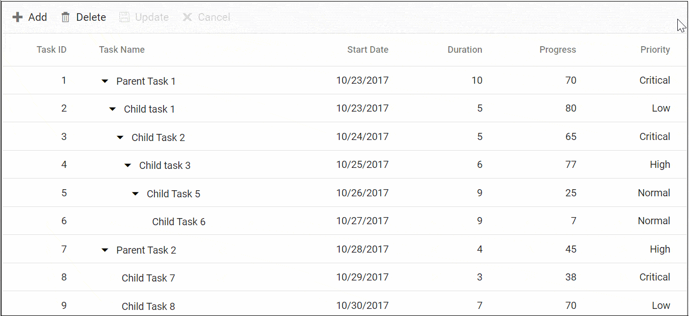

# Batch Editing in Blazor TreeGrid Component

Batch editing allows making multiple edits across cells and rows before committing changes to the data source. Double-click a cell to enter edit mode; edits are staged on the client and can be saved together or discarded. Save changes by clicking the toolbar **Update** button or by calling [EndEditAsync](https://help.syncfusion.com/cr/blazor/Syncfusion.Blazor.TreeGrid.SfTreeGrid-1.html#Syncfusion_Blazor_TreeGrid_SfTreeGrid_1_EndEditAsync). To enable Batch editing, set the [Mode](https://help.syncfusion.com/cr/blazor/Syncfusion.Blazor.TreeGrid.TreeGridEditSettings.html#Syncfusion_Blazor_TreeGrid_TreeGridEditSettings_Mode) property of TreeGridEditSettings to **Batch**.

The following example shows how to enable Batch editing, including add, edit, and delete operations with a toolbar.





@using TreeGridComponent.Data;
@using Syncfusion.Blazor.TreeGrid;

<SfTreeGrid DataSource="TreeData" IdMapping="TaskId" ParentIdMapping="ParentId" TreeColumnIndex="1" AllowPaging="true" Toolbar="@(new List<string>() { "Add", "Delete", "Update", "Cancel" })">
    <TreeGridPageSettings PageSize="2"></TreeGridPageSettings>
    <TreeGridEditSettings AllowAdding="true" AllowEditing="true" AllowDeleting="true" Mode="EditMode.Batch" NewRowPosition="RowPosition.Below"></TreeGridEditSettings>
    <TreeGridColumns>
        <TreeGridColumn Field="TaskId" HeaderText="Task ID" Width="60" IsPrimaryKey="true" TextAlign="Syncfusion.Blazor.Grids.TextAlign.Right"></TreeGridColumn>
        <TreeGridColumn Field="TaskName" HeaderText="Task Name" Width="155"></TreeGridColumn>
        <TreeGridColumn Field="StartDate" HeaderText="Start Date" Format="d" Type=Syncfusion.Blazor.Grids.ColumnType.Date Width="85" TextAlign="Syncfusion.Blazor.Grids.TextAlign.Right" EditType=Syncfusion.Blazor.Grids.EditType.DatePickerEdit></TreeGridColumn>
        <TreeGridColumn Field="Duration" HeaderText="Duration" Width="70" TextAlign="Syncfusion.Blazor.Grids.TextAlign.Right"></TreeGridColumn>
        <TreeGridColumn Field="Progress" HeaderText="Progress" Width="70" TextAlign="Syncfusion.Blazor.Grids.TextAlign.Right"></TreeGridColumn>
        <TreeGridColumn Field="Priority" HeaderText="Priority" Width="70" TextAlign="Syncfusion.Blazor.Grids.TextAlign.Right"></TreeGridColumn>
    </TreeGridColumns>
</SfTreeGrid>

@code{
    public List<BusinessObject> TreeData { get; set; }
    protected override void OnInitialized()
    {
        this.TreeData = BusinessObject.GetSelfDataSource().ToList();
    }
}





namespace TreeGridComponent.Data {
        public class BusinessObject
        {
            public int TaskId { get; set;}
            public string TaskName { get; set;}
            public DateTime? StartDate { get; set;}
            public int? Duration { get; set;}
            public int? Progress { get; set;}
            public string Priority { get; set;}
            public int? ParentId { get; set;}

        public static List<BusinessObject> GetSelfDataSource()
        {
            List<BusinessObject> BusinessObjectCollection = new List<BusinessObject>();
            BusinessObjectCollection.Add(new BusinessObject() { TaskId = 1,TaskName = "Parent Task 1",StartDate = new DateTime(2017, 10, 23),Duration = 10,Progress = 70,Priority = "Critical",ParentId = null });
            BusinessObjectCollection.Add(new BusinessObject() { TaskId = 2,TaskName = "Child task 1",StartDate = new DateTime(2017, 10, 23),Duration = 5,Progress = 80,Priority = "Low",ParentId = 1 });
            BusinessObjectCollection.Add(new BusinessObject() { TaskId = 3,TaskName = "Child Task 2",StartDate = new DateTime(2017, 10, 24),Duration = 5,Progress = 65,Priority = "Critical",ParentId = 2 });
            BusinessObjectCollection.Add(new BusinessObject() { TaskId = 4,TaskName = "Child task 3",StartDate = new DateTime(2017, 10, 25),Duration = 6,Priority = "High",Progress = 77,ParentId = 3 });
            BusinessObjectCollection.Add(new BusinessObject() { TaskId = 5, TaskName = "Child Task 5",StartDate = new DateTime(2017, 10, 26), Duration = 9, Progress = 25, ParentId = 4, Priority = "Normal" });
            BusinessObjectCollection.Add(new BusinessObject() { TaskId = 6, TaskName = "Child Task 6",StartDate = new DateTime(2017, 10, 27), Duration = 9, Progress = 7, ParentId = 5, Priority = "Normal" });
            BusinessObjectCollection.Add(new BusinessObject() { TaskId = 7, TaskName = "Parent Task 3",StartDate = new DateTime(2017, 10, 28), Duration = 4, Progress = 45, ParentId = null, Priority = "High" });
            BusinessObjectCollection.Add(new BusinessObject() { TaskId = 8, TaskName = "Child Task 7",StartDate = new DateTime(2017, 10, 29), Duration = 3, Progress = 38, ParentId = 7, Priority = "Critical" });
            BusinessObjectCollection.Add(new BusinessObject() { TaskId = 9, TaskName = "Child Task 8",StartDate = new DateTime(2017, 10, 30), Duration = 7, Progress = 70, ParentId = 7, Priority = "Low" });
            return BusinessObjectCollection;
        }
    }

}





## Confirmation dialog

Enable confirmation prompts for batch operations to prevent unintended changes. Set the [ShowConfirmDialog](https://help.syncfusion.com/cr/blazor/Syncfusion.Blazor.TreeGrid.TreeGridEditSettings.html#Syncfusion_Blazor_TreeGrid_TreeGridEditSettings_ShowConfirmDialog) property of [TreeGridEditSettings](https://help.syncfusion.com/cr/blazor/Syncfusion.Blazor.TreeGrid.TreeGridEditSettings.html) to true. Use [ShowDeleteConfirmDialog](https://help.syncfusion.com/cr/blazor/Syncfusion.Blazor.TreeGrid.TreeGridEditSettings.html#Syncfusion_Blazor_TreeGrid_TreeGridEditSettings_ShowDeleteConfirmDialog) to confirm deletions.

The following example enables confirmation dialogs for save and delete actions in Batch mode.





@using TreeGridComponent.Data;
@using Syncfusion.Blazor.TreeGrid;

<SfTreeGrid DataSource="TreeData" Width="900" IdMapping="TaskId" ParentIdMapping="ParentId" TreeColumnIndex="1" Toolbar="@(new List<string>() { "Add", "Delete", "Update", "Cancel" })">
    <TreeGridEditSettings AllowAdding="true" AllowEditing="true" AllowDeleting="true" Mode="EditMode.Batch" NewRowPosition="RowPosition.Below" ShowConfirmDialog="true" ShowDeleteConfirmDialog="true"></TreeGridEditSettings>
    <TreeGridColumns>
        <TreeGridColumn Field="TaskId" HeaderText="Task ID" Width="60" IsPrimaryKey="true" TextAlign="Syncfusion.Blazor.Grids.TextAlign.Right"></TreeGridColumn>
        <TreeGridColumn Field="TaskName" HeaderText="Task Name" Width="155"></TreeGridColumn>
        <TreeGridColumn Field="StartDate" HeaderText="Start Date" Format="d" Type=Syncfusion.Blazor.Grids.ColumnType.Date Width="85" TextAlign="Syncfusion.Blazor.Grids.TextAlign.Right" EditType=Syncfusion.Blazor.Grids.EditType.DatePickerEdit></TreeGridColumn>
        <TreeGridColumn Field="Duration" HeaderText="Duration" Width="70" TextAlign="Syncfusion.Blazor.Grids.TextAlign.Right"></TreeGridColumn>
        <TreeGridColumn Field="Progress" HeaderText="Progress" Width="70" TextAlign="Syncfusion.Blazor.Grids.TextAlign.Right"></TreeGridColumn>
        <TreeGridColumn Field="Priority" HeaderText="Priority" Width="70" TextAlign="Syncfusion.Blazor.Grids.TextAlign.Right"></TreeGridColumn>
    </TreeGridColumns>
</SfTreeGrid>

@code{
    public List<BusinessObject> TreeData { get; set; }
    protected override void OnInitialized()
    {
        this.TreeData = BusinessObject.GetSelfDataSource().ToList();
    }
}





namespace TreeGridComponent.Data {
        public class BusinessObject
        {
            public int TaskId { get; set;}
            public string TaskName { get; set;}
            public DateTime? StartDate { get; set;}
            public int? Duration { get; set;}
            public int? Progress { get; set;}
            public string Priority { get; set;}
            public int? ParentId { get; set;}

        public static List<BusinessObject> GetSelfDataSource()
        {
            List<BusinessObject> BusinessObjectCollection = new List<BusinessObject>();
            BusinessObjectCollection.Add(new BusinessObject() { TaskId = 1,TaskName = "Parent Task 1",StartDate = new DateTime(2017, 10, 23),Duration = 10,Progress = 70,Priority = "Critical",ParentId = null });
            BusinessObjectCollection.Add(new BusinessObject() { TaskId = 2,TaskName = "Child task 1",StartDate = new DateTime(2017, 10, 23),Duration = 5,Progress = 80,Priority = "Low",ParentId = 1 });
            BusinessObjectCollection.Add(new BusinessObject() { TaskId = 3,TaskName = "Child Task 2",StartDate = new DateTime(2017, 10, 24),Duration = 5,Progress = 65,Priority = "Critical",ParentId = 2 });
            BusinessObjectCollection.Add(new BusinessObject() { TaskId = 4,TaskName = "Child task 3",StartDate = new DateTime(2017, 10, 25),Duration = 6,Priority = "High",Progress = 77,ParentId = 3 });
            BusinessObjectCollection.Add(new BusinessObject() { TaskId = 5, TaskName = "Child Task 5",StartDate = new DateTime(2017, 10, 26), Duration = 9, Progress = 25, ParentId = 4, Priority = "Normal" });
            BusinessObjectCollection.Add(new BusinessObject() { TaskId = 6, TaskName = "Child Task 6",StartDate = new DateTime(2017, 10, 27), Duration = 9, Progress = 7, ParentId = 5, Priority = "Normal" });
            BusinessObjectCollection.Add(new BusinessObject() { TaskId = 7, TaskName = "Parent Task 2",StartDate = new DateTime(2017, 10, 28), Duration = 4, Progress = 45, ParentId = null, Priority = "High" });
            BusinessObjectCollection.Add(new BusinessObject() { TaskId = 8, TaskName = "Child Task 7",StartDate = new DateTime(2017, 10, 29), Duration = 3, Progress = 38, ParentId = 7, Priority = "Critical" });
            BusinessObjectCollection.Add(new BusinessObject() { TaskId = 9, TaskName = "Child Task 8",StartDate = new DateTime(2017, 10, 30), Duration = 7, Progress = 70, ParentId = 7, Priority = "Low" });
            return BusinessObjectCollection;
        }
    }
}





The following GIF shows the confirmation dialog displayed during batch operations in the TreeGrid.

N> - Batch mode stages edits on the client. Click Update on the toolbar or save programmatically to commit changes; Cancel discards staged edits.  
- A primary key column (IsPrimaryKey=true) is required for editing.  

- Confirmation dialogs are available only when the TreeGridEditSettings Mode is set to **Batch**. If ShowConfirmDialog is false, no confirmation dialog is shown for save; use ShowDeleteConfirmDialog to control delete confirmations separately.