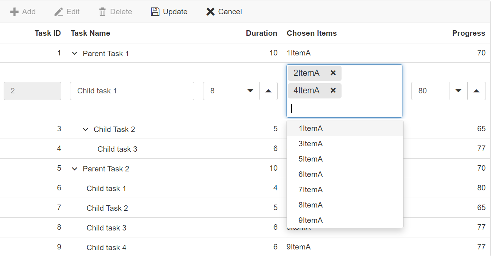

# Cell edit type and its params in Blazor Tree Grid Component

The [TreeGridColumn.EditType](https://help.syncfusion.com/cr/blazor/Syncfusion.Blazor.TreeGrid.TreeGridColumn.html#Syncfusion_Blazor_TreeGrid_TreeGridColumn_EditType) is used to customize the edit type of the particular column. The [TreeGridColumn.EditType](https://help.syncfusion.com/cr/blazor/Syncfusion.Blazor.TreeGrid.TreeGridColumn.html#Syncfusion_Blazor_TreeGrid_TreeGridColumn_EditType) can be set based on the data type of the column.

* [NumericTextBox](https://blazor.syncfusion.com/documentation/numeric-textbox/getting-started-webapp) component for integers, double, and decimal data types.

* [TextBox](https://blazor.syncfusion.com/documentation/textbox/getting-started-webapp) component for string data type.

* [DropDownList](https://blazor.syncfusion.com/documentation/dropdown-list/getting-started-with-web-app) component for list data type.

* [DatePicker](https://blazor.syncfusion.com/documentation/datepicker/getting-started-with-web-app) component for date values.

* [DateTimePicker](https://blazor.syncfusion.com/documentation/datetime-picker/getting-started-with-web-app) component for datetime type.

* [Checkbox](https://blazor.syncfusion.com/documentation/check-box/getting-started-with-web-app) component for boolean type.

* [TimePickerEdit](https://blazor.syncfusion.com/documentation/timepicker/getting-started-webapp) component for TimeOnly data type.

Also, the model of the [TreeGridColumn.EditType](https://help.syncfusion.com/cr/blazor/Syncfusion.Blazor.TreeGrid.TreeGridColumn.html#Syncfusion_Blazor_TreeGrid_TreeGridColumn_EditType) component can be customized through the [TreeGridColumn.Edit.params](https://help.syncfusion.com/cr/blazor/Syncfusion.Blazor.TreeGrid.TreeGridColumn.html#Syncfusion_Blazor_TreeGrid_TreeGridColumn_Edit).

The following table describes cell edit type component and their corresponding edit params of the column.

Component |Example
-----|-----
[NumericTextBox](https://blazor.syncfusion.com/documentation/numeric-textbox/getting-started-webapp) | @(new { @params = new { format = "n"} })
[TextBox](https://blazor.syncfusion.com/documentation/textbox/getting-started-webapp) | -
[DropDownList](https://blazor.syncfusion.com/documentation/dropdown-list/getting-started-with-web-app) | @(new { @params = new { value = "Germany"} })
[DatePicker](https://blazor.syncfusion.com/documentation/datepicker/getting-started-with-web-app) | @(new { @params = new { format = "yyyy-MM-dd"} })
[DateTimePicker](https://blazor.syncfusion.com/documentation/datetime-picker/getting-started-with-web-app) | @(new { @params = new { strictMode = true} })
[Checkbox](https://blazor.syncfusion.com/documentation/check-box/getting-started-with-web-app) | @(new { @params = new { checked = true} })
[TimePickerEdit](https://blazor.syncfusion.com/documentation/timepicker/getting-started-webapp) | @(new { @params = new { format = "HH:mm:ss"} })





@using TreeGridComponent.Data;
@using Syncfusion.Blazor.TreeGrid;

<SfTreeGrid DataSource="@TreeGridData" IdMapping="TaskId" ParentIdMapping="ParentId" TreeColumnIndex="1" Toolbar="@(new List<string>() { "Add", "Edit", "Delete", "Update", "Cancel" })">
    <TreeGridEditSettings AllowEditing="true" AllowAdding="true" AllowDeleting="true" />
    <TreeGridColumns>
        <TreeGridColumn Field="TaskId" HeaderText="Task ID" IsPrimaryKey="true" Width="80" TextAlign="Syncfusion.Blazor.Grids.TextAlign.Right"></TreeGridColumn>
        <TreeGridColumn Field="TaskName" HeaderText="Task Name" Width="160"></TreeGridColumn>
        <TreeGridColumn Field="StartDate" HeaderText="Start Date" Width="150" Format="d" EditorSettings="DateParams" Type="Syncfusion.Blazor.Grids.ColumnType.DateTime" EditType="Syncfusion.Blazor.Grids.EditType.DateTimePickerEdit"></TreeGridColumn>
        <TreeGridColumn Field="Duration" HeaderText="Duration" Width="100" TextAlign="Syncfusion.Blazor.Grids.TextAlign.Right"></TreeGridColumn>
        <TreeGridColumn Field="Progress" HeaderText="Progress" Width="100" EditorSettings="NumericParams" EditType="Syncfusion.Blazor.Grids.EditType.NumericEdit" TextAlign="Syncfusion.Blazor.Grids.TextAlign.Right"></TreeGridColumn>
        <TreeGridColumn Field="Approved" HeaderText="Approved" Type="Syncfusion.Blazor.Grids.ColumnType.Boolean" DisplayAsCheckBox="true" EditType="Syncfusion.Blazor.Grids.EditType.BooleanEdit" Width="80"></TreeGridColumn>
    </TreeGridColumns>
</SfTreeGrid>

@code{
    public List<TreeData.BusinessObject> TreeGridData { get; set; }

    public Syncfusion.Blazor.Grids.NumericEditCellParams NumericParams = new Syncfusion.Blazor.Grids.NumericEditCellParams()
    {
        Params = new Syncfusion.Blazor.Inputs.NumericTextBoxModel<object>(){ Format = "N2"  }
    };

    public Syncfusion.Blazor.Grids.DateEditCellParams DateParams = new Syncfusion.Blazor.Grids.DateEditCellParams()
    {
        Params = new Syncfusion.Blazor.Calendars.DatePickerModel(){ Format = "d" }
    };

    protected override void OnInitialized()
    {
        this.TreeGridData = TreeData.GetSelfDataSource().ToList();
    }
}





namespace TreeGridComponent.Data {

public class TreeData
    {
        public class BusinessObject
        {
            public int TaskId { get; set;}
            public string TaskName { get; set;}
            public DateTime? StartDate { get; set;}
            public bool Approved { get; set;}
            public int? Duration { get; set;}
            public int? Progress { get; set;}
            public int? ParentId { get; set;}
        }

        public static List<BusinessObject> GetSelfDataSource()
        {
            List<BusinessObject> BusinessObjectCollection = new List<BusinessObject>();
            BusinessObjectCollection.Add(new BusinessObject() { TaskId = 1,TaskName = "Parent Task 1",StartDate = new DateTime(2017, 10, 23),Duration = 10,Progress = 70,ParentId = null });
            BusinessObjectCollection.Add(new BusinessObject() { TaskId = 2,TaskName = "Child task 1",StartDate = new DateTime(2017, 10, 23),Progress = 80,ParentId = 1 });
            BusinessObjectCollection.Add(new BusinessObject() { TaskId = 3,TaskName = "Child Task 2",StartDate = new DateTime(2017, 10, 24),Duration = 5,Progress = 65,ParentId = 2 });
            BusinessObjectCollection.Add(new BusinessObject() { TaskId = 4,TaskName = "Child task 3",StartDate = new DateTime(2017, 10, 25),Duration = 6,Progress = 77,ParentId = 3 });
            BusinessObjectCollection.Add(new BusinessObject() { TaskId = 5,TaskName = "Parent Task 2",StartDate = new DateTime(2017, 10, 23),Duration = 10,Progress = 70,ParentId = null});
            BusinessObjectCollection.Add(new BusinessObject() { TaskId = 6,TaskName = "Child task 1",StartDate = new DateTime(2017, 10, 23),Duration = 4,Progress = 80,ParentId = 5});
            BusinessObjectCollection.Add(new BusinessObject() { TaskId = 7,TaskName = "Child Task 2",StartDate = new DateTime(2017, 10, 24),Duration = 5,Progress = 65,ParentId = 5});
            BusinessObjectCollection.Add(new BusinessObject() { TaskId = 8,TaskName = "Child task 3",StartDate = new DateTime(2017, 10, 25),Duration = 6,Progress = 77,ParentId = 5});
            BusinessObjectCollection.Add(new BusinessObject() { TaskId = 9,TaskName = "Child task 4",StartDate = new DateTime(2017, 10, 25),Duration = 6,Progress = 77,ParentId = 5});
            return BusinessObjectCollection;
        }
    }
}





N> If edit type is not defined in the column, then it will be considered as the **stringedit** type (Textbox component).

## Cell Edit Template

The cell edit template is used to add a custom component for a particular column when the column is edited. The following code example describes, how to define the Edit template for a particular column.





@using TreeGridComponent.Data;
@using Syncfusion.Blazor.TreeGrid;
@using Syncfusion.Blazor.Inputs;
@using Syncfusion.Blazor.DropDowns;

<SfTreeGrid DataSource="@TreeGridData" IdMapping="TaskId" ParentIdMapping="ParentId" TreeColumnIndex="1" Toolbar="@(new List<string>() { "Add", "Edit", "Delete", "Update", "Cancel" })">
    <TreeGridEditSettings AllowEditing="true" AllowAdding="true" AllowDeleting="true" />
    <TreeGridColumns>
        <TreeGridColumn Field="TaskId" HeaderText="Task ID" IsPrimaryKey="true" Width="80" TextAlign="Syncfusion.Blazor.Grids.TextAlign.Right"></TreeGridColumn>
        <TreeGridColumn Field="TaskName" HeaderText="Task Name" Width="160"></TreeGridColumn>
        <TreeGridColumn Field="Duration" HeaderText="Duration" Width="100" TextAlign="Syncfusion.Blazor.Grids.TextAlign.Right"></TreeGridColumn>
        <TreeGridColumn Field="Progress" HeaderText="Progress" Width="100" TextAlign="Syncfusion.Blazor.Grids.TextAlign.Right"></TreeGridColumn>
        <TreeGridColumn Field="Priority" HeaderText="Priority" Width="80">
            <EditTemplate>
                @{
                    var task = context as TreeData;
                 }
                <SfDropDownList ID="Priority" @bind-Value="task.Priority" TItem="string" TValue="string" DataSource="@DropDownData"></SfDropDownList>
            </EditTemplate>
        </TreeGridColumn>
    </TreeGridColumns>
</SfTreeGrid>

@code{
    
    public List<TreeData> TreeGridData { get; set; }

    public List<string> DropDownData { get; set; }

    protected override void OnInitialized()
    {
        this.TreeGridData = TreeData.GetSelfDataSource().ToList();

        this.DropDownData = TreeData.GetSelfDataSource().Select(s => s.Priority).Distinct().ToList();
    }
}





namespace TreeGridComponent.Data {

public class TreeData
    {      
            public int TaskId { get; set;}
            public string TaskName { get; set;}
            public int? Duration { get; set;}
            public int? Progress { get; set;}
            public string Priority { get; set;}
            public int? ParentId { get; set;}

        public static List<TreeData> GetSelfDataSource()
        {
            List<TreeData> TreeDataCollection = new List<TreeData>();
            TreeDataCollection.Add(new TreeData() { TaskId = 1,TaskName = "Parent Task 1",Duration = 10,Progress = 70,Priority = "Critical",ParentId = null });
            TreeDataCollection.Add(new TreeData() { TaskId = 2,TaskName = "Child task 1",Progress = 80,Duration = 50,Priority = "Low",ParentId = 1 });
            TreeDataCollection.Add(new TreeData() { TaskId = 3,TaskName = "Child Task 2",Duration = 5,Progress = 65,Priority = "Critical",ParentId = 2 });
            TreeDataCollection.Add(new TreeData() { TaskId = 4,TaskName = "Child task 3",Duration = 6,Priority = "High",Progress = 77,ParentId = 3 });
            TreeDataCollection.Add(new TreeData() { TaskId = 5,TaskName = "Parent Task 2",Duration = 10,Progress = 70,Priority = "Critical",ParentId = null});
            TreeDataCollection.Add(new TreeData() { TaskId = 6,TaskName = "Child task 1",Duration = 4,Progress = 80,Priority = "Critical",ParentId = 5});
            TreeDataCollection.Add(new TreeData() { TaskId = 7,TaskName = "Child Task 2",Duration = 5,Progress = 65,Priority = "Low",ParentId = 5});
            TreeDataCollection.Add(new TreeData() { TaskId = 8,TaskName = "Child task 3",Duration = 6,Progress = 77,Priority = "High",ParentId = 5});
            TreeDataCollection.Add(new TreeData() { TaskId = 9,TaskName = "Child task 4",Duration = 6,Progress = 77,Priority = "Low",ParentId = 5});
            return TreeDataCollection;
        }
    }
}





### Using AutoComplete in EditTemplate

Render the [SfAutoComplete](https://help.syncfusion.com/cr/blazor/Syncfusion.Blazor.DropDowns.SfAutoComplete-2.html) component for the edit form field in tree grid using [EditTemplate](https://help.syncfusion.com/cr/blazor/Syncfusion.Blazor.TreeGrid.TreeGridColumn.html#Syncfusion_Blazor_TreeGrid_TreeGridColumn_EditTemplate).

In the following sample the `SfAutoComplete` component is rendered in the **TaskName** column's `EditTemplate`.





@using TreeGridComponent.Data;
@using Syncfusion.Blazor.TreeGrid;
@using Syncfusion.Blazor.DropDowns

<SfTreeGrid DataSource="@TreeGridData" IdMapping="TaskId" ParentIdMapping="ParentId" TreeColumnIndex="1" Toolbar="@(new List<string>() { "Add", "Edit", "Delete", "Update", "Cancel" })">
    <TreeGridEditSettings AllowEditing="true" AllowAdding="true" AllowDeleting="true" Mode="Syncfusion.Blazor.TreeGrid.EditMode.Row" />
    <TreeGridColumns>
        <TreeGridColumn Field="TaskId" HeaderText="Task ID" IsPrimaryKey="true" Width="80" TextAlign="Syncfusion.Blazor.Grids.TextAlign.Right"></TreeGridColumn>
        <TreeGridColumn Field="TaskName" HeaderText="Task Name" Width="160">
            <EditTemplate>
                <SfAutoComplete ID="TaskName" TItem="TreeData.BusinessObject" TValue="string" @bind-Value="@((context as TreeData.BusinessObject).TaskName)" DataSource="@TreeGridData">
                    <AutoCompleteFieldSettings Value="TaskName"></AutoCompleteFieldSettings>
                </SfAutoComplete>
            </EditTemplate>
        </TreeGridColumn>
        <TreeGridColumn Field="Duration" HeaderText="Duration" Width="100" TextAlign="Syncfusion.Blazor.Grids.TextAlign.Right"></TreeGridColumn>
        <TreeGridColumn Field="Progress" HeaderText="Progress" Width="100" TextAlign="Syncfusion.Blazor.Grids.TextAlign.Right"></TreeGridColumn>
        <TreeGridColumn Field="Priority" HeaderText="Priority" Width="80"></TreeGridColumn>
    </TreeGridColumns>
</SfTreeGrid>

@code{
    
    public List<TreeData.BusinessObject> TreeGridData { get; set; }
    protected override void OnInitialized()
    {
        this.TreeGridData = TreeData.GetSelfDataSource().ToList();
    }
}





namespace TreeGridComponent.Data {

public class TreeData
    {
        public class BusinessObject
        {
            public int TaskId { get; set;}
            public string TaskName { get; set;}
            public int? Duration { get; set;}
            public int? Progress { get; set;}
            public string Priority { get; set;}
            public int? ParentId { get; set;}
        }

        public static List<BusinessObject> GetSelfDataSource()
        {
            List<BusinessObject> BusinessObjectCollection = new List<BusinessObject>();
            BusinessObjectCollection.Add(new BusinessObject() { TaskId = 1,TaskName = "Parent Task 1",Duration = 10,Progress = 70,Priority = "Critical",ParentId = null });
            BusinessObjectCollection.Add(new BusinessObject() { TaskId = 2,TaskName = "Child task 1",Progress = 80,Priority = "Low",ParentId = 1 });
            BusinessObjectCollection.Add(new BusinessObject() { TaskId = 3,TaskName = "Child Task 2",Duration = 5,Progress = 65,Priority = "Critical",ParentId = 2 });
            BusinessObjectCollection.Add(new BusinessObject() { TaskId = 4,TaskName = "Child task 3",Duration = 6,Priority = "High",Progress = 77,ParentId = 3 });
            BusinessObjectCollection.Add(new BusinessObject() { TaskId = 5,TaskName = "Parent Task 2",Duration = 10,Progress = 70,Priority = "Critical",ParentId = null});
            BusinessObjectCollection.Add(new BusinessObject() { TaskId = 6,TaskName = "Child task 1",Duration = 4,Progress = 80,Priority = "Critical",ParentId = 5});
            BusinessObjectCollection.Add(new BusinessObject() { TaskId = 7,TaskName = "Child Task 2",Duration = 5,Progress = 65,Priority = "Low",ParentId = 5});
            BusinessObjectCollection.Add(new BusinessObject() { TaskId = 8,TaskName = "Child task 3",Duration = 6,Progress = 77,Priority = "High",ParentId = 5});
            BusinessObjectCollection.Add(new BusinessObject() { TaskId = 9,TaskName = "Child task 4",Duration = 6,Progress = 77,Priority = "Low",ParentId = 5});
            return BusinessObjectCollection;
        }
    }
}





In the following image, `Autocomplete` component is rendered with the  `EditTemplate` in the  **TaskName** column.

### Using ComboBox in EditTemplate

Render the [SfComboBox](https://help.syncfusion.com/cr/blazor/Syncfusion.Blazor.DropDowns.SfComboBox-2.html) component for the edit form field in tree grid using [EditTemplate](https://help.syncfusion.com/cr/blazor/Syncfusion.Blazor.TreeGrid.TreeGridColumn.html#Syncfusion_Blazor_TreeGrid_TreeGridColumn_EditTemplate).

In the following sample, the `SfComboBox` component is rendered in the `EditTemplate` for the **Priority** column.





@using TreeGridComponent.Data;
@using Syncfusion.Blazor.TreeGrid;
@using Syncfusion.Blazor.DropDowns;

<SfTreeGrid DataSource="@TreeGridData" IdMapping="TaskId" ParentIdMapping="ParentId" TreeColumnIndex="1" Toolbar="@(new List<string>() { "Add", "Edit", "Delete", "Update", "Cancel" })">
    <TreeGridEditSettings AllowEditing="true" AllowAdding="true" AllowDeleting="true" Mode="Syncfusion.Blazor.TreeGrid.EditMode.Row" />
    <TreeGridColumns>
        <TreeGridColumn Field="TaskId" HeaderText="Task ID" IsPrimaryKey="true" Width="80" TextAlign="Syncfusion.Blazor.Grids.TextAlign.Right"></TreeGridColumn>
        <TreeGridColumn Field="TaskName" HeaderText="Task Name" Width="160"></TreeGridColumn>
        <TreeGridColumn Field="Duration" HeaderText="Duration" Width="100" TextAlign="Syncfusion.Blazor.Grids.TextAlign.Right"></TreeGridColumn>
        <TreeGridColumn Field="Progress" HeaderText="Progress" Width="100" TextAlign="Syncfusion.Blazor.Grids.TextAlign.Right"></TreeGridColumn>
        <TreeGridColumn Field="Priority" HeaderText="Priority" Width="80">
            <EditTemplate>
                <SfComboBox ID="Priority" TItem="Prior" TValue="string" @bind-Value="@((context as TreeData.BusinessObject).Priority)" DataSource="@Priority">
                    <ComboBoxFieldSettings  Value="Prioritize" Text="Prioritize"></ComboBoxFieldSettings>
                </SfComboBox>
            </EditTemplate>
        </TreeGridColumn>
    </TreeGridColumns>
</SfTreeGrid>

@code{
    
    public List<TreeData.BusinessObject> TreeGridData { get; set; }
    protected override void OnInitialized()
    {
        this.TreeGridData = TreeData.GetSelfDataSource().ToList();
    }
    public List<Prior> Priority { get; set; } = new List<Prior>()
    {
        new Prior(){ Prioritize="Critical", ID=1},
        new Prior(){ Prioritize="High", ID=2},
        new Prior(){ Prioritize="Low", ID=3}
    };
    public class Prior
    {
        public string Prioritize { get; set; }
        public int ID { get; set; }
    }
}





namespace TreeGridComponent.Data {

public class TreeData
    {
        public class BusinessObject
        {
            public int TaskId { get; set;}
            public string TaskName { get; set;}
            public int? Duration { get; set;}
            public int? Progress { get; set;}
            public string Priority { get; set;}
            public int? ParentId { get; set;}
        }

        public static List<BusinessObject> GetSelfDataSource()
        {
            List<BusinessObject> BusinessObjectCollection = new List<BusinessObject>();
            BusinessObjectCollection.Add(new BusinessObject() { TaskId = 1,TaskName = "Parent Task 1",Duration = 10,Progress = 70,Priority = "Critical",ParentId = null });
            BusinessObjectCollection.Add(new BusinessObject() { TaskId = 2,TaskName = "Child task 1",Progress = 80,Priority = "Low",ParentId = 1 });
            BusinessObjectCollection.Add(new BusinessObject() { TaskId = 3,TaskName = "Child Task 2",Duration = 5,Progress = 65,Priority = "Critical",ParentId = 2 });
            BusinessObjectCollection.Add(new BusinessObject() { TaskId = 4,TaskName = "Child task 3",Duration = 6,Priority = "High",Progress = 77,ParentId = 3 });
            BusinessObjectCollection.Add(new BusinessObject() { TaskId = 5,TaskName = "Parent Task 2",Duration = 10,Progress = 70,Priority = "Critical",ParentId = null});
            BusinessObjectCollection.Add(new BusinessObject() { TaskId = 6,TaskName = "Child task 1",Duration = 4,Progress = 80,Priority = "Critical",ParentId = 5});
            BusinessObjectCollection.Add(new BusinessObject() { TaskId = 7,TaskName = "Child Task 2",Duration = 5,Progress = 65,Priority = "Low",ParentId = 5});
            BusinessObjectCollection.Add(new BusinessObject() { TaskId = 8,TaskName = "Child task 3",Duration = 6,Progress = 77,Priority = "High",ParentId = 5});
            BusinessObjectCollection.Add(new BusinessObject() { TaskId = 9,TaskName = "Child task 4",Duration = 6,Progress = 77,Priority = "Low",ParentId = 5});
            return BusinessObjectCollection;
        }
    }
}





### Using NumericTextBox in EditTemplate

You can render the [SfNumericTextBox](https://help.syncfusion.com/cr/blazor/Syncfusion.Blazor.Inputs.SfNumericTextBox-1.html) component for the edit form field in tree grid using [EditTemplate](https://help.syncfusion.com/cr/blazor/Syncfusion.Blazor.TreeGrid.TreeGridColumn.html#Syncfusion_Blazor_TreeGrid_TreeGridColumn_EditTemplate).

In the following sample, the `SfNumericTextBox` component is rendered in the `EditTemplate` for the **Duration** column.





@using TreeGridComponent.Data;
@using Syncfusion.Blazor.TreeGrid;
@using Syncfusion.Blazor.Inputs

<SfTreeGrid DataSource="@TreeGridData" IdMapping="TaskId" ParentIdMapping="ParentId" TreeColumnIndex="1" Toolbar="@(new List<string>() { "Add", "Edit", "Delete", "Update", "Cancel" })">
    <TreeGridEditSettings AllowEditing="true" AllowAdding="true" AllowDeleting="true" Mode="Syncfusion.Blazor.TreeGrid.EditMode.Row" />
    <TreeGridColumns>
        <TreeGridColumn Field="TaskId" HeaderText="Task ID" IsPrimaryKey="true" Width="80" TextAlign="Syncfusion.Blazor.Grids.TextAlign.Right"></TreeGridColumn>
        <TreeGridColumn Field="TaskName" HeaderText="Task Name" Width="160"></TreeGridColumn>
        <TreeGridColumn Field="Duration" HeaderText="Duration" Width="100" TextAlign="Syncfusion.Blazor.Grids.TextAlign.Right">
            <EditTemplate>
                <SfNumericTextBox TValue="int?" ID="Duration" @bind-Value="@((context as TreeData.BusinessObject).Duration)" ShowClearButton="true">
                </SfNumericTextBox>
            </EditTemplate>
        </TreeGridColumn>
        <TreeGridColumn Field="Progress" HeaderText="Progress" Width="100" TextAlign="Syncfusion.Blazor.Grids.TextAlign.Right"></TreeGridColumn>
        <TreeGridColumn Field="Priority" HeaderText="Priority" Width="80"></TreeGridColumn>
    </TreeGridColumns>
</SfTreeGrid>

@code{
    
    public List<TreeData.BusinessObject> TreeGridData { get; set; }
    protected override void OnInitialized()
    {
        this.TreeGridData = TreeData.GetSelfDataSource().ToList();
    }
}





namespace TreeGridComponent.Data {

public class TreeData
    {
        public class BusinessObject
        {
            public int TaskId { get; set;}
            public string TaskName { get; set;}
            public int? Duration { get; set;}
            public int? Progress { get; set;}
            public string Priority { get; set;}
            public int? ParentId { get; set;}
        }

        public static List<BusinessObject> GetSelfDataSource()
        {
            List<BusinessObject> BusinessObjectCollection = new List<BusinessObject>();
            BusinessObjectCollection.Add(new BusinessObject() { TaskId = 1,TaskName = "Parent Task 1",Duration = 10,Progress = 70,Priority = "Critical",ParentId = null });
            BusinessObjectCollection.Add(new BusinessObject() { TaskId = 2,TaskName = "Child task 1",Duration = 8,Progress = 80,Priority = "Low",ParentId = 1 });
            BusinessObjectCollection.Add(new BusinessObject() { TaskId = 3,TaskName = "Child Task 2",Duration = 5,Progress = 65,Priority = "Critical",ParentId = 2 });
            BusinessObjectCollection.Add(new BusinessObject() { TaskId = 4,TaskName = "Child task 3",Duration = 6,Priority = "High",Progress = 77,ParentId = 3 });
            BusinessObjectCollection.Add(new BusinessObject() { TaskId = 5,TaskName = "Parent Task 2",Duration = 10,Progress = 70,Priority = "Critical",ParentId = null});
            BusinessObjectCollection.Add(new BusinessObject() { TaskId = 6,TaskName = "Child task 1",Duration = 4,Progress = 80,Priority = "Critical",ParentId = 5});
            BusinessObjectCollection.Add(new BusinessObject() { TaskId = 7,TaskName = "Child Task 2",Duration = 5,Progress = 65,Priority = "Low",ParentId = 5});
            BusinessObjectCollection.Add(new BusinessObject() { TaskId = 8,TaskName = "Child task 3",Duration = 6,Progress = 77,Priority = "High",ParentId = 5});
            BusinessObjectCollection.Add(new BusinessObject() { TaskId = 9,TaskName = "Child task 4",Duration = 6,Progress = 77,Priority = "Low",ParentId = 5});
            return BusinessObjectCollection;
        }
    }
}





### Using TimePicker in EditTemplate

Render the [SfTimePicker](https://help.syncfusion.com/cr/blazor/Syncfusion.Blazor.Calendars.SfTimePicker-1.html) component for the edit form field in tree grid using [EditTemplate](https://help.syncfusion.com/cr/blazor/Syncfusion.Blazor.TreeGrid.TreeGridColumn.html#Syncfusion_Blazor_TreeGrid_TreeGridColumn_EditTemplate). In the following sample,  `SfTimePicker` component is rendered in the `EditTemplate` for the **StartDate** column.





@using TreeGridComponent.Data;
@using Syncfusion.Blazor.TreeGrid
@using Syncfusion.Blazor.Grids
@using Syncfusion.Blazor.Calendars

    

        

            <SfTreeGrid @ref="TreeGrid" Width="900" DataSource="@TreeData" Toolbar="@(new List<string>() { "Add", "Edit", "Delete", "Cancel", "Update" })" IdMapping="TaskID" ParentIdMapping="ParentID" TreeColumnIndex="1">
                <TreeGridEditSettings AllowAdding="true" AllowEditing="true" AllowDeleting="true" Mode="Syncfusion.Blazor.TreeGrid.EditMode.Row"></TreeGridEditSettings>
                <TreeGridColumns>
                    <TreeGridColumn Field="TaskID" HeaderText="Task ID" IsPrimaryKey="true" ValidationRules="@(new ValidationRules{ Required=true})" Width="80" TextAlign="TextAlign.Right"></TreeGridColumn>
                    <TreeGridColumn Field="TaskName" HeaderText="Task Name" Width="145"></TreeGridColumn>
                    <TreeGridColumn Field="StartDate" HeaderText=" Start Date" TextAlign="TextAlign.Right" Width="130" Format="hh:mm tt" DefaultValue="DateTime.Now" Type="ColumnType.DateTime">
                        <EditTemplate>
                            <SfTimePicker TValue="DateTime?" @bind-Value="@((context as SelfReferenceData).StartDate)"
                                            AllowEdit="true" Format="hh:mm:tt" CssClass="CustomDateCSS" ShowClearButton="true"></SfTimePicker>
                        </EditTemplate>
                    </TreeGridColumn>
                    <TreeGridColumn Field="Progress" HeaderText="Progress" Width="150"></TreeGridColumn>
                    <TreeGridColumn Field="Priority" HeaderText="Priority" Width="150"></TreeGridColumn>
                </TreeGridColumns>
            </SfTreeGrid>
        

    

@code{
    
    public SfTreeGrid<SelfReferenceData> TreeGrid;
    private List<SelfReferenceData> TreeData { get; set; }
    protected override void OnInitialized()
    {
        this.TreeData = SelfReferenceData.GetTree().Take(50).ToList();
    }
}





namespace TreeGridComponent.Data {

public class SelfReferenceData
    {
        public static List<SelfReferenceData> tree = new List<SelfReferenceData>();
        public int? TaskID { get; set; }
        public string TaskName { get; set; }
        public DateTime? StartDate { get; set; }
        public DateTime? EndDate { get; set; }
        public String Progress { get; set; }
        public String Priority { get; set; }
        public double? Duration { get; set; }
        public int? ParentID { get; set; }
        public bool? IsParent { get; set; }
        public int? ParentItem { get; set;}
        public SelfReferenceData() { }
        public static List<SelfReferenceData> GetTree()
        {
                tree.Clear();
                int root = -1;
                int TaskNameID = 0;
                int ChildCount = -1;
                int SubTaskCount = -1;
                for (var t = 1; t <= 60; t++)
                {
                Random gen = new Random();
                Random ran = new Random();
                DateTime start = new DateTime(2021, 06, 07);
                int range = (DateTime.Today - start).Days;
                DateTime startingDate = start.AddDays(gen.Next(range));
                DateTime end = new DateTime(2023, 08, 25);
                int endrange = (end - DateTime.Today).Days;
                DateTime endingDate = end.AddDays(gen.Next(endrange));
                string math = (ran.Next() % 3) == 0 ? "High" : (ran.Next() % 2) == 0 ? "Low" : "Critical";
                    string progr = (ran.Next() % 3) == 0 ? "Started" : (ran.Next() % 2) == 0 ? "Open" : "In Progress";
                    bool appr = (ran.Next() % 3) == 0 ? true : (ran.Next() % 2) == 0 ? false : true;
                    root++; TaskNameID++;
                    int rootItem = root + 1;
                    tree.Add(new SelfReferenceData() { TaskID = rootItem, TaskName = "Parent task " + TaskNameID.ToString(), StartDate = startingDate, EndDate = endingDate, IsParent = true, ParentID = null, Progress = progr, Priority = math, Duration = ran.Next(1, 50)});
                    int parent = tree.Count;
                    for (var c = 0; c < 2; c++)
                    {
                    DateTime start1 = new DateTime(2021, 07, 09);
                    int range1 = (DateTime.Today - start1).Days;
                    DateTime startingDate1 = start1.AddDays(gen.Next(range1));
                    DateTime end1 = new DateTime(2022, 08, 23);
                    int endrange1 = (end1 - DateTime.Today).Days;
                    DateTime endingDate1 = end1.AddDays(gen.Next(endrange1));
                    root++; ChildCount++;
                        string val = ((parent + c + 1) % 3 == 0) ? "Low" : "Critical";
                        int parn = parent + c + 1;
                        progr = (ran.Next() % 3) == 0 ? "In Progress" : (ran.Next() % 2) == 0 ? "Open" : "Validated";
                        appr = (ran.Next() % 3) == 0 ? true : (ran.Next() % 2) == 0 ? false : true;
                        int iD = root + 1;
                        tree.Add(new SelfReferenceData() { TaskID = iD, TaskName = "Child task " + (ChildCount + 1).ToString(), StartDate = startingDate1, EndDate = endingDate1, IsParent = (((parent + c + 1) % 3) == 0), ParentID = rootItem, Progress = progr, Priority = val, Duration = ran.Next(1, 50)});
                        if ((((parent + c + 1) % 3) == 0))
                        {
                        int immParent = tree.Count;
                            for (var s = 0; s < 3; s++)
                            {
                            DateTime start2 = new DateTime(2021, 05, 05);
                            int range2 = (DateTime.Today - start2).Days;
                            DateTime startingDate2 = start2.AddDays(gen.Next(range2));
                            DateTime end2 = new DateTime(2024, 06, 16);
                            int endrange2 = (end2 - DateTime.Today).Days;
                            DateTime endingDate2 = end2.AddDays(gen.Next(endrange2));
                            root++; SubTaskCount++;
                                string Prior = (immParent % 2 == 0) ? "Validated" : "Normal";
                                tree.Add(new SelfReferenceData() { TaskID = root + 1, TaskName = "Sub task " + (SubTaskCount + 1).ToString(), StartDate = startingDate2, EndDate = endingDate2, IsParent = false, ParentID = iD, Progress = (immParent % 2 == 0) ? "In Progress" : "Closed", Priority = Prior, Duration = ran.Next(1, 50)});
                            }
                        }
                    }
                }
            return tree;
        }
    }
}





In the following image, `SfTimePicker` component is rendered with the `EditTemplate` in the **StartDate** column

### Using MultiSelect dropdown in EditTemplate

You can able to render [SfMultiSelect](https://help.syncfusion.com/cr/blazor/Syncfusion.Blazor.DropDowns.SfMultiSelect-2.html) component for the edit form field in tree grid using [EditTemplate](https://help.syncfusion.com/cr/blazor/Syncfusion.Blazor.TreeGrid.TreeGridColumn.html#Syncfusion_Blazor_TreeGrid_TreeGridColumn_EditTemplate). In the below sample we have rendered `SfMultiSelect` component in `EditTemplate` for ChosenItems column.





@using TreeGridComponent.Data;
@using Syncfusion.Blazor.TreeGrid;
@using Syncfusion.Blazor.DropDowns

<SfTreeGrid DataSource="@TreeGridData" Width="900" IdMapping="TaskId" ParentIdMapping="ParentId" TreeColumnIndex="1" Toolbar="@(new List<string>() { "Add", "Edit", "Delete", "Update", "Cancel" })">
    <TreeGridEditSettings AllowEditing="true" AllowAdding="true" AllowDeleting="true" Mode="Syncfusion.Blazor.TreeGrid.EditMode.Row" />
    <TreeGridColumns>
        <TreeGridColumn Field="TaskId" HeaderText="Task ID" IsPrimaryKey="true" Width="80" TextAlign="Syncfusion.Blazor.Grids.TextAlign.Right"></TreeGridColumn>
        <TreeGridColumn Field="TaskName" HeaderText="Task Name" Width="160"></TreeGridColumn>
        <TreeGridColumn Field="Duration" HeaderText="Duration" Width="100" TextAlign="Syncfusion.Blazor.Grids.TextAlign.Right"></TreeGridColumn>
        <TreeGridColumn Field="ChosenItems" HeaderText="Chosen Items" Width="150">
            <EditTemplate>
                <SfMultiSelect ID="ChosenItems" @bind-Value="@((context as TreeData.BusinessObject).ChosenItems)" DataSource="@AvailableChoices" TValue="string" TItem="MyChoiceItem">
                    <MultiSelectFieldSettings Value="ChosenItems" Text="ChosenItems"></MultiSelectFieldSettings>
                </SfMultiSelect>
            </EditTemplate>
            <Template>
                @{
                    var d = (context as TreeData.BusinessObject).ChosenItems;
                    @String.Join(",", d)
                }
            </Template>
        </TreeGridColumn>
        <TreeGridColumn Field="Progress" HeaderText="Progress" Width="100" TextAlign="Syncfusion.Blazor.Grids.TextAlign.Right"></TreeGridColumn>
    </TreeGridColumns>
</SfTreeGrid>

@code{
    
    public List<TreeData.BusinessObject> TreeGridData { get; set; }
    public List<MyChoiceItem> AvailableChoices { get; set; }
    protected override void OnInitialized()
    {
        this.TreeGridData = TreeData.GetSelfDataSource().ToList();
        AvailableChoices = Enumerable.Range(1, 9).Select(x => new MyChoiceItem()
        {
            Id = x,
            ChosenItems = x + "ItemA"
        }).ToList();
    }
    public class MyChoiceItem
    {
        public int Id { get; set; }
        public string? ChosenItems { get; set; }
    }
}





namespace TreeGridComponent.Data {

public class TreeData
    {
        public class BusinessObject
        {
            public int TaskId { get; set;}
            public string TaskName { get; set;}
            public int? Duration { get; set;}
            public string? ChosenItems { get; set; }
            public int? Progress { get; set;}
            public string Priority { get; set;}
            public int? ParentId { get; set;}
        }

        public static List<BusinessObject> GetSelfDataSource()
        {
            List<BusinessObject> BusinessObjectCollection = new List<BusinessObject>();
            BusinessObjectCollection.Add(new BusinessObject() { TaskId = 1,TaskName = "Parent Task 1",Duration = 10,Progress = 70,Priority = "Critical",ChosenItems="1ItemA",ParentId = null });
            BusinessObjectCollection.Add(new BusinessObject() { TaskId = 2,TaskName = "Child task 1",Duration = 8,Progress = 80,Priority = "Low",ChosenItems="2ItemA",ParentId = 1 });
            BusinessObjectCollection.Add(new BusinessObject() { TaskId = 3,TaskName = "Child Task 2",Duration = 5,Progress = 65,Priority = "Critical",ChosenItems="3ItemA",ParentId = 2 });
            BusinessObjectCollection.Add(new BusinessObject() { TaskId = 4,TaskName = "Child task 3",Duration = 6,Priority = "High",Progress = 77,ChosenItems="4ItemA",ParentId = 3 });
            BusinessObjectCollection.Add(new BusinessObject() { TaskId = 5,TaskName = "Parent Task 2",Duration = 10,Progress = 70,Priority = "Critical",ChosenItems="5ItemA",ParentId = null});
            BusinessObjectCollection.Add(new BusinessObject() { TaskId = 6,TaskName = "Child task 1",Duration = 4,Progress = 80,Priority = "Critical",ChosenItems="6ItemA",ParentId = 5});
            BusinessObjectCollection.Add(new BusinessObject() { TaskId = 7,TaskName = "Child Task 2",Duration = 5,Progress = 65,Priority = "Low",ChosenItems="7ItemA",ParentId = 5});
            BusinessObjectCollection.Add(new BusinessObject() { TaskId = 8,TaskName = "Child task 3",Duration = 6,Progress = 77,Priority = "High",ChosenItems="8ItemA",ParentId = 5});
            BusinessObjectCollection.Add(new BusinessObject() { TaskId = 9,TaskName = "Child task 4",Duration = 6,Progress = 77,Priority = "Low",ChosenItems="9ItemA",ParentId = 5});
            return BusinessObjectCollection;
        }
    }
}





In the following image, `SfMultiSelect` component is rendered with the `EditTemplate` in the ChosenItems column

### Using RichTextEditor in EditTemplate

Render the [SfRichTextEditor](https://help.syncfusion.com/cr/blazor/Syncfusion.Blazor.RichTextEditor.html) component for the edit form field in tree grid using [EditTemplate](https://help.syncfusion.com/cr/blazor/Syncfusion.Blazor.TreeGrid.TreeGridColumn.html#Syncfusion_Blazor_TreeGrid_TreeGridColumn_EditTemplate). To display the RTE control in the edit form, disable the [DisableHtmlEncode](https://help.syncfusion.com/cr/blazor/Syncfusion.Blazor.TreeGrid.TreeGridColumn.html#Syncfusion_Blazor_TreeGrid_TreeGridColumn_DisableHtmlEncode) property of the [TreeGridColumn](https://help.syncfusion.com/cr/blazor/Syncfusion.Blazor.TreeGrid.TreeGridColumn.html). In the following sample, the `SfRichTextEditor` component is rendered in the `EditTemplate` for the **Task Name** column.





@using TreeGridComponent.Data;
@using Syncfusion.Blazor.TreeGrid;
@using Syncfusion.Blazor.RichTextEditor

<SfTreeGrid DataSource="@TreeGridData" Width="900" IdMapping="TaskId" ParentIdMapping="ParentId" TreeColumnIndex="1" Toolbar="@(new List<string>() { "Add", "Edit", "Delete", "Update", "Cancel" })">
    <TreeGridEditSettings AllowEditing="true" AllowAdding="true" AllowDeleting="true" Mode="Syncfusion.Blazor.TreeGrid.EditMode.Row" />
    <TreeGridColumns>
        <TreeGridColumn Field="TaskId" HeaderText="Task ID" IsPrimaryKey="true" Width="80" TextAlign="Syncfusion.Blazor.Grids.TextAlign.Right"></TreeGridColumn>
        <TreeGridColumn Field="TaskName" HeaderText="Task Name" Width="160">
            <EditTemplate>
                <SfRichTextEditor ID="TaskName" @bind-value="@((context as TreeData.BusinessObject).TaskName)"/>
            </EditTemplate>
        </TreeGridColumn>
        <TreeGridColumn Field="Duration" HeaderText="Duration" Width="100" TextAlign="Syncfusion.Blazor.Grids.TextAlign.Right"></TreeGridColumn>
        <TreeGridColumn Field="Progress" HeaderText="Progress" Width="100" TextAlign="Syncfusion.Blazor.Grids.TextAlign.Right"></TreeGridColumn>
        <TreeGridColumn Field="Priority" HeaderText="Priority" Width="80"></TreeGridColumn>
    </TreeGridColumns>
</SfTreeGrid>

@code{
    
    public List<TreeData.BusinessObject> TreeGridData { get; set; }
    protected override void OnInitialized()
    {
        this.TreeGridData = TreeData.GetSelfDataSource().ToList();
    }
}





namespace TreeGridComponent.Data {

public class TreeData
    {
        public class BusinessObject
        {
            public int TaskId { get; set;}
            public string TaskName { get; set;}
            public int? Duration { get; set;}
            public int? Progress { get; set;}
            public string Priority { get; set;}
            public int? ParentId { get; set;}
        }

        public static List<BusinessObject> GetSelfDataSource()
        {
            List<BusinessObject> BusinessObjectCollection = new List<BusinessObject>();
            BusinessObjectCollection.Add(new BusinessObject() { TaskId = 1,TaskName = "Parent Task 1",Duration = 10,Progress = 70,Priority = "Critical",ParentId = null });
            BusinessObjectCollection.Add(new BusinessObject() { TaskId = 2,TaskName = "Child task 1",Duration = 8,Progress = 80,Priority = "Low",ParentId = 1 });
            BusinessObjectCollection.Add(new BusinessObject() { TaskId = 3,TaskName = "Child Task 2",Duration = 5,Progress = 65,Priority = "Critical",ParentId = 2 });
            BusinessObjectCollection.Add(new BusinessObject() { TaskId = 4,TaskName = "Child task 3",Duration = 6,Priority = "High",Progress = 77,ParentId = 3 });
            BusinessObjectCollection.Add(new BusinessObject() { TaskId = 5,TaskName = "Parent Task 2",Duration = 10,Progress = 70,Priority = "Critical",ParentId = null});
            BusinessObjectCollection.Add(new BusinessObject() { TaskId = 6,TaskName = "Child task 1",Duration = 4,Progress = 80,Priority = "Critical",ParentId = 5});
            BusinessObjectCollection.Add(new BusinessObject() { TaskId = 7,TaskName = "Child Task 2",Duration = 5,Progress = 65,Priority = "Low",ParentId = 5});
            BusinessObjectCollection.Add(new BusinessObject() { TaskId = 8,TaskName = "Child task 3",Duration = 6,Progress = 77,Priority = "High",ParentId = 5});
            BusinessObjectCollection.Add(new BusinessObject() { TaskId = 9,TaskName = "Child task 4",Duration = 6,Progress = 77,Priority = "Low",ParentId = 5});
            return BusinessObjectCollection;
        }
    }
}





In the following image, `SfRichTextEditor` component is rendered with the `EditTemplate` in the **TaskName** column
