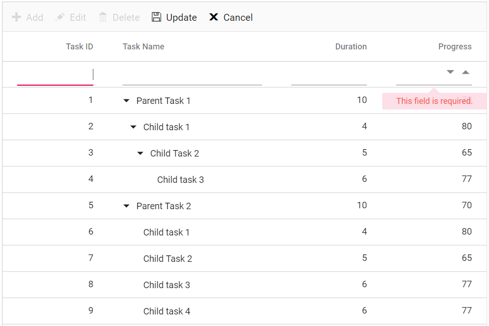
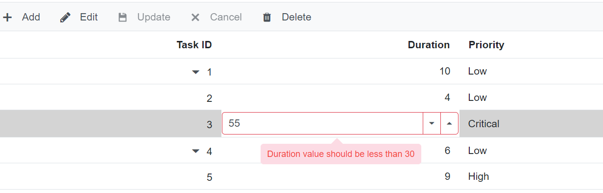
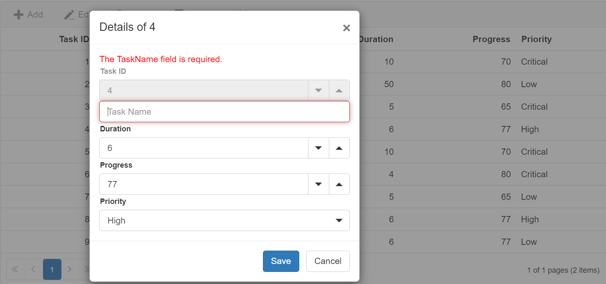

# Column validation in Blazor TreeGrid Component

Column validation validates edited or added row data and displays errors for invalid fields before saving. TreeGrid uses the **Form Validator** component for column validation. Define validation rules using the [TreeGridColumn.ValidationRules](https://help.syncfusion.com/cr/blazor/Syncfusion.Blazor~Syncfusion.Blazor.TreeGrid.TreeGridColumn~ValidationRules.html) property.

N> Prerequisites: enable editing in [TreeGridEditSettings](https://help.syncfusion.com/cr/blazor/Syncfusion.Blazor~Syncfusion.Blazor.TreeGrid.TreeGridEditSettings.html) as needed (AllowEditing/AllowAdding/AllowDeleting), and define a primary key column (IsPrimaryKey) to support CRUD operations.

```cshtml
@using TreeGridComponent.Data; 
@using Syncfusion.Blazor.TreeGrid; 

<SfTreeGrid DataSource="@TreeGridData" IdMapping="TaskId" 
ParentIdMapping="ParentId" TreeColumnIndex="1" 
Toolbar="@(new List<string>() { "Add", "Edit", "Delete", "Update", "Cancel" })">
    <TreeGridEditSettings AllowEditing="true" AllowAdding="true" AllowDeleting="true"
    ShowDeleteConfirmDialog="true" />
    <TreeGridColumns>
        <TreeGridColumn Field="TaskId" HeaderText="Task ID" IsPrimaryKey="true" 
        Width="80" TextAlign="Syncfusion.Blazor.Grids.TextAlign.Right">
        </TreeGridColumn>
        <TreeGridColumn Field="TaskName" HeaderText="Task Name" Width="160">
        </TreeGridColumn>
        <TreeGridColumn Field="Duration" HeaderText="Duration" Width="100"
        TextAlign="Syncfusion.Blazor.Grids.TextAlign.Right">
        </TreeGridColumn>
        <TreeGridColumn Field="Progress" HeaderText="Progress" Width="100" 
        ValidationRules="@(new Syncfusion.Blazor.Grids.ValidationRules { Number = true,
        Min = 0 })" EditType="Syncfusion.Blazor.Grids.EditType.NumericEdit"
        TextAlign="Syncfusion.Blazor.Grids.TextAlign.Right">
        </TreeGridColumn>
    </TreeGridColumns>
</SfTreeGrid>

@code{

    public List<TreeData.BusinessObject> TreeGridData { get; set; }

    protected override void OnInitialized()
    {       
        this.TreeGridData = TreeData.GetSelfDataSource().ToList();
    }

    public class TreeData
    {
        public class BusinessObject
        {
            public int TaskId { get; set;}
            public string TaskName { get; set;}
            public int? Duration { get; set;}
            public int? Progress { get; set;}
            public int? ParentId { get; set;}
        }

        public static List<BusinessObject> GetSelfDataSource()
        {
            List<BusinessObject> BusinessObjectCollection = new List<BusinessObject>();
            BusinessObjectCollection.Add(new BusinessObject() { TaskId = 1,
            TaskName = "Parent Task 1",Duration = 10,Progress = 70,ParentId = null });
            BusinessObjectCollection.Add(new BusinessObject() { TaskId = 2,
            TaskName = "Child task 1",Progress = 80,ParentId = 1 });
            BusinessObjectCollection.Add(new BusinessObject() { TaskId = 3,
            TaskName = "Child Task 2",Duration = 5,Progress = 65,ParentId = 2 });
            BusinessObjectCollection.Add(new BusinessObject() { TaskId = 4,
            TaskName = "Child task 3",Duration = 6,Progress = 77,ParentId = 3 });
            BusinessObjectCollection.Add(new BusinessObject() { TaskId = 5,
            TaskName = "Parent Task 2",Duration = 10,Progress = 70,ParentId = null,
            IsParent = true,});
            BusinessObjectCollection.Add(new BusinessObject() { TaskId = 6,
            TaskName = "Child task 1",Duration = 4,Progress = 80,ParentId = 5});
            BusinessObjectCollection.Add(new BusinessObject() { TaskId = 7,
            TaskName = "Child Task 2",Duration = 5,Progress = 65,ParentId = 5});
            BusinessObjectCollection.Add(new BusinessObject() { TaskId = 8,
            TaskName = "Child task 3",Duration = 6,Progress = 77,ParentId = 5});
            BusinessObjectCollection.Add(new BusinessObject() { TaskId = 9,
            TaskName = "Child task 4",Duration = 6,Progress = 77,ParentId = 5});
            return BusinessObjectCollection;
        }
    }
}
```

The following image shows column validation errors displayed for the Progress field.


## Custom validation

Custom validation enables implementing validations based on application-specific rules.

Create a validation attribute by inheriting from ValidationAttribute and overriding the IsValid method. Apply the attribute to the corresponding model property in the TreeGrid data source class. The example below applies custom validations to the `Duration` and `Priority` fields.

```cshtml
@using TreeGridComponent. Data; 
@using Syncfusion. Blazor. TreeGrid; 
@using System. ComponentModel. DataAnnotations; 

<SfTreeGrid TValue="BusinessObject" DataSource="@TreeData" IdMapping="TaskId" ParentIdMapping="ParentId" TreeColumnIndex="0"
Toolbar="@(new List<string>() { "Edit", "Update", "Cancel" })">
    <TreeGridEditSettings Mode="Syncfusion.Blazor.TreeGrid.EditMode.Cell" NewRowPosition="RowPosition.Child"
                          AllowEditing="true" AllowAdding="true" AllowDeleting="true" ShowDeleteConfirmDialog="true" />
    <TreeGridColumns>
        <TreeGridColumn Field="TaskId" HeaderText="Task ID" Width="80" IsPrimaryKey="true" TextAlign="Syncfusion.Blazor.Grids.TextAlign.Right"></TreeGridColumn>
        <TreeGridColumn Field="TaskName" HeaderText="Task Name" Width="145"></TreeGridColumn>
        <TreeGridColumn Field="Duration" HeaderText="Duration" Width="100" EditType="Syncfusion.Blazor.Grids.EditType.NumericEdit" TextAlign="Syncfusion.Blazor.Grids.TextAlign.Right"></TreeGridColumn>
        <TreeGridColumn Field="Progress" HeaderText="Progress" Width="100"></TreeGridColumn>
        <TreeGridColumn Field="Priority" HeaderText="Priority" Width="100" EditType="Syncfusion.Blazor.Grids.EditType.DefaultEdit" TextAlign="Syncfusion.Blazor.Grids.TextAlign.Right"></TreeGridColumn>
    </TreeGridColumns>

</SfTreeGrid>

@code{

    public List<BusinessObject> TreeData = new List<BusinessObject>();
    protected override void OnInitialized()
    {
        TreeData.Add(new BusinessObject() { TaskId = 1, TaskName = "Parent Task 1", Duration = 10, Progress = 70, ParentId = null, Priority = "High" });
        TreeData.Add(new BusinessObject() { TaskId = 2, TaskName = "Child task 1", Duration = 4, Progress = 80, ParentId = 1, Priority = "Normal" });
        TreeData.Add(new BusinessObject() { TaskId = 3, TaskName = "Child Task 2", Duration = 5, Progress = 65, ParentId = 1, Priority = "Critical" });
        TreeData.Add(new BusinessObject() { TaskId = 4, TaskName = "Parent Task 2", Duration = 6, Progress = 77, ParentId = null, Priority = "Low" });
        TreeData.Add(new BusinessObject() { TaskId = 5, TaskName = "Child Task 5", Duration = 9, Progress = 25, ParentId = 4, Priority = "Normal" });
        TreeData.Add(new BusinessObject() { TaskId = 6, TaskName = "Child Task 6", Duration = 9, Progress = 7, ParentId = 5, Priority = "Normal" });
        TreeData.Add(new BusinessObject() { TaskId = 7, TaskName = "Parent Task 3", Duration = 4, Progress = 45, ParentId = null, Priority = "High" });
        TreeData.Add(new BusinessObject() { TaskId = 8, TaskName = "Child Task 7", Duration = 3, Progress = 38, ParentId = 7, Priority = "Critical" });
        TreeData.Add(new BusinessObject() { TaskId = 9, TaskName = "Child Task 8", Duration = 7, Progress = 70, ParentId = 7, Priority = "Low" });
    }
    public class CustomValidationDuration : ValidationAttribute
    {
        protected override ValidationResult IsValid(object value, ValidationContext validationContext)
        {
            if (value != null && value != "")
            {
                int duration = (int)value;
                if (duration >= 1 && duration <= 20)
                {
                    return ValidationResult.Success;
                }
                else
                {
                    return new ValidationResult("Duration is not as expected, try between 1 and 20");
                }
            }
            else
            {
                return new ValidationResult("No Value");
            }
        }
    }
    public class CustomValidationPriority : ValidationAttribute
    {
        protected override ValidationResult IsValid(object value, ValidationContext validationContext)
        {
            // added condition check for empty string 
            if (value != null && value != "")
            {
                string name = value.ToString();
                if (name.Length >= 1 && name.Length <= 7)
                {
                    return ValidationResult.Success;
                }
                else
                {
                    return new ValidationResult("Priority text length is not as expected");
                }
            }
            else
            {
                return new ValidationResult("No Value");
            }
        }
    }

}

```

```cshtml

namespace TreeGridComponent. Data
{

    public class BusinessObject
    {
        [Required]
        public int? TaskId { get; set; }
        public string TaskName { get; set; }
        [CustomValidationDuration]
        public int? Duration { get; set; }

        public int Progress { get; set; }
        [CustomValidationPriority]

        public string Priority { get; set; }

        public int? ParentId { get; set; }
    }

}

```

## Custom validator component

In addition to built-in validation and custom attributes, a custom validator component can validate the TreeGrid edit form. Use the `Validator` property of the `TreeGridEditSettings` component to inject a validator component into the edit form. Within the `Validator`, access form state and show messages using the implicit `context` parameter of type [ValidatorTemplateContext](https://help.syncfusion.com/cr/blazor/Syncfusion.Blazor.Grids.ValidatorTemplateContext.html).

For creating a form validator component you can refer [here](https://learn.microsoft.com/en-us/aspnet/core/blazor/forms/?view=aspnetcore-8.0#validator-components).

In the following example:
- A custom form validator component named `MyCustomValidator` accepts a [ValidatorTemplateContext](https://help.syncfusion.com/cr/blazor/Syncfusion.Blazor.Grids.ValidatorTemplateContext.html) parameter.
- The `MyCustomValidator` component is used inside the `Validator` property.
- The validator checks whether the Duration value is between 0 and 30.
- Validation errors are displayed using the `ValidationMessage` component.





using Microsoft. AspNetCore. Components; 
using Microsoft. AspNetCore. Components. Forms; 
using Syncfusion. Blazor. Grids; 

public class MyCustomValidator : ComponentBase
{

    [Parameter]
    public ValidatorTemplateContext context { get; set; }

    private ValidationMessageStore messageStore;

    WeatherForecastService Service = new WeatherForecastService();

    [CascadingParameter]
    private EditContext CurrentEditContext { get; set; }

    protected override void OnInitialized()
    {
        messageStore = new ValidationMessageStore(CurrentEditContext);

        CurrentEditContext.OnValidationRequested += ValidateRequested;
        CurrentEditContext.OnFieldChanged += ValidateField;
    }
    protected void HandleValidation(FieldIdentifier identifier)
    {
        //validate your requirment column
        if (identifier.FieldName.Equals("Duration"))
        {
            messageStore.Clear(identifier);

            if ((context.EditContext.Model as Tree).Duration < 0)
            {
                messageStore.Add(identifier, "Duration value should be greater than 0");
            }
            else if ((context.EditContext.Model as Tree).Duration > 30)
            {
                messageStore.Add(identifier, "Duration value should be less than 30");
            }
            else
            {
                messageStore.Clear(identifier);
            }
        }
        if (identifier.FieldName.Equals("TaskId"))
        {
            messageStore.Clear(identifier);

            if ((context.EditContext.Model as Tree).TaskId <= 0 || (context.EditContext.Model as Tree).TaskId == null)
            {
                messageStore.Add(identifier, "Task ID should not be empty value");
            }
            else
            {
                messageStore.Clear(identifier);
            }
        }
    }
    protected void ValidateField(object editContext, FieldChangedEventArgs fieldChangedEventArgs)
    {
        HandleValidation(fieldChangedEventArgs.FieldIdentifier);
    }
    private void ValidateRequested(object editContext, ValidationRequestedEventArgs validationEventArgs)
    {
        //here call the filed you want to validate
        string[] fields = new string[] { "Duration", "TaskId" };
        foreach (var field in fields)
        {
            HandleValidation(CurrentEditContext.Field(field));
        }
    }

}









@using TreeGridComponent. Data; 
@using Syncfusion. Blazor. TreeGrid; 
@inject WeatherForecastService ForecastService

<SfTreeGrid @ref="TreeGrid" TValue="Tree" DataSource="GridData" IdMapping="TaskId" ParentIdMapping="ParentId" TreeColumnIndex="0"

            Toolbar="@(new List<string>() { "Add", "Edit", "Update", "Cancel", "Delete" })">
    <TreeGridEditSettings AllowAdding="true" AllowEditing="true" AllowDeleting="true"
                          Mode="Syncfusion.Blazor.TreeGrid.EditMode.Dialog">
        <Validator>
            @{
                ValidatorTemplateContext txt = context as ValidatorTemplateContext;
            }
            <MyCustomValidator context="@txt"></MyCustomValidator>
            <ValidationMessage For="@(() => (txt.EditContext.Model as Tree).Duration)"></ValidationMessage>
        </Validator>

    </TreeGridEditSettings>
    <TreeGridColumns>
        <TreeGridColumn Field=@nameof(Tree.TaskId) HeaderText="Task ID" IsPrimaryKey="true" TextAlign="TextAlign.Right" Width="120"></TreeGridColumn>
        <TreeGridColumn Field=@nameof(Tree.Priority) HeaderText="Priority" Width="120"></TreeGridColumn>
        <TreeGridColumn Field=@nameof(Tree.Duration) HeaderText="Duration" TextAlign="TextAlign.Right" Width="120"></TreeGridColumn>
    </TreeGridColumns>

</SfTreeGrid>

@code{

    SfTreeGrid<Tree> TreeGrid { get; set; }
    private List<Tree> GridData;
    protected override void OnInitialized()
    {
        GridData = ForecastService.GetTree();
    }

}





namespace TreeGridComponent. Data
{

    public class Tree
    {
        [Required(ErrorMessage = "Task ID  should not be empty")]
        public int? TaskId { get; set; }

        [Required(ErrorMessage = "Task Name  should not be empty")]
        public string TaskName { get; set; }

        public string Priority { get; set; }

        public int? Duration { get; set; }
        public int? ParentId { get; set; }

    }
    public static List<Tree> list = new List<Tree>();
    public List<Tree> GetTree()
    {
        if (list.Count == 0)
        {
            list.Add(new Tree() { TaskId = 1, TaskName = "Parent Task 1", Duration = 10, ParentId = null, Priority = "Low" });
            list.Add(new Tree() { TaskId = 2, TaskName = "Child task 1", Duration = 4, ParentId = 1, Priority = "Low" });
            list.Add(new Tree() { TaskId = 3, TaskName = "Child Task 2", Duration = 5, ParentId = 1, Priority = "Critical" });
            list.Add(new Tree() { TaskId = 4, TaskName = "Parent Task 2", Duration = 6, ParentId = null, Priority = "Low" });
            list.Add(new Tree() { TaskId = 5, TaskName = "Child Task 5", Duration = 9, ParentId = 4, Priority = "High" });
        }
        return list;
    }

}





The following image shows a TreeGrid using a custom validator component in a dialog edit form.


## Display validation message using in-built tooltip

When using inline or batch editing, placing `ValidationMessage` elements in the template may not be ideal. In such cases, use the built-in validation tooltip by calling the `ValidatorTemplateContext.ShowValidationMessage(fieldName, IsValid, Message)` method.

The following snippet shows the updated `HandleValidation` method of the `MyCustomValidator` component to display tooltip messages.





protected void HandleValidation(FieldIdentifier identifier)
{

    //validate your requirment column
    if (identifier.FieldName.Equals("Duration"))
    {
        messageStore.Clear(identifier);

        if ((context.EditContext.Model as Tree).Duration < 0)
        {
            messageStore.Add(identifier, "Duration value should be greater than 0");
            context.ShowValidationMessage("Duration", false, "Duration value should be greater than 0");
        }
        else if ((context.EditContext.Model as Tree).Duration > 30)
        {
            messageStore.Add(identifier, "Duration value should be less than 30");
            context.ShowValidationMessage("Duration", false, "Duration value should be less than 30");
        }
        else
        {
            messageStore.Clear(identifier);
            context.ShowValidationMessage("Duration", true, null);
        }
    }

}





The following image shows tooltip-based validation messages for a TreeGrid field.


## Disable in-built validator component

The `Validator` property can also disable the built-in validator component used by the TreeGrid. By default, the TreeGrid uses two validator components—`DataAnnotationValidator` and the internal [ValidationRules](https://help.syncfusion.com/cr/blazor/Syncfusion.Blazor.TreeGrid.TreeGridColumn.html#Syncfusion_Blazor_TreeGrid_TreeGridColumn_ValidationRules) property—to handle edit form validation. If only the `DataAnnotationValidator` is required, configure it by using the `Validator` component within [TreeGridEditSettings](https://help.syncfusion.com/cr/blazor/Syncfusion.Blazor~Syncfusion.Blazor.TreeGrid.TreeGridEditSettings.html).





@using TreeGridComponent. Data; 
@using Syncfusion. Blazor. TreeGrid; 

<SfTreeGrid @ref="TreeGrid" TValue="Tree" DataSource="GridData" IdMapping="TaskId" ParentIdMapping="ParentId" TreeColumnIndex="0" 
Toolbar="@(new List<string>() { "Add", "Edit", "Update", "Cancel", "Delete" })">
<TreeGridEditSettings AllowAdding="true" AllowEditing="true" AllowDeleting="true"
                          Mode="Syncfusion. Blazor. TreeGrid. EditMode. Dialog">
        <Validator>
            <DataAnnotationsValidator></DataAnnotationsValidator>
        </Validator>
    </TreeGridEditSettings>
    <TreeGridColumns>
        <TreeGridColumn Field=@nameof(Tree.TaskId) HeaderText="Task ID" IsPrimaryKey="true" TextAlign="TextAlign.Right" Width="120"></TreeGridColumn>
        <TreeGridColumn Field=@nameof(Tree.Priority) HeaderText="Priority" Width="120"></TreeGridColumn>
        <TreeGridColumn Field=@nameof(Tree.Duration) HeaderText="Duration" TextAlign="TextAlign.Right" Width="120"></TreeGridColumn>
    </TreeGridColumns>

</SfTreeGrid>

@code{

    SfTreeGrid<Tree> TreeGrid { get; set; }
    private List<Tree> GridData;
    protected override void OnInitialized()
    {
        GridData = ForecastService.GetTree();
    }

}





namespace TreeGridComponent. Data
{

    public class Tree
    {
        [Required(ErrorMessage = "Task ID  should not be empty")]
        public int? TaskId { get; set; }

        [Required(ErrorMessage = "Task Name  should not be empty")]
        public string TaskName { get; set; }

        public string Priority { get; set; }

        public int? Duration { get; set; }
        public int? ParentId { get; set; }

    }
    public static List<Tree> list = new List<Tree>();
    public List<Tree> GetTree()
    {
        if (list.Count == 0)
        {
            list.Add(new Tree() { TaskId = 1, TaskName = "Parent Task 1", Duration = 10, ParentId = null, Priority = "Low" });
            list.Add(new Tree() { TaskId = 2, TaskName = "Child task 1", Duration = 4, ParentId = 1, Priority = "Low" });
            list.Add(new Tree() { TaskId = 3, TaskName = "Child Task 2", Duration = 5, ParentId = 1, Priority = "Critical" });
            list.Add(new Tree() { TaskId = 4, TaskName = "Parent Task 2", Duration = 6, ParentId = null, Priority = "Low" });
            list.Add(new Tree() { TaskId = 5, TaskName = "Child Task 5", Duration = 9, ParentId = 4, Priority = "High" });
        }
        return list;
    }

}





## Display validation message in dialog template

Use form validation to display a validation message for a column that is not defined in the TreeGrid column set.

The `Validator` property can apply validation rules to fields included in the dialog template even if those fields are not displayed as TreeGrid columns.

In the following example, the `TaskName` field is not defined in the TreeGrid columns, and the validation message for `TaskName` is displayed within the dialog template.

N> For fields not defined as TreeGrid columns, validation messages appear in the validation summary (at the top of the dialog edit form).

```cshtml
@using Syncfusion.Blazor.TreeGrid;
@using Syncfusion.Blazor.Grids;
@using Syncfusion.Blazor.DropDowns;
@using Syncfusion.Blazor.Inputs;
@using System.ComponentModel.DataAnnotations

<SfTreeGrid DataSource="@TreeGridData" AllowPaging="true" IdMapping="TaskId" ParentIdMapping="ParentId" TreeColumnIndex="1" Toolbar="@(new List<string>() { "Add", "Edit", "Delete", "Update", "Cancel" })">
    <TreeGridEvents TValue="TreeData" RowCreated="RowCreatedEventHandler"></TreeGridEvents>
    <TreeGridEditSettings AllowEditing="true" AllowAdding="true" AllowDeleting="true" Mode="Syncfusion.Blazor.TreeGrid.EditMode.Dialog" NewRowPosition="RowPosition.Child">
        <Validator>
            <DataAnnotationsValidator></DataAnnotationsValidator>
        </Validator>
        <Template>
            @{
                var employee = (context as TreeData);
            }
            <div>
                <ValidationMessage For="() => employee.TaskName" />
                <div class="form-row">
                    <div class="form-group col-md-6">
                        <SfNumericTextBox ID="TaskId" @bind-Value="@(employee.TaskId)" Enabled="@Check" FloatLabelType="FloatLabelType.Always" Placeholder="Task ID"></SfNumericTextBox>
                    </div>
                    <div class="form-group col-md-6">
                        <SfAutoComplete TItem="TreeData" ID="TaskName" @bind-Value="@(employee.TaskName)" TValue="string" DataSource="@TreeGridData" Placeholder="Task Name">
                            <AutoCompleteFieldSettings Value="TaskName"></AutoCompleteFieldSettings>
                        </SfAutoComplete>
                    </div>
                </div>
                <div class="form-row">
                    <div class="form-group col-md-6">
                        <SfNumericTextBox ID="Duration" @bind-Value="@(employee.Duration)" TValue="int?" FloatLabelType="FloatLabelType.Always" Placeholder="Duration"></SfNumericTextBox>
                    </div>
                    <div class="form-group col-md-6">
                        <SfNumericTextBox ID="Progress" @bind-Value="@(employee.Progress)" TValue="int?" FloatLabelType="FloatLabelType.Always" Placeholder="Progress"></SfNumericTextBox>
                    </div>
                </div>
                <div class="form-row">
                    <div class="form-group col-md-6">
                        <SfDropDownList ID="Priority" TItem="TreeData" @bind-Value="@(employee.Priority)" TValue="string" DataSource="@TreeGridData" FloatLabelType="FloatLabelType.Always" Placeholder="Priority">
                            <DropDownListFieldSettings Value="Priority" Text="Priority"></DropDownListFieldSettings>
                        </SfDropDownList>
                    </div>
                </div>
            </div>
        </Template>
    </TreeGridEditSettings>
    <TreeGridColumns>
        <TreeGridColumn Field="TaskId" HeaderText="Task ID" IsPrimaryKey="true" Width="80" TextAlign="Syncfusion.Blazor.Grids.TextAlign.Right"></TreeGridColumn>
        <TreeGridColumn Field="TaskName" HeaderText="Task Name" Width="160"></TreeGridColumn>
        <TreeGridColumn Field="Duration" HeaderText="Duration" Width="100" TextAlign="Syncfusion.Blazor.Grids.TextAlign.Right"></TreeGridColumn>
        <TreeGridColumn Field="Progress" HeaderText="Progress" Width="100" TextAlign="Syncfusion.Blazor.Grids.TextAlign.Right"></TreeGridColumn>
        <TreeGridColumn Field="Priority" HeaderText="Priority" Width="80"></TreeGridColumn>
    </TreeGridColumns>
</SfTreeGrid>

<style>
    .form-group.col-md-6 {
        width: 400px;
    }

    label.e-float-text {
        position: relative;
        padding-left: 0;
        top: 10%;
    }
</style>

@code {
    private Boolean Check = false;

    public List<TreeData> TreeGridData { get; set; }

    protected override void OnInitialized()
    {
        this.TreeGridData = TreeData.GetSelfDataSource().ToList();
    }

    private void RowCreatedEventHandler(RowCreatedEventArgs<TreeData> args)
    {
        Check = true;
    }
    public class TreeData
    {
        public int TaskId { get; set; }
        [Required]
        public string TaskName { get; set; }
        public int? Duration { get; set; }
        public int? Progress { get; set; }
        public string Priority { get; set; }
        public int? ParentId { get; set; }

        public static List<TreeData> GetSelfDataSource()
        {
            List<TreeData> TreeDataCollection = new List<TreeData>();
            TreeDataCollection.Add(new TreeData() { TaskId = 1, TaskName = "Parent Task 1", Duration = 10, Progress = 70, Priority = "Critical", ParentId = null });
            TreeDataCollection.Add(new TreeData() { TaskId = 2, TaskName = "Child task 1", Progress = 80, Priority = "Low", Duration = 50, ParentId = 1 });
            TreeDataCollection.Add(new TreeData() { TaskId = 3, TaskName = "Child Task 2", Duration = 5, Progress = 65, Priority = "Critical", ParentId = 2 });
            TreeDataCollection.Add(new TreeData() { TaskId = 4, TaskName = "Child task 3", Duration = 6, Priority = "High", Progress = 77, ParentId = 3 });
            TreeDataCollection.Add(new TreeData() { TaskId = 5, TaskName = "Parent Task 2", Duration = 10, Progress = 70, Priority = "Critical", ParentId = null });
            TreeDataCollection.Add(new TreeData() { TaskId = 6, TaskName = "Child task 1", Duration = 4, Progress = 80, Priority = "Critical", ParentId = 5 });
            TreeDataCollection.Add(new TreeData() { TaskId = 7, TaskName = "Child Task 2", Duration = 5, Progress = 65, Priority = "Low", ParentId = 5 });
            TreeDataCollection.Add(new TreeData() { TaskId = 8, TaskName = "Child task 3", Duration = 6, Progress = 77, Priority = "High", ParentId = 5 });
            TreeDataCollection.Add(new TreeData() { TaskId = 9, TaskName = "Child task 4", Duration = 6, Progress = 77, Priority = "Low", ParentId = 5 });
            return TreeDataCollection;
        }
    }
}

```

The following image shows how validation messages can be displayed from a dialog template for fields not defined as columns.
