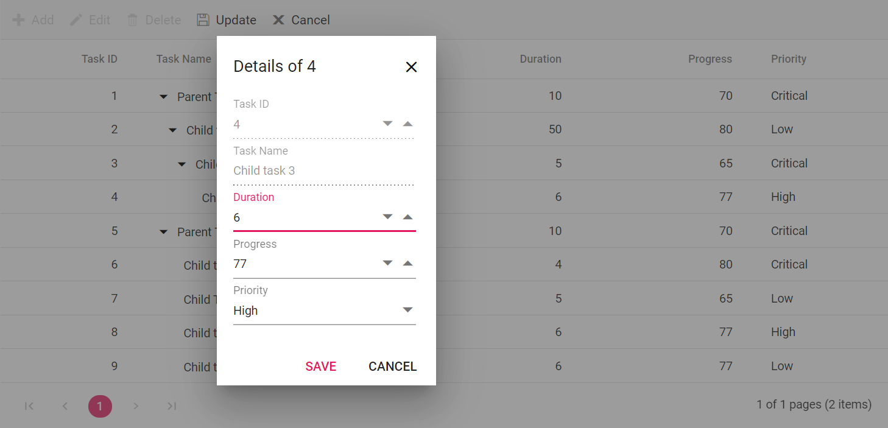
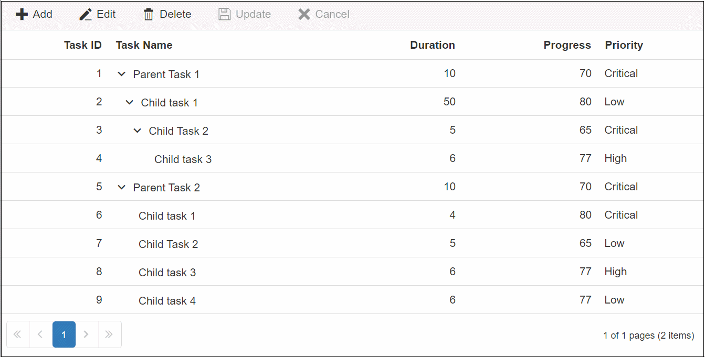

# Template Editing in Blazor TreeGrid Component

## Dialog template

The following video demonstrates how to customize the Dialog Template in the Blazor TreeGrid.



Dialog template editing enables customizing the default edit dialog. To use a dialog template, set [TreeGridEditSettings.Mode](https://help.syncfusion.com/cr/blazor/Syncfusion.Blazor.TreeGrid.TreeGridEditSettings.html#Syncfusion_Blazor_TreeGrid_TreeGridEditSettings_Mode) to Dialog and define the [Template](https://help.syncfusion.com/cr/blazor/Syncfusion.Blazor.TreeGrid.TreeGridEditSettings.html#Syncfusion_Blazor_TreeGrid_TreeGridEditSettings_Template) in **TreeGridEditSettings**.

Use a dialog template when additional field editors are required that are not present in the column model. The template is bound to the current row context, allowing custom editors to read and update field values.





@using TreeGridComponent.Data;
@using Syncfusion.Blazor.TreeGrid;
@using Syncfusion.Blazor.DropDowns;
@using Syncfusion.Blazor.Inputs
@using Syncfusion.Blazor.Grids

<SfTreeGrid DataSource="@TreeGridData" AllowPaging="true" IdMapping="TaskId" ParentIdMapping="ParentId" TreeColumnIndex="1" Toolbar="@(new List<string>() { "Add", "Edit", "Delete", "Update", "Cancel" })">
    <TreeGridEvents TValue="TreeData" RowCreated="RowCreatedHandler"></TreeGridEvents>
    <TreeGridEditSettings AllowEditing="true" AllowAdding="true" AllowDeleting="true" Mode="Syncfusion.Blazor.TreeGrid.EditMode.Dialog" NewRowPosition="RowPosition.Child">
        <Template>
            @{
               var employee = (context as TreeData);
             }
            

                

                    

                        <SfNumericTextBox ID="TaskId" @bind-Value="@(employee.TaskId)" Enabled="@Check" FloatLabelType="FloatLabelType.Always" Placeholder="Task ID"></SfNumericTextBox>
                    

                    

                        <SfAutoComplete TItem="TreeData" ID="TaskName" @bind-Value="@(employee.TaskName)" TValue="string" DataSource="@TreeGridData" FloatLabelType="FloatLabelType.Always" Placeholder="Task Name">
                            <AutoCompleteFieldSettings Value="TaskName"></AutoCompleteFieldSettings>
                        </SfAutoComplete>
                    

                

                

                    

                        <SfNumericTextBox ID="Duration" @bind-Value="@(employee.Duration)" TValue="int?" FloatLabelType="FloatLabelType.Always" Placeholder="Duration"></SfNumericTextBox>
                    

                    

                        <SfNumericTextBox ID="Progress" @bind-Value="@(employee.Progress)" TValue="int?" FloatLabelType="FloatLabelType.Always" Placeholder="Progress"></SfNumericTextBox>
                    

                

                

                    

                        <SfDropDownList ID="Priority" TItem="TreeData" @bind-Value="@(employee.Priority)" TValue="string" DataSource="@TreeGridData" FloatLabelType="FloatLabelType.Always" Placeholder="Priority">
                            <DropDownListFieldSettings Value="Priority" Text="Priority"></DropDownListFieldSettings>
                        </SfDropDownList>
                    
                    
                
                
            

        </Template>
    </TreeGridEditSettings>
    <TreeGridColumns>
        <TreeGridColumn Field="TaskId" HeaderText="Task ID" IsPrimaryKey="true" Width="80" TextAlign="Syncfusion.Blazor.Grids.TextAlign.Right"></TreeGridColumn>
        <TreeGridColumn Field="TaskName" HeaderText="Task Name" Width="160"></TreeGridColumn>
        <TreeGridColumn Field="Duration" HeaderText="Duration" Width="100" TextAlign="Syncfusion.Blazor.Grids.TextAlign.Right"></TreeGridColumn>
        <TreeGridColumn Field="Progress" HeaderText="Progress" Width="100" TextAlign="Syncfusion.Blazor.Grids.TextAlign.Right"></TreeGridColumn>
        <TreeGridColumn Field="Priority" HeaderText="Priority" Width="80"></TreeGridColumn>
    </TreeGridColumns>
</SfTreeGrid>

@code{

    private Boolean Check = false;

    public List<TreeData> TreeGridData { get; set; }

    protected override void OnInitialized()
    {
        this.TreeGridData = TreeData.GetSelfDataSource().ToList();
    }

    public void RowCreatedHandler(RowCreatedEventArgs<TreeData.BusinessObject> args)
    {
        Check = true;
    }
}





namespace TreeGridComponent.Data {

public class TreeData
    {
            public int TaskId { get; set;}
            public string TaskName { get; set;}
            public int? Duration { get; set;}
            public int? Progress { get; set;}
            public string Priority { get; set;}
            public int? ParentId { get; set;}
       
        public static List<TreeData> GetSelfDataSource()
        {
            List<TreeData> TreeDataCollection = new List<TreeData>();
            TreeDataCollection.Add(new TreeData() { TaskId = 1,TaskName = "Parent Task 1",Duration = 10,Progress = 70,Priority = "Critical",ParentId = null});
            TreeDataCollection.Add(new TreeData() { TaskId = 2,TaskName = "Child task 1",Progress = 80,Priority = "Low",Duration = 50,ParentId = 1 });
            TreeDataCollection.Add(new TreeData() { TaskId = 3,TaskName = "Child Task 2",Duration = 5,Progress = 65,Priority = "Critical",ParentId = 2 });
            TreeDataCollection.Add(new TreeData() { TaskId = 4,TaskName = "Child task 3",Duration = 6,Priority = "High",Progress = 77,ParentId = 3 });
            TreeDataCollection.Add(new TreeData() { TaskId = 5,TaskName = "Parent Task 2",Duration = 10,Progress = 70,Priority = "Critical",ParentId = null});
            TreeDataCollection.Add(new TreeData() { TaskId = 6,TaskName = "Child task 1",Duration = 4,Progress = 80,Priority = "Critical",ParentId = 5});
            TreeDataCollection.Add(new TreeData() { TaskId = 7,TaskName = "Child Task 2",Duration = 5,Progress = 65,Priority = "Low",ParentId = 5});
            TreeDataCollection.Add(new TreeData() { TaskId = 8,TaskName = "Child task 3",Duration = 6,Progress = 77,Priority = "High",ParentId = 5});
            TreeDataCollection.Add(new TreeData() { TaskId = 9,TaskName = "Child task 4",Duration = 6,Progress = 77,Priority = "Low",ParentId = 5});
            return TreeDataCollection;
        }
    }
}





N> Ensure that each template form editor includes a **name** attribute.

### Disable components in dialog template

Specific components rendered inside the dialog template can be disabled based on data source values. Use the component’s Enabled property to control whether it is enabled or disabled.

In the following example, the [BeforeRowEditing](https://help.syncfusion.com/cr/blazor/Syncfusion.Blazor.TreeGrid.TreeGridEvents-1.html#Syncfusion_Blazor_TreeGrid_TreeGridEvents_1_BeforeRowEditing) event sets the Enabled property of the **TaskId** and **TaskName** editors to false.





@using TreeGridComponent.Data;
@using Syncfusion.Blazor.TreeGrid;
@using Syncfusion.Blazor.Calendars
@using Syncfusion.Blazor.DropDowns
@using Syncfusion.Blazor.Inputs
@using Syncfusion.Blazor.Grids;

<SfTreeGrid DataSource="@TreeGridData" AllowPaging="true" IdMapping="TaskId" ParentIdMapping="ParentId" TreeColumnIndex="1" Toolbar="@(new List<string>() { "Add", "Edit", "Delete", "Update", "Cancel" })">
    <TreeGridEvents TValue="TreeData" BeforeRowEditing="BeforeRowEditingHandler"></TreeGridEvents>
    <TreeGridEditSettings AllowEditing="true" AllowAdding="true" AllowDeleting="true" Mode="Syncfusion.Blazor.TreeGrid.EditMode.Dialog" NewRowPosition="RowPosition.Child">
        <Template>
            @{
               var employee = (context as TreeData);
             }
            

                

                    

                        <SfNumericTextBox ID="TaskId" @bind-Value="@(employee.TaskId)" Enabled="@Enabled" FloatLabelType="FloatLabelType.Always" Placeholder="Task ID"></SfNumericTextBox>
                    

                    

                        <SfAutoComplete TItem="TreeData" ID="TaskName" Enabled="@Enabled" @bind-Value="@(employee.TaskName)" TValue="string" DataSource="@TreeGridData" FloatLabelType="FloatLabelType.Always" Placeholder="Task Name">
                            <AutoCompleteFieldSettings Value="TaskName"></AutoCompleteFieldSettings>
                        </SfAutoComplete>
                    

                

                

                    

                        <SfNumericTextBox ID="Duration" @bind-Value="@(employee.Duration)" TValue="int?" FloatLabelType="FloatLabelType.Always" Placeholder="Duration"></SfNumericTextBox>
                    

                    

                        <SfNumericTextBox ID="Progress" @bind-Value="@(employee.Progress)" TValue="int?" FloatLabelType="FloatLabelType.Always" Placeholder="Progress"></SfNumericTextBox>
                    

                

                

                    

                        <SfDropDownList ID="Priority" TItem="TreeData" @bind-Value="@(employee.Priority)" TValue="string" DataSource="@TreeGridData" FloatLabelType="FloatLabelType.Always" Placeholder="Priority">
                            <DropDownListFieldSettings Value="Priority" Text="Priority"></DropDownListFieldSettings>
                        </SfDropDownList>
                    
                    
                
                
            

        </Template>
    </TreeGridEditSettings>
    <TreeGridColumns>
        <TreeGridColumn Field="TaskId" HeaderText="Task ID" IsPrimaryKey="true" Width="80" TextAlign="Syncfusion.Blazor.Grids.TextAlign.Right"></TreeGridColumn>
        <TreeGridColumn Field="TaskName" HeaderText="Task Name" Width="160"></TreeGridColumn>
        <TreeGridColumn Field="Duration" HeaderText="Duration" Width="100" TextAlign="Syncfusion.Blazor.Grids.TextAlign.Right"></TreeGridColumn>
        <TreeGridColumn Field="Progress" HeaderText="Progress" Width="100" TextAlign="Syncfusion.Blazor.Grids.TextAlign.Right"></TreeGridColumn>
        <TreeGridColumn Field="Priority" HeaderText="Priority" Width="80"></TreeGridColumn>
    </TreeGridColumns>
</SfTreeGrid>

@code{

    public bool Enabled = true;

    public List<TreeData> TreeGridData { get; set; }

    protected override void OnInitialized()
    {
        this.TreeGridData = TreeData.GetSelfDataSource().ToList();
    }

    public void BeforeRowEditingHandler(OnRowEditStartEventArgs args)
    {
        // The Textbox component is disabled using its Enabled property
        this.Enabled = false;       
    }
}





namespace TreeGridComponent.Data {

public class TreeData
    {
            public int TaskId { get; set;}
            public string TaskName { get; set;}
            public int? Duration { get; set;}
            public int? Progress { get; set;}
            public string Priority { get; set;}
            public int? ParentId { get; set;}
       
        public static List<TreeData> GetSelfDataSource()
        {
            List<TreeData> TreeDataCollection = new List<TreeData>();
            TreeDataCollection.Add(new TreeData() { TaskId = 1,TaskName = "Parent Task 1",Duration = 10,Progress = 70,Priority = "Critical",ParentId = null});
            TreeDataCollection.Add(new TreeData() { TaskId = 2,TaskName = "Child task 1",Progress = 80,Priority = "Low",Duration = 50,ParentId = 1 });
            TreeDataCollection.Add(new TreeData() { TaskId = 3,TaskName = "Child Task 2",Duration = 5,Progress = 65,Priority = "Critical",ParentId = 2 });
            TreeDataCollection.Add(new TreeData() { TaskId = 4,TaskName = "Child task 3",Duration = 6,Priority = "High",Progress = 77,ParentId = 3 });
            TreeDataCollection.Add(new TreeData() { TaskId = 5,TaskName = "Parent Task 2",Duration = 10,Progress = 70,Priority = "Critical",ParentId = null});
            TreeDataCollection.Add(new TreeData() { TaskId = 6,TaskName = "Child task 1",Duration = 4,Progress = 80,Priority = "Critical",ParentId = 5});
            TreeDataCollection.Add(new TreeData() { TaskId = 7,TaskName = "Child Task 2",Duration = 5,Progress = 65,Priority = "Low",ParentId = 5});
            TreeDataCollection.Add(new TreeData() { TaskId = 8,TaskName = "Child task 3",Duration = 6,Progress = 77,Priority = "High",ParentId = 5});
            TreeDataCollection.Add(new TreeData() { TaskId = 9,TaskName = "Child task 4",Duration = 6,Progress = 77,Priority = "Low",ParentId = 5});
            return TreeDataCollection;
        }
    }
}





The following image shows the dialog template with disabled components.

### Set focus to editor

By default, the first input element in the dialog is focused when it opens. If the first input element is disabled or hidden, set focus to a specific input in the component’s [Created](https://help.syncfusion.com/cr/blazor/Syncfusion.Blazor.DropDowns.AutoCompleteEvents-2.html#Syncfusion_Blazor_DropDowns_AutoCompleteEvents_2_Created) or [DataBound](https://help.syncfusion.com/cr/blazor/Syncfusion.Blazor.DropDowns.AutoCompleteEvents-2.html#Syncfusion_Blazor_DropDowns_AutoCompleteEvents_2_DataBound) event.

In the following example, the first input element is disabled, so the **TaskName** editor is focused by calling its [FocusIn](https://help.syncfusion.com/cr/blazor/Syncfusion.Blazor.DropDowns.SfDropDownList-2.html#Syncfusion_Blazor_DropDowns_SfDropDownList_2_FocusIn) method in the AutoComplete component’s `DataBound` event.





@using TreeGridComponent.Data;
@using Syncfusion.Blazor.TreeGrid;
@using Syncfusion.Blazor.Calendars
@using Syncfusion.Blazor.DropDowns
@using Syncfusion.Blazor.Inputs
@using Syncfusion.Blazor.Grids;

<SfTreeGrid DataSource="@TreeGridData" AllowPaging="true" IdMapping="TaskId" ParentIdMapping="ParentId" TreeColumnIndex="1" Toolbar="@(new List<string>() { "Add", "Edit", "Delete", "Update", "Cancel" })">
    <TreeGridEditSettings AllowEditing="true" AllowAdding="true" AllowDeleting="true" Mode="Syncfusion.Blazor.TreeGrid.EditMode.Dialog" NewRowPosition="RowPosition.Child">
        <Template>
            @{
               var employee = (context as TreeData);
             }
            

                

                    

                        <SfNumericTextBox ID="TaskId" @bind-Value="@(employee.TaskId)" Enabled="@((employee.TaskId == null) ? true : false)" Placeholder="Task ID"></SfNumericTextBox>
                    

                    

                        <SfAutoComplete TItem="TreeData" ID="TaskName" @bind-Value="@(employee.TaskName)" TValue="string" DataSource="@TreeGridData" FloatLabelType="FloatLabelType.Always" Placeholder="Task Name">
                            <AutoCompleteFieldSettings Value="TaskName"></AutoCompleteFieldSettings>
                            <AutoCompleteEvents TValue="string" TItem="TreeData" DataBound="FocusAutoComplete"></AutoCompleteEvents>
                        </SfAutoComplete>
                    

                

                

                    

                        <SfNumericTextBox ID="Duration" @bind-Value="@(employee.Duration)" TValue="int?" FloatLabelType="FloatLabelType.Always" Placeholder="Duration"></SfNumericTextBox>
                    

                    

                        <SfNumericTextBox ID="Progress" @bind-Value="@(employee.Progress)" TValue="int?" FloatLabelType="FloatLabelType.Always" Placeholder="Progress"></SfNumericTextBox>
                    

                

                

                    

                        <SfDropDownList ID="Priority" TItem="TreeData" @bind-Value="@(employee.Priority)" TValue="string" DataSource="@TreeGridData" FloatLabelType="FloatLabelType.Always" Placeholder="Priority">
                            <DropDownListFieldSettings Value="Priority" Text="Priority"></DropDownListFieldSettings>
                        </SfDropDownList>
                    
                    
                
                
            

        </Template>
    </TreeGridEditSettings>
    <TreeGridColumns>
        <TreeGridColumn Field="TaskId" HeaderText="Task ID" IsPrimaryKey="true" Width="80" TextAlign="Syncfusion.Blazor.Grids.TextAlign.Right"></TreeGridColumn>
        <TreeGridColumn Field="TaskName" HeaderText="Task Name" Width="160"></TreeGridColumn>
        <TreeGridColumn Field="Duration" HeaderText="Duration" Width="100" TextAlign="Syncfusion.Blazor.Grids.TextAlign.Right"></TreeGridColumn>
        <TreeGridColumn Field="Progress" HeaderText="Progress" Width="100" TextAlign="Syncfusion.Blazor.Grids.TextAlign.Right"></TreeGridColumn>
        <TreeGridColumn Field="Priority" HeaderText="Priority" Width="80"></TreeGridColumn>
    </TreeGridColumns>
</SfTreeGrid>

@code{

    SfAutoComplete<string, TreeData> AutoComplete { get; set; }

    public List<TreeData> TreeGridData { get; set; }

    protected override void OnInitialized()
    {
        this.TreeGridData = TreeData.GetSelfDataSource().ToList();
    }
    private async Task FocusAutoComplete() {
        await this.AutoComplete.FocusIn();
    }
}





namespace TreeGridComponent.Data {

public class TreeData
    {
            public int TaskId { get; set;}
            public string TaskName { get; set;}
            public int? Duration { get; set;}
            public int? Progress { get; set;}
            public string Priority { get; set;}
            public int? ParentId { get; set;}
       
        public static List<TreeData> GetSelfDataSource()
        {
            List<TreeData> TreeDataCollection = new List<TreeData>();
            TreeDataCollection.Add(new TreeData() { TaskId = 1,TaskName = "Parent Task 1",Duration = 10,Progress = 70,Priority = "Critical",ParentId = null});
            TreeDataCollection.Add(new TreeData() { TaskId = 2,TaskName = "Child task 1",Progress = 80,Priority = "Low",Duration = 50,ParentId = 1 });
            TreeDataCollection.Add(new TreeData() { TaskId = 3,TaskName = "Child Task 2",Duration = 5,Progress = 65,Priority = "Critical",ParentId = 2 });
            TreeDataCollection.Add(new TreeData() { TaskId = 4,TaskName = "Child task 3",Duration = 6,Priority = "High",Progress = 77,ParentId = 3 });
            TreeDataCollection.Add(new TreeData() { TaskId = 5,TaskName = "Parent Task 2",Duration = 10,Progress = 70,Priority = "Critical",ParentId = null});
            TreeDataCollection.Add(new TreeData() { TaskId = 6,TaskName = "Child task 1",Duration = 4,Progress = 80,Priority = "Critical",ParentId = 5});
            TreeDataCollection.Add(new TreeData() { TaskId = 7,TaskName = "Child Task 2",Duration = 5,Progress = 65,Priority = "Low",ParentId = 5});
            TreeDataCollection.Add(new TreeData() { TaskId = 8,TaskName = "Child task 3",Duration = 6,Progress = 77,Priority = "High",ParentId = 5});
            TreeDataCollection.Add(new TreeData() { TaskId = 9,TaskName = "Child task 4",Duration = 6,Progress = 77,Priority = "Low",ParentId = 5});
            return TreeDataCollection;
        }
    }
}





The following image shows the AutoComplete editor focused within the dialog template.
