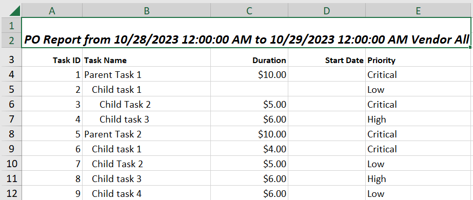
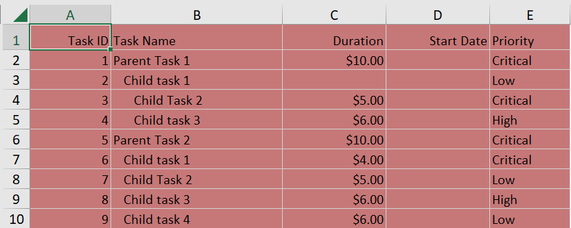

# Excel Export in Blazor TreeGrid Component

The excel export allows exporting Tree Grid data to Excel document. Use the
 **ExcelExport** method for exporting. To enable Excel export in the Tree Grid, set the [AllowExcelExport](https://help.syncfusion.com/cr/blazor/Syncfusion.Blazor.TreeGrid.SfTreeGrid-1.html#Syncfusion_Blazor_TreeGrid_SfTreeGrid_1_AllowExcelExport) property as true.

To know about exporting tree grid data to Excel document in Blazor tree grid component, you can check on this video.







@using TreeGridComponent.Data;
@using Syncfusion.Blazor.TreeGrid;

<SfTreeGrid @ref="TreeGrid" DataSource="@TreeGridData" AllowExcelExport="true" IdMapping="TaskId" ParentIdMapping="ParentId" TreeColumnIndex="1"
             Toolbar="@(new List<string>() { "ExcelExport" })">
    <TreeGridEvents OnToolbarClick="ToolbarClickHandler" TValue="TreeData"></TreeGridEvents>
    <TreeGridColumns>
        <TreeGridColumn Field="TaskId" HeaderText="Task ID" Width="80" TextAlign="Syncfusion.Blazor.Grids.TextAlign.Right"></TreeGridColumn>
        <TreeGridColumn Field="TaskName" HeaderText="Task Name" Width="160"></TreeGridColumn>
        <TreeGridColumn Field="Duration" HeaderText="Duration" Width="100" Format="C2" TextAlign="Syncfusion.Blazor.Grids.TextAlign.Right"></TreeGridColumn>
        <TreeGridColumn Field="StartDate" HeaderText=" Start Date" Format="yMd" Type="Syncfusion.Blazor.Grids.ColumnType.Date" TextAlign="Syncfusion.Blazor.Grids.TextAlign.Right" Width="100"></TreeGridColumn>
        <TreeGridColumn Field="Priority" HeaderText="Priority" Width="80"></TreeGridColumn>
    </TreeGridColumns>
</SfTreeGrid>

@code{
    SfTreeGrid<TreeData> TreeGrid;

    public List<TreeData> TreeGridData { get; set; }

    protected override void OnInitialized()
    {
        this.TreeGridData = TreeData.GetSelfDataSource().ToList();
    }

    private void ToolbarClickHandler(Syncfusion.Blazor.Navigations.ClickEventArgs Args)
    {
        if(Args.Item.Text == "Excel Export")
        {
            this.TreeGrid.ExcelExport();
        }
    }
}





namespace TreeGridComponent.Data {

public class TreeData
    {
       
            public int TaskId { get; set;}
            public string TaskName { get; set;}
            public int? Duration { get; set;}
            public int? Progress { get; set;}
            public string Priority { get; set;}
            public int? ParentId { get; set;}
      
        public static List<TreeData> GetSelfDataSource()
        {
            List<TreeData> BusinessObjectCollection = new List<TreeData>();
            BusinessObjectCollection.Add(new TreeData() { TaskId = 1,TaskName = "Parent Task 1",Duration = 10,Progress = 70,Priority = "Critical",ParentId = null });
            BusinessObjectCollection.Add(new TreeData() { TaskId = 2,TaskName = "Child task 1",Progress = 80,Priority = "Low",ParentId = 1 });
            BusinessObjectCollection.Add(new TreeData() { TaskId = 3,TaskName = "Child Task 2",Duration = 5,Progress = 65,Priority = "Critical",ParentId = 2 });
            BusinessObjectCollection.Add(new TreeData() { TaskId = 4,TaskName = "Child task 3",Duration = 6,Priority = "High",Progress = 77,ParentId = 2 });
            BusinessObjectCollection.Add(new TreeData() { TaskId = 5,TaskName = "Parent Task 2",Duration = 10,Progress = 70,Priority = "Critical",ParentId = null});
            BusinessObjectCollection.Add(new TreeData() { TaskId = 6,TaskName = "Child task 1",Duration = 4,Progress = 80,Priority = "Critical",ParentId = 5});
            BusinessObjectCollection.Add(new TreeData() { TaskId = 7,TaskName = "Child Task 2",Duration = 5,Progress = 65,Priority = "Low",ParentId = 5});
            BusinessObjectCollection.Add(new TreeData() { TaskId = 8,TaskName = "Child task 3",Duration = 6,Progress = 77,Priority = "High",ParentId = 5});
            BusinessObjectCollection.Add(new TreeData() { TaskId = 9,TaskName = "Child task 4",Duration = 6,Progress = 77,Priority = "Low",ParentId = 5});
            return BusinessObjectCollection;
        }
    }
}





## To customize excel export

The excel export provides an option to customize mapping of the Tree Grid to excel document.

### Export current page

The excel export provides an option to export the current page into excel. To export current page, define **exportType** to **CurrentPage**.





@using TreeGridComponent.Data;
@using Syncfusion.Blazor.TreeGrid;

<SfTreeGrid @ref="TreeGrid" DataSource="@TreeGridData" AllowExcelExport="true" IdMapping="TaskId" ParentIdMapping="ParentId" TreeColumnIndex="1"
             Toolbar="@(new List<string>() { "ExcelExport" })">
    <TreeGridEvents OnToolbarClick="ToolbarClickHandler" TValue="TreeData"></TreeGridEvents>
    <TreeGridColumns>
        <TreeGridColumn Field="TaskId" HeaderText="Task ID" Width="80" TextAlign="Syncfusion.Blazor.Grids.TextAlign.Right"></TreeGridColumn>
        <TreeGridColumn Field="TaskName" HeaderText="Task Name" Width="160"></TreeGridColumn>
        <TreeGridColumn Field="Duration" HeaderText="Duration" Width="100" Format="C2" TextAlign="Syncfusion.Blazor.Grids.TextAlign.Right"></TreeGridColumn>
        <TreeGridColumn Field="StartDate" HeaderText=" Start Date" Format="yMd" Type="Syncfusion.Blazor.Grids.ColumnType.Date" TextAlign="Syncfusion.Blazor.Grids.TextAlign.Right" Width="100"></TreeGridColumn>
        <TreeGridColumn Field="Priority" HeaderText="Priority" Width="80"></TreeGridColumn>
    </TreeGridColumns>
</SfTreeGrid>

@code{
    SfTreeGrid<TreeData> TreeGrid;

    public List<TreeData> TreeGridData { get; set; }

    protected override void OnInitialized()
    {
        this.TreeGridData = TreeData.GetSelfDataSource().ToList();
    }

    private void ToolbarClickHandler(Syncfusion.Blazor.Navigations.ClickEventArgs Args)
    {
        if(Args.Item.Text == "Excel Export")
        {
            Syncfusion.Blazor.Grids.ExcelExportProperties ExportProperties = new Syncfusion.Blazor.Grids.ExcelExportProperties();
            ExportProperties.ExportType = Syncfusion.Blazor.Grids.ExportType.CurrentPage;
            this.TreeGrid.ExcelExport(ExportProperties);
        }
    }
}





namespace TreeGridComponent.Data {

public class TreeData
    {
       
            public int TaskId { get; set;}
            public string TaskName { get; set;}
            public int? Duration { get; set;}
            public int? Progress { get; set;}
            public string Priority { get; set;}
            public int? ParentId { get; set;}
      
        public static List<TreeData> GetSelfDataSource()
        {
            List<TreeData> BusinessObjectCollection = new List<TreeData>();
            BusinessObjectCollection.Add(new TreeData() { TaskId = 1,TaskName = "Parent Task 1",Duration = 10,Progress = 70,Priority = "Critical",ParentId = null });
            BusinessObjectCollection.Add(new TreeData() { TaskId = 2,TaskName = "Child task 1",Progress = 80,Priority = "Low",ParentId = 1 });
            BusinessObjectCollection.Add(new TreeData() { TaskId = 3,TaskName = "Child Task 2",Duration = 5,Progress = 65,Priority = "Critical",ParentId = 2 });
            BusinessObjectCollection.Add(new TreeData() { TaskId = 4,TaskName = "Child task 3",Duration = 6,Priority = "High",Progress = 77,ParentId = 2 });
            BusinessObjectCollection.Add(new TreeData() { TaskId = 5,TaskName = "Parent Task 2",Duration = 10,Progress = 70,Priority = "Critical",ParentId = null});
            BusinessObjectCollection.Add(new TreeData() { TaskId = 6,TaskName = "Child task 1",Duration = 4,Progress = 80,Priority = "Critical",ParentId = 5});
            BusinessObjectCollection.Add(new TreeData() { TaskId = 7,TaskName = "Child Task 2",Duration = 5,Progress = 65,Priority = "Low",ParentId = 5});
            BusinessObjectCollection.Add(new TreeData() { TaskId = 8,TaskName = "Child task 3",Duration = 6,Progress = 77,Priority = "High",ParentId = 5});
            BusinessObjectCollection.Add(new TreeData() { TaskId = 9,TaskName = "Child task 4",Duration = 6,Progress = 77,Priority = "Low",ParentId = 5});
            return BusinessObjectCollection;
        }
    }
}





### Export hidden columns

The excel export provides an option to export hidden columns of Tree Grid by defining **includeHiddenColumn** as **true**.





@using TreeGridComponent.Data;
@using Syncfusion.Blazor.TreeGrid;

<SfTreeGrid @ref="TreeGrid" DataSource="@TreeGridData" AllowExcelExport="true" IdMapping="TaskId" ParentIdMapping="ParentId" TreeColumnIndex="1"
             Toolbar="@(new List<string>() { "ExcelExport" })">
    <TreeGridEvents OnToolbarClick="ToolbarClickHandler" TValue="TreeData"></TreeGridEvents>
    <TreeGridColumns>
        <TreeGridColumn Field="TaskId" HeaderText="Task ID" Width="80" TextAlign="Syncfusion.Blazor.Grids.TextAlign.Right"></TreeGridColumn>
        <TreeGridColumn Field="TaskName" HeaderText="Task Name" Width="160"></TreeGridColumn>
        <TreeGridColumn Field="Duration" HeaderText="Duration" Width="100" Format="C2" TextAlign="Syncfusion.Blazor.Grids.TextAlign.Right"></TreeGridColumn>
        <TreeGridColumn Field="StartDate" Visible="false" HeaderText=" Start Date" Format="yMd" Type="Syncfusion.Blazor.Grids.ColumnType.Date" TextAlign="Syncfusion.Blazor.Grids.TextAlign.Right" Width="100"></TreeGridColumn>
        <TreeGridColumn Field="Priority" HeaderText="Priority" Width="80"></TreeGridColumn>
    </TreeGridColumns>
</SfTreeGrid>

@code{
    SfTreeGrid<TreeData> TreeGrid;

    public List<TreeData> TreeGridData { get; set; }

    protected override void OnInitialized()
    {
        this.TreeGridData = TreeData.GetSelfDataSource().ToList();
    }

    private void ToolbarClickHandler(Syncfusion.Blazor.Navigations.ClickEventArgs Args)
    {
        if(Args.Item.Text == "Excel Export")
        {
            Syncfusion.Blazor.Grids.ExcelExportProperties ExportProperties = new Syncfusion.Blazor.Grids.ExcelExportProperties();
            ExportProperties.IncludeHiddenColumn = true;
            this.TreeGrid.ExcelExport(ExportProperties);
        }
    }
}





namespace TreeGridComponent.Data {

public class TreeData
    {
       
            public int TaskId { get; set;}
            public string TaskName { get; set;}
            public int? Duration { get; set;}
            public int? Progress { get; set;}
            public string Priority { get; set;}
            public int? ParentId { get; set;}
      
        public static List<TreeData> GetSelfDataSource()
        {
            List<TreeData> BusinessObjectCollection = new List<TreeData>();
            BusinessObjectCollection.Add(new TreeData() { TaskId = 1,TaskName = "Parent Task 1",Duration = 10,Progress = 70,Priority = "Critical",ParentId = null });
            BusinessObjectCollection.Add(new TreeData() { TaskId = 2,TaskName = "Child task 1",Progress = 80,Priority = "Low",ParentId = 1 });
            BusinessObjectCollection.Add(new TreeData() { TaskId = 3,TaskName = "Child Task 2",Duration = 5,Progress = 65,Priority = "Critical",ParentId = 2 });
            BusinessObjectCollection.Add(new TreeData() { TaskId = 4,TaskName = "Child task 3",Duration = 6,Priority = "High",Progress = 77,ParentId = 2 });
            BusinessObjectCollection.Add(new TreeData() { TaskId = 5,TaskName = "Parent Task 2",Duration = 10,Progress = 70,Priority = "Critical",ParentId = null});
            BusinessObjectCollection.Add(new TreeData() { TaskId = 6,TaskName = "Child task 1",Duration = 4,Progress = 80,Priority = "Critical",ParentId = 5});
            BusinessObjectCollection.Add(new TreeData() { TaskId = 7,TaskName = "Child Task 2",Duration = 5,Progress = 65,Priority = "Low",ParentId = 5});
            BusinessObjectCollection.Add(new TreeData() { TaskId = 8,TaskName = "Child task 3",Duration = 6,Progress = 77,Priority = "High",ParentId = 5});
            BusinessObjectCollection.Add(new TreeData() { TaskId = 9,TaskName = "Child task 4",Duration = 6,Progress = 77,Priority = "Low",ParentId = 5});
            return BusinessObjectCollection;
        }
    }
}





### Export the selected records only

The TreeGrid has an option to export the selected records in an excel exported document. This can be achieved by using the [DataSource](https://help.syncfusion.com/cr/blazor/Syncfusion.Blazor.Grids.ExcelExportProperties.html#Syncfusion_Blazor_Grids_ExcelExportProperties_DataSource) property of the [ExcelExportProperties](https://help.syncfusion.com/cr/blazor/Syncfusion.Blazor.Grids.ExcelExportProperties.html) class and the [GetSelectedRecordsAsync](https://help.syncfusion.com/cr/blazor/Syncfusion.Blazor.TreeGrid.SfTreeGrid-1.html#Syncfusion_Blazor_TreeGrid_SfTreeGrid_1_GetSelectedRecordsAsync) method of the TreeGrid.

In the following sample, selected records will be gotten from the `GetSelectedRecordsAsync` method and provided to the `DataSource` property of `ExcelExportProperties`. Then pass this ExcelExportProperties class to the [ExportToExcelAsync](https://help.syncfusion.com/cr/blazor/Syncfusion.Blazor.TreeGrid.SfTreeGrid-1.html#Syncfusion_Blazor_TreeGrid_SfTreeGrid_1_ExportToExcelAsync_Syncfusion_Blazor_Grids_ExcelExportProperties_System_Nullable_System_Boolean__System_Object_System_Nullable_System_Boolean__) method to get the selected records in the exported document.





@using TreeGridComponent.Data;
@using Syncfusion.Blazor.TreeGrid;

<SfTreeGrid @ref="TreeGrid" DataSource="@TreeGridData" AllowExcelExport="true" IdMapping="TaskId" ParentIdMapping="ParentId" TreeColumnIndex="1"
             Toolbar="@(new List<string>() { "ExcelExport" })">
    <TreeGridEvents OnToolbarClick="ToolbarClickHandler" TValue="TreeData"></TreeGridEvents>
    <TreeGridColumns>
        <TreeGridColumn Field="TaskId" HeaderText="Task ID" Width="80" TextAlign="Syncfusion.Blazor.Grids.TextAlign.Right"></TreeGridColumn>
        <TreeGridColumn Field="TaskName" HeaderText="Task Name" Width="160"></TreeGridColumn>
        <TreeGridColumn Field="Duration" HeaderText="Duration" Width="100" Format="C2" TextAlign="Syncfusion.Blazor.Grids.TextAlign.Right"></TreeGridColumn>
        <TreeGridColumn Field="StartDate" Visible="false" HeaderText=" Start Date" Format="yMd" Type="Syncfusion.Blazor.Grids.ColumnType.Date" TextAlign="Syncfusion.Blazor.Grids.TextAlign.Right" Width="100"></TreeGridColumn>
        <TreeGridColumn Field="Priority" HeaderText="Priority" Width="80"></TreeGridColumn>
    </TreeGridColumns>
</SfTreeGrid>

@code{
    SfTreeGrid<TreeData> TreeGrid;

    public List<TreeData> TreeGridData { get; set; }

    protected override void OnInitialized()
    {
        this.TreeGridData = TreeData.GetSelfDataSource().ToList();
    }

    private void ToolbarClickHandler(Syncfusion.Blazor.Navigations.ClickEventArgs Args)
    {
        if (Args.Item.Text == "Excel Export")
        {
            Syncfusion.Blazor.Grids.ExcelExportProperties ExcelProperties = new Syncfusion.Blazor.Grids.ExcelExportProperties();
            var selectedRecord = TreeGrid.GetSelectedRecordsAsync();
            if (selectedRecord.Count() > 0)
            {
                ExcelProperties.DataSource = selectedRecord;
            }
            else
            {
                ExcelProperties.DataSource = this.TreeGridData;
            }
            this.TreeGrid.ExportToExcelAsync(ExcelProperties);
        }
    }
}





namespace TreeGridComponent.Data {

public class TreeData
    {
       
            public int TaskId { get; set;}
            public string TaskName { get; set;}
            public int? Duration { get; set;}
            public int? Progress { get; set;}
            public string Priority { get; set;}
            public int? ParentId { get; set;}
      
        public static List<TreeData> GetSelfDataSource()
        {
            List<TreeData> BusinessObjectCollection = new List<TreeData>();
            BusinessObjectCollection.Add(new TreeData() { TaskId = 1,TaskName = "Parent Task 1",Duration = 10,Progress = 70,Priority = "Critical",ParentId = null });
            BusinessObjectCollection.Add(new TreeData() { TaskId = 2,TaskName = "Child task 1",Progress = 80,Priority = "Low",ParentId = 1 });
            BusinessObjectCollection.Add(new TreeData() { TaskId = 3,TaskName = "Child Task 2",Duration = 5,Progress = 65,Priority = "Critical",ParentId = 2 });
            BusinessObjectCollection.Add(new TreeData() { TaskId = 4,TaskName = "Child task 3",Duration = 6,Priority = "High",Progress = 77,ParentId = 2 });
            BusinessObjectCollection.Add(new TreeData() { TaskId = 5,TaskName = "Parent Task 2",Duration = 10,Progress = 70,Priority = "Critical",ParentId = null});
            BusinessObjectCollection.Add(new TreeData() { TaskId = 6,TaskName = "Child task 1",Duration = 4,Progress = 80,Priority = "Critical",ParentId = 5});
            BusinessObjectCollection.Add(new TreeData() { TaskId = 7,TaskName = "Child Task 2",Duration = 5,Progress = 65,Priority = "Low",ParentId = 5});
            BusinessObjectCollection.Add(new TreeData() { TaskId = 8,TaskName = "Child task 3",Duration = 6,Progress = 77,Priority = "High",ParentId = 5});
            BusinessObjectCollection.Add(new TreeData() { TaskId = 9,TaskName = "Child task 4",Duration = 6,Progress = 77,Priority = "Low",ParentId = 5});
            return BusinessObjectCollection;
        }
    }
}





### Add custom text in header/footer

You can add text and customize its styles either in the header or footer of an exported excel document by using the [Header](https://help.syncfusion.com/cr/blazor/Syncfusion.Blazor.Grids.ExcelExportProperties.html#Syncfusion_Blazor_Grids_ExcelExportProperties_Header) and [Footer](https://help.syncfusion.com/cr/blazor/Syncfusion.Blazor.Grids.ExcelExportProperties.html#Syncfusion_Blazor_Grids_ExcelExportProperties_Footer) properties of the [ExcelExportProperties](https://help.syncfusion.com/cr/blazor/Syncfusion.Blazor.Grids.ExcelExportProperties.html) class.

The following sample code demonstrates adding custom text and customizing its styles in the header section of the exported document,





@using TreeGridComponent.Data;
@using Syncfusion.Blazor.TreeGrid;
@using Syncfusion.Blazor.Grids;
@using Syncfusion.Blazor.Calendars

<SfDateRangePicker @ref="DateRange" TValue="DateTime?" StartDate="@StartValue" EndDate="@EndValue"></SfDateRangePicker>

<SfTreeGrid @ref="TreeGrid" DataSource="@TreeGridData" AllowExcelExport="true" IdMapping="TaskId" ParentIdMapping="ParentId" TreeColumnIndex="1"
            Toolbar="@(new List<string>() { "ExcelExport" })">
    <TreeGridEvents OnToolbarClick="ToolbarClickHandler" TValue="TreeData"></TreeGridEvents>
    <TreeGridSelectionSettings Type="SelectionType.Multiple"></TreeGridSelectionSettings>
    <TreeGridColumns>
        <TreeGridColumn Field="TaskId" HeaderText="Task ID" Width="80" TextAlign="Syncfusion.Blazor.Grids.TextAlign.Right"></TreeGridColumn>
        <TreeGridColumn Field="TaskName" HeaderText="Task Name" Width="160"></TreeGridColumn>
        <TreeGridColumn Field="Duration" HeaderText="Duration" Width="100" Format="C2" TextAlign="Syncfusion.Blazor.Grids.TextAlign.Right"></TreeGridColumn>
        <TreeGridColumn Field="StartDate" HeaderText=" Start Date" Format="yMd" Type="Syncfusion.Blazor.Grids.ColumnType.Date" TextAlign="Syncfusion.Blazor.Grids.TextAlign.Right" Width="100"></TreeGridColumn>
        <TreeGridColumn Field="Priority" HeaderText="Priority" Width="80"></TreeGridColumn>
    </TreeGridColumns>
</SfTreeGrid>

@code{
    SfTreeGrid<TreeData> TreeGrid;

    public List<TreeData> TreeGridData { get; set; }

    private SfDateRangePicker<DateTime?> DateRange;

    public DateTime? StartValue { get; set; } = new DateTime(DateTime.Now.Year, DateTime.Now.Month, 28);

    public DateTime? EndValue { get; set; } = new DateTime(DateTime.Now.Year, DateTime.Now.Month, 29);

    protected override void OnInitialized()
    {
        this.TreeGridData = TreeData.GetSelfDataSource().ToList();
    }

    private void ToolbarClickHandler(Syncfusion.Blazor.Navigations.ClickEventArgs Args)
    {
        if (Args.Item.Text == "Excel Export")
        {
            ExcelExportProperties ExportProperties = new ExcelExportProperties();
            ExcelHeader header = new ExcelHeader();
            header.HeaderRows = 2;
            List<ExcelCell> cell = new List<ExcelCell>
            {
                new ExcelCell() { RowSpan= 2,ColSpan=5 , Value= "PO Report from " + DateRange.StartDate.ToString() + " to " + DateRange.EndDate.ToString() + " Vendor All", Style = new ExcelStyle() { Bold = true, FontSize = 13, Italic= true }  }
            };

            List<ExcelRow> HeaderContent = new List<ExcelRow>
            {
                new ExcelRow() {  Cells = cell, Index = 1 }
            };
            header.Rows = HeaderContent;
            ExportProperties.Header = header;
            this.TreeGrid.ExcelExport(ExportProperties);
        }
    }
}





namespace TreeGridComponent.Data {

public class TreeData
    {
       
            public int TaskId { get; set;}
            public string TaskName { get; set;}
            public int? Duration { get; set;}
            public int? Progress { get; set;}
            public string Priority { get; set;}
            public int? ParentId { get; set;}
      
        public static List<TreeData> GetSelfDataSource()
        {
            List<TreeData> BusinessObjectCollection = new List<TreeData>();
            BusinessObjectCollection.Add(new TreeData() { TaskId = 1,TaskName = "Parent Task 1",Duration = 10,Progress = 70,Priority = "Critical",ParentId = null });
            BusinessObjectCollection.Add(new TreeData() { TaskId = 2,TaskName = "Child task 1",Progress = 80,Priority = "Low",ParentId = 1 });
            BusinessObjectCollection.Add(new TreeData() { TaskId = 3,TaskName = "Child Task 2",Duration = 5,Progress = 65,Priority = "Critical",ParentId = 2 });
            BusinessObjectCollection.Add(new TreeData() { TaskId = 4,TaskName = "Child task 3",Duration = 6,Priority = "High",Progress = 77,ParentId = 2 });
            BusinessObjectCollection.Add(new TreeData() { TaskId = 5,TaskName = "Parent Task 2",Duration = 10,Progress = 70,Priority = "Critical",ParentId = null});
            BusinessObjectCollection.Add(new TreeData() { TaskId = 6,TaskName = "Child task 1",Duration = 4,Progress = 80,Priority = "Critical",ParentId = 5});
            BusinessObjectCollection.Add(new TreeData() { TaskId = 7,TaskName = "Child Task 2",Duration = 5,Progress = 65,Priority = "Low",ParentId = 5});
            BusinessObjectCollection.Add(new TreeData() { TaskId = 8,TaskName = "Child task 3",Duration = 6,Progress = 77,Priority = "High",ParentId = 5});
            BusinessObjectCollection.Add(new TreeData() { TaskId = 9,TaskName = "Child task 4",Duration = 6,Progress = 77,Priority = "Low",ParentId = 5});
            return BusinessObjectCollection;
        }
    }
}





### Export template columns

The excel export provides an option to export template columns of the TreeGrid by defining the [IncludeTemplateColumn](https://help.syncfusion.com/cr/blazor/Syncfusion.Blazor.Grids.ExcelExportProperties.html#Syncfusion_Blazor_Grids_ExcelExportProperties_IncludeTemplateColumn) of [ExcelExportProperties](https://help.syncfusion.com/cr/blazor/Syncfusion.Blazor.Grids.ExcelExportProperties.html) as true. In the following sample, the Task Name column is a template column. The template values cannot be directly exported into the cells. To customize the values of the template columns in Excel file, you must use [ExcelQueryCellInfoEvent](https://help.syncfusion.com/cr/blazor/Syncfusion.Blazor.Grids.GridEvents-1.html#Syncfusion_Blazor_Grids_GridEvents_1_ExcelQueryCellInfoEvent).





@using TreeGridComponent.Data;
@using Syncfusion.Blazor.TreeGrid;

<SfTreeGrid @ref="TreeGrid" DataSource="@TreeGridData" AllowExcelExport="true" IdMapping="TaskId" ParentIdMapping="ParentId" TreeColumnIndex="1"
            Toolbar="@(new List<string>() { "ExcelExport" })">
    <TreeGridEvents ExcelQueryCellInfoEvent="ExcelQueryCellInfoHandler" OnToolbarClick="ToolbarClickHandler" TValue="TreeData"></TreeGridEvents>
    <TreeGridSelectionSettings Type="SelectionType.Multiple"></TreeGridSelectionSettings>
    <TreeGridColumns>
        <TreeGridColumn Field="TaskId" HeaderText="Task ID" Width="80" TextAlign="Syncfusion.Blazor.Grids.TextAlign.Right"></TreeGridColumn>
        <TreeGridColumn Field="TaskName" HeaderText="Task Name" Width="160">
            <Template>
                @{
                    var con = (context as TreeData);
                }
                Task Name - @con.TaskName
            </Template>
        </TreeGridColumn>
        <TreeGridColumn Field="Duration" HeaderText="Duration" Width="100" Format="C2" TextAlign="Syncfusion.Blazor.Grids.TextAlign.Right"></TreeGridColumn>
        <TreeGridColumn Field="StartDate" HeaderText=" Start Date" Format="yMd" Type="Syncfusion.Blazor.Grids.ColumnType.Date" TextAlign="Syncfusion.Blazor.Grids.TextAlign.Right" Width="100"></TreeGridColumn>
        <TreeGridColumn Field="Priority" HeaderText="Priority" Width="80"></TreeGridColumn>
    </TreeGridColumns>
</SfTreeGrid>

@code{
    SfTreeGrid<TreeData> TreeGrid;

    public List<TreeData> TreeGridData { get; set; }

    protected override void OnInitialized()
    {
        this.TreeGridData = TreeData.GetSelfDataSource().ToList();
    }

    private void ToolbarClickHandler(Syncfusion.Blazor.Navigations.ClickEventArgs Args)
    {
        if(Args.Item.Text == "Excel Export")
        {
            ExcelExportProperties ExportProperties = new ExcelExportProperties();
            ExportProperties.IncludeTemplateColumn = true;
            this.TreeGrid.ExcelExport(ExportProperties);
        }
    }
    public void ExcelQueryCellInfoHandler(ExcelQueryCellInfoEventArgs<TreeData> args)
    {
        if (args.Column.Field == "TaskName")
        {
            args.Cell.Value = "Task Name -" + args.Data.TaskName;
        }
    }
}





namespace TreeGridComponent.Data {

public class TreeData
    {
       
            public int TaskId { get; set;}
            public string TaskName { get; set;}
            public int? Duration { get; set;}
            public int? Progress { get; set;}
            public string Priority { get; set;}
            public int? ParentId { get; set;}
      
        public static List<TreeData> GetSelfDataSource()
        {
            List<TreeData> BusinessObjectCollection = new List<TreeData>();
            BusinessObjectCollection.Add(new TreeData() { TaskId = 1,TaskName = "Parent Task 1",Duration = 10,Progress = 70,Priority = "Critical",ParentId = null });
            BusinessObjectCollection.Add(new TreeData() { TaskId = 2,TaskName = "Child task 1",Progress = 80,Priority = "Low",ParentId = 1 });
            BusinessObjectCollection.Add(new TreeData() { TaskId = 3,TaskName = "Child Task 2",Duration = 5,Progress = 65,Priority = "Critical",ParentId = 2 });
            BusinessObjectCollection.Add(new TreeData() { TaskId = 4,TaskName = "Child task 3",Duration = 6,Priority = "High",Progress = 77,ParentId = 2 });
            BusinessObjectCollection.Add(new TreeData() { TaskId = 5,TaskName = "Parent Task 2",Duration = 10,Progress = 70,Priority = "Critical",ParentId = null});
            BusinessObjectCollection.Add(new TreeData() { TaskId = 6,TaskName = "Child task 1",Duration = 4,Progress = 80,Priority = "Critical",ParentId = 5});
            BusinessObjectCollection.Add(new TreeData() { TaskId = 7,TaskName = "Child Task 2",Duration = 5,Progress = 65,Priority = "Low",ParentId = 5});
            BusinessObjectCollection.Add(new TreeData() { TaskId = 8,TaskName = "Child task 3",Duration = 6,Progress = 77,Priority = "High",ParentId = 5});
            BusinessObjectCollection.Add(new TreeData() { TaskId = 9,TaskName = "Child task 4",Duration = 6,Progress = 77,Priority = "Low",ParentId = 5});
            return BusinessObjectCollection;
        }
    }
}





### Theme

The excel export provides an option to include theme for exported excel document.

To apply theme in exported Excel, define the **theme** in export properties.





@using TreeGridComponent.Data;
@using Syncfusion.Blazor.TreeGrid;

<SfTreeGrid @ref="TreeGrid" DataSource="@TreeGridData" AllowExcelExport="true" IdMapping="TaskId" ParentIdMapping="ParentId" TreeColumnIndex="1"
             Toolbar="@(new List<string>() { "ExcelExport" })">
    <TreeGridEvents OnToolbarClick="ToolbarClickHandler" TValue="TreeData"></TreeGridEvents>
    <TreeGridColumns>
        <TreeGridColumn Field="TaskId" HeaderText="Task ID" Width="80" TextAlign="Syncfusion.Blazor.Grids.TextAlign.Right"></TreeGridColumn>
        <TreeGridColumn Field="TaskName" HeaderText="Task Name" Width="160"></TreeGridColumn>
        <TreeGridColumn Field="Duration" HeaderText="Duration" Width="100" Format="C2" TextAlign="Syncfusion.Blazor.Grids.TextAlign.Right"></TreeGridColumn>
        <TreeGridColumn Field="StartDate" HeaderText=" Start Date" Format="yMd" Type="Syncfusion.Blazor.Grids.ColumnType.Date" TextAlign="Syncfusion.Blazor.Grids.TextAlign.Right" Width="100"></TreeGridColumn>
        <TreeGridColumn Field="Priority" HeaderText="Priority" Width="80"></TreeGridColumn>
    </TreeGridColumns>
</SfTreeGrid>

@code{
    SfTreeGrid<TreeData> TreeGrid;

    public List<TreeData> TreeGridData { get; set; }

    protected override void OnInitialized()
    {
        this.TreeGridData = TreeData.GetSelfDataSource().ToList();
    }

    private void ToolbarClickHandler(Syncfusion.Blazor.Navigations.ClickEventArgs Args)
    {
        if(Args.Item.Text == "Excel Export")
        {
            Syncfusion.Blazor.Grids.ExcelExportProperties ExportProperties = new Syncfusion.Blazor.Grids.ExcelExportProperties();
            Syncfusion.Blazor.Grids.ExcelTheme Theme = new Syncfusion.Blazor.Grids.ExcelTheme();

            Syncfusion.Blazor.Grids.ExcelStyle ThemeStyle = new Syncfusion.Blazor.Grids.ExcelStyle()
            {
                FontName = "Segoe UI",
                FontColor = "#666666"
            };

            Theme.Header = ThemeStyle;
            Theme.Record = ThemeStyle;
            Theme.Caption = ThemeStyle;

            this.TreeGrid.ExcelExport(ExportProperties);
        }
    }
}





namespace TreeGridComponent.Data {

public class TreeData
    {
       
            public int TaskId { get; set;}
            public string TaskName { get; set;}
            public int? Duration { get; set;}
            public int? Progress { get; set;}
            public string Priority { get; set;}
            public int? ParentId { get; set;}
      
        public static List<TreeData> GetSelfDataSource()
        {
            List<TreeData> BusinessObjectCollection = new List<TreeData>();
            BusinessObjectCollection.Add(new TreeData() { TaskId = 1,TaskName = "Parent Task 1",Duration = 10,Progress = 70,Priority = "Critical",ParentId = null });
            BusinessObjectCollection.Add(new TreeData() { TaskId = 2,TaskName = "Child task 1",Progress = 80,Priority = "Low",ParentId = 1 });
            BusinessObjectCollection.Add(new TreeData() { TaskId = 3,TaskName = "Child Task 2",Duration = 5,Progress = 65,Priority = "Critical",ParentId = 2 });
            BusinessObjectCollection.Add(new TreeData() { TaskId = 4,TaskName = "Child task 3",Duration = 6,Priority = "High",Progress = 77,ParentId = 2 });
            BusinessObjectCollection.Add(new TreeData() { TaskId = 5,TaskName = "Parent Task 2",Duration = 10,Progress = 70,Priority = "Critical",ParentId = null});
            BusinessObjectCollection.Add(new TreeData() { TaskId = 6,TaskName = "Child task 1",Duration = 4,Progress = 80,Priority = "Critical",ParentId = 5});
            BusinessObjectCollection.Add(new TreeData() { TaskId = 7,TaskName = "Child Task 2",Duration = 5,Progress = 65,Priority = "Low",ParentId = 5});
            BusinessObjectCollection.Add(new TreeData() { TaskId = 8,TaskName = "Child task 3",Duration = 6,Progress = 77,Priority = "High",ParentId = 5});
            BusinessObjectCollection.Add(new TreeData() { TaskId = 9,TaskName = "Child task 4",Duration = 6,Progress = 77,Priority = "Low",ParentId = 5});
            return BusinessObjectCollection;
        }
    }
}





N> By default, material theme is applied to exported excel document.

### Customizing the background color for a Grid in an exported Excel document

You can set the background color for a TreeGrid in the exported document using the [Theme](https://help.syncfusion.com/cr/blazor/Syncfusion.Blazor.Grids.ExcelExportProperties.html#Syncfusion_Blazor_Grids_ExcelExportProperties_Theme) property of [ExcelExportProperties](https://help.syncfusion.com/cr/blazor/Syncfusion.Blazor.Grids.ExcelExportProperties.html) class.





@using TreeGridComponent.Data;
@using Syncfusion.Blazor.TreeGrid;

<SfTreeGrid @ref="TreeGrid" DataSource="@TreeGridData" AllowExcelExport="true" IdMapping="TaskId" ParentIdMapping="ParentId" TreeColumnIndex="1"
            Toolbar="@(new List<string>() { "ExcelExport" })">
    <TreeGridEvents OnToolbarClick="ToolbarClickHandler" TValue="TreeData"></TreeGridEvents>
    <TreeGridSelectionSettings Type="SelectionType.Multiple"></TreeGridSelectionSettings>
    <TreeGridColumns>
        <TreeGridColumn Field="TaskId" HeaderText="Task ID" Width="80" TextAlign="Syncfusion.Blazor.Grids.TextAlign.Right"></TreeGridColumn>
        <TreeGridColumn Field="TaskName" HeaderText="Task Name" Width="160"></TreeGridColumn>
        <TreeGridColumn Field="Duration" HeaderText="Duration" Width="100" Format="C2" TextAlign="Syncfusion.Blazor.Grids.TextAlign.Right"></TreeGridColumn>
        <TreeGridColumn Field="StartDate" HeaderText=" Start Date" Format="yMd" Type="Syncfusion.Blazor.Grids.ColumnType.Date" TextAlign="Syncfusion.Blazor.Grids.TextAlign.Right" Width="100"></TreeGridColumn>
        <TreeGridColumn Field="Priority" HeaderText="Priority" Width="80"></TreeGridColumn>
    </TreeGridColumns>
</SfTreeGrid>

@code{
    SfTreeGrid<TreeData> TreeGrid;

    public List<TreeData> TreeGridData { get; set; }

    protected override void OnInitialized()
    {
        this.TreeGridData = TreeData.GetSelfDataSource().ToList();
    }

    private void ToolbarClickHandler(Syncfusion.Blazor.Navigations.ClickEventArgs Args)
    {
        if(Args.Item.Text == "Excel Export")
        {
            ExcelExportProperties ExcelProperties = new ExcelExportProperties();
            ExcelTheme Theme = new ExcelTheme();
            ExcelStyle ThemeStyle = new ExcelStyle()
            {
                BackColor = "#C67878"
            };
            Theme.Header = ThemeStyle;
            Theme.Record = ThemeStyle;
            Theme.Caption = ThemeStyle;
            ExcelProperties.Theme = Theme;
            this.TreeGrid.ExcelExport(ExcelProperties);
        }
    }
}





namespace TreeGridComponent.Data {

public class TreeData
    {
       
            public int TaskId { get; set;}
            public string TaskName { get; set;}
            public int? Duration { get; set;}
            public int? Progress { get; set;}
            public string Priority { get; set;}
            public int? ParentId { get; set;}
      
        public static List<TreeData> GetSelfDataSource()
        {
            List<TreeData> BusinessObjectCollection = new List<TreeData>();
            BusinessObjectCollection.Add(new TreeData() { TaskId = 1,TaskName = "Parent Task 1",Duration = 10,Progress = 70,Priority = "Critical",ParentId = null });
            BusinessObjectCollection.Add(new TreeData() { TaskId = 2,TaskName = "Child task 1",Progress = 80,Priority = "Low",ParentId = 1 });
            BusinessObjectCollection.Add(new TreeData() { TaskId = 3,TaskName = "Child Task 2",Duration = 5,Progress = 65,Priority = "Critical",ParentId = 2 });
            BusinessObjectCollection.Add(new TreeData() { TaskId = 4,TaskName = "Child task 3",Duration = 6,Priority = "High",Progress = 77,ParentId = 2 });
            BusinessObjectCollection.Add(new TreeData() { TaskId = 5,TaskName = "Parent Task 2",Duration = 10,Progress = 70,Priority = "Critical",ParentId = null});
            BusinessObjectCollection.Add(new TreeData() { TaskId = 6,TaskName = "Child task 1",Duration = 4,Progress = 80,Priority = "Critical",ParentId = 5});
            BusinessObjectCollection.Add(new TreeData() { TaskId = 7,TaskName = "Child Task 2",Duration = 5,Progress = 65,Priority = "Low",ParentId = 5});
            BusinessObjectCollection.Add(new TreeData() { TaskId = 8,TaskName = "Child task 3",Duration = 6,Progress = 77,Priority = "High",ParentId = 5});
            BusinessObjectCollection.Add(new TreeData() { TaskId = 9,TaskName = "Child task 4",Duration = 6,Progress = 77,Priority = "Low",ParentId = 5});
            return BusinessObjectCollection;
        }
    }
}





### File name for exported document

The file name can be assigned for the exported document by defining **fileName** property in excel export properties.





@using TreeGridComponent.Data;
@using Syncfusion.Blazor.TreeGrid;

<SfTreeGrid @ref="TreeGrid" DataSource="@TreeGridData" AllowExcelExport="true" IdMapping="TaskId" ParentIdMapping="ParentId" TreeColumnIndex="1"
             Toolbar="@(new List<string>() { "ExcelExport" })">
    <TreeGridEvents OnToolbarClick="ToolbarClickHandler" TValue="TreeData"></TreeGridEvents>
    <TreeGridColumns>
        <TreeGridColumn Field="TaskId" HeaderText="Task ID" Width="80" TextAlign="Syncfusion.Blazor.Grids.TextAlign.Right"></TreeGridColumn>
        <TreeGridColumn Field="TaskName" HeaderText="Task Name" Width="160"></TreeGridColumn>
        <TreeGridColumn Field="Duration" HeaderText="Duration" Width="100" Format="C2" TextAlign="Syncfusion.Blazor.Grids.TextAlign.Right"></TreeGridColumn>
        <TreeGridColumn Field="StartDate" HeaderText=" Start Date" Format="yMd" Type="Syncfusion.Blazor.Grids.ColumnType.Date" TextAlign="Syncfusion.Blazor.Grids.TextAlign.Right" Width="100"></TreeGridColumn>
        <TreeGridColumn Field="Priority" HeaderText="Priority" Width="80"></TreeGridColumn>
    </TreeGridColumns>
</SfTreeGrid>

@code{
    SfTreeGrid<TreeData> TreeGrid;

    public List<TreeData> TreeGridData { get; set; }

    protected override void OnInitialized()
    {
        this.TreeGridData = TreeData.GetSelfDataSource().ToList();
    }

    private void ToolbarClickHandler(Syncfusion.Blazor.Navigations.ClickEventArgs Args)
    {
        if(Args.Item.Text == "Excel Export")
        {
            Syncfusion.Blazor.Grids.ExcelExportProperties ExportProperties = new Syncfusion.Blazor.Grids.ExcelExportProperties();
            ExportProperties.FileName = "New.xlsx";
            this.TreeGrid.ExcelExport(ExportProperties);
        }
    }
}





namespace TreeGridComponent.Data {

public class TreeData
    {
       
            public int TaskId { get; set;}
            public string TaskName { get; set;}
            public int? Duration { get; set;}
            public int? Progress { get; set;}
            public string Priority { get; set;}
            public int? ParentId { get; set;}
      
        public static List<TreeData> GetSelfDataSource()
        {
            List<TreeData> BusinessObjectCollection = new List<TreeData>();
            BusinessObjectCollection.Add(new TreeData() { TaskId = 1,TaskName = "Parent Task 1",Duration = 10,Progress = 70,Priority = "Critical",ParentId = null });
            BusinessObjectCollection.Add(new TreeData() { TaskId = 2,TaskName = "Child task 1",Progress = 80,Priority = "Low",ParentId = 1 });
            BusinessObjectCollection.Add(new TreeData() { TaskId = 3,TaskName = "Child Task 2",Duration = 5,Progress = 65,Priority = "Critical",ParentId = 2 });
            BusinessObjectCollection.Add(new TreeData() { TaskId = 4,TaskName = "Child task 3",Duration = 6,Priority = "High",Progress = 77,ParentId = 2 });
            BusinessObjectCollection.Add(new TreeData() { TaskId = 5,TaskName = "Parent Task 2",Duration = 10,Progress = 70,Priority = "Critical",ParentId = null});
            BusinessObjectCollection.Add(new TreeData() { TaskId = 6,TaskName = "Child task 1",Duration = 4,Progress = 80,Priority = "Critical",ParentId = 5});
            BusinessObjectCollection.Add(new TreeData() { TaskId = 7,TaskName = "Child Task 2",Duration = 5,Progress = 65,Priority = "Low",ParentId = 5});
            BusinessObjectCollection.Add(new TreeData() { TaskId = 8,TaskName = "Child task 3",Duration = 6,Progress = 77,Priority = "High",ParentId = 5});
            BusinessObjectCollection.Add(new TreeData() { TaskId = 9,TaskName = "Child task 4",Duration = 6,Progress = 77,Priority = "Low",ParentId = 5});
            return BusinessObjectCollection;
        }
    }
}





### To persist collapsed state

The collapsed state can be persisted in the exported document by defining **IsCollapsedStatePersist** property as true in the **TreeGridExcelExportProperties** parameter of the [ExcelExport](https://help.syncfusion.com/cr/blazor/Syncfusion.Blazor.TreeGrid.SfTreeGrid-1.html#Syncfusion_Blazor_TreeGrid_SfTreeGrid_1_ExcelExport_Syncfusion_Blazor_Grids_ExcelExportProperties_System_Nullable_System_Boolean__System_Object_System_Nullable_System_Boolean__) method.





@using TreeGridComponent.Data;
@using Syncfusion.Blazor.TreeGrid;

<SfTreeGrid @ref="TreeGrid" DataSource="@TreeGridData" AllowExcelExport="true" IdMapping="TaskId" ParentIdMapping="ParentId" TreeColumnIndex="1"
             Toolbar="@(new List<string>() { "ExcelExport" })">
    <TreeGridEvents OnToolbarClick="ToolbarClickHandler" TValue="TreeData"></TreeGridEvents>
    <TreeGridColumns>
        <TreeGridColumn Field="TaskId" HeaderText="Task ID" Width="80" TextAlign="Syncfusion.Blazor.Grids.TextAlign.Right"></TreeGridColumn>
        <TreeGridColumn Field="TaskName" HeaderText="Task Name" Width="160"></TreeGridColumn>
        <TreeGridColumn Field="Duration" HeaderText="Duration" Width="100" Format="C2" TextAlign="Syncfusion.Blazor.Grids.TextAlign.Right"></TreeGridColumn>
        <TreeGridColumn Field="StartDate" HeaderText=" Start Date" Format="yMd" Type="Syncfusion.Blazor.Grids.ColumnType.Date" TextAlign="Syncfusion.Blazor.Grids.TextAlign.Right" Width="100"></TreeGridColumn>
        <TreeGridColumn Field="Priority" HeaderText="Priority" Width="80"></TreeGridColumn>
    </TreeGridColumns>
</SfTreeGrid>

@code{
    SfTreeGrid<TreeData> TreeGrid;

    public List<TreeData> TreeGridData { get; set; }

    protected override void OnInitialized()
    {
        this.TreeGridData = TreeData.GetSelfDataSource().ToList();
    }

    private void ToolbarClickHandler(Syncfusion.Blazor.Navigations.ClickEventArgs Args)
    {
        if(Args.Item.Text == "Excel Export")
        {
            Syncfusion.Blazor.TreeGrid.TreeGridExcelExportProperties ExportProperties = new Syncfusion.Blazor.TreeGrid.TreeGridExcelExportProperties();
            ExportProperties.IsCollapsedStatePersist = true;
            this.TreeGrid.ExcelExport(ExportProperties);
        }
    }
}





namespace TreeGridComponent.Data {

public class TreeData
    {
       
            public int TaskId { get; set;}
            public string TaskName { get; set;}
            public int? Duration { get; set;}
            public int? Progress { get; set;}
            public string Priority { get; set;}
            public int? ParentId { get; set;}
      
        public static List<TreeData> GetSelfDataSource()
        {
            List<TreeData> BusinessObjectCollection = new List<TreeData>();
            BusinessObjectCollection.Add(new TreeData() { TaskId = 1,TaskName = "Parent Task 1",Duration = 10,Progress = 70,Priority = "Critical",ParentId = null });
            BusinessObjectCollection.Add(new TreeData() { TaskId = 2,TaskName = "Child task 1",Progress = 80,Priority = "Low",ParentId = 1 });
            BusinessObjectCollection.Add(new TreeData() { TaskId = 3,TaskName = "Child Task 2",Duration = 5,Progress = 65,Priority = "Critical",ParentId = 2 });
            BusinessObjectCollection.Add(new TreeData() { TaskId = 4,TaskName = "Child task 3",Duration = 6,Priority = "High",Progress = 77,ParentId = 2 });
            BusinessObjectCollection.Add(new TreeData() { TaskId = 5,TaskName = "Parent Task 2",Duration = 10,Progress = 70,Priority = "Critical",ParentId = null});
            BusinessObjectCollection.Add(new TreeData() { TaskId = 6,TaskName = "Child task 1",Duration = 4,Progress = 80,Priority = "Critical",ParentId = 5});
            BusinessObjectCollection.Add(new TreeData() { TaskId = 7,TaskName = "Child Task 2",Duration = 5,Progress = 65,Priority = "Low",ParentId = 5});
            BusinessObjectCollection.Add(new TreeData() { TaskId = 8,TaskName = "Child task 3",Duration = 6,Progress = 77,Priority = "High",ParentId = 5});
            BusinessObjectCollection.Add(new TreeData() { TaskId = 9,TaskName = "Child task 4",Duration = 6,Progress = 77,Priority = "Low",ParentId = 5});
            return BusinessObjectCollection;
        }
    }
}





### Add additional worksheets to excel file while exporting

Additional worksheets can be added to the excel file while exporting using the [ExcelExportProperties](https://help.syncfusion.com/cr/blazor/Syncfusion.Blazor.Grids.ExcelExportProperties.html).

In the following sample, you can add the additional worksheets to excel file by creating a workbook using `ExcelExportProperties`. Additional sheets will be added along with the Grid data.





@using TreeGridComponent.Data;
@using Syncfusion.Blazor.TreeGrid;
@using Syncfusion.ExcelExport;

<SfTreeGrid @ref="TreeGrid" DataSource="@TreeGridData" AllowExcelExport="true" IdMapping="TaskId" ParentIdMapping="ParentId" TreeColumnIndex="1"
             Toolbar="@(new List<string>() { "ExcelExport" })">
    <TreeGridEvents OnToolbarClick="ToolbarClickHandler" TValue="TreeData"></TreeGridEvents>
    <TreeGridColumns>
        <TreeGridColumn Field="TaskId" HeaderText="Task ID" Width="80" TextAlign="Syncfusion.Blazor.Grids.TextAlign.Right"></TreeGridColumn>
        <TreeGridColumn Field="TaskName" HeaderText="Task Name" Width="160"></TreeGridColumn>
        <TreeGridColumn Field="Duration" HeaderText="Duration" Width="100" Format="C2" TextAlign="Syncfusion.Blazor.Grids.TextAlign.Right"></TreeGridColumn>
        <TreeGridColumn Field="StartDate" HeaderText=" Start Date" Format="yMd" Type="Syncfusion.Blazor.Grids.ColumnType.Date" TextAlign="Syncfusion.Blazor.Grids.TextAlign.Right" Width="100"></TreeGridColumn>
        <TreeGridColumn Field="Priority" HeaderText="Priority" Width="80"></TreeGridColumn>
    </TreeGridColumns>
</SfTreeGrid>

@code{
    SfTreeGrid<TreeData> TreeGrid;

    public List<TreeData> TreeGridData { get; set; }

    protected override void OnInitialized()
    {
        this.TreeGridData = TreeData.GetSelfDataSource().ToList();
    }

    private void ToolbarClickHandler(Syncfusion.Blazor.Navigations.ClickEventArgs Args)
    {
        if(Args.Item.Text == "Excel Export")
        {
            ExcelExportProperties ExportProperties = new ExcelExportProperties();
            // Add a new workbook to the excel file that contains only 1 worksheet.
            ExportProperties.Workbook = new Workbook();
            // Add additional worksheets.
            ExportProperties.Workbook.Worksheets.Add();
            ExportProperties.Workbook.Worksheets.Add();
            // Define the Gridsheet index where Grid data must be exported.
            ExportProperties.GridSheetIndex = 0;
            // Export the document.
            this.TreeGrid.ExcelExport(ExportProperties);
        }
    }
}





namespace TreeGridComponent.Data {

public class TreeData
    {
       
            public int TaskId { get; set;}
            public string TaskName { get; set;}
            public int? Duration { get; set;}
            public int? Progress { get; set;}
            public string Priority { get; set;}
            public int? ParentId { get; set;}
      
        public static List<TreeData> GetSelfDataSource()
        {
            List<TreeData> BusinessObjectCollection = new List<TreeData>();
            BusinessObjectCollection.Add(new TreeData() { TaskId = 1,TaskName = "Parent Task 1",Duration = 10,Progress = 70,Priority = "Critical",ParentId = null });
            BusinessObjectCollection.Add(new TreeData() { TaskId = 2,TaskName = "Child task 1",Progress = 80,Priority = "Low",ParentId = 1 });
            BusinessObjectCollection.Add(new TreeData() { TaskId = 3,TaskName = "Child Task 2",Duration = 5,Progress = 65,Priority = "Critical",ParentId = 2 });
            BusinessObjectCollection.Add(new TreeData() { TaskId = 4,TaskName = "Child task 3",Duration = 6,Priority = "High",Progress = 77,ParentId = 2 });
            BusinessObjectCollection.Add(new TreeData() { TaskId = 5,TaskName = "Parent Task 2",Duration = 10,Progress = 70,Priority = "Critical",ParentId = null});
            BusinessObjectCollection.Add(new TreeData() { TaskId = 6,TaskName = "Child task 1",Duration = 4,Progress = 80,Priority = "Critical",ParentId = 5});
            BusinessObjectCollection.Add(new TreeData() { TaskId = 7,TaskName = "Child Task 2",Duration = 5,Progress = 65,Priority = "Low",ParentId = 5});
            BusinessObjectCollection.Add(new TreeData() { TaskId = 8,TaskName = "Child task 3",Duration = 6,Progress = 77,Priority = "High",ParentId = 5});
            BusinessObjectCollection.Add(new TreeData() { TaskId = 9,TaskName = "Child task 4",Duration = 6,Progress = 77,Priority = "Low",ParentId = 5});
            return BusinessObjectCollection;
        }
    }
}





### Limitations

Microsoft Excel permits up to seven nested levels in outlines. So that in the Tree Grid we can able to provide only up to seven nested levels and if it exceeds more than seven levels then the document will be exported without outline option. Refer the [Microsoft Limitation](https://learn.microsoft.com/en-us/sql/reporting-services/report-builder/exporting-to-microsoft-excel-report-builder-and-ssrs?view=sql-server-2017#ExcelLimitations).

## Customizing columns

You can export the Excel TreeGrid with specific columns instead of all columns which are defined in the TreeGrid definition. To achieve this scenario by using [Columns](https://help.syncfusion.com/cr/blazor/Syncfusion.Blazor.Grids.ExcelExportProperties.html#Syncfusion_Blazor_Grids_ExcelExportProperties_Columns) property of the [ExcelExportProperties](https://help.syncfusion.com/cr/blazor/Syncfusion.Blazor.Grids.ExcelExportProperties.html) class.





@using TreeGridComponent.Data;
@using Syncfusion.Blazor.TreeGrid;
@using Syncfusion.ExcelExport;

<SfTreeGrid @ref="TreeGrid" DataSource="@TreeGridData" AllowExcelExport="true" IdMapping="TaskId" ParentIdMapping="ParentId" TreeColumnIndex="1"
             Toolbar="@(new List<string>() { "ExcelExport" })">
    <TreeGridEvents OnToolbarClick="ToolbarClickHandler" TValue="TreeData"></TreeGridEvents>
    <TreeGridColumns>
        <TreeGridColumn Field="TaskId" HeaderText="Task ID" Width="80" TextAlign="Syncfusion.Blazor.Grids.TextAlign.Right"></TreeGridColumn>
        <TreeGridColumn Field="TaskName" HeaderText="Task Name" Width="160"></TreeGridColumn>
        <TreeGridColumn Field="Duration" HeaderText="Duration" Width="100" Format="C2" TextAlign="Syncfusion.Blazor.Grids.TextAlign.Right"></TreeGridColumn>
        <TreeGridColumn Field="StartDate" HeaderText=" Start Date" Format="yMd" Type="Syncfusion.Blazor.Grids.ColumnType.Date" TextAlign="Syncfusion.Blazor.Grids.TextAlign.Right" Width="100"></TreeGridColumn>
        <TreeGridColumn Field="Priority" HeaderText="Priority" Width="80"></TreeGridColumn>
    </TreeGridColumns>
</SfTreeGrid>

@code{
    SfTreeGrid<TreeData> TreeGrid;

    public List<TreeData> TreeGridData { get; set; }

    protected override void OnInitialized()
    {
        this.TreeGridData = TreeData.GetSelfDataSource().ToList();
    }

    private void ToolbarClickHandler(Syncfusion.Blazor.Navigations.ClickEventArgs Args)
    {
        if(Args.Item.Text == "Excel Export")
        {
            ExcelExportProperties ExportProperties = new ExcelExportProperties();
            // Add a new workbook to the excel file that contains only 1 worksheet.
            ExportProperties.Workbook = new Workbook();
            // Add additional worksheets.
            ExportProperties.Workbook.Worksheets.Add();
            ExportProperties.Workbook.Worksheets.Add();
            // Define the Gridsheet index where Grid data must be exported.
            ExportProperties.GridSheetIndex = 0;
            // Export the document.
            this.TreeGrid.ExcelExport(ExportProperties);
        }
    }
}





namespace TreeGridComponent.Data {

public class TreeData
    {
       
            public int TaskId { get; set;}
            public string TaskName { get; set;}
            public int? Duration { get; set;}
            public int? Progress { get; set;}
            public string Priority { get; set;}
            public int? ParentId { get; set;}
      
        public static List<TreeData> GetSelfDataSource()
        {
            List<TreeData> BusinessObjectCollection = new List<TreeData>();
            BusinessObjectCollection.Add(new TreeData() { TaskId = 1,TaskName = "Parent Task 1",Duration = 10,Progress = 70,Priority = "Critical",ParentId = null });
            BusinessObjectCollection.Add(new TreeData() { TaskId = 2,TaskName = "Child task 1",Progress = 80,Priority = "Low",ParentId = 1 });
            BusinessObjectCollection.Add(new TreeData() { TaskId = 3,TaskName = "Child Task 2",Duration = 5,Progress = 65,Priority = "Critical",ParentId = 2 });
            BusinessObjectCollection.Add(new TreeData() { TaskId = 4,TaskName = "Child task 3",Duration = 6,Priority = "High",Progress = 77,ParentId = 2 });
            BusinessObjectCollection.Add(new TreeData() { TaskId = 5,TaskName = "Parent Task 2",Duration = 10,Progress = 70,Priority = "Critical",ParentId = null});
            BusinessObjectCollection.Add(new TreeData() { TaskId = 6,TaskName = "Child task 1",Duration = 4,Progress = 80,Priority = "Critical",ParentId = 5});
            BusinessObjectCollection.Add(new TreeData() { TaskId = 7,TaskName = "Child Task 2",Duration = 5,Progress = 65,Priority = "Low",ParentId = 5});
            BusinessObjectCollection.Add(new TreeData() { TaskId = 8,TaskName = "Child task 3",Duration = 6,Progress = 77,Priority = "High",ParentId = 5});
            BusinessObjectCollection.Add(new TreeData() { TaskId = 9,TaskName = "Child task 4",Duration = 6,Progress = 77,Priority = "Low",ParentId = 5});
            return BusinessObjectCollection;
        }
    }
}



