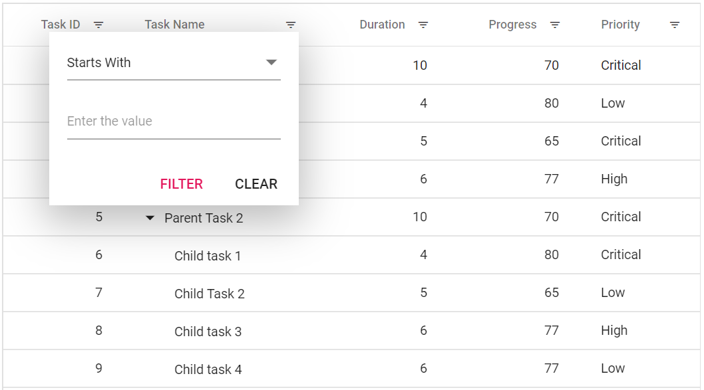
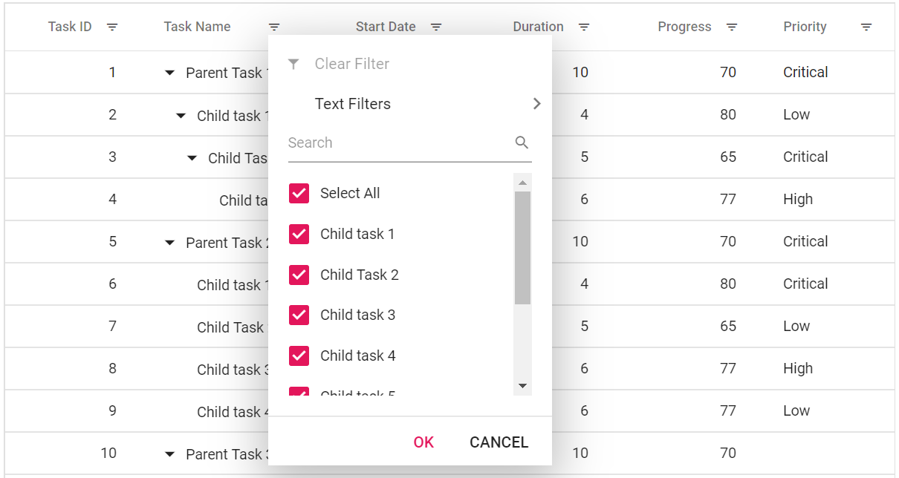

# Filtering in Blazor TreeGrid Component

Filtering allows you to view specific or related records based on filter criteria. To enable filtering in the Tree Grid, set the [AllowFiltering](https://help.syncfusion.com/cr/blazor/Syncfusion.Blazor~Syncfusion.Blazor.TreeGrid.SfTreeGrid~AllowFiltering.html) to true. Filtering options can be configured through [FilterSettings](https://help.syncfusion.com/cr/blazor/Syncfusion.Blazor~Syncfusion.Blazor.TreeGrid.SfTreeGrid~FilterSettings.html).





@using TreeGridComponent.Data;
@using  Syncfusion.Blazor.TreeGrid;
@using  Syncfusion.Blazor.Data;

<SfTreeGrid DataSource="@TreeGridData" IdMapping="TaskId" ParentIdMapping="ParentId" TreeColumnIndex="1" AllowFiltering="true">
    <TreeGridColumns>
        <TreeGridColumn Field="TaskId" HeaderText="Task ID" Width="80" TextAlign="Syncfusion.Blazor.Grids.TextAlign.Right"></TreeGridColumn>
        <TreeGridColumn Field="TaskName" HeaderText="Task Name" Width="100"></TreeGridColumn>
        <TreeGridColumn Field="StartDate" HeaderText="Start Date" Width="100" TextAlign="Syncfusion.Blazor.Grids.TextAlign.Right"></TreeGridColumn>
        <TreeGridColumn Field="Duration" HeaderText="Duration" Width="100" TextAlign="Syncfusion.Blazor.Grids.TextAlign.Right"></TreeGridColumn>
        <TreeGridColumn Field="Progress" HeaderText="Progress" Width="100" TextAlign="Syncfusion.Blazor.Grids.TextAlign.Right"></TreeGridColumn>
        <TreeGridColumn Field="Priority" HeaderText="Priority" Width="60"></TreeGridColumn>
    </TreeGridColumns>
</SfTreeGrid>

@code{
    public List<BusinessObject> TreeGridData { get; set; }

    protected override void OnInitialized()
    {
        this.TreeGridData = BusinessObject.GetSelfDataSource().ToList();
    }
}





namespace TreeGridComponent.Data {

        public class BusinessObject
        {
            public int TaskId { get; set;}
            public string TaskName { get; set;}
            public int? Duration { get; set;}
            public int? Progress { get; set;}
            public string Priority { get; set;}
            public int? ParentId { get; set;}
       
        public static List<BusinessObject> GetSelfDataSource()
        {
            List<BusinessObject> BusinessObjectCollection = new List<BusinessObject>();
            BusinessObjectCollection.Add(new BusinessObject() { TaskId = 1,TaskName = "Parent Task 1",Duration = 10,Progress = 70,Priority = "Critical",ParentId = null });
            BusinessObjectCollection.Add(new BusinessObject() { TaskId = 2,TaskName = "Child task 1",Duration = 4,Progress = 80,Priority = "Low",ParentId = 1 });
            BusinessObjectCollection.Add(new BusinessObject() { TaskId = 3,TaskName = "Child Task 2",Duration = 5,Progress = 65,Priority = "Critical",ParentId = 2 });
            BusinessObjectCollection.Add(new BusinessObject() { TaskId = 4,TaskName = "Child task 3",Duration = 6,Priority = "High",Progress = 77,ParentId = 3 });
            BusinessObjectCollection.Add(new BusinessObject() { TaskId = 5,TaskName = "Parent Task 2",Duration = 10,Progress = 70,Priority = "Critical",ParentId = null});
            BusinessObjectCollection.Add(new BusinessObject() { TaskId = 6,TaskName = "Child task 1",Duration = 4,Progress = 80,Priority = "Critical",ParentId = 5});
            BusinessObjectCollection.Add(new BusinessObject() { TaskId = 7,TaskName = "Child Task 2",Duration = 5,Progress = 65,Priority = "Low",ParentId = 5});
            BusinessObjectCollection.Add(new BusinessObject() { TaskId = 8,TaskName = "Child task 3",Duration = 6,Progress = 77,Priority = "High",ParentId = 5});
            BusinessObjectCollection.Add(new BusinessObject() { TaskId = 9,TaskName = "Child task 4",Duration = 6,Progress = 77,Priority = "Low",ParentId = 5});
            return BusinessObjectCollection;
        }
    }
}





The following output is displayed as a result of the above code example.

> * You can apply and clear filtering by using [FilterByColumn](https://help.syncfusion.com/cr/blazor/Syncfusion.Blazor~Syncfusion.Blazor.TreeGrid.SfTreeGrid~FilterByColumn.html) and [ClearFiltering](https://help.syncfusion.com/cr/blazor/Syncfusion.Blazor~Syncfusion.Blazor.TreeGrid.SfTreeGrid~ClearFiltering.html) methods.
> * To disable filtering for a particular column, set [AllowFiltering](https://help.syncfusion.com/cr/blazor/Syncfusion.Blazor~Syncfusion.Blazor.TreeGrid.TreeGridColumn~AllowFiltering.html) property of [Column](https://help.syncfusion.com/cr/blazor/Syncfusion.Blazor~Syncfusion.Blazor.TreeGrid.TreeGridColumn.html) to false.

## Filter hierarchy modes

Tree Grid provides support for a set of filtering modes with [HierarchyMode](https://help.syncfusion.com/cr/blazor/Syncfusion.Blazor~Syncfusion.Blazor.TreeGrid.TreeGridFilterSettings~HierarchyMode.html) of [FilterSettings](https://help.syncfusion.com/cr/blazor/Syncfusion.Blazor~Syncfusion.Blazor.TreeGrid.TreeGridFilterSettings.html) property. The below are the type of filter mode available in Tree Grid.

* **Parent** : This is the default filter hierarchy mode in Tree Grid. The filtered records are displayed with its parent records, if the filtered records not have any parent record then the filtered records only displayed.

* **Child** : The filtered records are displayed with its child record, if the filtered records not have any child record then the filtered records only displayed.

* **Both** : The filtered records are displayed with its both parent and child record, if the filtered records not have any parent and child record then the filtered records only displayed.

* **None** : The filtered records are only displayed.

## Initial filter

To apply the filter at initial rendering, set the filter **PredicateModel** in [Columns](https://help.syncfusion.com/cr/blazor/Syncfusion.Blazor~Syncfusion.Blazor.TreeGrid.TreeGridFilterSettings~Columns.html) property of [FilterSettings](https://help.syncfusion.com/cr/blazor/Syncfusion.Blazor~Syncfusion.Blazor.TreeGrid.TreeGridFilterSettings_members.html).





@using TreeGridComponent.Data;
@using Syncfusion.Blazor.TreeGrid;
@using Syncfusion.Blazor.Data;
@using Syncfusion.Blazor.Grids;

<SfTreeGrid IdMapping="TaskId" DataSource="@TreeGridData" AllowFiltering="true" ParentIdMapping="ParentId" TreeColumnIndex="1">
    <TreeGridFilterSettings>
        <TreeGridFilterColumns>
            <TreeGridFilterColumn Field="TaskName" MatchCase="false" Operator="Syncfusion.Blazor.Operator.StartsWith" Predicate="and" Value="@Name"></TreeGridFilterColumn>
            <TreeGridFilterColumn Field="Duration" MatchCase="false" Operator="Syncfusion.Blazor.Operator.Equal" Predicate="and" Value="@Duration"></TreeGridFilterColumn>
        </TreeGridFilterColumns>
    </TreeGridFilterSettings>
    <TreeGridColumns>
        <TreeGridColumn Field="TaskId" HeaderText="Task ID" Width="80" TextAlign="@TextAlign.Right"></TreeGridColumn>
        <TreeGridColumn Field="TaskName" HeaderText="Task Name" Width="160"></TreeGridColumn>
        <TreeGridColumn Field="Duration" HeaderText="Duration" Width="100" TextAlign="@TextAlign.Right"></TreeGridColumn>
        <TreeGridColumn Field="Progress" HeaderText="Progress" Width="100" TextAlign="@TextAlign.Right"></TreeGridColumn>
        <TreeGridColumn Field="Priority" HeaderText="Priority" Width="80"></TreeGridColumn>
    </TreeGridColumns>
</SfTreeGrid>

@code{

    public string Name { get; set; } = "Child";

    public int Duration { get; set; } = 5;

    public List<BusinessObject> TreeGridData { get; set; }

    protected override void OnInitialized()
    {
        this.TreeGridData = BusinessObject.GetSelfDataSource().ToList();
    }
}





namespace TreeGridComponent.Data {

        public class BusinessObject
        {
            public int TaskId { get; set;}
            public string TaskName { get; set;}
            public int? Duration { get; set;}
            public int? Progress { get; set;}
            public string Priority { get; set;}
            public int? ParentId { get; set;}
       
        public static List<BusinessObject> GetSelfDataSource()
        {
            List<BusinessObject> BusinessObjectCollection = new List<BusinessObject>();
            BusinessObjectCollection.Add(new BusinessObject() { TaskId = 1,TaskName = "Parent Task 1",Duration = 10,Progress = 70,Priority = "Critical",ParentId = null });
            BusinessObjectCollection.Add(new BusinessObject() { TaskId = 2,TaskName = "Child task 1",Duration = 4,Progress = 80,Priority = "Low",ParentId = 1 });
            BusinessObjectCollection.Add(new BusinessObject() { TaskId = 3,TaskName = "Child Task 2",Duration = 5,Progress = 65,Priority = "Critical",ParentId = 2 });
            BusinessObjectCollection.Add(new BusinessObject() { TaskId = 4,TaskName = "Child task 3",Duration = 6,Priority = "High",Progress = 77,ParentId = 3 });
            BusinessObjectCollection.Add(new BusinessObject() { TaskId = 5,TaskName = "Parent Task 2",Duration = 10,Progress = 70,Priority = "Critical",ParentId = null});
            BusinessObjectCollection.Add(new BusinessObject() { TaskId = 6,TaskName = "Child task 1",Duration = 4,Progress = 80,Priority = "Critical",ParentId = 5});
            BusinessObjectCollection.Add(new BusinessObject() { TaskId = 7,TaskName = "Child Task 2",Duration = 5,Progress = 65,Priority = "Low",ParentId = 5});
            BusinessObjectCollection.Add(new BusinessObject() { TaskId = 8,TaskName = "Child task 3",Duration = 6,Progress = 77,Priority = "High",ParentId = 5});
            BusinessObjectCollection.Add(new BusinessObject() { TaskId = 9,TaskName = "Child task 4",Duration = 6,Progress = 77,Priority = "Low",ParentId = 5});
            return BusinessObjectCollection;
        }
    }
}





The following output is displayed as a result of the above code example.

## Filter operators

The filter operator for a column can be defined in the **Operator** property of [Columns](https://help.syncfusion.com/cr/blazor/Syncfusion.Blazor~Syncfusion.Blazor.TreeGrid.TreeGridFilterSettings~Columns.html) property of [FilterSettings](https://help.syncfusion.com/cr/blazor/Syncfusion.Blazor~Syncfusion.Blazor.TreeGrid.TreeGridFilterSettings_members.html).

The available operators and its supported data types are:

Operator |Description |Supported Types
-----|-----|-----
startswith |Checks whether the value begins with the specified value. |String
endswith |Checks whether the value ends with the specified value. |String
contains |Checks whether the value contains the specified value. |String
equal |Checks whether the value is equal to the specified value. |String &#124; Number &#124; Boolean &#124; Date
notequal |Checks for values not equal to the specified value. |String &#124; Number &#124; Boolean &#124; Date
greaterthan |Checks whether the value is greater than the specified value. |Number &#124; Date
greaterthanorequal|Checks whether a value is greater than or equal to the specified value. |Number &#124; Date
lessthan |Checks whether the value is less than the specified value. |Number &#124; Date
lessthanorequal |Checks whether the value is less than or equal to the specified value. |Number &#124; Date

> By default, the [Operator](https://help.syncfusion.com/cr/blazor/Syncfusion.Blazor~Syncfusion.Blazor.TreeGrid.TreeGridFilterSettings~Operators.html) value is **equal**.

## Filter bar

By setting the [AllowFiltering](https://help.syncfusion.com/cr/blazor/Syncfusion.Blazor~Syncfusion.Blazor.TreeGrid.SfTreeGrid~AllowFiltering.html) to true, the filter bar row will render next to the header, which allows you to filter data. You can filter the records with different expressions depending upon the column type.

 **Filter bar expressions:**

 You can enter the following filter expressions (operators) manually in the filter bar.

Expression |Example |Description |Column Type
-----|-----|-----|-----
= |=value |equal |Number
!= |!=value |notequal |Number
> |>value |greaterthan |Number
< |<value |lessthan |Number
>= |>=value |greaterthanorequal |Number
<=|<=value|lessthanorequal |Number
* |*value |startswith |String
% |%value |endswith |String
N/A |N/A | **Equal** operator will always be used for date filter. |Date
N/A |N/A |**Equal** operator will always be used for Boolean filter. |Boolean





@using TreeGridComponent.Data;
@using Syncfusion.Blazor.TreeGrid;
@using Syncfusion.Blazor.Data;

<SfTreeGrid IdMapping="TaskId" DataSource="@TreeGridData" ParentIdMapping="ParentId" TreeColumnIndex="1" AllowFiltering="true">
    <TreeGridColumns>
        <TreeGridColumn Field="TaskId" HeaderText="Task ID" Width="80" TextAlign="Syncfusion.Blazor.Grids.TextAlign.Right"></TreeGridColumn>
        <TreeGridColumn Field="TaskName" HeaderText="Task Name" Width="100"></TreeGridColumn>
        <TreeGridColumn Field="StartDate" HeaderText="Start Date" Width="100" TextAlign="Syncfusion.Blazor.Grids.TextAlign.Right"></TreeGridColumn>
        <TreeGridColumn Field="Duration" HeaderText="Duration" Width="100" TextAlign="Syncfusion.Blazor.Grids.TextAlign.Right"></TreeGridColumn>
        <TreeGridColumn Field="Progress" HeaderText="Progress" Width="100" TextAlign="Syncfusion.Blazor.Grids.TextAlign.Right"></TreeGridColumn>
        <TreeGridColumn Field="Priority" HeaderText="Priority" Width="60"></TreeGridColumn>
    </TreeGridColumns>
</SfTreeGrid>

@code{
    public List<BusinessObject> TreeGridData { get; set; }

    protected override void OnInitialized()
    {
        this.TreeGridData = BusinessObject.GetSelfDataSource().ToList();
    }
}





namespace TreeGridComponent.Data {

        public class BusinessObject
        {
            public int TaskId { get; set;}
            public string TaskName { get; set;}
            public int? Duration { get; set;}
            public int? Progress { get; set;}
            public string Priority { get; set;}
            public int? ParentId { get; set;}
       
        public static List<BusinessObject> GetSelfDataSource()
        {
            List<BusinessObject> BusinessObjectCollection = new List<BusinessObject>();
            BusinessObjectCollection.Add(new BusinessObject() { TaskId = 1,TaskName = "Parent Task 1",Duration = 10,Progress = 70,Priority = "Critical",ParentId = null });
            BusinessObjectCollection.Add(new BusinessObject() { TaskId = 2,TaskName = "Child task 1",Duration = 4,Progress = 80,Priority = "Low",ParentId = 1 });
            BusinessObjectCollection.Add(new BusinessObject() { TaskId = 3,TaskName = "Child Task 2",Duration = 5,Progress = 65,Priority = "Critical",ParentId = 2 });
            BusinessObjectCollection.Add(new BusinessObject() { TaskId = 4,TaskName = "Child task 3",Duration = 6,Priority = "High",Progress = 77,ParentId = 3 });
            BusinessObjectCollection.Add(new BusinessObject() { TaskId = 5,TaskName = "Parent Task 2",Duration = 10,Progress = 70,Priority = "Critical",ParentId = null});
            BusinessObjectCollection.Add(new BusinessObject() { TaskId = 6,TaskName = "Child task 1",Duration = 4,Progress = 80,Priority = "Critical",ParentId = 5});
            BusinessObjectCollection.Add(new BusinessObject() { TaskId = 7,TaskName = "Child Task 2",Duration = 5,Progress = 65,Priority = "Low",ParentId = 5});
            BusinessObjectCollection.Add(new BusinessObject() { TaskId = 8,TaskName = "Child task 3",Duration = 6,Progress = 77,Priority = "High",ParentId = 5});
            BusinessObjectCollection.Add(new BusinessObject() { TaskId = 9,TaskName = "Child task 4",Duration = 6,Progress = 77,Priority = "Low",ParentId = 5});
            return BusinessObjectCollection;
        }
    }
}





## Filter bar template with custom component

The [FilterTemplate](https://help.syncfusion.com/cr/blazor/Syncfusion.Blazor.TreeGrid.TreeGridColumn.html#Syncfusion_Blazor_TreeGrid_TreeGridColumn_FilterTemplate) property is used to add custom components to a particular column. To access the filtered values inside the `FilterTemplate`, you can use the implicit named parameter context. You can type cast the context as `PredicateModel<T>` to get filter values inside template.

In the following sample, the dropdown is used as a custom component in the Duration column.





@using TreeGridComponent.Data;
@using  Syncfusion.Blazor.TreeGrid;
@using  Syncfusion.Blazor.Data;

<SfTreeGrid @ref="TreeGrid" DataSource="@TreeGridData" IdMapping="TaskId" ParentIdMapping="ParentId" TreeColumnIndex="1" AllowFiltering="true">    
    <TreeGridColumns>
        <TreeGridColumn Field="TaskId" HeaderText="Task ID" Width="80" TextAlign="Syncfusion.Blazor.Grids.TextAlign.Right"></TreeGridColumn>
        <TreeGridColumn Field="TaskName" HeaderText="Task Name" Width="100"></TreeGridColumn>
        <TreeGridColumn Field="StartDate" HeaderText="Start Date" Width="100" TextAlign="Syncfusion.Blazor.Grids.TextAlign.Right"></TreeGridColumn>
        <TreeGridColumn Field="Duration" HeaderText="Duration" Width="100" TextAlign="Syncfusion.Blazor.Grids.TextAlign.Right">
            <FilterTemplate>
                <SfDropDownList TValue="string" DataSource="@DropDownData" TItem="string">
                    <DropDownListEvents ValueChange="change" TValue="string"></DropDownListEvents>
                <SfDropDownList TValue="string"c DataSource="@DropDownData" TItem="string" Value="@((string)(context as PredicateModel).Value)">
                    <DropDownListEvents ValueChange="change" TValue="string" ></DropDownListEvents>
                </SfDropDownList>
            </FilterTemplate>
        </TreeGridColumn>
        <TreeGridColumn Field="Progress" HeaderText="Progress" Width="100" TextAlign="Syncfusion.Blazor.Grids.TextAlign.Right"></TreeGridColumn>
        <TreeGridColumn Field="Priority" HeaderText="Priority" Width="60"></TreeGridColumn>
    </TreeGridColumns>
</SfTreeGrid>

@code{

    SfTreeGrid<BusinessObject> TreeGrid;

    public List<string> DropDownData { get; set; } = new List<string>();

    public List<BusinessObject> TreeGridData { get; set; }

    protected override void OnInitialized()
    {
        this.TreeGridData = BusinessObject.GetSelfDataSource().ToList();

        this.DropDownData.Add("10");
        this.DropDownData.Add("50");
        this.DropDownData.Add("5");
        this.DropDownData.Add("6");
        this.DropDownData.Add("4");        
        this.DropDownData.Add("All");
    }    

    public void change(Syncfusion.Blazor.DropDowns.ChangeEventArgs<string> Args)
    {
        if (Args.Value == "All")
        {
            TreeGrid.ClearFiltering("Duration");
        }
        else
        {
            int val = Convert.ToInt32(Args.Value);
            TreeGrid.FilterByColumn("Duration", "equal", val);
        }
    }
}





namespace TreeGridComponent.Data {

        public class BusinessObject
        {
            public int TaskId { get; set;}
            public string TaskName { get; set;}
            public int? Duration { get; set;}
            public int? Progress { get; set;}
            public string Priority { get; set;}
            public int? ParentId { get; set;}
       
        public static List<BusinessObject> GetSelfDataSource()
        {
            List<BusinessObject> BusinessObjectCollection = new List<BusinessObject>();
            BusinessObjectCollection.Add(new BusinessObject() { TaskId = 1,TaskName = "Parent Task 1",Duration = 10,Progress = 70,Priority = "Critical",ParentId = null });
            BusinessObjectCollection.Add(new BusinessObject() { TaskId = 2,TaskName = "Child task 1",Duration = 4,Progress = 80,Priority = "Low",ParentId = 1 });
            BusinessObjectCollection.Add(new BusinessObject() { TaskId = 3,TaskName = "Child Task 2",Duration = 5,Progress = 65,Priority = "Critical",ParentId = 2 });
            BusinessObjectCollection.Add(new BusinessObject() { TaskId = 4,TaskName = "Child task 3",Duration = 6,Priority = "High",Progress = 77,ParentId = 3 });
            BusinessObjectCollection.Add(new BusinessObject() { TaskId = 5,TaskName = "Parent Task 2",Duration = 10,Progress = 70,Priority = "Critical",ParentId = null});
            BusinessObjectCollection.Add(new BusinessObject() { TaskId = 6,TaskName = "Child task 1",Duration = 4,Progress = 80,Priority = "Critical",ParentId = 5});
            BusinessObjectCollection.Add(new BusinessObject() { TaskId = 7,TaskName = "Child Task 2",Duration = 5,Progress = 65,Priority = "Low",ParentId = 5});
            BusinessObjectCollection.Add(new BusinessObject() { TaskId = 8,TaskName = "Child task 3",Duration = 6,Progress = 77,Priority = "High",ParentId = 5});
            BusinessObjectCollection.Add(new BusinessObject() { TaskId = 9,TaskName = "Child task 4",Duration = 6,Progress = 77,Priority = "Low",ParentId = 5});
            return BusinessObjectCollection;
        }
    }
}





The following output is displayed as a result of the above code example.

## Filter menu

You can enable filter menu by setting the [Type](https://help.syncfusion.com/cr/blazor/Syncfusion.Blazor~Syncfusion.Blazor.TreeGrid.TreeGridFilterSettings~Type.html) of [FilterSettings](https://help.syncfusion.com/cr/blazor/Syncfusion.Blazor~Syncfusion.Blazor.TreeGrid.TreeGridFilterSettings.html) as **Menu**. The filter menu UI will be rendered based on its column type, which allows you to filter data. You can filter the records with different operators.





@using TreeGridComponent.Data;
@using  Syncfusion.Blazor.TreeGrid;
@using  Syncfusion.Blazor.Data;

<SfTreeGrid IdMapping="TaskId" DataSource="@TreeGridData" ParentIdMapping="ParentId" TreeColumnIndex="1" AllowFiltering="true">
    <TreeGridFilterSettings HierarchyMode="@FilterHierarchyMode.Parent" Type="Syncfusion.Blazor.TreeGrid.FilterType.Menu"></TreeGridFilterSettings>
    <TreeGridColumns>
        <TreeGridColumn Field="TaskId" HeaderText="Task ID" Width="80" TextAlign="Syncfusion.Blazor.Grids.TextAlign.Right"></TreeGridColumn>
        <TreeGridColumn Field="TaskName" HeaderText="Task Name" Width="160"></TreeGridColumn>
        <TreeGridColumn Field="Duration" HeaderText="Duration" Width="100" TextAlign="Syncfusion.Blazor.Grids.TextAlign.Right"></TreeGridColumn>
        <TreeGridColumn Field="Progress" HeaderText="Progress" Width="100" TextAlign="Syncfusion.Blazor.Grids.TextAlign.Right"></TreeGridColumn>
        <TreeGridColumn Field="Priority" HeaderText="Priority" Width="80"></TreeGridColumn>
    </TreeGridColumns>
</SfTreeGrid>

@code{

    public List<BusinessObject> TreeGridData { get; set; }

    protected override void OnInitialized()
    {
        this.TreeGridData = BusinessObject.GetSelfDataSource().ToList();
    }
}





namespace TreeGridComponent.Data {

        public class BusinessObject
        {
            public int TaskId { get; set;}
            public string TaskName { get; set;}
            public int? Duration { get; set;}
            public int? Progress { get; set;}
            public string Priority { get; set;}
            public int? ParentId { get; set;}
       
        public static List<BusinessObject> GetSelfDataSource()
        {
            List<BusinessObject> BusinessObjectCollection = new List<BusinessObject>();
            BusinessObjectCollection.Add(new BusinessObject() { TaskId = 1,TaskName = "Parent Task 1",Duration = 10,Progress = 70,Priority = "Critical",ParentId = null });
            BusinessObjectCollection.Add(new BusinessObject() { TaskId = 2,TaskName = "Child task 1",Duration = 4,Progress = 80,Priority = "Low",ParentId = 1 });
            BusinessObjectCollection.Add(new BusinessObject() { TaskId = 3,TaskName = "Child Task 2",Duration = 5,Progress = 65,Priority = "Critical",ParentId = 2 });
            BusinessObjectCollection.Add(new BusinessObject() { TaskId = 4,TaskName = "Child task 3",Duration = 6,Priority = "High",Progress = 77,ParentId = 3 });
            BusinessObjectCollection.Add(new BusinessObject() { TaskId = 5,TaskName = "Parent Task 2",Duration = 10,Progress = 70,Priority = "Critical",ParentId = null});
            BusinessObjectCollection.Add(new BusinessObject() { TaskId = 6,TaskName = "Child task 1",Duration = 4,Progress = 80,Priority = "Critical",ParentId = 5});
            BusinessObjectCollection.Add(new BusinessObject() { TaskId = 7,TaskName = "Child Task 2",Duration = 5,Progress = 65,Priority = "Low",ParentId = 5});
            BusinessObjectCollection.Add(new BusinessObject() { TaskId = 8,TaskName = "Child task 3",Duration = 6,Progress = 77,Priority = "High",ParentId = 5});
            BusinessObjectCollection.Add(new BusinessObject() { TaskId = 9,TaskName = "Child task 4",Duration = 6,Progress = 77,Priority = "Low",ParentId = 5});
            return BusinessObjectCollection;
        }
    }
}





The following output is displayed as a result of the above code example.

> * [AllowFiltering](https://help.syncfusion.com/cr/blazor/Syncfusion.Blazor~Syncfusion.Blazor.TreeGrid.SfTreeGrid~AllowFiltering.html) must be set as true to enable filter menu.
> * Setting [AllowFiltering](https://help.syncfusion.com/cr/blazor/Syncfusion.Blazor~Syncfusion.Blazor.TreeGrid.TreeGridColumn~AllowFiltering.html) property of [TreeGridColumn](https://help.syncfusion.com/cr/blazor/Syncfusion.Blazor~Syncfusion.Blazor.TreeGrid.TreeGridColumn.html) as false will prevent filter menu rendering for a particular column.

## Custom component in filter menu

The `FilterTemplate` property of [`Column`](https://help.syncfusion.com/cr/blazor/Syncfusion.Blazor~Syncfusion.Blazor.TreeGrid.TreeGridColumn~FilterTemplate.html) is used to add custom filter components to a particular column. In the following sample the FilterTemplate property is used to add custom components to a particular column. To access the filtered values inside the FilterTemplate, you can use the implicit named parameter context. You can type cast the context as `PredicateModel<T>` to get filter values inside template.

In the following sample, dropdown is used as custom component in the duration column.





@using TreeGridComponent.Data;
@using  Syncfusion.Blazor.TreeGrid;
@using  Syncfusion.Blazor.Data;

<SfTreeGrid @ref="TreeGrid" DataSource="@TreeGridData" IdMapping="TaskId" ParentIdMapping="ParentId" TreeColumnIndex="1" AllowFiltering="true">
    <TreeGridFilterSettings Type="Syncfusion.Blazor.TreeGrid.FilterType.Menu"></TreeGridFilterSettings>   
    <TreeGridColumns>
        <TreeGridColumn Field="TaskId" HeaderText="Task ID" Width="80" TextAlign="Syncfusion.Blazor.Grids.TextAlign.Right"></TreeGridColumn>
        <TreeGridColumn Field="TaskName" HeaderText="Task Name" Width="100"></TreeGridColumn>
        <TreeGridColumn Field="StartDate" HeaderText="Start Date" Width="100" TextAlign="Syncfusion.Blazor.Grids.TextAlign.Right"></TreeGridColumn>
        <TreeGridColumn Field="Duration" HeaderText="Duration" Width="100" TextAlign="Syncfusion.Blazor.Grids.TextAlign.Right">
            <FilterTemplate>
                <SfDropDownList TValue="string"c DataSource="@DropDownData" TItem="string" Value="@((string)(context as PredicateModel).Value)">
                    <DropDownListEvents ValueChange="change" TValue="string" ></DropDownListEvents>
                </SfDropDownList>
            </FilterTemplate>
        </TreeGridColumn>
        <TreeGridColumn Field="Progress" HeaderText="Progress" Width="100" TextAlign="Syncfusion.Blazor.Grids.TextAlign.Right"></TreeGridColumn>
        <TreeGridColumn Field="Priority" HeaderText="Priority" Width="60"></TreeGridColumn>
    </TreeGridColumns>
</SfTreeGrid>

@code{

    SfTreeGrid<BusinessObject> TreeGrid;

    public List<BusinessObject> TreeGridData { get; set; }

    protected override void OnInitialized()
    {
        this.TreeGridData = BusinessObject.GetSelfDataSource().ToList();

    }

}





namespace TreeGridComponent.Data {

        public class BusinessObject
        {
            public int TaskId { get; set;}
            public string TaskName { get; set;}
            public int? Duration { get; set;}
            public int? Progress { get; set;}
            public string Priority { get; set;}
            public int? ParentId { get; set;}
       
        public static List<BusinessObject> GetSelfDataSource()
        {
            List<BusinessObject> BusinessObjectCollection = new List<BusinessObject>();
            BusinessObjectCollection.Add(new BusinessObject() { TaskId = 1,TaskName = "Parent Task 1",Duration = 10,Progress = 70,Priority = "Critical",ParentId = null });
            BusinessObjectCollection.Add(new BusinessObject() { TaskId = 2,TaskName = "Child task 1",Duration = 4,Progress = 80,Priority = "Low",ParentId = 1 });
            BusinessObjectCollection.Add(new BusinessObject() { TaskId = 3,TaskName = "Child Task 2",Duration = 5,Progress = 65,Priority = "Critical",ParentId = 2 });
            BusinessObjectCollection.Add(new BusinessObject() { TaskId = 4,TaskName = "Child task 3",Duration = 6,Priority = "High",Progress = 77,ParentId = 3 });
            BusinessObjectCollection.Add(new BusinessObject() { TaskId = 5,TaskName = "Parent Task 2",Duration = 10,Progress = 70,Priority = "Critical",ParentId = null});
            BusinessObjectCollection.Add(new BusinessObject() { TaskId = 6,TaskName = "Child task 1",Duration = 4,Progress = 80,Priority = "Critical",ParentId = 5});
            BusinessObjectCollection.Add(new BusinessObject() { TaskId = 7,TaskName = "Child Task 2",Duration = 5,Progress = 65,Priority = "Low",ParentId = 5});
            BusinessObjectCollection.Add(new BusinessObject() { TaskId = 8,TaskName = "Child task 3",Duration = 6,Progress = 77,Priority = "High",ParentId = 5});
            BusinessObjectCollection.Add(new BusinessObject() { TaskId = 9,TaskName = "Child task 4",Duration = 6,Progress = 77,Priority = "Low",ParentId = 5});
            return BusinessObjectCollection;
        }
    }
}





The following output is displayed as a result of the above code example.

### Enable different filter for a column

You can use both **Menu** and **Excel** filter in a same Tree Grid. To do so, set the type as **Menu** or **Excel** using [Filter](https://help.syncfusion.com/cr/blazor/Syncfusion.Blazor~Syncfusion.Blazor.TreeGrid.TreeGridColumn~Filter.html) property of [TreeGridColumn](https://help.syncfusion.com/cr/blazor/Syncfusion.Blazor~Syncfusion.Blazor.TreeGrid.TreeGridColumn.html).

In the following sample menu filter is enabled by default and excel filter is enabled for the Task Name column using the  [Filter](https://help.syncfusion.com/cr/blazor/Syncfusion.Blazor~Syncfusion.Blazor.TreeGrid.TreeGridColumn~Filter.html)  property of [TreeGridColumn](https://help.syncfusion.com/cr/blazor/Syncfusion.Blazor~Syncfusion.Blazor.TreeGrid.TreeGridColumn.html).





@using TreeGridComponent.Data;
@using  Syncfusion.Blazor.TreeGrid;
@using  Syncfusion.Blazor.Data;

<SfTreeGrid DataSource="@TreeGridData" IdMapping="TaskId" ParentIdMapping="ParentId" TreeColumnIndex="1" AllowFiltering="true">
    <TreeGridFilterSettings HierarchyMode="FilterHierarchyMode.None" Type="Syncfusion.Blazor.TreeGrid.FilterType.Excel"></TreeGridFilterSettings>
    <TreeGridColumns>
        <TreeGridColumn Field="TaskId" HeaderText="Task ID" Width="80" FilterSettings="@(new Syncfusion.Blazor.Grids.FilterSettings{ Type = Syncfusion.Blazor.Grids.FilterType.Menu })" TextAlign="Syncfusion.Blazor.Grids.TextAlign.Right"></TreeGridColumn>
        <TreeGridColumn Field="TaskName" HeaderText="Task Name" Width="100"></TreeGridColumn>
        <TreeGridColumn Field="Duration" HeaderText="Duration" Width="100" TextAlign="Syncfusion.Blazor.Grids.TextAlign.Right"></TreeGridColumn>
        <TreeGridColumn Field="Progress" HeaderText="Progress" Width="100" TextAlign="Syncfusion.Blazor.Grids.TextAlign.Right"></TreeGridColumn>
        <TreeGridColumn Field="Priority" HeaderText="Priority" Width="100" FilterSettings="@(new Syncfusion.Blazor.Grids.FilterSettings{ Type = Syncfusion.Blazor.Grids.FilterType.Menu })"></TreeGridColumn>
    </TreeGridColumns>
</SfTreeGrid>

@code{

    public List<BusinessObject> TreeGridData { get; set; }

    protected override void OnInitialized()
    {
        this.TreeGridData = BusinessObject.GetSelfDataSource().ToList();
    }
}





namespace TreeGridComponent.Data {

        public class BusinessObject
        {
            public int TaskId { get; set;}
            public string TaskName { get; set;}
            public int? Duration { get; set;}
            public int? Progress { get; set;}
            public string Priority { get; set;}
            public int? ParentId { get; set;}
       
        public static List<BusinessObject> GetSelfDataSource()
        {
            List<BusinessObject> BusinessObjectCollection = new List<BusinessObject>();
            BusinessObjectCollection.Add(new BusinessObject() { TaskId = 1,TaskName = "Parent Task 1",Duration = 10,Progress = 70,Priority = "Critical",ParentId = null });
            BusinessObjectCollection.Add(new BusinessObject() { TaskId = 2,TaskName = "Child task 1",Duration = 4,Progress = 80,Priority = "Low",ParentId = 1 });
            BusinessObjectCollection.Add(new BusinessObject() { TaskId = 3,TaskName = "Child Task 2",Duration = 5,Progress = 65,Priority = "Critical",ParentId = 2 });
            BusinessObjectCollection.Add(new BusinessObject() { TaskId = 4,TaskName = "Child task 3",Duration = 6,Priority = "High",Progress = 77,ParentId = 3 });
            BusinessObjectCollection.Add(new BusinessObject() { TaskId = 5,TaskName = "Parent Task 2",Duration = 10,Progress = 70,Priority = "Critical",ParentId = null});
            BusinessObjectCollection.Add(new BusinessObject() { TaskId = 6,TaskName = "Child task 1",Duration = 4,Progress = 80,Priority = "Critical",ParentId = 5});
            BusinessObjectCollection.Add(new BusinessObject() { TaskId = 7,TaskName = "Child Task 2",Duration = 5,Progress = 65,Priority = "Low",ParentId = 5});
            BusinessObjectCollection.Add(new BusinessObject() { TaskId = 8,TaskName = "Child task 3",Duration = 6,Progress = 77,Priority = "High",ParentId = 5});
            BusinessObjectCollection.Add(new BusinessObject() { TaskId = 9,TaskName = "Child task 4",Duration = 6,Progress = 77,Priority = "Low",ParentId = 5});
            return BusinessObjectCollection;
        }
    }
}





## Excel like filter

You can enable Excel like filter by defining. [Type](https://help.syncfusion.com/cr/blazor/Syncfusion.Blazor~Syncfusion.Blazor.TreeGrid.TreeGridFilterSettings~Type.html) of [FilterSettings](https://help.syncfusion.com/cr/blazor/Syncfusion.Blazor~Syncfusion.Blazor.TreeGrid.TreeGridFilterSettings.html) as **Excel**.The excel menu contains an option such as Sorting, Clear filter, Sub menu for advanced filtering.





@using TreeGridComponent.Data
@using Syncfusion.Blazor.TreeGrid;
@using Syncfusion.Blazor.Data;

<SfTreeGrid DataSource="@TreeGridData" IdMapping="TaskId" ParentIdMapping="ParentId" TreeColumnIndex="1" AllowFiltering="true">
    <TreeGridFilterSettings HierarchyMode="FilterHierarchyMode.Parent" Type="Syncfusion.Blazor.TreeGrid.FilterType.Excel"></TreeGridFilterSettings>
    <TreeGridColumns>
        <TreeGridColumn Field="TaskId" HeaderText="Task ID" Width="80" TextAlign="Syncfusion.Blazor.Grids.TextAlign.Right"></TreeGridColumn>
        <TreeGridColumn Field="TaskName" HeaderText="Task Name" Width="100"></TreeGridColumn>
        <TreeGridColumn Field="StartDate" HeaderText="Start Date" Width="100" TextAlign="Syncfusion.Blazor.Grids.TextAlign.Right"></TreeGridColumn>
        <TreeGridColumn Field="Duration" HeaderText="Duration" Width="100" TextAlign="Syncfusion.Blazor.Grids.TextAlign.Right"></TreeGridColumn>
        <TreeGridColumn Field="Progress" HeaderText="Progress" Width="100" TextAlign="Syncfusion.Blazor.Grids.TextAlign.Right"></TreeGridColumn>
        <TreeGridColumn Field="Priority" HeaderText="Priority" Width="60"></TreeGridColumn>
    </TreeGridColumns>
</SfTreeGrid>

@code{

   public List<BusinessObject> TreeGridData { get; set; }

    protected override void OnInitialized()
    {
        this.TreeGridData = BusinessObject.GetSelfDataSource().ToList();
    }
}





namespace TreeGridComponent.Data {

        public class BusinessObject
        {
            public int TaskId { get; set;}
            public string TaskName { get; set;}
            public int? Duration { get; set;}
            public int? Progress { get; set;}
            public string Priority { get; set;}
            public int? ParentId { get; set;}
       
        public static List<BusinessObject> GetSelfDataSource()
        {
            List<BusinessObject> BusinessObjectCollection = new List<BusinessObject>();
            BusinessObjectCollection.Add(new BusinessObject() { TaskId = 1,TaskName = "Parent Task 1",Duration = 10,Progress = 70,Priority = "Critical",ParentId = null });
            BusinessObjectCollection.Add(new BusinessObject() { TaskId = 2,TaskName = "Child task 1",Duration = 4,,Progress = 80,Priority = "Low",ParentId = 1 });
            BusinessObjectCollection.Add(new BusinessObject() { TaskId = 3,TaskName = "Child Task 2",Duration = 5,Progress = 65,Priority = "Critical",ParentId = 2 });
            BusinessObjectCollection.Add(new BusinessObject() { TaskId = 4,TaskName = "Child task 3",Duration = 6,Priority = "High",Progress = 77,ParentId = 3 });
            BusinessObjectCollection.Add(new BusinessObject() { TaskId = 5,TaskName = "Parent Task 2",Duration = 10,Progress = 70,Priority = "Critical",ParentId = null});
            BusinessObjectCollection.Add(new BusinessObject() { TaskId = 6,TaskName = "Child task 1",Duration = 4,Progress = 80,Priority = "Critical",ParentId = 5});
            BusinessObjectCollection.Add(new BusinessObject() { TaskId = 7,TaskName = "Child Task 2",Duration = 5,Progress = 65,Priority = "Low",ParentId = 5});
            BusinessObjectCollection.Add(new BusinessObject() { TaskId = 8,TaskName = "Child task 3",Duration = 6,Progress = 77,Priority = "High",ParentId = 5});
            BusinessObjectCollection.Add(new BusinessObject() { TaskId = 9,TaskName = "Child task 4",Duration = 6,Progress = 77,Priority = "Low",ParentId = 5});
            return BusinessObjectCollection;
        }
    }
}





The following output is displayed as a result of the above code example.

