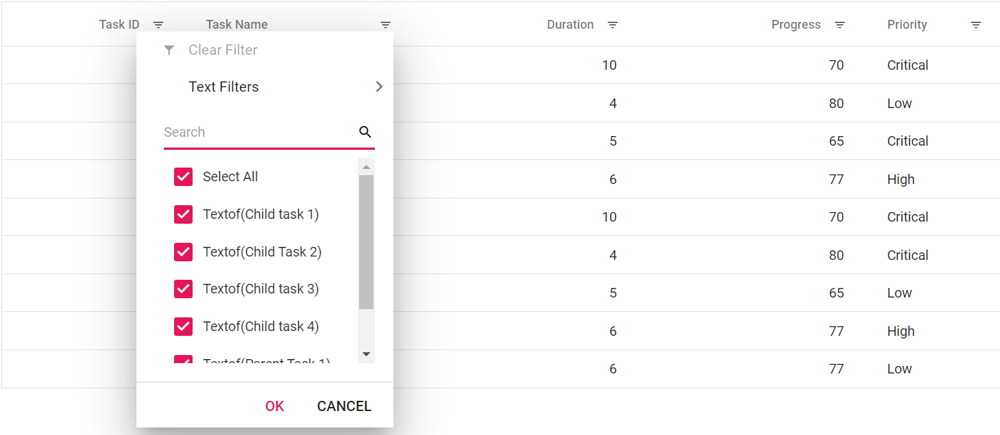
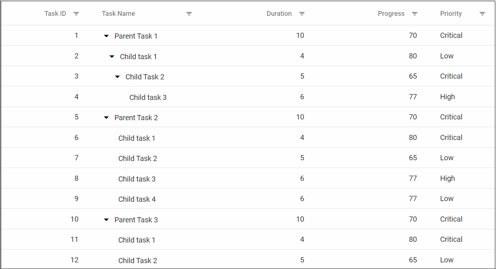
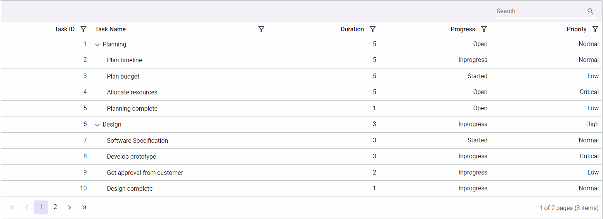

# Excel Like Filter in Blazor TreeGrid Component

Enable Excel like filtering by setting the [Type](https://help.syncfusion.com/cr/blazor/Syncfusion.Blazor~Syncfusion.Blazor.TreeGrid.TreeGridFilterSettings~Type.html) of [FilterSettings](https://help.syncfusion.com/cr/blazor/Syncfusion.Blazor~Syncfusion.Blazor.TreeGrid.TreeGridFilterSettings.html) to **Excel**. The Excel-style menu provides options such as sorting, clearing filters, a search box with a checkbox list, and an advanced filtering submenu.





@using TreeGridComponent.Data
@using Syncfusion.Blazor.TreeGrid;
@using Syncfusion.Blazor.Data;

<SfTreeGrid DataSource="@TreeGridData" IdMapping="TaskId" ParentIdMapping="ParentId" TreeColumnIndex="1" AllowFiltering="true">
    <TreeGridFilterSettings HierarchyMode="FilterHierarchyMode.Parent" Type="Syncfusion.Blazor.TreeGrid.FilterType.Excel"></TreeGridFilterSettings>
    <TreeGridColumns>
        <TreeGridColumn Field="TaskId" HeaderText="Task ID" Width="80" TextAlign="Syncfusion.Blazor.Grids.TextAlign.Right"></TreeGridColumn>
        <TreeGridColumn Field="TaskName" HeaderText="Task Name" Width="100"></TreeGridColumn>
        <TreeGridColumn Field="Duration" HeaderText="Duration" Width="100" TextAlign="Syncfusion.Blazor.Grids.TextAlign.Right"></TreeGridColumn>
        <TreeGridColumn Field="Progress" HeaderText="Progress" Width="100" TextAlign="Syncfusion.Blazor.Grids.TextAlign.Right"></TreeGridColumn>
        <TreeGridColumn Field="Priority" HeaderText="Priority" Width="60"></TreeGridColumn>
    </TreeGridColumns>
</SfTreeGrid>

@code{

   public List<BusinessObject> TreeGridData { get; set; }

    protected override void OnInitialized()
    {
        this.TreeGridData = BusinessObject.GetSelfDataSource().ToList();
    }
}





namespace TreeGridComponent.Data {

        public class BusinessObject
        {
            public int TaskId { get; set;}
            public string TaskName { get; set;}
            public int? Duration { get; set;}
            public int? Progress { get; set;}
            public string Priority { get; set;}
            public int? ParentId { get; set;}
       
        public static List<BusinessObject> GetSelfDataSource()
        {
            List<BusinessObject> BusinessObjectCollection = new List<BusinessObject>();
            BusinessObjectCollection.Add(new BusinessObject() { TaskId = 1,TaskName = "Parent Task 1",Duration = 10,Progress = 70,Priority = "Critical",ParentId = null });
            BusinessObjectCollection.Add(new BusinessObject() { TaskId = 2,TaskName = "Child task 1",Duration = 4,Progress = 80,Priority = "Low",ParentId = 1 });
            BusinessObjectCollection.Add(new BusinessObject() { TaskId = 3,TaskName = "Child Task 2",Duration = 5,Progress = 65,Priority = "Critical",ParentId = 2 });
            BusinessObjectCollection.Add(new BusinessObject() { TaskId = 4,TaskName = "Child task 3",Duration = 6,Priority = "High",Progress = 77,ParentId = 3 });
            BusinessObjectCollection.Add(new BusinessObject() { TaskId = 5,TaskName = "Parent Task 2",Duration = 10,Progress = 70,Priority = "Critical",ParentId = null});
            BusinessObjectCollection.Add(new BusinessObject() { TaskId = 6,TaskName = "Child task 1",Duration = 4,Progress = 80,Priority = "Critical",ParentId = 5});
            BusinessObjectCollection.Add(new BusinessObject() { TaskId = 7,TaskName = "Child Task 2",Duration = 5,Progress = 65,Priority = "Low",ParentId = 5});
            BusinessObjectCollection.Add(new BusinessObject() { TaskId = 8,TaskName = "Child task 3",Duration = 6,Progress = 77,Priority = "High",ParentId = 5});
            BusinessObjectCollection.Add(new BusinessObject() { TaskId = 9,TaskName = "Child task 4",Duration = 6,Progress = 77,Priority = "Low",ParentId = 5});
            return BusinessObjectCollection;
        }
    }
}





## Filter item template

The [FilterItemTemplate](https://help.syncfusion.com/cr/blazor/Syncfusion.Blazor.TreeGrid.TreeGridColumn.html#Syncfusion_Blazor_TreeGrid_TreeGridColumn_FilterItemTemplate) customizes how each value in the Excel-style checkbox list is displayed. Inside the `FilterItemTemplate`, use the implicit **context** parameter of type [FilterItemTemplateContext](https://help.syncfusion.com/cr/blazor/Syncfusion.Blazor.Grids.FilterItemTemplateContext.html) to access the list item value and format it for display.





@using TreeGridComponent.Data
@using Syncfusion.Blazor.TreeGrid;
@using Syncfusion.Blazor.Grids;
@using Syncfusion.Blazor.Data;

<SfTreeGrid DataSource="@TreeGridData" IdMapping="TaskId" ParentIdMapping="ParentId" TreeColumnIndex="1" AllowFiltering="true">
    <TreeGridFilterSettings HierarchyMode="FilterHierarchyMode.Parent" Type="Syncfusion.Blazor.TreeGrid.FilterType.Excel"></TreeGridFilterSettings>
    <TreeGridColumns>
        <TreeGridColumn Field="TaskId" HeaderText="Task ID" Width="80" TextAlign="Syncfusion.Blazor.Grids.TextAlign.Right"></TreeGridColumn>
        <TreeGridColumn Field="TaskName" HeaderText="Task Name" Width="100">
            <FilterItemTemplate>
                @{
                    var filterContext = (context as FilterItemTemplateContext);
                    var itemTemplateValue = "Textof(" + filterContext.Value + ")";
                }
                @itemTemplateValue
            </FilterItemTemplate>
        </TreeGridColumn>
        <TreeGridColumn Field="Duration" HeaderText="Duration" Width="100" TextAlign="Syncfusion.Blazor.Grids.TextAlign.Right"></TreeGridColumn>
        <TreeGridColumn Field="Progress" HeaderText="Progress" Width="100" TextAlign="Syncfusion.Blazor.Grids.TextAlign.Right"></TreeGridColumn>
        <TreeGridColumn Field="Priority" HeaderText="Priority" Width="60"></TreeGridColumn>
    </TreeGridColumns>
</SfTreeGrid>

@code{

   public List<BusinessObject> TreeGridData { get; set; }

    protected override void OnInitialized()
    {
        this.TreeGridData = BusinessObject.GetSelfDataSource().ToList();
    }
}





namespace TreeGridComponent.Data {

        public class BusinessObject
        {
            public int TaskId { get; set;}
            public string TaskName { get; set;}
            public int? Duration { get; set;}
            public int? Progress { get; set;}
            public string Priority { get; set;}
            public int? ParentId { get; set;}
       
        public static List<BusinessObject> GetSelfDataSource()
        {
            List<BusinessObject> BusinessObjectCollection = new List<BusinessObject>();
            BusinessObjectCollection.Add(new BusinessObject() { TaskId = 1,TaskName = "Parent Task 1",Duration = 10,Progress = 70,Priority = "Critical",ParentId = null });
            BusinessObjectCollection.Add(new BusinessObject() { TaskId = 2,TaskName = "Child task 1",Duration = 4,,Progress = 80,Priority = "Low",ParentId = 1 });
            BusinessObjectCollection.Add(new BusinessObject() { TaskId = 3,TaskName = "Child Task 2",Duration = 5,Progress = 65,Priority = "Critical",ParentId = 2 });
            BusinessObjectCollection.Add(new BusinessObject() { TaskId = 4,TaskName = "Child task 3",Duration = 6,Priority = "High",Progress = 77,ParentId = 3 });
            BusinessObjectCollection.Add(new BusinessObject() { TaskId = 5,TaskName = "Parent Task 2",Duration = 10,Progress = 70,Priority = "Critical",ParentId = null});
            BusinessObjectCollection.Add(new BusinessObject() { TaskId = 6,TaskName = "Child task 1",Duration = 4,Progress = 80,Priority = "Critical",ParentId = 5});
            BusinessObjectCollection.Add(new BusinessObject() { TaskId = 7,TaskName = "Child Task 2",Duration = 5,Progress = 65,Priority = "Low",ParentId = 5});
            BusinessObjectCollection.Add(new BusinessObject() { TaskId = 8,TaskName = "Child task 3",Duration = 6,Progress = 77,Priority = "High",ParentId = 5});
            BusinessObjectCollection.Add(new BusinessObject() { TaskId = 9,TaskName = "Child task 4",Duration = 6,Progress = 77,Priority = "Low",ParentId = 5});
            return BusinessObjectCollection;
        }
    }
}





## Customize the height and width of filter popup

Customize the height and width of each column’s filter dialog using CSS in the [FilterDialogOpening](https://help.syncfusion.com/cr/blazor/Syncfusion.Blazor.TreeGrid.TreeGridEvents-1.html#Syncfusion_Blazor_TreeGrid_TreeGridEvents_1_FilterDialogOpening) event. The event is triggered before opening the filter dialog, allowing dynamic sizing based on the target column. The styles below are scoped to the current grid by ID.

In the following example, different sizes are applied for the TaskId and TaskName column filter dialogs.





@using TreeGridComponent.Data
@using Syncfusion.Blazor.TreeGrid;
@using Syncfusion.Blazor.Grids;
@using Syncfusion.Blazor.Data;

<SfTreeGrid ID= "TreeGrid" Width="900px" DataSource="@TreeGridData" IdMapping="TaskId" ParentIdMapping="ParentId" TreeColumnIndex="1" AllowFiltering="true">
    <TreeGridEvents FilterDialogOpening="FilterDialogOpeningHandler" TValue="BusinessObject"></TreeGridEvents>
    <TreeGridFilterSettings HierarchyMode="FilterHierarchyMode.Parent" Type="Syncfusion.Blazor.TreeGrid.FilterType.Excel"></TreeGridFilterSettings>
    <TreeGridColumns>
        <TreeGridColumn Field="TaskId" HeaderText="Task ID" Width="80" TextAlign="Syncfusion.Blazor.Grids.TextAlign.Right"></TreeGridColumn>
        <TreeGridColumn Field="TaskName" HeaderText="Task Name" Width="100"></TreeGridColumn>
        <TreeGridColumn Field="Duration" HeaderText="Duration" Width="100" TextAlign="Syncfusion.Blazor.Grids.TextAlign.Right"></TreeGridColumn>
        <TreeGridColumn Field="Progress" HeaderText="Progress" Width="100" TextAlign="Syncfusion.Blazor.Grids.TextAlign.Right"></TreeGridColumn>
        <TreeGridColumn Field="Priority" HeaderText="Priority" Width="60"></TreeGridColumn>
    </TreeGridColumns>
</SfTreeGrid>

@if(IsLarge)
{
    
}
@if(IsSmall)
{
       
}

@code{

   public List<BusinessObject> TreeGridData { get; set; }

    public bool IsLarge;
    public bool IsSmall;

    public void FilterDialogOpeningHandler(FilterDialogOpeningEventArgs args)
    {
        if(args.ColumnName == "TaskName")
        {
            IsLarge = true;
            IsSmall = false;
        }
        else if(args.ColumnName == "TaskId")
        {
            IsSmall = true;
            IsLarge = false;
        }
        else
        {
            IsLarge = false;
            IsSmall = false;
        }
    }

    protected override void OnInitialized()
    {
        this.TreeGridData = BusinessObject.GetSelfDataSource().ToList();
    }
}





namespace TreeGridComponent.Data {

        public class BusinessObject
        {
            public int TaskId { get; set;}
            public string TaskName { get; set;}
            public int? Duration { get; set;}
            public int? Progress { get; set;}
            public string Priority { get; set;}
            public int? ParentId { get; set;}
       
        public static List<BusinessObject> GetSelfDataSource()
        {
            List<BusinessObject> BusinessObjectCollection = new List<BusinessObject>();
            BusinessObjectCollection.Add(new BusinessObject() { TaskId = 1,TaskName = "Parent Task 1",Duration = 10,Progress = 70,Priority = "Critical",ParentId = null });
            BusinessObjectCollection.Add(new BusinessObject() { TaskId = 2,TaskName = "Child task 1",Duration = 4,Progress = 80,Priority = "Low",ParentId = 1 });
            BusinessObjectCollection.Add(new BusinessObject() { TaskId = 3,TaskName = "Child Task 2",Duration = 5,Progress = 65,Priority = "Critical",ParentId = 2 });
            BusinessObjectCollection.Add(new BusinessObject() { TaskId = 4,TaskName = "Child task 3",Duration = 6,Priority = "High",Progress = 77,ParentId = 3 });
            BusinessObjectCollection.Add(new BusinessObject() { TaskId = 5,TaskName = "Parent Task 2",Duration = 10,Progress = 70,Priority = "Critical",ParentId = null});
            BusinessObjectCollection.Add(new BusinessObject() { TaskId = 6,TaskName = "Child task 1",Duration = 4,Progress = 80,Priority = "Critical",ParentId = 5});
            BusinessObjectCollection.Add(new BusinessObject() { TaskId = 7,TaskName = "Child Task 2",Duration = 5,Progress = 65,Priority = "Low",ParentId = 5});
            BusinessObjectCollection.Add(new BusinessObject() { TaskId = 8,TaskName = "Child task 3",Duration = 6,Progress = 77,Priority = "High",ParentId = 5});
            BusinessObjectCollection.Add(new BusinessObject() { TaskId = 9,TaskName = "Child task 4",Duration = 6,Progress = 77,Priority = "Low",ParentId = 5});
            BusinessObjectCollection.Add(new BusinessObject() { TaskId = 10,TaskName = "Parent Task 3",Duration = 10,Progress = 70,Priority = "Critical",ParentId = null});
            BusinessObjectCollection.Add(new BusinessObject() { TaskId = 11,TaskName = "Child task 1",Duration = 4,Progress = 80,Priority = "Critical",ParentId = 10});
            BusinessObjectCollection.Add(new BusinessObject() { TaskId = 12,TaskName = "Child Task 2",Duration = 5,Progress = 65,Priority = "Low",ParentId = 10});
            return BusinessObjectCollection;
        }
    }
}





## Add current selection option to filter checkbox in excel filter dialog

By default, the Excel filter applies only the items selected in the current dialog interaction. When filtering multiple times on the same column, earlier selections may be cleared. To preserve earlier selections and combine them with new ones, an **Add current selection to filter** option can be provided in the Excel filter dialog.

In the following example, the **Add current selection to filter** checkbox appears when values are searched in the Excel filter dialog, allowing the new selection to be added to existing filtered values.





@using TreeGridComponent.Data
@using Syncfusion.Blazor.TreeGrid;

<SfTreeGrid ID="Grid" DataSource="@TreeGridData" AllowPaging="true" AllowFiltering="true" IdMapping="TaskId" ParentIdMapping="ParentId" TreeColumnIndex="1">
    <TreeGridPageSettings PageSize="2"></TreeGridPageSettings>
    <TreeGridFilterSettings Type="Syncfusion.Blazor.TreeGrid.FilterType.Excel"></TreeGridFilterSettings>
    <TreeGridColumns>
        <TreeGridColumn Field="TaskId" HeaderText="Task ID" Width="80" IsPrimaryKey="true"  TextAlign="Syncfusion.Blazor.Grids.TextAlign.Right"></TreeGridColumn>
        <TreeGridColumn Field="TaskName" HeaderText="Task Name" Width="160"></TreeGridColumn>
        <TreeGridColumn Field="Duration" HeaderText="Duration" Width="100" TextAlign="Syncfusion.Blazor.Grids.TextAlign.Right"></TreeGridColumn>
        <TreeGridColumn Field="Progress" HeaderText="Progress" Width="100" TextAlign="Syncfusion.Blazor.Grids.TextAlign.Right"></TreeGridColumn>
        <TreeGridColumn Field="Priority" HeaderText="Priority" Width="100" TextAlign="Syncfusion.Blazor.Grids.TextAlign.Right"></TreeGridColumn>
    </TreeGridColumns>
</SfTreeGrid>

@code{
    public List<WrapData> TreeGridData { get; set; }
    protected override void OnInitialized()
    {
        this.TreeGridData = WrapData.GetWrapData().ToList();
    }
}





namespace TreeGridComponent.Data {

        public class WrapData
{
    public int TaskId { get; set; }
    public string TaskName { get; set; }
    public DateTime? StartDate { get; set; }
    public DateTime? EndDate { get; set; }
    public int? Duration { get; set; }
    public String Progress { get; set; }
    public string Priority { get; set; }
    public bool Approved { get; set; }
    public int Resources { get; set; }
    public int? ParentId { get; set; }
    public static List<WrapData> GetWrapData()
    {
        List<WrapData> BusinessObjectCollection = new List<WrapData>();
        BusinessObjectCollection.Add(new WrapData()
        {
            TaskId = 1,
            TaskName = "Planning",
            StartDate = new DateTime(2017, 03, 02),
            EndDate = new DateTime(2017, 07, 03),
            Progress = "Open",
            Duration = 5,
            Priority = "Normal",
            Resources = 6,
            Approved = false,
            ParentId = null
        });
        BusinessObjectCollection.Add(new WrapData()
        {
            TaskId = 2,
            TaskName = "Plan timeline",
            StartDate = new DateTime(2017, 03, 04),
            EndDate = new DateTime(2017, 07, 05),
            Progress = "Inprogress",
            Duration = 5,
            Resources = 4,
            Priority = "Normal",
            Approved = false,
            ParentId = 1
        });
        BusinessObjectCollection.Add(new WrapData()
        {
            TaskId = 3,
            TaskName = "Plan budget",
            StartDate = new DateTime(2017, 03, 06),
            EndDate = new DateTime(2017, 07, 07),
            Duration = 5,
            Progress = "Started",
            Approved = true,
            Resources = 6,
            Priority = "Low",
            ParentId = 1
        });
        BusinessObjectCollection.Add(new WrapData()
        {
            TaskId = 4,
            TaskName = "Allocate resources",
            StartDate = new DateTime(2017, 03, 08),
            EndDate = new DateTime(2017, 07, 09),
            Duration = 5,
            Progress = "Open",
            Priority = "Critical",
            ParentId = 1,
            Resources = 3,
            Approved = false
        });
        BusinessObjectCollection.Add(new WrapData()
        {
            TaskId = 5,
            TaskName = "Planning complete",
            StartDate = new DateTime(2017, 07, 10),
            EndDate = new DateTime(2017, 07, 11),
            Duration = 1,
            Progress = "Open",
            Priority = "Low",
            Resources = 5,
            ParentId = 1,
            Approved = true
        });
        BusinessObjectCollection.Add(new WrapData()
        {
            TaskId = 6,
            TaskName = "Design",
            StartDate = new DateTime(2017, 10, 12),
            EndDate = new DateTime(2017, 02, 13),
            Progress = "Inprogress",
            Duration = 3,
            Priority = "High",
            Resources = 4,
            Approved = false,
            ParentId = null
        });
        BusinessObjectCollection.Add(new WrapData()
        {
            TaskId = 7,
            TaskName = "Software Specification",
            StartDate = new DateTime(2017, 10, 14),
            EndDate = new DateTime(2017, 02, 15),
            Duration = 3,
            Progress = "Started",
            Resources = 3,
            Priority = "Normal",
            ParentId = 6,
            Approved = false
        });
        BusinessObjectCollection.Add(new WrapData()
        {
            TaskId = 8,
            TaskName = "Develop prototype",
            StartDate = new DateTime(2017, 10, 16),
            EndDate = new DateTime(2017, 02, 17),
            Duration = 3,
            Progress = "Inprogress",
            Resources = 2,
            Priority = "Critical",
            ParentId = 6,
            Approved = false
        });
        BusinessObjectCollection.Add(new WrapData()
        {
            TaskId = 9,
            TaskName = "Get approval from customer",
            StartDate = new DateTime(2017, 02, 18),
            EndDate = new DateTime(2017, 02, 19),
            Duration = 2,
            Progress = "Inprogress",
            Resources = 3,
            Priority = "Low",
            Approved = true,
            ParentId = 6
        });
        BusinessObjectCollection.Add(new WrapData()
        {
            TaskId = 10,
            TaskName = "Design complete",
            StartDate = new DateTime(2017, 02, 20),
            EndDate = new DateTime(2017, 02, 21),
            Duration = 1,
            Progress = "Inprogress",
            Resources = 6,
            Priority = "Normal",
            ParentId = 6,
            Approved = true
        });
        BusinessObjectCollection.Add(new WrapData()
        {
            TaskId = 12,
            TaskName = "Implementation Phase",
            StartDate = new DateTime(2017, 02, 22),
            EndDate = new DateTime(2017, 02, 23),
            Priority = "Normal",
            Approved = false,
            Duration = 11,
            Resources = 5,
            Progress = "Started",
            ParentId = null
        });
        BusinessObjectCollection.Add(new WrapData()
        {
            TaskId = 13,
            TaskName = "Phase 1",
            StartDate = new DateTime(2017, 02, 24),
            EndDate = new DateTime(2017, 02, 25),
            Priority = "High",
            Approved = false,
            Duration = 11,
            Progress = "Open",
            Resources = 4,
            ParentId = 12
        });
        BusinessObjectCollection.Add(new WrapData()
        {
            TaskId = 14,
            TaskName = "Implementation Module 1",
            StartDate = new DateTime(2017, 02, 26),
            EndDate = new DateTime(2017, 02, 27),
            Priority = "Normal",
            Duration = 11,
            Progress = "Started",
            Resources = 3,
            Approved = false,
            ParentId = 13
        });
        BusinessObjectCollection.Add(new WrapData()
        {
            TaskId = 15,
            TaskName = "Development Task 1",
            StartDate = new DateTime(2017, 06, 18),
            EndDate = new DateTime(2017, 06, 19),
            Duration = 3,
            Progress = "Inprogress",
            Priority = "High",
            Resources = 2,
            ParentId = 14,
            Approved = false
        });
        BusinessObjectCollection.Add(new WrapData()
        {
            TaskId = 16,
            TaskName = "Development Task 2",
            StartDate = new DateTime(2017, 02, 13),
            EndDate = new DateTime(2017, 03, 01),
            Duration = 3,
            Progress = "Closed",
            Priority = "Low",
            Resources = 5,
            ParentId = 14,
            Approved = true
        });
        BusinessObjectCollection.Add(new WrapData()
        {
            TaskId = 17,
            TaskName = "Testing",
            StartDate = new DateTime(2017, 03, 02),
            EndDate = new DateTime(2017, 03, 03),
            Duration = 2,
            Progress = "Closed",
            Priority = "Normal",
            ParentId = 14,
            Resources = 1,
            Approved = true
        });
        BusinessObjectCollection.Add(new WrapData()
        {
            TaskId = 18,
            TaskName = "Bug fix",
            StartDate = new DateTime(2017, 03, 04),
            EndDate = new DateTime(2017, 03, 05),
            Duration = 2,
            Progress = "Validated",
            Priority = "Critical",
            ParentId = 14,
            Resources = 6,
            Approved = false
        });
        BusinessObjectCollection.Add(new WrapData()
        {
            TaskId = 19,
            TaskName = "Customer review meeting",
            StartDate = new DateTime(2017, 03, 06),
            EndDate = new DateTime(2017, 03, 07),
            Duration = 2,
            Progress = "Open",
            Priority = "High",
            ParentId = 14,
            Resources = 6,
            Approved = false
        });
        BusinessObjectCollection.Add(new WrapData()
        {
            TaskId = 20,
            TaskName = "Phase 1 complete",
            StartDate = new DateTime(2017, 04, 27),
            EndDate = new DateTime(2017, 07, 27),
            Duration = 2,
            Progress = "Closed",
            Priority = "Low",
            ParentId = 14,
            Resources = 5,
            Approved = true
        });
        BusinessObjectCollection.Add(new WrapData()
        {
            TaskId = 21,
            TaskName = "Phase 2",
            StartDate = new DateTime(2017, 07, 17),
            EndDate = new DateTime(2017, 09, 28),
            Priority = "High",
            Approved = false,
            Progress = "Open",
            ParentId = 12,
            Resources = 3,
            Duration = 12,
        });
        BusinessObjectCollection.Add(new WrapData()
        {
            TaskId = 22,
            TaskName = "Implementation Module 2",
            StartDate = new DateTime(2017, 01, 17),
            EndDate = new DateTime(2017, 02, 28),
            Priority = "Critical",
            Approved = false,
            Progress = "Inprogress",
            ParentId = 21,
            Resources = 3,
            Duration = 12
        });
        BusinessObjectCollection.Add(new WrapData()
        {
            TaskId = 23,
            TaskName = "Development Task 1",
            StartDate = new DateTime(2017, 08, 17),
            EndDate = new DateTime(2017, 09, 20),
            Duration = 4,
            Progress = "Closed",
            Priority = "Normal",
            ParentId = 22,
            Resources = 2,
            Approved = true,
        });
        BusinessObjectCollection.Add(new WrapData()
        {
            TaskId = 24,
            TaskName = "Development Task 2",
            StartDate = new DateTime(2017, 04, 17),
            EndDate = new DateTime(2017, 03, 20),
            Duration = 4,
            Progress = "Closed",
            Priority = "Critical",
            ParentId = 22,
            Resources = 5,
            Approved = true,
        });
        BusinessObjectCollection.Add(new WrapData()
        {
            TaskId = 25,
            TaskName = "Testing",
            StartDate = new DateTime(2017, 01, 21),
            EndDate = new DateTime(2017, 01, 24),
            Duration = 2,
            Progress = "Open",
            Priority = "High",
            ParentId = 22,
            Resources = 3,
            Approved = false,
        });
        BusinessObjectCollection.Add(new WrapData()
        {
            TaskId = 26,
            TaskName = "Bug fix",
            StartDate = new DateTime(2017, 03, 25),
            EndDate = new DateTime(2017, 08, 26),
            Duration = 2,
            Progress = "Validated",
            Priority = "Low",
            Approved = false,
            Resources = 6,
            ParentId = 22
        });
        BusinessObjectCollection.Add(new WrapData()
        {
            TaskId = 27,
            TaskName = "Customer review meeting",
            StartDate = new DateTime(2017, 07, 27),
            EndDate = new DateTime(2017, 06, 28),
            Duration = 2,
            Progress = "Inprogress",
            Priority = "Critical",
            ParentId = 22,
            Resources = 4,
            Approved = true,
        });
        BusinessObjectCollection.Add(new WrapData()
        {
            TaskId = 28,
            TaskName = "Phase 2 complete",
            StartDate = new DateTime(2017, 07, 19),
            EndDate = new DateTime(2017, 05, 28),
            Duration = 2,
            Priority = "Normal",
            Progress = "Open",
            ParentId = 22,
            Resources = 3,
            Approved = false,
        });
        BusinessObjectCollection.Add(new WrapData()
        {
            TaskId = 29,
            TaskName = "Phase 3",
            StartDate = new DateTime(2017, 07, 17),
            EndDate = new DateTime(2017, 02, 12),
            Priority = "Normal",
            Approved = false,
            Duration = 11,
            Progress = "Inprogress",
            Resources = 4,
            ParentId = 12
        });
        BusinessObjectCollection.Add(new WrapData()
        {
            TaskId = 30,
            TaskName = "Implementation Module 3",
            StartDate = new DateTime(2017, 08, 17),
            EndDate = new DateTime(2017, 09, 27),
            Priority = "High",
            Approved = false,
            Duration = 11,
            Resources = 5,
            Progress = "Validated",
            ParentId = 29,
        });
        BusinessObjectCollection.Add(new WrapData()
        {
            TaskId = 31,
            TaskName = "Development Task 1",
            StartDate = new DateTime(2017, 11, 17),
            EndDate = new DateTime(2017, 12, 19),
            Duration = 3,
            Progress = "Closed",
            Priority = "Low",
            Approved = true,
            Resources = 3,
            ParentId = 30
        });
        BusinessObjectCollection.Add(new WrapData()
        {
            TaskId = 32,
            TaskName = "Development Task 2",
            StartDate = new DateTime(2017, 12, 17),
            EndDate = new DateTime(2017, 02, 19),
            Duration = 3,
            Progress = "Closed",
            Priority = "Normal",
            Approved = false,
            Resources = 2,
            ParentId = 30
        });
        BusinessObjectCollection.Add(new WrapData()
        {
            TaskId = 33,
            TaskName = "Testing",
            StartDate = new DateTime(2017, 01, 01),
            EndDate = new DateTime(2017, 07, 21),
            Duration = 2,
            Progress = "Closed",
            Priority = "Critical",
            ParentId = 30,
            Resources = 4,
            Approved = true,
        });
        BusinessObjectCollection.Add(new WrapData()
        {
            TaskId = 34,
            TaskName = "Bug fix",
            StartDate = new DateTime(2017, 01, 24),
            EndDate = new DateTime(2017, 01, 25),
            Duration = 2,
            Progress = "Open",
            Priority = "High",
            Approved = false,
            Resources = 3,
            ParentId = 30
        });
        BusinessObjectCollection.Add(new WrapData()
        {
            TaskId = 35,
            TaskName = "Customer review meeting",
            StartDate = new DateTime(2017, 12, 26),
            EndDate = new DateTime(2017, 12, 27),
            Duration = 2,
            Progress = "Inprogress",
            Priority = "Normal",
            ParentId = 30,
            Resources = 6,
            Approved = true,
        });
        BusinessObjectCollection.Add(new WrapData()
        {
            TaskId = 36,
            TaskName = "Phase 3 complete",
            StartDate = new DateTime(2017, 05, 27),
            EndDate = new DateTime(2017, 05, 27),
            Duration = 2,
            Priority = "Critical",
            Progress = "Open",
            Resources = 5,
            ParentId = 30,
            Approved = false,
        });
        return BusinessObjectCollection;
    }

    }
}





The following image illustrates adding the current selection to the existing filter:

